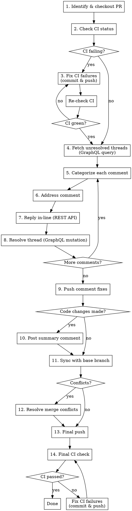

# Addressing PR Reviews

## Overview

Check for and fix CI failures first, then fetch and address all unresolved review comments (fix code or reply), resolve every thread, commit and push fixes, post a summary only when code changes were made, sync with base branch and resolve merge conflicts, and ensure CI is green before finishing.

## When to Use

- User asks to address/fix/respond to PR review comments
- User says "handle the PR feedback" or "resolve review comments"
- After a PR review round when comments need responses

## Workflow



## Step 1: Identify the PR

Get the PR number from the user's argument, or detect from the current branch:

```bash
# From argument
PR_NUMBER=42

# Or detect from current branch
gh pr view --json number -q '.number'
```

Check out the PR branch locally and get repo info:

```bash
gh pr checkout $PR_NUMBER

# Get owner/repo for API calls
OWNER=$(gh repo view --json owner -q '.owner.login')
REPO=$(gh repo view --json name -q '.name')
```

## Step 2: Check for Failed CI

**Before touching any code, check if CI is already failing.** Fix CI failures first — review comments are meaningless if the build is broken.

### Check CI status

```bash
gh pr checks $PR_NUMBER
```

### If CI is failing

1. **Read the failure logs:**

   ```bash
   gh pr checks $PR_NUMBER
   gh run view <RUN_ID> --log-failed
   ```

2. **Determine if the failure is pre-existing** (see "Claiming a failure is pre-existing" below). If it is, note it and move on. If not, fix it now.

3. **Diagnose and fix** — treat CI failures the same as any code fix:
   - Read the relevant test/build/lint output
   - Fix the root cause (don't just retry flaky tests)
   - Commit with a descriptive message:

     ```bash
     git commit -m "fix: correct type error caught by CI

     Addresses CI failure in build step"
     ```

4. **Push and re-check:**

   ```bash
   git push
   gh pr checks $PR_NUMBER --watch
   ```

5. **Repeat until all checks pass** (or are confirmed pre-existing). If you cannot get CI green after 3 attempts, stop and ask the user for guidance.

### If CI is green

Proceed to Step 3.

## Step 3: Fetch Unresolved Review Threads (GraphQL)

**CRITICAL: You MUST use GraphQL to fetch review threads.** REST API does not provide thread resolution status or thread IDs needed for resolving.

**Note:** Fetch threads now, before syncing with base — review comments reference specific lines that may shift after a rebase/merge.

```bash
gh api graphql -f query='
query($owner: String!, $repo: String!, $pr: Int!) {
  repository(owner: $owner, name: $repo) {
    pullRequest(number: $pr) {
      reviewThreads(first: 100) {
        nodes {
          id
          isResolved
          isOutdated
          path
          line
          comments(first: 50) {
            nodes {
              id
              databaseId
              body
              author { login }
              createdAt
            }
          }
        }
      }
    }
  }
}' -f owner='{owner}' -f repo='{repo}' -F pr=$PR_NUMBER
```

**Filter to unresolved threads only.** Skip any thread where `isResolved` is `true`.

## Step 4: Categorize Each Comment

For each unresolved thread, determine the type:

| Type                        | Signal                                      | Action                                          |
| --------------------------- | ------------------------------------------- | ----------------------------------------------- |
| **GitHub suggested change** | Body contains ` ```suggestion` block        | Apply the suggestion                            |
| **Change request**          | Requests a code modification                | Evaluate and fix, or push back                  |
| **Question**                | Asks "why", "how", "what"                   | Reply with explanation                          |
| **Nitpick/style**           | Prefixed with "nit:", minor formatting      | Fix without debate                              |
| **Outdated**                | `isOutdated: true` or code no longer exists | Reply noting it's been addressed by refactoring |
| **Conflicting reviewers**   | Multiple reviewers disagree on same topic   | Flag to user, don't pick a side                 |

## Step 5: Address Each Comment

### For code fixes (suggestions, change requests, nitpicks):

1. Read the relevant file and understand context
2. Make the fix
3. Commit with a descriptive message:

   ```bash
   git add src/file.ts
   git commit -m "fix: description of what was changed

   Addresses review feedback from @reviewer"
   ```

4. Reply and resolve (see Steps 6-7)

### For change requests you disagree with:

**Push back politely with technical reasoning.** Do NOT silently implement something that would introduce a bug or violate project conventions. Do NOT defer with "what do you think?" — state your position clearly.

Example reply:

> "I'd prefer to keep this as-is because [concrete technical reason]. The current approach [specific benefit]. Happy to discuss further if you see an issue I'm missing."

### For questions:

Read the code context, reply with a clear explanation of the reasoning. Reference specific code if helpful.

### For outdated comments:

Check if the issue still exists in the current code. If the code has been refactored and the issue no longer applies, reply noting that:

> "This code has been refactored since this comment — the concern is addressed in the current version at [location]."

### For conflicting reviewers:

**Do NOT pick a side.** Flag to the user:

> "Reviewers @alice and @bob disagree on this — Alice suggests X, Bob suggests Y. Which direction do you want to go?"

Wait for user input before proceeding.

## Step 6: Reply In-Line (REST API)

**NEVER `@`-mention bot/agent reviewers** (copilot\*, coderabbitai, etc.) in replies, comments, or commit messages — this re-triggers the bot to open a new review. Write "copilot" not "`@copilot`". Check `author.login` values from the GraphQL response; if any look automated, omit the `@` when referencing them.

Reply to the review comment thread using the **top-level comment's `databaseId`**:

```bash
gh api \
  --method POST \
  repos/{owner}/{repo}/pulls/$PR_NUMBER/comments/$COMMENT_DATABASE_ID/replies \
  -f body="Fixed — changed X to Y as suggested."
```

**Important:** The `comment_id` in the URL must be the `databaseId` of the **top-level** comment in the thread, not a reply.

## Step 7: Resolve Thread (GraphQL Mutation)

**CRITICAL: Thread resolution REQUIRES GraphQL. There is no REST endpoint for this.**

```bash
gh api graphql -f query='
mutation($threadId: ID!) {
  resolveReviewThread(input: { threadId: $threadId }) {
    thread {
      isResolved
    }
  }
}' -f threadId="$THREAD_NODE_ID"
```

The `threadId` is the `id` field from the review thread node fetched in Step 3 (a GraphQL node ID, not a database ID).

**Resolve EVERY thread after addressing it** — whether you made a code fix or just replied.

## Step 8: Push and Summarize

```bash
git push
```

**Post a summary comment ONLY if code changes were committed.** If you only replied to questions/discussions with no code changes, skip the summary.

**Reminder: do NOT `@`-mention bot reviewers in the summary.** Write their name without the `@` prefix to avoid re-triggering automated reviews.

Separate code changes from reply-only responses in the summary — do NOT count replies as fixes:

```bash
gh pr comment $PR_NUMBER --body "## Review Feedback Addressed

### Code Changes (3 commits pushed)
- Replaced md5 with bcrypt in \`src/auth.ts\` (feedback from alice)
- Increased timeout to 10000ms in \`src/api.ts\` (suggestion from bob)
- Added missing semicolon in \`src/api.ts\` (nitpick from bob)

### Replied (no code change)
- Explained Map usage rationale to alice
- Noted outdated comment on refactored code to alice

### Needs Discussion
- alice and bob disagree on axios vs fetch — awaiting direction"
```

## Step 9: Sync With Base and Resolve Conflicts

Now that review comments are addressed, sync with the base branch and resolve any merge conflicts.

```bash
BASE_BRANCH=$(gh pr view --json baseRefName -q '.baseRefName')
git fetch origin $BASE_BRANCH
```

If the project prefers rebase, use `git rebase origin/$BASE_BRANCH`. If it prefers merge, use `git merge origin/$BASE_BRANCH`. If uncertain, ask the user.

If conflicts appear:

- Run `git status --porcelain` and `git diff --name-only --diff-filter=U` to list unmerged files.
- Open each conflicted file, resolve markers (`<<<<<<<`, `=======`, `>>>>>>>`).
- Verify no conflict markers remain: `rg -n "<<<<<<<|=======|>>>>>>>"`.
- `git add <files>` and commit the resolution:
  ```bash
  git commit -m "chore: resolve merge conflicts with ${BASE_BRANCH}"
  ```

**Hard gate:** If any unmerged files or conflict markers remain, do not proceed. Only continue when the working tree is clean.

If no conflicts, skip to Step 10.

```bash
git push
```

## Step 10: Final CI Check

After all changes (CI fixes, review fixes, conflict resolution), confirm CI is green.

```bash
gh pr checks $PR_NUMBER --watch
```

If `gh pr checks --watch` is not available, poll manually:

```bash
gh pr checks $PR_NUMBER
```

Re-run this every 30-60 seconds until all checks have completed (no "pending" status remaining).

### If CI fails

1. **Read the failure logs:**

   ```bash
   gh pr checks $PR_NUMBER
   gh run view <RUN_ID> --log-failed
   ```

2. **Diagnose and fix** — same as Step 2.

3. **Push and re-check:**

   ```bash
   git push
   gh pr checks $PR_NUMBER --watch
   ```

4. **Repeat until all checks pass.**

### Claiming a failure is "pre-existing" or "unrelated"

**You MUST prove it.** Do not assume. Do not hand-wave. A CI failure that blocks this PR is this PR's problem regardless of who introduced the underlying issue.

To claim a failure is pre-existing, you must **verify that the same check also fails on the base branch:**

```bash
BASE_BRANCH=$(gh pr view $PR_NUMBER --json baseRefName -q '.baseRefName')
gh run list --branch $BASE_BRANCH --limit 5
```

If the same check passes on the base branch but fails on the PR branch, it is **not pre-existing** — it was introduced or surfaced by your changes. Fix it.

If you confirm the check also fails on the base branch:

- State this explicitly with evidence: "Check X also fails on `main` (run #12345)"
- **Ask the user if they want it fixed anyway.** The failure still blocks the PR whether or not this PR caused it. Do not decide for them — present the finding and let them choose:
  > "Check X also fails on `main` (run #12345), so this is a pre-existing issue. It's still blocking this PR though — would you like me to fix it here, or leave it for a separate PR?"
- **Do not silently dismiss it in a summary table**

### Deferring work ("tracked as follow-up")

**Never say something is "tracked as follow-up" unless you actually track it.** If you defer work, you must do one of:

1. **Create a GitHub issue:**
   ```bash
   gh issue create --title "Add test coverage for ErrorBoundary" \
     --body "Identified during PR #$PR_NUMBER review. ..."
   ```
2. **Add a TODO comment in code** with a linked issue number
3. **Add a work item** to whatever planning system the project uses

If none of the above are appropriate, or you're unsure where the user tracks work, **ask them at the end:**

> "There's a deferred item from this review (test coverage for ErrorBoundary). Where would you like me to track it — GitHub issue, TODO with link, or somewhere else?"

Do NOT silently skip it. Do NOT say "tracked as follow-up" and then track nothing. That is a lie.

### Hard gate

**All CI checks must be green before marking the task as done.** The only exception is checks you have **verified** also fail on the base branch, with evidence cited. If you cannot get CI green after 3 attempts, stop and ask the user for guidance.

## Common Mistakes

| Mistake                                                                             | Fix                                                                                                                                                                                   |
| ----------------------------------------------------------------------------------- | ------------------------------------------------------------------------------------------------------------------------------------------------------------------------------------- |
| Using REST API to resolve threads                                                   | Use GraphQL `resolveReviewThread` mutation                                                                                                                                            |
| Forgetting to filter resolved threads                                               | Check `isResolved` field, skip resolved                                                                                                                                               |
| Implementing everything blindly                                                     | Push back on suggestions that would introduce bugs                                                                                                                                    |
| Deferring on disagreements with "what do you think?"                                | State your position with technical reasoning                                                                                                                                          |
| Always posting a summary                                                            | Only post when code changes were committed                                                                                                                                            |
| Re-requesting review unprompted                                                     | Don't add reviewers unless the user asks                                                                                                                                              |
| Using wrong comment ID for replies                                                  | Use `databaseId` of top-level comment, not reply IDs                                                                                                                                  |
| Resolving without replying first                                                    | Always reply THEN resolve                                                                                                                                                             |
| `@`-mentioning a bot reviewer anywhere (replies, summary comments, commit messages) | Triggers the bot to start a new review cycle. Always omit the `@` — write "copilot" not "`@copilot`". Check `author.login` from GraphQL; if it looks automated, never `@`-mention it. |
| Declaring "done" with CI still pending or red                                       | Wait for all checks to pass before finishing                                                                                                                                          |
| Blindly retrying flaky tests                                                        | Read the logs, fix the root cause                                                                                                                                                     |
| Claiming CI failures are "pre-existing" without proof                               | Verify the same check fails on the base branch before dismissing                                                                                                                      |
| Saying "tracked as follow-up" without tracking anything                             | Create a GitHub issue, add a TODO, or be honest that you're skipping it                                                                                                               |
| Counting reply-only items or duplicates as "fixes" in summaries                     | Separate code changes from replies; never pad the count                                                                                                                               |

## Quick Reference

```
CI check:        gh pr checks {n} --watch          (Step 2 — fix first!)
CI logs:         gh run view {run-id} --log-failed
Fetch threads:   gh api graphql (reviewThreads query)
Reply:           gh api POST repos/{o}/{r}/pulls/{n}/comments/{id}/replies
Resolve thread:  gh api graphql (resolveReviewThread mutation)
Push:            git push
Summary:         gh pr comment {n} --body "..." (only if fixes made)
Sync base:       git fetch origin {base} && git rebase/merge
Final CI:        gh pr checks {n} --watch           (Step 10 — all green)
```
