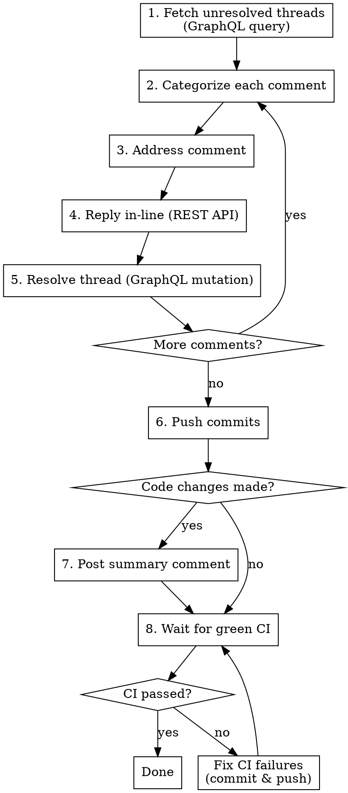

# Addressing PR Reviews

## Overview

Fetch all unresolved review comments on a GitHub PR, address each one (fix code
or reply), resolve every thread, commit and push fixes, post a summary only when
code changes were made, sync with the base branch, and ensure CI, review state,
and mergeability are all clean in the same final pass before finishing.

## Closure Loop Hard Gate

Run remediation as a bounded loop, not a one-shot checklist. Every pass must
refresh all three PR readiness axes:

```bash
gh pr checks $PR_NUMBER
gh api graphql -f query='<reviewThreads query from Step 2>' -f owner="$OWNER" -f repo="$REPO" -F pr=$PR_NUMBER
gh pr view $PR_NUMBER --json mergeable,mergeStateStatus,reviewDecision,url
```

Fix the highest-priority blocker first:

| Priority | Blocker                         | Required action                                      |
| -------- | ------------------------------- | ---------------------------------------------------- |
| 1        | Failed or pending required CI   | Inspect logs, fix root cause, validate, commit, push |
| 2        | Merge conflicts / stale branch  | Rebase on base, resolve conflicts, push              |
| 3        | Unresolved automated threads    | Reply/fix/resolve all bot threads                    |
| 4        | Unresolved human review threads | Reply/fix/resolve all human threads                  |
| 5        | Non-approving review decision   | Report remaining approval state                      |

After any commit, push, rebase, comment reply, or thread resolution, restart the
loop from the inventory commands. Finish only when one pass proves CI is green
or base-branch failure is proven, unresolved threads are zero except conflicts
awaiting user input, mergeability is not blocked, and the local worktree is
clean. If three consecutive passes do not reduce blockers, stop and report the
exact evidence and decision needed.

## When to Use

- User asks to address/fix/respond to PR review comments
- User says "handle the PR feedback" or "resolve review comments"
- After a PR review round when comments need responses

## Workflow



## Step 1: Identify the PR

Get the PR number from the user's argument, or detect from the current branch:

```bash
# From argument
PR_NUMBER=42

# Or detect from current branch
gh pr view --json number -q '.number'
```

Check out the PR branch locally and get repo info:

```bash
gh pr checkout $PR_NUMBER

# Get owner/repo for API calls
OWNER=$(gh repo view --json owner -q '.owner.login')
REPO=$(gh repo view --json name -q '.name')
```

## Step 1.5: Sync With Base and Resolve Conflicts (If Needed)

Before addressing review comments, ensure the PR branch is up to date and free
of merge conflicts.

```bash
BASE_BRANCH=$(gh pr view --json baseRefName -q '.baseRefName')
git fetch origin $BASE_BRANCH
```

Anvil prefers rebasing PR branches onto the latest base branch:

```bash
git rebase origin/$BASE_BRANCH
```

Use `git merge origin/$BASE_BRANCH` only when the user explicitly asks for a
merge commit.

If conflicts appear:

- **STOP and resolve conflicts before doing any review work.**
- Run `git status --porcelain` and `git diff --name-only --diff-filter=U` to
  list unmerged files.
- Open each conflicted file, resolve markers (`<<<<<<<`, `=======`, `>>>>>>>`).
- Verify no conflict markers remain: `rg -n "<<<<<<<|=======|>>>>>>>"`.
- `git add <files>` and commit the resolution:
  ```bash
  git commit -m "chore: resolve merge conflicts with ${BASE_BRANCH}"
  ```

**Hard gate:** If any unmerged files or conflict markers remain, do not proceed.
Only continue when the working tree is clean.

## Step 2: Fetch Unresolved Review Threads (GraphQL)

**CRITICAL: You MUST use GraphQL to fetch review threads.** REST API does not
provide thread resolution status or thread IDs needed for resolving.

```bash
gh api graphql -f query='
query($owner: String!, $repo: String!, $pr: Int!) {
  repository(owner: $owner, name: $repo) {
    pullRequest(number: $pr) {
      reviewThreads(first: 100) {
        nodes {
          id
          isResolved
          isOutdated
          path
          line
          comments(first: 50) {
            nodes {
              id
              databaseId
              body
              author { login }
              createdAt
            }
          }
        }
      }
    }
  }
}' -f owner='{owner}' -f repo='{repo}' -F pr=$PR_NUMBER
```

**Filter to unresolved threads only.** Skip any thread where `isResolved` is
`true`.

## Step 3: Categorize Each Comment

For each unresolved thread, determine the type:

| Type                        | Signal                                      | Action                                          |
| --------------------------- | ------------------------------------------- | ----------------------------------------------- |
| **GitHub suggested change** | Body contains ` ```suggestion` block        | Apply the suggestion                            |
| **Change request**          | Requests a code modification                | Evaluate and fix, or push back                  |
| **Question**                | Asks "why", "how", "what"                   | Reply with explanation                          |
| **Nitpick/style**           | Prefixed with "nit:", minor formatting      | Fix without debate                              |
| **Outdated**                | `isOutdated: true` or code no longer exists | Reply noting it's been addressed by refactoring |
| **Conflicting reviewers**   | Multiple reviewers disagree on same topic   | Flag to user, don't pick a side                 |

## Step 4: Address Each Comment

### For code fixes (suggestions, change requests, nitpicks):

1. Read the relevant file and understand context
2. Make the fix
3. Commit with a descriptive message:

   ```bash
   git add src/file.ts
   git commit -m "fix: description of what was changed

   Addresses review feedback from @reviewer"
   ```

4. Reply and resolve (see Steps 5-6)

### For change requests you disagree with:

**Push back politely with technical reasoning.** Do NOT silently implement
something that would introduce a bug or violate project conventions. Do NOT
defer with "what do you think?" — state your position clearly.

Example reply:

> "I'd prefer to keep this as-is because [concrete technical reason]. The
> current approach [specific benefit]. Happy to discuss further if you see an
> issue I'm missing."

### For questions:

Read the code context, reply with a clear explanation of the reasoning.
Reference specific code if helpful.

### For outdated comments:

Check if the issue still exists in the current code. If the code has been
refactored and the issue no longer applies, reply noting that:

> "This code has been refactored since this comment — the concern is addressed
> in the current version at [location]."

### For conflicting reviewers:

**Do NOT pick a side.** Flag to the user:

> "Reviewers @alice and @bob disagree on this — Alice suggests X, Bob suggests
> Y. Which direction do you want to go?"

Wait for user input before proceeding.

## Step 5: Reply In-Line (REST API)

Reply to the review comment thread using the **top-level comment's
`databaseId`**:

```bash
gh api \
  --method POST \
  repos/{owner}/{repo}/pulls/$PR_NUMBER/comments/$COMMENT_DATABASE_ID/replies \
  -f body="Fixed — changed X to Y as suggested."
```

**Important:** The `comment_id` in the URL must be the `databaseId` of the
**top-level** comment in the thread, not a reply.

## Step 6: Resolve Thread (GraphQL Mutation)

**CRITICAL: Thread resolution REQUIRES GraphQL. There is no REST endpoint for
this.**

```bash
gh api graphql -f query='
mutation($threadId: ID!) {
  resolveReviewThread(input: { threadId: $threadId }) {
    thread {
      isResolved
    }
  }
}' -f threadId="$THREAD_NODE_ID"
```

The `threadId` is the `id` field from the review thread node fetched in Step 2
(a GraphQL node ID, not a database ID).

**Resolve EVERY thread after addressing it** — whether you made a code fix or
just replied.

## Step 7: Push and Summarize

```bash
git push
```

**Post a summary comment ONLY if code changes were committed.** If you only
replied to questions/discussions with no code changes, skip the summary.

Separate code changes from reply-only responses in the summary — do NOT count
replies as fixes:

```bash
gh pr comment $PR_NUMBER --body "## Review Feedback Addressed

### Code Changes (3 commits pushed)
- Replaced md5 with bcrypt in \`src/auth.ts\` (feedback from @alice)
- Increased timeout to 10000ms in \`src/api.ts\` (suggestion from @bob)
- Added missing semicolon in \`src/api.ts\` (nitpick from @bob)

### Replied (no code change)
- Explained Map usage rationale to @alice
- Noted outdated comment on refactored code to @alice

### Needs Discussion
- @alice and @bob disagree on axios vs fetch — awaiting direction"
```

## Step 8: Wait for Green CI And Final Readiness

After pushing, run the closure pass. **Do not consider the work done until CI,
review threads, mergeability, and the local worktree are clean in the same
pass.**

### Check CI status

```bash
# Wait for checks to start (give CI a moment to pick up the push)
sleep 5

# Watch checks until they complete
gh pr checks $PR_NUMBER --watch

# Re-check review and merge readiness after CI settles
gh api graphql -f query='<reviewThreads query from Step 2>' -f owner="$OWNER" -f repo="$REPO" -F pr=$PR_NUMBER
gh pr view $PR_NUMBER --json mergeable,mergeStateStatus,reviewDecision,url
git status --short
```

If `gh pr checks --watch` is not available, poll manually:

```bash
gh pr checks $PR_NUMBER
```

Re-run this every 30-60 seconds until all checks have completed (no "pending"
status remaining).

### If CI fails

1. **Read the failure logs:**

   ```bash
   # List failed checks
   gh pr checks $PR_NUMBER

   # Get the failing run's logs
   gh run view <RUN_ID> --log-failed
   ```

2. **Diagnose and fix** — treat CI failures the same as any code fix:
   - Read the relevant test/build/lint output
   - Fix the root cause (don't just retry flaky tests)
   - Commit with a descriptive message:

     ```bash
     git commit -m "fix: correct type error caught by CI

     Addresses CI failure in build step"
     ```

3. **Push and re-check:**

   ```bash
   git push
   gh pr checks $PR_NUMBER --watch
   ```

4. **Repeat the closure loop until all checks pass and review/merge state is
   clean.** If a failure appears unrelated, prove the same check fails on the
   base branch before treating it as pre-existing, then inform the user.

### Hard gate

**All CI checks must be green, all resolvable threads resolved, mergeability not
blocked, and the local worktree clean before marking the task as done.** If
three consecutive passes do not reduce the blocker count, stop and ask the user
for guidance with evidence.

## Common Mistakes

| Mistake                                                              | Fix                                                                     |
| -------------------------------------------------------------------- | ----------------------------------------------------------------------- |
| Using REST API to resolve threads                                    | Use GraphQL `resolveReviewThread` mutation                              |
| Forgetting to filter resolved threads                                | Check `isResolved` field, skip resolved                                 |
| Implementing everything blindly                                      | Push back on suggestions that would introduce bugs                      |
| Deferring on disagreements with "what do you think?"                 | State your position with technical reasoning                            |
| Always posting a summary                                             | Only post when code changes were committed                              |
| Re-requesting review unprompted                                      | Don't add reviewers unless the user asks                                |
| Using wrong comment ID for replies                                   | Use `databaseId` of top-level comment, not reply IDs                    |
| Resolving without replying first                                     | Always reply THEN resolve                                               |
| Re-tagging a bot/agent (e.g. `@copilot`, `@coderabbitai`) in a reply | This triggers the bot to open a new review or PR — omit the `@` mention |
| Declaring "done" after fixing only CI, reviews, or conflicts         | Re-run the closure loop and prove all three are clean together          |
| Declaring "done" with CI still pending or red                        | Wait for all checks to pass before finishing                            |
| Blindly retrying flaky tests                                         | Read the logs, fix the root cause                                       |
| Blocking on unrelated CI failures                                    | Note them in the summary, inform the user                               |

## Quick Reference

```
Fetch threads:   gh api graphql (reviewThreads query)
Reply:           gh api POST repos/{o}/{r}/pulls/{n}/comments/{id}/replies
Resolve thread:  gh api graphql (resolveReviewThread mutation)
Push:            git push
Summary:         gh pr comment {n} --body "..." (only if fixes made)
CI check:        gh pr checks {n} --watch
CI logs:         gh run view {run-id} --log-failed
Merge state:     gh pr view {n} --json mergeable,mergeStateStatus,reviewDecision
```
