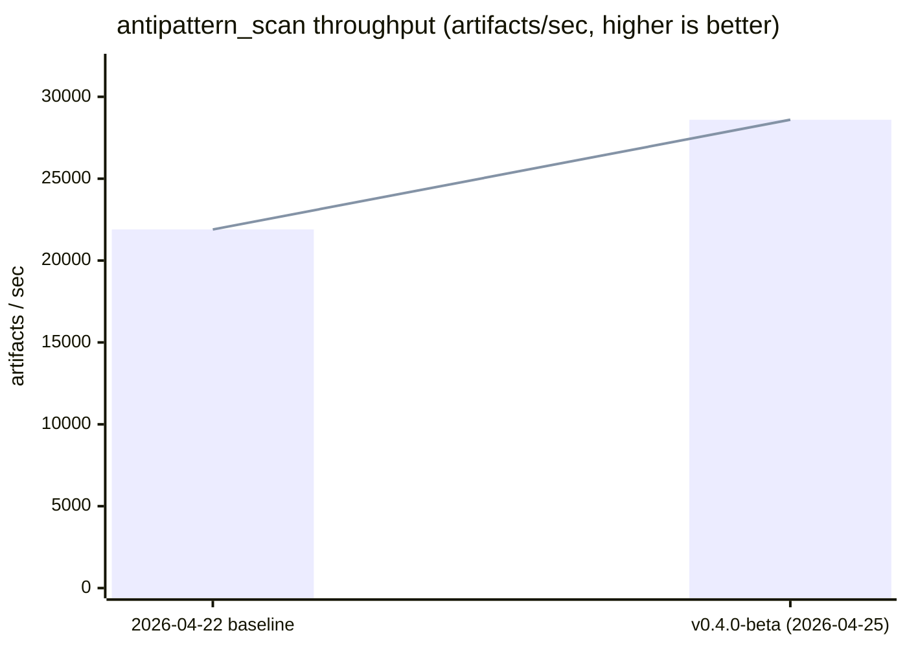

# anvil

<p align="center">
  
</p>

> **AI agents make software probabilistic. anvil makes it deterministic.**

anvil enforces policy at generation time, not at review. It sits between
probabilistic AI agents and production code as a deterministic governance layer
that catches architectural drift, anti-patterns, security risks, and policy
violations **before they ever leave the developer's machine.**

**[→ Early access at eddacraft.ai](https://eddacraft.ai)** ·
[Docs](https://docs.eddacraft.ai/anvil/overview) ·
[GTM strategy](https://github.com/eddacraft/eddacraft-gtm) ·
[Brand & design](https://github.com/eddacraft/brand-and-design)

## Hero stats

```
10 µs      save-time check (incremental file update)
800 ns     full policy evaluation, all invariants
14.5 ms    cold graph build, 100-file codebase
0          perceptible delay
```

Measured 2026-04-03 against the Rust kernel via Criterion (100 samples, release
build). Governance overhead is effectively zero — anvil is in a different
category from SAST, not a faster scanner.

See [`crates/anvil-bench/`](./crates/anvil-bench/) for the harness and
[the GTM benchmark report](https://github.com/eddacraft/eddacraft-gtm/blob/main/competitive/anvil-benchmarks-2026-04-03.md)
for marketing-ready proof points.

## What anvil is

**Agentic engineering governance** — a category being defined right now. anvil
is not a SAST scanner, not a linter, not an observability product, not a
compliance dashboard. It is the governance layer that complements and constrains
AI coding tools (Cursor, Copilot, Codex) in real time, in the developer workflow
— _not_ in the PR queue.

For full positioning, ICP definition, competitive intelligence, and the GTM
primer, see
[`eddacraft/eddacraft-gtm`](https://github.com/eddacraft/eddacraft-gtm).

## Why now

The **EU AI Act becomes substantially enforceable on 2 August 2026** — under
four months out. High-risk obligations (Annex III), Article 50 transparency,
conformity assessments, technical documentation, CE marking, and EU database
registration all become required by that date for in-scope systems. Every
EU-exposed engineering team now has a hard deadline to prove their agents are
governed.

At the same time, adjacent funding tells the same story: Qodo closed a $70M
Series B and DAM Secure closed a $4M seed in the same week (April 2026);
Microsoft, GitHub, Cisco, Zapier, Nvidia, and JetBrains are all shipping
adjacent primitives in Q1–Q2 2026. The category is being built right now.

Full market context and the parallel-track ICP framing that follows from this
deadline live in
[`eddacraft-gtm/GTM-PRIMER.md`](https://github.com/eddacraft/eddacraft-gtm/blob/main/GTM-PRIMER.md).

## Related repos

| Repo                                                                          | Purpose                                                                       |
| ----------------------------------------------------------------------------- | ----------------------------------------------------------------------------- |
| [`eddacraft/eddacraft-gtm`](https://github.com/eddacraft/eddacraft-gtm)       | GTM strategy, positioning, competitive radar, market signals, benchmark proof |
| [`eddacraft/brand-and-design`](https://github.com/eddacraft/brand-and-design) | Visual identity, design system, deck templates, brand assets                  |
| [`eddacraft/anvil-plan-spec`](https://github.com/eddacraft/anvil-plan-spec)   | The APS planning format used throughout this repo                             |

## Install

Get the latest release from
[**install.eddacraft.ai**](https://install.eddacraft.ai) — auto-detects your OS
and highlights the recommended command.

```bash
# Linux / macOS
curl --proto '=https' --tlsv1.2 -LsSf \
  https://github.com/eddacraft/anvil/releases/latest/download/eddacraft-anvil-installer.sh | sh

# macOS (Homebrew)
brew install eddacraft/tap/anvil
```

```powershell
# Windows (PowerShell)
irm https://github.com/eddacraft/anvil/releases/latest/download/eddacraft-anvil-installer.ps1 | iex

# Windows (WinGet)
winget install eddacraft.anvil

# Windows (Scoop)
scoop bucket add eddacraft https://github.com/eddacraft/scoop-bucket
scoop install anvil
```

---

## For contributors

[](https://github.com/eddacraft/anvil-001/actions/workflows/ci.yml)
[](https://nx.dev/)
[](https://pnpm.io/)
[](https://www.typescriptlang.org/)
[](https://www.rust-lang.org/)
[](https://nodejs.org/)

eddacraft monorepo. Currently home to **anvil** — a deterministic development
automation platform that catches architecture drift and AI anti-patterns at file
save, before they reach code review.

Current trust/provenance direction includes line-level authorship attribution
planning (human/AI/mixed/unknown + model metadata + confidence), tracked in APS
module `LAC` and governed by ADR-014 (TypeScript vs Rust allocation tree).

Contributor workflow quick links:

- [Branching strategy](docs/guides/branching-strategy.md) — `main`/`dev` release
  and integration flow
- [Worktree policy](docs/guides/worktree-policy.md) — permanent vs disposable
  worktrees
- [Release runbook](docs/guides/release-runbook.md) — direct promotion vs
  `release/*` stabilisation
- [Contributing](CONTRIBUTING.md) — setup, commands, and submission checklist

## Vision

anvil ensures AI and humans cannot produce unsafe software.

AI generates code, infrastructure, and decisions at unprecedented speed. anvil
acts as a deterministic governance layer in the developer workflow, intercepting
and validating changes at the moment of creation.

It prevents:

- Anti-patterns
- Security risks
- Policy violations

Before they are ever executed. Only correct, compliant, and safe outcomes are
allowed to proceed.

## Repository Structure

This is an NX-managed pnpm workspace containing the following apps, packages,
and tooling.

### Root files

| File                       | Purpose                                                                    |
| -------------------------- | -------------------------------------------------------------------------- |
| `package.json`             | Workspace scripts, shared devDependencies, and package manager constraints |
| `pnpm-workspace.yaml`      | Workspace package discovery for apps, packages, tools, and infra           |
| `nx.json`                  | Nx task and workspace configuration                                        |
| `rust-toolchain.toml`      | Pinned Rust toolchain for workspace crates                                 |
| `dist-workspace.toml`      | `cargo-dist` release configuration for Rust binaries                       |
| `.anvilrc`                 | Repository-level anvil configuration                                       |
| `.node-version` / `.nvmrc` | Node version hints for CI and local tooling                                |

### Apps

| Directory                 | Package                         | Description                                                  | Deployment |
| ------------------------- | ------------------------------- | ------------------------------------------------------------ | ---------- |
| `apps/admin-cli`          | `@eddacraft/anvil-admin-cli`    | Operator CLI for beta/admin workflows                        | —          |
| `apps/anvil-api`          | —                               | API service                                                  | Vercel     |
| `apps/anvil-docs-private` | `@eddacraft/anvil-docs-private` | Private Docusaurus docs app                                  | Vercel     |
| `apps/docs-public`        | `@eddacraft/docs-public`        | Public Docusaurus docs app                                   | Vercel     |
| `apps/docs-shell`         | `@eddacraft/docs-shell`         | Documentation shell and auth/proxy entrypoint                | Vercel     |
| `apps/docs-site`          | `@eddacraft/docs-site`          | Legacy docs app retained during the docs-platform transition | Vercel     |
| `apps/e2e`                | —                               | End-to-end Vitest harness                                    | —          |
| `apps/website`            | `@eddacraft/anvil-website`      | Marketing website (Next.js)                                  | Vercel     |

### Packages — anvil core

| Directory                  | Package                      | Description                                               |
| -------------------------- | ---------------------------- | --------------------------------------------------------- |
| `packages/anvil/contracts` | `@eddacraft/anvil-contracts` | Schemas, types, and events with zero dependencies         |
| `packages/anvil/ports`     | `@eddacraft/anvil-ports`     | Interface definitions depending only on contracts         |
| `packages/anvil/core`      | `@eddacraft/anvil-core`      | Pure domain logic depending on ports and contracts        |
| `packages/anvil/runtime`   | `@eddacraft/anvil-runtime`   | Orchestration and I/O depending on core, ports, contracts |
| `packages/anvil/policy`    | `@eddacraft/anvil-policy`    | OPA/Rego wrappers depending on contracts                  |

### Packages — Ecosystem

| Directory                       | Package                                 | Description                                       |
| ------------------------------- | --------------------------------------- | ------------------------------------------------- |
| `packages/adapters`             | `@eddacraft/anvil-adapters`             | Format converters (SpecKit, BMAD)                 |
| `packages/aps`                  | `@eddacraft/anvil-aps`                  | APS document parser                               |
| `packages/eslint-plugin-anvil`  | `eslint-plugin-anvil`                   | ESLint rules for test quality enforcement         |
| `packages/vscode-extension`     | `anvil-vscode`                          | VS Code integration                               |
| `packages/kindling-integration` | `@eddacraft/anvil-kindling-integration` | Kindling memory integration contracts             |
| `packages/edda-stack`           | `@eddacraft/anvil-edda-stack`           | Observation, proposal, and memory lifecycle stack |
| `packages/mcp-server`           | `@eddacraft/anvil-mcp-server`           | MCP tools, resources, and prompts                 |
| `packages/libs/render`          | `@eddacraft/render`                     | Shared render-layer utilities                     |
| `packages/shared`               | —                                       | Shared cross-cutting utilities                    |
| `packages/transactional`        | `@eddacraft/transactional`              | Shared transactional email templates              |

### Packages — Tooling

| Directory                        | Description                      |
| -------------------------------- | -------------------------------- |
| `packages/tooling/tsconfig`      | Shared TypeScript configurations |
| `packages/tooling/eslint-config` | Shared ESLint configurations     |

### Crates (Rust)

| Directory                   | Description                                               |
| --------------------------- | --------------------------------------------------------- |
| `crates/anvil-cli`          | Native CLI binary (cross-platform: macOS, Linux, Windows) |
| `crates/anvil-kernel`       | Rust kernel — watcher, parser, semantic graph, policy     |
| `crates/anvil-kernel-types` | Shared types for the Rust kernel (events, graph, trust)   |
| `crates/anvil-architecture` | Architecture rule evaluation                              |
| `crates/anvil-bench`        | Stress-test harness for capacity discovery                |
| `crates/anvil-checks`       | Gate checks ported to Rust (secret scan, anti-pattern)    |
| `crates/anvil-policy`       | OPA/policy evaluation engine                              |
| `crates/anvil-tui`          | Ratatui TUI surfaces (dashboard, wizard, gate explorer)   |
| `crates/spike`              | Validation spikes for tree-sitter, notify-rs, petgraph    |

### Infrastructure

| Directory | Package                  | Description                     |
| --------- | ------------------------ | ------------------------------- |
| `infra`   | `@eddacraft/anvil-infra` | Pulumi IaC (Vercel, DNS, cloud) |

### Tools

| Directory          | Description                          |
| ------------------ | ------------------------------------ |
| `tools/scripts`    | Build and utility scripts            |
| `tools/generators` | NX code generators                   |
| `tools/codemods`   | Codemod transformations              |
| `tools/nx-rust`    | NX plugin for Rust crate integration |
| `tools/test-utils` | Shared test utilities and fixtures   |

### Plans

| Directory         | Description                     |
| ----------------- | ------------------------------- |
| `plans/modules`   | APS module specs and work items |
| `plans/decisions` | Architecture decision records   |
| `plans/execution` | Step-level execution evidence   |

## Getting Started

### Prerequisites

- **Node.js** >= 22.13.0 (minimum per `package.json` engines); **Node 24** is
  the recommended/pinned version for contributors — see `.nvmrc` /
  `.node-version`
- **pnpm** >= 10.20.0
- **Rust toolchain** (for crates) — install via [rustup](https://rustup.rs/)
- **cargo-llvm-cov** (optional, for Rust coverage) —
  `cargo install cargo-llvm-cov`
- **cargo-nextest** (optional, required by `pnpm test:coverage:rust`) —
  `cargo install cargo-nextest --locked`

### Setup

```bash
git clone https://github.com/eddacraft/anvil-001.git
cd anvil-001
pnpm install
pnpm build
```

### Common Commands

```bash
# Build all packages
pnpm build

# Run tests
pnpm test

# Type checking
pnpm typecheck

# Linting
pnpm lint

```

NX is used under the hood — you can also use `npx nx` commands directly for
targeted builds, affected-only runs, and task graph visualisation.

## Test Coverage

Coverage data changes frequently enough that the repository README should point
to the commands and CI artefacts rather than freeze a per-project table that
goes stale.

### Running coverage

```bash
# Full monorepo (TypeScript + Rust)
pnpm test:coverage

# TypeScript only (via Nx — runs project-level Vitest configs)
pnpm test:coverage:ts

# Rust only (cargo-llvm-cov → target/llvm-cov/html/)
pnpm test:coverage:rust

# E2E harness (kept separate from coverage totals)
pnpm test:e2e:harness
```

Coverage output is written to the root `coverage/` directory (HTML, JSON, and
JSON summary), which is the path used by the built-in coverage gate check.

## Rust Kernel Benchmarks

The Rust kernel (`anvil-kernel`) includes Criterion micro-benchmarks for
regression detection. These validate the performance targets defined in the
[Kernel Spec](./docs/architecture/rust-kernel-spec.md).

### Performance Targets vs Measured

The kernel was designed against the targets in the
[Kernel Spec](./docs/architecture/rust-kernel-spec.md). The 2026-04-03 benchmark
run (rayon-parallel parser, release build, Criterion 100 samples):

| Metric                                    | Target      | Measured (2026-04-03)      | Status                            |
| ----------------------------------------- | ----------- | -------------------------- | --------------------------------- |
| Cold graph build, 100 files               | —           | **14.5 ms**                | Validated                         |
| Cold graph build, 1,000 files             | —           | **~565 ms** (extrapolated) | Validated                         |
| Cold graph build, 2,500 files             | —           | **~3.4 s** (extrapolated)  | Validated                         |
| Cold graph build, 100k LOC / ~2,000 files | < 3 seconds | Pending stress harness     | Pending                           |
| Incremental update (single file)          | < 100 ms    | **10.7 µs**                | Validated · ~10,000× under target |
| Policy evaluation (all invariants)        | —           | **799 ns**                 | Validated                         |
| Event emission (1,000 events)             | < 10 ms     | **408 µs**                 | Validated · ~25× under target     |
| Memory footprint (medium repo)            | < 500 MB    | Pending stress test        | Pending                           |
| File detection latency (p99)              | < 20 ms     | Validated (spike)          | Validated                         |
| tree-sitter parse (single file)           | < 1 ms      | Validated (spike + bench)  | Validated                         |

Full benchmark report and marketing-ready angles:
[`eddacraft-gtm/competitive/anvil-benchmarks-2026-04-03.md`](https://github.com/eddacraft/eddacraft-gtm/blob/main/competitive/anvil-benchmarks-2026-04-03.md)

### Scan throughput across releases

`anvil-bench` measures end-to-end scanner throughput on a 320-artifact mixed
corpus (60% source, 20% docs, 10% commit messages, 10% agent output) on a fixed
dev machine (Ubuntu 25.04 / Linux 6.17 / rayon default thread pool) so
cross-release numbers stay honest.

| Release         | Date       | Per-pass time | Throughput              | Notes                                                                       |
| --------------- | ---------- | ------------- | ----------------------- | --------------------------------------------------------------------------- |
| pre-RUSTNX-008  | 2026-04-22 | 14.6 ms       | 21.9K artifacts/sec     | Baseline before workspace-hack                                              |
| **v0.4.0-beta** | 2026-04-25 | **11.2 ms**   | **28.6K artifacts/sec** | **+31%**; `serde_json` `preserve_order` feature unification did not regress |



Each release adds a row so scan-path drift is visible over time. Per-run detail
lives in [`crates/anvil-bench/README.md`](./crates/anvil-bench/README.md).

### Benchmark Groups

| Group                       | What it measures                                   | Scale                                |
| --------------------------- | -------------------------------------------------- | ------------------------------------ |
| `cold_graph_build`          | Full scan → parse → graph build                    | 10, 50, 100, 500, 1k, 5k files       |
| `incremental_update`        | Reparse + graph delta for single file change       | 1 file                               |
| `incremental_update_varied` | Parse + graph update for files of varying size     | 10, 100, 500, 1000 LOC               |
| `policy_evaluation`         | All H1 invariants evaluated on one delta           | 1 delta, 4 invariants                |
| `policy_scaling`            | Policy evaluation with varied invariant/delta size | 4–50 invariants × 1–50 symbol deltas |
| `event_emission`            | 1000 progress events through mpsc channel          | 1000 events                          |
| `graph_query`               | `symbols_in_file` and `outgoing_edges` lookups     | 1k, 5k, 10k node graphs              |
| `debouncer_throughput`      | Record + tick cycle under burst and backpressure   | 100, 500, 1000 pending changes       |

### Running Benchmarks

```bash
# Run all Criterion micro-benchmarks
cargo bench --bench kernel

# Run a specific group
cargo bench --bench kernel -- cold_graph_build
cargo bench --bench kernel -- incremental_update
cargo bench --bench kernel -- incremental_update_varied
cargo bench --bench kernel -- policy_evaluation
cargo bench --bench kernel -- policy_scaling
cargo bench --bench kernel -- event_emission
cargo bench --bench kernel -- graph_query
cargo bench --bench kernel -- debouncer_throughput
```

Criterion produces HTML reports in `target/criterion/` — open
`target/criterion/report/index.html` for detailed charts and comparison against
previous runs.

### Planned Extensions

The [Kernel Benchmarking Spec](./docs/architecture/kernel-benchmarking-spec.md)
defines a stress-test harness (`anvil-bench`) for capacity discovery — watcher
saturation, graph memory ceiling, incremental throughput under sustained load,
and cold start scaling. See the
[BENCH module](./plans/modules/kernel-benchmarking.aps.md) for Phase 2 and Phase
3 work items.

## Deployment

| App                  | Platform        | Trigger                                               |
| -------------------- | --------------- | ----------------------------------------------------- |
| `anvil` (Rust)       | GitHub Releases | Git tag (`v*`) via `release.yml` (cargo-dist)         |
| `anvil-cli` (legacy) | npm             | Git tag (`v*`) via `publish.yml` GitHub Action        |
| `docs-site`          | Vercel          | Push to `main` (automatic via Vercel Git integration) |
| `website`            | Vercel          | Push to `main` (automatic via Vercel Git integration) |
| `anvil-api`          | Vercel          | Push to `main` (automatic via Vercel Git integration) |

### Native Binary Targets

The Rust CLI is built for the following platforms via cargo-dist:

| Platform | Architecture            | Binary      |
| -------- | ----------------------- | ----------- |
| macOS    | x86_64                  | `anvil`     |
| macOS    | aarch64 (Apple Silicon) | `anvil`     |
| Linux    | x86_64                  | `anvil`     |
| Linux    | aarch64                 | `anvil`     |
| Windows  | x86_64                  | `anvil.exe` |

> Windows aarch64 is not yet shipped via `cargo-dist` / GitHub Releases —
> axoupdater has no prebuilt binary for that target, so it is excluded from the
> `cargo-dist` matrix until upstream support lands. The target is still built in
> Rust CI (`.github/workflows/rust.yml`).

## CI/CD

The repository has several GitHub Actions workflows:

- **ci.yml** — Lint, typecheck, test, and build on every push and PR. Runs
  against Node.js 20.x and 22.x with smart change detection (docs-only changes
  skip code tests).
- **publish.yml** — Publishes `@eddacraft/anvil-cli` to npm on version tags
  (`v*`) by default (beta tags are forced CLI-only). Workspace package
  publishing is manual/explicit only. Validates tag/package version alignment,
  runs the full test suite, and creates a GitHub release.
- **security.yml** — SAST (Semgrep), dependency audit, secret scan, and licence
  compliance on every PR.
- **labeler.yml** — Automatic PR labelling based on changed paths.
- **infra.yml** — Infrastructure provisioning and validation.
- **bench.yml** — Rust kernel benchmark runs.
- **codeql.yml** — GitHub CodeQL static analysis.
- **rust.yml** — Rust CI (clippy, test, format).

A reusable **Anvil Check** GitHub Action (that is the action's declared name) is
also provided at `.github/actions/anvil-check/` for running anvil analysis in
your own workflows.

## Code Conventions

- **UK English** — organise, colour, behaviour
- **ESM with .js extensions** — `import { foo } from './bar.js'`
- **Zod-first schemas** — Define with Zod, export inferred types
- **Tests co-located** — `file.ts` + `file.test.ts`

## Contributing

1. Fork and clone
2. Create feature branch: `git checkout -b feature/my-feature`
3. Make changes, run
   `pnpm format:check && pnpm lint:check && pnpm typecheck && pnpm test`
4. `git commit` will also run the Husky pre-commit hook, which applies
   `lint-staged` fixes and re-checks staged `oxfmt`-managed files
5. Open PR

See [AGENTS.md](./AGENTS.md) for AI-assisted development instructions.

## Documentation

| Document                                                                | Description                                 |
| ----------------------------------------------------------------------- | ------------------------------------------- |
| [Quick Start](./docs/public/anvil/quickstart.md)                        | Get running in 5 minutes                    |
| [CLI README](./crates/anvil-cli/README.md)                              | Native CLI binary overview                  |
| [First Project](./docs/public/anvil/first-project.md)                   | Real-world setup example                    |
| [Troubleshooting](./docs/public/anvil/operations/troubleshooting.md)    | Common issues and solutions                 |
| [Configuration](./docs/public/anvil/operations/config.md)               | Configuration options                       |
| [Architecture](./docs/architecture/overview.md)                         | System design                               |
| [Release Runbook](./docs/guides/release-runbook.md)                     | Safe CLI release checklist                  |
| [Plans](./plans/index.aps.md)                                           | Detailed roadmap                            |
| [LAC Module](./plans/modules/lineage-authorship-confidence.aps.md)      | Line-level authorship + confidence planning |
| [ADR-014](./plans/decisions/014-language-allocation-tree-ts-vs-rust.md) | TS vs Rust language allocation policy       |
