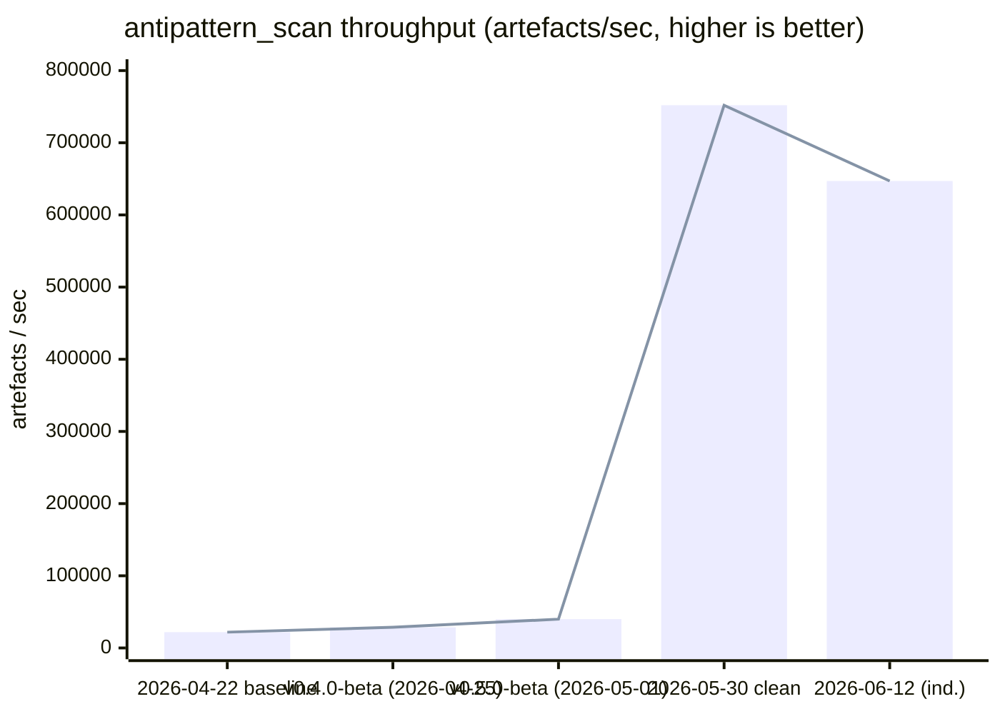

# anvil

| Type   | Authority | Owner  | Status | Freshness                                                                                                                                                       |
| ------ | --------- | ------ | ------ | --------------------------------------------------------------------------------------------------------------------------------------------------------------- |
| README | Advisory  | DOCGOV | Live   | Bench sections refreshed 2026-06-17 from `benchmarks/history/2026-05-30.json` (clean) + `benchmarks/history/2026-06-12.json` (partial); prior review 2026-06-12 |

| Upstream                                               | Downstream                        |
| ------------------------------------------------------ | --------------------------------- |
| `RELEASE-PLAN.md`, `plans/index.aps.md`, docs policies | Repository users and contributors |

<p align="center">
  
</p>

> **AI agents make software probabilistic. anvil makes it deterministic.**

anvil enforces policy at generation time, not at review. It sits between
probabilistic AI agents and production code as a deterministic governance layer
that catches architectural drift, anti-patterns, security risks, and policy
violations **before they ever leave the developer's machine.**

**[→ Early access at eddacraft.ai](https://eddacraft.ai)** ·
[Docs](https://docs.eddacraft.ai/anvil/overview) ·
[GTM strategy](https://github.com/eddacraft/eddacraft-gtm) ·
[Brand & design](https://github.com/eddacraft/brand-and-design)

> **New here?** [`CONTEXT.md`](CONTEXT.md) is the repo map for contributors and
> agents — what we call things, where they live, and where to go next.

## Hero stats

```
7.8 µs     save-time incremental (single file reparse + graph update)
1.2 µs     full policy evaluation (all invariants)
8.3 ms     cold graph build, 100-file codebase
0          perceptible delay
```

Latest clean measurements 2026-05-30 on deus (Ryzen 7 5800X) via Criterion
(release build). The 2026-06-12 run was a partial spot-check focused on resource
budgets and indicative scan health (see `benchmarks/history/2026-06-12.json`
below). Previously measured 2026-05-08, 2026-04-28 and 2026-04-03. Governance
overhead is effectively zero — anvil is in a different category from SAST, not a
faster scanner.

Latest `anvil-bench` data (deus reference box):

**Clean run (2026-05-30)** — see
[`benchmarks/history/2026-05-30.json`](./benchmarks/history/2026-05-30.json):

- **Parallel anti-pattern scan** — 0.43 ms per pass on the 320-artefact mixed
  corpus → **~752K artefacts/sec**.
- **Secret scan parallel** — ~7.2× speedup (serial ~5.79 s vs parallel ~0.81 s
  on its corpus).

**Partial spot-check (2026-06-12)** — see
[`benchmarks/history/2026-06-12.json`](./benchmarks/history/2026-06-12.json)
(concurrent runs + capture issues; indicative only for scans):

- **Watch resource budget** — pass at 9.7% CPU / 33.0 MiB RSS, against a 50% CPU
  / 300 MiB budget.
- **MCP resource budget** — pass at 82.9% CPU / 10.2 MiB RSS, driving 87,085
  `tools/call` requests against a 200% CPU / 96 MiB budget.
- **Intercept daemon budget** — pass at 0.0% CPU idle and 101.0% CPU burst; both
  stayed around 11.4 MiB RSS.
- **Concurrent watch + MCP + intercept budget** — pass at 193.1% CPU / 54.4 MiB
  RSS, against an 800% CPU / 700 MiB aggregate budget.
- **Parallel anti-pattern scan** — indicative ~647K artefacts/sec (overlapped
  run).
- **Secret scan parallel rollout** — indicative ~3.69K elements/sec, about 7.1x
  faster than serial. This timing overlapped another bench, so use it as a
  health check rather than a quiet-box baseline.

See [`crates/anvil-bench/`](./crates/anvil-bench/) for the harness and
[the GTM benchmark report](https://github.com/eddacraft/eddacraft-gtm/blob/main/competitive/anvil-benchmarks-2026-04-03.md)
for marketing-ready proof points.

## What anvil is

**Agentic engineering governance** — a category being defined right now. anvil
is not a SAST scanner, not a linter, not an observability product, not a
compliance dashboard. It is the governance layer that complements and constrains
AI coding tools (Cursor, Copilot, Codex) in real time, in the developer workflow
— _not_ in the PR queue.

For full positioning, ICP definition, competitive intelligence, and the GTM
primer, see
[`eddacraft/eddacraft-gtm`](https://github.com/eddacraft/eddacraft-gtm).

## Why now

The **EU AI Act becomes substantially enforceable on 2 August 2026** — under
four months out. High-risk obligations (Annex III), Article 50 transparency,
conformity assessments, technical documentation, CE marking, and EU database
registration all become required by that date for in-scope systems. Every
EU-exposed engineering team now has a hard deadline to prove their agents are
governed.

At the same time, adjacent funding tells the same story: Qodo closed a $70M
Series B and DAM Secure closed a $4M seed in the same week (April 2026);
Microsoft, GitHub, Cisco, Zapier, Nvidia, and JetBrains are all shipping
adjacent primitives in Q1–Q2 2026. The category is being built right now.

Full market context and the parallel-track ICP framing that follows from this
deadline live in
[`eddacraft-gtm/GTM-PRIMER.md`](https://github.com/eddacraft/eddacraft-gtm/blob/main/GTM-PRIMER.md).

## Related repos

| Repo                                                                          | Purpose                                                                       |
| ----------------------------------------------------------------------------- | ----------------------------------------------------------------------------- |
| [`eddacraft/eddacraft-gtm`](https://github.com/eddacraft/eddacraft-gtm)       | GTM strategy, positioning, competitive radar, market signals, benchmark proof |
| [`eddacraft/brand-and-design`](https://github.com/eddacraft/brand-and-design) | Visual identity, design system, deck templates, brand assets                  |
| [`eddacraft/anvil-plan-spec`](https://github.com/eddacraft/anvil-plan-spec)   | The APS planning format used throughout this repo                             |

## Install

Get the latest release from
[**install.eddacraft.ai**](https://install.eddacraft.ai) — auto-detects your OS
and highlights the recommended command.

```bash
# Linux / macOS
curl --proto '=https' --tlsv1.2 -LsSf \
  https://github.com/eddacraft/anvil/releases/latest/download/eddacraft-anvil-installer.sh | sh

# macOS (Homebrew)
brew install eddacraft/tap/anvil
```

```powershell
# Windows (PowerShell)
irm https://github.com/eddacraft/anvil/releases/latest/download/eddacraft-anvil-installer.ps1 | iex

# Windows (WinGet)
winget install eddacraft.anvil

# Windows (Scoop)
scoop bucket add eddacraft https://github.com/eddacraft/scoop-bucket
scoop install anvil
```

### Upgrading on Windows

`anvil update` cannot self-replace `anvil.exe` on Windows in the current release
(the cargo-dist updater sidecar is disabled until upstream ships an ARM64
Windows build). Use your package manager or re-run the installer:

```powershell
winget upgrade --id eddacraft.anvil
# or
irm https://github.com/eddacraft/anvil/releases/latest/download/eddacraft-anvil-installer.ps1 | iex
```

If the installer fails with
`The process cannot access the file ... because it is being used by another process`,
an Anvil MCP server is still running. Quit Cursor / Claude Code (or stop any
`anvil mcp serve` process) and retry.

## Release Status

Latest repository tag: **`v0.7.2-beta`** (published 2026-05-25) — Save-Time
Scanning & Tooling Honesty, the second Boring Week patch on top of the
`v0.7.0-beta` daemon-working slate. It preserves the daemon, hooks, witness
chain, baseline, and wrapped agent-launch protection claim while shipping the
beta-feedback fixes for save-time scanning and tooling diagnostics.

Current release planning, cut-line detail, docs-phase closure, and deferrals
live in [`RELEASE-PLAN.md`](./RELEASE-PLAN.md) and
[`plans/index.aps.md`](./plans/index.aps.md).

Release cadence and beta support-window expectations are documented in
[`docs/policies/release-cadence.md`](./docs/policies/release-cadence.md).

---

## For contributors

[](https://github.com/eddacraft/anvil-001/actions/workflows/ci.yml)
[](https://nx.dev/)
[](https://pnpm.io/)
[](https://www.typescriptlang.org/)
[](https://www.rust-lang.org/)
[](https://nodejs.org/)

eddacraft monorepo. Currently home to **anvil** — a deterministic development
automation platform that catches architecture drift and AI anti-patterns at file
save, before they reach code review. The current shipped baseline is
`v0.7.2-beta`; active release planning and candidate scope live in
[`RELEASE-PLAN.md`](./RELEASE-PLAN.md) and
[`plans/index.aps.md`](./plans/index.aps.md).

Coverage is advisory rather than a merge gate. Nightly CI publishes the
authoritative coverage artefacts; local commands are listed in
[Test Coverage](#test-coverage).

Contributor workflow quick links:

- [Branching strategy](docs/guides/branching-strategy.md) — main-first release
  and integration flow
- [Worktree policy](docs/guides/worktree-policy.md) — permanent vs disposable
  worktrees
- [Release runbook](docs/runbooks/release-runbook.md) — direct promotion vs
  `release/*` stabilisation
- [Release cadence policy](docs/policies/release-cadence.md) — patch cadence,
  beta support windows, and hotfix expectations
- [Contributing](CONTRIBUTING.md) — setup, commands, and submission checklist

## Vision

anvil ensures AI and humans cannot produce unsafe software.

AI generates code, infrastructure, and decisions at unprecedented speed. anvil
acts as a deterministic governance layer in the developer workflow, intercepting
and validating changes at the moment of creation.

It prevents:

- Anti-patterns
- Security risks
- Policy violations

Before they are ever executed. Only correct, compliant, and safe outcomes are
allowed to proceed.

## Repository Structure

This is an NX-managed pnpm workspace containing the following apps, packages,
and tooling.

### Root files

| File                       | Purpose                                                                    |
| -------------------------- | -------------------------------------------------------------------------- |
| `package.json`             | Workspace scripts, shared devDependencies, and package manager constraints |
| `pnpm-workspace.yaml`      | Workspace package discovery for apps, packages, tools, and infra           |
| `nx.json`                  | Nx task and workspace configuration                                        |
| `rust-toolchain.toml`      | Pinned Rust toolchain for workspace crates                                 |
| `dist-workspace.toml`      | `cargo-dist` release configuration for Rust binaries                       |
| `.anvilrc`                 | Repository-level anvil configuration                                       |
| `.node-version` / `.nvmrc` | Node version hints for CI and local tooling                                |

### Apps

| Directory                 | Package                         | Description                                                  | Deployment |
| ------------------------- | ------------------------------- | ------------------------------------------------------------ | ---------- |
| `apps/admin-cli`          | `@eddacraft/anvil-admin-cli`    | Operator CLI for beta/admin workflows                        | —          |
| `apps/anvil-api`          | —                               | API service                                                  | Vercel     |
| `apps/anvil-docs-private` | `@eddacraft/anvil-docs-private` | Private Docusaurus docs app                                  | Vercel     |
| `apps/docs-public`        | `@eddacraft/docs-public`        | Public Docusaurus docs app                                   | Vercel     |
| `apps/docs-shell`         | `@eddacraft/docs-shell`         | Documentation shell and auth/proxy entrypoint                | Vercel     |
| `apps/docs-site`          | `@eddacraft/docs-site`          | Legacy docs app retained during the docs-platform transition | Vercel     |
| `apps/e2e`                | —                               | End-to-end Vitest harness                                    | —          |
| `apps/website`            | `@eddacraft/anvil-website`      | Marketing website (Next.js)                                  | Vercel     |

### Packages — anvil core

| Directory                  | Package                      | Description                                               |
| -------------------------- | ---------------------------- | --------------------------------------------------------- |
| `packages/anvil/contracts` | `@eddacraft/anvil-contracts` | Schemas, types, and events with zero dependencies         |
| `packages/anvil/ports`     | `@eddacraft/anvil-ports`     | Interface definitions depending only on contracts         |
| `packages/anvil/core`      | `@eddacraft/anvil-core`      | Pure domain logic depending on ports and contracts        |
| `packages/anvil/runtime`   | `@eddacraft/anvil-runtime`   | Orchestration and I/O depending on core, ports, contracts |
| `packages/anvil/policy`    | `@eddacraft/anvil-policy`    | OPA/Rego wrappers depending on contracts                  |

### Packages — Ecosystem

| Directory                       | Package                                 | Description                                       |
| ------------------------------- | --------------------------------------- | ------------------------------------------------- |
| `packages/adapters`             | `@eddacraft/anvil-adapters`             | Format converters (SpecKit, BMAD)                 |
| `packages/anvil-driver-client`  | `@eddacraft/anvil-driver-client`        | TypeScript driver-client contracts                |
| `packages/aps`                  | `@eddacraft/anvil-aps`                  | APS document parser                               |
| `packages/docs-meta`            | `@eddacraft/anvil-docs-meta`            | Documentation metadata and docs-check parser      |
| `packages/eslint-plugin-anvil`  | `eslint-plugin-anvil`                   | ESLint rules for test quality enforcement         |
| `packages/kindling-integration` | `@eddacraft/anvil-kindling-integration` | Kindling memory integration contracts             |
| `packages/edda-stack`           | `@eddacraft/anvil-edda-stack`           | Observation, proposal, and memory lifecycle stack |
| `packages/transactional`        | `@eddacraft/transactional`              | Shared transactional email templates              |

Archived integrations retained for historical context:

| Directory                              | Former package                | Status                                            |
| -------------------------------------- | ----------------------------- | ------------------------------------------------- |
| `anvil-archive/anvil-vscode-extension` | `anvil-vscode`                | Archived per ADR-033; not release-active          |
| `anvil-archive/anvil-mcp-server`       | `@eddacraft/anvil-mcp-server` | Archived TypeScript MCP server; Rust shim is live |
| `packages/libs/render`                 | `@eddacraft/render`           | Retained package; not part of the active release  |
| `packages/shared`                      | —                             | Retained shared utilities                         |

### Packages — Tooling

| Directory                        | Description                      |
| -------------------------------- | -------------------------------- |
| `packages/tooling/tsconfig`      | Shared TypeScript configurations |
| `packages/tooling/eslint-config` | Shared ESLint configurations     |

### Crates (Rust)

| Directory                      | Description                                                        |
| ------------------------------ | ------------------------------------------------------------------ |
| `crates/anvil-architecture`    | Architecture rule evaluation                                       |
| `crates/anvil-attribution`     | Agent/session attribution primitives for protection evidence       |
| `crates/anvil-baseline`        | Baseline adoption and genesis witness helpers                      |
| `crates/anvil-bench`           | Stress-test harness for capacity discovery                         |
| `crates/anvil-checks`          | Gate checks ported to Rust (secret scan, anti-pattern, AI-001)     |
| `crates/anvil-checks-napi`     | Node bindings build canary for the checks crate (ADR-033)          |
| `crates/anvil-cli`             | Native CLI binary (cross-platform: macOS, Linux, Windows)          |
| `crates/anvil-config`          | Multi-format `.anvil.<ext>` configuration discovery and validation |
| `crates/anvil-hook`            | Git hook installation, coexistence, witness writes, and L4 handoff |
| `crates/anvil-intercept`       | Mid-edit intercept daemon (RTAI launch path)                       |
| `crates/anvil-intercept-proto` | Wire protocol types shared with the intercept daemon               |
| `crates/anvil-intercept-rules` | Rule set evaluated by the intercept daemon                         |
| `crates/anvil-intercept-win32` | Windows-specific intercept transport bits                          |
| `crates/anvil-kernel`          | Rust kernel — watcher, parser, semantic graph, policy              |
| `crates/anvil-kernel-types`    | Shared types for kernel, diagnostics, and protection claims        |
| `crates/anvil-l4`              | L4 policy and witness-chain validation engine                      |
| `crates/anvil-observability`   | Tracing baseline, traceparent envelope, redaction (TRACE)          |
| `crates/anvil-policy`          | Policy wrapper and OPA integration surface                         |
| `crates/anvil-policy-engine`   | Policy-engine internals                                            |
| `crates/anvil-rayon-init`      | Shared Rayon initialisation                                        |
| `crates/anvil-rules`           | Rule registry and deterministic rules digest                       |
| `crates/anvil-run`             | Wrapped agent launcher and session registration ingress            |
| `crates/anvil-tui`             | Ratatui TUI surfaces (dashboard, wizard, gate explorer)            |
| `crates/anvil-witness`         | Hash-chained witness log writer, rollover, manifest, and verifier  |
| `crates/eddacraft-tui`         | Shared TUI component primitives used by Anvil TUI surfaces         |
| `crates/spike`                 | Validation spikes for tree-sitter, notify-rs, petgraph             |
| `crates/workspace-hack`        | Hakari-managed feature unifier for build times                     |

### Infrastructure

| Directory | Package                  | Description                     |
| --------- | ------------------------ | ------------------------------- |
| `infra`   | `@eddacraft/anvil-infra` | Pulumi IaC (Vercel, DNS, cloud) |

### Tools

| Directory          | Description                        |
| ------------------ | ---------------------------------- |
| `tools/scripts`    | Build and utility scripts          |
| `tools/generators` | NX code generators                 |
| `tools/codemods`   | Codemod transformations            |
| `tools/test-utils` | Shared test utilities and fixtures |

### Plans

| Directory         | Description                     |
| ----------------- | ------------------------------- |
| `plans/modules`   | APS module specs and work items |
| `plans/decisions` | Architecture decision records   |
| `plans/execution` | Step-level execution evidence   |

## Getting Started

### Prerequisites

- **Node.js** >= 22.13.0 (minimum per `package.json` engines); **Node 22** is
  the default CI/setup-workspace version, with Node 24 exercised in nightly
  compatibility jobs
- **pnpm** >= 10.20.0
- **Git** >= 2.54.0
- **Rust toolchain** (for crates) — install via [rustup](https://rustup.rs/)
- **cargo-llvm-cov** (optional, for Rust coverage) —
  `cargo install cargo-llvm-cov`
- **cargo-nextest** (optional, required by `pnpm test:coverage:rust`) —
  `cargo install cargo-nextest --locked`

### Setup

```bash
gx clone eddacraft/anvil-001
gx anvil-001
pnpm install
pnpm build
```

### Common Commands

```bash
# Build all packages
pnpm build

# Run tests
pnpm test

# Type checking
pnpm typecheck

# Linting / formatting / docs checks
pnpm lint:check
pnpm format:check
pnpm docs:check

```

NX is used under the hood — you can also use `npx nx` commands directly for
targeted builds, affected-only runs, and task graph visualisation.

## Test Coverage

Coverage data changes frequently enough that the repository README should point
to the commands, generated reports, and CI artefacts rather than freeze a
per-project table that goes stale.

### Running coverage

```bash
# Full monorepo (TypeScript + Rust)
pnpm test:coverage

# TypeScript only (via Nx — runs project-level Vitest configs)
pnpm test:coverage:ts

# Rust only (cargo-llvm-cov → target/llvm-cov/html/)
pnpm test:coverage:rust

# E2E harness (kept separate from coverage totals)
pnpm test:e2e:harness
```

TypeScript coverage is emitted by each Vitest project under its local
`coverage/` directory, with JSON summaries in `coverage/coverage-summary.json`
where the project config enables them. Per APS CICD-006, CI coverage runs in the
nightly `ci-nightly.yml` workflow — not on PR or `main` push events; the
`coverage-typescript` nightly job uploads the root, package, and app `coverage/`
directories as `coverage-report-22.x` (14-day retention) and writes a
per-project line/branch/function/statement table to the GitHub Actions job
summary.

Rust coverage is collected by `scripts/ci/rust-coverage.sh` (also invoked via
`pnpm test:coverage:rust`). The script cleans stale profiles, runs
`cargo llvm-cov --no-report nextest` with `--test-threads 1`, then emits `coverage-rust.json`, `coverage-rust-summary.txt`, and HTML under
`target/llvm-cov/html/`. The nightly `coverage-rust` job uploads those artefacts
as `coverage-report-rust` (14-day retention) using a dedicated `rust-coverage`
cache namespace so instrumented builds do not collide with the non-instrumented
`rust-ci` gate. PRs and `main` push runs use plain `cargo nextest` without
coverage instrumentation to keep feedback fast.

The E2E harness is reported separately from unit coverage totals. Its JSON
result is uploaded as `e2e-results` from `coverage/e2e-results.json`.

## Rust Kernel Benchmarks

The Rust kernel (`anvil-kernel`) includes Criterion micro-benchmarks for
regression detection. These validate the performance targets defined in the
[Kernel Spec](./docs/architecture/rust-kernel-spec.md).

### Performance Targets vs Measured

The kernel was designed against the targets in the
[Kernel Spec](./docs/architecture/rust-kernel-spec.md). Latest clean committed
run on the reference box is 2026-05-30 (see
[`benchmarks/history/2026-05-30.json`](./benchmarks/history/2026-05-30.json)).
2026-04-03 values appear only in parenthetical historical notes where later
direct measurements from `benchmarks/history/` are absent.

| Metric                                    | Target      | Measured (2026-05-30 clean) | Status                                           |
| ----------------------------------------- | ----------- | --------------------------- | ------------------------------------------------ |
| Cold graph build, 100 files               | —           | **8.3 ms**                  | Validated (improved vs 14.5 ms historical)       |
| Cold graph build, 1,000 files             | —           | **523 ms**                  | Validated (from 05-30; was ~565 ms extrapolated) |
| Cold graph build, 2,500 files             | —           | —                           | Pending (extrapolation retired)                  |
| Cold graph build, 100k LOC / ~2,000 files | < 3 seconds | Pending stress harness      | Pending                                          |
| Incremental update (single file)          | < 100 ms    | **7.8 µs**                  | Validated · ~12,800× under target                |
| Policy evaluation (all invariants)        | —           | **1.2 µs**                  | Validated                                        |
| Event emission (1,000 events)             | < 10 ms     | **252 µs**                  | Validated · ~40× under target                    |
| Memory footprint (medium repo)            | < 500 MB    | Pending stress test         | Pending                                          |
| File detection latency (p99)              | < 20 ms     | Validated (spike)           | Validated                                        |
| tree-sitter parse (single file)           | < 1 ms      | Validated (spike + bench)   | Validated                                        |

Full benchmark report and marketing-ready angles:
[`eddacraft-gtm/competitive/anvil-benchmarks-2026-04-03.md`](https://github.com/eddacraft/eddacraft-gtm/blob/main/competitive/anvil-benchmarks-2026-04-03.md)

### Scan throughput across releases

`anvil-bench` measures end-to-end scanner throughput on a 320-artefact mixed
corpus (60% source, 20% PR descriptions, 10% commit messages, 10% agent output)
on a fixed dev machine (Ubuntu 25.04 / Linux 6.17 / rayon default thread pool)
so cross-release numbers stay honest.

| Release / spot          | Date       | Per-pass time | Throughput              | Notes                                                                                                          |
| ----------------------- | ---------- | ------------- | ----------------------- | -------------------------------------------------------------------------------------------------------------- |
| pre-RUSTNX-008          | 2026-04-22 | 14.6 ms       | 21.9K artefacts/sec     | Baseline before workspace-hack                                                                                 |
| **v0.4.0-beta**         | 2026-04-25 | **11.2 ms**   | **28.6K artefacts/sec** | **+31%**; `serde_json` `preserve_order` feature unification did not regress                                    |
| **v0.5.0-beta**         | 2026-05-01 | **8.0 ms**    | **39.9K artefacts/sec** | **+42%**; SCAN-001 parallelisation (rayon fan-out, gitignore-aware walker)                                     |
| 2026-05-30 (clean spot) | 2026-05-30 | **0.43 ms**   | **752K artefacts/sec**  | **+18.8×** vs v0.5 on same box; continued kernel + scan-path wins (clean `benchmarks/history/2026-05-30.json`) |
| 2026-06-12 (health)     | 2026-06-12 | ~0.49 ms      | ~647K artefacts/sec     | Indicative only (concurrent with secret scan; see `benchmarks/history/2026-06-12.json` caveats)                |



Each release (and clean spot-check on the reference "deus" machine) adds a row
so scan-path drift is visible over time. The 2026-05-30 entry is the last full
quiet-box comparable run captured in `benchmarks/history/`. Per-run detail and
later micro-bases (walk_discovery, midedit, resource budgets) live in
[`crates/anvil-bench/README.md`](./crates/anvil-bench/README.md). Note the
dramatic post-v0.5 improvement captured by the harness.

### Benchmark Groups

| Group                       | What it measures                                   | Scale                                |
| --------------------------- | -------------------------------------------------- | ------------------------------------ |
| `cold_graph_build`          | Full scan → parse → graph build                    | 10, 50, 100, 500, 1k, 5k files       |
| `incremental_update`        | Reparse + graph delta for single file change       | 1 file                               |
| `incremental_update_varied` | Parse + graph update for files of varying size     | 10, 100, 500, 1000 LOC               |
| `symbol_extraction`         | Extract symbols from a parsed AST                  | 10, 100, 500, 1000 LOC               |
| `import_resolution`         | Re-resolve imports against known files             | 100, 1k, 10k files                   |
| `trust_annotation`          | Annotate graph symbols with trust levels           | 100, 1k, 5k files                    |
| `policy_evaluation`         | All H1 invariants evaluated on one delta           | 1 delta, 4 invariants                |
| `policy_scaling`            | Policy evaluation with varied invariant/delta size | 4–50 invariants × 1–50 symbol deltas |
| `event_emission`            | 1000 progress events through mpsc channel          | 1000 events                          |
| `graph_query`               | `symbols_in_file` and `outgoing_edges` lookups     | 1k, 5k, 10k node graphs              |
| `debouncer_throughput`      | Record + tick cycle under burst and backpressure   | 100, 500, 1000 pending changes       |
| `filter_throughput`         | `should_process` over mixed project paths          | 1k, 10k, 50k paths                   |

### Running Benchmarks

```bash
# Run the full routine benchmark suite
pnpm bench

# Run all Criterion micro-benchmarks
cargo bench --bench kernel

# Run a specific group
cargo bench --bench kernel -- cold_graph_build
cargo bench --bench kernel -- incremental_update
cargo bench --bench kernel -- incremental_update_varied
cargo bench --bench kernel -- symbol_extraction
cargo bench --bench kernel -- import_resolution
cargo bench --bench kernel -- trust_annotation
cargo bench --bench kernel -- policy_evaluation
cargo bench --bench kernel -- policy_scaling
cargo bench --bench kernel -- event_emission
cargo bench --bench kernel -- graph_query
cargo bench --bench kernel -- debouncer_throughput
cargo bench --bench kernel -- filter_throughput
```

Criterion produces HTML reports in `target/criterion/` — open
`target/criterion/report/index.html` for detailed charts and comparison against
previous runs.

### Planned Extensions

The [Kernel Benchmarking Spec](./docs/architecture/kernel-benchmarking-spec.md)
defines a stress-test harness (`anvil-bench`) for capacity discovery — watcher
saturation, graph memory ceiling, incremental throughput under sustained load,
and cold start scaling. See the
[BENCH module](./plans/archive/modules/kernel-benchmarking.aps.md) for archived
Phase 2 and Phase 3 work items.

## Deployment

| App / surface             | Platform                     | Trigger                                                |
| ------------------------- | ---------------------------- | ------------------------------------------------------ |
| `anvil` (Rust)            | GitHub Releases / cargo-dist | Git tag (`v*`) via `release.yml`                       |
| Homebrew formula          | `eddacraft/tap`              | Release follow-up via `homebrew-bump.yml`              |
| Release signatures        | GitHub Actions artefacts     | `release-sign-artefacts.yml`                           |
| Release readiness         | GitHub Actions               | Exact-SHA readiness checks via `release-readiness.yml` |
| `apps/docs-public`        | Vercel                       | Push to `main` (automatic via Vercel Git integration)  |
| `apps/anvil-docs-private` | Vercel                       | Push to `main` (automatic via Vercel Git integration)  |
| `apps/docs-shell`         | Vercel                       | Push to `main` (automatic via Vercel Git integration)  |
| `apps/website`            | Vercel                       | Push to `main` (automatic via Vercel Git integration)  |
| `apps/anvil-api`          | Vercel                       | Push to `main` (automatic via Vercel Git integration)  |

The legacy Node CLI and TypeScript MCP server are archived; new releases ship
the Rust binary and Rust MCP shim surfaces.

### Native Binary Targets

The Rust CLI is built for the following platforms via cargo-dist:

| Platform | Architecture            | Binary      |
| -------- | ----------------------- | ----------- |
| macOS    | x86_64                  | `anvil`     |
| macOS    | aarch64 (Apple Silicon) | `anvil`     |
| Linux    | x86_64                  | `anvil`     |
| Linux    | aarch64                 | `anvil`     |
| Windows  | x86_64                  | `anvil.exe` |

> Windows aarch64 is not yet shipped via `cargo-dist` / GitHub Releases —
> axoupdater has no prebuilt binary for that target, so it is excluded from the
> `cargo-dist` matrix until upstream support lands. The target is still built in
> Rust CI (`.github/workflows/rust.yml`).

## CI/CD

The repository has several GitHub Actions workflows:

- **ci.yml** — main/PR TypeScript lint, format, typecheck, unit tests, build,
  E2E harness, docs lint, docs metadata validation, and change classification.
- **rust.yml** — Rust clippy, tests, formatting, OPA/Rego checks,
  acknowledgements freshness, and targeted cross-platform build smoke.
- **ci-nightly.yml** — nightly coverage and broader Node 22/24 compatibility
  coverage.
- **release-readiness.yml** — exact-SHA release-readiness checks without
  publishing credentials.
- **release.yml** — cargo-dist release workflow for `v*` tags.
- **release-sign-artefacts.yml** — release artefact signing.
- **homebrew-bump.yml** — Homebrew tap formula update workflow.
- **release-harness.yml** — release command harness validation.
- **resource-budget.yml** — runtime resource-budget validation.
- **security.yml** — dependency audit, secret scan, OPA/Regal, and security
  targeting.
- **codeql.yml** — GitHub CodeQL static analysis.
- **bench.yml** / **bench-nightly.yml** — Rust kernel benchmark runs.
- **infra.yml** — Infrastructure provisioning and validation.
- **napi.yml** — NAPI/native binding canary workflow.
- **labeler.yml** — Automatic PR labelling based on changed paths.

A reusable **Anvil Check** GitHub Action (that is the action's declared name) is
also provided at `.github/actions/anvil-check/` for running anvil analysis in
your own workflows.

## Code Conventions

- **UK English** — organise, colour, behaviour
- **ESM with .js extensions** — `import { foo } from './bar.js'`
- **Zod-first schemas** — Define with Zod, export inferred types
- **Tests co-located** — `file.ts` + `file.test.ts`

## Contributing

1. Fork and clone with `gx clone <repo>`
2. Create a Worktrunk branch from `main`: `wt switch --create feat/my-feature`
3. Make changes, run
   `pnpm format:check && pnpm lint:check && pnpm typecheck && pnpm test`
4. `git commit` will also run the Husky pre-commit hook, which applies
   `lint-staged` fixes and re-checks staged `oxfmt`-managed files
5. Open PR

See [AGENTS.md](./AGENTS.md) for AI-assisted development instructions.

## Documentation

Most users want one of these golden-path entrypoints:

| Audience             | Start here                                                                                                                                      |
| -------------------- | ----------------------------------------------------------------------------------------------------------------------------------------------- |
| New users            | [Quick Start](./docs/public/anvil/quickstart.md)                                                                                                |
| Contributors         | [CONTRIBUTING.md](./CONTRIBUTING.md), [AGENTS.md](./AGENTS.md)                                                                                  |
| Operators / release  | [Release Runbook](./docs/runbooks/release-runbook.md), [Release Plan](./RELEASE-PLAN.md), [Release Cadence](./docs/policies/release-cadence.md) |
| Architecture readers | [Architecture overview](./docs/architecture/overview.md)                                                                                        |
| Planners             | [APS index](./plans/index.aps.md)                                                                                                               |

For everything else, route through the generated documentation indexes:

- [`docs/indexes/README.md`](./docs/indexes/README.md) — discovery surface over
  governed documents, grouped by type, authority, owner, status, and tag.
- [`docs/guides/documentation-governance.md`](./docs/guides/documentation-governance.md)
  — authority model, metadata convention, and closeout protocol.
