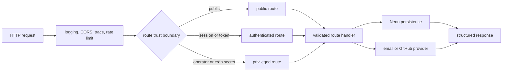

# anvil API architecture

| Type         | Authority | Owner | Status | Freshness                                                                                                                                                                       |
| ------------ | --------- | ----- | ------ | ------------------------------------------------------------------------------------------------------------------------------------------------------------------------------- |
| Architecture | Derived   | APGOV | Live   | Last reviewed 2026-08-20 against `d6c8b565c`, `apps/anvil-api/src/index.ts`, `apps/anvil-api/src/middleware/**`, `apps/anvil-api/src/routes/**`, and `apps/anvil-api/src/db/**` |

| Upstream                                                                                                                         | Downstream                                       |
| -------------------------------------------------------------------------------------------------------------------------------- | ------------------------------------------------ |
| `apps/anvil-api/src/**`, ADR-066, ADR-123, `docs/architecture/api-as-built.md`, and BAUTH's `docs/architecture/auth-as-built.md` | API maintainers, CLI, docs shell, and operations |

> **DOCRB-004 pilot:** this APGOV-owned component map remains subordinate to the
> retained central [API as-built](../../docs/architecture/api-as-built.md) until
> DOCRB-005. BAUTH's [auth as-built](../../docs/architecture/auth-as-built.md)
> remains authoritative for authentication and authorisation.

## Scope and boundaries

The service owns HTTP composition, request validation, route orchestration, and
persistence calls for the hosted operator plane. [`index.ts`](src/index.ts)
applies logging, CORS, trace context, and rate limiting before dispatching to
[`routes/`](src/routes). Routes use [`db/client.ts`](src/db/client.ts) and
[`db/queries.ts`](src/db/queries.ts) for Neon persistence, plus bounded external
provider adapters for email and GitHub flows.

## Request-to-persistence flow

This diagram owns the API's request, trust, and persistence concern.

Global middleware traces to [`index.ts`](src/index.ts) and
[`middleware/`](src/middleware). Trust branches trace to
[`routes/auth.ts`](src/routes/auth.ts),
[`routes/account-activity.ts`](src/routes/account-activity.ts),
[`routes/admin.ts`](src/routes/admin.ts), and
[`routes/cron.ts`](src/routes/cron.ts). Persistence traces to
[`db/client.ts`](src/db/client.ts) and [`db/queries.ts`](src/db/queries.ts). In
prose: every request crosses the shared middleware chain, then a route's public,
authenticated, operator, or cron boundary. The validated handler calls Neon or
an external provider and returns a structured result.

## Invariants, failure, and fallback

- CORS admits only configured origins; it is not an authentication mechanism.
- Trace context and rate limiting apply before every versioned route.
- Route-specific authentication must follow BAUTH's retained
  [auth authority](../../docs/architecture/auth-as-built.md).
- [`admin-auth.ts`](src/middleware/admin-auth.ts) prefers per-operator keys when
  configured. A database lookup failure deliberately falls back to the shared
  admin key. A revoked, malformed, or unknown credential is rejected; its audit
  write is attempted on a best-effort basis, and audit-write failure is logged
  without masking the rejection.
- Database, signing-key, GitHub credential, and email-provider health are
  reported explicitly; user-impacting dependency failure degrades health.
- Persistence migrations remain governed by the
  [database migration runbook](../../docs/runbooks/db-migrations.md), not this
  component map.
