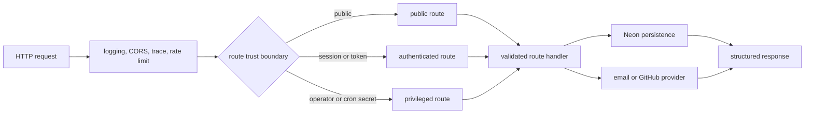

# anvil API architecture

| Type         | Authority     | Owner | Status | Freshness                                                                                                                               |
| ------------ | ------------- | ----- | ------ | --------------------------------------------------------------------------------------------------------------------------------------- |
| Architecture | Authoritative | APGOV | Live   | Last reviewed 2026-08-25 against FLAGCAT-012 catalogue completeness tests; HTTP composition, routes, and persistence topology unchanged |

| Upstream                                                                                    | Downstream                                       |
| ------------------------------------------------------------------------------------------- | ------------------------------------------------ |
| `apps/anvil-api/src/**`, ADR-066, ADR-123, and BAUTH's `docs/architecture/auth-as-built.md` | API maintainers, CLI, docs shell, and operations |

This document is the live APGOV component authority. The former central
[API as-built](../../docs/architecture/api-as-built.md) is retained as a dated
compatibility and history record. BAUTH's
[auth as-built](../../docs/architecture/auth-as-built.md) remains authoritative
for authentication and authorisation.

## Scope and boundaries

The service owns HTTP composition, request validation, route orchestration, and
persistence calls for the hosted operator plane. [`index.ts`](src/index.ts)
applies logging, CORS, trace context, and rate limiting before dispatching to
[`routes/`](src/routes). Routes use [`db/client.ts`](src/db/client.ts) and
[`db/queries.ts`](src/db/queries.ts) for Neon persistence, plus bounded external
provider adapters for email and GitHub flows.

## Request-to-persistence flow

This diagram owns the API's request, trust, and persistence concern.

Global middleware traces to [`index.ts`](src/index.ts) and
[`middleware/`](src/middleware). Trust branches trace to
[`routes/auth.ts`](src/routes/auth.ts),
[`routes/account-activity.ts`](src/routes/account-activity.ts),
[`routes/admin.ts`](src/routes/admin.ts), and
[`routes/cron.ts`](src/routes/cron.ts). Persistence traces to
[`db/client.ts`](src/db/client.ts) and [`db/queries.ts`](src/db/queries.ts). In
prose: every request crosses the shared middleware chain, then a route's public,
authenticated, operator, or cron boundary. The validated handler calls Neon or
an external provider and returns a structured result.

## Composition and source map

[`index.ts`](src/index.ts) mounts the `/api/v1` application. Its global
middleware order is logger, configured-origin CORS, trace context, then the
shared rate limiter; the health route and route modules execute behind that
chain. Boot probes signing and verifying keys, GitHub CLI OAuth credentials, and
Resend credentials without preventing the process from starting. The `/health`
response reports those states alongside database reachability.

Route ownership is split by trust and job:

- [`routes/auth.ts`](src/routes/auth.ts),
  [`routes/auth-device.ts`](src/routes/auth-device.ts),
  [`routes/auth-otp.ts`](src/routes/auth-otp.ts),
  [`routes/auth-session.ts`](src/routes/auth-session.ts),
  [`routes/auth-github.ts`](src/routes/auth-github.ts), and
  [`routes/auth-github-device.ts`](src/routes/auth-github-device.ts) implement
  the BAUTH-owned access flows.
- [`routes/admin.ts`](src/routes/admin.ts) and
  [`routes/admin-schemas.ts`](src/routes/admin-schemas.ts) own operator
  orchestration and validated request shapes; authentication and actor-scoped
  limiting live in [`middleware/admin-auth.ts`](src/middleware/admin-auth.ts)
  and [`middleware/admin-rate-limit.ts`](src/middleware/admin-rate-limit.ts).
- [`routes/waitlist.ts`](src/routes/waitlist.ts),
  [`routes/telemetry.ts`](src/routes/telemetry.ts),
  [`routes/account-activity.ts`](src/routes/account-activity.ts), and
  [`routes/cron.ts`](src/routes/cron.ts) own their bounded public,
  identity-bound, and scheduled surfaces.

[`db/client.ts`](src/db/client.ts) owns Neon client construction and test
replacement. [`db/queries.ts`](src/db/queries.ts) owns validated persistence
operations. [`db/migrate.ts`](src/db/migrate.ts) discovers ordered SQL files,
checks stored hashes for drift, serialises real runs with a PostgreSQL advisory
lock, and applies each migration transactionally with its tracking row. The
[database migration runbook](../../docs/runbooks/db-migrations.md) remains the
operator authority.

## Invariants, failure, and fallback

- CORS admits only configured origins; it is not an authentication mechanism.
- Trace context and rate limiting apply before every versioned route.
- Route-specific authentication must follow BAUTH's retained
  [auth authority](../../docs/architecture/auth-as-built.md).
- [`admin-auth.ts`](src/middleware/admin-auth.ts) prefers per-operator keys when
  configured. A database lookup failure deliberately falls back to the shared
  admin key. A revoked, malformed, or unknown credential is rejected; its audit
  write is attempted on a best-effort basis, and audit-write failure is logged
  without masking the rejection.
- Health reports database, signing-key, verifying-key, GitHub CLI credential,
  and Resend states explicitly. Database failure, unavailable signing or
  verifying keys, unavailable GitHub CLI credentials, and Resend
  `invalid`/`unconfigured` states gate overall health. A Resend or network probe
  result of `unverifiable` is explicit but non-gating, so it can coexist with
  overall `status: ok`.
- Persistence migrations remain governed by the
  [database migration runbook](../../docs/runbooks/db-migrations.md), not this
  component map.
