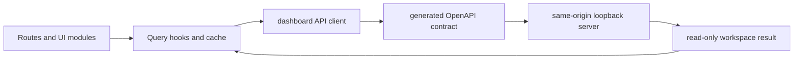

# anvil dashboard web application architecture

| Type         | Authority | Owner | Status | Freshness                                                                                                                                                      |
| ------------ | --------- | ----- | ------ | -------------------------------------------------------------------------------------------------------------------------------------------------------------- |
| Architecture | Derived   | DASH  | Live   | Last reviewed 2026-08-20 against `d6c8b565c`, `apps/dashboard/src/main.tsx`, `apps/dashboard/src/api/client.ts`, and `apps/dashboard/scripts/generate-api.mjs` |

| Upstream                                                                                                                        | Downstream                             |
| ------------------------------------------------------------------------------------------------------------------------------- | -------------------------------------- |
| `apps/dashboard/src/**`, `crates/anvil-dashboard-server/src/openapi.rs`, ADR-104, ADR-123, and `docs/guides/local-dashboard.md` | Dashboard UI maintainers and web users |

> **DOCRB-004 pilot:** this document owns only the component-local web
> application concern. The retained central
> [TUI as-built](../../docs/architecture/tui-as-built.md) and the
> [local dashboard guide](../../docs/guides/local-dashboard.md) keep their wider
> authorities until DOCRB-005.

## Scope and boundaries

The application owns browser routing, query state, presentation, and a typed
read-only API adapter. [`main.tsx`](src/main.tsx) composes the query provider
and router. [`api/client.ts`](src/api/client.ts) uses `openapi-fetch` with the
generated [OpenAPI types](src/api/generated/openapi.d.ts). The Rust server owns
endpoint behaviour, workspace access, and transport security.

## UI-to-loopback-server flow

This diagram owns the browser application's data-request concern.

The UI nodes trace to [`router.tsx`](src/router.tsx), [`modules/`](src/modules),
and [`hooks/`](src/hooks). The client and contract trace to
[`api/client.ts`](src/api/client.ts),
[`api/generated/openapi.d.ts`](src/api/generated/openapi.d.ts), and
[`scripts/generate-api.mjs`](scripts/generate-api.mjs). In prose: a route
invokes a query hook, which calls the typed API adapter; the generated OpenAPI
contract constrains the same-origin request; the loopback server returns a
read-only result to the query cache.

## Invariants, failure, and fallback

- The checked-in client contract is generated from the Rust server's OpenAPI
  export and `check:api` detects drift.
- API failures become [`DashboardApiError`](src/api/client.ts) values rather
  than invented dashboard data.
- Query views render explicit loading, error, or empty states when source
  artefacts are unavailable.
- The browser remains a read-only consumer. Mutation or approval controls do not
  belong in this component.
- The app relies on the server's exact same-origin and loopback boundary; it
  does not add CORS or a second authentication mechanism.
