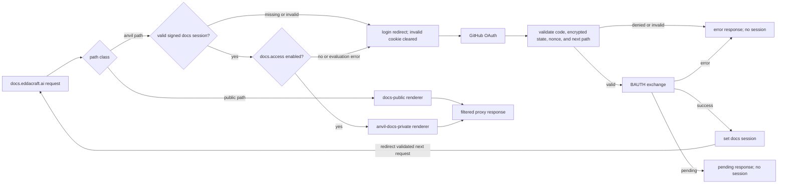

# anvil documentation shell architecture

| Type         | Authority | Owner           | Status | Freshness                                                                                                                                                                                                                                                    |
| ------------ | --------- | --------------- | ------ | ------------------------------------------------------------------------------------------------------------------------------------------------------------------------------------------------------------------------------------------------------------ |
| Architecture | Derived   | DOCRB/DSITE gap | Live   | Last reviewed 2026-08-22 against `apps/docs-shell/proxy.ts`, `apps/docs-shell/app/auth/**`, `apps/docs-shell/lib/**`, `flags/manifest.json`, `infra/src/vercel.ts`, and the DOCRB-009 documentation-governance contract; architecture and diagrams unchanged |

| Upstream                                                                                                                                          | Downstream                                    |
| ------------------------------------------------------------------------------------------------------------------------------------------------- | --------------------------------------------- |
| `apps/docs-shell/**`, `infra/src/vercel.ts`, ADR-123, BAUTH's `docs/architecture/auth-as-built.md`, and `docs/guides/documentation-governance.md` | Docs-shell maintainers and production readers |

> **DOCRB-004 pilot:** this source-linked component map does not close the
> DOCRB/DSITE ownership gap or supersede ADR-123, documentation governance, or
> BAUTH's [auth as-built](../../docs/architecture/auth-as-built.md). DOCRB-005
> owns central migration, not this pilot.

## Scope and boundaries

The shell owns request classification, session-cookie handling, and proxy
transport at the live `docs.eddacraft.ai` entrypoint.
[`infra/src/vercel.ts`](../../infra/src/vercel.ts) is deployment truth:
`apps/anvil-docs-private` and `apps/docs-public` are live upstream renderers,
while the retired `apps/docs-site` rollback host has been deleted.
Authentication semantics belong to BAUTH and are consumed here. The
`docs.access` entitlement definition belongs to the feature-flag catalogue; the
shell owns only the edge evaluation adapter.

## Authentication and renderer routing

This diagram owns the shell's request-to-renderer concern.

Routing and proxy transport trace to [`proxy.ts`](proxy.ts). The login and
callback flow traces to [`app/auth/login/route.ts`](app/auth/login/route.ts),
[`app/auth/callback/route.ts`](app/auth/callback/route.ts), and
[`lib/bauth.ts`](lib/bauth.ts); licence verification traces to
[`lib/jwt.ts`](lib/jwt.ts) and catalogue evaluation traces to
[`lib/feature-flags.ts`](lib/feature-flags.ts), `flags/manifest.json`, and the
shared resolver. In prose: public paths go directly to the public renderer. An
anvil path requires a valid signed docs session whose trusted plan claim makes
`docs.access` resolve to the boolean `enabled` variant. The adapter
canonicalises the plan audience, derives the deployment environment, and uses
the non-PII `docs-shell` targeting key. A missing session or denied entitlement
redirects to login; an invalid session does the same after its cookie is
cleared. The callback validates the code, encrypted state, nonce, and next path
before BAUTH exchange. Success sets a session and redirects the validated next
request through session verification and `docs.access` evaluation before it can
reach the private renderer. Denial, invalid callback input, BAUTH pending, and
BAUTH error set no session and resolve to the corresponding error or pending
surface. Both renderer responses pass through the same filtered proxy boundary.

## Invariants, failure, and fallback

- ES256 licence verification checks issuer, audience, subject, and the SEC-012
  plan-claim rule. `docs.access` then resolves through the canonical catalogue;
  only `variant === 'enabled'` with `value === true` grants access. Missing
  claims, unknown plans, unmatched targeting, and resolver errors fail closed
  and clear an invalid session.
- OAuth state is encrypted and tied to a short-lived nonce; the callback
  validates its next path before redirecting.
- The proxy forwards only an allowlist of request headers, injects the upstream
  secret, and strips sensitive or hop-by-hop response headers.
- When an upstream supplies an absolute `Location`, a known renderer origin is
  rewritten to the shell origin and its `/auth/` path is forbidden. Relative
  `Location` values pass through unchanged, as do unparsable values.
- Upstream requests time out after 15 seconds and return an honest 503 on
  timeout or transport failure.
- The retired `apps/docs-site` rollback host has been deleted and must not be
  depicted as a live renderer.

Production topology and the unresolved owner remain authoritative in
[documentation governance](../../docs/guides/documentation-governance.md).
