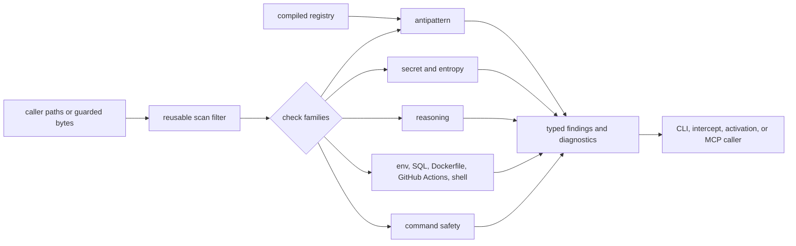

# anvil checks architecture

| Type         | Authority     | Owner | Status | Freshness                                                                                                                                                                       |
| ------------ | ------------- | ----- | ------ | ------------------------------------------------------------------------------------------------------------------------------------------------------------------------------- |
| Architecture | Authoritative | SCAN  | Live   | Last reviewed 2026-08-25 against `src/antipattern/mask.rs` (CIB-359 char-boundary slice), `src/antipattern/registry_loader.rs`, and ADR-131; evaluation-flow diagram unaffected |

| Upstream                                                                                        | Downstream                                                                |
| ----------------------------------------------------------------------------------------------- | ------------------------------------------------------------------------- |
| `crates/anvil-checks/src/**`, compiled pattern registry, ADR-029, ADR-087, ADR-123, and ADR-131 | CLI checks, intercept rules, activation, MCP validation, and contributors |

This document is the live component authority. The former central
[checks as-built](../../docs/architecture/checks-as-built.md) is retained as a
dated compatibility and history record. The
[quality model](../../docs/architecture/quality-model.md) remains authoritative
for the cross-system relationship between checks, findings, gates, and surfaces.

## Scope and boundaries

`anvil-checks` owns reusable check-family evaluation, finding construction,
suppression interpretation shared by its families, and reusable scan filtering.
It does not own a command's workspace walk, baseline policy, architecture
boundaries, OPA/Rego evaluation, gate exit semantics, daemon transport, or
presentation. Those callers compose this crate's outputs into their own
decisions.

The compiled [pattern registry](../../patterns/compiled/registry.json) is the
single source of truth for registry-backed antipattern rules. The Rust loader
does not maintain a second handwritten catalogue. Default load is the
compile-time embedded copy of that file. `ANVIL_REGISTRY_PATH` or an API
`registry_path` is an unsigned explicit override; a cloned on-disk
`patterns/compiled/registry.json` does not replace the catalogue (ADR-131).

## Evaluation flow



Disk-reading entry points and guarded-byte entry points converge on the same
family evaluation. In particular,
[`run_antipattern_check_bytes`](src/antipattern/check.rs) lets the intercept
save-time path evaluate already-guarded content without reopening an untrusted
path. Ordinary CLI callers may use the disk-reading wrapper.

## Check families and source map

- [`antipattern/`](src/antipattern) loads the compiled registry, rewrites
  supported catalogue patterns, scans source, applies suppression, and returns
  severity-scored warnings.
  [`registry_loader.rs`](src/antipattern/registry_loader.rs) owns decoding and
  provenance; [`scanner.rs`](src/antipattern/scanner.rs) owns file/content
  evaluation.
- [`secret/`](src/secret) combines named patterns with shaped entropy checks.
  [`types.rs`](src/secret/types.rs) carries the per-line size guard and result
  vocabulary; findings never include the raw secret value.
- [`reasoning/`](src/reasoning) owns the AI-001 comment-region check and its
  bounded entry point.
- [`surface/env/`](src/surface/env) parses dotenv-shaped files and checks secret
  values, gitignore hygiene, production-shaped values, and template drift.
- [`surface/sql/`](src/surface/sql),
  [`surface/dockerfile/`](src/surface/dockerfile),
  [`surface/github_actions/`](src/surface/github_actions), and
  [`surface/shell/`](src/surface/shell) own their source-specific scanners and
  suppression adapters.
- [`command_safety/`](src/command_safety) parses command plans, selects the most
  specific matching rule, and returns a decision with evidence. Default
  filesystem, Git, and shell rules live under
  [`command_safety/rules/`](src/command_safety/rules).
- [`filter.rs`](src/filter.rs) owns shared directory, suffix, binary, and
  always-scan classification. Callers still own discovery and decide which
  candidate paths enter this filter.

The gate-only AST tier remains in [`anvil-checks-ast`](../anvil-checks-ast), and
daemon adapters remain in [`anvil-intercept-rules`](../anvil-intercept-rules).
Keeping those boundaries prevents terminal-only dependencies and daemon
orchestration from leaking into the reusable check engine.

## Result and suppression invariants

- Registry-backed findings carry their rule and family provenance from the
  compiled catalogue.
- Suppression is explicit and local. The canonical directive parser established
  by [ADR-029](../../plans/decisions/029-suppression-parser-authority.md) is
  reused instead of reimplemented per caller.
- Suppressed findings remain distinguishable from clean input and do not lower a
  family score or fail that family.
- Result order and path rendering are deterministic so JSON and diagnostic
  callers can compare runs.
- Secret findings redact the matched value; tests assert that raw credentials do
  not enter finding output.
- Oversized secret-scan lines are skipped before regular-expression evaluation
  and the skip count remains observable in the result.
- The antipattern disk-reading path uses a bounded shared rayon pool. The
  guarded-byte API accepts the caller's pool so the daemon controls its hot-path
  concurrency.
- Generated files and configured exclusions follow the reusable scan filter;
  surface-specific formats that must always be inspected are classified
  explicitly rather than admitted accidentally.

## Cross-system composition

The CLI's `check`, `gate`, `audit`, and `watch` commands select and compose
families; they are not alternative rule authorities. The intercept daemon
consumes bounded adapters and guarded bytes as described by the
[intercept architecture](../anvil-intercept/ARCHITECTURE.md). MCP
`anvil_validate_write` uses the same daemon or embedded validation stack; its
transport and response contract belong to the CLI/MCP surface, not this crate.

Architecture enforcement remains in `anvil-architecture`; policy evaluation
remains in `anvil-policy`; baseline creation and filtering remain with
activation and the invoking surface. The
[insecure-construction decision](../../plans/decisions/087-security-antipattern-category.md)
governs the associated registry families, while this document records only their
runtime placement.

## Validation

```bash
cargo test -p eddacraft-anvil-checks --no-fail-fast
cargo bench -p eddacraft-anvil-checks
```

Run the benchmark only for performance-sensitive scanner or concurrency changes.
Tests under [`tests/`](tests) cover registry scanning, secret redaction,
reasoning, source-specific surfaces, suppression, and command safety.
