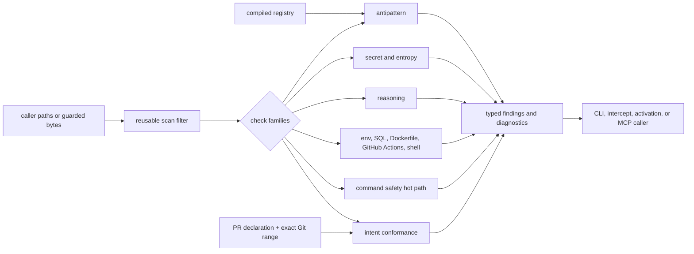

# anvil checks architecture

| Type         | Authority     | Owner | Status | Freshness                                                                                                                                                                                                                                                                                                                                                                                        |
| ------------ | ------------- | ----- | ------ | ------------------------------------------------------------------------------------------------------------------------------------------------------------------------------------------------------------------------------------------------------------------------------------------------------------------------------------------------------------------------------------------------ |
| Architecture | Authoritative | SCAN  | Live   | Last reviewed 2026-09-13 for first-run secret FP skips (placeholder tags, dummy test DB URLs, cfg(test) entropy, workflow toolchain env, labelled not-a-secret, committed minisign DEV_KEY) in `src/secret/` on top of the 2026-09-10 entropy FP / allowlist and command-safety hot-path work; the evaluation-flow diagram still shows command safety as its own family with no topology change. |

| Upstream                                                                                        | Downstream                                                                |
| ----------------------------------------------------------------------------------------------- | ------------------------------------------------------------------------- |
| `crates/anvil-checks/src/**`, compiled pattern registry, ADR-029, ADR-087, ADR-123, and ADR-131 | CLI checks, intercept rules, activation, MCP validation, and contributors |

This document is the live component authority. The former central
[checks as-built](../../docs/architecture/checks-as-built.md) is retained as a
dated compatibility and history record. The
[quality model](../../docs/architecture/quality-model.md) remains authoritative
for the cross-system relationship between checks, findings, gates, and surfaces.

## Scope and boundaries

`anvil-checks` owns reusable check-family evaluation, finding construction,
suppression interpretation shared by its families, and reusable scan filtering.
It does not own a command's workspace walk, baseline policy, architecture
boundaries, OPA/Rego evaluation, gate exit semantics, daemon transport, or
presentation. Those callers compose this crate's outputs into their own
decisions.

The compiled [pattern registry](../../patterns/compiled/registry.json) is the
single source of truth for registry-backed antipattern rules. The Rust loader
does not maintain a second handwritten catalogue. Default load is the
compile-time embedded copy of that file. `ANVIL_REGISTRY_PATH` or an API
`registry_path` is an unsigned explicit override; a cloned on-disk
`patterns/compiled/registry.json` does not replace the catalogue (ADR-131).

## Evaluation flow


```mermaid
%% secret-fp freshness 2026-09-13
flowchart LR
    Input[caller paths or guarded bytes] --> Filter[reusable scan filter]
    Filter --> Families{check families}
    Registry[compiled registry] --> Anti[antipattern]
    Families --> Anti
    Families --> Secret[secret and entropy]
    Families --> Reason[reasoning]
    Families --> Surface[env, SQL, Dockerfile, GitHub Actions, shell]
    Families --> Command[command safety hot path]
    Families --> Conformance[intent conformance]
    PR[PR declaration + exact Git range] --> Conformance
    Anti --> Results[typed findings and diagnostics]
    Secret --> Results
    Reason --> Results
    Surface --> Results
    Command --> Results
    Conformance --> Results
    Results --> Caller[CLI, intercept, activation, or MCP caller]
```

Disk-reading entry points and guarded-byte entry points converge on the same
family evaluation. In particular,
[`run_antipattern_check_bytes`](src/antipattern/check.rs) lets the intercept
save-time path evaluate already-guarded content without reopening an untrusted
path. Ordinary CLI callers may use the disk-reading wrapper.

## Check families and source map

- [`antipattern/`](src/antipattern) loads the compiled registry, rewrites
  supported catalogue patterns, scans source, applies suppression, and returns
  severity-scored warnings.
  [`registry_loader.rs`](src/antipattern/registry_loader.rs) owns decoding and
  provenance; [`scanner.rs`](src/antipattern/scanner.rs) owns file/content
  evaluation.
- [`secret/`](src/secret) combines named patterns with shaped entropy checks.
  [`types.rs`](src/secret/types.rs) carries the per-line size guard and result
  vocabulary; findings never include the raw secret value.
  [`vendored.rs`](src/secret/vendored.rs) owns the vendored provider ruleset
  from the generated data under [`vendor/`](src/secret/vendor). It appends to
  `DEFAULT_COMPILED_PATTERNS` for the surfaces that consult that set directly
  (SDT-004, ADR-136), but the scan path does not force it: compiling the tier-1
  regexes costs ~30x a built-in each, and the save-time path spawns a process
  per debounced save. The scanner takes `BUILTIN_COMPILED_PATTERNS` plus
  `vendored_patterns_for`, which gates each tier-1 rule on the literal provider
  prefix that is its tier-1 criterion and compiles it only when a line carries
  that prefix. Detection is identical — no tier-1 pattern can match a line
  without its prefix — and the gate falls back to compiling every rule if it
  cannot be built.
- [`reasoning/`](src/reasoning) owns the AI-001 comment-region check and its
  bounded entry point.
- [`surface/env/`](src/surface/env) parses dotenv-shaped files and checks secret
  values, gitignore hygiene, production-shaped values, and template drift.
- [`surface/sql/`](src/surface/sql),
  [`surface/dockerfile/`](src/surface/dockerfile),
  [`surface/github_actions/`](src/surface/github_actions), and
  [`surface/shell/`](src/surface/shell) own their source-specific scanners and
  suppression adapters.
- [`command_safety/`](src/command_safety) parses command plans, selects the most
  specific matching rule, and returns a decision with evidence. Default
  filesystem, Git, and shell rules live under
  [`command_safety/rules/`](src/command_safety/rules).
- [`conformance/`](src/conformance) owns bounded Tier-0 Git evidence extraction,
  deterministic PR-body declaration extraction, the versioned closed claim
  table, per-commit and complete-range claim-versus-effect evaluation, and
  canonical advisory finding construction. It consumes the shared contract from
  `anvil-kernel-types`; callers still own repository selection, immutable PR
  source-reference construction, graph production, baseline policy, enforcement,
  and presentation.
- [`filter.rs`](src/filter.rs) owns shared directory, suffix, binary, and
  always-scan classification. Callers still own discovery and decide which
  candidate paths enter this filter.

The gate-only AST tier remains in [`anvil-checks-ast`](../anvil-checks-ast), and
daemon adapters remain in [`anvil-intercept-rules`](../anvil-intercept-rules).
Keeping those boundaries prevents terminal-only dependencies and daemon
orchestration from leaking into the reusable check engine.

## Result and suppression invariants

- Registry-backed findings carry their rule and family provenance from the
  compiled catalogue.
- Suppression is explicit and local. The canonical directive parser established
  by [ADR-029](../../plans/decisions/029-suppression-parser-authority.md) is
  reused instead of reimplemented per caller.
- Suppressed findings remain distinguishable from clean input and do not lower a
  family score or fail that family.
- Result order and path rendering are deterministic so JSON and diagnostic
  callers can compare runs.
- Range-level PR evaluation accepts only a non-empty extraction whose selected
  commits share the requested repository, canonical worktree, run, base, head,
  and per-commit revision bindings. Any not-evaluated commit or binding mismatch
  makes the aggregate not evaluated; partial evidence cannot become conformant.
  A successful verdict retains each commit's binding, parent, raw records, and
  coverage indices; range records and coverage are deterministic derived views.
  [ADR-139](../../plans/decisions/139-bound-conformance-range-evidence.md)
  limits the whole range to 100,000 raw records, 64 MiB raw Git diff bytes, and
  64 MiB decoded path bytes before these aggregate and per-commit views are
  built. Aggregate overflow drops publishable evidence and is reason-coded
  not-evaluated with exact selected-commit cardinality.
- Intent-conformance extraction disables replacement objects, rejects
  replacement/graft and shallow state, clears ambient Git configuration, and
  applies per-command and one caller-owned whole-run resource budget across
  identity, extraction, evaluation, and report materialisation. Under
  [ADR-138](../../plans/decisions/138-pin-git-administrative-state.md), the
  administration-observation phase exposes real repository state through an
  exact three-value `GIT_*` allowlist. All post-admission Git commands use an
  exact five-value allowlist whose two additions are run-owned, never-written
  shallow/graft sentinel paths, so ordinary concurrent repository administration
  cannot alter ancestry. These paths are not an operating-system immutability or
  hostile same-user security boundary. Every selected commit remains represented
  as evaluated or reason-coded not-evaluated. Repository and canonical-worktree
  identities are derived from the canonical Git common directory and top-level
  respectively, re-verified at extraction, and emitted only as opaque digests.
  Bare repositories are rejected, while any directory inside one worktree
  resolves to the same worktree identity and every later Git command executes
  from that verified top-level.
- Git executable discovery accepts only a canonical absolute program reached
  through an absolute `PATH` entry. Each command is isolated in a process group
  (or Windows process tree), abnormal exits terminate descendants, and reader
  shutdown remains time-bounded even if an inherited output pipe stays open.
- Timeout and deterministic-budget failures preserve their originating stage and
  structured diagnostics: configured limit, elapsed time, commit/record/
  rename/raw/decoded counts through the last complete record of the affected
  stage, and a raw-input digest when available.
- Exact raw Git records retain status, rename, mode, object type, object ID, and
  gitlink evidence. Canonical byte-sorted per-path coverage separately maps
  paths to raw-record indices and evaluator dispositions; rename endpoints are
  therefore independently dispositioned without duplicating the raw record. A
  bounded no-renames preflight and rename-enabled final diff must name identical
  endpoint sets.
- File-class and prefix matching are case-exact. Every prefix in a selected
  base-tree mapping, and every explicit prefix from one declaration source,
  forms one authority union. Contributing base configuration paths are
  `policy-change` regardless of the claim's scope form. Raw Git paths retain
  legal UTF-8 metacharacters that the stricter authority-prefix grammar forbids.
- PR-body extraction accepts exactly one `anvil-claims` fence and the closed v1
  member vocabulary at top-level Markdown scope; quoted examples and HTML
  comments are not declarations. It shares the strict path-prefix authority
  grammar, canonicalises/deduplicates understood members, and fails honest on
  missing, ambiguous, malformed, unknown, or versioned-budget-exceeded input.
  Only an `Extracted` result can release contract parts; bounded understood
  members in a `NotEvaluated` result remain diagnostic. Admitted input retains
  only an immutable source reference and exact-body digest under the
  forge-neutral `pull-request-body.anvil-claims.v1` producer schema. Raw PR
  prose never enters the output.
- Conformance outcome and evidence strength are independent and aggregate
  monotonically: incomplete evidence cannot pass, while a proven violation
  cannot disappear behind missing evidence. Graph bindings are checked across
  repository, worktree, run, path, revision/blob, schema, and generation;
  missing, stale, or mismatched evidence remains observable. A valid binding
  alone never satisfies a graph-semantic claim.
- Secret findings redact the matched value; tests assert that raw credentials do
  not enter finding output.
- Vendored provider rules are **repo-owned constants on the built-in path**, not
  operator configuration (SDT-004). They are converted from a digest-verified
  upstream pin, carry `high_confidence` because their prefix-anchored shape
  earns it, and name their origin in `SecretFinding::ruleset_version` so a
  vendored detection is distinguishable from a built-in one. The operator-facing
  `SecretPatternDef` is deliberately not the conversion target and carries no
  confidence field: it is serialisable configuration, so such a field would let
  any `.anvilrc` regex opt itself out of the false-positive filters with no
  provenance behind the claim. Where an upstream regex wraps the credential in
  delimiter or provider-keyword scaffolding, `CompiledPattern::secret_group`
  narrows the reported span to the upstream capture group — which is what lets
  the regexes be vendored verbatim while a finding still covers the credential.
  Allowlisting and suppression apply to vendored rules exactly as to built-ins,
  by construction rather than by convention, because there is one shared set.
- Oversized secret-scan lines are skipped before regular-expression evaluation,
  and that skip is **fail-closed** (SDT-001): a non-zero skip count blocks a
  clean pass and zeroes the score, because the guard drops the line before both
  the pattern pass and the entropy pass, so a secret inside it cannot have been
  seen. Every reason a scan could not read all of its input — a history-scan
  failure or an oversize skip — collects in one place and is reported together;
  neither swallows the other. The message names the count and both remedies
  (raise `max_line_bytes`, or suppress with a documented reason under ADR-029),
  since a red with no stated action trades a false-clean for an unactionable
  one. The save-time intercept reports the same condition as a warning
  diagnostic but does not interrupt the write.
- Whole-_file_ skips follow the same rule, with one deliberate exception
  (SDT-006). Every candidate file reports why it was not scanned. A file at or
  over `MAX_FILE_SIZE`, one that could not be read, and one whose scan hit the
  SCAN-001 panic-containment arm each block a clean pass and zero the score. A
  configured `skip_extensions` match is the exception: it is counted and
  observable but **never** blocks, because the defaults include `.png`, `.jpg`
  and `.lock` and blocking a deliberate operator exclusion would redden every
  repository. Blocking causes carry normalised paths — the same shape as finding
  paths, so a consumer never reconciles two path vocabularies — while the
  advisory case carries only a count, because that population is unbounded.
  Lockfiles are the sharp edge: they bypass `skip_extensions` to reach the
  URL-credential scan, so an oversize lockfile cannot be excluded at all, and
  the note names it rather than offering a remedy that does nothing.
- Large files are scanned, not excused (SDT-007). Both passes are window-local —
  patterns are line-local, entropy reaches only
  `context_window(lines, index, 2)` and `lines.get(index)` — so a file is read
  through a bounded reader carrying a radius-2 window (`secret/source.rs`)
  instead of being materialised. The one thing that is _not_ window-local is
  `#[cfg(test)] mod` membership, which is a prefix fold; it is carried
  incrementally, once per line in read order, and is why the reader is a driver
  rather than a five-element array. `MAX_FILE_SIZE` survives only as a runaway
  guard, its value set by a measured scan rate rather than by the memory bound
  that no longer binds.
- One predicate decides scannability. `anvil-checks` exports
  `is_secret_scannable`; `anvil-cli` used to carry a copy annotated as "kept in
  lockstep with the upstream", which had already drifted — it applied
  `skip_extensions` to lockfiles the scanner deliberately exempts, so planless
  `anvil check` withheld exactly the files the URL-credential scan exists for.
- Coverage failures reach `anvil gate` only. `anvil audit` reads findings alone,
  and planless `anvil check` pre-filters unscannable files before the scan, so
  the accounting never reaches it. Both predate SDT-006 and neither is closed by
  it.
- Detection is measured, not asserted: `tests/corpus/secret/` holds a committed
  calibration corpus and `tests/secret_calibration.rs` reports detection rate,
  false-positive rate and per-rule misses, failing on drift in either direction
  so no rules change ships unmeasured (SDT-002).
- The antipattern disk-reading path uses a bounded shared rayon pool. The
  guarded-byte API accepts the caller's pool so the daemon controls its hot-path
  concurrency.
- Generated files and configured exclusions follow the reusable scan filter;
  surface-specific formats that must always be inspected are classified
  explicitly rather than admitted accidentally.

## Cross-system composition

The CLI's `check`, `gate`, `audit`, and `watch` commands select and compose
families; they are not alternative rule authorities. The intercept daemon
consumes bounded adapters and guarded bytes as described by the
[intercept architecture](../anvil-intercept/ARCHITECTURE.md). MCP
`anvil_validate_write` uses the same daemon or embedded validation stack; its
transport and response contract belong to the CLI/MCP surface, not this crate.

Architecture enforcement remains in `anvil-architecture`; policy evaluation
remains in `anvil-policy`; baseline creation and filtering remain with
activation and the invoking surface. The
[insecure-construction decision](../../plans/decisions/087-security-antipattern-category.md)
governs the associated registry families, while this document records only their
runtime placement.

## Validation

```bash
cargo test -p eddacraft-anvil-checks --no-fail-fast
cargo bench -p eddacraft-anvil-checks
```

Run the benchmark only for performance-sensitive scanner or concurrency changes.
Tests under [`tests/`](tests) cover registry scanning, secret redaction,
reasoning, source-specific surfaces, suppression, and command safety.
