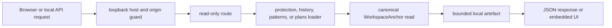

# anvil dashboard server architecture

| Type         | Authority | Owner | Status | Freshness                                                                                                                                                                                              |
| ------------ | --------- | ----- | ------ | ------------------------------------------------------------------------------------------------------------------------------------------------------------------------------------------------------ |
| Architecture | Derived   | DASH  | Live   | Last reviewed 2026-08-20 against `d6c8b565c`, `crates/anvil-dashboard-server/src/server.rs`, `crates/anvil-dashboard-server/src/workspace.rs`, and `crates/anvil-dashboard-server/src/capabilities/**` |

| Upstream                                                                                                                                        | Downstream                                          |
| ----------------------------------------------------------------------------------------------------------------------------------------------- | --------------------------------------------------- |
| `crates/anvil-dashboard-server/src/**`, `apps/dashboard/src/api/generated/openapi.d.ts`, ADR-104, ADR-123, and `docs/guides/local-dashboard.md` | Dashboard client, anvil CLI, and server maintainers |

> **DOCRB-004 pilot:** this source-linked local map does not replace the
> retained central [TUI as-built](../../docs/architecture/tui-as-built.md) or
> the operator [local dashboard guide](../../docs/guides/local-dashboard.md).
> DOCRB-005 owns central migration.

## Scope and boundaries

The server owns one read-only, single-workspace loopback surface.
[`server.rs`](src/server.rs) refuses non-loopback listeners and rejects requests
whose Host, Origin, or fetch-site does not match the exact loopback authority.
Because the service is reachable only from the local machine and is not
supported behind a proxy, it deliberately has no user-authentication scheme. The
network boundary, not an absent check, is the access control.

## Capability and access flow

This diagram owns the server's request-to-workspace concern.

The guard and route nodes trace to [`server.rs`](src/server.rs). Capability
loaders trace to [`capabilities/`](src/capabilities), and the read boundary
traces to [`workspace.rs`](src/workspace.rs). In prose: an admitted loopback
request selects a read-only route; the matching capability asks the anchored
workspace boundary for a capped artefact; the route returns structured JSON or
an embedded UI asset.

## Invariants, failure, and fallback

- `serve` rejects a non-loopback listener before accepting requests.
- Host, Origin, and fetch-site checks prevent cross-origin browser use; no CORS
  grant or remote authentication path exists.
- `WorkspaceAnchor` reads are relative to a canonical root, reject path escape
  and symlinks, and cap each artefact at 4 MiB.
- Missing, unsafe, oversized, or unavailable artefacts become structured API
  errors or honest empty states rather than fabricated protection results.
- A development binary without bundled UI returns an explanatory 503 for the
  browser shell while the read-only API remains available.
- API payloads default to `Cache-Control: no-store`; only fingerprinted assets
  opt into immutable caching.

The generated contract boundary is defined in [`openapi.rs`](src/openapi.rs) and
consumed by the dashboard's
[`generate-api.mjs`](../../apps/dashboard/scripts/generate-api.mjs).
