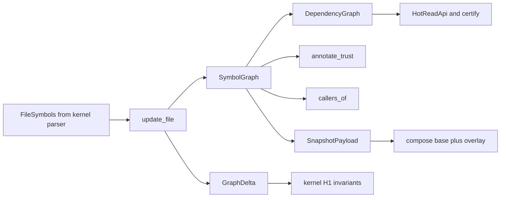

# anvil graph-cache architecture

| Type         | Authority | Owner | Status | Freshness                                                                                                                                                                                                                                                                                                                                                             |
| ------------ | --------- | ----- | ------ | --------------------------------------------------------------------------------------------------------------------------------------------------------------------------------------------------------------------------------------------------------------------------------------------------------------------------------------------------------------------- |
| Architecture | Derived   | GV2   | Live   | Last reviewed 2026-09-10 for the GATT-005 cost self-report change; diagram contract unchanged. Prior review 2026-09-10 GATT-003: per-edge call-resolution fidelity on callers_of (call_graph); diagram contract unchanged Prior review 2026-08-31 against `crates/anvil-kernel-types/src/graph.rs` ordinal default (CIB-387); source-to-graph flow diagrams unchanged |

| Upstream                                                                                                                 | Downstream                                                                |
| ------------------------------------------------------------------------------------------------------------------------ | ------------------------------------------------------------------------- |
| `crates/anvil-graph-cache/src/**`, `crates/anvil-kernel-types/src/graph.rs`, ADR-064, ADR-063, ADR-069, ADR-077, ADR-105 | Kernel policy, intercept save-time, GCTX projection, onboarding discovery |

This document is the live implementation map for the semantic graph. Kernel
orchestration is
[`../anvil-kernel/ARCHITECTURE.md`](../anvil-kernel/ARCHITECTURE.md). Save-time
residency is
[`../anvil-intercept/ARCHITECTURE.md`](../anvil-intercept/ARCHITECTURE.md). The
joined-graph taxonomy remains the
[Graph v2 foundation spec](../../docs/architecture/graph-v2-foundation-spec.md).

## Scope and boundaries

The crate owns graph mutation and the algorithms that read it. It stores a
[`SymbolGraph`](src/symbol_graph.rs) plus a derived
[`DependencyGraph`](src/dependency.rs), applies
[`update_file`](src/incremental.rs) deltas, annotates trust, certifies save-time
surface changes, and encodes warm snapshots. Wire types live in
`anvil-kernel-types` (`SymbolNode`, `SymbolEdge`, `SymbolIdentity`,
`FileSymbols`). Parsing stays in `anvil-kernel`; MCP projection stays in
`anvil-gctx-egress` and `crates/anvil-cli/src/mcp/`.

It does not own architecture-layer YAML (`anvil-architecture`), APS work-item
graphs (`aps graph`), control/session records (INTD), or plan/provenance bodies
(Edda). Those join through [`GraphRegistry`](src/registry.rs) stubs, not through
petgraph.

## The graphs

| Graph            | Backing                                                               | Nodes                                                                                                  | Edges                                                     | Job                                              |
| ---------------- | --------------------------------------------------------------------- | ------------------------------------------------------------------------------------------------------ | --------------------------------------------------------- | ------------------------------------------------ |
| Symbol graph     | petgraph `DiGraph` in [`symbol_graph.rs`](src/symbol_graph.rs)        | Declared symbols (`Function`, `Class`, `Module`, `Export`, `Interface`, `TypeAlias`, `Enum`, `Method`) | `Contains`, `References`, `Calls`, `Imports`, `Reexports` | Source of truth                                  |
| Dependency graph | Forward and reverse `HashMap` in [`dependency.rs`](src/dependency.rs) | Workspace-relative files                                                                               | Import relationships                                      | Blast radius, cycles, save-time reverse impact   |
| Call walk        | [`call_graph.rs`](src/call_graph.rs) over `Calls` edges               | Symbols                                                                                                | Incoming `Calls`                                          | Bounded "who calls this"                         |
| Trust annotation | Whole-graph pass in [`trust.rs`](src/trust.rs)                        | Same symbol nodes                                                                                      | Import and visibility                                     | `Privileged`, `External`, `Boundary`, `Internal` |

Stable identity is [`SymbolIdentity`](../anvil-kernel-types/src/graph.rs)
(`file`, `kind`, `name`, `ordinal`). Session-local `u64` ids are not comparable
across daemon restarts. `Reexports` are first-class because they widen a
module's public surface; a plain `Imports` edge does not.

## Source-to-graph flow

This diagram owns how extracted file symbols become resident graph state.

The kernel parser emits [`FileSymbols`](../anvil-kernel-types/src/graph.rs):
symbols, imports, re-exports, unresolved call sites, an optional content hash,
and flags such as `has_unresolved_dynamic_import`.
[`update_file`](src/incremental.rs) is the hot path:

1. Capture the file's previous import, public, privileged, and boundary sets so
   later evaluation can tell "new" from "still present after an edit".
2. Remove the file's old nodes and edges.
3. Insert the new symbols.
4. Resolve imports: bare specifiers become synthetic external `Module` nodes;
   relative paths try a deterministic extension list without filesystem access.
5. Lift re-exports and, after a batch, re-resolve imports and calls that could
   not bind because the target file had not been parsed yet.
6. Return a [`GraphDelta`](src/incremental.rs).

Import edges are projected into `DependencyGraph` incrementally
(`set_dependencies` / `remove_file`). Mutation is single-writer. Parallel parse
is fine; applying results to petgraph is serial.

## What the graphs do

Three consumers share the same resident pair.

### Governance

Kernel H1 invariants evaluate the **delta**, not a full-graph rescan:
cross-layer imports against architecture YAML, new external dependencies,
public-API expansion, and privilege expansion. Existing edges are the baseline.
Callers must run [`annotate_trust`](src/trust.rs) before policy evaluation.

### Save-time certification

The intercept daemon holds warm graphs in [`GraphRegistry`](src/registry.rs).
[`HotReadApi`](src/hot_index.rs) exposes only the ADR-063 allowlist: per-file
symbols, known-edge existence, reverse impact capped at
`MAX_REVERSE_IMPACT_DEPTH` (2 hops), and precomputed trust membership. A miss is
`HotRead::Stale`; the caller degrades rather than parsing on the hot path.
Unbounded walks live on [`BackgroundReadApi`](src/hot_index.rs) only.
[`certify`](src/certify.rs) sizes export-surface and privilege changes from that
bounded closure. An unresolved dynamic import on the delta cannot certify clean.

### Assistant context

GCTX MCP tools query the same graphs and return identity-only answers. Tool
contracts live in the
[AI context delivery guide](../../docs/guides/ai-context-delivery.md). This
crate estimates snippet tokens ([`tokens.rs`](src/tokens.rs)); it does not emit
source text. Snippets are a double-gated GCTX concern
(`anvil gctx egress enable` and `includeSource: true`).

## Persistence and worktrees

[`SnapshotPayload`](src/snapshot.rs) is a sealed, allowlist-only DTO plus a
`postcard` codec. Artefacts carry structural identity only, never source text
(ADR-069). Per-worktree snapshots use magic `ANVILGC1`; shared bases use
`ANVILGB1`. A magic, version, or checksum mismatch is a cold rebuild, never a
partial load. Persistence is daemon-side and default-on; opt out with
`ANVIL_PERSIST_GRAPH=0`. Kernel watch and embedded paths still build a fresh
graph in process.

Worktrees compose as shared base plus overlay: [`overlay.rs`](src/overlay.rs)
classifies added, modified, and deleted files; [`rebase.rs`](src/rebase.rs)
keeps overlay ids disjoint from the base watermark;
[`compose.rs`](src/compose.rs) materialises an owned
`(SymbolGraph, DependencyGraph)` pair per worktree. A clean worktree composes to
the base unchanged.

## Source map

| Module                                                                                       | Role                                                            |
| -------------------------------------------------------------------------------------------- | --------------------------------------------------------------- |
| [`symbol_graph.rs`](src/symbol_graph.rs)                                                     | petgraph store, file index, monotonic `next_id`, content hashes |
| [`dependency.rs`](src/dependency.rs)                                                         | Incremental file-to-file projection                             |
| [`incremental.rs`](src/incremental.rs)                                                       | `update_file`, import/call/re-export resolution, `GraphDelta`   |
| [`trust.rs`](src/trust.rs)                                                                   | Trust annotation and privileged-module table                    |
| [`call_graph.rs`](src/call_graph.rs)                                                         | Bounded reverse caller walk                                     |
| [`hot_index.rs`](src/hot_index.rs)                                                           | Sealed hot-read API                                             |
| [`certify.rs`](src/certify.rs)                                                               | Save-time certifiability                                        |
| [`registry.rs`](src/registry.rs)                                                             | Multi-graph registry and join stubs                             |
| [`snapshot.rs`](src/snapshot.rs)                                                             | Warm-graph and shared-base codecs                               |
| [`overlay.rs`](src/overlay.rs), [`rebase.rs`](src/rebase.rs), [`compose.rs`](src/compose.rs) | Worktree overlay composition                                    |
| [`tokens.rs`](src/tokens.rs)                                                                 | GCTX token estimator                                            |

## Invariants, failure, and fallback

- The crate never parses and never reads source bytes. A `FileSymbols` feed is
  the only write input.
- Symbol ids stay unique for the lifetime of a graph; `next_id` is never
  decremented on `remove_file`. `remove_file` deletes petgraph nodes from high
  index to low so swap-removes cannot corrupt other files.
- Reverse-impact and caller walks clamp to two hops and a node budget. Over-cap
  requests are clamped, not honoured.
- Hot-path reads must not rebuild, resolve across files, or walk unbounded
  impact. Misses degrade to the daemon-absent fallback.
- Snapshots fail closed on unknown fields, bad magic, version mismatch, or CRC
  failure. CRC-32 is a corruption check, not authenticity.
- Trust matches privileged Node built-ins as exact tokens (`fs`, not
  `fsevents`), case-insensitively, including `node:` prefixes and subpaths.
- Call-graph results are a static over-approximation: overload fan-out is
  `heuristic`; truncated walks are `partial`; dynamic dispatch is invisible.
- A computed dynamic import produces no import edge. Certify then refuses clean
  rather than treating the file as unprivileged.

## Related authorities

- [ADR-064](../../plans/decisions/064-intercept-graph-cache-crate-boundary.md) —
  crate boundary.
- [ADR-063](../../plans/decisions/063-gv2-hot-path-boundary.md) — hot-path
  allowlist.
- [ADR-069](../../plans/decisions/069-graph-v2-persistence.md) — snapshot
  privacy and codec.
- [ADR-077](../../plans/decisions/077-cert-closure-depth-cap.md) —
  reverse-impact depth cap.
- [ADR-086](../../plans/decisions/086-symbol-call-graph-substrate.md) — call
  edges and caller walks.
- [ADR-105](../../plans/decisions/105-shared-base-graph-persistence.md) — shared
  base plus overlay.
- [Graph v2 foundation spec](../../docs/architecture/graph-v2-foundation-spec.md)
  — five-graph taxonomy.
- [AI context delivery](../../docs/guides/ai-context-delivery.md) — GCTX tools
  and privacy.
