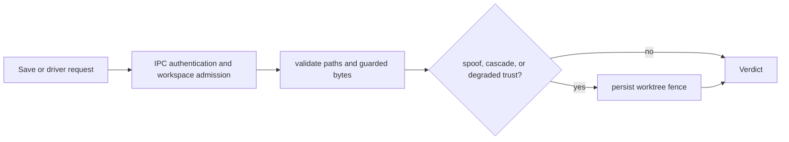

# anvil intercept architecture

| Type         | Authority | Owner | Status | Freshness                                                                                                                                                                          |
| ------------ | --------- | ----- | ------ | ---------------------------------------------------------------------------------------------------------------------------------------------------------------------------------- |
| Architecture | Derived   | INTD  | Live   | Last reviewed 2026-08-20 against `d6c8b565c`, `crates/anvil-intercept/src/save_time.rs`, `crates/anvil-intercept/src/validate_paths.rs`, and `crates/anvil-intercept/src/fence.rs` |

| Upstream                                                                                                  | Downstream                                     |
| --------------------------------------------------------------------------------------------------------- | ---------------------------------------------- |
| `crates/anvil-intercept/src/**`, ADR-085, ADR-090, ADR-123, and `docs/architecture/intercept-as-built.md` | Save-time clients and interception maintainers |

> **DOCRB-004 pilot:** this local explanation does not replace the retained
> central [intercept as-built](../../docs/architecture/intercept-as-built.md).
> DOCRB-005 owns its migration or deliberate retention.

## Scope and boundaries

The crate admits authenticated requests for a canonical workspace, evaluates
guarded file bytes and paths, and returns a validation verdict. A fence is a
separate persistent safety state used for spoofing, cascade, or degraded-trust
conditions; an ordinary validation failure does not automatically fence the
worktree.

## Save, validation, and fence flow

This diagram owns the save-time validation and conditional fencing concern.

The admission boundary traces to [`ipc.rs`](src/ipc.rs),
[`auth.rs`](src/auth.rs), and
[`workspace_admission.rs`](src/workspace_admission.rs). Validation traces to
[`save_time.rs`](src/save_time.rs) and
[`validate_paths.rs`](src/validate_paths.rs); persistent state traces to
[`fence.rs`](src/fence.rs). In prose: a save or driver request must pass caller
and workspace admission, after which guarded bytes and paths are validated. A
qualifying spoof, cascade, or degraded-trust condition then persists a worktree
fence before the verdict returns.

## Invariants, failure, and fallback

- Requests outside the admitted canonical workspace are rejected.
- Validation consumes guarded content rather than reopening an untrusted path
  behind the caller's back.
- Authentication and workspace admission fail closed at the daemon boundary.
- Fence state persists independently of the observation sink, so a dropped
  notification cannot silently clear the safety posture.
- Stale or unavailable graph assurance is surfaced as degraded evidence; it is
  never relabelled as fresh assurance.

The wider client-to-daemon sequence remains in the
[driver framework as-built](../../docs/architecture/driver-framework-as-built.md).
Architecture placement follows
[ADR-123](../../plans/decisions/123-documentation-authority-and-diagram-model.md).
