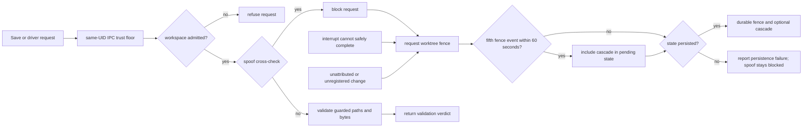

# anvil intercept architecture

| Type         | Authority | Owner | Status | Freshness                                                                                                                                                                          |
| ------------ | --------- | ----- | ------ | ---------------------------------------------------------------------------------------------------------------------------------------------------------------------------------- |
| Architecture | Derived   | INTD  | Live   | Last reviewed 2026-08-20 against `d6c8b565c`, `crates/anvil-intercept/src/save_time.rs`, `crates/anvil-intercept/src/validate_paths.rs`, and `crates/anvil-intercept/src/fence.rs` |

| Upstream                                                                                                  | Downstream                                     |
| --------------------------------------------------------------------------------------------------------- | ---------------------------------------------- |
| `crates/anvil-intercept/src/**`, ADR-085, ADR-090, ADR-123, and `docs/architecture/intercept-as-built.md` | Save-time clients and interception maintainers |

> **DOCRB-004 pilot:** this local explanation does not replace the retained
> central [intercept as-built](../../docs/architecture/intercept-as-built.md).
> DOCRB-005 owns its migration or deliberate retention.

## Scope and boundaries

The daemon accepts local requests above a same-UID IPC trust floor. Its default
Open admission mode first-touch admits a canonical, nameable workspace; the
opt-in Allowlist mode confines admission to operator-configured roots. Guarded
file bytes and paths then receive an ordinary validation verdict. A fence is a
separate durable safety state triggered by spoof detection, an interrupt that
cannot safely complete, or an unattributed or unregistered change. Cascade
engages only after repeated fence events; degraded assurance alone does not
fence a worktree.

## Save, validation, and fence flow

This diagram owns the save-time validation and conditional fencing concern.

The same-UID and spoof checks trace to [`ipc.rs`](src/ipc.rs); interrupt failure
traces to [`interrupt.rs`](src/interrupt.rs), and canonical admission to
[`workspace_admission.rs`](src/workspace_admission.rs). Validation traces to
[`save_time.rs`](src/save_time.rs) and `validate_paths.rs`; unattributed change
handling traces to [`unregistered.rs`](src/unregistered.rs), while persistent
state and the five-events-in-60-seconds cascade trace to
[`fence.rs`](src/fence.rs). The spoof cross-check precedes ordinary guarded
validation. A spoof blocks immediately and attempts to persist a fence; even if
that durable write fails, the request remains blocked. A non-spoof request
continues to validation and receives its verdict.

## Invariants, failure, and fallback

- Local peer credentials must match the daemon user's UID before a request
  reaches workspace admission.
- Default Open mode first-touch admits a canonical, nameable workspace; opt-in
  Allowlist mode rejects roots outside the operator policy. Missing confinement
  configuration remains Open. Only a present confinement configuration that
  fails its load or trust checks selects the empty-allowlist fail-closed
  posture.
- Validation consumes guarded content rather than reopening an untrusted path
  behind the caller's back.
- An interrupt delivery or identity-safety failure and an unattributed or
  unregistered change request a fence. An ordinary guarded-validation verdict
  does not.
- Fence state persists independently of the observation sink, so a dropped
  notification cannot silently clear a successfully persisted safety posture.
- Stale or unavailable graph assurance is surfaced as degraded evidence; it is
  never relabelled as fresh assurance and does not itself trigger a fence.

The wider client-to-daemon sequence remains in the
[driver framework as-built](../../docs/architecture/driver-framework-as-built.md).
Architecture placement follows
[ADR-123](../../plans/decisions/123-documentation-authority-and-diagram-model.md).
