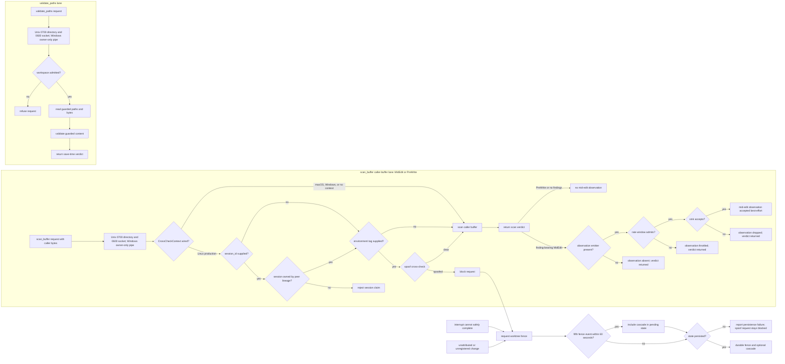

# anvil intercept architecture

| Type         | Authority     | Owner | Status | Freshness                                                                                                                                                        |
| ------------ | ------------- | ----- | ------ | ---------------------------------------------------------------------------------------------------------------------------------------------------------------- |
| Architecture | Authoritative | INTD  | Live   | Last reviewed 2026-08-20 at `f0f834b39` against `src/ipc.rs`, `src/midedit.rs`, `src/save_time.rs`, `src/fence.rs`, and `crates/anvil-cli/src/mcp/validation.rs` |

| Upstream                                                       | Downstream                                     |
| -------------------------------------------------------------- | ---------------------------------------------- |
| `crates/anvil-intercept/src/**`, ADR-085, ADR-090, and ADR-123 | Save-time clients and interception maintainers |

This document is the live component authority. The former central
[intercept as-built](../../docs/architecture/intercept-as-built.md) is retained
as a dated compatibility and history record.

## Scope and boundaries

The local transport boundary differs by platform. On Unix, the daemon relies on
an owner-only `0700` directory and `0600` socket; it does not compare a Unix
caller UID after accept. Unix clients validate the connected daemon UID before
sending proposed content, while the Linux listener also obtains the peer PID
used by optional lineage checks. Windows uses an owner-only named-pipe DACL and
the server explicitly compares the connected peer's SID with the pipe owner's
SID. Save-time `validate_paths` requests then pass workspace admission before
guarded reads and validation. `scan_buffer` is the caller-buffer lane for both
MidEdit and PreWrite requests and has a separate, platform-dependent
cross-check. A fence is a separate durable safety state triggered by spoof
detection, an interrupt that cannot safely complete, or an unattributed or
unregistered change. Cascade engages only after repeated fence events; degraded
assurance alone does not fence a worktree.

## Save, validation, and fence flow

This diagram owns the distinct caller-buffer, save-time, and conditional-fencing
concerns.

The two IPC method lanes trace to [`ipc.rs`](src/ipc.rs) and the production
listener wiring in [`lib.rs`](src/lib.rs). Both MidEdit and PreWrite use the
caller bytes carried by [`scan_buffer`](src/midedit.rs). An optional
[`CrossCheckContext`](src/ipc.rs) first validates a supplied session claim
against the peer-process lineage, then checks a supplied environment tag for
spoofing before scanning that buffer. Production supplies that context only on
Linux. macOS and Windows currently skip both optional checks; embedded listeners
without a context do the same. A finding-bearing MidEdit result is only eligible
for a best-effort mid-edit observation through
[`kindling_observation.rs`](src/kindling_observation.rs); PreWrite scans never
attempt that observation. With no emitter installed, the IPC handler skips the
attempt. An installed emitter may instead be denied by its rate window, and a
sink error logs and drops the row. The production non-blocking sink can also
accept the call but later drop the queued row if its channel is full or its
drain has gone. Emitter absence, rate-window throttling, and sink failure leave
the scan verdict unchanged.

MCP `anvil_validate_write` deliberately calls `scan_buffer` in `PreWrite` mode
rather than `validate_paths`, because it validates proposed caller content that
is not yet on disk. That routing is implemented by the
[`validation.rs`](../anvil-cli/src/mcp/validation.rs) client.

The save-time `validate_paths` lane is different. It authorises the canonical
workspace under Open or Allowlist admission, reads paths through the held
[`WorkspaceAnchor`](src/workspace_anchor.rs), and validates those guarded bytes
through [`save_time.rs`](src/save_time.rs) and
[`validate_paths.rs`](src/validate_paths.rs). It does not run the spoof
cross-check.

Interrupt failure traces to [`interrupt.rs`](src/interrupt.rs), unattributed
change handling to [`unregistered.rs`](src/unregistered.rs), and persistent
state plus the five-events-in-60-seconds cascade to [`fence.rs`](src/fence.rs).
A spoof blocks immediately and independently attempts to persist a fence; even
if that durable write fails, the request remains blocked. Interrupt-safety
failures and unattributed or unregistered changes independently request fences.

## Responsibility and source map

- [`ipc.rs`](src/ipc.rs) owns JSON-RPC framing, method dispatch, bounded
  `scan_buffer` requests, peer context, and platform listener wiring.
- [`midedit.rs`](src/midedit.rs) scans caller-supplied bytes for MidEdit and
  PreWrite. [`kindling_observation.rs`](src/kindling_observation.rs) adds the
  optional, rate-limited observation lane without changing the verdict.
- [`workspace_admission.rs`](src/workspace_admission.rs),
  [`workspace_anchor.rs`](src/workspace_anchor.rs), and
  [`path_safety.rs`](src/path_safety.rs) own canonical workspace admission and
  guarded reads.
- [`validate_paths.rs`](src/validate_paths.rs),
  [`save_time.rs`](src/save_time.rs), and
  [`save_time_driver.rs`](src/save_time_driver.rs) compose save-time validation
  over guarded bytes.
- [`fence.rs`](src/fence.rs), [`interrupt.rs`](src/interrupt.rs), and
  [`unregistered.rs`](src/unregistered.rs) own durable fencing triggers, state,
  and recovery inputs.
- [`assurance.rs`](src/assurance.rs), [`kernel_cache.rs`](src/kernel_cache.rs),
  and [`graph_base_warm_start.rs`](src/graph_base_warm_start.rs) own graph
  assurance and warm state; stale or missing assurance is reported rather than
  silently upgraded.
- [`registration_store.rs`](src/registration_store.rs),
  [`registry.rs`](src/registry.rs), and [`status.rs`](src/status.rs) own
  session/workspace registration and operator-visible state.

The shared wire vocabulary and platform-specific transport internals remain in
`anvil-intercept-proto` and `anvil-intercept-win32`; the
[driver framework as-built](../../docs/architecture/driver-framework-as-built.md)
owns their cross-component client and capability relationship.

## Invariants, failure, and fallback

- Unix IPC relies on its owner-only `0700` directory and `0600` socket to limit
  access. The daemon does not perform a server-side Unix caller-UID comparison;
  clients instead validate the connected daemon UID before sending content.
- Windows IPC uses an owner-only pipe DACL and the server compares the connected
  peer SID with the pipe-owner SID before dispatch.
- The production `scan_buffer` session-ownership and environment-tag spoof
  cross-check is Linux-only and uses the accepted peer PID for optional lineage
  checks. macOS and Windows currently lack that additional lineage assurance.
- Default Open mode first-touch admits a canonical, nameable workspace; opt-in
  Allowlist mode rejects roots outside the operator policy. Missing confinement
  configuration remains Open. Only a present confinement configuration that
  fails its load or trust checks selects the empty-allowlist fail-closed
  posture.
- Validation consumes guarded content rather than reopening an untrusted path
  behind the caller's back.
- An interrupt delivery or identity-safety failure and an unattributed or
  unregistered change request a fence. An ordinary guarded-validation verdict
  does not.
- Fence state persists independently of the observation sink, so a dropped
  notification cannot silently clear a successfully persisted safety posture.
- Stale or unavailable graph assurance is surfaced as degraded evidence; it is
  never relabelled as fresh assurance and does not itself trigger a fence.

The wider client-to-daemon sequence remains in the
[driver framework as-built](../../docs/architecture/driver-framework-as-built.md).
Architecture placement follows
[ADR-123](../../plans/decisions/123-documentation-authority-and-diagram-model.md).
