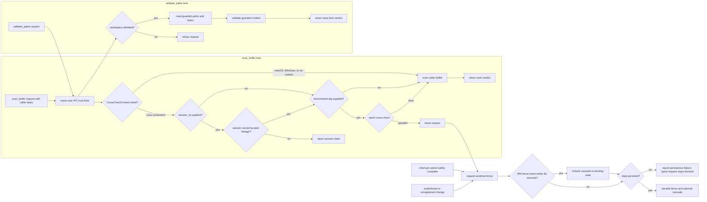

# anvil intercept architecture

| Type         | Authority | Owner | Status | Freshness                                                                                                                                                                          |
| ------------ | --------- | ----- | ------ | ---------------------------------------------------------------------------------------------------------------------------------------------------------------------------------- |
| Architecture | Derived   | INTD  | Live   | Last reviewed 2026-08-20 against `88bd41647`, `crates/anvil-intercept/src/save_time.rs`, `crates/anvil-intercept/src/validate_paths.rs`, and `crates/anvil-intercept/src/fence.rs` |

| Upstream                                                                                                  | Downstream                                     |
| --------------------------------------------------------------------------------------------------------- | ---------------------------------------------- |
| `crates/anvil-intercept/src/**`, ADR-085, ADR-090, ADR-123, and `docs/architecture/intercept-as-built.md` | Save-time clients and interception maintainers |

> **DOCRB-004 pilot:** this local explanation does not replace the retained
> central [intercept as-built](../../docs/architecture/intercept-as-built.md).
> DOCRB-005 owns its migration or deliberate retention.

## Scope and boundaries

The daemon accepts local requests above a same-user IPC trust floor. Unix
transports compare the peer UID with the daemon user's UID; Windows uses an
owner-only named-pipe DACL and explicitly compares the connected peer's SID with
the pipe owner's SID. Save-time `validate_paths` requests then pass workspace
admission before guarded reads and validation. Mid-edit `scan_buffer` requests
use caller-supplied bytes and have a separate, platform-dependent cross-check
lane. A fence is a separate durable safety state triggered by spoof detection,
an interrupt that cannot safely complete, or an unattributed or unregistered
change. Cascade engages only after repeated fence events; degraded assurance
alone does not fence a worktree.

## Save, validation, and fence flow

This diagram owns the distinct mid-edit, save-time, and conditional-fencing
concerns.

The two IPC lanes trace to [`ipc.rs`](src/ipc.rs) and the production listener
wiring in [`lib.rs`](src/lib.rs). For `scan_buffer`, an optional
[`CrossCheckContext`](src/ipc.rs) first validates a supplied session claim
against the peer-process lineage, then checks a supplied environment tag for
spoofing before scanning the caller-provided buffer. Production supplies that
context only on Linux. macOS and Windows currently skip both optional checks and
scan the caller buffer after their transport-level same-user check; embedded
listeners without a context do the same.

The save-time `validate_paths` lane is different. It authorises the canonical
workspace under Open or Allowlist admission, reads paths through the held
[`WorkspaceAnchor`](src/workspace_anchor.rs), and validates those guarded bytes
through [`save_time.rs`](src/save_time.rs) and
[`validate_paths.rs`](src/validate_paths.rs). It does not run the spoof
cross-check.

Interrupt failure traces to [`interrupt.rs`](src/interrupt.rs), unattributed
change handling to [`unregistered.rs`](src/unregistered.rs), and persistent
state plus the five-events-in-60-seconds cascade to [`fence.rs`](src/fence.rs).
A spoof blocks immediately and independently attempts to persist a fence; even
if that durable write fails, the request remains blocked. Interrupt-safety
failures and unattributed or unregistered changes independently request fences.

## Invariants, failure, and fallback

- Local peer credentials must identify the daemon user before request dispatch:
  Unix compares UIDs; Windows uses an owner-only pipe DACL and compares the
  connected peer SID with the pipe-owner SID.
- The production `scan_buffer` session-ownership and environment-tag spoof
  cross-check is Linux-only. macOS and Windows retain the same-user transport
  boundary but currently lack that additional lineage assurance.
- Default Open mode first-touch admits a canonical, nameable workspace; opt-in
  Allowlist mode rejects roots outside the operator policy. Missing confinement
  configuration remains Open. Only a present confinement configuration that
  fails its load or trust checks selects the empty-allowlist fail-closed
  posture.
- Validation consumes guarded content rather than reopening an untrusted path
  behind the caller's back.
- An interrupt delivery or identity-safety failure and an unattributed or
  unregistered change request a fence. An ordinary guarded-validation verdict
  does not.
- Fence state persists independently of the observation sink, so a dropped
  notification cannot silently clear a successfully persisted safety posture.
- Stale or unavailable graph assurance is surfaced as degraded evidence; it is
  never relabelled as fresh assurance and does not itself trigger a fence.

The wider client-to-daemon sequence remains in the
[driver framework as-built](../../docs/architecture/driver-framework-as-built.md).
Architecture placement follows
[ADR-123](../../plans/decisions/123-documentation-authority-and-diagram-model.md).
