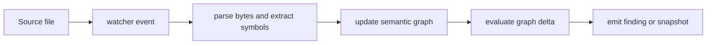

# anvil kernel architecture

| Type         | Authority     | Owner | Status | Freshness                                                                                                                                            |
| ------------ | ------------- | ----- | ------ | ---------------------------------------------------------------------------------------------------------------------------------------------------- |
| Architecture | Authoritative | KERN  | Live   | Last reviewed 2026-08-20 against `f0f834b39`, `src/watch.rs`, `src/embedded.rs`, `src/parser/**`, `src/policy/**`, and `../anvil-graph-cache/src/**` |

| Upstream                                                                              | Downstream                                            |
| ------------------------------------------------------------------------------------- | ----------------------------------------------------- |
| `crates/anvil-kernel/src/**`, `crates/anvil-graph-cache/src/**`, ADR-064, and ADR-123 | Kernel maintainers, CLI surfaces, and event consumers |

This document is the live component authority. The former central
[kernel as-built](../../docs/architecture/kernel-as-built.md) is retained as a
dated compatibility and history record.

## Scope and boundaries

The kernel owns the control loop that turns changed source into policy results.
[`watch.rs`](src/watch.rs) coordinates filesystem events,
[`parser/`](src/parser) provides parsing and symbol extraction, and
[`protocol/`](src/protocol) publishes observable events. Semantic graph storage
and resolution are delegated to `anvil-graph-cache`; policy semantics are
evaluated through the policy engine rather than duplicated here.

## Source-to-finding flow

This diagram owns the kernel's incremental source-processing concern.

The nodes trace to [`watcher/`](src/watcher), [`watch.rs`](src/watch.rs),
[`parser/`](src/parser), the [`anvil-graph-cache` crate](../anvil-graph-cache),
and [`protocol/`](src/protocol). In prose: a watcher event selects a changed
source file; the parser extracts symbols; the graph applies and resolves the
change; the policy engine evaluates that delta; the protocol emitter publishes a
finding or updated snapshot.

## Runtime shapes and source map

The crate exposes two orchestration shapes over the same parser, graph, and
policy vocabulary:

- [`watch.rs`](src/watch.rs) performs validated initial discovery before
  consuming debounced filesystem changes. The initial scan establishes the
  baseline graph before incremental policy evaluation, and the change loop
  isolates a per-file panic with `catch_unwind`.
- [`embedded.rs`](src/embedded.rs) provides `run_embedded` and
  `run_embedded_cancellable` for one-shot in-process callers. Its
  `EmbeddedConfig::plan` field is reserved but is not consumed by the
  implementation.
- [`watcher/`](src/watcher) owns notify integration, the internal file filter,
  user glob filtering, event batches, and the bounded debouncer.
- [`parser/`](src/parser) owns tree-sitter selection, AST caching, and symbol
  and import extraction. The language enum and grammar bindings are defined in
  [`languages.rs`](src/parser/languages.rs); per-language extraction lives under
  [`extract/`](src/parser/extract).
- [`policy/`](src/policy) loads and validates architecture configuration,
  evaluates the cross-layer, new-dependency, public-API, and privilege-expansion
  invariants, and emits deduplicated violations.
- [`protocol/emitter.rs`](src/protocol/emitter.rs) serialises ordered engine
  events for watch consumers.

The semantic graph is deliberately a sibling component. The kernel re-exports
`anvil_graph_cache` as `graph`, while
[`anvil-graph-cache`](../anvil-graph-cache) owns graph mutation, dependency
resolution, trust annotation, bounded certification, hot reads, overlays,
composition, persistence snapshots, and the multi-workspace registry. The
cross-component shape is described by the
[Rust architecture overview](../../docs/architecture/rust-architecture-overview.md);
save-time graph use belongs to the
[intercept architecture](../anvil-intercept/ARCHITECTURE.md).

## Invariants, failure, and fallback

- Initial discovery builds a baseline graph before reporting incremental
  violations, so existing public APIs are not misreported as newly introduced.
- Parse failures are emitted as parse-error events; they do not silently become
  valid graph updates.
- A panic while processing one changed file is isolated and emitted instead of
  terminating the watch loop.
- Configuration reload replaces stale policy state before subsequent evaluation.
- Graph-cache trust annotations are resolved before policy evaluation. Callers
  must not infer trust from a parse result alone.

The wider graph and policy relationships remain linked from the
[kernel as-built](../../docs/architecture/kernel-as-built.md). Diagram authority
and placement are governed by
[ADR-123](../../plans/decisions/123-documentation-authority-and-diagram-model.md).
