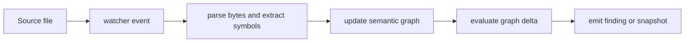

# anvil kernel architecture

| Type         | Authority | Owner | Status | Freshness                                                                                                                                                    |
| ------------ | --------- | ----- | ------ | ------------------------------------------------------------------------------------------------------------------------------------------------------------ |
| Architecture | Derived   | KERN  | Live   | Last reviewed 2026-08-20 against `d6c8b565c`, `crates/anvil-kernel/src/watch.rs`, `crates/anvil-kernel/src/parser/`, and `crates/anvil-kernel/src/protocol/` |

| Upstream                                                                              | Downstream                             |
| ------------------------------------------------------------------------------------- | -------------------------------------- |
| `crates/anvil-kernel/src/**`, `crates/anvil-graph-cache/src/**`, ADR-064, and ADR-123 | Kernel maintainers and event consumers |

> **DOCRB-004 pilot:** this document proves the component-local shape. The
> retained central [kernel as-built](../../docs/architecture/kernel-as-built.md)
> remains the implementation-map authority until DOCRB-005 migrates or
> deliberately retains it.

## Scope and boundaries

The kernel owns the control loop that turns changed source into policy results.
[`watch.rs`](src/watch.rs) coordinates filesystem events,
[`parser/`](src/parser) provides parsing and symbol extraction, and
[`protocol/`](src/protocol) publishes observable events. Semantic graph storage
and resolution are delegated to `anvil-graph-cache`; policy semantics are
evaluated through the policy engine rather than duplicated here.

## Source-to-finding flow

This diagram owns the kernel's incremental source-processing concern.

The nodes trace to [`watcher/`](src/watcher), [`watch.rs`](src/watch.rs),
[`parser/`](src/parser), the [`anvil-graph-cache` crate](../anvil-graph-cache),
and [`protocol/`](src/protocol). In prose: a watcher event selects a changed
source file; the parser extracts symbols; the graph applies and resolves the
change; the policy engine evaluates that delta; the protocol emitter publishes a
finding or updated snapshot.

## Invariants, failure, and fallback

- Initial discovery builds a baseline graph before reporting incremental
  violations, so existing public APIs are not misreported as newly introduced.
- Parse failures are emitted as parse-error events; they do not silently become
  valid graph updates.
- A panic while processing one changed file is isolated and emitted instead of
  terminating the watch loop.
- Configuration reload replaces stale policy state before subsequent evaluation.
- Graph-cache trust annotations are resolved before policy evaluation. Callers
  must not infer trust from a parse result alone.

The wider graph and policy relationships remain linked from the
[kernel as-built](../../docs/architecture/kernel-as-built.md). Diagram authority
and placement are governed by
[ADR-123](../../plans/decisions/123-documentation-authority-and-diagram-model.md).
