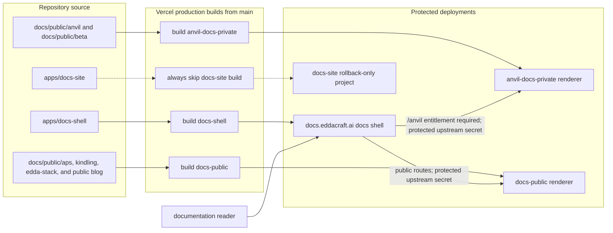

# Documentation delivery

| Type  | Authority     | Owner           | Status | Freshness                                                                                                                                                                                                                                          |
| ----- | ------------- | --------------- | ------ | -------------------------------------------------------------------------------------------------------------------------------------------------------------------------------------------------------------------------------------------------- |
| Guide | Authoritative | DOCRB/DSITE gap | Live   | Last reviewed 2026-08-20 at `d9b30b23d` against `docs/public/**`, `apps/anvil-docs-private/docusaurus.config.ts`, `apps/docs-public/docusaurus.config.ts`, `apps/docs-shell/**`, `infra/src/vercel.ts`, and `tools/scripts/vercel-ignore-build.sh` |

| Upstream                                                                                                                                                                                                                                                       | Downstream                                                                                  |
| -------------------------------------------------------------------------------------------------------------------------------------------------------------------------------------------------------------------------------------------------------------- | ------------------------------------------------------------------------------------------- |
| ADR-123, `docs/public/**`, `apps/anvil-docs-private/docusaurus.config.ts`, `apps/docs-public/docusaurus.config.ts`, `apps/docs-shell/ARCHITECTURE.md`, `infra/src/vercel.ts`, `infra/src/components/vercel-app.ts`, and `tools/scripts/vercel-ignore-build.sh` | Production documentation topology, operations, and public-information-architecture planning |

## Audience, concern, and local authority

This macro view is for documentation maintainers and operators tracing content
from source to the live host. It owns source/build/deployment relationships and
the shell-to-renderer split. Request classification, OAuth state, cookie,
licence, header filtering, redirect, timeout, and response handling remain in
the docs-shell [component architecture](../../apps/docs-shell/ARCHITECTURE.md).
BAUTH owns licence semantics in [authentication as-built](auth-as-built.md).

## Source, build, deployment, and request flow

In prose: governed Markdown under `docs/public/anvil` and `docs/public/beta` is
built by `apps/anvil-docs-private`. APS, kindling, edda-stack, and blog sources
are built by `apps/docs-public`. The independent Next.js `apps/docs-shell` build
owns the public domain `docs.eddacraft.ai`. Vercel's project-level ignore
commands build production from `main` when the relevant app, shared workspace
inputs, or declared content paths change; preview deployments are disabled for
these projects.

Every reader request enters the shell. `/anvil` and `/anvil/*` require a valid
entitled licence before the private renderer is selected. Other matched
documentation routes use the public renderer. The shell injects
`DOCS_UPSTREAM_SECRET` as `X-Docs-Upstream-Secret`; both renderer middleware
boundaries reject direct requests that do not carry the matching secret.

`apps/docs-site` has no production domain, and its ignore command is
`--always-skip`; it is retained only as a rollback artefact and has no live
request edge in the diagram.

## Source trace and ownership gap

- Content mounts and route bases trace to
  `apps/anvil-docs-private/docusaurus.config.ts` and
  `apps/docs-public/docusaurus.config.ts`.
- Build watches, production branch selection, disabled previews, domains,
  renderer hosts, and environment wiring trace to `infra/src/vercel.ts`,
  `infra/src/components/vercel-app.ts`, each app's `vercel.json`, and
  `tools/scripts/vercel-ignore-build.sh`.
- The `/anvil` entitlement branch, public routing branch, and injected
  upstream-secret header trace to `apps/docs-shell/proxy.ts` and
  `apps/docs-shell/lib/jwt.ts`.
- Renderer protection traces to `apps/anvil-docs-private/middleware.ts` and
  `apps/docs-public/middleware.ts`.
- Detailed login, proxy, failure, and fallback behaviour remains in
  `apps/docs-shell/ARCHITECTURE.md`; this macro view does not duplicate it.

The owner remains deliberately unresolved: DOCRB documents the live topology,
while DSITE still owns recorded legacy `apps/docs-site` host work. This
**DOCRB/DSITE ownership gap** does not change either module's status and must
stay visible until its owning bookkeeping work resolves it.
