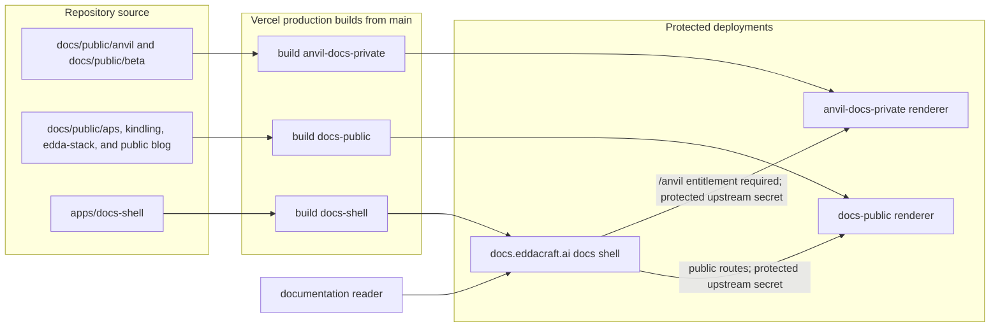

# Documentation delivery

| Type  | Authority     | Owner           | Status | Freshness                                                                                                                                                                                                                                                                                                                                                                                                                                                                                                                                                                                                                                                                                                                                                                                                                                                                                                                                                                                                                                                                                                                                                                                                                                                                                                                                                                                                                                                                                                                                                                                                                                                                                                                                                                                                                                                                                                                                                                                                                                                                                                                                                                                                                                                                                                                                                                                                                                                                                                                                                                                                                                                                                                                                                                                                                                                                                                                                                                                                                                                                                                                                                                                                                                                                                                                                                                                                                                                                                                                                                                                                                                                                                                                        |
| ----- | ------------- | --------------- | ------ | -------------------------------------------------------------------------------------------------------------------------------------------------------------------------------------------------------------------------------------------------------------------------------------------------------------------------------------------------------------------------------------------------------------------------------------------------------------------------------------------------------------------------------------------------------------------------------------------------------------------------------------------------------------------------------------------------------------------------------------------------------------------------------------------------------------------------------------------------------------------------------------------------------------------------------------------------------------------------------------------------------------------------------------------------------------------------------------------------------------------------------------------------------------------------------------------------------------------------------------------------------------------------------------------------------------------------------------------------------------------------------------------------------------------------------------------------------------------------------------------------------------------------------------------------------------------------------------------------------------------------------------------------------------------------------------------------------------------------------------------------------------------------------------------------------------------------------------------------------------------------------------------------------------------------------------------------------------------------------------------------------------------------------------------------------------------------------------------------------------------------------------------------------------------------------------------------------------------------------------------------------------------------------------------------------------------------------------------------------------------------------------------------------------------------------------------------------------------------------------------------------------------------------------------------------------------------------------------------------------------------------------------------------------------------------------------------------------------------------------------------------------------------------------------------------------------------------------------------------------------------------------------------------------------------------------------------------------------------------------------------------------------------------------------------------------------------------------------------------------------------------------------------------------------------------------------------------------------------------------------------------------------------------------------------------------------------------------------------------------------------------------------------------------------------------------------------------------------------------------------------------------------------------------------------------------------------------------------------------------------------------------------------------------------------------------------------------------------------------- |
| Guide | Authoritative | DOCRB/DSITE gap | Live   | Last reviewed 2026-09-16 v0.11.1-beta prepare: changelog promotion and current-version claims Prior review 2026-09-15 for the v0.11.0-beta version bump, dashboard OpenAPI contract, and public reference regen; IA/nav diagrams are unchanged. Prior review 2026-09-15 Windows worktree identity (dunce vs NT-extended paths) and APS Work Items heading in anvil validate; intercept/status lookup identity only, diagrams unchanged. Prior review 2026-09-14 for POSBRD-003/004/005 last-action query_status fields and the public status page; IPC/save/validation/fencing topology and docs delivery diagrams are unchanged. Prior review 2026-09-13 for the v0.10.0-beta prepare; Cargo.toml and the dashboard OpenAPI pin are version-only, and docs/public reference/changelog regen leaves delivery topology unchanged, so the diagrams stand. Prior review 2026-09-13 for the licence-route-inventory test timeout fix; apps/anvil-api gained test-only changes and no production route, contract, or topology moved, so the diagrams stand. Prior review 2026-09-13 for the telemetry mount test timeout fix; apps/anvil-api gained test-only changes and no production route, contract, or topology moved, so the diagrams stand. Prior review 2026-09-10 for JSIMP-006 public guidance copy (continuous journey; no intercept ensure/restart); live docs/public source topology and delivery diagram unchanged. Prior review 2026-09-10 secret-detection ignorable FP path; public checks generator and docs/public copy unchanged in topology Prior review 2026-09-10 for JSIMP-001 public quickstart copy (optional welcome; no intercept ensure). Live docs/public source topology and delivery diagram unchanged. Prior review 2026-09-10 for docs archive tidy of stale public redirect stubs (ai-guardrail-demo/profile, wow-start-demo, developer-acceleration) into docs/archive/public; live docs/public source topology and delivery diagram unchanged. Prior review 2026-09-10 Reviewed against JREL-012 fail-closed journey verification and testing.md command updates. Prior review 2026-09-09 for JREL-005 selected-readiness public guidance; documentation delivery topology and diagram remain unchanged. Prior review 2026-09-09 for the documentation-governance cross-link and docs-workflow skill reminder that /dev-loop must settle docs-owed Freshness before CI; no authority, trigger, exemption, or diagram contract changed. Prior review 2026-09-09 for the hono 4.13.7 dependency bump; auth topology is unaffected. Prior review 2026-09-09 for the next 16.3.4 dependency bump; diagrams and topology are unaffected. Prior review 2026-09-09 for CIB-415 L4 acceptance-policy init/status/public exercise docs; renderer topology, build and delivery diagram unaffected. Prior review 2026-09-09 after docs-shell ARCHITECTURE freshness redate for a dependency-only `next` bump; no topology change, so diagrams stand. Prior review 2026-09-08 for CIB-267 git-hooks silent-pass and pre-push argv docs; renderer topology, build and delivery diagram unaffected. Prior review 2026-09-06 for CIB-411 and CIB-412; the diagram-impact collector now retains infra/\*\* and both rename endpoints, and no authority, trigger, exemption, or diagram contract changed. Prior review 2026-09-05 for SEC-015 docs logout POST forms and SEC-013 shared API authentication; renderer topology, build and delivery diagram unaffected. Prior review 2026-09-03 for CLAWOPEN-011's Neon integration harness and CLAWOPEN-007's generator atomic-output change; `apps/anvil-api` gained test files only and no production route, contract, or topology moved, so the diagrams stand. |

| Upstream                                                                                                                                                                                                                                                       | Downstream                                                                                  |
| -------------------------------------------------------------------------------------------------------------------------------------------------------------------------------------------------------------------------------------------------------------- | ------------------------------------------------------------------------------------------- |
| ADR-123, `docs/public/**`, `apps/anvil-docs-private/docusaurus.config.ts`, `apps/docs-public/docusaurus.config.ts`, `apps/docs-shell/ARCHITECTURE.md`, `infra/src/vercel.ts`, `infra/src/components/vercel-app.ts`, and `tools/scripts/vercel-ignore-build.sh` | Production documentation topology, operations, and public-information-architecture planning |

## Audience, concern, and local authority

This macro view is for documentation maintainers and operators tracing content
from source to the live host. It owns source/build/deployment relationships and
the shell-to-renderer split. Request classification, OAuth state, cookie,
licence, header filtering, redirect, timeout, and response handling remain in
the docs-shell [component architecture](../../apps/docs-shell/ARCHITECTURE.md).
BAUTH owns licence semantics in [authentication as-built](auth-as-built.md).

## Source, build, deployment, and request flow

```mermaid
flowchart LR
    subgraph Source["Repository source"]
        AnvilSource[docs/public/anvil and docs/public/beta]
        PublicSource[docs/public/aps, kindling, edda-stack, and public blog]
        ShellSource[apps/docs-shell]
    end

    subgraph Build["Vercel production builds from main"]
        PrivateBuild[build anvil-docs-private]
        PublicBuild[build docs-public]
        ShellBuild[build docs-shell]
    end

    subgraph Deploy["Protected deployments"]
        Private[anvil-docs-private renderer]
        Public[docs-public renderer]
        Shell[docs.eddacraft.ai docs shell]
    end

    AnvilSource --> PrivateBuild --> Private
    PublicSource --> PublicBuild --> Public
    ShellSource --> ShellBuild --> Shell

    Reader[documentation reader] --> Shell
    Shell -->|/anvil entitlement required; protected upstream secret| Private
    Shell -->|public routes; protected upstream secret| Public
```

In prose: governed Markdown under `docs/public/anvil` and `docs/public/beta` is
built by `apps/anvil-docs-private`. APS, kindling, edda-stack, and blog sources
are built by `apps/docs-public`. The independent Next.js `apps/docs-shell` build
owns the public domain `docs.eddacraft.ai`. Vercel's project-level ignore
commands build production from `main` when the relevant app, shared workspace
inputs, or declared content paths change; preview deployments are disabled for
these projects.

Every reader request enters the shell. `/anvil` and `/anvil/*` require a valid
licence whose verified plan resolves the canonical `docs.access` entitlement to
enabled before the private renderer is selected. Other matched documentation
routes use the public renderer. The shell injects `DOCS_UPSTREAM_SECRET` as
`X-Docs-Upstream-Secret`; both renderer middleware boundaries reject matched
direct requests that do not carry the matching secret. Their matcher excludes
`/favicon.ico`, so the shared-secret statement is deliberately not universal to
every renderer path.

`apps/docs-site` was the rollback artefact: no production domain, ignore command
`--always-skip`, no live request edge. It was retired on 2026-07-08
(`847436623`) and **deleted** once the rollback window closed. The leftover
Vercel project stayed Git-connected in Pulumi, so every `main` push still tried
to deploy the missing `apps/docs-site` root directory and failed. That project
is no longer defined in `infra/src/vercel.ts`. Navigation authority moved to the
live hosts (`apps/anvil-docs-private/sidebars/anvil.ts` and
`apps/docs-public/sidebars/aps.ts`), which is what
`scripts/docs/check-public-docs.mjs` now reads. `docs/public/start-here` went
with the host: only docs-site rendered that section, so it had been unpublished
since the same date.

## Source trace and ownership gap

- Content mounts and route bases trace to
  `apps/anvil-docs-private/docusaurus.config.ts` and
  `apps/docs-public/docusaurus.config.ts`.
- Build watches, production branch selection, disabled previews, domains,
  renderer hosts, and environment wiring trace to `infra/src/vercel.ts`,
  `infra/src/components/vercel-app.ts`, each app's `vercel.json`, and
  `tools/scripts/vercel-ignore-build.sh`.
- The `/anvil` entitlement branch, canonical flag evaluation, public routing
  branch, and injected upstream-secret header trace to
  `apps/docs-shell/proxy.ts`, `apps/docs-shell/lib/feature-flags.ts`, and
  `apps/docs-shell/lib/jwt.ts`.
- Renderer protection and the explicit `/favicon.ico` matcher exclusion trace to
  `apps/anvil-docs-private/middleware.ts` and `apps/docs-public/middleware.ts`.
- Detailed login, proxy, failure, and fallback behaviour remains in
  `apps/docs-shell/ARCHITECTURE.md`; this macro view does not duplicate it.

The **DOCRB/DSITE ownership gap** is closed on the topology side: DOCRB
documents the live hosts, and the legacy `apps/docs-site` host that DSITE owned
no longer exists. Any remaining DSITE work is recorded history, not a live
surface.
