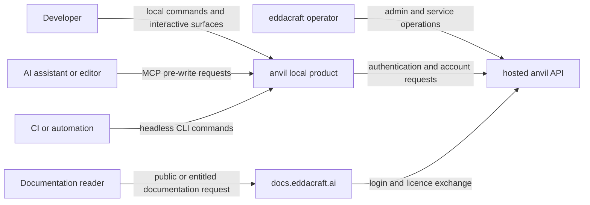
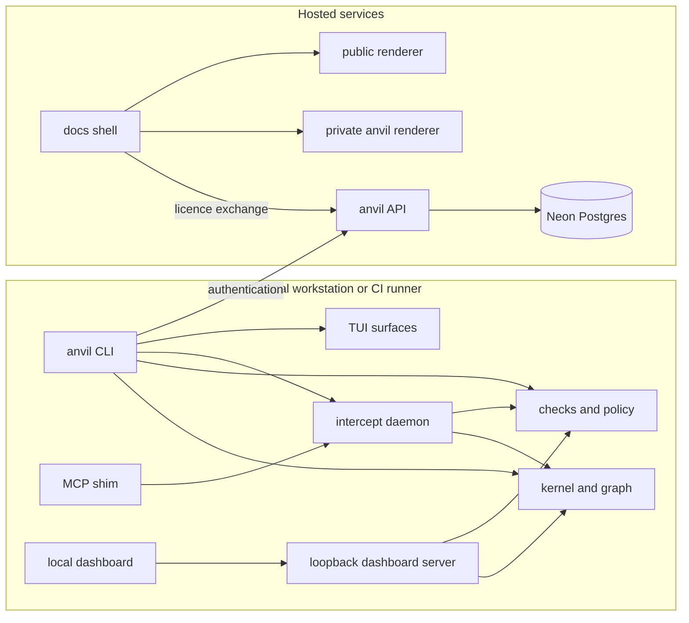

# anvil architecture overview

| Type  | Authority     | Owner | Status | Freshness                                                                                                                                                                |
| ----- | ------------- | ----- | ------ | ------------------------------------------------------------------------------------------------------------------------------------------------------------------------ |
| Guide | Authoritative | DOCRB | Live   | Last reviewed 2026-08-20 at `d9b30b23d` against `crates/anvil-cli/**`, `crates/anvil-intercept/**`, `apps/anvil-api/**`, `apps/docs-shell/**`, and `infra/src/vercel.ts` |

| Upstream                                                                                                                                                                                      | Downstream                                                                            |
| --------------------------------------------------------------------------------------------------------------------------------------------------------------------------------------------- | ------------------------------------------------------------------------------------- |
| ADR-123, `Cargo.toml`, `crates/anvil-cli/README.md`, `crates/anvil-intercept/ARCHITECTURE.md`, `apps/anvil-api/ARCHITECTURE.md`, `apps/docs-shell/ARCHITECTURE.md`, and `infra/src/vercel.ts` | `CONTEXT.md`, `docs/architecture/README.md`, and cross-system architecture navigation |

This document owns two cross-system concerns: who interacts with anvil, and how
the live containers and major components relate. Component internals belong in
component-root `ARCHITECTURE.md` files. Detailed quality, authentication,
memory, Rust-crate, adapter, trust, save-time, and documentation-delivery
concerns remain in the linked authorities below.

## System context

### Audience and concern

This view is for contributors and operators who need to locate a user journey
before following it into a component authority. It owns the system-context
concern only; it does not define authentication, deployment, or internal runtime
steps.

### Context view

In prose: developers, assistants, editors, and CI use the local Rust product.
Local authentication reaches the hosted API, while operators use that hosted
service for administration. Documentation readers enter through
`docs.eddacraft.ai`; the documentation shell uses the hosted auth service for
the entitled anvil path.

The local product boundary traces to `crates/anvil-cli/README.md` and
`crates/anvil-intercept/ARCHITECTURE.md`. The hosted service boundary traces to
`apps/anvil-api/ARCHITECTURE.md`. The documentation entrypoint and its auth edge
trace to `apps/docs-shell/ARCHITECTURE.md` and `infra/src/vercel.ts`.

## Container and component relationships

### Audience and concern

This view is for maintainers locating a cross-container dependency before
opening the owning component documentation. It owns live container and
major-component relationships, not internal request, validation, auth, or
rendering steps.

### Container view

In prose: the CLI composes local kernel, checks, daemon, and TUI capabilities.
The MCP shim uses the daemon when available. The local dashboard talks to its
loopback server, which reads bounded kernel and check state. The hosted API is a
separate service with Neon persistence. The documentation shell is a hosted
entrypoint that consults the API for login/licence exchange and proxies to
private and public renderers.

Local CLI, daemon, kernel, and checks relationships trace to
`crates/anvil-cli/README.md`, `crates/anvil-kernel/ARCHITECTURE.md`, and
`crates/anvil-intercept/ARCHITECTURE.md`. The dashboard boundary traces to
`apps/dashboard/ARCHITECTURE.md` and
`crates/anvil-dashboard-server/ARCHITECTURE.md`. Hosted API and persistence
trace to `apps/anvil-api/ARCHITECTURE.md`. Documentation containers trace to
`apps/docs-shell/ARCHITECTURE.md` and `infra/src/vercel.ts`.

## Detailed authorities

### Check pipeline

The [quality model](quality-model.md) owns checks, findings, gates, and
surfaces; this compatibility heading carries no pipeline detail.

### Gate layer

The [quality model](quality-model.md) also owns gate concepts and the current
runtime-shape layers; this compatibility heading carries no gate detail.

- [Authentication as-built](auth-as-built.md) owns BAUTH flows and token
  semantics.
- [Edda stack](edda-stack.md) owns the Kindling-to-Ember-to-Edda promotion
  contract.
- [Rust architecture overview](rust-architecture-overview.md) owns the Rust
  crate layout.
- [Adapter workflow](../guides/adapters/workflow-guide.md) owns adapter-local
  conversion flow.
- Component-root `ARCHITECTURE.md` files own component internals under
  [ADR-123](../../plans/decisions/123-documentation-authority-and-diagram-model.md).
