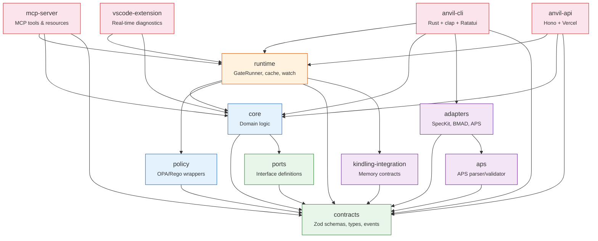
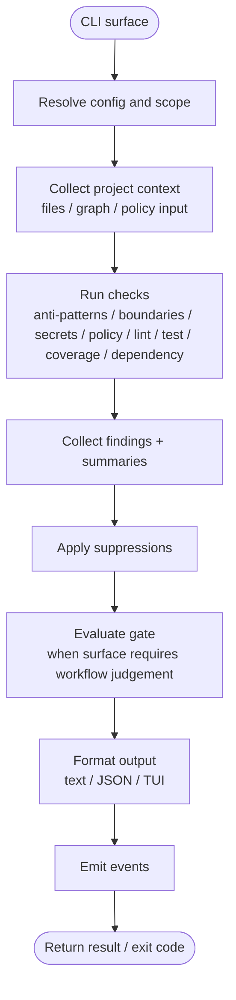
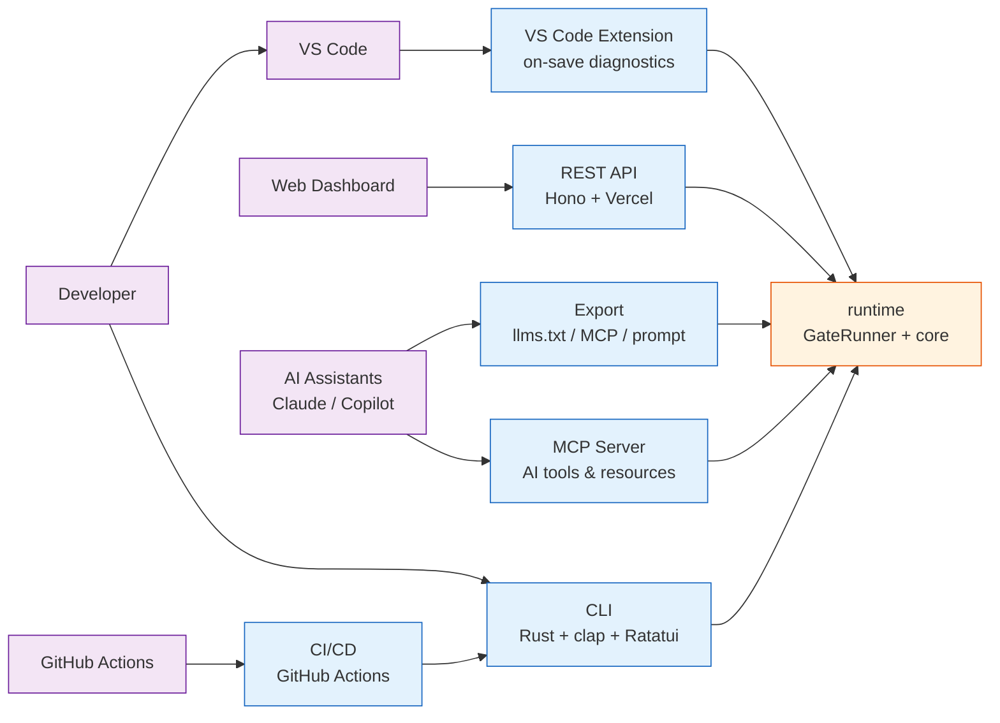
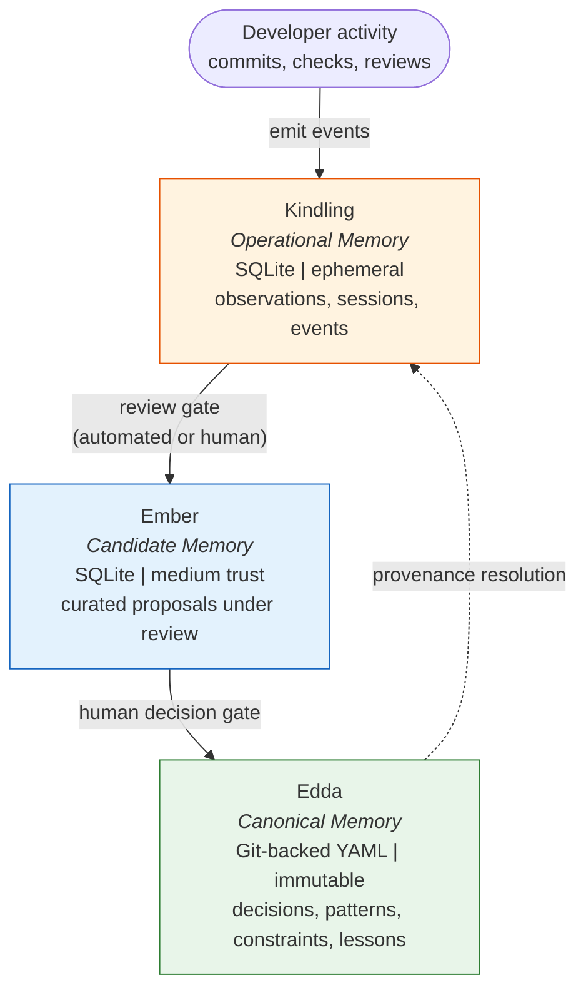
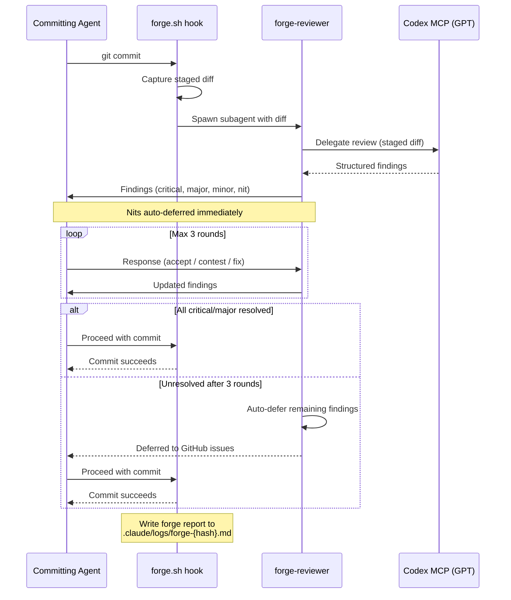

# Anvil Architecture

**Version**: 3.0.0 | **Last Updated**: 27 February 2026 | **Status**: Living
Document

---

## Table of Contents

1. [System Overview](#system-overview)
2. [Package Layering](#package-layering)
3. [Quality Model](#quality-model)
4. [Check Pipeline](#check-pipeline)
5. [Surface Architecture](#surface-architecture)
6. [Hybrid Policy Engine](#hybrid-policy-engine)
7. [State and Configuration](#state-and-configuration)
8. [Memory Stack (Edda Stack)](#memory-stack-edda-stack)
9. [Forge Pipeline](#forge-pipeline)
10. [Technology Stack](#technology-stack)
11. [Key Architectural Decisions](#key-architectural-decisions)

---

## System Overview

Anvil is a deterministic development automation platform that catches
architecture drift and AI anti-patterns at file save-time. It analyses
TypeScript/JavaScript codebases for dependency violations, anti-patterns, policy
breaches, and security risks -- then surfaces findings as warnings rather than
build-blocking errors.

### Design Philosophy

Four principles govern every architectural decision:

1. **Planless-first** -- Anvil delivers value without requiring plans, specs, or
   configuration. The current codebase and its dependency structure are the
   baseline source of truth. Plans (APS) are an accelerant, not a prerequisite.
   ([D-001](../plans/decisions/001-planless-first.md))

2. **Deterministic** -- Same input produces same output, always. Hash-stable
   canonicalisation, deterministic validation (no race conditions), and
   reproducible execution environments.

3. **Composable** -- Every check, policy, adapter, and surface is independently
   usable. The CLI, VS Code extension, MCP server, and REST API all consume the
   same runtime without coupling to each other.

4. **Safety by default** -- Warnings over blocks
   ([D-002](../plans/decisions/002-warnings-over-blocks.md)). New edges only
   ([D-003](../plans/decisions/003-new-edges-only.md)). Existing violations are
   baselined on first run so developers are never overwhelmed by a wall of
   warnings they did not introduce.

---

## Package Layering

The monorepo enforces a strict unidirectional dependency graph. Each layer may
only depend on layers below it -- never sideways or upward.

```
contracts (zero deps)
    --> ports (contracts only)
        --> core (contracts, ports)
            --> runtime (core, policy, contracts)
                --> CLI / MCP / API (runtime, core, adapters, ...)
```

### Packages

| Package                          | npm Name                      | Purpose                                                                                            |
| -------------------------------- | ----------------------------- | -------------------------------------------------------------------------------------------------- |
| `packages/anvil/contracts/`      | `@eddacraft/anvil-contracts`  | Zod schemas, types, events. Zero dependencies.                                                     |
| `packages/anvil/ports/`          | `@eddacraft/anvil-ports`      | Interface definitions. Depends only on contracts.                                                  |
| `packages/anvil/core/`           | `@eddacraft/anvil-core`       | Pure domain logic: antipattern, architecture, drift, suppression, validation, explain, provenance. |
| `packages/anvil/runtime/`        | `@eddacraft/anvil-runtime`    | GateRunner orchestration, cache, watch, export, concurrency.                                       |
| `packages/anvil/policy/`         | `@eddacraft/anvil-policy`     | OPA/Rego wrappers and policy evaluation.                                                           |
| `packages/adapters/`             | `@eddacraft/anvil-adapters`   | Format converters (SpecKit, BMAD, APS).                                                            |
| `packages/aps/`                  | `@eddacraft/anvil-aps`        | APS document parser and validator.                                                                 |
| `packages/mcp-server/`           | `@eddacraft/anvil-mcp-server` | MCP tools, resources, and prompts.                                                                 |
| `packages/vscode-extension/`     | --                            | VS Code extension for real-time diagnostics.                                                       |
| `packages/eslint-plugin-anvil/`  | `eslint-plugin-anvil`         | Test quality ESLint rules.                                                                         |
| `packages/edda-stack/`           | --                            | Kindling, Ember, Edda memory layers (planned).                                                     |
| `packages/kindling-integration/` | --                            | Kindling memory contracts and emitters.                                                            |

### Apps

| App                         | Purpose                                                 |
| --------------------------- | ------------------------------------------------------- |
| `crates/anvil-cli/`         | CLI (Rust + clap + Ratatui TUI) -- primary entry point. |
| `apps/anvil-api/`           | REST API (Hono + Vercel + Neon Postgres).               |
| `apps/admin-cli/`           | Operator CLI for admin/audit flows against the API.     |
| `apps/website/`             | Marketing site + dashboard (Next.js).                   |
| `apps/docs-public/`         | Public Docusaurus docs for APS, Kindling, edda-stack.   |
| `apps/docs-shell/`          | Next.js docs entrypoint and auth proxy.                 |
| `apps/anvil-docs-private/`  | Gated internal Docusaurus docs.                         |
| `apps/docs-site/`           | Legacy Docusaurus docs site (cutover to docs-public).   |
| `apps/e2e/`                 | Vitest E2E harness across CLI, API, and contracts.      |

### Dependency Diagram



---

## Quality Model

Anvil's quality architecture is built around four concepts:

1. **Checks** — the smallest user-facing evaluative unit
2. **Findings** — the generic results emitted by checks
3. **Gates** — workflow judgement over one or more checks
4. **Surfaces** — commands and UIs that expose checks, findings, and gates for
   different purposes

This distinction matters because Anvil has several adjacent surfaces that would
otherwise blur together: `check`, `gate`, `watch`, `audit`, `doctor`,
`architecture`, and `policy`.

### Surface Roles

- `anvil check` — targeted or exploratory analysis; best when the goal is to
  inspect files and surface findings
- `anvil gate` — workflow judgement; best when the question is whether work
  passes the required set of checks
- `anvil watch` — continuous mode over checks and gates as files change
- `anvil doctor` — setup and environment health checks; not a gate
- `anvil audit` — broad repository review; may use `issue` in its own UX, but
  still belongs to the same underlying quality model
- `anvil architecture` — configuration and structure-definition surface
- `anvil policy` — policy authoring, inspection, validation, and testing surface

The canonical internal reference for this language is
[`quality-model.md`](quality-model.md).

### Relationship Diagram

```mermaid
flowchart TD
    graph["Project graph / structure"]
    checks["Checks\nsecret / boundaries / policy / anti-patterns / lint / test / coverage"]
    findings["Findings\nwarning / violation / info"]
    gate["Gate\nworkflow judgement"]
    surfaces["Surfaces\ncheck / gate / watch / audit / doctor / tutorial"]

    graph --> checks
    checks --> findings
    checks --> gate
    findings --> gate
    findings --> surfaces
    gate --> surfaces
```

---

## Check Pipeline

The core runtime flow -- how analysis and gate evaluation move from invocation
to findings and workflow judgement.

### Pipeline Steps

1. **CLI parses arguments** and resolves project configuration.
2. **Project context gathered** — files, graph/structure data, optional plan
   scope, policy inputs, and runtime environment.
3. **Checks execute** — different entry points may run different check sets.
   Core check families include:
   - anti-pattern scan
   - import-boundary checks
   - secret detection
   - policy evaluation
   - lint
   - test
   - coverage
   - dependency scan
4. **Findings collected** — each check emits findings, severity, and summary
   information.
5. **Suppressions applied** from `.anvil/suppressions.json` and inline
   `@anvil-ignore` annotations
   ([D-004](../../plans/decisions/004-suppression-syntax.md)).
6. **Gate evaluated** when the caller is a gate-style surface (`anvil gate`,
   watch mode, CI workflow judgement).
7. **Output formatted** as text, JSON, or interactive TUI.
8. **Kindling events emitted** for operational memory where applicable.
9. **Exit code chosen** according to the command surface and configured
   threshold semantics.

### Pipeline Diagram



---

## Surface Architecture

Anvil exposes its runtime through multiple surfaces. Each surface is a thin
adapter over the same core runtime -- no surface contains domain logic.

| Surface               | Technology                              | Primary Use                                                                   |
| --------------------- | --------------------------------------- | ----------------------------------------------------------------------------- |
| **CLI**               | Rust + clap + Ratatui TUI               | Developer workflow, CI/CD                                                     |
| **VS Code Extension** | VS Code API                             | Real-time diagnostics on save                                                 |
| **MCP Server**        | MCP protocol                            | AI code generation tools (check, gate, fix, suppress, status, query-boundary) |
| **REST API**          | Hono + Vercel                           | Dashboard consumption                                                         |
| **CI/CD**             | GitHub Actions composite action         | PR checks                                                                     |
| **Export**            | llms.txt, MCP resource, prompt fragment | Constraint export for AI contexts                                             |

### Surface Connectivity Diagram



---

## Hybrid Policy Engine

Anvil uses a hybrid architecture combining dependency-cruiser (DC) for static
import graph analysis with Open Policy Agent (OPA) for policy evaluation.
([D-006](../plans/decisions/006-hybrid-dc-opa.md))

### Why Hybrid

Neither tool does everything well on its own:

| Capability                    | Best Tool          |
| ----------------------------- | ------------------ |
| TypeScript import parsing     | dependency-cruiser |
| Circular dependency detection | dependency-cruiser |
| Layer violation detection     | dependency-cruiser |
| Orphaned module detection     | dependency-cruiser |
| Business rule evaluation      | OPA                |
| Change scope enforcement      | OPA                |
| Security review policies      | OPA                |
| Architecture rule testing     | OPA                |
| Remote policy distribution    | OPA                |

### Data Flow

1. **Architecture YAML** (`.anvil/architecture.yaml`) defines layers,
   boundaries, and allowed dependencies using a declarative schema.
2. Anvil **auto-generates** both:
   - `.anvil/dependency-cruiser.js` -- DC rules for static analysis.
   - `.anvil/policies/.generated/architecture.rego` -- OPA policies for
     evaluation.
3. **DC runs first**, producing a structured dependency graph with violations.
4. **DC results are injected into OPA input**, so Rego policies can reason about
   the actual import graph alongside business rules.
5. Both produce **unified warnings** that flow into the check pipeline.

### Incremental Adoption

The hybrid approach matches the planless-first philosophy:

- **Without OPA**: Full DC analysis and architecture boundary enforcement. Zero
  additional setup required.
- **With OPA**: DC analysis + custom Rego policies + DC-informed rules. Opt-in
  for teams that need business rules, change scope limits, or security reviews.

### Architecture Templates

Pre-built templates generate the correct DC and Rego rules for common
architecture styles:

- **Layered** -- strict top-down dependency flow
- **Hexagonal** -- ports and adapters isolation
- **Clean Architecture** -- dependency rule (inward only)
- **DDD** -- bounded context enforcement

```yaml
# .anvil/architecture.yaml
template: hexagonal
layers:
  domain:
    paths: ['src/domain/**']
  infrastructure:
    paths: ['src/infrastructure/**']
    depends_on: [domain]
```

---

## State and Configuration

All Anvil state lives in the `.anvil/` directory at the project root. This
directory is intended to be committed to version control (except for caches).

| File                     | Purpose                                                                                                                          |
| ------------------------ | -------------------------------------------------------------------------------------------------------------------------------- |
| `config.anvil.json`      | Project configuration: enabled checks, thresholds, output format, watch settings.                                                |
| `architecture.yaml`      | Layer definitions, boundary rules, architecture template selection.                                                              |
| `baseline.json`          | Drift baseline snapshot -- existing violations captured on first run. Only new violations after this snapshot generate warnings. |
| `suppressions.json`      | Suppression store -- intentional bypasses with required reasoning, tracked by warning ID, author, and timestamp.                 |
| `policies/*.rego`        | Custom OPA policies authored by the team.                                                                                        |
| `policies/.generated/`   | Auto-generated Rego from `architecture.yaml`. Do not edit manually.                                                              |
| `.dependency-cruiser.js` | Auto-generated DC configuration from `architecture.yaml`. Do not edit manually.                                                  |

### Suppression Format

Inline annotations and the suppressions store both follow the same schema
([D-004](../plans/decisions/004-suppression-syntax.md)):

```typescript
// @anvil-ignore ARCH-001: Legacy auth integration, see TECH-123
// @anvil-ignore-until 2026-06-01 AP-002: Temp workaround for migration
```

- Warning ID is required -- no blanket suppressions.
- Reason is required -- the parser rejects empty reasons.
- The `-until` variant enables time-boxed suppressions that auto-expire.

---

## Memory Stack (Edda Stack)

The Edda Stack is a three-layer architecture governing how activity becomes
institutional memory. Planned for delivery in v0.4.0. (See
[edda-stack-integration.aps.md](../../plans/archive/modules/edda-stack-integration.aps.md))

### Three Layers

| Layer        | Role                                                                                   | Trust Level       | Storage         | Frequency                 |
| ------------ | -------------------------------------------------------------------------------------- | ----------------- | --------------- | ------------------------- |
| **Kindling** | Operational memory -- captures observations without judgement                          | Low (raw)         | SQLite          | High-frequency, ephemeral |
| **Ember**    | Candidate memory -- curated observations under review, meaning without authority       | Medium (proposed) | SQLite          | Medium-frequency          |
| **Edda**     | Canonical memory -- institutional knowledge: decisions, patterns, constraints, lessons | High (accepted)   | Git-backed YAML | Low-frequency, immutable  |

### Governing Rules

1. Kindling cannot judge (facts only).
2. Ember cannot decide (proposals only).
3. Edda cannot speculate (curated truths only).
4. Each layer is intentionally limited.
5. Meaning emerges only through their separation.

### Memory Object Types

`decision` | `pattern` | `constraint` | `warning` | `doctrine` | `lesson`

### Promotion Flow

```
Kindling observes --> captures without judgement
Ember reflects   --> meaning without authority
Edda remembers   --> memory with restraint
```

Promotion is always gated: Kindling to Ember is review-gated (automated or
human), Ember to Edda is human-decision-gated. Edda entries are immutable,
versioned, and auditable.

### Memory Stack Diagram



---

## Forge Pipeline

Pre-commit code review pipeline. (See
[forge-hook-agent.aps.md](../../plans/archive/modules/01-forge-hook-agent.aps.md))

### Forge (Pre-commit, Local)

The `forge.sh` PreToolUse hook intercepts `git commit` commands and spawns a
`forge-reviewer` subagent. The reviewer performs cross-model review via the
codex MCP (GPT delegation), then enters a structured negotiation protocol with
the committing agent.

**Severity-based action matrix:**

| Severity | Action          | Behaviour                                         |
| -------- | --------------- | ------------------------------------------------- |
| Critical | Must fix        | Commit blocked until resolved                     |
| Major    | Must fix        | Commit blocked until resolved                     |
| Minor    | Author's choice | Agent decides whether to address                  |
| Nit      | Auto-deferred   | Filed as GitHub issue with `forge:deferred` label |

**Negotiation rules:**

- Maximum 3 rounds of negotiation (`CLAUDE_FORGE_MAX_ROUNDS`).
- If consensus is not reached after 3 rounds, remaining findings are
  auto-deferred.
- Nits are always auto-deferred without negotiation
  (`CLAUDE_FORGE_AUTO_DEFER_NITS`).

### Forge Negotiation Sequence



---

## Technology Stack

### Rust (CLI + Engine)

| Category      | Technology        | Version | Purpose                                    |
| ------------- | ----------------- | ------- | ------------------------------------------ |
| Language      | Rust              | Ed.2024 | CLI binary, kernel, gate checks, TUI       |
| CLI framework | clap              | 4.x     | Command parsing and routing                |
| TUI           | Ratatui           | 0.30    | Terminal UI (native Rust)                  |
| TUI backend   | crossterm         | 0.29    | Terminal backend                           |
| AST parsing   | tree-sitter       | 0.26    | Incremental parsing (<1ms/file)            |
| File watching | notify            | 8       | File system events (<20ms p99)             |
| Graph         | petgraph          | 0.8     | Semantic graph (symbol, dependency, trust) |
| Async         | tokio             | 1       | Async runtime (full features)              |
| Testing       | insta + criterion | --      | Snapshot testing + benchmarks              |
| Distribution  | cargo-dist        | --      | Cross-platform binary releases (6 targets) |

### TypeScript (Domain Packages + Services)

| Category          | Technology              | Version  | Purpose                                            |
| ----------------- | ----------------------- | -------- | -------------------------------------------------- |
| Language          | TypeScript              | 6.0      | Domain packages, API, website (strict mode, ESM)   |
| Runtime           | Node.js                 | >= 22.13 | TypeScript execution environment                   |
| Package manager   | pnpm                    | >= 10.20 | Workspace management, strict isolation             |
| Monorepo          | NX                      | 22.x     | Task orchestration, caching, dependency graph      |
| HTTP framework    | Hono                    | --       | REST API (Vercel-deployable)                       |
| Testing           | Vitest                  | 4.x      | Unit and integration tests                         |
| E2E testing       | Vitest + Playwright     | 4.x / 1.x | `apps/e2e` Vitest harness (CLI/API/contracts); Playwright for browser flows (`playwright.config.ts`) |
| Schema validation | Zod                     | --       | Runtime type validation, source of truth for types |
| Static analysis   | dependency-cruiser      | --       | Import graph analysis, layer violations            |
| Policy engine     | OPA / Rego              | --       | Policy-as-code evaluation                          |
| Linting           | ESLint                  | 9.x      | Code quality and style enforcement                 |
| Formatting        | Prettier                | 3.x      | Code formatting                                    |
| IaC               | Pulumi (TypeScript)     | --       | Vercel, GitHub, Azure DNS management               |
| Database          | Neon Postgres           | --       | API persistence layer                              |
| Deployment        | Vercel                  | --       | Website, docs apps, and API hosting                |
| CI/CD             | GitHub Actions          | --       | Build, test, deploy                                |
| Memory storage    | SQLite (better-sqlite3) | --       | Kindling operational memory                        |

---

## Key Architectural Decisions

All decisions are recorded as ADRs in [`plans/decisions/`](../plans/decisions/).

| ID                                                      | Decision             | Summary                                                                                                          |
| ------------------------------------------------------- | -------------------- | ---------------------------------------------------------------------------------------------------------------- |
| [D-001](../plans/decisions/001-planless-first.md)       | Planless-first       | Anvil delivers value without requiring plans or configuration. The codebase is the source of truth.              |
| [D-002](../plans/decisions/002-warnings-over-blocks.md) | Warnings over blocks | Warnings do not block by default. Exit code 0 for warnings. CI opt-in for `fail-on-warnings: true`.              |
| [D-003](../plans/decisions/003-new-edges-only.md)       | New edges only       | Existing violations are baselined. Only new violations introduced after the baseline generate warnings.          |
| [D-004](../plans/decisions/004-suppression-syntax.md)   | Suppression syntax   | `@anvil-ignore WARNING-ID: reason` with optional `-until DATE` for time-boxed suppressions.                      |
| [D-005](../plans/decisions/005-ink-over-opentui.md)     | Ink over OpenTUI     | _Superseded by Rust + Ratatui migration (see D-011a)._ Originally chose Ink; now replaced by native Ratatui TUI. |
| [D-006](../plans/decisions/006-hybrid-dc-opa.md)        | Hybrid DC + OPA      | dependency-cruiser for static analysis, OPA for policy evaluation, with DC results fed into OPA input.           |
| [D-007](../plans/decisions/007-pulumi-iac.md)           | Pulumi for IaC       | TypeScript-native IaC using Pulumi open source. Manages Vercel, GitHub, and Azure DNS.                           |

---

_This is a living document. Update it when architecture changes are made. For
implementation-level detail, see module specs in
[`plans/modules/`](../plans/modules/)._
