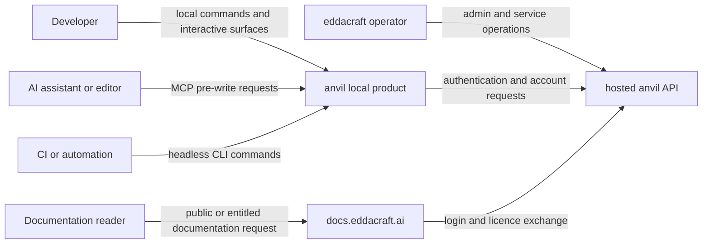
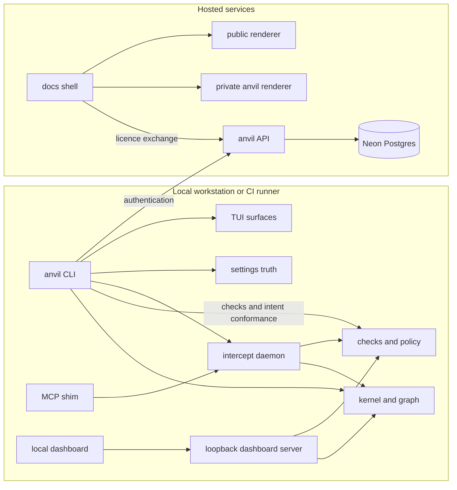

# anvil architecture overview

| Type  | Authority     | Owner | Status | Freshness                                                                                                                                                                                                                                                                                                                                                                                                                                                                                                                                                                                                                                                                                                                                                                                                                                                                                                                                                                                                                                                                                                                                                                                                                                                                                                                                                                                                                                                                                                                                                                                                                                                                                                                                                                                                                                                                                                                                                                                                                                                                                                                                                                                                                                                                                                                                                                                                                                                                                                                                                                                                                                                                                                                                                                                                                                                                                                                                                                                                                                                                                                                                                                                                                                                                                                                                                                                                                                                                                                                                                                                                                                                                                                                                                                                                                                                                                                                                                                                                                                                                                                                                                                                                                                                                                                                                                                                                                                   |
| ----- | ------------- | ----- | ------ | ------------------------------------------------------------------------------------------------------------------------------------------------------------------------------------------------------------------------------------------------------------------------------------------------------------------------------------------------------------------------------------------------------------------------------------------------------------------------------------------------------------------------------------------------------------------------------------------------------------------------------------------------------------------------------------------------------------------------------------------------------------------------------------------------------------------------------------------------------------------------------------------------------------------------------------------------------------------------------------------------------------------------------------------------------------------------------------------------------------------------------------------------------------------------------------------------------------------------------------------------------------------------------------------------------------------------------------------------------------------------------------------------------------------------------------------------------------------------------------------------------------------------------------------------------------------------------------------------------------------------------------------------------------------------------------------------------------------------------------------------------------------------------------------------------------------------------------------------------------------------------------------------------------------------------------------------------------------------------------------------------------------------------------------------------------------------------------------------------------------------------------------------------------------------------------------------------------------------------------------------------------------------------------------------------------------------------------------------------------------------------------------------------------------------------------------------------------------------------------------------------------------------------------------------------------------------------------------------------------------------------------------------------------------------------------------------------------------------------------------------------------------------------------------------------------------------------------------------------------------------------------------------------------------------------------------------------------------------------------------------------------------------------------------------------------------------------------------------------------------------------------------------------------------------------------------------------------------------------------------------------------------------------------------------------------------------------------------------------------------------------------------------------------------------------------------------------------------------------------------------------------------------------------------------------------------------------------------------------------------------------------------------------------------------------------------------------------------------------------------------------------------------------------------------------------------------------------------------------------------------------------------------------------------------------------------------------------------------------------------------------------------------------------------------------------------------------------------------------------------------------------------------------------------------------------------------------------------------------------------------------------------------------------------------------------------------------------------------------------------------------------------------------------------------------------------- |
| Guide | Authoritative | DOCRB | Live   | Last reviewed 2026-09-10 for JREL-011 ensure spend-gate follow-up; diagrams unaffected. Prior review 2026-09-10 for the jsonschema 0. Prior review 2026-09-10 for JREL-011 lifecycle budget on daemon ensure (coordinator/start-lock wait, unresponsive vs absent); depicted transport topology, trust boundaries, and save/validation transitions are unchanged, so the diagrams stand. Prior review 2026-09-10 for the animate-core 0.7.0 dependency bump; animation timing stays behind the eddacraft-tui shim with no container, component, edge, or boundary changes. Prior review 2026-09-10 for the regorus 0.12.0 dependency bump; crate version only — no container, component, edge, or boundary changes. Prior review 2026-09-10 for the dirs 7.0.0 dependency bump; crate version only — no container, component, edge, or boundary changes. Prior review 2026-09-10 Reviewed against JREL-012 fail-closed journey verification and testing.md command updates. Prior review 2026-09-09 JREL-005 typed status readiness changes no depicted topology, trust boundary, or save-to-validation flow; diagrams stand. Prior review 2026-09-09 for the documentation-governance cross-link and docs-workflow skill reminder that /dev-loop must settle docs-owed Freshness before CI; no authority, trigger, exemption, or diagram contract changed. Prior review 2026-09-09 for the hono 4.13.7 dependency bump; auth topology is unaffected. Prior review 2026-09-09 for the next 16.3.4 dependency bump; diagrams and topology are unaffected. Prior review 2026-09-09 for the CIB-160 residual daemon `current_exe` OnceLock cache; depicted transport topology, trust boundaries, and save/validation transitions are unchanged, so the diagrams stand. Prior review 2026-09-09 after docs-shell ARCHITECTURE freshness redate for a dependency-only `next` bump; no topology change, so diagrams stand. Prior review 2026-09-08 for CIB-160 peer-exe faithfulness probe wait: canary exe is polled until exec before the durable wire gate fail-closes; depicted transport topology, trust boundaries, and save/validation transitions are unchanged, so the diagrams stand. Prior review 2026-09-07 for JREL-004 #4432 option B (state-home rendezvous coordinator, HOME-preferred lock selection); save/validation/fence diagrams unchanged — lifecycle lock/discovery, not transport topology. Prior review 2026-09-07 for JREL-003/004 residuals: heartbeat is not a spawn trigger and the bounded stop releases the driver map lock; depicted transport topology, trust boundaries, and save/validation transitions are unchanged, so the diagrams stand. Prior review 2026-09-07 against JREL-004 one daemon identity through start and recycle: the background ensure launcher now verifies every same-scope endpoint candidate under the rendezvous coordinator before spawning, version recycle signals only the daemon instances it observed and requires the replacement to answer with the CLI version, and intercept status names the verified PID beside the answering endpoint. Lifecycle coordination and stop targeting change; the depicted transport topology, trust boundaries, and save/validation transitions are unchanged, so the diagrams stand. Prior review 2026-09-07 for DPO-007 intercept architecture freshness; scan_buffer, save-to-validation and trust diagrams are unchanged. Prior review 2026-09-07 for JREL-002: the intercept architecture note was refreshed for a surface-identifier extraction in `status.rs`, which is claim-construction plumbing — no authority, boundary, transition or diagram contract moved. Prior review 2026-09-06 for CIB-411 and CIB-412; the diagram-impact collector now retains infra/\*\* and both rename endpoints, and no authority, trigger, exemption, or diagram contract changed. Prior review 2026-09-06 (repository local date; 2026-09-05 UTC) for CONV-002's internal CLI/MCP scan extraction; topology, protocol, review scope and historical evidence here are unaffected. Last reviewed 2026-09-05 for SEC-013 shared API account-status enforcement and SEC-015 docs logout; system topology, ownership and overview diagram unaffected. Prior review 2026-09-03 for CLAWOPEN-011's Neon integration harness and CLAWOPEN-007's generator atomic-output change; `apps/anvil-api` gained test files only and no production route, contract, or topology moved, so the diagrams stand. |

| Upstream                                                                                                                                                                                                                         | Downstream                                                                            |
| -------------------------------------------------------------------------------------------------------------------------------------------------------------------------------------------------------------------------------- | ------------------------------------------------------------------------------------- |
| ADR-123, `Cargo.toml`, `crates/anvil-cli/README.md`, `crates/anvil-settings/README.md`, `crates/anvil-intercept/ARCHITECTURE.md`, `apps/anvil-api/ARCHITECTURE.md`, `apps/docs-shell/ARCHITECTURE.md`, and `infra/src/vercel.ts` | `CONTEXT.md`, `docs/architecture/README.md`, and cross-system architecture navigation |

This document owns two cross-system concerns: who interacts with anvil, and how
the live containers and major components relate. Component internals belong in
component-root `ARCHITECTURE.md` files. Detailed quality, authentication,
memory, Rust-crate, adapter, trust, save-time, and documentation-delivery
concerns remain in the linked authorities below.

## System context

### Audience and concern

This view is for contributors and operators who need to locate a user journey
before following it into a component authority. It owns the system-context
concern only; it does not define authentication, deployment, or internal runtime
steps.

### Context view

```mermaid
flowchart LR
    Developer[Developer] -->|local commands and interactive surfaces| Local[anvil local product]
    Assistant[AI assistant or editor] -->|MCP pre-write requests| Local
    CI[CI or automation] -->|headless CLI commands| Local
    Operator[eddacraft operator] -->|admin and service operations| Hosted[hosted anvil API]
    Local -->|authentication and account requests| Hosted
    Reader[Documentation reader] -->|public or entitled documentation request| Docs[docs.eddacraft.ai]
    Docs -->|login and licence exchange| Hosted
```

In prose: developers, assistants, editors, and CI use the local Rust product.
Local authentication reaches the hosted API, while operators use that hosted
service for administration. Documentation readers enter through
`docs.eddacraft.ai`; the documentation shell uses the hosted auth service for
the entitled anvil path.

The local product boundary traces to `crates/anvil-cli/README.md` and
`crates/anvil-intercept/ARCHITECTURE.md`. The hosted service boundary traces to
`apps/anvil-api/ARCHITECTURE.md`. The documentation entrypoint and its auth edge
trace to `apps/docs-shell/ARCHITECTURE.md` and `infra/src/vercel.ts`.

## Container and component relationships

### Audience and concern

This view is for maintainers locating a cross-container dependency before
opening the owning component documentation. It owns live container and
major-component relationships, not internal request, validation, auth, or
rendering steps.

### Container view

```mermaid
flowchart LR
    subgraph Local["Local workstation or CI runner"]
        CLI[anvil CLI]
        MCP[MCP shim]
        Daemon[intercept daemon]
        Kernel[kernel and graph]
        Checks[checks and policy]
        Settings[settings truth]
        TUI[TUI surfaces]
        Dashboard[local dashboard]
        DashboardServer[loopback dashboard server]

        CLI --> Kernel
        CLI -->|checks and intent conformance| Checks
        CLI --> Daemon
        CLI --> Settings
        CLI --> TUI
        MCP --> Daemon
        Daemon --> Kernel
        Daemon --> Checks
        Dashboard --> DashboardServer
        DashboardServer --> Kernel
        DashboardServer --> Checks
    end

    subgraph Hosted["Hosted services"]
        API[anvil API]
        Database[(Neon Postgres)]
        DocsShell[docs shell]
        Private[private anvil renderer]
        Public[public renderer]

        API --> Database
        DocsShell -->|licence exchange| API
        DocsShell --> Private
        DocsShell --> Public
    end

    CLI -->|authentication| API
```

In prose: the CLI composes local kernel, checks, daemon, settings, and TUI
capabilities. Its checks boundary includes on-demand intent conformance over a
caller-supplied PR declaration and exact Git range; it requires no planning
system or resident graph. The MCP shim uses the daemon when available. The local
dashboard talks to its loopback server, which reads bounded kernel and check
state. The hosted API is a separate service with Neon persistence. The
documentation shell is a hosted entrypoint that consults the API for
login/licence exchange and proxies to private and public renderers.

Local CLI, daemon, kernel, checks, and settings relationships trace to
`crates/anvil-cli/README.md`, `crates/anvil-kernel/ARCHITECTURE.md`,
`crates/anvil-intercept/ARCHITECTURE.md`, and `crates/anvil-settings/README.md`.
The dashboard boundary traces to `apps/dashboard/ARCHITECTURE.md` and
`crates/anvil-dashboard-server/ARCHITECTURE.md`. Hosted API and persistence
trace to `apps/anvil-api/ARCHITECTURE.md`. Documentation containers trace to
`apps/docs-shell/ARCHITECTURE.md` and `infra/src/vercel.ts`.

## Detailed authorities

### Check pipeline

The [quality model](quality-model.md) owns checks, findings, gates, and
surfaces; this compatibility heading carries no pipeline detail.

### Gate layer

The [quality model](quality-model.md) also owns gate concepts and the current
runtime-shape layers; this compatibility heading carries no gate detail.

- [Authentication as-built](auth-as-built.md) owns BAUTH flows and token
  semantics.
- [Edda stack](edda-stack.md) owns the Kindling-to-Ember-to-Edda promotion
  contract.
- [Rust architecture overview](rust-architecture-overview.md) owns the Rust
  crate layout.
- [Adapter workflow](../guides/adapters/workflow-guide.md) owns adapter-local
  conversion flow.
- Component-root `ARCHITECTURE.md` files own component internals under
  [ADR-123](../../plans/decisions/123-documentation-authority-and-diagram-model.md).
