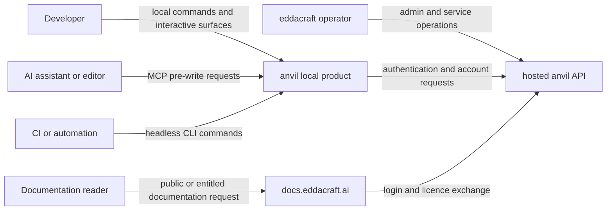
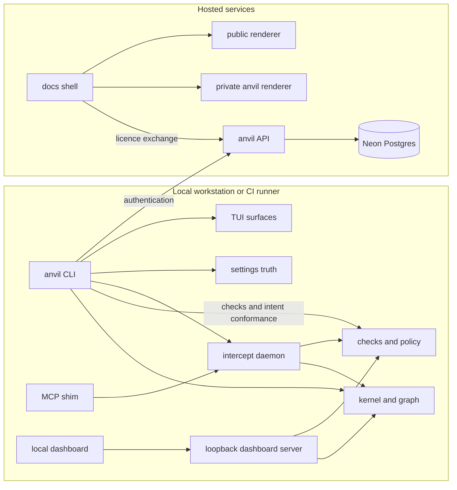

# anvil architecture overview

| Type  | Authority     | Owner | Status | Freshness                                                                                                                                                                                                                                                                                                                                                                                                                                                                                                                                                                                                                                                                                                                                                                                                                                                                                                                                                                                                                                                                                                                                                                                                                                                                                                                                                                                                                                                                                                                                                                                                                                                                                                                                                                                                                                                                                                                                                                                                                                                                                                                                                                                                                                                                                                                                                                                                                                                                                                                                                                                                                                                                                                                                                                                 |
| ----- | ------------- | ----- | ------ | ----------------------------------------------------------------------------------------------------------------------------------------------------------------------------------------------------------------------------------------------------------------------------------------------------------------------------------------------------------------------------------------------------------------------------------------------------------------------------------------------------------------------------------------------------------------------------------------------------------------------------------------------------------------------------------------------------------------------------------------------------------------------------------------------------------------------------------------------------------------------------------------------------------------------------------------------------------------------------------------------------------------------------------------------------------------------------------------------------------------------------------------------------------------------------------------------------------------------------------------------------------------------------------------------------------------------------------------------------------------------------------------------------------------------------------------------------------------------------------------------------------------------------------------------------------------------------------------------------------------------------------------------------------------------------------------------------------------------------------------------------------------------------------------------------------------------------------------------------------------------------------------------------------------------------------------------------------------------------------------------------------------------------------------------------------------------------------------------------------------------------------------------------------------------------------------------------------------------------------------------------------------------------------------------------------------------------------------------------------------------------------------------------------------------------------------------------------------------------------------------------------------------------------------------------------------------------------------------------------------------------------------------------------------------------------------------------------------------------------------------------------------------------------------- |
| Guide | Authoritative | DOCRB | Live   | Last reviewed 2026-09-03 for the tree-sitter 0.27 dependency and query-accessor update; parser integration changes but no container, component, edge, or boundary changes. Prior review 2026-09-03 for the CIB-399 ingest active-status gate; auth, overview, and trust diagrams are unaffected (no new node or edge). Prior review 2026-09-03 for the brand-accent contrast retune; only colour token values changed, so component topology and boundaries are unaffected. Prior review 2026-09-03 against #4355: the save-time client, GCTX RPC transport, and anvil_symbol_context now send on the connection that proved the listener live (ipc::connect_live_socket); the graph-base trigger pins its base store in tests instead of process-global ANVIL_HOME. Produce-lock and dual-path prose unchanged. Prior review 2026-09-03 CIB-390..392: crate README records added-line secret interrupt scope; package.json adds lint:md wrapper and test scripts. No component or diagram topology change. Prior review 2026-09-01 for the documentation-governance addition recording that review cascades and naming `pnpm docs:redate`; no authority, trigger, exemption, or metadata rule changed. Prior review 2026-08-31 against CIB-385 no-parser graph honesty (stale reason, skip scan enqueue, GCTX recovery hints) on intercept; these stay inside the existing daemon container and add no component, edge, or boundary, so the context and container diagrams are unchanged. Also reviewed 2026-08-31 against CIB-382's descriptor-level PID metadata trust, physical-identity repair coordinator, and canonical-refusal recycle fence. Those are internal lifecycle protections that add no container, component, edge, or boundary. Also reviewed 2026-08-31 against APGOV-008 bounded Neon HTTP connect retry — internal anvil-api client behaviour adding no container, component, or boundary. Also reviewed 2026-08-31 against intercept MF-1 sibling PID-file record errors that must not abort stop or recycle, and against live-probed intercept rendezvous, watch reconnect, and locked lifecycle repair. Also reviewed 2026-08-31 against the docs-shell ARCHITECTURE re-date for the archived-module link repoint and the `classify-changes.sh` project-config path class (container diagram unchanged), and against CONF-011's final Council repairs for one-way Git admission and preserved timeout provenance; the container diagram names intent conformance on the existing CLI-to-checks boundary. Prior reviews cover SDT-004, the graph-cache pointer, CLAWOPEN-002, CLAWOPEN-010, anvil-api account-activity ingest, and docs-shell claim-issue freshness. No container, component, trust boundary, deployment boundary, or separate system was added. |

| Upstream                                                                                                                                                                                                                         | Downstream                                                                            |
| -------------------------------------------------------------------------------------------------------------------------------------------------------------------------------------------------------------------------------- | ------------------------------------------------------------------------------------- |
| ADR-123, `Cargo.toml`, `crates/anvil-cli/README.md`, `crates/anvil-settings/README.md`, `crates/anvil-intercept/ARCHITECTURE.md`, `apps/anvil-api/ARCHITECTURE.md`, `apps/docs-shell/ARCHITECTURE.md`, and `infra/src/vercel.ts` | `CONTEXT.md`, `docs/architecture/README.md`, and cross-system architecture navigation |

This document owns two cross-system concerns: who interacts with anvil, and how
the live containers and major components relate. Component internals belong in
component-root `ARCHITECTURE.md` files. Detailed quality, authentication,
memory, Rust-crate, adapter, trust, save-time, and documentation-delivery
concerns remain in the linked authorities below.

## System context

### Audience and concern

This view is for contributors and operators who need to locate a user journey
before following it into a component authority. It owns the system-context
concern only; it does not define authentication, deployment, or internal runtime
steps.

### Context view

```mermaid
flowchart LR
    Developer[Developer] -->|local commands and interactive surfaces| Local[anvil local product]
    Assistant[AI assistant or editor] -->|MCP pre-write requests| Local
    CI[CI or automation] -->|headless CLI commands| Local
    Operator[eddacraft operator] -->|admin and service operations| Hosted[hosted anvil API]
    Local -->|authentication and account requests| Hosted
    Reader[Documentation reader] -->|public or entitled documentation request| Docs[docs.eddacraft.ai]
    Docs -->|login and licence exchange| Hosted
```

In prose: developers, assistants, editors, and CI use the local Rust product.
Local authentication reaches the hosted API, while operators use that hosted
service for administration. Documentation readers enter through
`docs.eddacraft.ai`; the documentation shell uses the hosted auth service for
the entitled anvil path.

The local product boundary traces to `crates/anvil-cli/README.md` and
`crates/anvil-intercept/ARCHITECTURE.md`. The hosted service boundary traces to
`apps/anvil-api/ARCHITECTURE.md`. The documentation entrypoint and its auth edge
trace to `apps/docs-shell/ARCHITECTURE.md` and `infra/src/vercel.ts`.

## Container and component relationships

### Audience and concern

This view is for maintainers locating a cross-container dependency before
opening the owning component documentation. It owns live container and
major-component relationships, not internal request, validation, auth, or
rendering steps.

### Container view

```mermaid
flowchart LR
    subgraph Local["Local workstation or CI runner"]
        CLI[anvil CLI]
        MCP[MCP shim]
        Daemon[intercept daemon]
        Kernel[kernel and graph]
        Checks[checks and policy]
        Settings[settings truth]
        TUI[TUI surfaces]
        Dashboard[local dashboard]
        DashboardServer[loopback dashboard server]

        CLI --> Kernel
        CLI -->|checks and intent conformance| Checks
        CLI --> Daemon
        CLI --> Settings
        CLI --> TUI
        MCP --> Daemon
        Daemon --> Kernel
        Daemon --> Checks
        Dashboard --> DashboardServer
        DashboardServer --> Kernel
        DashboardServer --> Checks
    end

    subgraph Hosted["Hosted services"]
        API[anvil API]
        Database[(Neon Postgres)]
        DocsShell[docs shell]
        Private[private anvil renderer]
        Public[public renderer]

        API --> Database
        DocsShell -->|licence exchange| API
        DocsShell --> Private
        DocsShell --> Public
    end

    CLI -->|authentication| API
```

In prose: the CLI composes local kernel, checks, daemon, settings, and TUI
capabilities. Its checks boundary includes on-demand intent conformance over a
caller-supplied PR declaration and exact Git range; it requires no planning
system or resident graph. The MCP shim uses the daemon when available. The local
dashboard talks to its loopback server, which reads bounded kernel and check
state. The hosted API is a separate service with Neon persistence. The
documentation shell is a hosted entrypoint that consults the API for
login/licence exchange and proxies to private and public renderers.

Local CLI, daemon, kernel, checks, and settings relationships trace to
`crates/anvil-cli/README.md`, `crates/anvil-kernel/ARCHITECTURE.md`,
`crates/anvil-intercept/ARCHITECTURE.md`, and `crates/anvil-settings/README.md`.
The dashboard boundary traces to `apps/dashboard/ARCHITECTURE.md` and
`crates/anvil-dashboard-server/ARCHITECTURE.md`. Hosted API and persistence
trace to `apps/anvil-api/ARCHITECTURE.md`. Documentation containers trace to
`apps/docs-shell/ARCHITECTURE.md` and `infra/src/vercel.ts`.

## Detailed authorities

### Check pipeline

The [quality model](quality-model.md) owns checks, findings, gates, and
surfaces; this compatibility heading carries no pipeline detail.

### Gate layer

The [quality model](quality-model.md) also owns gate concepts and the current
runtime-shape layers; this compatibility heading carries no gate detail.

- [Authentication as-built](auth-as-built.md) owns BAUTH flows and token
  semantics.
- [Edda stack](edda-stack.md) owns the Kindling-to-Ember-to-Edda promotion
  contract.
- [Rust architecture overview](rust-architecture-overview.md) owns the Rust
  crate layout.
- [Adapter workflow](../guides/adapters/workflow-guide.md) owns adapter-local
  conversion flow.
- Component-root `ARCHITECTURE.md` files own component internals under
  [ADR-123](../../plans/decisions/123-documentation-authority-and-diagram-model.md).
