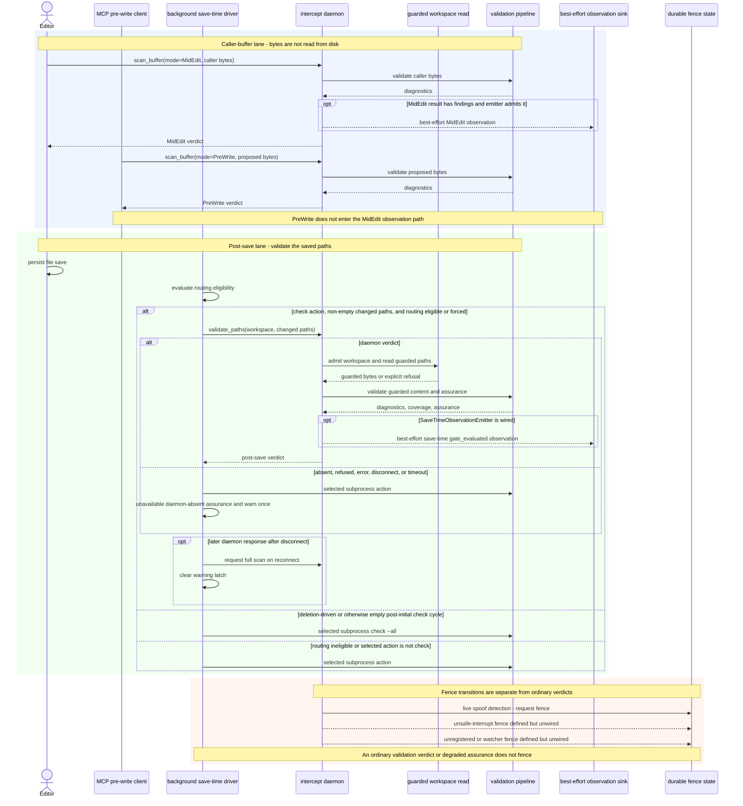

# Save to validation

| Type  | Authority     | Owner | Status | Freshness                                                                                                     |
| ----- | ------------- | ----- | ------ | ------------------------------------------------------------------------------------------------------------- |
| Guide | Authoritative | DOCRB | Live   | Last reviewed 2026-08-25 against FLAGCAT-012 daemon catalogue registry; save-time dispatch topology unchanged |

| Upstream                                                                                                                                                                                         | Downstream                                                                                     |
| ------------------------------------------------------------------------------------------------------------------------------------------------------------------------------------------------ | ---------------------------------------------------------------------------------------------- |
| ADR-123, `crates/anvil-intercept/ARCHITECTURE.md`, MCP caller-buffer validation, `watch.rs`, `watch_save_time.rs`, `save_time_driver.rs`, intercept MidEdit/save-time dispatch, and fence source | `docs/runbooks/save-time-background-driver.md` and cross-owner save-time validation navigation |

## Audience, concern, and local authority

This sequence is for contributors and operators who need to distinguish
caller-buffer validation from validation after a file save. It owns the
cross-owner hand-off among editor/MCP clients, the background driver, and the
daemon. INTD's local
[intercept architecture](../../crates/anvil-intercept/ARCHITECTURE.md) owns IPC,
admission, guarded-read, scan, observation, and fence internals.

## Cross-owner sequence

In prose: `scan_buffer` consumes bytes supplied by its caller. MidEdit and
PreWrite are distinct modes on that method; MCP `anvil_validate_write` uses
PreWrite because proposed content may not exist on disk. The post-save driver
instead sends changed path descriptors through `validate_paths`; the daemon
admits the workspace, reads the paths through its guarded boundary, and returns
diagnostics plus coverage and assurance.

Only MidEdit enters the MidEdit observation path shown here. Missing emitters,
throttling, sink errors, and later queue loss do not change the MidEdit verdict.
PreWrite does not enter that path. Independently, `validate_paths` emits a
best-effort save-time `gate_evaluated` observation after validation and before
the verdict response when `SaveTimeObservationEmitter` is wired. Emission
failure is swallowed and cannot change the verdict. This independent post-save
observation does not collapse the post-save lane into the caller-buffer lane.

The first snapshot establishes the baseline and is skipped by action dispatch.
On later snapshots, the daemon branch requires a `check` action, non-empty
changed paths, and eligible or forced routing. Routing is eligible when it is
not disabled, `--no-daemon` is absent, the platform has a transport, and a live
daemon answers the default-on probe; forced routing bypasses that live-probe
requirement. A deletion-driven or otherwise empty post-initial `check` cycle
goes directly to the selected subprocess `check --all` action and never calls
`validate_paths`. Disabled, not-live, unsupported, and non-check cases also
bypass the client and run the selected subprocess action. A scoped `check` uses
its non-empty changed paths, while `gate` self-scopes through Git status and
receives no changed-path arguments.

Once routed, daemon absence, refusal, JSON-RPC error, disconnect, or timeout
produces no verdict. The watch client reports `unavailable{daemon-absent}`,
warns once for the disconnect, and runs the selected subprocess action. Because
only `check` is daemon-eligible, that fallback is the `check` action scoped to
the changed paths; a `gate` action never enters the daemon route. A later
successful response requests a full scan on reconnect and clears the warning
latch.

Fence persistence is a separate safety transition. The Linux spoof cross-check's
production path reaches `fence_worktree_for_spoof` and is live. The
unsafe-interrupt and unregistered/watcher fence implementations are defined and
tested but have no production call sites at this revision, so the diagram labels
them **defined but unwired**. An ordinary validation finding or degraded graph
assurance does not fence a worktree.

## Source trace

- The MCP-to-PreWrite edge traces to `crates/anvil-cli/src/mcp/validation.rs`
  and `crates/anvil-cli/src/daemon_validation.rs`.
- MidEdit/PreWrite mode parsing, caller-buffer evaluation, and the MidEdit-only
  latency/observation conditions trace to
  `crates/anvil-intercept/src/midedit.rs` and the `scan_buffer` dispatch in
  `crates/anvil-intercept/src/ipc.rs`.
- The independent post-save observation traces from the `validate_paths`
  dispatch and best-effort emit in `crates/anvil-intercept/src/ipc.rs`, through
  the optional `SaveTimeObservationEmitter` state in
  `crates/anvil-intercept/src/save_time.rs` and
  `crates/anvil-intercept/src/lib.rs`, to the producer injection in
  `crates/anvil-cli/src/commands/intercept.rs`.
- The first-snapshot skip, non-empty-path daemon condition, routing eligibility,
  direct empty post-initial `check --all` path, scoped daemon fallback,
  `unavailable{daemon-absent}`, warn-once, and reconnect/full-scan behaviour
  trace to `crates/anvil-cli/src/commands/watch.rs` and
  `crates/anvil-cli/src/commands/watch_save_time.rs`; supervision opt-out and
  live/not-live state trace to `save_time_driver.rs`.
- Workspace admission, guarded reads, path validation, diagnostics, coverage,
  and assurance trace to `crates/anvil-intercept/src/ipc.rs`,
  `crates/anvil-intercept/src/save_time.rs`, and
  `crates/anvil-intercept/src/validate_paths.rs`.
- Live spoof fencing traces from `run_spoof_cross_check` and
  `spoof_block_response` in `crates/anvil-intercept/src/ipc.rs` to
  `FenceStore::fence_worktree_for_spoof`. Repository-wide caller searches leave
  the unsafe interrupt ladder and `UnregisteredChangePolicy` reachable only from
  definitions/tests, not production wiring, in
  `crates/anvil-intercept/src/interrupt.rs`,
  `crates/anvil-intercept/src/unregistered.rs`, and
  `crates/anvil-intercept/src/fence.rs`.

Operational start, status, log, restart, and opt-out procedures remain in the
[background-driver runbook](../runbooks/save-time-background-driver.md).
