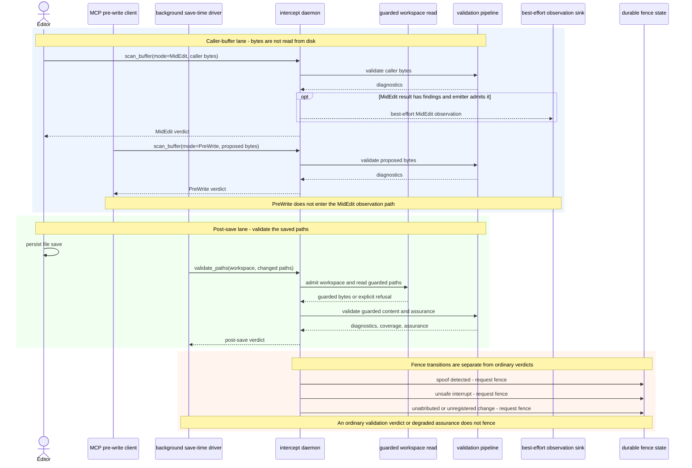

# Save to validation

| Type  | Authority     | Owner | Status | Freshness                                                                                                                                                                                                                                                                      |
| ----- | ------------- | ----- | ------ | ------------------------------------------------------------------------------------------------------------------------------------------------------------------------------------------------------------------------------------------------------------------------------ |
| Guide | Authoritative | DOCRB | Live   | Last reviewed 2026-08-20 at `d9b30b23d` against `crates/anvil-cli/src/mcp/validation.rs`, `crates/anvil-cli/src/commands/watch_save_time.rs`, `crates/anvil-intercept/src/midedit.rs`, `crates/anvil-intercept/src/ipc.rs`, and `crates/anvil-intercept/src/validate_paths.rs` |

| Upstream                                                                                                                                                                                                                                                                          | Downstream                                                                                     |
| --------------------------------------------------------------------------------------------------------------------------------------------------------------------------------------------------------------------------------------------------------------------------------- | ---------------------------------------------------------------------------------------------- |
| ADR-123, `crates/anvil-intercept/ARCHITECTURE.md`, `crates/anvil-cli/src/mcp/validation.rs`, `crates/anvil-cli/src/commands/watch_save_time.rs`, `crates/anvil-intercept/src/midedit.rs`, `crates/anvil-intercept/src/ipc.rs`, and `crates/anvil-intercept/src/validate_paths.rs` | `docs/runbooks/save-time-background-driver.md` and cross-owner save-time validation navigation |

## Audience, concern, and local authority

This sequence is for contributors and operators who need to distinguish
caller-buffer validation from validation after a file save. It owns the
cross-owner hand-off among editor/MCP clients, the background driver, and the
daemon. INTD's local
[intercept architecture](../../crates/anvil-intercept/ARCHITECTURE.md) owns IPC,
admission, guarded-read, scan, observation, and fence internals.

## Cross-owner sequence

In prose: `scan_buffer` consumes bytes supplied by its caller. MidEdit and
PreWrite are distinct modes on that method; MCP `anvil_validate_write` uses
PreWrite because proposed content may not exist on disk. The post-save driver
instead sends changed path descriptors through `validate_paths`; the daemon
admits the workspace, reads the paths through its guarded boundary, and returns
diagnostics plus coverage and assurance.

Only MidEdit enters the best-effort observation path shown here. Missing
emitters, throttling, sink errors, and later queue loss do not change the
MidEdit verdict. PreWrite does not enter that path, and the post-save lane must
not be collapsed into the caller-buffer lane.

Fence persistence is a separate safety transition. Spoof detection, an interrupt
that cannot complete safely, and unattributed or unregistered changes can
request a fence. An ordinary validation finding or degraded graph assurance does
not fence a worktree.

## Source trace

- The MCP-to-PreWrite edge traces to `crates/anvil-cli/src/mcp/validation.rs`
  and `crates/anvil-cli/src/daemon_validation.rs`.
- MidEdit/PreWrite mode parsing, caller-buffer evaluation, and the MidEdit-only
  latency/observation conditions trace to
  `crates/anvil-intercept/src/midedit.rs` and the `scan_buffer` dispatch in
  `crates/anvil-intercept/src/ipc.rs`.
- The driver-to-`validate_paths` edge and daemon fallback boundary trace to
  `crates/anvil-cli/src/commands/watch_save_time.rs`.
- Workspace admission, guarded reads, path validation, diagnostics, coverage,
  and assurance trace to `crates/anvil-intercept/src/ipc.rs`,
  `crates/anvil-intercept/src/save_time.rs`, and
  `crates/anvil-intercept/src/validate_paths.rs`.
- Fence triggers and persistence trace to `crates/anvil-intercept/src/ipc.rs`,
  `crates/anvil-intercept/src/interrupt.rs`,
  `crates/anvil-intercept/src/unregistered.rs`, and
  `crates/anvil-intercept/src/fence.rs`.

Operational start, status, log, restart, and opt-out procedures remain in the
[background-driver runbook](../runbooks/save-time-background-driver.md).
