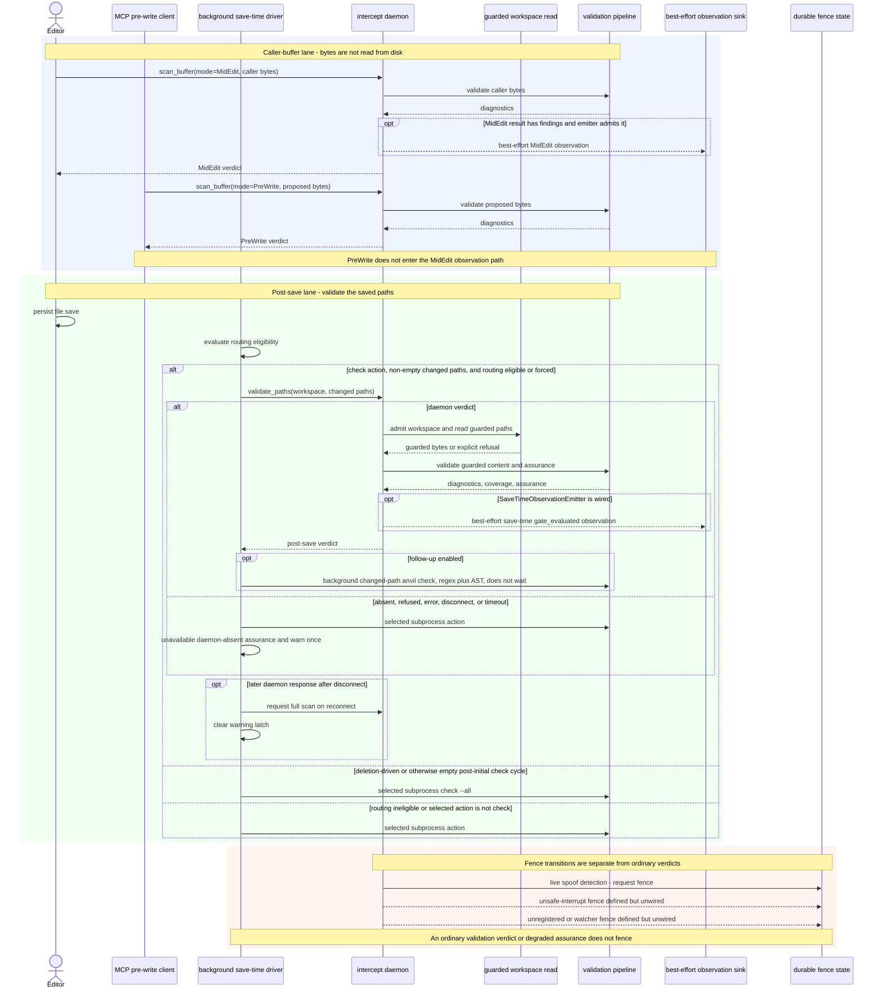

# Save to validation

| Type  | Authority     | Owner | Status | Freshness                                                                                                                                                                                                                                                                                                                                                                                                                                                                                                                                                                                                                                                                                                                                                                                                                                                                                                                                                                                                                                                                                                                                                                                                                                                                                                                                                                                                                                                                                                                                                                                                                                                                                                                                                                                                                                                                                                                                                                                                                                                                                                                                                                                                                                                                                                                                                                                                                                                                                                                                                                                                                                                                                                                                                                                                                                                                                                                                                                                                                                                                                                                                                                                                                                                                                                                                                                                                                                                                                                                                                                                                                                                                                                                                                                                                                                                                                                                                                                                                                                                                                                                                                                                                                                                                                                                                                                                                                                                                                                                                                                                                                                                                                                                                                                                                                                                                                                                                                                                                                                                                                                                                                                                                                                                                                                                                                                                                                                                                                                                                                                                                                                                                                                                                                                |
| ----- | ------------- | ----- | ------ | ------------------------------------------------------------------------------------------------------------------------------------------------------------------------------------------------------------------------------------------------------------------------------------------------------------------------------------------------------------------------------------------------------------------------------------------------------------------------------------------------------------------------------------------------------------------------------------------------------------------------------------------------------------------------------------------------------------------------------------------------------------------------------------------------------------------------------------------------------------------------------------------------------------------------------------------------------------------------------------------------------------------------------------------------------------------------------------------------------------------------------------------------------------------------------------------------------------------------------------------------------------------------------------------------------------------------------------------------------------------------------------------------------------------------------------------------------------------------------------------------------------------------------------------------------------------------------------------------------------------------------------------------------------------------------------------------------------------------------------------------------------------------------------------------------------------------------------------------------------------------------------------------------------------------------------------------------------------------------------------------------------------------------------------------------------------------------------------------------------------------------------------------------------------------------------------------------------------------------------------------------------------------------------------------------------------------------------------------------------------------------------------------------------------------------------------------------------------------------------------------------------------------------------------------------------------------------------------------------------------------------------------------------------------------------------------------------------------------------------------------------------------------------------------------------------------------------------------------------------------------------------------------------------------------------------------------------------------------------------------------------------------------------------------------------------------------------------------------------------------------------------------------------------------------------------------------------------------------------------------------------------------------------------------------------------------------------------------------------------------------------------------------------------------------------------------------------------------------------------------------------------------------------------------------------------------------------------------------------------------------------------------------------------------------------------------------------------------------------------------------------------------------------------------------------------------------------------------------------------------------------------------------------------------------------------------------------------------------------------------------------------------------------------------------------------------------------------------------------------------------------------------------------------------------------------------------------------------------------------------------------------------------------------------------------------------------------------------------------------------------------------------------------------------------------------------------------------------------------------------------------------------------------------------------------------------------------------------------------------------------------------------------------------------------------------------------------------------------------------------------------------------------------------------------------------------------------------------------------------------------------------------------------------------------------------------------------------------------------------------------------------------------------------------------------------------------------------------------------------------------------------------------------------------------------------------------------------------------------------------------------------------------------------------------------------------------------------------------------------------------------------------------------------------------------------------------------------------------------------------------------------------------------------------------------------------------------------------------------------------------------------------------------------------------------------------------------------------------------------------------------------------------ |
| Guide | Authoritative | DOCRB | Live   | Last reviewed 2026-09-14 for POSBRD-003/004/005 last-action query_status fields and the public status page; IPC/save/validation/fencing topology and docs delivery diagrams are unchanged. Prior review 2026-09-13 for intercept resource-budget bench isolation and ANVIL_HOME fence/registration state-root (intercept ARCHITECTURE freshness); diagrams unchanged — bench/state-root isolation, not IPC/save/validation/fencing topology. Prior review 2026-09-13 for save_time_driver crash-loop hold CI flake (intercept ARCHITECTURE freshness after test-only backoff hold harden); diagrams unchanged — test timing, not IPC/save/validation/fencing topology. Prior review 2026-09-12 for CIB-211 Windows config write-path owner-only DACL (intercept ARCHITECTURE freshness); diagrams and as-built topology unchanged. Prior review 2026-09-11 for CIB-211 intercept ARCHITECTURE freshness (Windows trusted-config DACL / ForeignWritable mapping); diagrams unchanged — config ACL admission, not IPC/save/validation/fencing topology. Prior review 2026-09-11 for ensure lock-wait re-probe (intercept ARCHITECTURE freshness after concurrent version-skew Journey flake); diagrams unchanged — control-flow lock retry, not IPC/save/validation/fencing topology. Prior review 2026-09-10 for JREL-013 scoped query_status: optional `worktree` params narrow the daemon snapshot for single-worktree attestation; diagrams unchanged — query_status request shaping and session filter, not save/validation, transport, or fencing topology. Prior review 2026-09-10 for JREL-011 ensure spend-gate follow-up; diagrams unaffected. Prior review 2026-09-10 for JREL-011 intercept ARCHITECTURE freshness (ensure lifecycle budget); depicted topology, trust boundaries, and save-to-validation flow are unchanged, so the diagrams stand. Prior review 2026-09-09 JREL-005 typed status readiness changes no depicted topology, trust boundary, or save-to-validation flow; diagrams stand. Prior review 2026-09-09 for the CIB-160 residual daemon `current_exe` OnceLock cache; depicted transport topology, trust boundaries, and save/validation transitions are unchanged, so the diagrams stand. Prior review 2026-09-08 for CIB-160 peer-exe faithfulness probe wait: canary exe is polled until exec before the durable wire gate fail-closes; depicted transport topology, trust boundaries, and save/validation transitions are unchanged, so the diagrams stand. Prior review 2026-09-07 for JREL-004 #4432 option B (state-home rendezvous coordinator, HOME-preferred lock selection); save/validation/fence diagrams unchanged — lifecycle lock/discovery, not transport topology. Prior review 2026-09-07 for JREL-003/004 residuals: heartbeat is not a spawn trigger and the bounded stop releases the driver map lock; depicted transport topology, trust boundaries, and save/validation transitions are unchanged, so the diagrams stand. Prior review 2026-09-07 against JREL-004 one daemon identity through start and recycle: the background ensure launcher now verifies every same-scope endpoint candidate under the rendezvous coordinator before spawning, version recycle signals only the daemon instances it observed and requires the replacement to answer with the CLI version, and intercept status names the verified PID beside the answering endpoint. Lifecycle coordination and stop targeting change; the depicted transport topology, trust boundaries, and save/validation transitions are unchanged, so the diagrams stand. Also reviewed 2026-09-07 against JREL-003 (`save_time_driver.rs`, `watch.rs`): a durable membership refresh now restores a dead save-time driver child, respawns are bounded, a dead child is reaped rather than reported attached, and the child writes a readiness marker the daemon reports as `save_time_driver_evidence`. None of this adds or changes a caller-buffer or post-save transition — the driver still sends `validate_paths` and the daemon still answers through the guarded read — so the sequence and its diagram are unchanged; only the driver-lifecycle trace line above was extended. Prior review 2026-09-07 for DPO-007 intercept architecture freshness; scan_buffer, save-to-validation and trust diagrams are unchanged. Prior review 2026-09-07 for JREL-002: the intercept architecture note was refreshed for a surface-identifier extraction in `status.rs`, which is claim-construction plumbing — no authority, boundary, transition or diagram contract moved. Prior review 2026-09-03 against #4355: the save-time client, GCTX RPC transport, and anvil_symbol_context now send on the connection that proved the listener live (ipc::connect_live_socket); the graph-base trigger pins its base store in tests instead of process-global ANVIL_HOME. Produce-lock and dual-path prose unchanged. Prior review 2026-08-31 against CIB-385 no-parser graph honesty. GCTX recovery hints and the no-parser scan-enqueue skip do not add or change a caller-buffer or post-save transition, so this sequence and its diagrams are unchanged. Also reviewed 2026-08-31 against CIB-382's descriptor-level PID metadata trust, physical-identity repair coordinator, and canonical-refusal recycle fence. They affect intercept lifecycle coordination, stop reporting, and recycle admission without changing those transitions. Also reviewed 2026-08-31 for intercept MF-1 sibling PID-file record errors that must not abort stop or recycle, plus live-probed intercept rendezvous and watch re-resolution; all stay within the existing caller-buffer and post-save paths. Prior reviews cover SDT-004 and the graph-cache pointer. |

| Upstream                                                                                                                                                                                         | Downstream                                                                                     |
| ------------------------------------------------------------------------------------------------------------------------------------------------------------------------------------------------ | ---------------------------------------------------------------------------------------------- |
| ADR-123, `crates/anvil-intercept/ARCHITECTURE.md`, MCP caller-buffer validation, `watch.rs`, `watch_save_time.rs`, `save_time_driver.rs`, intercept MidEdit/save-time dispatch, and fence source | `docs/runbooks/save-time-background-driver.md` and cross-owner save-time validation navigation |

## Audience, concern, and local authority

This sequence is for contributors and operators who need to distinguish
caller-buffer validation from validation after a file save. It owns the
cross-owner hand-off among editor/MCP clients, the background driver, and the
daemon. INTD's local
[intercept architecture](../../crates/anvil-intercept/ARCHITECTURE.md) owns IPC,
admission, guarded-read, scan, observation, and fence internals.

## Cross-owner sequence

```mermaid
sequenceDiagram
    actor Editor
    participant MCP as MCP pre-write client
    participant Driver as background save-time driver
    participant Daemon as intercept daemon
    participant Guard as guarded workspace read
    participant Checks as validation pipeline
    participant Observe as best-effort observation sink
    participant Fence as durable fence state

    rect rgb(238, 245, 255)
        Note over Editor,Checks: Caller-buffer lane - bytes are not read from disk
        Editor->>Daemon: scan_buffer(mode=MidEdit, caller bytes)
        Daemon->>Checks: validate caller bytes
        Checks-->>Daemon: diagnostics
        opt MidEdit result has findings and emitter admits it
            Daemon-->>Observe: best-effort MidEdit observation
        end
        Daemon-->>Editor: MidEdit verdict
        MCP->>Daemon: scan_buffer(mode=PreWrite, proposed bytes)
        Daemon->>Checks: validate proposed bytes
        Checks-->>Daemon: diagnostics
        Daemon-->>MCP: PreWrite verdict
        Note over MCP,Observe: PreWrite does not enter the MidEdit observation path
    end

    rect rgb(240, 255, 240)
        Note over Editor,Checks: Post-save lane - validate the saved paths
        Editor->>Editor: persist file save
        Driver->>Driver: evaluate routing eligibility
        alt check action, non-empty changed paths, and routing eligible or forced
            Driver->>Daemon: validate_paths(workspace, changed paths)
            alt daemon verdict
                Daemon->>Guard: admit workspace and read guarded paths
                Guard-->>Daemon: guarded bytes or explicit refusal
                Daemon->>Checks: validate guarded content and assurance
                Checks-->>Daemon: diagnostics, coverage, assurance
                opt SaveTimeObservationEmitter is wired
                    Daemon-->>Observe: best-effort save-time gate_evaluated observation
                end
                Daemon-->>Driver: post-save verdict
                opt follow-up enabled
                    Driver->>Checks: background changed-path anvil check, regex plus AST, does not wait
                end
            else absent, refused, error, disconnect, or timeout
                Driver->>Checks: selected subprocess action
                Driver->>Driver: unavailable daemon-absent assurance and warn once
            end
            opt later daemon response after disconnect
                Driver->>Daemon: request full scan on reconnect
                Driver->>Driver: clear warning latch
            end
        else deletion-driven or otherwise empty post-initial check cycle
            Driver->>Checks: selected subprocess check --all
        else routing ineligible or selected action is not check
            Driver->>Checks: selected subprocess action
        end
    end

    rect rgb(255, 245, 238)
        Note over Daemon,Fence: Fence transitions are separate from ordinary verdicts
        Daemon->>Fence: live spoof detection - request fence
        Daemon-->>Fence: unsafe-interrupt fence defined but unwired
        Daemon-->>Fence: unregistered or watcher fence defined but unwired
        Note over Driver,Fence: An ordinary validation verdict or degraded assurance does not fence
    end
```

In prose: `scan_buffer` consumes bytes supplied by its caller. MidEdit and
PreWrite are distinct modes on that method; MCP `anvil_validate_write` uses
PreWrite because proposed content may not exist on disk. The post-save driver
instead sends changed path descriptors through `validate_paths`; the daemon
admits the workspace, reads the paths through its guarded boundary, and returns
diagnostics plus coverage and assurance. After that on-disk verdict the CLI may
schedule a coalesced changed-path `anvil check` (regex + AST) without waiting;
PreWrite does not schedule, because the proposed bytes are not on disk yet
(GTAO-003 / ADR-127).

Only MidEdit enters the MidEdit observation path shown here. Missing emitters,
throttling, sink errors, and later queue loss do not change the MidEdit verdict.
PreWrite does not enter that path. Independently, `validate_paths` emits a
best-effort save-time `gate_evaluated` observation after validation and before
the verdict response when `SaveTimeObservationEmitter` is wired. Emission
failure is swallowed and cannot change the verdict. This independent post-save
observation does not collapse the post-save lane into the caller-buffer lane.

The first snapshot establishes the baseline and is skipped by action dispatch.
On later snapshots, the daemon branch requires a `check` action, non-empty
changed paths, and eligible or forced routing. Routing is eligible when it is
not disabled, `--no-daemon` is absent, the platform has a transport, and a live
daemon answers the default-on probe; forced routing bypasses that live-probe
requirement. A deletion-driven or otherwise empty post-initial `check` cycle
goes directly to the selected subprocess `check --all` action and never calls
`validate_paths`. Disabled, not-live, unsupported, and non-check cases also
bypass the client and run the selected subprocess action. A scoped `check` uses
its non-empty changed paths, while `gate` self-scopes through Git status and
receives no changed-path arguments.

Once routed, daemon absence, refusal, JSON-RPC error, disconnect, or timeout
produces no verdict. The watch client reports `unavailable{daemon-absent}`,
warns once for the disconnect, and runs the selected subprocess action. Because
only `check` is daemon-eligible, that fallback is the `check` action scoped to
the changed paths; a `gate` action never enters the daemon route. A later
successful response requests a full scan on reconnect and clears the warning
latch.

Fence persistence is a separate safety transition. The Linux spoof cross-check's
production path reaches `fence_worktree_for_spoof` and is live. The
unsafe-interrupt and unregistered/watcher fence implementations are defined and
tested but have no production call sites at this revision, so the diagram labels
them **defined but unwired**. An ordinary validation finding or degraded graph
assurance does not fence a worktree.

## Source trace

- The MCP-to-PreWrite edge traces to `crates/anvil-cli/src/mcp/validation.rs`
  and `crates/anvil-cli/src/daemon_validation.rs`.
- MidEdit/PreWrite mode parsing, caller-buffer evaluation, and the MidEdit-only
  latency/observation conditions trace to
  `crates/anvil-intercept/src/midedit.rs` and the `scan_buffer` dispatch in
  `crates/anvil-intercept/src/ipc.rs`.
- The independent post-save observation traces from the `validate_paths`
  dispatch and best-effort emit in `crates/anvil-intercept/src/ipc.rs`, through
  the optional `SaveTimeObservationEmitter` state in
  `crates/anvil-intercept/src/save_time.rs` and
  `crates/anvil-intercept/src/lib.rs`, to the producer injection in
  `crates/anvil-cli/src/commands/intercept.rs`.
- The first-snapshot skip, non-empty-path daemon condition, routing eligibility,
  direct empty post-initial `check --all` path, scoped daemon fallback,
  `unavailable{daemon-absent}`, warn-once, and reconnect/full-scan behaviour
  trace to `crates/anvil-cli/src/commands/watch.rs` and
  `crates/anvil-cli/src/commands/watch_save_time.rs`; supervision opt-out,
  live/not-live state, refresh-driven restore of a dead child, the bounded
  respawn policy, and the readiness evidence read from the child's
  `<stem>.ready` marker trace to `save_time_driver.rs` (JREL-003).
- Workspace admission, guarded reads, path validation, diagnostics, coverage,
  and assurance trace to `crates/anvil-intercept/src/ipc.rs`,
  `crates/anvil-intercept/src/save_time.rs`, and
  `crates/anvil-intercept/src/validate_paths.rs`.
- Live spoof fencing traces from `run_spoof_cross_check` and
  `spoof_block_response` in `crates/anvil-intercept/src/ipc.rs` to
  `FenceStore::fence_worktree_for_spoof`. Repository-wide caller searches leave
  the unsafe interrupt ladder and `UnregisteredChangePolicy` reachable only from
  definitions/tests, not production wiring, in
  `crates/anvil-intercept/src/interrupt.rs`,
  `crates/anvil-intercept/src/unregistered.rs`, and
  `crates/anvil-intercept/src/fence.rs`.

Operational start, status, log, restart, and opt-out procedures remain in the
[background-driver runbook](../runbooks/save-time-background-driver.md).
