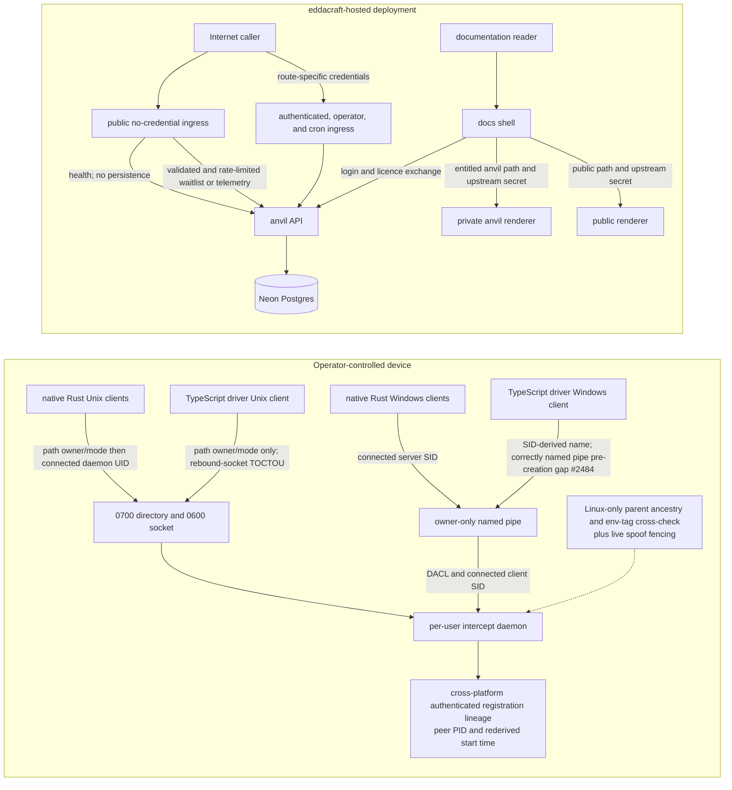

# Trust and deployment boundaries

| Type  | Authority     | Owner | Status | Freshness                                                                                                                                                                                       |
| ----- | ------------- | ----- | ------ | ----------------------------------------------------------------------------------------------------------------------------------------------------------------------------------------------- |
| Guide | Authoritative | DOCRB | Live   | Last reviewed 2026-08-20 at `97899b00a` against native and TypeScript IPC clients, intercept registration/cross-check source, API route source, docs-shell/renderers, and `infra/src/vercel.ts` |

| Upstream                                                                                                                                                                                                                                                                                                           | Downstream                                                    |
| ------------------------------------------------------------------------------------------------------------------------------------------------------------------------------------------------------------------------------------------------------------------------------------------------------------------ | ------------------------------------------------------------- |
| ADR-123, `crates/anvil-intercept/ARCHITECTURE.md`, `apps/anvil-api/ARCHITECTURE.md`, `apps/docs-shell/ARCHITECTURE.md`, `docs/architecture/auth-as-built.md`, native and TypeScript IPC client source, intercept registration/cross-check source, API route source, renderer middleware, and `infra/src/vercel.ts` | Cross-system trust reviews and deployment-boundary navigation |

## Audience, concern, and local authority

This macro view is for security reviewers, operators, and contributors deciding
which detailed authority owns a trust decision. It owns the relationship between
the local per-user daemon, the hosted API/data plane, and the hosted
documentation plane. It does not replace INTD's local
[intercept architecture](../../crates/anvil-intercept/ARCHITECTURE.md), APGOV's
[API architecture](../../apps/anvil-api/ARCHITECTURE.md), BAUTH's
[authentication as-built](auth-as-built.md), or the docs-shell
[component architecture](../../apps/docs-shell/ARCHITECTURE.md).

## Macro boundary view

In prose: local IPC is intended as a same-user rendezvous, but native Rust and
TypeScript clients establish that trust differently. Registration lineage and
Linux-only attribution are also separate controls; no universal request/session
binding exists. The hosted API is a separate network trust boundary with both
public and credentialed routes. The documentation shell is the only public docs
entrypoint: it checks entitlement for anvil paths, calls BAUTH for login, and is
the only caller expected to possess the shared secret accepted by matched
renderer routes.

## Boundary facts and source trace

- **Native Unix IPC:** the daemon creates an owner-only `0700` directory and
  `0600` socket. Native Rust clients validate that path and then validate the
  connected daemon UID before sending content. The Unix accept loop captures a
  peer PID but performs **no server-side Unix caller-UID comparison**. These
  facts trace to `validate_socket_path_for_client`,
  `validate_connected_peer_for_client`, `unix_perms`, and `IpcListener::serve`
  in `crates/anvil-intercept/src/ipc.rs`, with native callers in
  `crates/anvil-cli/src/registration.rs` and
  `crates/anvil-cli/src/mcp/gctx_client.rs`.
- **TypeScript Unix IPC:** `@eddacraft/anvil-driver-client` checks the socket
  directory owner/mode and socket owner/mode before connecting, but Node exposes
  no stable connected-peer credential check here. An attacker able to replace
  the socket between `lstat` and `connect` therefore leaves a documented
  rebound-socket TOCTOU gap. This traces to
  `packages/anvil-driver-client/src/transport/unix.ts`.
- **Cross-platform registration lineage:** where the listener supplies an
  authenticated peer PID, registration binds the claimed PID to that peer and
  rederives process start time on Linux, macOS, and Windows before admitting the
  session. This trace is `verify_lineage_claim` and `RegisterSession` handling
  in `crates/anvil-intercept/src/ipc.rs`; it is distinct from the Linux-only
  control below.
- **Linux-only additional attribution:** production wires `CrossCheckContext`
  only on Linux. It checks parent ancestry and optional environment tags and the
  live spoof path calls `fence_worktree_for_spoof`. macOS and Windows do not
  wire that context. TypeScript `scan_buffer` requests omit `session_id`, so
  they follow the unbound request path rather than a universal session binding.
  These facts trace to `crates/anvil-intercept/src/lib.rs`, the `scan_buffer`
  and spoof-cross-check paths in `crates/anvil-intercept/src/ipc.rs`, and
  `packages/anvil-driver-client/src/protocol/types.ts`.
- **Native Windows IPC:** the named pipe rejects remote clients, carries an
  owner-only DACL, and the daemon compares the connected client SID with the
  pipe owner's SID. Native Rust clients validate the connected server SID. This
  traces to `crates/anvil-intercept-win32/src/lib.rs` and the Windows
  `IpcListener::serve` branch in `crates/anvil-intercept/src/ipc.rs`.
- **TypeScript Windows IPC:** the driver client derives the current SID and
  validates the SID-suffixed pipe name, but does not validate the connected
  server. A pre-created correctly named pipe remains gap #2484. This traces to
  `packages/anvil-driver-client/src/transport/windows.ts`.
- **Hosted API:** `/health`, waitlist signup, and telemetry are public
  no-credential ingress. Health does not persist. Waitlist and deliberately
  unauthenticated telemetry validate input and pass rate limits before Neon
  persistence. Authenticated/account, operator/admin, and cron branches apply
  their route-specific credentials separately; there is no blanket
  credentials-before-persistence invariant. This traces to
  `apps/anvil-api/src/index.ts` and `routes/waitlist.ts`, `routes/telemetry.ts`,
  `routes/admin.ts`, and `routes/cron.ts`. APGOV owns internal routing and BAUTH
  owns identity and licence semantics.
- **Hosted documentation:** `apps/docs-shell/proxy.ts` gates `/anvil` and
  `/anvil/*` on a valid licence, then injects `X-Docs-Upstream-Secret`. Both
  renderer middleware files reject missing or unequal secrets on matched routes;
  their matcher excludes `/favicon.ico`. `infra/src/vercel.ts` owns the deployed
  projects, domains, and secret wiring. The shell's request-level auth and proxy
  internals remain in `apps/docs-shell/ARCHITECTURE.md`.

Degraded local graph or attribution evidence must be described as degraded; it
does not become fresh assurance merely because the transport accepted a
connection. Deployment and rollback details for docs remain in
[docs delivery](docs-delivery.md).
