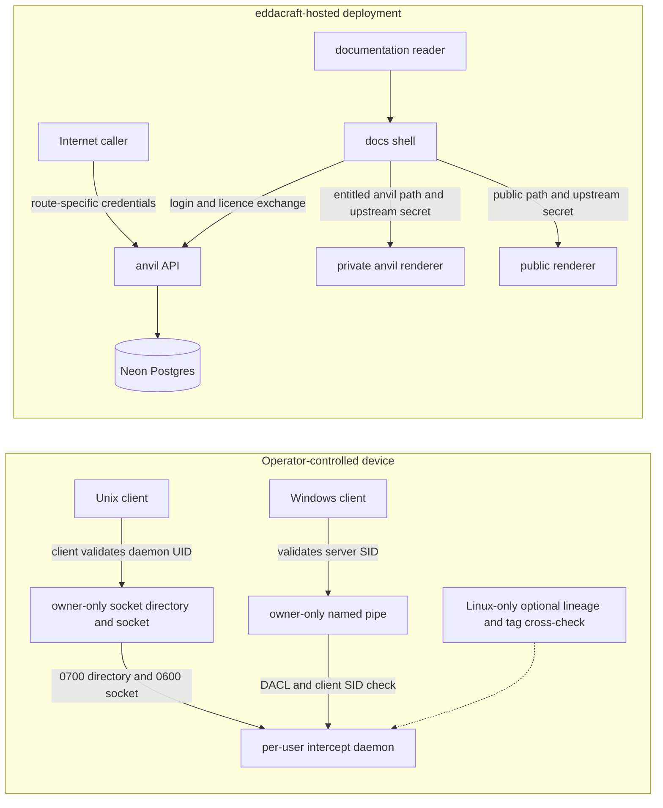

# Trust and deployment boundaries

| Type  | Authority     | Owner | Status | Freshness                                                                                                                                                                                                                                                                 |
| ----- | ------------- | ----- | ------ | ------------------------------------------------------------------------------------------------------------------------------------------------------------------------------------------------------------------------------------------------------------------------- |
| Guide | Authoritative | DOCRB | Live   | Last reviewed 2026-08-20 at `d9b30b23d` against `crates/anvil-intercept/src/ipc.rs`, `crates/anvil-intercept-win32/src/lib.rs`, `crates/anvil-cli/src/mcp/gctx_client.rs`, `apps/anvil-api/ARCHITECTURE.md`, `apps/docs-shell/ARCHITECTURE.md`, and `infra/src/vercel.ts` |

| Upstream                                                                                                                                                                                                                                                                | Downstream                                                    |
| ----------------------------------------------------------------------------------------------------------------------------------------------------------------------------------------------------------------------------------------------------------------------- | ------------------------------------------------------------- |
| ADR-123, `crates/anvil-intercept/ARCHITECTURE.md`, `apps/anvil-api/ARCHITECTURE.md`, `apps/docs-shell/ARCHITECTURE.md`, `docs/architecture/auth-as-built.md`, `crates/anvil-intercept/src/ipc.rs`, `crates/anvil-intercept-win32/src/lib.rs`, and `infra/src/vercel.ts` | Cross-system trust reviews and deployment-boundary navigation |

## Audience, concern, and local authority

This macro view is for security reviewers, operators, and contributors deciding
which detailed authority owns a trust decision. It owns the relationship between
the local per-user daemon, the hosted API/data plane, and the hosted
documentation plane. It does not replace INTD's local
[intercept architecture](../../crates/anvil-intercept/ARCHITECTURE.md), APGOV's
[API architecture](../../apps/anvil-api/ARCHITECTURE.md), BAUTH's
[authentication as-built](auth-as-built.md), or the docs-shell
[component architecture](../../apps/docs-shell/ARCHITECTURE.md).

## Macro boundary view

In prose: local IPC is a same-user rendezvous, but the mechanisms differ by
platform. The hosted API is a separate network trust boundary with
route-specific authentication before persistence. The documentation shell is the
only public docs entrypoint: it checks entitlement for anvil paths, calls BAUTH
for login, and is the only caller expected to possess the shared secret accepted
by the protected renderers.

## Boundary facts and source trace

- **Unix local IPC:** the daemon creates an owner-only `0700` directory and
  `0600` socket. Clients validate the socket path and the connected daemon UID
  before sending content. The Unix accept loop captures a peer PID but performs
  **no server-side Unix caller-UID comparison**. These facts trace to
  `crates/anvil-intercept/src/ipc.rs`, especially
  `validate_socket_path_for_client`, `validate_connected_peer_for_client`,
  `unix_perms`, and the Unix `IpcListener::serve` accept loop.
- **Linux-only additional attribution:** production may wire `CrossCheckContext`
  on Linux, where an accepted peer PID can bind a claimed session lineage and
  optional environment tag. That check is additional to the owner-only
  rendezvous; it is not present on macOS or Windows. The platform gate and
  request checks trace to `crates/anvil-intercept/src/lib.rs` and
  `crates/anvil-intercept/src/ipc.rs`.
- **Windows local IPC:** the named pipe rejects remote clients, carries an
  owner-only DACL, and the daemon explicitly compares the connected client SID
  with the pipe owner's SID. The client also validates the connected server SID
  before sending bytes. This traces to `crates/anvil-intercept-win32/src/lib.rs`
  and the Windows `IpcListener::serve` branch in
  `crates/anvil-intercept/src/ipc.rs`.
- **Hosted API:** public, authenticated, operator, and cron routes cross
  different credential checks before route logic and Neon persistence. APGOV's
  `apps/anvil-api/ARCHITECTURE.md` owns that internal routing; BAUTH's
  `docs/architecture/auth-as-built.md` owns identity and licence semantics.
- **Hosted documentation:** `apps/docs-shell/proxy.ts` gates `/anvil` and
  `/anvil/*` on a valid licence, then injects `X-Docs-Upstream-Secret`. Both
  renderer middleware files reject missing or unequal secrets.
  `infra/src/vercel.ts` owns the deployed projects, domains, and secret wiring.
  The shell's request-level auth and proxy internals remain in
  `apps/docs-shell/ARCHITECTURE.md`.

Degraded local graph or attribution evidence must be described as degraded; it
does not become fresh assurance merely because the transport accepted a
connection. Deployment and rollback details for docs remain in
[docs delivery](docs-delivery.md).
