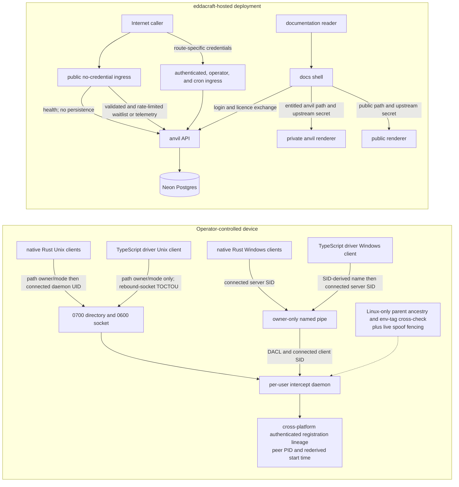

# Trust and deployment boundaries

| Type  | Authority     | Owner | Status | Freshness                                                                                                                                                                                                                                                                                                                                                                                                                                                                                                                                                                                                                                                                                                                                                                                                                                                                                                                                                                                                                                                                                                                                                                                                                                                                                                                                                                                                                                                                                                                                                                                                                                                                                                                                                                                                                                                                                                                                                                                                                                                                                                                                                                                                                                                                                                                                                                                                                                                                                                                                                                                                                                                                                                                                                                                                                                                                                                                                                                                                                                                                                                                                                                                                                                                                                                                                                                                                                                                                                                                                                                                                                                                                                                                                                                                                                                                                                                                                                                                                                                                                                                                                                                                                                                                                                                                                                                                                                                                                                                                                                                                                                                                                                                                                                                                                                                                                                                                                                                                                                                                                                                                                                                    |
| ----- | ------------- | ----- | ------ | ---------------------------------------------------------------------------------------------------------------------------------------------------------------------------------------------------------------------------------------------------------------------------------------------------------------------------------------------------------------------------------------------------------------------------------------------------------------------------------------------------------------------------------------------------------------------------------------------------------------------------------------------------------------------------------------------------------------------------------------------------------------------------------------------------------------------------------------------------------------------------------------------------------------------------------------------------------------------------------------------------------------------------------------------------------------------------------------------------------------------------------------------------------------------------------------------------------------------------------------------------------------------------------------------------------------------------------------------------------------------------------------------------------------------------------------------------------------------------------------------------------------------------------------------------------------------------------------------------------------------------------------------------------------------------------------------------------------------------------------------------------------------------------------------------------------------------------------------------------------------------------------------------------------------------------------------------------------------------------------------------------------------------------------------------------------------------------------------------------------------------------------------------------------------------------------------------------------------------------------------------------------------------------------------------------------------------------------------------------------------------------------------------------------------------------------------------------------------------------------------------------------------------------------------------------------------------------------------------------------------------------------------------------------------------------------------------------------------------------------------------------------------------------------------------------------------------------------------------------------------------------------------------------------------------------------------------------------------------------------------------------------------------------------------------------------------------------------------------------------------------------------------------------------------------------------------------------------------------------------------------------------------------------------------------------------------------------------------------------------------------------------------------------------------------------------------------------------------------------------------------------------------------------------------------------------------------------------------------------------------------------------------------------------------------------------------------------------------------------------------------------------------------------------------------------------------------------------------------------------------------------------------------------------------------------------------------------------------------------------------------------------------------------------------------------------------------------------------------------------------------------------------------------------------------------------------------------------------------------------------------------------------------------------------------------------------------------------------------------------------------------------------------------------------------------------------------------------------------------------------------------------------------------------------------------------------------------------------------------------------------------------------------------------------------------------------------------------------------------------------------------------------------------------------------------------------------------------------------------------------------------------------------------------------------------------------------------------------------------------------------------------------------------------------------------------------------------------------------------------------------------------------------------------------------- |
| Guide | Authoritative | DOCRB | Live   | Last reviewed 2026-09-13 for the licence-route-inventory test timeout fix; apps/anvil-api gained test-only changes and no production route, contract, or topology moved, so the diagrams stand. Prior review 2026-09-13 for save_time_driver crash-loop hold CI flake (intercept ARCHITECTURE freshness after test-only backoff hold harden); diagrams unchanged — test timing, not IPC/save/validation/fencing topology. Prior review 2026-09-13 for the telemetry mount test timeout fix; apps/anvil-api gained test-only changes and no production route, contract, or topology moved, so the diagrams stand. Prior review 2026-09-12 for CIB-211 Windows config write-path owner-only DACL (intercept ARCHITECTURE freshness); diagrams and as-built topology unchanged. Prior review 2026-09-11 against CIB-211 TypeScript named-pipe server SID authentication (`packages/anvil-driver-client/src/transport/windows.ts`); the TS Windows edge now matches native connected-server SID auth. Prior review 2026-09-11 for ensure lock-wait re-probe (intercept ARCHITECTURE freshness after concurrent version-skew Journey flake); diagrams unchanged — control-flow lock retry, not IPC/save/validation/fencing topology. Prior review 2026-09-10 for JREL-013 scoped query_status: optional `worktree` params narrow the daemon snapshot for single-worktree attestation; diagrams unchanged — query_status request shaping and session filter, not save/validation, transport, or fencing topology. Prior review 2026-09-10 for JREL-011 ensure spend-gate follow-up; diagrams unaffected. Prior review 2026-09-10 for JREL-011 intercept ARCHITECTURE freshness (ensure lifecycle budget); diagrams unaffected. Prior review 2026-09-10 Reviewed against JREL-012 fail-closed journey verification and testing.md command updates. Prior review 2026-09-09 JREL-005 typed status readiness changes no depicted topology, trust boundary, or save-to-validation flow; diagrams stand. Prior review 2026-09-09 for the documentation-governance cross-link and docs-workflow skill reminder that /dev-loop must settle docs-owed Freshness before CI; no authority, trigger, exemption, or diagram contract changed. Prior review 2026-09-09 for the hono 4.13.7 dependency bump; auth topology is unaffected. Prior review 2026-09-09 for the next 16.3.4 dependency bump; diagrams and topology are unaffected. Prior review 2026-09-09 for the CIB-160 residual daemon `current_exe` OnceLock cache; depicted transport topology, trust boundaries, and save/validation transitions are unchanged, so the diagrams stand. Prior review 2026-09-09 after docs-shell ARCHITECTURE freshness redate for a dependency-only `next` bump; no topology change, so diagrams stand. Prior review 2026-09-08 for CIB-160 peer-exe faithfulness probe wait: canary exe is polled until exec before the durable wire gate fail-closes; depicted transport topology, trust boundaries, and save/validation transitions are unchanged, so the diagrams stand. Prior review 2026-09-07 for JREL-004 #4432 option B (state-home rendezvous coordinator, HOME-preferred lock selection); save/validation/fence diagrams unchanged — lifecycle lock/discovery, not transport topology. Prior review 2026-09-07 for JREL-003/004 residuals: heartbeat is not a spawn trigger and the bounded stop releases the driver map lock; depicted transport topology, trust boundaries, and save/validation transitions are unchanged, so the diagrams stand. Prior review 2026-09-07 against JREL-004 one daemon identity through start and recycle: the background ensure launcher now verifies every same-scope endpoint candidate under the rendezvous coordinator before spawning, version recycle signals only the daemon instances it observed and requires the replacement to answer with the CLI version, and intercept status names the verified PID beside the answering endpoint. Lifecycle coordination and stop targeting change; the depicted transport topology, trust boundaries, and save/validation transitions are unchanged, so the diagrams stand. Prior review 2026-09-07 for DPO-007 intercept architecture freshness; scan_buffer, save-to-validation and trust diagrams are unchanged. Prior review 2026-09-07 for JREL-002: the intercept architecture note was refreshed for a surface-identifier extraction in `status.rs`, which is claim-construction plumbing — no authority, boundary, transition or diagram contract moved. Prior review 2026-09-06 for CIB-411 and CIB-412; the diagram-impact collector now retains infra/\*\* and both rename endpoints, and no authority, trigger, exemption, or diagram contract changed. Prior review 2026-09-05 for SEC-013 shared API account-status enforcement and SEC-015 same-origin docs logout; macro hosted/local trust diagram retains the same nodes and edges. Prior review 2026-09-03 for CLAWOPEN-011's Neon integration harness and CLAWOPEN-007's generator atomic-output change; `apps/anvil-api` gained test files only and no production route, contract, or topology moved, so the diagrams stand. |

| Upstream                                                                                                                                                                                                                                                                                                           | Downstream                                                    |
| ------------------------------------------------------------------------------------------------------------------------------------------------------------------------------------------------------------------------------------------------------------------------------------------------------------------ | ------------------------------------------------------------- |
| ADR-123, `crates/anvil-intercept/ARCHITECTURE.md`, `apps/anvil-api/ARCHITECTURE.md`, `apps/docs-shell/ARCHITECTURE.md`, `docs/architecture/auth-as-built.md`, native and TypeScript IPC client source, intercept registration/cross-check source, API route source, renderer middleware, and `infra/src/vercel.ts` | Cross-system trust reviews and deployment-boundary navigation |

## Audience, concern, and local authority

This macro view is for security reviewers, operators, and contributors deciding
which detailed authority owns a trust decision. It owns the relationship between
the local per-user daemon, the hosted API/data plane, and the hosted
documentation plane. It does not replace INTD's local
[intercept architecture](../../crates/anvil-intercept/ARCHITECTURE.md), APGOV's
[API architecture](../../apps/anvil-api/ARCHITECTURE.md), BAUTH's
[authentication as-built](auth-as-built.md), or the docs-shell
[component architecture](../../apps/docs-shell/ARCHITECTURE.md).

## Macro boundary view

```mermaid
flowchart LR
    subgraph Device["Operator-controlled device"]
        NativeUnix[native Rust Unix clients]
        TSUnix[TypeScript driver Unix client]
        UnixIPC[0700 directory and 0600 socket]
        NativeWindows[native Rust Windows clients]
        TSWindows[TypeScript driver Windows client]
        WindowsIPC[owner-only named pipe]
        Daemon[per-user intercept daemon]
        Registration[cross-platform authenticated registration lineage<br/>peer PID and rederived start time]
        LinuxExtra[Linux-only parent ancestry and env-tag cross-check<br/>plus live spoof fencing]

        NativeUnix -->|path owner/mode then connected daemon UID| UnixIPC
        TSUnix -->|path owner/mode only; rebound-socket TOCTOU| UnixIPC
        UnixIPC --> Daemon
        NativeWindows -->|connected server SID| WindowsIPC
        TSWindows -->|SID-derived name then connected server SID| WindowsIPC
        WindowsIPC -->|DACL and connected client SID| Daemon
        Daemon --> Registration
        LinuxExtra -.-> Daemon
    end

    subgraph Hosted["eddacraft-hosted deployment"]
        Internet[Internet caller]
        API[anvil API]
        Data[(Neon Postgres)]
        Reader[documentation reader]
        Shell[docs shell]
        Private[private anvil renderer]
        PublicRenderer[public renderer]

        PublicIngress[public no-credential ingress]
        Protected[authenticated, operator, and cron ingress]

        Internet --> PublicIngress
        Internet -->|route-specific credentials| Protected
        PublicIngress -->|health; no persistence| API
        PublicIngress -->|validated and rate-limited waitlist or telemetry| API
        Protected --> API
        API --> Data
        Reader --> Shell
        Shell -->|login and licence exchange| API
        Shell -->|entitled anvil path and upstream secret| Private
        Shell -->|public path and upstream secret| PublicRenderer
    end
```

In prose: local IPC is intended as a same-user rendezvous, but native Rust and
TypeScript clients establish that trust differently. Registration lineage and
Linux-only attribution are also separate controls; no universal request/session
binding exists. The hosted API is a separate network trust boundary with both
public and credentialed routes. The documentation shell is the only public docs
entrypoint: it checks entitlement for anvil paths, calls BAUTH for login, and is
the only caller expected to possess the shared secret accepted by matched
renderer routes.

## Boundary facts and source trace

- **Native Unix IPC:** the daemon creates an owner-only `0700` directory and
  `0600` socket. Native Rust clients validate that path and then validate the
  connected daemon UID before sending content. The Unix accept loop captures a
  peer PID but performs **no server-side Unix caller-UID comparison**. The
  daemon creates its PID signal instruction as `0600`; stop validates the
  already-open regular inode's owner and refuses group/other write bits before
  parsing or signalling. Tightening a refused inode's mode does not authenticate
  its existing contents; recovery removes it and recreates a new owner-only
  record through the daemon lifecycle. These facts trace to
  `validate_socket_path_for_client`, `validate_connected_peer_for_client`,
  `unix_perms`, and `IpcListener::serve` in `crates/anvil-intercept/src/ipc.rs`,
  with native callers in `crates/anvil-cli/src/registration.rs` and
  `crates/anvil-cli/src/mcp/gctx_client.rs`.
- **TypeScript Unix IPC:** `@eddacraft/anvil-driver-client` checks the socket
  directory owner/mode and socket owner/mode before connecting, but Node exposes
  no stable connected-peer credential check here. An attacker able to replace
  the socket between `lstat` and `connect` therefore leaves a documented
  rebound-socket TOCTOU gap. This traces to
  `packages/anvil-driver-client/src/transport/unix.ts`.
- **Cross-platform registration lineage:** where the listener supplies an
  authenticated peer PID, registration binds the claimed PID to that peer and
  rederives process start time on Linux, macOS, and Windows before admitting the
  session. This trace is `verify_lineage_claim` and `RegisterSession` handling
  in `crates/anvil-intercept/src/ipc.rs`; it is distinct from the Linux-only
  control below.
- **Linux-only additional attribution:** production wires `CrossCheckContext`
  only on Linux. It checks parent ancestry and optional environment tags and the
  live spoof path calls `fence_worktree_for_spoof`. macOS and Windows do not
  wire that context. TypeScript `scan_buffer` requests omit `session_id`, so
  they follow the unbound request path rather than a universal session binding.
  These facts trace to `crates/anvil-intercept/src/lib.rs`, the `scan_buffer`
  and spoof-cross-check paths in `crates/anvil-intercept/src/ipc.rs`, and
  `packages/anvil-driver-client/src/protocol/types.ts`.
- **Native Windows IPC:** the named pipe rejects remote clients, carries an
  owner-only DACL, and the daemon compares the connected client SID with the
  pipe owner's SID. Native Rust clients validate the connected server SID. This
  traces to `crates/anvil-intercept-win32/src/lib.rs` and the Windows
  `IpcListener::serve` branch in `crates/anvil-intercept/src/ipc.rs`.
- **TypeScript Windows IPC:** the driver client derives the current SID,
  validates the SID-suffixed pipe name, then authenticates the connected server
  process SID before document bytes (`GetNamedPipeServerProcessId`, same
  contract as native Rust clients). A correctly named squatted pipe from another
  principal is rejected. This traces to
  `packages/anvil-driver-client/src/transport/windows.ts`.
- **Hosted API:** `/health`, waitlist signup, and telemetry are public
  no-credential ingress. Health does not persist. Waitlist and deliberately
  unauthenticated telemetry validate input and pass rate limits before Neon
  persistence. Authenticated/account, operator/admin, and cron branches apply
  their route-specific credentials separately; there is no blanket
  credentials-before-persistence invariant. This traces to
  `apps/anvil-api/src/index.ts` and `routes/waitlist.ts`, `routes/telemetry.ts`,
  `routes/admin.ts`, and `routes/cron.ts`. APGOV owns internal routing and BAUTH
  owns identity and licence semantics.
- **Hosted documentation:** `apps/docs-shell/proxy.ts` gates `/anvil` and
  `/anvil/*` on a valid licence whose verified plan resolves the canonical
  `docs.access` entitlement to enabled, then injects `X-Docs-Upstream-Secret`.
  Both renderer middleware files reject missing or unequal secrets on matched
  routes; their matcher excludes `/favicon.ico`. `infra/src/vercel.ts` owns the
  deployed projects, domains, and secret wiring. The shell's request-level auth
  and proxy internals remain in `apps/docs-shell/ARCHITECTURE.md`.

Degraded local graph or attribution evidence must be described as degraded; it
does not become fresh assurance merely because the transport accepted a
connection. Deployment and rollback details for docs remain in
[docs delivery](docs-delivery.md).
