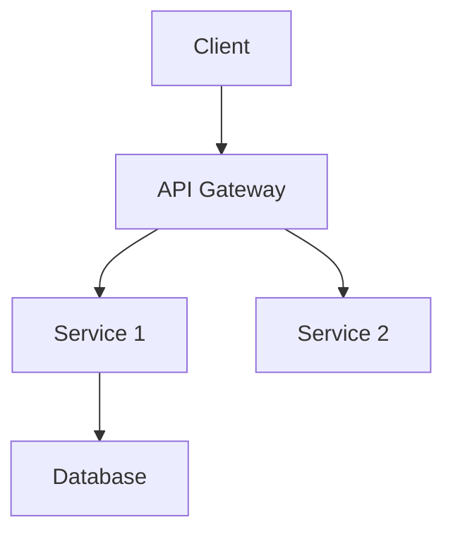
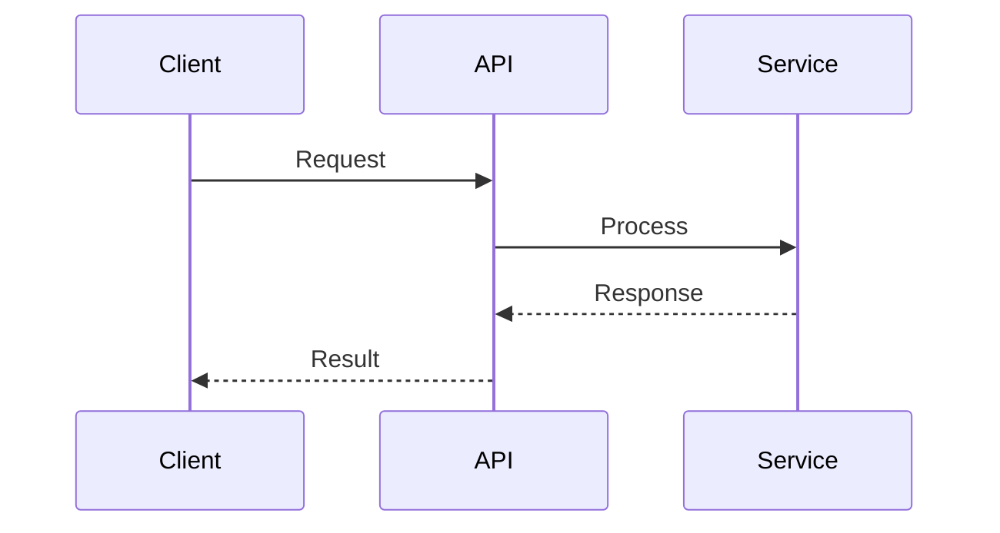
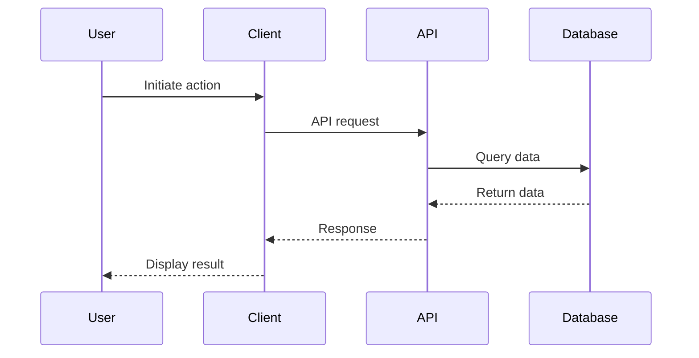

# BMAD Method Format Templates

This document provides complete template examples for the BMAD
(Build-Measure-Adapt-Deploy) Method format.

**Philosophy**: AI-Agent Framework for Agile Development **Primary Use Case**:
Agent-driven planning with human-in-the-loop validation

## Overview

BMAD uses a **multi-document format**:

- **PRD** (`docs/prd.md`) - Product Requirements
- **Architecture** (`docs/architecture.md`) - Technical Design
- **Story Files** (`docs/stories/{epic}.{story}.md`) - Individual Stories
- **QA Assessments** (`docs/qa/assessments/`) - Risk profiles and test
  strategies
- **Quality Gates** (`docs/qa/gates/`) - Gate validation results

## Template: PRD (docs/prd.md)

**Purpose**: Define product goals, requirements, epics, and user stories.

```markdown
# Product Requirements Document

**Version**: 2.0 **Date**: YYYY-MM-DD **Author**: [PM Agent / Human]

## Change Log

| Date | Version | Description | Author |
| ---- | ------- | ----------- | ------ |
| ...  | ...     | ...         | ...    |

## Goals and Background Context

### Goals

- [Desired outcome 1]
- [Desired outcome 2]

### Background Context

[1-2 paragraphs explaining the problem and landscape]

## Requirements

### Functional (FR)

**FR-001**: [Requirement description] **FR-002**: [Requirement description]

### Non-Functional (NFR)

**NFR-001**: [Requirement description] **NFR-002**: [Requirement description]

## User Interface Design Goals

### Overall UX Vision

[Vision description]

### Key Interaction Paradigms

[Interaction patterns]

### Core Screens and Views

[High-level screen descriptions]

### Accessibility

- Choice: None | WCAG AA | WCAG AAA

### Branding

[Branding elements]

### Target Platforms

- Choice: Web Responsive | Mobile Only | Desktop Only | Cross-Platform

## Technical Assumptions

### Repository Structure

- Choice: Monorepo | Polyrepo

### Service Architecture

- Choice: Monolith | Microservices | Serverless

### Testing Requirements

- Choice: Unit Only | Unit + Integration | Full Pyramid

### Additional Technical Assumptions

[Other assumptions]

## Epic List

1. **[Epic Title]**: [Single-sentence goal]
2. **[Epic Title]**: [Single-sentence goal]

## Epic Details

### Epic 1: [Title]

**Expanded Goal**: [2-3 sentence description]

**User Stories:**

- **US-001**: As a [user], I want [action], so that [benefit]
- **US-002**: As a [user], I want [action], so that [benefit]

**Acceptance Criteria (US-001):**

1. [Testable condition]
2. [Testable condition]

**Acceptance Criteria (US-002):**

1. [Testable condition]
2. [Testable condition]

### Epic 2: [Title]

[Same structure...]

## Next Steps

- UX Expert: Create detailed UX specification
- Architect: Create architecture document from this PRD
```

## Template: Architecture (docs/architecture.md)

**Purpose**: Define technical architecture, tech stack, data models, and
workflows.

````markdown
# Architecture Document

**Version**: 2.0 **Date**: YYYY-MM-DD **Author**: [Architect Agent / Human]
**References**: docs/prd.md, docs/front-end-spec.md

## Change Log

| Date | Version | Description | Author |
| ---- | ------- | ----------- | ------ |
| ...  | ...     | ...         | ...    |

## Introduction

### Project Overview

[Overview and relationship to frontend architecture]

### Starter Template Assessment

[Assessment of existing codebase if applicable]

## High-Level Architecture

### Technical Summary

[3-5 sentence overview of architecture style, components, and tech choices]

### High-Level Overview

- **Architectural Style**: [Monolith / Microservices / Serverless]
- **Repository Structure**: [Monorepo / Polyrepo]
- **Service Architecture**: [Details]
- **Data Flows**: [Flow descriptions]

### Project Diagram



### Architectural Patterns

**Pattern 1: [Pattern Name]**

- **Option A**: [Description] [RECOMMENDED]
- **Option B**: [Description]
- **Rationale**: [Why Option A chosen]

## Tech Stack (DEFINITIVE - Single Source of Truth)

### Cloud Infrastructure

- **Provider**: [AWS / Azure / GCP]
- **Services**: [List of cloud services]
- **Regions**: [Deployment regions]

### Technology Stack

| Category  | Technology | Version | Purpose            | Rationale             |
| --------- | ---------- | ------- | ------------------ | --------------------- |
| Runtime   | Node.js    | 18.17.0 | Server runtime     | LTS, widely supported |
| Framework | Express    | 4.18.2  | Web framework      | Mature, flexible      |
| Database  | PostgreSQL | 15.3    | Primary data store | ACID, relational      |
| ORM       | Prisma     | 5.0.0   | Database access    | Type-safe, modern     |

**Note**: NO "latest" versions - all pinned explicitly

## Data Models

### Model 1: [Entity Name]

**Purpose**: [Business purpose]

**Attributes**:

- `id`: UUID, Primary Key
- `name`: string, required
- `email`: string, unique, required
- `created_at`: timestamp

**Relationships**:

- One-to-Many with [Other Entity]
- Many-to-Many with [Other Entity] via [Junction Table]

**Design Decisions**:

- [Rationale for key design choices]

### Model 2: [Entity Name]

[Same structure...]

## Components

### Component 1: [Component Name]

**Responsibility**: [Primary purpose]

**Interfaces/APIs**:

- `POST /api/endpoint`: [Description]
- `GET /api/endpoint`: [Description]

**Dependencies**:

- [Component dependencies]

**Technology**: [Specific tech for this component]

**Diagram**:



### Component 2: [Component Name]

[Same structure...]

## External APIs

### API 1: [Service Name]

**Purpose**: [Why we integrate with this] **Documentation**: [URL]
**Authentication**: [Auth method] **Rate Limits**: [Limits] **Endpoints Used**:

- `GET /endpoint`: [Purpose]

### API 2: [Service Name]

[Same structure...]

## Core Workflows

### Workflow 1: [User Journey Name]



**Error Handling**:

- [Error scenarios and handling]

**Async Operations**:

- [Async operation handling]

### Workflow 2: [Another Journey]

[Same structure...]

## REST API Specification

```yaml
openapi: 3.0.0
info:
  title: [Project API]
  version: 1.0.0
paths:
  /api/resource:
    get:
      summary: [Description]
      parameters:
        - name: id
          in: query
          required: true
          schema:
            type: string
      responses:
        '200':
          description: Success
          content:
            application/json:
              schema:
                type: object
                properties:
                  id: { type: string }
                  name: { type: string }
```

## Deployment & Operations

### Deployment Strategy

[Deployment approach]

### Monitoring & Observability

[Monitoring tools and approach]

### Scaling Strategy

[How system scales]

## Security Considerations

[Security design decisions]

## Performance Considerations

[Performance optimisations]

## Next Steps

- Dev Agent: Begin implementation based on this architecture
- QA Agent: Develop test strategy
````

## Template: Story File (docs/stories/{epic}.{story}.md)

**Purpose**: Define individual user story with acceptance criteria and
implementation notes.

```markdown
# Story: [Story Title]

**Epic**: [Epic Name] **ID**: {epic}.{story} **Priority**: P0 | P1 | P2

## User Story

As a [user type], I want [action], so that [benefit]

## Acceptance Criteria

1. Given [context], When [action], Then [outcome]
2. Given [context], When [action], Then [outcome]

## Implementation Notes

[Technical implementation details]

## Dev/QA Notes

[Notes that carry forward between iterations]

## Links

- PRD: docs/prd.md
- Architecture: docs/architecture.md
- QA Assessment: docs/qa/assessments/{epic}.{story}-risk-profile-YYYYMMDD.md
```

## Template: QA Assessment (docs/qa/assessments/{epic}.{story}-risk-profile-YYYYMMDD.md)

**Purpose**: Define risk assessment and test strategy for each story.

```markdown
# Risk Profile: {epic}.{story}

**Date**: YYYY-MM-DD **Story**: [Story title]

## Risk Assessment

| Risk Category | Probability (1-3) | Impact (1-3) | Score (P×I) | Mitigation            |
| ------------- | ----------------- | ------------ | ----------- | --------------------- |
| Security      | 2                 | 3            | 6           | [Mitigation strategy] |
| Performance   | 1                 | 2            | 2           | [Mitigation strategy] |

## Test Strategy

### Unit Tests (P0)

- [Test description]

### Integration Tests (P1)

- [Test description]

### E2E Tests (P2)

- [Test description]

## Requirements Traceability

**FR-001**: [Requirement]

- **Test Coverage**:
  - Given [context]
  - When [action]
  - Then [outcome]

## NFR Validation

**NFR-001**: [Requirement]

- **Evidence**: [How it's validated]
```

## Template: Quality Gate (docs/qa/gates/{epic}.{story}-{slug}.yml)

**Purpose**: Record quality gate validation results.

```yaml
story: "{epic}.{story}"
gate: "{gate-name}"
status: "PASS" | "CONCERNS" | "FAIL" | "WAIVED"
date: "YYYY-MM-DD"
assessor: "[QA Agent / Human]"

concerns:
  - concern: "[Description]"
    severity: "HIGH" | "MEDIUM" | "LOW"
    recommendation: "[Action needed]"

waiver_reason: "[If status is WAIVED, explain why]"
```

## Key Characteristics

1. **Agent-Driven**: Analyst, PM, Architect, Dev, QA agents collaborate
2. **YAML Templates**: All documents generated from YAML templates with embedded
   prompts
3. **Validation Workflow**: PO runs master checklist to ensure PRD/Architecture
   alignment
4. **Document Sharding**: PRD/Architecture can be split into individual Epic and
   Story files
5. **QA Integration**: Built-in risk assessment and quality gates
6. **Traceability**: Requirements tracked through stories to tests
7. **Version Control**: Change logs in every document

## References

- [BMAD Method Documentation](https://github.com/context7/bmad) (if available)
- Anvil BMAD Adapter: `packages/adapters/src/bmad/` (planned)
