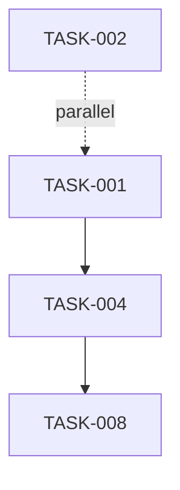

# SpecKit Format Templates

This document provides complete template examples for GitHub's official SpecKit
format.

**Philosophy**: Spec-Driven Development with AI agents **Primary Use Case**:
AI-assisted feature development with clear WHAT/WHY/HOW separation

## Overview

SpecKit uses a **3-document format**:

- **spec.md** - Requirements (WHAT and WHY)
- **plan.md** - Implementation (HOW)
- **tasks.md** - Execution Breakdown

## Template: spec.md

**Purpose**: Define requirements with priorities, user scenarios, and success
criteria.

```markdown
# Feature: [Feature Name]

**Branch**: `feature/xxx-name` **Date**: YYYY-MM-DD **Status**: Draft | In
Progress | Review | Complete

## User Scenarios & Testing

### P1: [High Priority Scenario]

**As a** [user type] **I want to** [action] **So that** [benefit]

**Acceptance Scenarios:**

- Given [context], When [action], Then [outcome]

**Edge Cases:**

- [Edge case description]
- [NEEDS CLARIFICATION: question]

### P2: [Medium Priority Scenario]

[Same structure...]

### P3+: [Low Priority Scenarios]

[Same structure...]

## Requirements

### Functional Requirements

**FR-001**: System MUST [requirement] **FR-002**: [NEEDS CLARIFICATION: unclear
requirement]

### Key Entities

**EntityName**

- Represents: [description]
- Key Attributes: [attr1, attr2]
- Relationships: [related entities]

## Success Criteria

### Quantitative Metrics

- [Measurable metric]

### Qualitative Metrics

- [Quality metric]

### Performance Metrics (optional)

- [Performance target]

### Security Metrics (optional)

- [Security requirement]
```

## Template: plan.md

**Purpose**: Define technical approach, project structure, and implementation
details.

```markdown
# Implementation Plan: [Feature Name]

**Branch**: `feature/xxx-name` **Date**: YYYY-MM-DD **Input**:
specs/xxx-feature-name/spec.md

## Summary

[Feature requirements from spec + technical approach]

## Technical Context

- **Language & Version**: [e.g., TypeScript 5.0]
- **Dependencies**: [key libraries]
- **Storage**: [database/storage approach]
- **Testing Framework**: [framework choice]
- **Platform**: [target platform]
- **Project Type**: [CLI, web app, etc.]
- **Performance Goals**: [targets]
- **Constraints**: [limitations]
- **Scale & Scope**: [scale considerations]

## Constitution Check

- **Phase**: Before Phase 0 / After Phase 1
- **Status**: ✅ PASSED / ⚠️ REVIEWED / ❌ BLOCKED
- **Notes**: [evaluation notes]

## Project Structure

### Documentation

- `specs/###-feature-name/plan.md` (this file)
- `specs/###-feature-name/spec.md`
- `specs/###-feature-name/research.md`
- `specs/###-feature-name/data-model.md`
- `specs/###-feature-name/contracts/` (API contracts)
- `specs/###-feature-name/quickstart.md`
- `specs/###-feature-name/tasks.md`

### Source Code

**Option A: Single Project**
```

src/ ├── models/ ├── services/ ├── cli/ └── lib/

```

**Option B: Web Application**
```

backend/ ├── src/ └── tests/ frontend/ ├── src/ └── tests/

```

## Implementation Details

### Database Schema
[Schema details]

### API Endpoints
[Endpoint specifications]

### Component Architecture
[Architecture details]

## Complexity Tracking

| Complexity Item | Justification | Alternatives Rejected |
|-----------------|---------------|----------------------|
| [Item] | [Why needed] | [Why not simpler] |
```

## Template: tasks.md

**Purpose**: Break down implementation into executable tasks with dependencies.

````markdown
# Tasks: [Feature Name]

**Input**: specs/###-feature-name/spec.md **Output**: Implemented feature

## Prerequisites

- [ ] spec.md completed and reviewed
- [ ] plan.md completed and reviewed
- [ ] research.md completed
- [ ] data-model.md completed

## Task ID Format

- `TASK-###`: Sequential task number
- `[~]`: Can run in parallel with previous task
- `[STORY-###]`: Links to user story

## Phase 1: Setup

- `TASK-001`: Initialize project structure
- `TASK-002` [~]: Configure linting and formatting
- `TASK-003`: Install core dependencies

## Phase 2: Foundational ⚠️ CRITICAL

- `TASK-004`: Set up database/ORM
- `TASK-005`: Implement authentication middleware
- `TASK-006`: Set up API routing
- `TASK-007`: Implement error handling

**Checkpoint**: Foundational infrastructure complete and tested

## Phase 3: User Stories (P1)

### [STORY-001]: [User Story Title]

**Goal**: [Story goal] **Tests**:

- [ ] Contract tests passing
- [ ] Integration tests passing

**Implementation Tasks**:

- `TASK-008`: [Task description]
- `TASK-009` [~]: [Parallel task]
- `TASK-010`: [Dependent task]

**Checkpoint**: Story independently testable and complete

### [STORY-002]: [Next P1 Story]

[Same structure...]

## Phase 4: User Stories (P2)

[Same structure as Phase 3...]

## Phase 5: Polish & Cross-Cutting Concerns

- `TASK-050`: Complete documentation
- `TASK-051`: Refactor and optimize
- `TASK-052`: Security hardening
- `TASK-053`: Performance validation

## Dependencies & Execution Order



## Implementation Strategies

- **MVP First**: Implement P1 stories first
- **Independent Stories**: Each story is independently testable
- **Incremental Delivery**: Deploy stories as completed
- **Team Parallelization**: Multiple stories can be developed concurrently
````

## Key Characteristics

1. **Priority-Driven**: P1 (high), P2 (medium), P3+ (low)
2. **Clarification Markers**: `[NEEDS CLARIFICATION: ...]` throughout
3. **Independent Testability**: Each user scenario must be independently
   testable
4. **Constitution Check**: Gating mechanism for architectural decisions
5. **Phase-Based Tasks**: Setup → Foundational → Stories → Polish
6. **Parallel Execution**: Tasks marked with `[~]` can run in parallel

## References

- [GitHub SpecKit Official Repository](https://github.com/github/spec-kit)
- Anvil SpecKit Adapter: `packages/adapters/src/speckit/`
