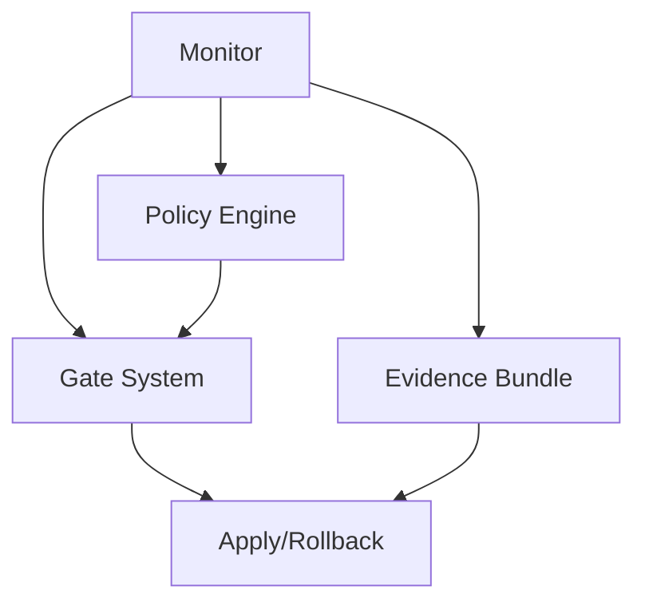

# Anvil Code Monitor Feature - Implementation Plan

**Created:** October 27, 2025 **Status:** Planning **Priority:** Post-MVP (Phase
9+) **Estimated Effort:** 7 weeks **Owner:** TBD

---

## 🎯 Vision

A real-time AI-powered code quality guardian that monitors code changes
(AI-generated or human-written), detects problematic patterns, and provides
intelligent recommendations with optional auto-fixes.

### The Problem

AI code generation tools (Claude Code, Copilot, Cursor) frequently produce code
with common issues:

- Commented-out "production" implementations with TODOs
- Hardcoded secrets, URLs, or configuration
- Missing environment variable setup
- Incomplete error handling
- Security vulnerabilities

**Current State:** These issues are discovered during code review, in
production, or become technical debt.

**Desired State:** Real-time detection and fixing of common AI code patterns
before they reach version control.

---

## 📋 Core Use Cases

| Use Case             | Description                                         | Priority |
| -------------------- | --------------------------------------------------- | -------- |
| Real-time monitoring | Catch issues as code is written in watch mode       | High     |
| Pattern detection    | Detect "commented production code" without env vars | High     |
| User-defined rules   | "If you see X, flag it and recommend Y"             | Medium   |
| Post-commit review   | Monitor branches, trigger reviews after AI commits  | Medium   |
| AI-assisted fixes    | Auto-implement recommendations with confirmation    | High     |
| Pre-commit gate      | Block commits with critical issues                  | High     |
| CI/CD integration    | GitHub Action for PR validation                     | Medium   |

---

## 🏗️ Architecture Overview

```
┌─────────────────────────────────────────────────────┐
│                  Anvil Monitor                       │
├─────────────────────────────────────────────────────┤
│                                                      │
│  ┌──────────────┐  ┌──────────────┐  ┌───────────┐ │
│  │ File Watcher │──│   Detector   │──│ AI Review │ │
│  │  (chokidar)  │  │ (AST+regex)  │  │ (Claude)  │ │
│  └──────────────┘  └──────────────┘  └───────────┘ │
│         │                 │                  │       │
│         ▼                 ▼                  ▼       │
│  ┌──────────────┐  ┌──────────────┐  ┌───────────┐ │
│  │ Rule Engine  │  │  Terminal UI │  │ Auto-Fix  │ │
│  │   (YAML)     │  │    (ora)     │  │ (git+AST) │ │
│  └──────────────┘  └──────────────┘  └───────────┘ │
│                                                      │
└─────────────────────────────────────────────────────┘
         │                  │                  │
         ▼                  ▼                  ▼
    Git Hooks         Evidence           Gate Check
                      Bundle
```

### Integration Points

**Existing Anvil Features:**

- **Gate System**: Monitor check as quality gate
- **Evidence Bundle**: Track all issues in audit trail
- **Apply/Rollback**: Use for applying auto-fixes
- **CLI Framework**: Extend with `anvil monitor` command

**External Integrations:**

- **Git**: Pre-commit hooks, branch monitoring
- **GitHub**: Action for PR comments
- **AI Providers**: Anthropic, OpenAI, local models
- **Editors**: VS Code extension (future)

---

## 🎬 Implementation Phases

### **Phase 1: MVP - Core Detection (Weeks 1-2)**

**Goal:** File watching + regex-based detection + terminal UI

**Deliverables:**

- [ ] `anvil monitor watch` command
- [ ] `anvil monitor scan` command
- [ ] 10-15 built-in regex rules
- [ ] Terminal UI for displaying issues
- [ ] Configuration file support

**Built-in Rules (MVP):**

```yaml
rules:
  - id: commented-production
    pattern: '// (TODO|FIXME):.*(properly|production|prod)'
    severity: warning
    message: Commented code with production TODOs

  - id: hardcoded-secret
    pattern: '(api_key|password|secret|token)\s*=\s*["\'][^"\']+["\']'
    severity: critical
    message: Hardcoded secret detected

  - id: console-log
    pattern: 'console\.(log|debug|info)\('
    severity: info
    message: Console statement in code

  - id: empty-catch
    pattern: 'catch\s*\([^)]*\)\s*\{\s*\}'
    severity: warning
    message: Empty catch block

  - id: todo-no-ticket
    pattern: '// TODO(?!.*TICKET-)'
    severity: info
    message: TODO without ticket reference
```

**CLI Usage:**

```bash
# Real-time mode
anvil monitor watch src/

# One-time scan
anvil monitor scan src/

# Single file
anvil monitor file src/auth.ts

# With custom rules
anvil monitor watch src/ --rules .anvil/monitor-rules.yml

# Fail on critical
anvil monitor scan --fail-on critical
```

**Terminal Output:**

```
┌─ Anvil Code Monitor ────────────────────────────────┐
│ 👁️  Watching: src/ (12 files, 3,451 LOC)            │
│ 📋 Rules: 15 active (10 built-in, 5 custom)         │
└──────────────────────────────────────────────────────┘

╭─ Issue #1 ────────────────────────────────────────╮
│ ⚠️  WARNING: Commented production code             │
│ src/services/auth.ts:45                           │
│                                                    │
│  43 │ async function generateToken(user) {        │
│  44 │   // TODO: Implement properly in production │
│ →45 │   // return jwt.sign({ user }, SECRET);     │
│  46 │   return null;                              │
│                                                    │
│ 💡 Recommendation:                                 │
│ Implement environment variable for JWT_SECRET     │
╰────────────────────────────────────────────────────╯

📊 Summary: 3 issues (0 critical, 2 warning, 1 info)
```

**Acceptance Criteria:**

- [ ] Watches files with debouncing (500ms)
- [ ] Detects all 10+ built-in rules
- [ ] Terminal UI updates in real-time
- [ ] Configuration file loads successfully
- [ ] Ignore patterns work (.gitignore-like)
- [ ] 80% test coverage

---

### **Phase 2: Rule System (Week 3)**

**Goal:** User-extensible rules + validation

**Deliverables:**

- [ ] User-defined rules (YAML/JSON)
- [ ] Rule validation and testing
- [ ] Severity levels (critical, warning, info)
- [ ] Custom ignore mechanisms
- [ ] Rule templates library

**User Rule Format:**

```yaml
# .anvil/monitor-rules.yml
rules:
  - id: commented-env-var
    name: Detect commented code needing env vars
    pattern: |
      // (implement|fix|TODO).*(properly|production|prod)
    severity: warning
    recommend: |
      Implement properly using environment variables:
      1. Add variable to .env.example
      2. Use process.env.VARIABLE_NAME
      3. Add validation if missing
    contextLines: 5
    tags:
      - security
      - environment

  - id: custom-pattern
    name: Team-specific pattern
    pattern: "\\bfixme\\b"
    message: 'Use TODO with ticket reference instead'
    autoFix:
      pattern: 'fixme'
      replacement: 'TODO(TICKET-XXX)'
      safety: safe
```

**CLI Commands:**

```bash
# List rules
anvil monitor rules list

# Validate rules file
anvil monitor rules validate .anvil/monitor-rules.yml

# Test rule against file
anvil monitor rules test commented-env-var src/auth.ts

# Add rule from template
anvil monitor rules add --template security/hardcoded-secret
```

**Acceptance Criteria:**

- [ ] YAML/JSON rule files load successfully
- [ ] Rules validated on load (schema validation)
- [ ] Users can test rules before applying
- [ ] Severity filtering works (`--severity warning`)
- [ ] Tags for rule categorisation

---

### **Phase 3: AI Integration (Week 4)**

**Goal:** Optional AI-powered review (BYO key)

**Deliverables:**

- [ ] AI provider abstraction
- [ ] Context-aware analysis
- [ ] Intelligent recommendations
- [ ] Fix suggestions with explanations

**Configuration:**

```yaml
# .anvil/monitor.yml
ai:
  enabled: true # Opt-in
  provider: anthropic # anthropic | openai | local
  model: claude-3-5-sonnet-20241022
  apiKey: ${ANTHROPIC_API_KEY} # BYO key from env
  maxTokensPerReview: 1000
  maxReviewsPerDay: 100 # Cost control
  cache: true # Cache similar issues
  reviewRules:
    - commented-production-code
    - security-sensitive
    - incomplete-implementation

providers:
  anthropic:
    apiKey: ${ANTHROPIC_API_KEY}
  openai:
    apiKey: ${OPENAI_API_KEY}
    model: gpt-4-turbo
  local:
    endpoint: http://localhost:8080
    model: codellama
```

**AI Review Prompt Template:**

````
You are a code quality reviewer for the Anvil monitoring system.

DETECTED ISSUE: {rule.name}
RULE PATTERN: {rule.pattern}
FILE: {file}:{line}

CODE CONTEXT:
```{language}
{snippet}
````

TASK:

1. Confirm if this is actually a problem (yes/no)
2. If yes, explain why it's problematic (1-2 sentences)
3. Suggest specific fix (code preferred, 5-10 lines max)
4. Explain the recommendation (1 sentence)

FORMAT: { "isProblem": true, "explanation": "...", "suggestedFix": "...",
"reasoning": "..." }

Be concise and actionable. Focus on code quality and security.

```

**Terminal Output with AI:**
```

╭─ Issue #1 ────────────────────────────────────────╮ │ ⚠️ WARNING: Commented
production code │ │ src/services/auth.ts:45 │ │ │ │ 🤖 AI Analysis (Claude 3.5,
95% confidence): │ │ │ │ ✓ Confirmed problem │ │ │ │ This code has placeholder
implementation with │ │ hardcoded SECRET. Issues: │ │ 1. Using hardcoded SECRET
(security risk) │ │ 2. No environment variable │ │ 3. Missing input validation │
│ │ │ 💡 AI Suggested Fix: │ │ │ │
`typescript                                      │ │ const JWT_SECRET = process.env.JWT_SECRET;        │ │ if (!JWT_SECRET) {                                │ │   throw new Error('JWT_SECRET required');         │ │ }                                                  │ │ return jwt.sign({ user }, JWT_SECRET);            │ │`
│ │ │ │ Also add to .env.example: │ │ JWT_SECRET=your-secret-key-here │ │ │ │ 🔧
Auto-fix available (AI-assisted) │
╰────────────────────────────────────────────────────╯

[F] Fix with AI [V] View full diff [I] Ignore

````

**Cost Tracking:**
```bash
anvil monitor stats

# Output:
AI Usage (last 30 days):
  Reviews: 234
  Tokens: 117,000 (~$0.35)
  Average: 500 tokens/review

Daily limit: 100 reviews (47 remaining today)
Cache hits: 45 (19% savings)
````

**Acceptance Criteria:**

- [ ] Supports Anthropic Claude
- [ ] Supports OpenAI GPT-4
- [ ] Supports local models (ollama)
- [ ] Token usage tracked
- [ ] Daily limits enforced
- [ ] Results cached (24h TTL)
- [ ] Privacy-first (no data sent without permission)

---

### **Phase 4: Auto-Fix (Week 5)**

**Goal:** Safe automated fixes + git integration

**Deliverables:**

- [ ] Safe fixes (no confirmation)
- [ ] AI-assisted fixes (with approval)
- [ ] Confirmation workflow
- [ ] Git integration (branch, commit)
- [ ] Rollback capability

**Fix Safety Levels:**

```typescript
enum FixSafety {
  SAFE = 'safe', // No confirmation needed
  REVIEWED = 'reviewed', // User confirms
  AI_ASSISTED = 'ai', // AI generates, user approves
}

interface AutoFix {
  safety: FixSafety;
  description: string;
  apply: (code: string) => string;
  validate?: (result: string) => boolean;
  rollback?: (original: string) => string;
}
```

**Safe Fixes (No Confirmation):**

- Remove console.log statements
- Add missing semicolons
- Fix trailing whitespace
- Remove unused imports
- Add TODO ticket references

**Reviewed Fixes (User Confirms):**

- Replace hardcoded values with env vars
- Add error handling blocks
- Implement missing validation
- Fix security issues

**AI-Assisted Fixes (AI Generates):**

- Implement commented code
- Complete partial implementations
- Refactor complex logic
- Add comprehensive error handling

**CLI Workflow:**

```bash
# Auto-fix all safe issues
anvil monitor fix --safe-only

# Interactive fixing
anvil monitor fix --interactive

# AI-assisted fixes
anvil monitor fix --ai

# Create branch for fixes
anvil monitor fix --branch auto-fix/monitor-2025-10-27

# Commit after fixing
anvil monitor fix --commit "fix: resolve monitor issues"
```

**Interactive Fix Flow:**

````
╭─ Fix #1 of 3 ────────────────────────────────────╮
│ ⚠️  WARNING: Commented production code            │
│ src/services/auth.ts:45                          │
│                                                   │
│ 🔧 AI-Assisted Fix (Safety: requires approval)    │
│                                                   │
│ BEFORE:                                           │
│ ```typescript                                     │
│ // TODO: Implement properly in production        │
│ // return jwt.sign({ user }, SECRET);            │
│ return null;                                      │
│ ```                                               │
│                                                   │
│ AFTER:                                            │
│ ```typescript                                     │
│ const JWT_SECRET = process.env.JWT_SECRET;       │
│ if (!JWT_SECRET) {                               │
│   throw new Error('JWT_SECRET required');        │
│ }                                                 │
│ return jwt.sign({ user }, JWT_SECRET);           │
│ ```                                               │
│                                                   │
│ Additional changes:                               │
│ - Add JWT_SECRET to .env.example                 │
│ - Import jwt library if missing                  │
╰───────────────────────────────────────────────────╯

[A] Apply  [S] Skip  [E] Edit  [V] View full file
[R] Run tests after  [Q] Quit

>
````

**Git Integration:**

```bash
# Automatic branch creation
anvil monitor fix --branch auto-fix/auth-fixes

# Runs:
# 1. git checkout -b auto-fix/auth-fixes
# 2. Apply fixes
# 3. git add <modified-files>
# 4. git commit -m "fix: resolve monitor issues (3 fixes applied)"

# With snapshot for rollback
anvil monitor fix --snapshot aps-monitor-20251027

# Later rollback if needed
anvil rollback aps-monitor-20251027
```

**Acceptance Criteria:**

- [ ] Safe fixes apply without confirmation
- [ ] Reviewed fixes show diff and ask
- [ ] AI fixes generate valid code
- [ ] Git branch creation works
- [ ] Commit messages are descriptive
- [ ] Rollback via Anvil snapshots
- [ ] Tests run after fix (optional)

---

### **Phase 5: Git Integration (Week 6)**

**Goal:** Pre-commit hooks + branch monitoring

**Deliverables:**

- [ ] Pre-commit hook command
- [ ] Branch diff analysis
- [ ] Commit message integration
- [ ] Staged files only mode

**Pre-commit Hook Setup:**

```bash
# Initialise hook
anvil monitor init-hook

# Creates .git/hooks/pre-commit:
#!/bin/bash
anvil monitor pre-commit --fail-on critical

exit $?
```

**Pre-commit Configuration:**

```yaml
# .anvil/monitor.yml
preCommit:
  enabled: true
  failOn: critical # critical | warning | info
  autoFix: safe-only # none | safe-only | all-with-confirm
  skipPatterns:
    - '**/*.test.ts'
    - '**/fixtures/**'
  rules:
    - hardcoded-secret
    - security-critical
    - incomplete-impl
```

**Pre-commit Output:**

```bash
git commit -m "Add auth feature"

# Runs:
┌─ Anvil Pre-Commit Check ────────────────────────┐
│ Scanning 3 staged files...                      │
└──────────────────────────────────────────────────┘

╭─ Issue #1 ─────────────────────────────────────╮
│ 🔴 CRITICAL: Hardcoded API key                  │
│ src/auth.ts:12                                 │
│                                                 │
│ const API_KEY = "sk-proj-abc123...";           │
╰─────────────────────────────────────────────────╯

❌ Commit blocked due to 1 critical issue(s)

Fix issues and try again, or use:
  git commit --no-verify
```

**Branch Monitoring:**

```bash
# Monitor branch diff from main
anvil monitor diff main..feature-auth

# Monitor specific commit range
anvil monitor diff abc123..def456

# Monitor PR (GitHub integration)
anvil monitor pr 123
```

**Acceptance Criteria:**

- [ ] Pre-commit hook installs correctly
- [ ] Staged files scanned only
- [ ] Critical issues block commit
- [ ] --no-verify bypass works
- [ ] Branch diff scanning works
- [ ] Commit messages reference issues

---

### **Phase 6: CI/CD & Gate Integration (Week 7)**

**Goal:** GitHub Action + Anvil gate check

**Deliverables:**

- [ ] GitHub Action for PR monitoring
- [ ] Evidence bundle generation
- [ ] Integration with `anvil gate`
- [ ] PR comments with findings

**GitHub Action:**

```yaml
# .github/workflows/anvil-monitor.yml
name: Anvil Monitor

on:
  pull_request:
    types: [opened, synchronize]

jobs:
  monitor:
    runs-on: ubuntu-latest
    steps:
      - uses: actions/checkout@v4

      - name: Setup Node.js
        uses: actions/setup-node@v4
        with:
          node-version: '20'

      - name: Install Anvil
        run: npm install -g @anvil/cli

      - name: Run Monitor
        env:
          ANTHROPIC_API_KEY: ${{ secrets.ANTHROPIC_API_KEY }}
        run: |
          anvil monitor scan src/
          anvil monitor diff origin/main..HEAD

      - name: Comment PR
        if: failure()
        uses: actions/github-script@v7
        with:
          script: |
            const issues = require('./.anvil/monitor-results.json');
            github.rest.issues.createComment({
              issue_number: context.issue.number,
              owner: context.repo.owner,
              repo: context.repo.repo,
              body: generateComment(issues)
            })
```

**Gate Integration:**

```bash
# Add monitor to gate checks
anvil gate spec.md --checks lint,test,coverage,monitor

# Gate runs:
# 1. Lint check
# 2. Test check
# 3. Coverage check (>80%)
# 4. Monitor check (fail on critical)

# Output:
✓ Lint: Passed
✓ Test: Passed (143 tests)
✓ Coverage: Passed (84%)
❌ Monitor: Failed (1 critical issue)

Gate Result: FAILED
```

**Evidence Bundle:**

```json
{
  "check": "monitor",
  "timestamp": "2025-10-27T10:30:00Z",
  "result": "failed",
  "issues": [
    {
      "id": "hardcoded-secret-1",
      "rule": "hardcoded-secret",
      "file": "src/auth.ts",
      "line": 12,
      "severity": "critical",
      "snippet": "const API_KEY = \"sk-proj-abc123...\";",
      "aiAnalysis": {
        "isProblem": true,
        "explanation": "Hardcoded API key in source code",
        "recommendation": "Use environment variable"
      }
    }
  ],
  "stats": {
    "filesScanned": 45,
    "issuesFound": 3,
    "criticalIssues": 1,
    "aiReviews": 3,
    "tokenUsage": 1500
  }
}
```

**PR Comment Format:**

````markdown
## 🔍 Anvil Monitor Report

**Status:** ❌ Failed **Files Scanned:** 45 **Issues Found:** 3 (1 critical, 2
warnings)

### Critical Issues

#### 1. Hardcoded API Key

**File:** `src/auth.ts:12` **Severity:** 🔴 Critical

```typescript
12 | const API_KEY = "sk-proj-abc123...";
```
````

**🤖 AI Analysis:** Hardcoded API key detected in source code. This is a
security risk.

**💡 Recommendation:** Use environment variable instead:

```typescript
const API_KEY = process.env.API_KEY;
if (!API_KEY) throw new Error('API_KEY required');
```

---

**Actions Required:**

- [ ] Fix 1 critical issue
- [ ] Review 2 warnings

Run locally: `anvil monitor scan src/`

````

**Acceptance Criteria:**
- [ ] GitHub Action runs on PRs
- [ ] Comments posted to PRs
- [ ] Evidence bundle generated
- [ ] Gate integration works
- [ ] Status check shows pass/fail
- [ ] Results cached between runs

---

## 📐 Technical Implementation

### Data Structures

```typescript
// Core Types
interface MonitorConfig {
  watch: string[];
  ignore: string[];
  rules: string[];
  ai?: AIConfig;
  preCommit?: PreCommitConfig;
  severity: 'critical' | 'warning' | 'info';
}

interface MonitorRule {
  id: string;
  name: string;
  description: string;
  pattern: string | RegExp;
  severity: 'critical' | 'warning' | 'info';
  recommend: string;
  contextLines: number;
  aiReview: boolean;
  autoFix?: AutoFixConfig;
  tags: string[];
}

interface MonitorIssue {
  id: string;
  rule: MonitorRule;
  file: string;
  line: number;
  column: number;
  snippet: string;
  context: string;
  severity: 'critical' | 'warning' | 'info';
  aiAnalysis?: AIAnalysis;
  suggestedFix?: CodeFix;
  timestamp: string;
}

interface AIAnalysis {
  isProblem: boolean;
  confidence: number;
  explanation: string;
  recommendation: string;
  suggestedFix?: string;
  reasoning: string;
  tokensUsed: number;
}

interface CodeFix {
  id: string;
  safety: 'safe' | 'reviewed' | 'ai';
  description: string;
  originalCode: string;
  fixedCode: string;
  affectedFiles: string[];
  testCommand?: string;
}

interface AIConfig {
  enabled: boolean;
  provider: 'anthropic' | 'openai' | 'local';
  model: string;
  apiKey: string;
  maxTokensPerReview: number;
  maxReviewsPerDay: number;
  cache: boolean;
  reviewRules: string[];
}
````

### Core Classes

```typescript
// Monitor Orchestrator
class CodeMonitor {
  private watcher: FileMonitor;
  private detector: IssueDetector;
  private reviewer: AIReviewer;
  private fixer: AutoFixer;
  private ui: TerminalUI;

  async watch(paths: string[]): Promise<void> {
    await this.watcher.watch(paths, async (file) => {
      const issues = await this.detector.scan(file);

      if (this.config.ai?.enabled) {
        for (const issue of issues) {
          issue.aiAnalysis = await this.reviewer.analyze(issue);
        }
      }

      this.ui.displayIssues(issues);
    });
  }

  async scan(paths: string[]): Promise<MonitorIssue[]> {
    const issues: MonitorIssue[] = [];

    for (const file of this.findFiles(paths)) {
      const fileIssues = await this.detector.scan(file);
      issues.push(...fileIssues);
    }

    return issues;
  }

  async fix(issues: MonitorIssue[], options: FixOptions): Promise<FixResult[]> {
    const results: FixResult[] = [];

    for (const issue of issues) {
      if (options.interactive) {
        const approved = await this.ui.confirmFix(issue);
        if (!approved) continue;
      }

      const result = await this.fixer.apply(issue);
      results.push(result);
    }

    return results;
  }
}

// File Watcher
class FileMonitor {
  private watcher: FSWatcher;
  private debounceMap = new Map<string, NodeJS.Timeout>();

  async watch(
    paths: string[],
    onChange: (file: string) => Promise<void>
  ): Promise<void> {
    this.watcher = chokidar.watch(paths, {
      ignored: this.config.ignore,
      persistent: true,
      ignoreInitial: true,
    });

    this.watcher.on('change', (path) => {
      this.debounce(path, () => onChange(path));
    });
  }

  private debounce(path: string, callback: () => void): void {
    const existing = this.debounceMap.get(path);
    if (existing) clearTimeout(existing);

    const timeout = setTimeout(callback, 500);
    this.debounceMap.set(path, timeout);
  }
}

// Issue Detector
class IssueDetector {
  private rules: Map<string, MonitorRule>;

  async scan(file: string): Promise<MonitorIssue[]> {
    const content = await fs.readFile(file, 'utf-8');
    const issues: MonitorIssue[] = [];

    for (const rule of this.rules.values()) {
      const matches = this.findMatches(content, rule);

      for (const match of matches) {
        issues.push(this.createIssue(file, match, rule));
      }
    }

    return issues;
  }

  private findMatches(content: string, rule: MonitorRule): RegExpMatchArray[] {
    const pattern =
      typeof rule.pattern === 'string'
        ? new RegExp(rule.pattern, 'gm')
        : rule.pattern;

    return Array.from(content.matchAll(pattern));
  }
}

// AI Reviewer
class AIReviewer {
  private provider: AIProvider;
  private cache: Map<string, AIAnalysis>;

  async analyze(issue: MonitorIssue): Promise<AIAnalysis> {
    // Check cache
    const cacheKey = this.getCacheKey(issue);
    if (this.cache.has(cacheKey)) {
      return this.cache.get(cacheKey)!;
    }

    // Build prompt
    const prompt = this.buildPrompt(issue);

    // Call AI
    const response = await this.provider.complete({
      messages: [{ role: 'user', content: prompt }],
      max_tokens: this.config.maxTokensPerReview,
    });

    // Parse response
    const analysis = this.parseAnalysis(response);

    // Cache result
    this.cache.set(cacheKey, analysis);

    return analysis;
  }

  private buildPrompt(issue: MonitorIssue): string {
    return `
You are a code quality reviewer for the Anvil monitoring system.

DETECTED ISSUE: ${issue.rule.name}
RULE PATTERN: ${issue.rule.pattern}
FILE: ${issue.file}:${issue.line}

CODE CONTEXT:
\`\`\`typescript
${issue.context}
\`\`\`

TASK:
1. Confirm if this is actually a problem (yes/no)
2. If yes, explain why it's problematic (1-2 sentences)
3. Suggest specific fix (code preferred, 5-10 lines max)
4. Explain the recommendation (1 sentence)

FORMAT:
{
  "isProblem": true,
  "explanation": "...",
  "suggestedFix": "...",
  "reasoning": "..."
}
`.trim();
  }
}

// Auto Fixer
class AutoFixer {
  async apply(issue: MonitorIssue): Promise<FixResult> {
    const file = issue.file;
    const originalContent = await fs.readFile(file, 'utf-8');

    // Generate fix
    const fix = issue.suggestedFix || (await this.generateFix(issue));

    // Apply fix
    const fixedContent = this.applyFix(originalContent, fix);

    // Validate
    if (fix.validate && !fix.validate(fixedContent)) {
      throw new Error('Fix validation failed');
    }

    // Write file
    await fs.writeFile(file, fixedContent);

    // Git operations
    if (this.options.commit) {
      await this.gitCommit(file, fix);
    }

    return {
      success: true,
      file,
      fix,
      originalContent,
      fixedContent,
    };
  }

  private async generateFix(issue: MonitorIssue): Promise<CodeFix> {
    if (issue.aiAnalysis?.suggestedFix) {
      return {
        id: issue.id,
        safety: 'ai',
        description: issue.aiAnalysis.explanation,
        originalCode: issue.snippet,
        fixedCode: issue.aiAnalysis.suggestedFix,
        affectedFiles: [issue.file],
      };
    }

    // Fallback to rule-based fix
    return this.ruleFix(issue);
  }
}
```

---

## 📊 Success Metrics

### Phase 1 (MVP)

- [ ] Can watch files and detect 10+ patterns
- [ ] Terminal UI shows issues in real-time
- [ ] Configuration file works
- [ ] 80% test coverage
- [ ] Documentation complete

### Phase 2 (Rules)

- [ ] Users can add custom rules
- [ ] Rule validation works
- [ ] Severity filtering works
- [ ] 5+ rule templates available

### Phase 3 (AI)

- [ ] AI review optional and working
- [ ] Supports 2+ AI providers
- [ ] Token usage tracked
- [ ] Costs <$5/month for typical usage

### Phase 4 (Auto-fix)

- [ ] Auto-fix generates valid code
- [ ] 90%+ fix accuracy
- [ ] Git integration works
- [ ] Rollback successful

### Phase 5 (Git)

- [ ] Pre-commit hook blocks bad commits
- [ ] Branch monitoring works
- [ ] No false positives in testing

### Phase 6 (CI/CD)

- [ ] GitHub Action available
- [ ] Gate integration working
- [ ] PR comments posted
- [ ] Evidence bundle generated

---

## 💰 Cost Analysis

### AI Review Costs

**With Claude 3.5 Sonnet:**

- Input: $3/million tokens
- Output: $15/million tokens
- Average issue: ~500 tokens input, ~300 tokens output
- Cost per review: ~$0.0015 + $0.0045 = $0.006

**Monthly Estimates:** | Usage Level | Reviews/Day | Reviews/Month | Cost/Month
| |-------------|-------------|---------------|------------| | Light | 10 | 300
| $1.80 | | Medium | 50 | 1,500 | $9.00 | | Heavy | 200 | 6,000 | $36.00 |

**Cost Reduction Strategies:**

1. **Caching**: 24h cache (est. 30% reduction)
2. **Batching**: Review multiple issues at once
3. **Selective AI**: Only critical/warning issues
4. **Daily limits**: Cap at 100 reviews/day
5. **Local models**: Free but lower quality

**Free Tier:**

- 10 AI reviews/day (free)
- Unlimited regex-based detection
- All auto-fix features
- Pre-commit hooks

---

## 🔄 Integration with Anvil Ecosystem

### Synergies



**Integration Points:**

1. **Monitor → Gate**
   - Monitor results as quality gate check
   - Configurable severity thresholds
   - Evidence attached to gate results

2. **Monitor → Evidence**
   - All issues tracked in audit trail
   - AI analysis preserved
   - Fixes documented with before/after

3. **Monitor → Apply**
   - Auto-fixes applied via Anvil apply
   - Snapshot-based rollback
   - Transaction safety

4. **Monitor → Policy (OPA)**
   - Rules as Rego policies (future)
   - Centralised policy management
   - Enterprise governance

---

## 📁 File Structure

```
cli/src/commands/monitor/
├── index.ts                 # Main command entry
├── watch.ts                 # Watch mode
├── scan.ts                  # Scan mode
├── fix.ts                   # Fix command
├── pre-commit.ts            # Pre-commit hook
├── diff.ts                  # Branch diff
├── init.ts                  # Initialise config
└── rules/
    ├── list.ts
    ├── add.ts
    ├── validate.ts
    └── test.ts

cli/src/monitor/
├── core/
│   ├── monitor.ts          # Main orchestrator
│   ├── detector.ts         # Issue detection
│   ├── watcher.ts          # File watching
│   └── git-monitor.ts      # Git integration
├── rules/
│   ├── built-in/
│   │   ├── incomplete-impl.ts
│   │   ├── security.ts
│   │   ├── best-practices.ts
│   │   └── documentation.ts
│   ├── loader.ts           # Load YAML rules
│   ├── validator.ts        # Validate rules
│   └── matcher.ts          # Pattern matching
├── ai/
│   ├── reviewer.ts         # AI review orchestration
│   ├── providers/
│   │   ├── anthropic.ts
│   │   ├── openai.ts
│   │   └── local.ts
│   ├── prompts.ts          # Prompt templates
│   └── cache.ts            # Response caching
├── fix/
│   ├── auto-fixer.ts       # Fix application
│   ├── safe-fixes.ts       # Safe fix implementations
│   ├── ai-fixes.ts         # AI-generated fixes
│   └── git.ts              # Git operations
├── ui/
│   ├── terminal.ts         # Terminal UI (ora)
│   ├── reporter.ts         # Issue reporting
│   ├── interactive.ts      # Interactive prompts
│   └── formatter.ts        # Output formatting
└── utils/
    ├── ast-parser.ts       # AST parsing (optional)
    ├── context.ts          # Extract code context
    └── diff.ts             # Diff generation

cli/src/__tests__/monitor/
├── detector.test.ts
├── rules.test.ts
├── ai-reviewer.test.ts
├── auto-fixer.test.ts
├── watcher.test.ts
└── integration/
    ├── watch.test.ts
    ├── fix.test.ts
    └── pre-commit.test.ts

.anvil/
├── monitor.yml              # Main configuration
├── monitor-rules.yml        # User-defined rules
├── monitor-ignore.txt       # Ignore patterns
└── monitor-cache/           # AI response cache
    └── [hash].json

docs/guides/
├── MONITOR.md               # User guide
├── MONITOR_RULES.md         # Rule authoring
└── MONITOR_AI.md            # AI integration guide

.github/
└── workflows/
    └── anvil-monitor.yml    # GitHub Action
```

---

## 🚀 Go-to-Market Strategy

### Positioning

**Tagline:** "Real-time AI code guardian - catch issues before they become
technical debt"

**Value Proposition:**

- Save hours on code review
- Prevent security vulnerabilities
- Reduce technical debt
- Learn better patterns from AI feedback

### Target Users

1. **AI-Assisted Developers**
   - Using Claude Code, Copilot, Cursor
   - Want to catch AI mistakes early
   - Value automated code review

2. **Junior Developers**
   - Learning best practices
   - Benefit from AI explanations
   - Want instant feedback

3. **Teams with Code Quality Issues**
   - High bug rates
   - Security concerns
   - Technical debt accumulation

4. **Open Source Maintainers**
   - Many contributors
   - Varying skill levels
   - Need automated quality checks

### Competitive Differentiation

**vs. Linters (ESLint, etc.):**

- ✅ AI-powered explanations
- ✅ Auto-fix with context
- ✅ Real-time monitoring
- ✅ User-extensible with plain English

**vs. Static Analysis (SonarQube):**

- ✅ Real-time feedback
- ✅ AI-generated fixes
- ✅ Cheaper (BYO API key)
- ✅ Developer-focused UX

**vs. Copilot/Cursor:**

- ✅ Monitors AI output
- ✅ Team-specific rules
- ✅ Evidence trail
- ✅ Pre-commit gates

### Marketing Channels

1. **Developer Communities**
   - Hacker News post
   - Reddit (r/programming, r/webdev)
   - Dev.to article series

2. **Content Marketing**
   - Blog: "10 Common AI Code Issues"
   - Video: Live demo
   - Case study: "Saved 20h/week"

3. **Integration Partners**
   - Claude Code marketplace
   - VS Code extension
   - Cursor plugin

4. **Social Proof**
   - Open source on GitHub
   - Star farming campaign
   - Testimonials from beta users

---

## 📋 Dependencies & Risks

### Technical Dependencies

| Dependency    | Version | Purpose           | Risk                 |
| ------------- | ------- | ----------------- | -------------------- |
| chokidar      | ^3.5.0  | File watching     | Low (stable)         |
| ora           | ^8.0.0  | Terminal UI       | Low (stable)         |
| anthropic-sdk | ^0.32.0 | AI review         | Medium (API changes) |
| simple-git    | ^3.25.0 | Git operations    | Low (stable)         |
| zod           | ^3.23.0 | Schema validation | Low (existing)       |

### External Dependencies

- **Anthropic API**: Rate limits, pricing changes
- **Git**: Requires git binary installed
- **Node.js**: Requires 20+
- **TypeScript**: AST parsing complexity

### Risks & Mitigation

| Risk                | Impact | Likelihood | Mitigation                            |
| ------------------- | ------ | ---------- | ------------------------------------- |
| AI costs too high   | High   | Medium     | Daily limits, caching, local models   |
| False positives     | Medium | High       | User allowlist, confidence thresholds |
| Performance issues  | Medium | Low        | Debouncing, background processing     |
| Adoption resistance | High   | Medium     | Free tier, clear value demo           |
| Security concerns   | High   | Low        | BYO key, no data retention            |

---

## 📚 Documentation Plan

### User Documentation

1. **Getting Started**
   - Installation
   - Basic usage (watch, scan)
   - Configuration

2. **User Guide**
   - CLI commands reference
   - Configuration options
   - Built-in rules

3. **Advanced Usage**
   - Custom rules authoring
   - AI integration setup
   - Pre-commit hooks

4. **Troubleshooting**
   - Common issues
   - Performance tuning
   - FAQ

### Developer Documentation

1. **Architecture**
   - System design
   - Component overview
   - Data flow

2. **API Reference**
   - Core classes
   - Rule format
   - AI provider interface

3. **Contributing**
   - Adding built-in rules
   - Adding AI providers
   - Testing guidelines

### Marketing Materials

1. **Landing Page**
   - Hero demo GIF
   - Feature highlights
   - Pricing

2. **Blog Posts**
   - Announcement
   - Use cases
   - Best practices

3. **Video Content**
   - Quick start (2min)
   - Deep dive (15min)
   - Testimonials

---

## 🎯 Next Steps

### Immediate Actions

1. **Get Approval**
   - Review this plan with stakeholders
   - Prioritise against other features
   - Allocate resources (1 developer, 7 weeks)

2. **Phase 1 Kickoff**
   - Create feature branch
   - Set up project structure
   - Implement file watcher (Week 1)
   - Implement regex detector (Week 1)
   - Build terminal UI (Week 2)

3. **Early Validation**
   - Build MVP (Phases 1-2)
   - Beta test with 3-5 users
   - Gather feedback
   - Decide on AI integration (Phase 3)

### Decision Points

**After Phase 1 (Week 2):**

- ✅ Continue to Phase 2 if regex detection works well
- ⚠️ Pivot if performance is poor
- ❌ Cancel if no user interest

**After Phase 2 (Week 3):**

- ✅ Continue to Phase 3 (AI) if users want it
- ⚠️ Skip AI if costs are concern
- Consider local-only version

**After Phase 3 (Week 4):**

- ✅ Continue to auto-fix if AI works well
- ⚠️ Focus on rules if AI adoption low

---

## 📊 Success Criteria (Overall)

### Technical Success

- [ ] 80%+ test coverage
- [ ] <100ms detection latency
- [ ] <1% false positive rate
- [ ] Works with 100+ files
- [ ] Zero crashes in 1 week

### User Success

- [ ] 100+ GitHub stars (3 months)
- [ ] 10+ custom rules shared
- [ ] 5+ testimonials
- [ ] Featured in newsletter

### Business Success

- [ ] 50+ weekly active users
- [ ] 10+ paid API users
- [ ] 3+ enterprise inquiries
- [ ] Anvil ecosystem growth

---

## 🔗 References

- **Similar Tools:**
  - ESLint: https://eslint.org
  - SonarQube: https://www.sonarsource.com
  - Semgrep: https://semgrep.dev

- **AI Providers:**
  - Anthropic: https://docs.anthropic.com
  - OpenAI: https://platform.openai.com/docs

- **Anvil Docs:**
  - Architecture: `docs/ARCHITECTURE.md`
  - Gate System: `core/src/gate/`
  - Evidence: `docs/planning/PLAN.md`

---

**Status:** Filed for review **Next Review:** After BMAD/SpecKit testing
complete **Estimated Start:** Week 10+ (post-MVP)
