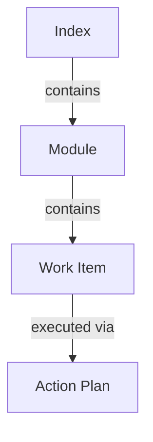

# Anvil Plan Specification (APS)

APS is an open-source, markdown-native specification for defining development
plans that travel with your code and work with every AI tool you use — Claude
Code, Cursor, Copilot, Codex, OpenCode, Gemini, and whatever comes next.

**Plan before you prompt.** APS turns AI coding agents from improvisers into
executors by giving them authorised, bounded, dependency-aware work items.

## What APS solves

| Pain                    | Without APS                                     | With APS                                                 |
| ----------------------- | ----------------------------------------------- | -------------------------------------------------------- |
| **Scattered specs**     | Specs live in Notion, Linear, or a chat thread  | Specs live in `plans/`, versioned with your code         |
| **Tool lock-in**        | Each AI tool needs its own ruleset and re-brief | One spec works everywhere — every agent reads markdown   |
| **Agent drift**         | Agents wander off scope or run out of context   | Work items are authorised, bounded, and dependency-aware |
| **No decision history** | No record of why a decision was made            | Decisions, designs, and learnings sit beside the code    |

It is just markdown. No vendor lock-in. No daemons. No proprietary formats.

## Mental model



| Layer           | Purpose                                      | Executable?               |
| --------------- | -------------------------------------------- | ------------------------- |
| **Index**       | High-level plan with modules and milestones  | No — describes intent     |
| **Module**      | Bounded scope with interfaces and work items | If status is Ready        |
| **Work Item**   | Single coherent change with validation       | Yes — execution authority |
| **Action Plan** | Ordered actions with checkpoints             | Yes — granular execution  |

You author top-down (Index → Module → Work Items). You execute bottom-up (Work
Item → Action Plan when needed). Action plans are optional; small items do not
need them.

## Core principles

1. **Specs describe intent** — what and why, not how
2. **Work items authorise execution** — no work item, no implementation
3. **Humans remain accountable** — AI proposes, humans approve
4. **Checkpoints are observable** — every action has a verifiable state

## Quick example

```markdown
# Add Dark Mode

## Problem

Users want to reduce eye strain when working at night.

## Success Criteria

- [ ] Toggle persists across sessions
- [ ] All components respect theme

## Work Items

### UI-001: Add theme context

- **Intent:** ThemeProvider wraps app, exposes toggle
- **Expected Outcome:** Theme context available to all components
- **Validation:** `npm test -- theme.test.tsx`
```

## Drive plans with the CLI

The v0.4.0 native `aps` binary scaffolds projects, lints specs, and resolves the
next ready work item:

```bash
aps init                              # scaffold plans/ in a project
aps lint plans/                       # validate every spec
aps next                              # next ready work item
```

The bash fallback/vendored runtime also includes orchestration helpers such as
`start`, `complete`, `graph`, and `audit`. If your install uses only the native
binary, update work-item statuses in markdown by hand until those helpers are
available in the native CLI.

Full reference: [CLI Reference →](./tooling/validation.md)

## Install

```bash
curl -fsSL https://raw.githubusercontent.com/EddaCraft/anvil-plan-spec/main/scaffold/install | bash
```

Then run `aps init` for the interactive setup wizard. See
[Installation →](./installation.md) for Windows, version pinning, and CI.

## How APS differs from related formats

| Format          | Best at                                           | Where APS differs                                                                |
| --------------- | ------------------------------------------------- | -------------------------------------------------------------------------------- |
| **BMAD-METHOD** | Persona-driven workflows (PM, Architect, Dev, QA) | APS has no persona agents — plain markdown any tool reads                        |
| **Spec Kit**    | Constitution + slash commands                     | APS is not tied to one vendor; same spec works in any agent or chat window       |
| **OpenSpec**    | Lightweight change proposals                      | APS adds module boundaries, action plans, and orchestration CLI (`next`/`start`) |

## Project structure

```text
your-project/
├── plans/
│   ├── aps-rules.md              # AI agent guidance (portable)
│   ├── project-context.md        # Project-specific context (you own this)
│   ├── index.aps.md              # Main plan (roadmap + module index)
│   ├── issues.md                 # Dev-time discoveries (ISS-NNN / Q-NNN)
│   ├── modules/                  # One .aps.md per bounded area
│   ├── execution/                # Action plans for complex work items
│   ├── designs/                  # Technical designs (optional)
│   ├── releases/                 # Release narratives (optional)
│   └── decisions/                # ADRs (optional)
└── .aps/
    ├── config.yml                # Project contract (cli_version, paths)
    └── context/                  # Ephemeral context packages from `aps start`
```

## Source repository

APS is maintained in
[anvil-plan-spec](https://github.com/EddaCraft/anvil-plan-spec) under
Apache-2.0. These docs are derived from that repository and hosted on the
EddaCraft docs site.

---

**Next:** [Getting started →](./getting-started.md)
