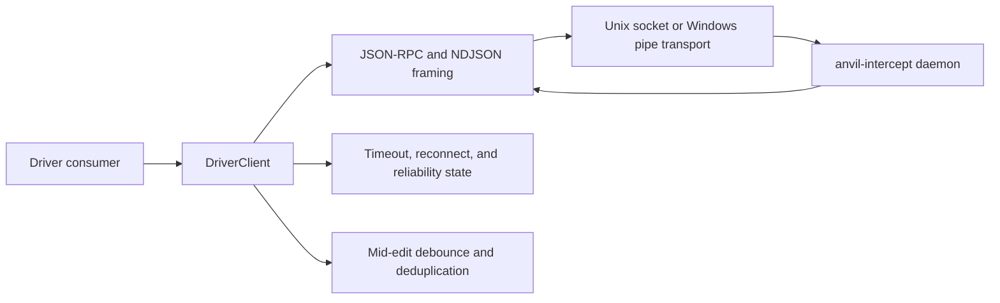

# anvil driver client architecture

| Type         | Authority | Owner | Status | Freshness                                                                                        |
| ------------ | --------- | ----- | ------ | ------------------------------------------------------------------------------------------------ |
| Architecture | Derived   | DRVR  | Live   | Last reviewed 2026-08-20 against `packages/anvil-driver-client/src` and its tests at `f0f834b39` |

| Upstream                                                             | Downstream                                                          |
| -------------------------------------------------------------------- | ------------------------------------------------------------------- |
| `packages/anvil-driver-client/src`, Rust protocol types, and ADR-030 | TypeScript driver consumers and the central cross-system driver map |

## Scope and boundaries

This document owns the TypeScript client's internal flow. The Rust types in
`crates/anvil-intercept-proto/src` own the daemon wire vocabulary. The daemon
owns admission, server-side peer checks, capability decisions, fencing, and
validation. The central
[driver framework map](../../docs/architecture/driver-framework-as-built.md)
owns only the relationship between those components.

Source: `src/client/driver-client.ts`, `src/framing/`, `src/transport/`,
`src/reliability/budget.ts`, and `src/midedit/`.

## Request and notification flow

`DriverClient.connect()` opens the selected transport and is idempotent once
connected. `request()` allocates a string request id, installs a timeout, writes
one JSON-RPC request as an NDJSON line, and resolves or rejects the matching
pending entry when a response arrives. `notify()` writes without creating a
pending response. `subscribe()` dispatches method-specific daemon notifications;
consumer handler failures are surfaced as client `error` events instead of
tearing down the transport.

The client has separate default timeouts in `src/client/types.ts`: read-only
requests use 10 seconds and enforcement acknowledgements use 500 milliseconds. A
per-call override wins. Timeout, closed-client, transport-drop, wrong-owner,
invalid-request, daemon-error, unavailable, and quarantine outcomes use the
stable `DriverClientError` shape from `src/errors.ts`; consumers must branch on
`code` and `retriable`, not message text.

## Transport and trust

`src/transport/path.ts` resolves the Unix default from `XDG_RUNTIME_DIR`, then
`HOME`; Windows requires a pipe name because pure Node cannot derive the
daemon's SID-suffixed name. An explicit socket or pipe option overrides the
default.

Before a Unix connection, `src/transport/unix.ts` refuses a symlinked or
non-directory parent, a parent not owned by the current uid with mode `0700`,
and a socket that is symlinked, not a socket, not owner-owned, or not mode
`0600`. This is a path check, not a connected-peer credential check; Node does
not expose a stable `SO_PEERCRED` API.

`src/transport/windows.ts` requires the `anvil-intercept-<sid>` pipe namespace
and compares the suffix with the current user's canonical SID. It does not
inspect the pipe DACL; the Rust server-side Win32 listener owns that check. A
failure on either platform is non-retriable `anvil-daemon-wrong-owner`.

## Reconnection and reliability

A peer or transport drop rejects every pending request as retriable
`anvil-daemon-transport-drop`, then schedules exponential backoff with jitter.
The defaults in `src/client/types.ts` begin at 200 ms, cap at 30 seconds, and
stop after five attempts. Explicit close cancels pending work, timers,
subscribers, and listeners and permanently closes that client instance.

`src/reliability/budget.ts` counts failures only after a daemon-minted
`originating_driver_id` is known. It never keys quarantine on self-declared
`driverName`. Five failures in a 60-second window quarantine the identity for
five minutes by default; state survives reconnect because it belongs to the
client instance, but it is not persisted across processes. A successful
round-trip clears that identity's failure window.

## Mirrored contracts

`src/protocol/types.ts`, `src/session/types.ts`, `src/diagnostics/types.ts`, and
`src/protection_claim/types.ts` are TypeScript mirrors for consumer type safety.
Their source comments and contract tests pin serialised names and
forward-compatible cases. When a mirror conflicts with
`crates/anvil-intercept-proto` or `crates/anvil-kernel-types`, the Rust type
wins.

## Failure and fallback

- There is no implicit connect-on-first-request.
- Framing rejects invalid UTF-8/JSON and over-budget lines without passing a
  partial envelope to consumers.
- Unmapped daemon error codes default to non-retriable.
- Notification-handler failures do not close the client.
- Mid-edit validation returns its result envelope rather than turning daemon
  failures into an untyped throw.
- Capability negotiation and server admission are not client fallbacks; they
  remain daemon/protocol responsibilities.

## Source references

- `packages/anvil-driver-client/src/client/driver-client.ts`
- `packages/anvil-driver-client/src/client/types.ts`
- `packages/anvil-driver-client/src/errors.ts`
- `packages/anvil-driver-client/src/framing/`
- `packages/anvil-driver-client/src/transport/`
- `packages/anvil-driver-client/src/reliability/budget.ts`
- `packages/anvil-driver-client/src/midedit/`
- `packages/anvil-driver-client/src/protocol/types.ts`
- `packages/anvil-driver-client/src/session/types.ts`
- `packages/anvil-driver-client/src/diagnostics/types.ts`
- `packages/anvil-driver-client/src/protection_claim/types.ts`

## Related authorities

- [Component orientation](README.md)
- [Cross-system driver framework](../../docs/architecture/driver-framework-as-built.md)
- [Rust protocol orientation](../../crates/anvil-intercept-proto/README.md)
- [Intercept architecture](../../crates/anvil-intercept/ARCHITECTURE.md)
- [Editor-driver protocol design](../../plans/specs/2026-05-06-editor-driver-protocol.md)
