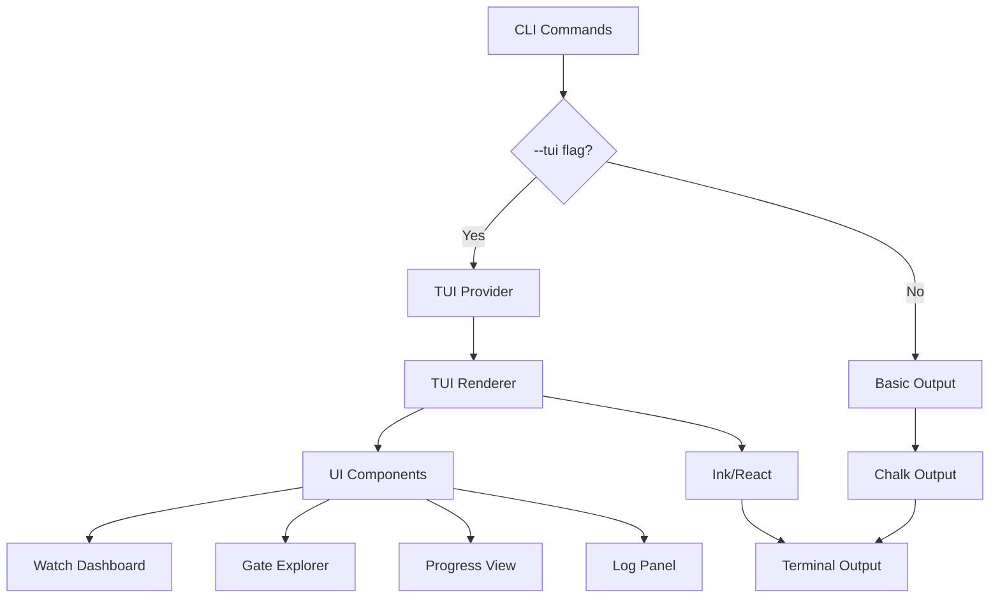

<!-- APS: See https://github.com/eddacraft/anvil-plan-spec for format reference -->

# Terminal User Interface (TUI)

## Overview

Enhance Anvil's developer experience with an interactive Terminal User Interface
(TUI) that provides real-time feedback, interactive exploration, and visual
clarity during validation and gate execution. This replaces sequential text
output with a rich, interactive experience whilst maintaining CLI compatibility.

**Current State:** Anvil CLI uses basic terminal output:

- `chalk` for colours
- `ora` for spinners
- `inquirer` for prompts
- Sequential text output with limited interactivity

**Target State:** Anvil TUI provides:

- Real-time dashboard for watch mode
- Interactive gate result exploration
- Visual progress tracking
- Keyboard-driven navigation
- Split-pane layouts for parallel information
- Graceful fallback to basic CLI output

## Problem Statement

**Developer Pain Points:**

1. **Limited visibility during long operations** — Watch mode and gate execution
   provide sequential output that scrolls away, losing context
2. **No interactive exploration** — Developers can't drill into failures or
   filter results without re-running commands
3. **Poor progress indication** — Spinners and text don't effectively
   communicate parallel check execution
4. **Difficult pattern recognition** — Repeated failures across file saves are
   hard to spot in scrolling text
5. **No at-a-glance status** — Developers must read through all output to
   understand overall state

**Success Criteria:**

- [ ] Watch mode shows live dashboard with current status, history, and stats
- [ ] Gate results explorable via keyboard navigation (expand checks, view
      details)
- [ ] Visual progress bars for parallel check execution
- [ ] Graceful degradation to basic CLI when TTY not available
- [ ] < 100ms UI update latency during watch mode
- [ ] Zero disruption to existing CLI commands (opt-in via flags)

## Solution

### Architecture



### Component Library

**Technology:** [Ink](https://github.com/vadimdemedes/ink) — React for CLI,
enables composable UI components with familiar React patterns.

**Decision:** Ink chosen over OpenTUI because OpenTUI requires Bun runtime
(`bun-ffi-structs` for Zig FFI), while Anvil's constraint is Node.js 20+. Ink is
production-ready, Node.js native, and has everything needed for onboarding TUI.

**Core Components:**

1. **WatchDashboard** — Real-time overview for watch mode
   - Current status (idle/running/passing/failing)
   - File change queue
   - Recent results history (last 10 runs)
   - Summary statistics (pass rate, avg duration)
   - Keyboard shortcuts panel

2. **GateExplorer** — Interactive gate results viewer
   - Collapsible check list
   - Detail panel for selected check
   - Error/warning navigation (n/p for next/previous)
   - Filter controls (failed only, by check type)
   - Export to JSON/HTML options

3. **ProgressView** — Parallel check execution visualisation
   - Progress bars for each check
   - Estimated time remaining
   - Cache hit indicators
   - Real-time status updates

4. **LogPanel** — Scrollable log output
   - Filtered by log level (error/warn/info/debug)
   - Search functionality
   - Copy-to-clipboard support

### CLI Integration

**Opt-in via flags:**

```bash
# Watch mode with TUI (default when TTY available)
anvil watch --tui

# Gate with interactive explorer
anvil gate plan.aps.md --tui

# Force basic output (CI/non-interactive)
anvil gate plan.aps.md --no-tui
```

**Auto-detection logic:**

```typescript
function shouldUseTUI(options: CommandOptions): boolean {
  // Explicit flag takes precedence
  if (options.tui !== undefined) return options.tui;
  if (options.noTui) return false;

  // Auto-detect TTY and environment
  return (
    process.stdout.isTTY &&
    !process.env.CI &&
    !options.json && // JSON output incompatible with TUI
    !options.quiet
  );
}
```

### Fallback Strategy

**Graceful degradation ensures compatibility:**

1. **No TTY** → Basic chalk output (unchanged behaviour)
2. **CI environment** → Basic output with JSON option
3. **Pipe to file** → Basic output without colours
4. **`--no-tui` flag** → Force basic output
5. **Terminal too small** → Warn and switch to basic output

## Implementation

### Phase 1: Foundation (Sprint 1)

**Goals:**

- Set up Ink infrastructure
- Implement basic UI components
- Add TUI detection logic

**Tasks:**

- [ ] Install Ink and dependencies (`ink`, `ink-text-input`, `ink-spinner`)
- [ ] Create TUI module under `apps/anvil-cli`
- [ ] Implement `shouldUseTUI()` detection function
- [ ] Build base TUI component wrapper
- [ ] Create simple progress bar component
- [ ] Add unit tests for components

**Files:**

```
apps/anvil-cli/
└── src/
    └── tui/
        ├── index.ts
        ├── components/
        │   ├── ProgressBar.tsx
        │   ├── StatusBadge.tsx
        │   └── KeyboardShortcuts.tsx
        ├── utils/
        │   ├── tty-detection.ts
        │   └── terminal-size.ts
        └── __tests__/
            └── components.test.tsx
```

### Phase 2: Watch Dashboard (Sprint 2)

**Goals:**

- Implement real-time watch mode dashboard
- Add history tracking and statistics

**Tasks:**

- [ ] Build `WatchDashboard` component
- [ ] Implement file change queue display
- [ ] Add results history panel (last 10 runs)
- [ ] Create summary statistics widget
- [ ] Wire up watch mode to use TUI when enabled
- [ ] Add keyboard shortcuts (q=quit, r=run now, c=clear history)

**Features:**

```
┌─ Anvil Watch Mode ────────────────────────────────────────┐
│ Status: ✓ Passing                              [q] Quit    │
│                                                 [r] Run Now │
├─ Current Run ────────────────────────────────────────────┤
│ ⣾ Running check: coverage                                 │
│ • Completed: lint, test, secrets (3/4)                    │
│ • Files: src/schema.ts, src/validator.ts (2 files)       │
├─ History ────────────────────────────────────────────────┤
│ ✓ 13:45:23  src/schema.ts           320ms  Passed         │
│ ✗ 13:44:18  src/validator.ts        450ms  Failed (lint)  │
│ ✓ 13:43:45  src/index.ts            280ms  Passed         │
├─ Statistics ─────────────────────────────────────────────┤
│ Pass Rate: 87% (13/15)    Avg Duration: 340ms            │
└───────────────────────────────────────────────────────────┘
```

### Phase 3: Gate Explorer (Sprint 3)

**Goals:**

- Interactive gate result exploration
- Navigate failures with keyboard

**Tasks:**

- [ ] Build `GateExplorer` component
- [ ] Implement collapsible check tree
- [ ] Add detail panel for selected check
- [ ] Create failure navigation (next/previous)
- [ ] Add filter controls
- [ ] Wire up gate command to use TUI
- [ ] Add export functionality (JSON/HTML)

**Features:**

```
┌─ Gate Results: plan-123 ──────────────────────────────────┐
│ Overall: ✗ FAILED  Score: 75%                             │
│                                                            │
│ Checks:                             [↑↓] Navigate  [Enter]│
│ ✓ lint             100%  Passed                           │
│ ✓ test              95%  Passed                           │
│ ▼ coverage          60%  Failed                           │
│   ├─ Total coverage: 60% (threshold: 80%)                 │
│   ├─ Uncovered files: 5                                   │
│   └─ Missing: src/new-feature.ts (0%)                     │
│ ✓ secrets          100%  Passed                           │
│ ⊘ dependency         —    Skipped (--profile=dev)         │
│                                                            │
│ [f] Filter failed  [e] Export JSON  [q] Quit              │
└────────────────────────────────────────────────────────────┘
```

### Phase 4: Progress Visualisation (Sprint 4)

**Goals:**

- Real-time progress for parallel check execution
- Show cache hits and timing information

**Tasks:**

- [ ] Build `ProgressView` component
- [ ] Implement parallel progress bars
- [ ] Add ETA calculation
- [ ] Show cache hit indicators
- [ ] Wire up gate runner progress events
- [ ] Add verbose mode with check details

**Features:**

```
┌─ Running Gate Checks ──────────────────────────────────────┐
│                                                             │
│ lint        ████████████████████████████  100%  ✓ 1.2s    │
│ test        ████████████████░░░░░░░░░░░░   68%  ⣾ 3.4s    │
│ coverage    ████░░░░░░░░░░░░░░░░░░░░░░░░   15%  ⣾ 8.1s    │
│ secrets     ██████████████████████████░░   92%  ⣾ 0.8s    │
│ dependency  [Cached]                       —     ⚡ 0.0s    │
│                                                             │
│ Overall: 55% complete • ETA: 6s                            │
└─────────────────────────────────────────────────────────────┘
```

### Phase 5: Polish & Refinement (Sprint 5)

**Goals:**

- Add log panel and advanced features
- Optimise performance
- Complete documentation

**Tasks:**

- [ ] Build `LogPanel` component with search
- [ ] Add colour scheme configuration
- [ ] Implement copy-to-clipboard support
- [ ] Optimise render performance (<100ms updates)
- [ ] Add integration tests
- [ ] Write user documentation
- [ ] Create demo GIFs/videos

## Technical Decisions

### D-001: Ink over Blessed

**Decision:** Use [Ink](https://github.com/vadimdemedes/ink) instead of
[Blessed](https://github.com/chjj/blessed).

**Rationale:**

- React-based API familiar to frontend developers
- Better TypeScript support
- Active maintenance and modern architecture
- Composable components via JSX
- Easier testing (React Testing Library compatible)

**Trade-offs:**

- Blessed has more built-in widgets (we'll build what we need)
- Ink requires React knowledge (acceptable — common skill)

### D-002: Opt-in via Auto-detection

**Decision:** Enable TUI by default when TTY available, allow `--no-tui` to
disable.

**Rationale:**

- Best experience by default for interactive use
- Graceful fallback for CI/non-interactive
- Explicit flag for users who prefer basic output
- No breaking changes to existing scripts

**Trade-offs:**

- Could surprise users expecting simple output
- Mitigated by clear docs and obvious keyboard shortcuts

### D-003: Co-locate with CLI

**Decision:** Implement TUI inside `apps/anvil-cli` to avoid a separate package.

**Rationale:**

- Keeps TUI behaviour close to CLI command handling
- Avoids additional workspace package overhead
- Simplifies dependency management for Ink

**Trade-offs:**

- Larger CLI package footprint
- Less isolation for potential future web UI reuse

## Dependencies

**New Dependencies:**

```json
{
  "@eddacraft/anvil-cli": {
    "dependencies": {
      "ink": "^5.0.1",
      "ink-spinner": "^5.0.0",
      "ink-text-input": "^6.0.0",
      "react": "^19.0.0"
    }
  }
}
```

**CLI Integration:**

TUI components live under `apps/anvil-cli/src/tui`, so no cross-package
dependency is required.

## Testing Strategy

### Unit Tests

- Component rendering (React Testing Library)
- TUI detection logic
- Keyboard input handlers
- State management

### Integration Tests

- Watch mode with TUI enabled
- Gate explorer navigation
- Fallback to basic output

### Manual Testing

- Various terminal emulators (iTerm2, Terminal.app, Windows Terminal)
- Different terminal sizes
- CI environments

## Documentation

### User Documentation

- [ ] `docs/TUI_GUIDE.md` — Using interactive mode
- [ ] Update `docs/USER_GUIDE.md` with TUI sections
- [ ] Add keyboard shortcuts reference
- [ ] Create demo GIFs for README

### Developer Documentation

- [ ] `apps/anvil-cli/src/tui/README.md` — Component API documentation
- [ ] Architecture diagrams
- [ ] Contributing guide for new components

## Risks & Mitigations

| Risk                             | Impact | Likelihood | Mitigation                                  |
| -------------------------------- | ------ | ---------- | ------------------------------------------- |
| Ink adds significant bundle size | medium | high       | Make TUI optional, lazy-load when needed    |
| Performance issues in watch mode | high   | medium     | Throttle updates, optimise renders (<100ms) |
| Terminal compatibility issues    | medium | medium     | Extensive testing, fallback to basic output |
| Breaks existing CI scripts       | high   | low        | Auto-detection, `--no-tui` flag             |
| Learning curve for contributors  | low    | high       | Good docs, React is widely known            |

## Success Metrics

| Metric                          | Target              |
| ------------------------------- | ------------------- |
| Watch mode UI update latency    | < 100ms             |
| Developer satisfaction (survey) | > 8/10              |
| Adoption rate (interactive use) | > 60% of developers |
| Bug reports (terminal issues)   | < 5 per sprint      |
| Fallback reliability            | 100% (never breaks) |

## Open Questions

- [ ] Should we support mouse input? (Leaning: No — keyboard-first)
- [ ] Custom colour schemes via config? (Leaning: Yes — `.anvilrc`)
- [ ] Web-based equivalent for CI dashboards? (Future: Act 2)
- [ ] Accessibility considerations? (Screen readers won't work — need basic
      output)
- [ ] Should failed checks auto-expand in GateExplorer? (Leaning: Yes)

## References

- [Ink Documentation](https://github.com/vadimdemedes/ink)
- [React Testing Library for Ink](https://github.com/vadimdemedes/ink-testing-library)
- [chalk-animation](https://github.com/bokub/chalk-animation) — For enhanced
  visuals
- Similar projects: [k9s](https://k9scli.io/),
  [lazygit](https://github.com/jesseduffield/lazygit)

---

**Status:** Draft  
**Priority:** Medium  
**Dependencies:** None (independent module)  
**Target Milestone:** v0.5.0 — IDE & Experience Enhancement
