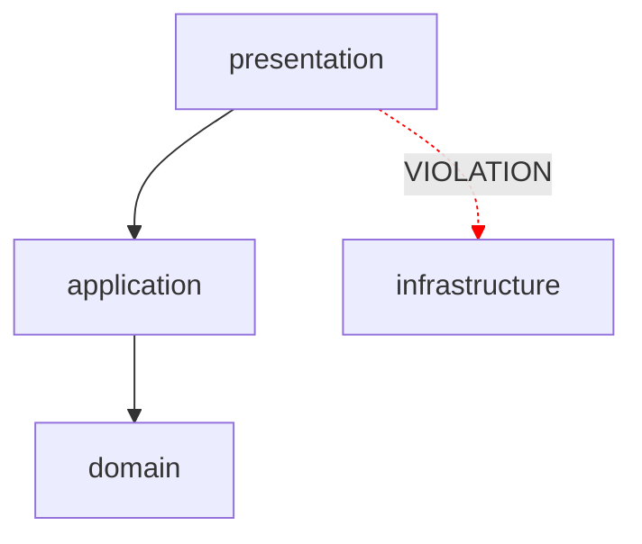

# Beautiful-Mermaid TUI Diagram Integration

## Summary

Investigation into replacing hand-built ASCII diagrams with
[beautiful-mermaid](https://github.com/lukilabs/beautiful-mermaid) to render
richer architecture visualisations directly in the terminal.

## Why

The current TUI diagrams are static ASCII art built with Unicode box-drawing
characters. They show layer names and file counts but cannot express
**dependency arrows**, **violations**, or **architectural flows**. Mermaid
definitions already appear throughout our planning docs — using
`renderMermaidAscii()` lets us render those same definitions in the terminal.

## Current State

### Diagram rendering today

| Location | What it renders | How |
|---|---|---|
| `architecture-service.ts:255-303` `formatLayerDiagram()` | Layer stack with file counts | Hand-built Unicode box (┌─┐│├┤└┘) |
| `HooksStep.tsx:5-13` | CI protection layers | Static `string[]` constant |
| `TemplateStep.tsx:63-70` | Template layer lists | Inline text (`layers.join(', ')`) |
| `architecture.ts:91-103` `printTemplatePreview()` | Template preview | `info.layers.join(' → ')` with chalk |
| `init.ts:123-127` | Detected layers | `formatLayerDiagram()` + `chalk.dim()` |

### Limitations

- No dependency arrows between layers
- No violation highlighting
- No flow direction (top-down, left-right)
- Every diagram is bespoke code — no shared diagram primitive
- Cannot show the architecture graph that `anvil architecture visualise` plans to expose

## Proposed Integration

### Library: beautiful-mermaid

```
pnpm add beautiful-mermaid --filter apps/anvil-cli
```

Key API for TUI use:

```typescript
import { renderMermaidAscii } from 'beautiful-mermaid';

// Synchronous — perfect for Ink render cycles
const ascii = renderMermaidAscii(`
  graph TD
    presentation --> application
    application --> domain
    application --> infrastructure
    infrastructure --> domain
    domain --> shared
`);
```

- **`renderMermaidAscii(text, options?)`** — synchronous, returns string
- **`renderMermaid(text, options?)`** — async, returns SVG (useful for future web dashboard)
- Zero DOM dependencies, works in Node.js
- 15 built-in themes including terminal-friendly ones (Tokyo Night, Nord, Catppuccin)

### Integration points

#### 1. New shared TUI component: `<MermaidDiagram />`

```
apps/anvil-cli/src/tui/components/MermaidDiagram.tsx
```

```tsx
import React from 'react';
import { Box, Text } from 'ink';
import { renderMermaidAscii } from 'beautiful-mermaid';
import { theme } from '../utils/theme.js';

interface MermaidDiagramProps {
  definition: string;
  colour?: string;
}

export function MermaidDiagram({ definition, colour }: React.PropsWithChildren<MermaidDiagramProps>): React.ReactElement {
  const ascii = renderMermaidAscii(definition);
  return (
    <Box flexDirection="column">
      {ascii.split('\n').map((line, i) => (
        <Text key={i} color={colour ?? theme.colours.ash}>{line}</Text>
      ))}
    </Box>
  );
}
```

#### 2. Replace `formatLayerDiagram()` output

Instead of returning hand-built box strings, generate a Mermaid flowchart
definition from the `Layers` data and render it with `renderMermaidAscii()`.

```typescript
export function layersToMermaid(layers: Layers): string {
  const layerOrder = ['presentation', 'application', 'domain', 'infrastructure', 'shared'];
  const ordered = layerOrder.filter(l => layers[l]);
  const unordered = Object.keys(layers).filter(l => !layerOrder.includes(l));
  const all = [...ordered, ...unordered];

  const lines = ['graph TD'];
  for (const name of all) {
    const layer = layers[name];
    for (const dep of layer.depends_on) {
      if (layers[dep]) {
        lines.push(`  ${name} --> ${dep}`);
      }
    }
  }
  return lines.join('\n');
}
```

This gives us **dependency arrows for free** — something the current box
diagram cannot show.

#### 3. Architecture template previews

Replace `info.layers.join(' → ')` in `printTemplatePreview()` and the
`TemplateStep` tutorial with actual flowcharts showing the dependency
direction for each template.

#### 4. `anvil architecture visualise` command

Implement the documented-but-unbuilt command:

```bash
anvil architecture visualise              # ASCII in terminal (default)
anvil architecture visualise --format svg # SVG file output
anvil architecture visualise --format mermaid  # Raw mermaid definition
```

- Default: `renderMermaidAscii()` piped through Ink
- `--format svg`: `renderMermaid()` → write `.svg` file
- `--format mermaid`: print raw definition (for pasting into docs)

#### 5. Violation overlay

With Mermaid we can style edges to show violations:



This would let `anvil architecture validate` show a visual diff of what's
allowed vs. what's violated.

## Diagram types we could render

| Diagram | Mermaid type | Use case |
|---|---|---|
| Layer dependency graph | `graph TD` | `anvil architecture visualise`, init, tutorial |
| CI protection layers | `graph TD` | Tutorial HooksStep |
| Compilation pipeline | `graph LR` | Tutorial CompileStep (`yaml → json → rego`) |
| Template architecture | `graph TD` | Template selection / preview |
| Boundary violations | `graph TD` + red edges | `anvil architecture validate` |
| Module dependency graph | `graph TD` | Future: per-module dependency view |

## Migration plan

### Phase 1 — Add the component (non-breaking)

1. `npm install beautiful-mermaid` in `apps/anvil-cli`
2. Create `<MermaidDiagram />` component
3. Add `layersToMermaid()` helper to architecture-service
4. Write tests for both

### Phase 2 — Replace existing diagrams

5. Swap `HooksStep` static diagram → `<MermaidDiagram />`
6. Swap `TemplateStep` layer lists → `<MermaidDiagram />`
7. Swap `formatLayerDiagram()` usage in `init.ts` → mermaid
8. Swap `printTemplatePreview()` in `architecture.ts` → mermaid
9. Update existing tests

### Phase 3 — New capabilities

10. Implement `anvil architecture visualise` command
11. Add violation overlay rendering
12. Add `--format` flag (ascii / svg / mermaid)
13. Theme integration (map anvil theme colours to mermaid theme)

## Considerations

- **Terminal width**: `renderMermaidAscii` output width should respect
  `getTerminalSize().columns`. Need to verify the library handles this or
  if we need to pass width options.
- **Colour mapping**: Map anvil theme (`theme.colours.ember`, `.ash`, etc.)
  to beautiful-mermaid's theme system for visual consistency.
- **Fallback**: If rendering fails (malformed definition), fall back to the
  existing ASCII box diagram rather than crashing.
- **Bundle size**: Verify the library's size impact on the CLI package.
  Since it has zero DOM deps this should be minimal.
- **Dual use**: The same mermaid definitions could feed the planned web
  dashboard (using `renderMermaid()` for SVG) — single source of truth.

## Files that would change

```
apps/anvil-cli/package.json                                    # add dependency
apps/anvil-cli/src/tui/components/MermaidDiagram.tsx           # new component
apps/anvil-cli/src/tui/components/index.ts                     # export it
apps/anvil-cli/src/services/architecture-service.ts            # add layersToMermaid()
apps/anvil-cli/src/commands/init.ts                            # use mermaid rendering
apps/anvil-cli/src/commands/architecture.ts                    # template previews + visualise cmd
apps/anvil-cli/src/tui/commands/tutorial/.../HooksStep.tsx     # mermaid diagram
apps/anvil-cli/src/tui/commands/tutorial/.../TemplateStep.tsx  # mermaid diagram
apps/anvil-cli/src/tui/commands/tutorial/.../CompileStep.tsx   # mermaid diagram
```
