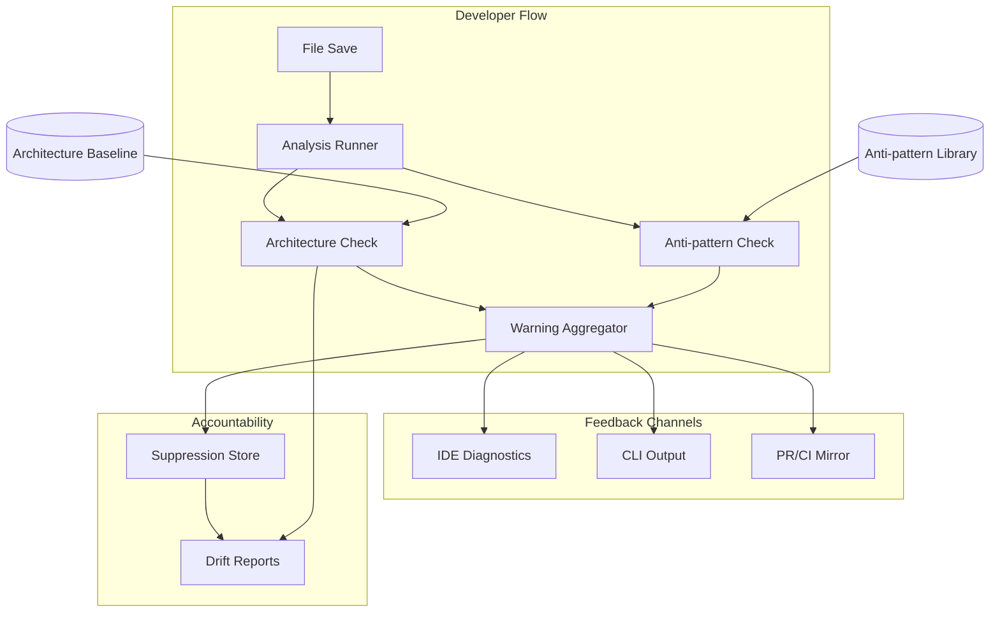

<!-- APS: See https://github.com/EddaCraft/anvil-plan-spec for format reference -->
<!-- This document is non-executable. -->

# Anvil v1 — Save-time Trust

## Overview

Anvil v1 makes AI-generated code safe to merge by catching architecture boundary
violations and AI escape-hatch anti-patterns at file-save time. Developers get
actionable warnings before code leaves the file, with human-owned exceptions for
intentional deviations.

**Why this matters:** AI coding tools are accelerating development, but they
don't understand your architecture. They produce code that compiles and passes
tests, yet drifts from intended patterns. By the time drift is noticed in
review, it's already merged or too expensive to fix. Anvil catches it at the
moment of creation — when fixing is cheap.

**Product thesis:** Anvil improves trust in AI-generated code so more of it
reaches production faster, while architecture drift slows or reverses over time.

**Primary beneficiary:** Individual developers — they get to use AI safely at
the pace leadership expects.

## Problem & Success Criteria

**Problem:** The most damaging recurring failure is second-wave feature work
drifting from intended patterns because engineers:

- don't know which patterns apply
- don't read ADRs or architecture diagrams
- don't recognise when their change crosses a boundary

The most reliable early signal: a **new dependency edge** where a function or
class reaches across architectural contexts.

**Success Criteria:**

- [ ] 50%+ of developers run Anvil on every save (adoption) — post-release
- [ ] Time-to-merge for AI-assisted PRs does not increase (throughput) —
      post-release
- [ ] New cross-boundary edges per sprint decreases by 30% within 8 weeks
      (drift) — post-release
- [x] Save-time feedback latency < 2 seconds cached, < 5 seconds cold (speed)
- [ ] < 10% of warnings are suppressed without resolution (signal quality) —
      post-release

**Implementation Progress (v1.0):**

Core Engine:

- [x] Core analysis engine (`anvil check <files>`)
- [x] Architecture boundary detection with baseline
- [x] Anti-pattern detection (7 patterns)
- [x] Suppression system with time-boxing
- [x] CI/CD integration (GitHub Action)
- [x] Git-aware file detection (`anvil check --changed`)
- [x] Source file watch mode (`anvil watch --source`)

Onboarding Experience:

- [x] TUI foundation (Ink components)
- [ ] Visual `anvil init` wizard
- [ ] `anvil status` quick health check
- [ ] `anvil doctor` setup diagnostics
- [ ] First-run welcome experience

Documentation:

- [ ] Quick Start Guide update
- [ ] Demo showing Anvil catching real issues
- [ ] Error message review

## Release Plan

### v1.0 — Save-time Trust + Smooth Onboarding

**Philosophy:** A powerful engine is worthless if no one uses it. v1.0 must
deliver both the core value AND a friction-free first experience.

#### Core Engine (Complete ✅)

| Feature             | Description                                    | Status   |
| ------------------- | ---------------------------------------------- | -------- |
| Analysis Engine     | `anvil check <files>` with caching + parallel  | Complete |
| Architecture Safety | Baseline inference, new-edge detection         | Complete |
| Anti-patterns       | 7 high-confidence patterns                     | Complete |
| Suppressions        | Time-boxed with mandatory explanations         | Complete |
| Git Integration     | `--changed`, `--staged`, `--since <ref>`       | Complete |
| Watch Mode          | `anvil watch --source` for real-time feedback  | Complete |
| CI/CD               | GitHub Action with PR comments + status checks | Complete |

#### Onboarding Experience (In Progress 🔄)

| Feature           | Description                                     | Status   |
| ----------------- | ----------------------------------------------- | -------- |
| TUI Foundation    | Ink setup + base components (TUI-001)           | Complete |
| Init Wizard       | Visual `anvil init` with guided flow (TUI-002)  | Complete |
| Status Dashboard  | Quick health check: `anvil status` (TUI-003)    | Planned  |
| Doctor Command    | Diagnose setup issues: `anvil doctor` (TUI-004) | Planned  |
| First-run Welcome | Show value immediately on first run (TUI-005)   | Planned  |

**Why onboarding is v1:** Without smooth onboarding, users won't adopt the tool
regardless of how good the engine is. First impressions matter.

#### Documentation & Polish (In Progress 🔄)

| Feature           | Description                     | Status       |
| ----------------- | ------------------------------- | ------------ |
| Quick Start Guide | 5-minute path to first value    | Needs update |
| User Guide        | Complete command reference      | Needs update |
| Demo/Tutorial     | Show Anvil catching real issues | Needed       |
| Error Messages    | Actionable, not cryptic         | Review       |

### v1.1 — Drift Visibility

| Feature         | Description                                    | Status |
| --------------- | ---------------------------------------------- | ------ |
| Drift Snapshots | `anvil drift snapshot` — capture current state | Draft  |
| Drift Compare   | `anvil drift compare` — show changes over time | Draft  |
| Trend Reports   | Visualise suppression and violation trends     | Draft  |

### v1.2 — Advanced Experience

| Feature           | Description                                   | Status |
| ----------------- | --------------------------------------------- | ------ |
| VS Code Extension | Inline diagnostics, problem panel integration | Draft  |
| TUI Operational   | Watch dashboard, gate explorer (TUI-009–012)  | Draft  |
| Template Library  | Pre-built architecture patterns (TUI-006)     | Draft  |
| Tutorial Mode     | Interactive learning experience (TUI-007)     | Draft  |

### v2.0 — AI Tool Integration

| Feature           | Description                               | Status  |
| ----------------- | ----------------------------------------- | ------- |
| Command Safety    | Validate AI tool commands (CMDSAF)        | Ready   |
| MCP Server        | Real-time validation during AI generation | Planned |
| Constraint Export | Export rules for AI tools to consume      | Planned |

### What's NOT in v1

To ship fast and focused, these are explicitly deferred:

- **VS Code extension** — CLI-first; IDE comes in v1.2
- **Drift reports** — Core value doesn't require trend analysis
- **Command safety** — Important but not blocking for initial adoption
- **Plan/APS execution** — Planless-first; APS is internal
- **Multi-language support** — TypeScript/JavaScript only for v1
- **Team dashboards** — Individual developer focus first
- **Auto-fix** — Warnings only; don't be too clever

## Constraints

- Must deliver value **without requiring plans/APS** as a prerequisite
  (planless-first)
- Must not hard-block by default — warnings, not errors
- Must run on Node.js 20+
- Must integrate with existing ESLint/Prettier tooling, not replace it
- Must acknowledge legacy drift without overwhelming developers with noise

## System Map

## Milestones

### M1: Core Analysis Engine ✅

- **Status:** Complete
- **Includes:** save-time-trust, architecture-safety
- **Delivered:** `anvil check <file>` returns warnings with explanations

### M2: Anti-pattern Detection ✅

- **Status:** Complete
- **Includes:** antipattern-library
- **Delivered:** ESLint-disable, `any`, `@ts-ignore` detected in new code

### M3: Developer Ergonomics ✅

- **Status:** Complete (suppressions); Draft (drift-reporting)
- **Includes:** suppressions, drift-reporting
- **Delivered:** Developers can suppress with accountability
- **Remaining:** Drift trend reports (v1.1)

### M4: Integration Points (Partial)

- **Status:** CI complete; IDE draft
- **Includes:** ci-integration ✅, ide-integration (v1.2)
- **Delivered:** PRs show warning summaries via GitHub Action
- **Remaining:** VS Code extension (v1.2)

## Modules

| Module                                                                  | Scope  | Status      | Release | Dependencies                                           |
| ----------------------------------------------------------------------- | ------ | ----------- | ------- | ------------------------------------------------------ |
| [save-time-trust](./modules/save-time-trust.aps.md)                     | CORE   | Complete    | v1.0    | —                                                      |
| [architecture-safety](./modules/architecture-safety.aps.md)             | ARCH   | Complete    | v1.0    | save-time-trust                                        |
| [antipattern-library](./modules/antipattern-library.aps.md)             | ANTI   | Complete    | v1.0    | save-time-trust                                        |
| [suppressions](./modules/suppressions.aps.md)                           | SUPP   | Complete    | v1.0    | architecture-safety, antipattern-library               |
| [ci-integration](./modules/ci-integration.aps.md)                       | CI     | Complete    | v1.0    | save-time-trust                                        |
| [tui](./modules/tui.aps.md)                                             | TUI    | In Progress | v1.0    | — (Phase 1: onboarding only)                           |
| [drift-reporting](./modules/drift-reporting.aps.md)                     | DRIFT  | Draft       | v1.1    | architecture-safety, antipattern-library, suppressions |
| [ide-integration](./modules/ide-integration.aps.md)                     | IDE    | Draft       | v1.2    | save-time-trust                                        |
| [command-safety-validation](./modules/command-safety-validation.aps.md) | CMDSAF | Ready       | v2.0    | —                                                      |

### Task Status — v1.0 (Core Engine)

| Task     | Module          | Description                      | Status   |
| -------- | --------------- | -------------------------------- | -------- |
| CORE-001 | save-time-trust | Warning schema definition        | Complete |
| CORE-002 | save-time-trust | Check runner refactor            | Complete |
| CORE-003 | save-time-trust | CLI check command                | Complete |
| CORE-004 | save-time-trust | Git-aware changed file detection | Complete |
| CORE-005 | save-time-trust | Source file watch mode           | Complete |
| ARCH-001 | architecture    | Baseline inference               | Complete |
| ARCH-002 | architecture    | Edge detection                   | Complete |
| ARCH-003 | architecture    | Architecture check integration   | Complete |
| ARCH-004 | architecture    | CLI architecture service         | Complete |
| ANTI-001 | antipattern     | Pattern catalogue definition     | Complete |
| ANTI-002 | antipattern     | Scanner implementation           | Complete |
| ANTI-003 | antipattern     | Antipattern check integration    | Complete |
| ANTI-004 | antipattern     | Allowlist and opt-in support     | Complete |
| SUPP-001 | suppressions    | Suppression parser               | Complete |
| SUPP-002 | suppressions    | Suppression store                | Complete |
| SUPP-003 | suppressions    | Gate runner integration          | Complete |
| CI-001   | ci-integration  | GitHub Action composite          | Complete |
| CI-002   | ci-integration  | Changed files detection          | Complete |
| CI-003   | ci-integration  | PR comments and status checks    | Complete |
| CI-004   | ci-integration  | Documentation and configuration  | Complete |

### Task Status — v1.0 (Onboarding TUI)

| Task    | Module | Description                   | Status   | Priority |
| ------- | ------ | ----------------------------- | -------- | -------- |
| TUI-001 | tui    | Ink foundation and components | Complete | high     |
| TUI-002 | tui    | `anvil init` wizard           | Complete | high     |
| TUI-003 | tui    | `anvil status` dashboard      | Planned  | high     |
| TUI-004 | tui    | `anvil doctor` diagnostics    | Planned  | high     |
| TUI-005 | tui    | First-run welcome experience  | Planned  | high     |
| TUI-008 | tui    | Testing infrastructure        | Complete | medium   |

### Task Status — v1.1 (Drift Reporting)

| Task     | Module | Description               | Status  | Priority |
| -------- | ------ | ------------------------- | ------- | -------- |
| DRIFT-01 | drift  | Snapshot capture command  | Planned | medium   |
| DRIFT-02 | drift  | Snapshot comparison       | Planned | medium   |
| DRIFT-03 | drift  | Basic trend visualisation | Planned | low      |

### Task Status — v1.2 (Advanced Experience)

| Task    | Module | Description                       | Status  | Priority |
| ------- | ------ | --------------------------------- | ------- | -------- |
| IDE-001 | ide    | VS Code extension scaffold        | Planned | high     |
| IDE-002 | ide    | Inline diagnostics                | Planned | high     |
| IDE-003 | ide    | Problem panel integration         | Planned | medium   |
| TUI-006 | tui    | Static template library           | Planned | medium   |
| TUI-007 | tui    | Interactive tutorial              | Planned | low      |
| TUI-009 | tui    | `anvil watch` real-time dashboard | Planned | medium   |
| TUI-010 | tui    | `anvil gate` interactive explorer | Planned | medium   |
| TUI-011 | tui    | Parallel progress visualisation   | Planned | low      |
| TUI-012 | tui    | Log panel with filtering          | Planned | low      |

### Task Status — v2.0 (AI Tool Integration)

| Task       | Module         | Description                       | Status  | Priority |
| ---------- | -------------- | --------------------------------- | ------- | -------- |
| CMDSAF-001 | command-safety | Rule system and types             | Planned | high     |
| CMDSAF-002 | command-safety | Command parser with unwrapping    | Planned | high     |
| CMDSAF-003 | command-safety | Rule matcher with specificity     | Planned | high     |
| CMDSAF-004 | command-safety | Default git operation rules       | Planned | medium   |
| CMDSAF-005 | command-safety | Default filesystem rules          | Planned | medium   |
| CMDSAF-006 | command-safety | CommandSafetyCheck implementation | Planned | high     |
| CMDSAF-007 | command-safety | Configuration system              | Planned | medium   |
| CMDSAF-008 | command-safety | Message formatting                | Planned | low      |
| CMDSAF-009 | command-safety | CLI integration and documentation | Planned | high     |
| MCP-001    | mcp-server     | MCP server implementation         | Planned | high     |
| MCP-002    | mcp-server     | Validation as MCP tool            | Planned | high     |
| MCP-003    | mcp-server     | Constraint export for AI tools    | Planned | medium   |

## Risks & Mitigations

| Risk                            | Impact | Likelihood | Mitigation                                               |
| ------------------------------- | ------ | ---------- | -------------------------------------------------------- |
| Warning noise kills adoption    | high   | medium     | High-signal patterns only; warn on NEW edges, not legacy |
| Analysis too slow (> 2s)        | high   | medium     | Incremental analysis; hash-based caching; warm daemon    |
| Developers bypass with `--skip` | medium | medium     | Track skip usage; surface in drift reports               |
| Legacy drift overwhelms users   | medium | high       | Baseline existing violations; focus warnings on new code |
| Over-claiming blast radius      | medium | medium     | Careful language; surface confidence levels              |

## Decisions

- **D-001:** Planless-first posture — deliver value without requiring APS plans
  ([ADR](./decisions/001-planless-first.md))
- **D-002:** Warnings over blocks — inform, don't prevent; let CI enforce if
  desired ([ADR](./decisions/002-warnings-over-blocks.md))
- **D-003:** New edges only — baseline existing architecture; warn only on new
  violations ([ADR](./decisions/003-new-edges-only.md))
- **D-004:** Suppression syntax — `@anvil-ignore <ID>: <reason>` with mandatory
  explanation ([ADR](./decisions/004-suppression-syntax.md))
- **D-005:** Ink over OpenTUI — Node.js compatibility over native performance
  ([ADR](./decisions/005-ink-over-opentui.md))

## Open Questions

### Decided

- [x] VS Code extension vs CLI-only for v1? → **CLI for v1.0**, VS Code in v1.2
- [x] Provenance storage? → **Inline-only** for v1.0 (no central DB)
- [x] Onboarding TUI in v1? → **Yes** — critical for adoption
- [x] Command Safety (CMDSAF) in v1? → **No** — deferred to v2.0

### Open

- [ ] Which entry points define "public API" for boundary detection?
- [ ] Should drift reports include team/author attribution? (Privacy concern)
- [ ] How to handle monorepos with multiple architecture baselines?
- [x] OpenTUI vs Ink for TUI implementation? → **Ink** — OpenTUI requires Bun
      runtime (bun-ffi-structs for Zig FFI); Anvil requires Node.js 20+
- [ ] Should first-run auto-run `anvil check` on sample files for demo?

## Considerations for Future

### Features We Might Be Missing

| Idea                         | Value  | Effort | Notes                                    |
| ---------------------------- | ------ | ------ | ---------------------------------------- |
| `anvil explain <warning-id>` | High   | Low    | Deep-dive into why a warning was raised  |
| `anvil fix <warning-id>`     | High   | Medium | Auto-fix where safe (e.g., add suppress) |
| Config inheritance           | Medium | Medium | Org → repo → folder config cascade       |
| Baseline diff on PR          | High   | Medium | Show architecture changes in PR          |
| Warning severity config      | Medium | Low    | Override severity per-rule               |
| Quiet mode                   | Low    | Low    | `--quiet` flag for minimal output        |
| Metrics export               | Medium | Medium | Prometheus/StatsD for team dashboards    |

### Architecture Scanning Enhancements (Frequently Requested)

**To brainstorm post-TUI implementation.** Current architecture detection is
baseline + new-edge detection. Users frequently ask for more.

| Idea                           | Value | Notes                                          |
| ------------------------------ | ----- | ---------------------------------------------- |
| Architecture pattern templates | High  | Hexagonal, Clean, Layered, DDD presets         |
| Visual dependency graph        | High  | Interactive graph showing module relationships |
| Layer violation detection      | High  | Enforce layer boundaries (UI → Service → Data) |
| Circular dependency detection  | High  | Already have via dependency-cruiser            |
| Public API surface detection   | Med   | Which exports are "public" vs internal         |
| Module coupling metrics        | Med   | Fan-in/fan-out, instability index              |
| Architecture fitness functions | Med   | Custom rules for architecture constraints      |
| Suggested refactorings         | Med   | "This module is doing too much"                |

### Documentation Gaps

| Doc                   | Status  | Notes                               |
| --------------------- | ------- | ----------------------------------- |
| QUICK_START.md        | Stale   | Needs update for `anvil check`      |
| USER_GUIDE.md         | Stale   | Needs full command reference        |
| TROUBLESHOOTING.md    | Partial | Add common onboarding issues        |
| Architecture patterns | Missing | Show hexagonal/clean/layered setups |
| Video/GIF demo        | Missing | Critical for landing page           |
