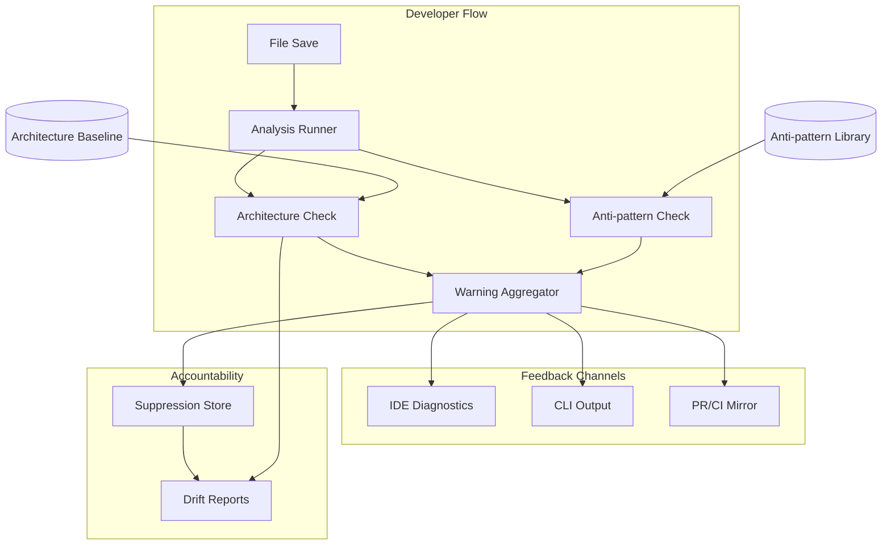

<!-- APS: See https://github.com/eddacraft/anvil-plan-spec for format reference -->
<!-- This document is non-executable. -->

# Anvil — Save-time Trust

> **Latest promoted release: `v0.9.7-beta`** (shipped 2026-08-21 on
> `89a6d2050`) — first-session honesty. Record:
> [`plans/releases/v0.9.7-beta.md`](./releases/v0.9.7-beta.md). Prior:
> `v0.9.6-beta` field fixes + shell command-safety; `v0.9.5-beta` MCP live-heal
> + config. Dashboard remains flag-gated. Per-tag records under
> [`plans/releases/`](./releases/).
>
> The active release window is provisional **`v0.9.8-beta`** (field intake;
> claim not frozen). Highest-value **programme** track remains Graph Trust
> Surfaces Wave 0 (**CGBDG**; **CONF-001** schedule). See
> [`RELEASE-PLAN.md`](../RELEASE-PLAN.md) and NBI.

## Contents

- [Next Best Items](#next-best-items)
- [Release Plan](#release-plan)
- [Graph Substrate](#graph-substrate)
- [Hardening & Maintenance](#hardening--maintenance)
- [Intercept Loop](#intercept-loop)
- [Continuous Improvement](#continuous-improvement)
- [Adoption and Sustained Use](#adoption-and-sustained-use)
- [Rust Engine](#rust-engine)
- [Auth & Access](#auth--access)
- [Tracing Foundation](#tracing-foundation)
- [Usage Analytics](#usage-analytics)
- [Infrastructure as Code](#infrastructure-as-code)
- [Web Dashboard](#web-dashboard)
- [Policy Governance](#policy-governance)
- [Engineering Platform](#engineering-platform)
- [Test Quality](#test-quality)
- [Language & Coverage](#language--coverage)
- [Rust MCP Launch Path](#rust-mcp-launch-path)
- [Graph Trust Surfaces](#graph-trust-surfaces)
- [Settings Truth Surface](#settings-truth-surface)
- [Future](#future)
- [Dormant: Not Yet Scheduled](#dormant-not-yet-scheduled)

Anvil makes AI-generated code safe to merge by catching architecture boundary
violations and AI escape-hatch anti-patterns at file-save time. Developers get
actionable warnings before code leaves the file, with human-owned exceptions for
intentional deviations.

**Why this matters:** AI coding tools are accelerating development, but they
don't understand your architecture. They produce code that compiles and passes
tests, yet drifts from intended patterns. By the time drift is noticed in
review, it's already merged or too expensive to fix. Anvil catches it at the
moment of creation — when fixing is cheap.

**Product thesis:** Anvil improves trust in AI-generated code so more of it
reaches production faster, while architecture drift slows or reverses over time.

**Primary beneficiary:** Individual developers — they get to use AI safely at
the pace leadership expects.

## Problem & Success Criteria

**Problem:** The most damaging recurring failure is second-wave feature work
drifting from intended patterns because engineers:

- don't know which patterns apply
- don't read ADRs or architecture diagrams
- don't recognise when their change crosses a boundary

The most reliable early signal: a **new dependency edge** where a function or
class reaches across architectural contexts.

**Success Criteria:**

- [ ] 50%+ of developers run Anvil on every save (adoption) — post-release
- [ ] Time-to-merge for AI-assisted PRs does not increase (throughput) —
      post-release
- [ ] New cross-boundary edges per sprint decreases by 30% within 8 weeks
      (drift) — post-release
- [x] Save-time feedback latency < 2 seconds cached, < 5 seconds cold (speed)
- [ ] < 10% of warnings are suppressed without resolution (signal quality) —
      post-release

## Next Best Items

**Next Best Item (NBI)** is the running, index-owned selector for the best work
to pick up or schedule next. It does not replace APS module truth: every row
must point at an APS module, work item, release-plan gate, or documented
operational follow-up. Keep the list short, ranked, and current when an item
starts, completes, blocks, or a release priority changes.

Selection rules:

- Prefer `Ready` and unblocked work that advances the current release claim,
  adoption, trust, signal quality, or recurring delivery friction.
- Include `Schedule` rows only when the work is not execution-ready but should be
  shaped next because it is likely to outrank ordinary ready work.
- Do not duplicate module tables here. Link the source of truth and state only
  the next action needed to move the item.
- If this list is stale, derive the next pick from the highest-value `Ready`
  item in the active module tables and refresh this section in the same change.
- Update the table in place. Do **not** append chronological "NBI review note"
  history here — provenance belongs in module closeouts, PRs, and git history.

| Rank | NBI | Mode | Source | Why now | Next action |
| ---- | --- | ---- | ------ | ------- | ----------- |
| 1 | provisional v0.9.8-beta — field intake | Provisional | [RELEASE-PLAN](../RELEASE-PLAN.md) | Post-`v0.9.7-beta` window; claim not frozen. | Field intake → claim lock when operator names theme. |
| 2 | v0.9.7-beta claim set | Released/Shipped | [release record](./releases/v0.9.7-beta.md) | First-session honesty published 2026-08-21. | None — historical. |
| 3 | CGBDG-001..006 — council-gate bridge discovery | Ready | [council-gate-bridge](./modules/council-gate-bridge.aps.md), [Graph Trust Surfaces](./specs/2026-07-28-graph-trust-surfaces.md) | Highest-value programme track beside the cut. Not a release claim. | Execute discovery; prefer thin witness-lines path; CGBDG-006 report + follow-on implement/spec or park. |
| 4 | DOCRB-009 — mandatory diagram review and enforcement | Schedule | [docs-rebaseline](./modules/docs-rebaseline.aps.md), [design](./specs/2026-08-16-docs-rebaseline.md) | DOCRB-008 is Merged via #4068, satisfying the last dependency. Enforcement is the next programme candidate but remains Draft pending a readiness pass. | Run readiness only; do not start or implement DOCRB-009 until it is separately promoted to Ready. |
| 5 | MCPLH-007 — live-heal soak (supervisor residual) | Schedule | [mcp-live-heal](./modules/mcp-live-heal.aps.md), [design](./specs/2026-08-09-mcp-live-heal-without-harness-restart.md) | Residual after `v0.9.5-beta`. Session restart remains honest. | Stays Draft until soak; do not block the next cut. |
| 6 | FEFF-001/-002 — field-effectiveness protocol and source audit | Ready | [field-effectiveness](./modules/field-effectiveness.aps.md) | Closes the gap between shipped usage/synthetic evidence and the four unverified post-release product outcomes. Not a release claim. | Accept the evidence/privacy ADR and prove the retrospective/prospective sources before building collection tooling. |
| 7 | CONF-001 — intent-conformance product ADR | Schedule | [intent-conformance](./modules/intent-conformance.aps.md), [programme §6](./specs/2026-07-28-graph-trust-surfaces.md#6-clearance-checklist-to-unlock-the-rest) | Unlocks Tier-0 claim-vs-delta demos on the live GV2 delta surface. | Author and accept CONF-001 ADR with Tier-0 carve-out (no full ILGOV wait). |
| 8 | SDT-001/-002 — secret-detection fail-closed + calibration corpus | Schedule | [secret-detection-truth](./modules/secret-detection-truth.aps.md) | Beta-reported false-clean on the customer-facing gate; honesty fix is small; corpus decomposes detection report before rules change. Not this cut claim. | Operator promotes when ready. |
| 9 | v0.9.6-beta claim set | Released/Shipped | [release record](./releases/v0.9.6-beta.md) | Field fixes + shell command-safety published 2026-08-18. | None — historical. |
| 10 | GTAO — gate-time catalogue on always-on surfaces | Schedule | [gate-time-always-on](./modules/gate-time-always-on.aps.md) | AST/MCP check are dark on the golden-path daemon; full gate is opt-in. Operator added a bounded Python AST slice 2026-08-22. Not this cut claim. | Land GTAO-001 ADR, GTAO-002 MCP AST merge, GTAO-008 Python dispatch + PY-010. Do not auto-run full `anvil gate` on save; do not convert regex PY-008 to AST. |
## Release Plan

Releases are themed by what they deliver, not sequenced by version number.
Individual packages still use semantic versioning for npm/cargo publishes.

**Shipped release windows** — `v0.5.0-beta` (2026-05-01) through
`v0.9.7-beta` (2026-08-21, first-session honesty) are fully shipped as promoted
headline windows.
Windows through `v0.7.4-beta` have their per-window tables and slice records in
[`completed-index.aps.md`](./completed-index.aps.md#release-plan); later records
live under [`plans/releases/`](./releases/). A later `v0.8.2-beta` hotfix tag
(2026-06-22, Windows daemon-ensure smoke, [#2937](https://github.com/eddacraft/anvil-001/issues/2937))
was cut for testing and is **not** a promoted headline window. The **active**
window is provisional **`v0.9.8-beta`** (field intake after `v0.9.7-beta`),
declared in [`RELEASE-PLAN.md`](../RELEASE-PLAN.md); see also the header above
and the NBI table. Shipped windows through `v0.9.7-beta` are promoted headlines.

**Module tables below** mix archived Complete modules (Graph Substrate GV2/GCTX/…
Released/Shipped via v0.9.0-beta and archived 2026-07-13), work landed around
the `v0.9.1-beta` cut (bare ensure + MCP 2.0; DASH/DASHCORE remain flag-gated
and unclaimed), post-cut work, and longer-horizon work, then the
[Dormant](#dormant-not-yet-scheduled) band. Prefer the NBI table and
`RELEASE-PLAN.md` over scanning historical Complete rows for "what next".

### Graph Substrate

Persistent joined graph substrate for deterministic enforcement, provenance,
trust, control/session joins, and optional assistant context projection. Graph
v2 is Anvil-first; agent context delivery consumes projections over that same
trusted model.

| Module | Scope | Status | Progress | Dependencies |
| ------ | ----- | ------ | -------- | ------------ |
| [graph-v2-foundation](./archive/modules/graph-v2-foundation.aps.md) | GV2 | Complete | 21/21 (20 items Merged-or-Released; **GV2-032 Done 2026-06-24** (`feat/gctx-021-snippet-extractor`) — the deferred GV2-010 span producer (`SymbolNode.span` + content hash via `apply_delta`, ADR-031 budgeted) that unblocks the GCTX snippet line; substrate stays GV2-owned. A′ slice shipped in v0.8.0-beta; Phase 1 complete — GV2-013/014 contracts Merged 2026-06-13 via #2578/#2579; GV2-023 consumer query contract Merged 2026-06-15 via #2621 (four read classes, one mapped scenario each for INTD/DRVR/GCTX/WEAVE); **GV2-020 multi-graph registry + typed query traits Merged 2026-06-15 via #2622** (the impl behind the GV2-023 contract; control/provenance as trait stubs, ADR-064); GV2-026 reverse-impact depth lever Merged 2026-06-14 via #2594 and GV2-030 sealed-DTO no-leak guard Merged 2026-06-14 via #2595; **GV2-031 re-export edge lift for transitive privilege Merged 2026-06-15 via #2627** — the last internal GV2 item; Released/Shipped via v0.9.0-beta (2026-07-12); archived 2026-07-13.) | KERN, anvil-graph-cache, ADR-061/063/064/067/069, ADR-031, INTD, GCTX, EDDA |
| [graph-context-delivery](./archive/modules/graph-context-delivery.aps.md) | GCTX | Complete | 15/15 (Phase 0 — Delivery Contract — complete: **GCTX-001 projection contract Merged 2026-06-15 via #2628** (spec folds PV-9 CE-1..CE-12 onto the GV2-023 contract) and **GCTX-002 MCP delivery target Merged 2026-06-15 via #2619** (discharged by ADR-083 Accepted). Graph-handle access fixed by **ADR-084 Accepted via #2632** (daemon-RPC + daemon-side projection, two crates, option A same-process service). **GCTX-010 (`anvil_search_symbols`) Merged 2026-06-16 via #2657** — the CE-5 hard-gate pilot delivered the sealed egress DTO + `GctxProjector` + no-leak-test spine across #2637/#2645/#2648 plus the C1 cold-start warm-up triggers on top of DSV-045 (#2674). **GCTX-011 (`anvil_find_dependents`) Merged 2026-06-16 via #2685** — file-keyed/identity-only dependency traversal on the spine. **GCTX-012 (`anvil_impact_of_change`) Merged 2026-06-17 via #2693** — multi-source change-impact report (affected symbols + dependent files + heuristic known tests), no new substrate. **GCTX-013 (`anvil_affected_tests`) Merged 2026-06-17 via #2700** — test attribution (evidence edges) + coverage gaps over the same spine (reuses GCTX-012's `is_test_file` + the forward `dependencies_of` edges), no new substrate. **GCTX-014 (`anvil_find_callers`) Merged 2026-06-17 via #2715** — symbol-level caller traversal projecting the GCALL-003 `callers_of` read API (per-caller `heuristic` + report `partial`, CE-5 no-leak tests extended to the caller DTO), completing the Phase 1 tool surface (010..014). **GCTX-030 (`graph://` MCP resources) Merged 2026-06-18 via #2772** — the identity-only `graph://stats`/`symbols`/`edges` resource surface (CE-6 pagination, `bounded` edges flag, warm-on-NotReady, `resources` capability + `resources/list`/`read` dispatch; `symbols` reuses the `search_symbols` RPC), its edge enumeration determinism-hardened by a pre-PR Batch Council. **GCTX-020 Done 2026-06-20** — parser-free conservative token estimator in `anvil-graph-cache`; **GCTX-021..023 Done 2026-06-24** (`feat/gctx-021-snippet-extractor`) — snippet extractor + budget slicer + `anvil_symbol_context` MCP tool, PV-9 CE gates, `gctx.egress` flag, on the GCTX-010 `GctxProjector` spine with **GV2-032** span/hash substrate. GCTX-031 (token-reduction benchmark harness, deps GCTX-023) Merged 2026-06-26 via #2942 (`token_reduction` bench: real `ImpactOutcome` payload vs file-reading, golden-pinned; 89.2%/87.3% mean reduction); GCTX-032 (user guide) Merged 2026-06-26 via #2952 (`docs/guides/ai-context-delivery.md`). **GCTX-024 (frictionless consented snippet-egress opt-in) Merged 2026-06-29 via #2980** — `anvil gctx egress enable/disable/status` over a per-workspace gitignored consent record + the `resolve_snippet_egress` precedence resolver, identity-only default (CE-1) preserved — **all 15 items Merged**; Released/Shipped via v0.9.0-beta (2026-07-12); archived 2026-07-13.) | GV2 |
| [symbol-call-graph](./archive/modules/symbol-call-graph.aps.md) | GCALL | Complete | 7/7 (filed 2026-06-17 to unblock GCTX-014 `anvil_find_callers`; **all 7 work items Merged**. Producer-side call-graph substrate — call-site extraction into `FileSymbols` + lifting `EdgeType::Calls` into the resident `SymbolGraph` via `apply_delta` + a bounded caller read API — within the ADR-031 save-time budget, behind a caller-egress privacy review. Not a GCTX item: GCTX consumes this substrate, mirroring how it consumes GV2. **GCALL-001 Merged via #2705** as ADR-086 (Accepted, operator); **GCALL-002 Merged via #2707** (TS/JS extraction — `CallSite`/`CalleeRef`/`LocalSymbolRef` types + `calls` channel + extractor pass); **GCALL-003 Merged via #2708** (resident `EdgeType::Calls` edges + `callers_of` read API, + CALL-1 heuristic marker #2712); **GCALL-004 Merged via #2711** (Rust extraction); **GCALL-005 Merged via #2733** (Python extraction); **GCALL-006 Merged via #2735** (save-time call-lift latency gate, `call_lift` bench + resource-budget gate); **GCALL-007 Merged via #2710** (caller-egress privacy review verdict). The GCALL consumer **GCTX-014 `anvil_find_callers` Merged via #2715** over the GCALL-003 `callers_of` read API. **Post-merge milestone Council review + remediation Merged 2026-06-18 via #2745** — substrate hardening (cap + `calls_partial`, honest CALL-1 `partial`, nearest-first ordering, indexed `resolve_import`, cap-ceiling latency op); no count change, all 7 stay Merged. Released/Shipped via v0.9.0-beta (2026-07-12); archived 2026-07-13.) | GV2, anvil-kernel-types (`EdgeType::Calls`), ADR-031, ADR-064, lang-python |
| [graph-base-persistence](./archive/modules/graph-base-persistence.aps.md) | GBASE | Complete | 11/11 (created 2026-07-11 from planning council `plan-89a47ac7`, synthesised as [ADR-105](./decisions/105-shared-base-graph-persistence.md) — the ADR-069 storage-layout successor. Replaces the per-`WorktreeKey` snapshot with **one write-once, content-addressed base per repo per merge-base commit + live per-worktree overlays**: base read from the merge-base commit's committed tree via git objects (zero new deps) in a CLI subprocess, never the resident daemon; `SnapshotPayload` DTO + magic `ANVILGB1` reuse; disjoint base/overlay ids + a COMBINED-STATE golden parity fixture (GBASE-007, top schedule risk); `O_EXCL` single-flight production + refcount GC over ACTMO-registered worktrees (reclaims the new shared-base orphan class; per-worktree orphan race already closed by CIB-096; amends ADR-069 §5/§10); directory-level ref-watch triggers; re-entrant `persistence_route`; ADR-090 failure envelopes; the successor-specific graduation gate flips `ANVIL_PERSIST_GRAPH` default-on last (GBASE-010, terminal). Entry gate = the no-behaviour-diff `snapshot_io::store` extraction PR before GBASE-002; the old per-worktree path stays permanently for uncovered topologies. All 11 items Merged; module Done 2026-07-12 — graduation gate passed (plans/audits/2026-07-12-gbase-graduation-gate.md) and `ANVIL_PERSIST_GRAPH` flipped default-on. Released/Shipped via v0.9.0-beta (2026-07-12); archived 2026-07-13.) | GV2, anvil-graph-cache, anvil-intercept, ADR-105, ADR-069, ADR-085, ADR-090, ADR-094, ADR-061/063/064/067 |

### Hardening & Maintenance

Codebase cleanup, .anvil file format, and BMAD v4 compatibility.

| Module                                                                          | Scope  | Status      | Progress                                                                                                                                                                                                                                                                                                                                                                                    |
| ------------------------------------------------------------------------------- | ------ | ----------- | ------------------------------------------------------------------------------------------------------------------------------------------------------------------------------------------------------------------------------------------------------------------------------------------------------------------------------------------------------------------------------------------- |
| [codebase-maintenance](./archive/modules/codebase-maintenance.aps.md)           | MAINT  | Complete    | 11/11 (1 deferred)                                                                                                                                                                                                                                                                                                                                                                          |
| [anvil-file-format](./archive/modules/anvil-file-format.aps.md)                 | ANVFMT | Complete    | 15/16 (1 reparented to RSCAN-006 under ADR-026)                                                                                                                                                                                                                                                                                                                                             |
| [anvil-rust-scanner](./archive/modules/anvil-rust-scanner.aps.md)               | RSCAN  | Complete    | 8/8 (RSCAN-008 landed — docs now describe the authoritative Rust scanner and the scanner-parity story per ADR-026)                                                                                                                                                                                                                                                                          |
| [nx-task-migration](./archive/modules/nx-task-migration.aps.md)                 | NXTASK | Complete    | 6/6                                                                                                                                                                                                                                                                                                                                                                                         |
| [anvil-scanner-parity-gaps](./archive/modules/anvil-scanner-parity-gaps.aps.md) | SPG    | Complete    | 6/6 (`flags:"i"` honoured, lookaround rules handled via post-filters, doctor surfaces compile failures, fixtures cover every rule, `antipattern_scan` bench + trust-boundary docs landed)                                                                                                                                                                                                   |
| [anvil-ts-scanner-retirement](./archive/modules/anvil-ts-scanner-retirement.aps.md) | TSRET  | **Complete** | 3/3 active (3 superseded) — TSRET-001/-002/-005 Complete; TSRET-003/-004 superseded by DRVR; TSRET-006 superseded by ADR-033. Terminal state on `chore/TSRET-005` (2026-04-29): TS scanner + suppression + drift + gate runner + constraint collector all archived, now living in sibling `eddacraft/anvil-archive` at `anvil-archive/anvil-ts-scanner/`; minimal `Warning` type extracted to `core/src/warnings/types.ts`; Rust-side parity test deleted; root `test:scanner-parity` script removed.                                                                 |
| [scanner-adjacent-ts-retirement](./archive/modules/scanner-adjacent-ts-retirement.aps.md) | TSGAP  | Complete    | 9/9 (Remediation complete 2026-05-12: core exports cleaned; compiler moved to active `anvil-format`; drift/export/suppression ownership settled on Rust CLI/local readers; AP-* explanations explicitly retired until Rust explain lands; RMCPF now maps MCP resources to Rust-owned sources; final audit passed) |
| [bmad-v4-backward-compat](./modules/bmad-v4-backward-compat.aps.md)             | BMAD4  | Proposed    | 0/8                                                                                                                                                                                                                                                                                                                                                                                         |
| [secret-detection-truth](./modules/secret-detection-truth.aps.md)              | SDT    | Proposed    | 0/5 (filed 2026-08-15 from the cross-product SEC-005 review + beta ~50% detection report: fail-closed on unscanned lines, calibration corpus, rules-as-data ADR, vendored ruleset tiers, opt-in verification. SDT-001 is the "claims protected when it fails" fix.) |
| [dev-environment-hardening](./modules/dev-environment-hardening.aps.md)         | DEVENV | In Progress | 6/10 (ADR-057 worktree/dev-env hardening; DEVENV-001..-006 Released/Shipped — debug line-tables, per-worktree CARGO_TARGET_DIR, target eviction, Node 24 standardise, wt.toml bootstrap; DEVENV-003 Blocked on upstream nxrust cache; -007 (wt/CI classifier parity) Released/Shipped via v0.8.0-beta; -008 (reproducible-base spike) Ready; -009 (relocation off without direnv; eviction blind to the full mount) Draft; -010 (fresh clone cannot reach a working toolchain from the repo alone) Draft; per-item detail in the module file) |
| [scan-performance](./archive/modules/scan-performance.aps.md)                   | SCAN   | Complete    | 6/6 (SCAN-001/-002/-003 landed as one slice — parallel-scan rollout, ReDoS line-length guard, first-run rayon pool cap; SCAN-004 Merged 2026-05-27 via PR #2021 — welcome `files_skipped_by_ignore` provenance; SCAN-005 Merged 2026-05-28 via PR #2034 — `WalkParallel` benchmark spike (4.5–6.3× walk speedup, ~10–17% end-to-end); SCAN-006 Merged 2026-05-28 via PR #2041 — parallelised the uncapped Phase 1a discovery walk; module all-merged, Released/Shipped in v0.7.3-beta (tag 8bfd48c4d, 2026-05-31) — Complete)                                                                                                                                                                                                         |
| [resource-load-benchmarking](./modules/resource-load-benchmarking.aps.md)       | RLB    | In Progress | 8/9 (filed 2026-05-30 from the beta-tester high-CPU report, GH #2156. RLB-001 + RLB-007 Released/Shipped via v0.7.4-beta — PR #2184 at `72f2de98` confirmed in tag; the load-ramp harness + per-save `anvil check` scoped to the changed file (1 agent 6.55 → 0.08 cores). RLB-002/-003/-004/-005/-008 Released/Shipped via v0.8.0-beta (Merged 2026-06-02 via PR #2228) — process-tree sampler + per-process CPU/RSS budgets (watch churn, intercept daemon, MCP server) + concurrent aggregate + SLO docs/CI. RLB-006 (cross-platform) Proposed. RLB-009 (per-command CLI benchmark runner) Done 2026-07-07.)                                                                                                |
| [dev-acceleration-benchmarks](./modules/dev-acceleration-benchmarks.aps.md)     | DEVACC | Done       | 10/12 (Tier A + agent-free Tier B surface 2026-08-11: dry-run runner, planning SCN-20–22, claims package; live model n≥10 deferred; 011/012 Proposed optional.)                                                                                                |
| [daemon-save-time-validation](./archive/modules/daemon-save-time-validation.aps.md)     | DSV    | Complete | 26/26 (Sub-phases A/A′/B + DSV-045: 20/20 Merged-or-Released, Released/Shipped via v0.8.0-beta where applicable; **Sub-phase C (headless driver): DSV-046 design Done 2026-07-04** — [ADR-101](./decisions/101-headless-save-time-driver.md) Accepted, spec [`specs/2026-07-04-headless-save-time-driver-design.md`](./specs/2026-07-04-headless-save-time-driver-design.md); **DSV-048 Merged 2026-07-04 via PR #3186** (headless watch driver entrypoint); **DSV-047 Merged 2026-07-04 via PR #3191** (daemon `SaveTimeDriverSupervisor`); **DSV-049 Merged 2026-07-05** (status wire + activation derivation); **DSV-050 Merged 2026-07-05 via PR #3200**; **DSV-051 Merged 2026-07-06 via PR #3205**. DSV-030 warm-start Merged #2688; DSV-045 full-scan Merged #2674; Released/Shipped via v0.9.0-beta (2026-07-12); archived 2026-07-13.) |
| [daemon-lifecycle](./archive/modules/daemon-lifecycle.aps.md)                           | DLIFE  | Complete | 6/6 (DLIFE-001 Done — ADR-082 Accepted 2026-06-15 with the tiered startup mode. ADR-079 superseded. DLIFE-002 — idempotent `ensure_daemon` primitive (probe → same-user lock → re-probe → detached spawn → bound-wait, Unix-first) — Merged via #2644. DLIFE-003 — `anvil start` daemon lifecycle (interactive auto-start; CI/hook/piped + `--no-daemon`/`ANVIL_NO_DAEMON` fall back; honest `daemon:` line) — Merged via #2678. DLIFE-004 — `anvil watch` tiered lifecycle (interactive offer / deterministic headless fallback; `--no-daemon` soft opt-out, `ANVIL_WATCH_DAEMON=0` hard opt-out) — Merged via #2759. DLIFE-006 — terminating `--verify` diagnostic for the daemon-unreachable case (#2609) — Merged via #2639. DLIFE-005 — docs/help/runbook alignment to the start/watch/opt-out lifecycle (+ help-text drift tests) — Merged via #2765. All 6 items merged; Released/Shipped via v0.9.0-beta (2026-07-12); archived 2026-07-13.) |
| [nx-rust-plugin](./archive/modules/nx-rust-plugin.aps.md)                       | NXRUST | Complete    | 8/8 (plugin now consumed from npm as `@eddacraft/nxrust`; NXRUST-005/-006 superseded by `cargo metadata` inference — zero per-crate `project.json` needed)                                                                                                                                                                                                                                  |
| [rust-nx-migration](./archive/modules/rust-nx-migration.aps.md)                 | RUSTNX | Complete    | 9/9                                                                                                                                                                                                                                                                                                                                                                                         |
| [v050-release-followups](./modules/v050-release-followups.aps.md)               | V050F  | In Progress | 15/16 (16 hardening items deferred from `v0.5.0-beta` release work: 10 from the council rounds, 1 from the copilot PR #1081 review, 3 from the v0.4.0-beta tag run + post-tag deploy — scoop PAT scope, winget gh arg regression, missing migration runner — 1 from the copilot PR #1090 review tracking the svix>uuid override exception, and 1 private-release Latest promotion fix; 15 done; 1 outstanding — V050F-008 (bench baselines on CI hardware). V050F-015 (svix>uuid override removal) closed 2026-05-31 when `resend@6.12.4` dropped svix. V050F-006 + V050F-011 closed via `fix/v050f-scanner-hotpath` (#1323); V050F-007 closed via `fix/v050f-rayon-init` (#1330).) |
| [v060-release-candidates](./modules/v060-release-candidates.aps.md)             | V060F  | In Progress | 21/25 (triage 2026-06-19 closed 8 as resolved-elsewhere; **Wave 1** shipped V060F-008/009/014/023/024; **Wave 2 complete** — V060F-002 `anvil intercept stop`, V060F-004 macOS start-time, V060F-018 Ratatui default, V060F-019 admin-cli retirement. Remaining 4 = Wave 3 (006/007) + Wave 4 (015/016). Prior completes: V060F-001, V060F-025, V060F-020/021.) |
| [release-orchestration](./archive/modules/release-orchestration.aps.md)                 | RELORCH | Complete | 12/12 (Completed 2026-05-11 after OPMODEL-012 unblocked main-targeted command work. RELORCH-001 design spec; RELORCH-002 reusable command harness and CI workflow; RELORCH-003 assess; RELORCH-004 preflight; RELORCH-005 prepare with tracking issue create/resume, idempotent release-time edits, preparation commit flow, and metadata comments; RELORCH-006 promote with PR create/resume, conflict/review/merge-state reporting, and readiness workflow request/resume; RELORCH-007 tag with guarded pre/post-push recovery semantics; RELORCH-008 monitor with workflow result surfacing; RELORCH-009 verify with structured release/publisher checks; RELORCH-010 closeout with verification gating and issue closeout semantics; RELORCH-011 skill/runbook wire-up and legacy runner deletion; RELORCH-012 release-record `discarded`/`yanked` lifecycle states and closed `policyDecisions` entries. Successor to archived RELMGMT; supersedes parts of `2026-04-20-relmgmt-agent-driven-release-design.md` while inheriting its no-persistent-manifest tradeoff as a hard constraint.) |

**Design doc (Forge & Temper — archived):**
[docs/archive/2026-02-24-forge-temper-review-pipeline.md](../docs/archive/2026-02-24-forge-temper-review-pipeline.md)

### Intercept Loop

Host-local enforcement daemon that detects policy violations from AI agent file
changes and interrupts the correct session via process-group control.
Shell-first, single-host initially, proving the core enforcement thesis. See
[design spec](./specs/anvil-driver-framework/) for the broader driver framework
vision.

**Implementation state (2026-04-30):** The A1 INTD slice is merged and green:
INTD-001 (daemon scaffold), INTD-002 (full cross-platform IPC), INTD-003
(session registry), INTD-005 (enforcement pipeline), INTD-007 (fence
persistence), INTD-013 (telemetry mirror), and INTD-014 (JSON-RPC conformance +
latency harness). The current release now pulls the completed A1 subset from
INTD and INTR to support RMCP/RTAI pre-write validation; the remaining
INTD/INTR/INTL/DRVR work is queued after the launch shim.

<!--
  INTD count history:
  - Pre-NOTIFY-009: index claimed 0/11, module already had 12 tasks (001–012) — off-by-one.
  - NOTIFY-009 added INTD-013 to mirror control decisions onto telemetry.
  - 2026-04-24 council review M1/M5/M9 filed INTD-014 (JSON-RPC 2.0
    conformance + latency benchmark), INTD-015 (daemon-enforced
    telemetry subscription scoping), INTD-016 (DoS protection budgets).
  - Net: module now has 16 tasks; denominator reconciled to /16 (0 done
    at the time of this note; INTD has since completed 16/16, Complete).

  Note: this comment lives ABOVE the table because an HTML comment between
  table rows terminates the markdown table semantically; oxfmt then sees the
  post-comment rows as orphaned prose and rewraps them. Keeping the comment
  here ensures the four module rows below form one contiguous, valid table.
-->

| Module | Scope | Status | Progress | Dependencies |
| ------ | ----- | ------ | -------- | ------------ |
| [intercept-daemon](./archive/modules/intercept-daemon.aps.md) | INTD | Complete | 16/16 (A1 slice: INTD-001/-002/-003/-005/-007/-013/-014; A2 Wave 1: INTD-008/-012/-015 (PRs #1305/#1306); A2 Wave 2: INTD-004/-006/-009/-010/-016 (PR #1308); A2 Wave 3: INTD-011 (PR #1309)) | anvil-checks, anvil-kernel (watcher), INTR, INTL, NOTIFY |
| [intercept-launcher](./archive/modules/intercept-launcher.aps.md) | INTL | Complete | 9/9 | INTD; coordinates `AgentTag` proto with MLP-014; shipped via PR #1528 (merged 2026-05-14 at `5d38e546`) with `crates/anvil-run/` + 49 unit + 3 shell-integration tests green. All nine items Released/Shipped via `v0.7.0-beta` (2026-05-21); module **Complete**; archived |
| [intercept-rules](./archive/modules/intercept-rules.aps.md) | INTR | Complete | 8/8 (INTR-003 antipattern wrapper / INTR-005 regex-content / INTR-007 rule-config Done 2026-06-10 via `feat/INTR-003-005-007-rules`, closing the module; earlier: INTR-004 path-deny 2026-05-13, A1 slice INTR-001/-002/-006/-008; Released/Shipped via v0.8.0-beta (2026-06-11); archived 2026-06-13) | anvil-checks, GV2 later for hot-read rules only |
| [multilayer-protection](./archive/modules/multilayer-protection.aps.md) | MLP | Complete | 18/18 (Done 2026-05-13/-14: MLP-001..-018; MLP-018 closed 2026-05-14 via split into MLP2) | INTD / DRVR / RMCP / RTAI / LAUNCH + anvil-checks; ADRs 036–039 Accepted. MLP-009 was the v0.7.0-beta hard gate; MLP-018 split into MLP2. Per-item detail in the archived module. |
| [multilayer-protection-v2](./modules/multilayer-protection-v2.aps.md) | MLP2 | In Progress | 74/90 (daemon-integration debt from the MLP-018 catalogue, Groups A–R; per-item PR/wave history in the module file) | All MLP v1 primitives; INTD enforcement pipeline; DRVR driver framework; RMCP/RMCPF MCP shim; RTAI mid-edit telemetry; LAUNCH activation orchestrator; kindling-integration. ADRs 036–039 already Accepted under MLP. |
| [gate-time-always-on](./modules/gate-time-always-on.aps.md) | GTAO | Proposed | 0/10 (created 2026-08-22: AST dark on daemon/MCP golden path; full gate stays commit/CI. Same day: bounded Python AST companions for PY-004/008/009 regex blinds. **GTAO-001/-002/-008 Ready**; -003..-007 Draft until ADR; -009/-010 Draft until dispatch. Do not convert regex PY-* to AST. Not this cut claim.) | ADR-061/064/067/071/031/038; PYLAN grammar; RLB; CIB-294; CIB-332 |
| [ssh-remote-host-daemon](./modules/ssh-remote-host-daemon.aps.md) | SSHREMOTE | Proposed | 0/8 (created 2026-05-14 from ADR-043 / SSH remote-host daemon design; remote host owns daemon, hooks, launcher, and witnesses; local side is display/control only) | INTD, INTL, MLP, DRVR, RMCP/RMCPF; ADRs [036](./decisions/036-daemon-scope-discovery-and-boundaries.md), [037](./decisions/037-witness-chain-and-l4-policy.md), [038](./decisions/038-hook-surface-and-noise-discipline.md), [043](./decisions/043-ssh-remote-host-daemon.md). Not in the v0.7 MLP release gate until promoted. |
| [watch-ux-advisory-rules](./archive/modules/watch-ux-advisory-rules.aps.md) | WATCHUX | Complete | 8/8 (**WATCHUX-001..004 Released/Shipped via [`v0.6.3-beta`](./releases/v0.6.3-beta.md) on 2026-05-15**; WATCHUX-005..007 merged via PR #1524; WATCHUX-008 implemented on `feat/watchux-008-config-cache`) | anvil-cli audit/start/watch/status/config, anvil-kernel watch/watcher, anvil-tui watch surface, MLP config/baseline |
| [watch-output-contract](./archive/modules/watch-output-contract.aps.md) | WOUT | Complete | 6/6 (created 2026-05-14 from consumer-piping question; hardens `anvil --json watch` from best-effort JSON lines into a versioned NDJSON contract — `anvil.watch.event.v1`. WOUT-001..006 implemented 2026-05-14 with typed wire envelope, stdout/stderr discipline, integration harness, golden fixtures and consumer docs. PR #1554 merged; Released/Shipped in v0.7.0-beta (2026-05-21) — Complete) | anvil-cli watch JSON mode, anvil-kernel watch events, anvil-kernel-types, WATCHUX stdout/stderr fallback semantics |
| [surface-drivers](./archive/modules/surface-drivers.aps.md) | DRVR | Complete | 5/5 active (2 superseded, 1 deferred under ADR-033) — DRVR-007 Complete (PR #1304: auth.rs trust boundary v1); DRVR-006 Complete (PR #1304: option-(b) Distinguish recorded); DRVR-001 Complete (PR #1307: shared TS driver client); DRVR-002 Complete (PR #1310: editor-driver protocol design + capability negotiation); DRVR-008 Complete (PR #1310: capability negotiation + manifest method advertisement) | INTD-002/-003/-005/-013/-015, ADR-030, ADR-033 (IDE/MCP archived — DRVR-003 deferred until a new extension package is created on the daemon-driver path), RMCP/RMCPF sequencing, GV2 control/session graph later — supersedes TSRET-003/-004 (KERN-050/-051/-052 superseded-into-INTD per ADR-030); DRVR-004 superseded by RMCP/RMCPF; DRVR-003 deferred per ADR-033; DRVR-005 (architecture cross-links) remains Draft pending DRVR-003 un-pause |

**Architecture Decisions:**
[D-015: Intercept Loop Enforcement](./decisions/015-intercept-loop-enforcement.md),
[D-030: Surface Drivers Supersede napi Cutover](./decisions/030-surface-drivers-supersede-napi-cutover.md),
[D-033: Park IDE/MCP Surfaces; Retire TS Scanner Now](./decisions/033-park-ide-mcp-retire-ts-scanner.md)

### Continuous Improvement

Continuous-improvement-backlog is the standing intake for concrete improvement
items identified anywhere in the project. It intentionally remains active while
the project is active; append executable `CIB-NNN` items as they are found.
Codebase-maintenance and code-review-backlog are retained for history.

| Module                                                                      | Scope | Status      | Progress           |
| --------------------------------------------------------------------------- | ----- | ----------- | ------------------ |
| [continuous-improvement-backlog](./modules/continuous-improvement-backlog.aps.md) | CIB   | In Progress | 285/353 (standing continuous-improvement intake. **2026-08-19 pack-09:** Chris Bridle first-session: filed **CIB-349** Ready P1 (ungated welcome shells gated `anvil policy test`), **CIB-350** Ready P1 (hub gate has no progress), **CIB-351** Ready P2 (learning-path label opens discovery), **CIB-352** Ready P1 (audit Next Steps must drive Issues), **CIB-353** Draft P3 (tutorial depth, second first-timer). Look/feel compliment preserved. Progress 276/343 → 280/348 (+4 done from shipped items already on main, +5 new). **2026-08-17 pack-08:** filed **CIB-347** Ready P1 (`--fail-on-warnings` does not escalate the four warn-only surface checks) and **CIB-348** Ready P3 (hyphenated `.md` filename entropy). B20 pipe-to-shell stays **SURFSH-008**. Progress 276/341 → 276/343. **2026-08-17 ISS-028 diagnostic:** filed **CIB-346** Ready P1 (stock `anvil hooks install` / `anvil start` GitHooks write `anvil gate --progress` only, so `audit-chain` stays at `witnessed: 0`). Finding 1 retracts lost-append and confirms **CIB-345**. Progress 276/340 → 276/341. **2026-08-17 ISS-028 intake:** filed **CIB-345** Ready (hook witness-append dumps daemon pipe errors on every commit while file-side chain reads stay green; fallback is silent at default log). Progress 276/339 → 276/340. **2026-08-17 GCTX dogfood reconcile:** **CIB-341** → Merged via [#3965](https://github.com/eddacraft/anvil-001/pull/3965), **CIB-342** → Merged via [#3964](https://github.com/eddacraft/anvil-001/pull/3964), **CIB-343** → Merged via [#3966](https://github.com/eddacraft/anvil-001/pull/3966). **CIB-344** remains Ready — process-orphan reap landed via [#3963](https://github.com/eddacraft/anvil-001/pull/3963); produce-lock reap is still open. Harvested pending CI-log notes. Progress 273/339 → 276/339. **2026-08-16 GCTX dogfood intake:** filed **CIB-341**..**CIB-344** Ready (60s full-scan timeout; graph-base spawn ENOENT; 12-client install vs Claude/Cursor handshake leftover; routine stale MCP/lock reap). Evidence: [`docs/reviews/2026-08-16-gctx-dogfood-failure-points.md`](../docs/reviews/2026-08-16-gctx-dogfood-failure-points.md). Progress 273/335 → 273/339. **2026-08-16 pack-07 intake:** **CIB-339** / **CIB-340** Ready (Dave B17 Git Bash path-shape; B16 narrowed entropy mixed-case). **2026-08-15 wave reconcile:** **CIB-336** → Merged via [#3906](https://github.com/eddacraft/anvil-001/pull/3906) (threat-model test convention + `assert_rule_fires_on`; RED-replayed against the #3880-era pattern), **CIB-337** → Merged via [#3905](https://github.com/eddacraft/anvil-001/pull/3905) (113/400 failures → 0/800 under load; residual: leak now hangs at the 6h job default, harness bound is follow-up), **CIB-338** → Merged via [#3904](https://github.com/eddacraft/anvil-001/pull/3904) (required `Test` paths-filter gate fails open, pinned; vitest crash watch-only). Wave was interrupted mid-flight by a fresh cross-target break: `ecb07bd6f` shipped unix-only test imports unconditionally, redding `Clippy (windows-msvc)` on every PR while `main` stayed green (push-path excludes the heavy matrix) — fixed via [#3907](https://github.com/eddacraft/anvil-001/pull/3907); the known cross-target cfg class, and CIB-337's racy test also fired once more on sibling #3906 before it rebased past the fix. Progress 270/333 → 273/333. **2026-08-15 #3880-retrospective intake:** filed **CIB-336** (detection-rule tests must be derived from the threat model, not the pattern — PY-008's suite passed 33/33 through a real regression because its positive cases mirrored the regex's delimiter class; convention + smallest structural teeth, with prove-RED recorded in the authoring checklist), **CIB-337** (de-flake the self-documented-racy `scan_buffer` in-flight timing test that failed the `Unit Tests` job on #3892 under compile load), and **CIB-338** (path-detection gate steps must fail open — a `dorny/paths-filter` API outage turned a docs-only PR red with zero tests executed; plus vitest pool-crash triage and the external runner-flake record). All three Ready by operator authorisation. Progress 270/330 → 270/333 (+3 Ready, moves only `M`). **2026-08-14 #3880 council reconcile:** **CIB-322** → Merged via [#3880](https://github.com/eddacraft/anvil-001/pull/3880) (rebase-merge; ancestry proven by content, not SHA). Scope delivered is the prefixed-literal half only — the council review of that PR found the first pattern had also silently stopped firing on ~20 composed/operator and raw-f-string shapes, corrected in the same PR before merge. Filed **CIB-332** (PY-008 dotted-receiver FP, Merged via [#3889](https://github.com/eddacraft/anvil-001/pull/3889) — the gate also had to be made Unicode-aware and to keep `builtins.compile` firing, both found in verification/review), **CIB-333** (scanner reports whole-match start, so a receiver gate reports a column one byte left — already true of PY-006), **CIB-334** (`.anvil` compiler silently drops an unrecognised rule-body H2; traps pinned on #3888), and **CIB-335** (compiled-registry parity had no working CI gate — Merged via [#3892](https://github.com/eddacraft/anvil-001/pull/3892)). Progress 267/326 → 268/330. **2026-08-14 Dave pack-06 revalidate + reconcile:** **CIB-323** (#3881), **CIB-324** (#3882), **CIB-325** (#3883), **CIB-326** (#3884) → Merged (ancestors of `main`). **CIB-322** In Progress on #3880. Revalidated parked FPs: filed **CIB-330** (WC-001 `usedforsecurity=False`, Ready) and **CIB-331** (AP-017 name-only `from_string`, Draft). **CIB-327** narrowed — `anvil gate` already fails loud on invalid YAML; remaining honesty is `rules:` docs + check/watch. DASH-SUP-1 not a bug (different stores). Progress 263/324 → 267/326 (+4 Merged, +2 new). **2026-08-14 Dave pack-06 intake:** filed **CIB-322..329** from the 2026-08-11 0.9.4-beta full pack (one tester / agent, Windows). Ready: **CIB-322** PY-008 prefixed-literal FP, **CIB-323** credit-card URL path, **CIB-324** Windows `update` honesty, **CIB-325** installer `$Args`, **CIB-326** `report-fp` rule ids. Draft (verify first): **CIB-327** unparseable architecture.yaml, **CIB-328** exception-store bootstrap deadlock, **CIB-329** bare-`anvil` Windows detach. PATTERN-C / C1 / C2 / AUTH / parked FPs not filed — see the pack-06 map in the module. Progress 263/315 → 263/324 (+9 to `M`; CIB-319 remains unused). **2026-08-11 CIB-305..314 merged:** ten operator-promoted Clawpatch remediations reached `main`: CIB-305/311 via #3733, CIB-306 via #3734, CIB-307 via #3735, CIB-308..310 via #3736, CIB-312 via #3737, CIB-313 via #3738, and CIB-314 via #3739. Council session `council-f805deae` passed after remediation; CIB-316 was separately reconciled as Merged via #3714, while CIB-317/318 remain Draft follow-ups. Progress 252/314 → 263/314 (+10 wave, +1 prior merge reconciliation). **2026-08-09 CIB-281 reconcile + 0.9.4 claim draft:** **CIB-281** (#3652) → Merged — `AuditData` carries a single-source `security_scope`, surfaced identically on the TUI project panel and in SARIF run metadata. The code was an ancestor of the `v0.9.3-beta` tag but not on that window's formal claim list, so it is **not** re-claimed for `v0.9.4-beta`. **CIB-315** is not restated here: it was already flipped on `main` by #3709 before this branch rebased, and the original entry's `250/311 → 252/311` was computed against the stale base. Provisional `v0.9.4-beta` claim draft locked in `RELEASE-PLAN.md`. Progress 251/312 → 252/312. **2026-08-09 CIB-316 intake:** filed **CIB-316** (Ready) — retire `scripts/ci/cutover-readiness.test.sh`, which locks the completed `dev` → `main` cutover by asserting workflows *still* trigger on the retired `dev` branch. Inverted from what we now want, and red on `main` today; unnoticed because no workflow ran it. From the 2026-08-09 audit of all 48 shell contract tests, which found **ten** that nothing invokes — the strongest form of the unfalsifiable-guard defect. The six that pass are wired by **#3711**; `\s`-in-grep in the installer guard (unable to fire on BSD/macOS) is fixed by **#3710**. Progress 251/311 → 251/312 (+1 Ready, moves only `M`). **2026-08-09 CIB-315 merged (filed earlier the same day — see the intake entry immediately below; this row runs newest-first):** **CIB-315** (#3698) → Merged — receipt resolution routes through the shared `update::load_dist_receipt`, so `version` and `update --check` cannot disagree about the same install; landed with a second commit for the upgrade advice, because correcting detection made the `CargoDist` arm reachable on Windows for the first time and it returned only the shell installer (detection alone would have swapped one unrunnable command for another). Coverage completed by **#3703**: the tests shipped with #3698 all drive the lookup through `AXOUPDATER_CONFIG_PATH`, which short-circuits location resolution, so the macOS half had no assertion on any leg — #3703 pins the per-platform location and gives the existing nightly macOS leg (`ci-nightly.yml`, `aarch64-apple-darwin`, `can_test: true`) something to fail on. Adjacent from the same report and landed separately: **#3699** (VAL-1 added to the shipped v0.9.3-beta changelog section; `CIB-228` stripped from the public installer, and the CIB-230 tracker-id assertion widened — it matched only `GH #N`, and its `\b` was non-POSIX, so it could not fail on BSD/macOS grep). Progress 250/311 → 251/311. **2026-08-09 CIB-315 intake:** filed **CIB-315** (Ready by operator authorisation) — the install-receipt lookup in `version.rs` is fed `dirs::config_dir()`, which is not where cargo-dist/axoupdater writes the receipt on Windows (`%LOCALAPPDATA%`, env var) or macOS (`~/.config`), so `InstallMethod::CargoDist` is unreachable on both and official-installer users are told they installed via `cargo install` and handed `cargo install --git … --force`. Only Linux ever agreed, which makes the shipped v0.9.3-beta claim "`anvil update --check` and install method work for cargo-dist installs" true on one platform of three. From Dave beta re-test pack 04 (`RETEST-1`, 2026-08-08, Windows 11); widened to macOS during triage against `dirs` 6.0.0 and `axoupdater` 0.10.0 source. Progress 250/310 → 250/311 (+1 Ready, moves only `M`). **2026-08-07 clawpatch intake:** filed **CIB-305..314** (Draft) from the 2026-08-07 verify-first triage of the 2026-08-06 clawpatch review batch (60 findings; 1 remaining open high). **CIB-305** P0 ci-log concurrent tracked writers; **CIB-306** P1 GitHub OAuth await-revoke; **CIB-307** P1 docs-check baseline tooling-failure guard; **CIB-308..310** dashboard history/selection/critical-severity; **CIB-311** ci-log dates; **CIB-312** publish-public-contents non-404; **CIB-313** admin invite scopes; **CIB-314** public-reference mixed sources. Numbers skip **301/302** (reserved by `docs/cib-301-302-dave-pack-04`). Progress 248/298 → 248/308 (+10 Draft, moves only `M`). See `plans/reviews/2026-08-07-clawpatch-triage.md`. **2026-08-06 CIB-292/293 merged:** **CIB-292** and **CIB-293** (#3653) → Merged — activation meanings state observed MCP-entry presence (no seen/read claims, no authorship inference); CIB-167 pin re-expressed with all denial-forbidding assertions intact; both phrases retired into the tombstone list with empty baselines. Promoted Draft → Ready by operator membrane checkpoint the same day; progress 246/296 → 248/296. **2026-08-06 index repair + CIB-288 Merged + CIB-299/300 intake:** this row was **triplicated** on `main` with three divergent stored counts (245/294, 232/292, 232/293), separated by two raw diff3 conflict markers (`||||||| parent of d63947884`, `||||||| parent of 1f6bb5315`) committed in `2d7e45825`. Repaired by keeping this row and deleting the other two — containment proven first, and re-proven after #3649 landed under the branch: every dated entry in both was already present here, so no history was lost. Git could not even parse a rebase conflict in this file while the fake markers sat in it. **CIB-288** (#3650) → Merged (install banner: retired save-time gloss removed, ungated `anvil welcome` leads; banner guard added and CI-wired as a recorded scope extension). Filed **CIB-300** (no gate sees a committed conflict marker or a duplicate module row; only the diff3 *middle* marker survived, which the usual greps miss, and `docs:check` passed 10/10 against the damaged file) and **CIB-299** (root `install.sh` classifies as `unknown` in `classify-changes.sh`, so an install.sh-only PR sets no `script-fixtures` gate and skips the banner guard CIB-288 just added). Both Draft, awaiting an operator membrane checkpoint; progress 245/294 → 246/296 (+1 done from CIB-288, +2 to `M` from the two Draft filings). **2026-08-06 CIB-298 merged:** **CIB-298** (#3647) → Merged — the retired-claims tombstone surface is live (10/10 docs:check; seeded with the CIB-260 phrase, `install.sh` survivor baselined to CIB-288); progress 244/294 → 245/294. **2026-08-06 CIB-298 intake:** filed **CIB-298** (retired-claims tombstone lint — class-closure for honesty-drift; implementation on #3647, In Progress); progress 244/293 → 244/294. **2026-08-06 v0.9.3 CIB reconcile:** twelve items delivered on `main` but still Ready in this shared module → Merged (bookkeeping-only; feature PRs correctly do not edit CIB): **CIB-160** (#3582), **CIB-251** (#3608), **CIB-259** (#3609), **CIB-260** (#3618), **CIB-261** (#3584), **CIB-263** (#3610), **CIB-264** (#3611), **CIB-266** (#3612), **CIB-268** (#3624), **CIB-271** (#3570), **CIB-275** (#3585), **CIB-287** (#3602). Progress 232/293 → 244/293. NBI refreshed: cut validation first; optional same-cut honesty **CIB-288** / **CIB-281**. **2026-08-06 CIB-297 intake:** filed **CIB-297** (`aps:index:check` is the only `*:check` in `package.json` that never fails — correct and deliberate under **ADR-053**, and the CI step is honestly titled "advisory", but the name reads as a gate against every other `*:check`; separately, ADR-053 defers to a "single-writer reconcile" that no workflow schedules, so stored counts rot on `main` until an unrelated PR happens to run `pnpm aps:index` — found stale three times in one day of bookkeeping); Draft, so it moves only `M`; progress 232/292 → 232/293. **2026-08-06 CIB-295/296 promotion:** **CIB-295** and **CIB-296** Draft → Ready (operator membrane checkpoint, clearing the checkpoint the entry below was waiting on). The promotion itself moves no count — both were already in `M` as Draft, and Ready is not done. Progress 229/292 → 230/292 is an unrelated reconcile absorbed here: an earlier flip landed on `main` without updating the stored count. `aps:index:check` returned 0 against that stale count while `drift-check` reported the mismatch — both detect it; the exit-0 is deliberate under ADR-053 so concurrent same-module PRs do not collide on the aggregate cell. Filed as **CIB-297**. **2026-08-06 CIB-278 + intake:** **CIB-278** (#3633) → Merged (`docs:check` no longer renders a tooling failure as a content `FAIL`; the `aps`/`adr` delegates stop re-entering the package manager, and exit code 2 now means "could not run" across every surface — two sites that were exiting 2 for plain content defects moved to 1, a recorded scope extension beyond the item's stated Files); filed **CIB-295** (the `aps` surface is advisory-only by construction, so CIB-278's own "a real APS drift must still produce a genuine surface FAIL" clause is unsatisfiable — pre-existing, true on `main` too) and **CIB-296** (`adr-integrity.test.sh` case 1 fails on an untouched `main`; its fixture indexes ADR files it never creates) — both Draft, awaiting an operator membrane checkpoint; numbered 295/296 because #3631 took 292/293 and #3636 took 294 in flight; progress 228/290 → 229/292. **2026-08-06 CIB-294 intake:** filed **CIB-294** (anvil never runs against its own repository in CI, so the MLP-010/MLP-015 adopter templates ship unexercised; copying them in verbatim fails because their placeholder `curl … | sh` install URL 404s — Draft, from a worktree sweep that retired the abandoned `chore/anvil-dogfood-ci` branch); numbered 294 because #3631 took 292/293 in flight; progress 228/289 → 228/290 — Draft, so it moves only `M`. **2026-08-06 CIB-288 intake:** filed **CIB-288** (the install banner still promises "daily save-time protection" from a bare `anvil start` — the claim CIB-260/#3618 removed from welcome, now Merged — and leads with licence-gated `anvil start` ahead of ungated `anvil welcome`; Ready by operator membrane checkpoint, from CIB-260 verification); progress 226/288 → 228/289 — this item adds +1 to the total (it is Ready, not done), and `index-counts` recomputed the done-count, which was stored two behind on `main` before this branch (228 items already read as done against a stored 226). **2026-08-06 reconcile:** **CIB-032** (#2269) and **CIB-216** (#3470) → Merged — both were delivered on `main` and never flipped, because feature PRs do not edit this shared module; CIB-032 additionally held back by the 2026-06-27 sweep as "genuinely open", which was wrong. Audited alongside them and left **In Progress** (both genuinely open): **CIB-100** (awaits Windows matrix evidence) and **CIB-157** (duplicate `normalise_relative_path` still in `apply_patch.rs` and `validate_write.rs`); progress 218/283 → 220/283. **2026-08-06 CIB-286/287:** **CIB-286** (#3603) → Merged (shape 1 — this row stops restating per-item status; the standing `Ready examples include …` inventory is removed and the dated entries stay); **CIB-287** Draft → Ready (operator membrane checkpoint, authorising work already in flight on #3602); progress 217/283 → 218/283. **2026-08-05 CIB-285/287:** **CIB-285** (#3593) → Merged (`skill install` error paths render through the shared `display_path::shown` helper; 24 sites, not the 16 first counted); filed **CIB-287** (the same leak in `anvil doctor`'s skill rows, in both `doctor.rs` and `skill_state.rs`; Draft, from CIB-285 verification); progress 216/282 → 217/283. **2026-08-05 CIB-283:** **CIB-283** (#3588) → Merged (fallback check/gate WOUT action-result parity plus hermetic `--no-daemon` zero-RPC proof); progress 215/282 → 216/282. **2026-08-05 CIB-285/286:** **CIB-285** Draft → Ready (operator membrane checkpoint); filed **CIB-286** (this prose clause duplicates per-item status and goes stale — `index-counts` maintains only the leading `N/M`; Draft, observed on #3586/#3590); progress 215/281 → 215/282. **2026-08-05 CIB-282/285:** **CIB-282** (#3589) → Merged (`skill install --json` renders the destination once, so it cannot diverge from the human branch); filed **CIB-285** (the same prefix still reaches `skill install` error text; Draft, from CIB-282 verification); progress 214/280 → 215/281. **2026-08-05 CIB-277/282:** **CIB-277** (#3583) → Merged (fresh-worktree pre-commit gate fails closed, under GHOOK-005 Option A); **CIB-282** Draft → Ready (operator membrane checkpoint); progress 213/280 → 214/280. **2026-08-05 CIB-284 intake:** filed **CIB-284** (watch-demo failure still exits the TUI during an active demo; Draft, discovered landing CIB-271/#3570); progress 213/279 → 213/280. **2026-08-05 reconcile:** **CIB-205** (#3566), **CIB-250** (#3578), **CIB-253** (#3573), **CIB-255** (#3572/#3576), **CIB-276** (#3571), **CIB-280** (#3569) → Merged; progress 213/279. **2026-08-05 pack-03:** **CIB-250** tutorial safety chain (supersedes 258/265); **CIB-275..276** start result/Prove honesty; §4 teaching non-scope. **2026-08-04 pack-02:** filed **CIB-251..267** (RETRACT-1 absorbed into 251/255; **CIB-250 free**/reserved e.g. lint-staged absolute-path; WS-1, WATCH-1, GATE/CHECK domain, TUI scoping; STATUS-2→235, PATH-1→237, TUI-9→248; R1..R8 non-scope). **2026-08-04 welcome follow-ups:** **CIB-268..274** (#3536; renumbered off 250..256 to avoid pack-02 collision); CIB-246..248 Merged. **2026-08-04:** filed **CIB-246..249** (welcome dual-menu naming, first-run 11-ERROR framing, autoplay auth after login, TTY teardown; CIB-249 Done→superseded by 248); **CIB-244..245** (start Install multi-client honesty + consent blurbs); Dave field **CIB-228..243** (#3514; auth wall excluded; CIB-231 Done→superseded by 229); honesty pass **CIB-220..227** (#3510). **2026-07-30 reconcile:** CIB-161/#3120, CIB-163/#3125, CIB-191/#3285, CIB-192 Wave C triage Merged; harvested 38 pending notes; last triaged **2026-07-30**; filed **CIB-208..210** Draft; closed CIB-114..116 as superseded; filed **CIB-211..215** Ready for supported-surface risks. **2026-08-05 pre-250 promotions into `v0.9.3-beta`:** CIB-205 Merged via #3566; CIB-214 Ready; CIB-100 (In Progress); CIB-160 Ready. **Per-item status lives in the module file — this row does not restate it (CIB-286).** The dated entries above record what happened when; they stay true. A standing inventory would not, because `index-counts` maintains only the leading `N/M` and cannot see the prose beside it.) |
| [clawpatch-p1-repair-wave](./modules/clawpatch-p1-repair-wave.aps.md) | CLAWFIX | Merged | 6/6 (CLAWFIX-001..006 merged 2026-08-19 via PR #4010 after exact-snapshot Council and hosted validation passed) |
| [clawpatch-recent-scan-repair-wave](./modules/clawpatch-recent-scan-repair-wave.aps.md) | CLAWSCAN | Merged | 6/6 |
| [clawpatch-pre-tag-v0.7.0-beta](./archive/modules/clawpatch-pre-tag-v0.7.0-beta.aps.md) | CLAWP | Archived | 53/65 (archived 2026-06-03 via CIB-039 — 53 Merged / 11 Ship / 1 Deferred-tracked; CLAWP-001 PR #1732, CLAWP-008 PR #1765, CLAWP-011 PR #1791, CLAWP-012 PR #1772, CLAWP-013 PR #1788, CLAWP-014 PR #1786, CLAWP-015 PR #1783, CLAWP-021 PR #1764, CLAWP-022 PR #1770, CLAWP-028 PR #1763, CLAWP-029 PR #1789, CLAWP-030 commit `9253d9f3` in PR #1732, CLAWP-019 PR #2065, CLAWP-033 PR #2136, CLAWP-009 PR #2135, CLAWP-004 PR #2137, CLAWP-007 PR #2144, CLAWP-027 PR #2145, CLAWP-031 PR #2143, CLAWP-038 PR #2142, CLAWP-017 PR #2058, CLAWP-024 PR #2061, CLAWP-025 PR #2160, CLAWP-026 PR #2159, CLAWP-065 PR #2211; 2026-06-03 reconcile of fixes shipped untracked, verified vs `origin/main`: CLAWP-034 PR #1186, CLAWP-043 PR #1114, CLAWP-044 PR #1163, CLAWP-051 PR #1653; 2026-06-03 #1740 test-hardening batch (24 items) Merged via PRs #2261 / #2265 / #2267) |
| [aps-dashboard-starter](./modules/aps-dashboard-starter.aps.md)             | APSDASH | In Progress | 2/4 (APSDASH-001 Done — ADR-055 filed (OSS carve-out). APSDASH-002 Done — seed kit staged + verified (30/30 vs crates.io `eddacraft-tui`). ADR-055 Accepted 2026-06-18 (legal gate cleared); APSDASH-003 Ready — execute pre-publication scrub before lift. APSDASH-004 Proposed — downstream re-development in `anvil-plan-spec`.) |
| [code-review-backlog](./archive/modules/code-review-backlog.aps.md)         | CRB   | Complete    | 29/29              |

> ~~continuous-improvement~~ (CI) — retired 2026-04-18; was a meta-module
> without executable tasks. It remains archived. New concrete cross-project
> improvement intake now goes through
> [continuous-improvement-backlog](./modules/continuous-improvement-backlog.aps.md).

### Adoption and Sustained Use

The "release we sit on" cohort. The archived v0.7 adoption modules established
the trust, friction, and distribution baseline; current modules extend it into
first-run advocacy, daily confidence, local value evidence, and the JOURNEY
release gate. The original cohort was promoted from proposal to live planning
on 2026-05-14 alongside acceptance of
[`plans/specs/2026-05-14-release-plan-v0.7.0-sit-on.md`](./specs/2026-05-14-release-plan-v0.7.0-sit-on.md);
the live release sequencing is in
[`RELEASE-PLAN.md`](../RELEASE-PLAN.md) (Waves 3A / 3B / 5).

| Module                                                                  | Scope    | Status | Progress | Notes                                                                                                                                                                                              |
| ----------------------------------------------------------------------- | -------- | ------ | -------- | -------------------------------------------------------------------------------------------------------------------------------------------------------------------------------------------------- |
| [release-user-journeys](./modules/release-user-journeys.aps.md)         | JOURNEY | In Progress | 9/11 | **Conductor** for first-run advocacy and daily confidence. **v0.9.0-beta shipped 2026-07-12** under JOURNEY-006 (record: [v0.9.0-beta](./releases/v0.9.0-beta.md)). Post-cut: **JOURNEY-007 Merged 2026-07-30 via PR #3441**; **JOURNEY-008 Merged #3408**; **JOURNEY-011 Merged #3474** (bare ensure / ADR-114 / ONSW); JOURNEY-009 on hold; JOURNEY-010 blocked on DASHARCH/DASHOPS. |
| [bare-ensure](./modules/bare-ensure.aps.md)                             | ONSW    | Merged      | 6/6  | Bare `anvil` daily on-switch on `main` via [#3474](https://github.com/eddacraft/anvil-001/pull/3474) (`0388a432a`). [ADR-114](./decisions/114-bare-anvil-ensure-surface.md) Accepted; ONSW-001..006 and JOURNEY-011 shipped in [`v0.9.1-beta`](./releases/v0.9.1-beta.md) on 2026-08-02. |
| [adoption-trust-surface](./archive/modules/adoption-trust-surface.aps.md) | ADTRUST  | Complete    | 6/6      | All six shipped 2026-05-14 (PRs #1531, #1532, #1533, #1534, #1536, #1537). Cross-crate wire-ups for -002 + -004 tracked under MLP2 group J. Archived.                                                                                                                                                  |
| [adoption-friction](./archive/modules/adoption-friction.aps.md)                 | ADOPT    | Complete | 6/6 | First-week friction removal. **ADOPT-005 `anvil uninstall` merged 2026-05-14 (PR #1521), Released/Shipped via [`v0.6.3-beta`](./releases/v0.6.3-beta.md) on 2026-05-15; ADOPT-001 hook coexistence Done 2026-05-15** (runbook at `docs/runbooks/anvil-hook-coexistence.md`); **resource budget (-002 Done 2026-05-16)**, **shared ignore policy (-004 Merged 2026-05-16 via PR #1658)**, **editor coexistence (-006 Merged 2026-05-17 via PR #1682)**, **AI auto-detect (-003 Merged 2026-05-18 via PR #1700** — primitive in PR #1543). All six items Released/Shipped (ADOPT-005 via `v0.6.3-beta`; the rest via `v0.7.0-beta` on 2026-05-21); module **Complete**; archived. Wave 3A. |
| [distribution-and-update](./archive/modules/distribution-and-update.aps.md)     | DISTRIB  | Complete | 6/6      | Harden `anvil update` + Homebrew + cadence policy so hotfix iteration reaches users. **DISTRIB-001 Merged via PR #1562** (minisign verification + ADR-045). **DISTRIB-002 Merged via PR #1569** (`anvil version --check` advisory surface + watch/status hint). **DISTRIB-003 Merged via PR #1652** (Homebrew formula auto-bump extracted into tested script + workflow + runbook + macOS smoke matrix). **DISTRIB-004 Done 2026-05-16** (`docs/policies/release-cadence.md`). **DISTRIB-005 Released/Shipped via v0.7.3-beta** (PR #1984 at `8ae65b10` confirmed in tag; `anvil migrate schema`). **DISTRIB-006 Released/Shipped via v0.7.4-beta** (PR #2185 at `c5ee305b` confirmed in tag) — `ANVIL_HOME` / `--anvil-home` install-root override for side-by-side candidate installs, ADR-060 gate Accepted 2026-05-31. Module advanced to **Complete** 2026-06-08 per the v0.7.4-beta release-record post-tag note. ADR-044 §9 makes DISTRIB-001 / -002 load-bearing for the MCP-backend swap discovery gap. Wave 3A. |
| [usage-insights](./archive/modules/usage-insights.aps.md)                       | INSIGHTS | Complete | 5/5      | Local-only periodic value signal (`anvil insights`); INSIGHTS-001 Done 2026-05-17; -002 (#1996) + -003 (#2111) Released/Shipped via v0.7.3-beta 2026-05-31; -004 Released/Shipped via v0.8.0-beta (Merged 2026-06-02 via PR #2226 — first-week nudge in `status` + watch, suppressed after an `anvil insights` run; merge recorded retroactively 2026-06-12); -005 Merged 2026-06-26 via PR #2957 (nudge on the `welcome` surface, reusing the -004 hint contract) — all 5 items Merged, module Complete-eligible pending release-tag evidence. No telemetry. Released/Shipped via v0.9.0-beta (2026-07-12); archived 2026-07-13. |
| [field-effectiveness](./modules/field-effectiveness.aps.md)                     | FEFF     | Ready    | 0/8      | Claim-safe retrospective/prospective before-and-after evidence for adoption proxy, merge throughput, architecture drift, warning disposition, and friction. FEFF-001/-002 Ready; local processing and user-reviewed manual export only; study execution remains gated on tooling, consent, and participant availability. Not a release claim. |
| [activation-mcp-optional](./modules/activation-mcp-optional.aps.md)     | ACTMO    | In Progress | 20/22    | MCP-optional `anvil start` golden path: daemon ensure, durable worktree registration, hooks, headless save-time, explicit no-MCP posture, and truthful status. ACTMO-001..020 are Done/Merged; ACTMO-021 optional local control app and ACTMO-022 hardening remain Proposed. JOURNEY consumes the landed spine for its release rehearsal and keeps ACTMO-021 as non-blocking expansion. Counts remain advisory per ADR-053. |
| [first-run-wow](./modules/first-run-wow.aps.md)                         | WOW      | Done | 6/6 | WOW-001..006 all Merged. WOW-005 first-win Merged via #3280; **WOW-006 sandboxed autoplay Merged 2026-07-30 via PR #3441** with JOURNEY-007 and shipped in [`v0.9.1-beta`](./releases/v0.9.1-beta.md) on 2026-08-02. |
| [activation-tui](./modules/activation-tui.aps.md)                     | ACTTUI   | Done | 22/22 | TUI-first `anvil start`. **000–017 Merged** (#3478/#3488). **ACTTUI-018..021 Merged via PR #3499** (quiet re-run, shared posture, settled Install, MCP prove honesty). Module **Done**; release evidence still owed for Released/Shipped. Escape hatches: `--no-tui` / `ANVIL_NO_TUI=1`. |
| [user-journey](./archive/modules/user-journey.aps.md)                           | UJ       | Complete | 15/15 | Two beta golden paths — `anvil welcome` (discovery wow) and `anvil start` → watch/MCP (daily value) — made strong and self-guiding. Created 2026-06-10 from the v0.8.0-beta user-journey completeness review (operator-directed: beta posture permits explicit "run `anvil start` or `anvil welcome`" guidance; out-of-the-box usefulness ranks above tutorials). Eight items Merged + UJ-002 verified-no-change on 2026-06-10 (PRs #2500..#2507); UJ-007 resolved guidance-only (ADR-079); UJ-011 shaping approved → UJ-012..015 filed (tutorial execution set); UJ-004 (ungate `welcome`, ADR-080) Merged via #2509; UJ-012 (flagship save-caught tutorial) Merged via #2510; UJ-013 (Rust tutorial) Merged via #2511; UJ-014 (refresh + index rewrite) Merged via #2513; UJ-015 (retire ci/suppressions into guides) Merged via #2514 — all 15 items dispositioned; module Complete 2026-06-10; Released/Shipped via v0.8.0-beta (2026-06-11); archived 2026-06-13. Coordinates with CIB-047/-054/-055, INSIGHTS-005, DISTRIB-002, DSV-021/ADR-075. |

### Rust Engine

Rust kernel for structural graph analysis (KERN), performance-critical check
ports (RENG). RATS (Ratatui TUI) and PORT (Ink-to-Ratatui port) are complete.
TUIDASH adds a Rust-native json-render spec interpreter for Ratatui dashboard
rendering; TDASH ships hand-written native Ratatui dashboards for state already
persisted under `.anvil/` (no spec interpreter, no AI), following the `anvil plan
dashboard` precedent. KERN is complete (3 daemon-mode items deferred post-H1),
RENG is complete, RCLI is complete.

| Module                                                                    | Scope   | Status      | Progress                                                                                                          | Dependencies                                                                                                                                                                                                                                                                       |
| ------------------------------------------------------------------------- | ------- | ----------- | ----------------------------------------------------------------------------------------------------------------- | ---------------------------------------------------------------------------------------------------------------------------------------------------------------------------------------------------------------------------------------------------------------------------------- |
| [rust-kernel](./archive/modules/rust-kernel.aps.md)                       | KERN    | Complete    | 22/25 (3 superseded by INTD per ADR-030 — KERN-050 → INTD-002, KERN-051 → INTD-002+INTD-013, KERN-052 → INTD-003) | —                                                                                                                                                                                                                                                                                  |
| [rust-core-engine](./archive/modules/rust-core-engine.aps.md)             | RENG    | Complete    | 6/6                                                                                                               | KERN Phase 1, KERN Phase 2                                                                                                                                                                                                                                                         |
| [ratatui-tui](./archive/modules/ratatui-tui.aps.md)                       | RATS    | Complete    | 7/7                                                                                                               | KERN Phase 3                                                                                                                                                                                                                                                                       |
| [ink-to-ratatui-port](./archive/modules/ink-to-ratatui-port.aps.md)       | PORT    | Complete    | 15/15                                                                                                             | RATS-001 (complete)                                                                                                                                                                                                                                                                |
| [rust-cli](./archive/modules/rust-cli.aps.md)                             | RCLI    | Complete    | 64/64                                                                                                             | KERN, RATS, PORT                                                                                                                                                                                                                                                                   |
| [kernel-benchmarking](./archive/modules/kernel-benchmarking.aps.md)       | BENCH   | Complete    | 16/16                                                                                                             | KERN Phases 1-2                                                                                                                                                                                                                                                                    |
| [tui-dashboard-render](./archive/modules/tui-dashboard-render.aps.md)             | TUIDASH | Complete | 13/13 (TUIDASH-001/-002 Released/Shipped via v0.7.3-beta — PRs #2068/#2097 confirmed in tag; TUIDASH-003..-012 engine/components/charts/binding/surface+CLI/parity/responsive/previews Merged 2026-06-02 via PR #2229; TUIDASH-013 ship example gate-summary spec + gate-result persistence Merged 2026-06-02 via PR #2246 — GH #2237/#2242; -003..-013 Released/Shipped via v0.8.0-beta, 2026-06-11; archived 2026-06-13) | eddacraft-tui (engine, feature-gated) + anvil-tui (catalogue/surface) per ADR-054; spec contract `@eddacraft/render` (`packages/libs/render/`); extends TDASH `anvil dashboard`. DASHAI parallel, not blocking                                                                      |
| [native-tui-dashboards](./archive/modules/native-tui-dashboards.aps.md)   | TDASH   | Complete    | 4/4                                                                                                               | anvil-tui (`plan_dashboard` precedent), eddacraft-tui, RCLI; reads persisted `.anvil/` state. Parallel to TUIDASH (json-render); neither blocks the other. Gate-summary/watch-session deferred until their data persists.                                                          |
| [launch-flow-readiness](./archive/modules/launch-flow-readiness.aps.md)   | LAUNCH  | Complete    | 18/18                                                                                                             | RCLI, KERN; coordinates with TUIDASH, DRVR, RMCP, RTAI, INTD; supersedes RTVS in part; adds upgrade/version UX, tutorial polish, repo language profile + filter                                                                                                                    |
| [realtime-ai-validation](./modules/realtime-ai-validation.aps.md)         | RTAI    | In Progress | 8/9                                                                                                               | A1 launch slice complete: RTAI-001 (spike), -002 (PR #1186), -003 (PR #1189), -006 (PR #1190), -008 (PR #1188) merged 2026-04-29/30. A2 Wave 3: RTAI-004 (PR #1311) merged 2026-05-06. RTAI-007 (mid-edit telemetry mirror) + RTAI-009 (architecture docs) **Merged 2026-06-02 via PR #2227**. Only RTAI-005 remains — un-parked in principle by ADR-109 and strictly scoped to production **LSP diagnostics only**. PR #3360 must remove navigation scope before completion; graph-backed references belong to LSPNAV/ADR-111. |
| [lsp-graph-navigation](./modules/lsp-graph-navigation.aps.md)              | LSPNAV  | Proposed    | 0/7                                                                                                               | Exact graph-backed `textDocument/references` for one evidence-certified language/client matrix. Graph-cache/Intercept own occurrence state and publication; GCTX owns anchored query/egress; LSPNAV owns LSP projection. Six stages: diagnostics boundary, planning, hidden snapshot, bounded RPC, dynamic projection, evidence rollout. Impact-of-change and affected-test intents remain later Proposed work. Depends on production RTAI-005, ADR-111, GCTX/GV2, and ADR-031. |
| [tui-impact-view](./modules/tui-impact-view.aps.md)                       | IMPV    | Draft       | 0/1                                                                                                               | Interactive boundary/impact graph in the anvil TUI (`crates/anvil-tui/` consumer layer) over the warm ADR-069 graph-cache snapshot, rendered with `rataflow` 0.1. Filed 2026-08-21 from the `spike-flow` validation spike ([PR #4074](https://github.com/eddacraft/anvil-001/pull/4074)) — rendering and data source both proven, zero daemon changes. Consumer-side home: ACTTUI is Done and activation-scoped; TUIN excludes Anvil-internal TUI surfaces. Read-only first; `eddacraft-tui` widget promotion is a possible TUIN follow-up, not IMPV scope. Informs the [ultimate-ui track](./specs/anvil-ultimate-ui/00-index.md); sibling of LSPNAV (editor projection) and DASHARCH (web graphs). |
| [rust-cli-tier2](./modules/rust-cli-tier2.aps.md)                         | RCLI2   | In Progress | 5/9                                                                                                               | RCLI; RCLI2-001..-004 shipped per 2026-04-26 freshness audit (commits 1e44ef2d / c5679432 / a2297dca / 06d764d4); -005..-008 still Proposed (gated on OPAE); -009 complete (admin command parity — list/show/revoke/audit/send-migration/email-update)                           |
| [rust-cli-tier3](./modules/rust-cli-tier3.aps.md)                         | RCLI3   | In Progress | 6/20 (6 Ready)                                                                                                    | RCLI; RCLI3-001 merged 2026-05-17 (PR #1664, `anvil edda list` Rust port). RCLI3-002 completed 2026-05-26 (`anvil edda show <id>` over the existing YAML store). Readiness audit 2026-05-17 promoted RCLI3-005/-008/-012/-014/-015/-017/-018 to Ready; RCLI3-005 (`anvil ember list`) Merged 2026-06-17 via PR #2713. Earlier 2026-05-17: RCLI3-017b merged (PR #1657); RCLI3-016b reconciled (RMCP-007 79da411d) |
| [tui-polish](./archive/modules/tui-polish.aps.md)                         | POLISH  | Complete    | 8/8                                                                                                               | RCLI, RATS                                                                                                                                                                                                                                                                         |
| [restore-welcome-screen](./archive/modules/restore-welcome-screen.aps.md) | WELCOME | Complete    | 18/18                                                                                                             | RCLI, RATS                                                                                                                                                                                                                                                                         |
| [distribution-pipeline](./archive/modules/distribution-pipeline.aps.md)   | DIST    | Complete    | 8/10 (1 deferred, 1 optional-deferred)                                                                            | RCLI                                                                                                                                                                                                                                                                               |

The TypeScript CLI is archived — the Rust kernel adds structural graph analysis
as a new capability (KERN), existing checks port to Rust for speed (RENG), TUI
surfaces use Ratatui (RATS), and existing Ink surfaces are ported systematically
(PORT). See
[Architecture Evolution](../docs/architecture/anvil-architecture-evolution.md)
for the phased rollout plan.

### Auth & Access

Streamline beta access: device code + email OTP activation flows, JWT session
model with rotating refresh tokens, admin CLI approval, Resend audience
management. Docs auth gating adds GitHub OAuth as a third activation mechanism
and gates `/anvil` docs behind it via Vercel Edge.

| Module                                                                | Scope     | Status   | Progress | Dependencies |
| --------------------------------------------------------------------- | --------- | -------- | -------- | ------------ |
| [beta-auth-streamline](./archive/modules/beta-auth-streamline.aps.md) | BAUTH     | Complete | 20/20    | —            |
| [docs-auth-gating](./archive/modules/docs-auth-gating.aps.md)         | DOCSAUTH  | Complete | 7/7      | BAUTH, IAC   |
| [admin-cli](./archive/modules/admin-cli.aps.md)                       | ADMINCLI  | Complete | 13/13    | BAUTH        |
| [admin-cli-hardening](./archive/modules/admin-cli-hardening.aps.md)   | ADMINCLIH | Complete | 4/4      | ADMINCLI     |
| [email-broadcast](./archive/modules/email-broadcast.aps.md)           | EMAIL     | Complete    | 10/10    | ADMINCLIH    |
| [github-cli-auth](./archive/modules/github-cli-auth.aps.md)                   | GHCLIAUTH | Complete | 11/11 (Released/Shipped via v0.8.1-beta, 2026-06-11; archived 2026-06-13) | BAUTH, DOCSAUTH |

> **Complete ≠ nothing open (reconciled 2026-08-19).** Every module in this
> section is archived and carries no residual items, but the auth surface they
> built has live entitlement debt tracked elsewhere: **SEC-012** (entitlement
> claim not authoritative; `verifyLicence` fails open), **SEC-013**
> (licence-authenticated routes skip the account-status re-check), **CIB-141**
> (fail-open scope default), **CIB-143** (docs-shell entitlement check is
> vacuous), plus **CIB-211**, **CIB-318** and **CIB-147**. DOCSAUTH's
> `/anvil` gate is present but does not discriminate today — see SEC-009's
> residual note. Do not read this table as "auth is finished".

**Design specs:**

- `docs/archive/specs/2026-03-15-beta-auth-streamline-design.md` (archived 2026-05-23, DOCGOV-008)
- `plans/specs/2026-04-03-docs-auth-gating-design.md`
- `plans/specs/2026-04-16-admin-cli-design.md`

### Tracing Foundation

Cross-cutting runtime tracing baseline across `anvil-intercept` (Rust
daemon), `anvil-cli` (Rust), `anvil-api` (TS), and the dashboard ops
surface. Second trial of the cross-cutting module convention promoted to
APS under [ADR-034](./decisions/034-cross-cutting-modules-as-aps-primitive.md).
Pre-launch scope is **TRACE-001 + TRACE-004**: subscriber init, W3C
`traceparent` propagation, namespace registry stub, INTD-014 fixture update,
call-path instrumentation for the daemon / CLI paths shipped so far, and a
local hardened file sink. TRACE-002 is partially implemented as of 2026-05-25
(TS mirror package + `anvil-api` ingress) and blocked on a concrete dashboard
live-feed consumer for the joined-view smoke test. TRACE-003 has a partial Rust tracing-formatter redaction slice; as of
2026-06-24 INTD-015 is Complete and ADR-059 has decided the production sink, so
its redaction-parity slice is actionable while sampled-exporter behaviour still
waits on EXPORT-001's deferred-by-timing exporter wiring. Kernel-surface breadth
remains post-launch / EXPORT follow-up scope.

| Module                                                          | Scope  | Status | Progress | Dependencies                                                                                                                                                                                                                  |
| --------------------------------------------------------------- | ------ | ------ | -------- | ----------------------------------------------------------------------------------------------------------------------------------------------------------------------------------------------------------------------------- |
| [tracing-foundation](./modules/tracing-foundation.aps.md)       | TRACE  | In Progress | 2/4      | INTD-014 (Committed); coordinates with RTAI, INTD-013, INTD-015, dashboard-ops-views, USAGE; cites ADR-019, ADR-034, ADR-035; TRACE-001 Complete 2026-04-30 (anvil-observability crate, init_tracing in both binaries, traceparent envelope round-trip, INTD-014 conformance assertion); TRACE-004 Complete 2026-05-11 via PR #1435 — call-path instrumentation + `traceparent` correlation fields + local hardened file sink; TRACE-002 partial 2026-05-25 (TS mirror package + `anvil-api` ingress) blocked on concrete dashboard live-feed consumer; TRACE-003 partial 2026-05-25 (Rust tracing-formatter redaction) — 2026-06-24 blocker update: INTD-015 is Complete (PR #1305) so the redaction-parity slice is unblocked, and the sink is decided (ADR-059); the only residual blocker is sampled-exporter behaviour, which waits on EXPORT-001's deferred-by-timing exporter wiring; OTLP/exporter-backed parent propagation and walkthrough deferred to EXPORT |
| [observability-export](./modules/observability-export.aps.md)   | EXPORT | Draft  | 0/1      | Blocks on TRACE-001/-002/-003; OQ1 (production sink choice — Tempo / Honeycomb / Grafana Cloud / self-hosted Jaeger / OTLP-to-Vercel-OTel) deferred until first paying customer or first production incident                  |

> **Precondition resolved 2026-04-30:** LAUNCH-003's open
> `Coordinates with: TUIDASH-009` callout was swept per ADR-034 rule 3.
> LAUNCH-003 shipped first; the conditional "Superseded by" branch did not
> fire. The named `WatchStats` contract is the inheritance TUIDASH-009 will
> consume when the dashboard surface lands. TRACE is now **In Progress** (TRACE-001 Complete 2026-04-30).

### Usage Analytics

Cross-cutting durable usage observations on Kindling — command invocations,
inline flag-context snapshots, dev-investment query views. Third trial of the
cross-cutting module convention promoted under
[ADR-034](./decisions/034-cross-cutting-modules-as-aps-primitive.md). Founder
request 2026-05-10 — answers "who is using what" durably so dev-investment
decisions are evidence-based. Per
[ADR-035](./decisions/035-three-pipe-observability-rule.md), usage facts are
governance-shaped (durable, queryable, source-of-truth) and live on Kindling,
not on the tracing pipe. USAGE-001 is the launch-blocker candidate (founder
lean 2026-05-10 → new `command.invoked` Kindling kind, with FLAGS
cross-clarification resolved by ADR-041); USAGE-002 (flag-context correlation)
and USAGE-003 (canned dev-investment query views) follow once invocations land.

| Module                                              | Scope | Status | Progress | Dependencies                                                                                                                                                                                                                |
| --------------------------------------------------- | ----- | ------ | -------- | --------------------------------------------------------------------------------------------------------------------------------------------------------------------------------------------------------------------------- |
| [usage-analytics](./archive/modules/usage-analytics.aps.md) | USAGE | Complete | 5/5 | Kindling, TRACE-001 (consumes `TraceContext`); coordinates with TRACE-004 (incoming `traceparent` binding), FLAGCAT-007 / ADR-041 (resolved: inline `flag_set`, manifest `key` join, ADR-019 unchanged), TRACE-003 (shared `SENSITIVE_FIELDS` deny-list), OBS-001 (post-launch). Privacy contract + OQ2 anonymisation (hash + per-deployment salt) confirmed 2026-05-11. USAGE-001 Merged 2026-06-13 via PR #2603 — CLI producer + `command.invoked` kind + privacy contract; OQ1 → new kind; JSON-RPC producer descoped to USAGE-004 (no principal/resolver on the daemon path). USAGE-002 Merged 2026-06-14 via PR #2607 — inline `flag_set` from auth/routing flag resolutions (licence-gate resolved in prod + dev; v1 = observe-only). USAGE-003 Merged 2026-06-14 via PR #2612 — `anvil kindling usage <view>` dev-investment query views (top/unused/flags/principals) + runbook; OQ3 → both CLI surface and docs. USAGE-005 Merged 2026-06-14 via PR #2614 — flag-driven licence-gate enforcement (`check_auth` branches on the resolved `cli.licence-gate` variant; `disabled` skips the local pre-check, `enabled` enforces; default `enabled` so production unchanged). USAGE-004 Merged 2026-06-18 via PR #2744 — JSON-RPC command-invocation producer; principal on the envelope (salted-hash, optional, parity with CLI; absent → anonymous, malformed → rejected), explicit user-initiated method allowlist (5 GCTX query methods + unblock-* verbs; internal scan/save/status excluded), CLI unblock row suppressed for the daemon to be source of truth. Follow-ups #2751 (async sink offload) / #2752 (live-listener test). Released/Shipped via v0.9.0-beta (2026-07-12); archived 2026-07-13. |
| [kindling-daemon-sink](./archive/modules/kindling-daemon-sink.aps.md) | KDS | Complete | 5/5 | USAGE (the producers), `kindling-client` (crates.io caret `0.3`, `features = ["spool"]` — the upstream Rust-canonical Kindling daemon/client/spool, all one crate; **no** standalone `kindling-spool`), ADR-035 / D-035 (three-pipe rule — this is its write-side realisation), ADR-064 (daemon dep-boundary: the networking client stays in `anvil-cli`, never `anvil-intercept`). Makes the Kindling daemon (SQLite) authoritative for Anvil's observations and demotes the `usage.ndjson` workaround to a transient `SpooledClient` fallback. KDS-001 the `KindlingDaemonSink` over the spooled client · KDS-002 wire it primary + a sink-selection flag · KDS-003 daemon-vs-NDJSON parity (PORT-011 acceptance) · KDS-004 re-source `anvil kindling usage` views from the authoritative store · KDS-005 retire the bespoke `DaemonUsageSink`. KDS-001 + KDS-003 (the PORT-011 `command.invoked` proof) **Merged 2026-06-24 via #2897**; KDS-002 (`ANVIL_KINDLING_SINK` selection) **Merged 2026-06-24 via #2906**; KDS-004 (views read the daemon via `kindling-client` 0.3 `list_observations`, unioned with the sidecar) **Merged 2026-06-26 via #2945**; KDS-005 (delete `DaemonUsageSink`; **default sink flips `ndjson`→`daemon`** — owner-approved; spool now capped via 0.3 `SpoolConfig`; `ANVIL_KINDLING_SINK` = `daemon`(default)\ Released/Shipped via v0.9.0-beta (2026-07-12); archived 2026-07-13. |`off`) **Merged 2026-06-26 via #2949**. **All 5 KDS work items Merged** — module awaits a release tag for Complete + archival. |
| [daemon-protection-observability](./modules/daemon-protection-observability.aps.md) | DPO | In Progress | 2/6 | USAGE (producer convention + TRACE-003 redaction + privacy default), KFIT-007 (typed sink and durable admission), KFIT-009 (sidecar migration), KFIT-010 (governance query/status foundation), DSV (`validate_paths` save-time call site), intercept `fence.rs` (fence call site), ADR-035 / D-035 (governance facts → Kindling), ADR-031 (save-time admission must remain within the latency gate), ADR-064 (emission stays trait-only in `anvil-intercept`; runtime/sink in `anvil-cli`), [TUIDASH](./archive/modules/tui-dashboard-render.aps.md) / [TDASH](./archive/modules/native-tui-dashboards.aps.md) (ADR-054, dashboard consumers). DPO-001/-002 **Merged 2026-06-20 via #2833** as transport-free save-time and fence producer seams under [ADR-088](./decisions/088-dpo-observation-kind-taxonomy.md); they are not durable-store completion evidence. Archived KDS is the command-only daemon/spool precursor, not an active blocker. DPO-003 is Blocked on KFIT-007/-009/-010; DPO-004/-005 follow DPO-003 and remain DPO-owned dashboard work. |
| [kindling-product-fit](./modules/kindling-product-fit.aps.md) | KFIT | In Progress | 0/11 | Cross-repository usefulness and fit-for-purpose completion for the standalone Kindling product and Anvil's Kindling-backed governance record. Track A closes truthful capture, cross-session retrieval/explanation, lifecycle visibility, and the published embedded runtime in `eddacraft/kindling`. Track B adopts that runtime in Anvil, routes every declared governance producer through one typed sink, consolidates session/scope identity, migrates and retires parallel NDJSON sidecars, exposes governance queries/status, and reconciles the stale TypeScript package/docs contract. Coordinates with KINTEG/CONV upstream and KDS/USAGE/DPO/MLP2 in Anvil; KFIT owns the storage/query foundation, while DPO retains dashboard-component ownership. Filed 2026-07-18 from the Kindling + Anvil fit review; PR #3489 merged the default-off KFIT-006 consumption seam on 2026-08-03, but KFIT-009 owns fenced local writer cutover and KFIT-011 owns per-profile release-default selection plus package removal after KFIT-001/KFIT-005..010; existing legacy profiles still require an explicit cutover marker, and the precursor is unreleased. |
| [fleet-telemetry](./modules/fleet-telemetry.aps.md) | FLEET | Done | 7/7 | [ADR-107](./decisions/107-fleet-telemetry-consent-posture.md) (design gate, Accepted 2026-07-15); LAUNCH-013 `InstallMethod` detection; CIB-197 (local envelope enrichment — the beacon reuses those fields); `apps/anvil-api` (plausible ingest host). Filed 2026-07-14: tightly-controlled **phone-home** fleet visibility (disclosed opt-out per ADR-107) — binary version, install method, and the FLAGS-design feature-usage dimensions (session-start snapshot + one stat per feature used; no PII, enumerated low-risk allowlist). A deliberate posture change vs the USAGE local-only privacy contract; distinct from EXPORT (tracing-pipe sink). **OQ3 resolved 2026-07-15 (operator): needed as investor evidence — no paying-customer gate; Ready waits only on the design gate.** Design gate [ADR-107](./decisions/107-fleet-telemetry-consent-posture.md) **Accepted 2026-07-15 (operator)** — disclosed opt-out beacon, anonymous rotatable install UUID, enumerated dimension allowlist, ≤1 beacon/24h, `anvil telemetry` payload viewer, `apps/anvil-api` ingest (OQ1/OQ2 resolved there). Module **Done** (Ready 2026-07-15; FLEET-001/-002/-005 + CIB-197 merged 2026-07-16 via PR #3351; FLEET-003/-004/-006/-007 merged 2026-07-18 via PR #3362) with FLEET-001 consent/disclosure · 002 install identity · 003 beacon producer · 004 transparency command · 005 ingest route · 006 privacy-contract rewrite (shipped with 003) · 007 operator fleet view. Priority High. **Identity boundary 2026-08-11:** FLEET stays anonymous; named beta CS (“did Elliot use watch?”) is [BACT](./modules/beta-account-activity.aps.md), not a beacon re-id. |
| [beta-account-activity](./modules/beta-account-activity.aps.md) | BACT | Done | 12/12 | Phase 1 (BACT-001..006) Done via PR #3782 — login stamps, feature touches, CS filters. **Phase 2 Done 2026-08-13** (BACT-007/-008/-009/-011/-012/-013 merged via PRs #3837/#3838/#3839/#3840/#3842/#3843): [ADR-121](./decisions/121-account-plan-activity-and-flag-entitlements.md) + [spec](./specs/2026-08-12-account-plan-activity-entitlements.md) — account **`plan`** (only `beta` ↔ `plan-beta`), **DAA** via `last_activity_at` (login + refresh + feature-touch), entitlements via feature-flag catalogue (not free-form lists); DAI remains FLEET installs only. BACT-007 docs · 008 schema/stamps · 009 admin activity metrics · 011 daily rollup · 012 optional backfill · 013 evaluation context + JWT plan. Explicit non-goals: FLEET re-id, billing catalogue, table rename. Coordinates with FLAGCAT audiences, FLEET, EMAIL cohorts. Priority High. |

### Infrastructure as Code

Pulumi-managed infrastructure: Vercel projects, Azure DNS, backend migration to
Azure Blob Storage + KeyVault. EDGE module (Azure Front Door multi-origin edge
layer) in flight per ADR-032.

| Module                                                                    | Scope | Status   | Progress | Dependencies                                                                                                                                       |
| ------------------------------------------------------------------------- | ----- | -------- | -------- | -------------------------------------------------------------------------------------------------------------------------------------------------- |
| [pulumi-iac](./archive/modules/pulumi-iac.aps.md)                         | IAC   | Complete | 20/20    | —                                                                                                                                                  |
| [database-consolidation](./archive/modules/database-consolidation.aps.md) | DBCON | Complete | 4/4      | IAC                                                                                                                                                |
| [edge](./modules/edge.aps.md)                                             | EDGE  | Ready    | 0/24     | IAC; coordinates with OBS (Log Analytics workspace), Vercel origins, and 8-week Azure-hosted origin commit. AFD Standard, Australia East. ADR-032. |

### Web Dashboard

Browser-based interface for exploring Anvil data. Built as dedicated
`apps/dashboard/` (Vite 8 + React + TanStack Router/Query/Table + shadcn/ui +
Tailwind v4) backed by `crates/anvil-dashboard-server/` with an OpenAPI ->
generated TypeScript client -> TanStack Query seam. Dashboard modules are UI
adapters over kernel capabilities; kernel/server code owns permissions,
workflow state, audit, evidence, and policy decisions. Four execution waves; 41
tasks total. See [ADR-104](./decisions/104-dashboard-host-server-module-boundary.md).

| Module                                                                        | Scope    | Status | Progress | Wave | Dependencies                                                             |
| ----------------------------------------------------------------------------- | -------- | ------ | -------- | ---- | ------------------------------------------------------------------------ |
| [dashboard-foundation](./modules/dashboard-foundation.aps.md)                 | DASH     | In Progress | 12/12 (Wave 1 DASH-001..011 Merged via PR #3261 and PR #3321; DASH-012 delivery slice Merged via PR #3421; pending release evidence) | 1    | apps/dashboard, crates/anvil-dashboard-server, contracts                  |
| [dashboard-core-views](./modules/dashboard-core-views.aps.md)                 | DASHCORE | In Progress | 9/9 (all items Merged; pending release evidence) | 2    | dashboard-foundation                                                     |
| [dashboard-architecture-views](./modules/dashboard-architecture-views.aps.md) | DASHARCH | Ready  | 0/8      | 2    | dashboard-foundation, architecture-safety, drift-reporting, suppressions |
| [dashboard-ops-views](./modules/dashboard-ops-views.aps.md)                   | DASHOPS  | Ready  | 0/7      | 3    | dashboard-foundation                                                     |
| [dashboard-ai-builder](./modules/dashboard-ai-builder.aps.md)                 | DASHAI   | Draft  | 0/6      | 4    | dashboard-foundation                                                     |

**Why Dashboard:** The CLI remains the primary developer interface; the
dashboard serves team leads, platform engineers, and compliance roles who need
persistent views, historical trends, and graphical visualisations that a
terminal cannot provide. See [brainstorm](./brainstorms/dashboard-web-ui.md) and
[json-render approach](./brainstorms/json-render-dashboard.md) for background.

### Policy Governance

Organisational policy governance: multi-level inheritance, lifecycle management,
compliance reporting, federation, and agent orchestration. Policy governance
tasks now reference Rust crates (anvil-kernel, anvil-policy, anvil-cli) as the
implementation targets.

Policy solution validation (2026-06-24): the shipping runtime direction is
**Rego authored, regorus evaluated**. ADR-040/POLENG make
`crates/anvil-policy-engine` the product policy runtime and
`anvil policy eval --json` is frozen at v1 for downstream adapters. The Go OPA
binary remains useful as a reference/compatibility test runner
(`opa test policies/fixtures`, `poleng-parity.yml`) and for the legacy
`.anvil/policies` gate path in `crates/anvil-policy`; it is not the substrate
new Policy Governance modules should build on. Modules still carrying historical
"OPA" names should treat that as the Rego/policy-as-code product area, not as
permission to add a second production OPA runtime.

Policy reset (2026-07-02): the live policy roadmap is now coordinated by
[`policy-value-enforcement-reset`](./archive/modules/policy-value-enforcement-reset.aps.md)
(`POLRESET`, conductor — Done 2026-07-05). The reset combines the two policy-value lenses:
report-only policy regression and useful pack authoring first, then opt-in
save-time/pre-write enforcement that routes user-authored policy breaches to
`warn`, `fence`, or `interrupt`. OPAE has been narrowed from a stale broad OPA
wishlist to first-wave regorus-backed authoring/runtime UX; enterprise hierarchy,
lifecycle, compliance reporting, federation, and agent orchestration remain
post-first-slice expansion modules.

Fitness for purpose (2026-08-22): POLRESET proved policy produces value; a
capability audit against `origin/main` @ `7524a599b` (0.9.7-beta) then found
that value is not yet adoptable — seven user-modifiable policy surfaces with no
stated precedence (only three have a public reference page), a public authoring
instruction pointing at an unshipped skill, and different pack-admission
behaviour at the gate than at pre-write. The live policy coordinator is now
[`policy-fit-for-purpose`](./modules/policy-fit-for-purpose.aps.md) (`POLFIT`,
conductor), which owns the two design gates — surface precedence and the
authoring on-ramp — and delegates the rest to OPAE, CPACKS, and DOCDEF.
**Ease of authoring is in scope and currently unserved:** no shipped path gets
a team from "I want a rule" to "a rule that fires" without hand-written Rego.

| Module                                                                            | Scope   | Status   | Dependencies                                                                                                                                        |
| --------------------------------------------------------------------------------- | ------- | -------- | --------------------------------------------------------------------------------------------------------------------------------------------------- |
| [policy-engine](./archive/modules/policy-engine.aps.md)                                   | POLENG  | Complete | ADR-040 (Accepted 2026-05-13), `crates/anvil-policy-engine` (regorus facade), `crates/anvil-policy`, `crates/anvil-kernel` — substrate for OPAE/ORGHIER/POLLC/COMPLY/POLFED/CPACKS; POLENG-001..009 Released/Shipped via v0.7.3-beta (skeleton PR #1485; engine substrate + `anvil policy eval` PR #1931, 2026-05-24; Go OPA parity gate PR #1942 PASS, 2026-05-25; engine hardening — determinism fence + resource bounds + findings-parse PR #1952, 2026-05-25 — shipped preview-gated; output v1 frozen later by CIB-078). Module advanced to **Complete** 2026-06-08 per the v0.7.4-beta release-record post-tag note |
| [policy-value-enforcement-reset](./archive/modules/policy-value-enforcement-reset.aps.md) | POLRESET | Complete | **Conductor reset** for real policy value + opt-in save-time/pre-write enforcement — complete 10/10, closed 2026-07-05 with POLRESET-009 (ATC PR #3181, PATT PR #3175). Coordinates POLVAL, OPAE, CPOL, IORISK, EXCEPT, CPACKS, EVALCI, ATC/PATT, ACTAX, OPAG, and enterprise policy modules; first gate landed as ADR-098 (2026-07-04, council plan-18c47503) reconciling ADR 002, ADR 015, ADR 037, and ADR 040. Released/Shipped via v0.9.0-beta (2026-07-12); archived 2026-07-13. |
| [policy-fit-for-purpose](./modules/policy-fit-for-purpose.aps.md) | POLFIT | Draft | 0/9 — **Conductor** for policy adoption readiness, created 2026-08-22 from a capability audit. Owns two design gates: POLFIT-001 surface inventory and precedence (picks up the "policy merge semantics" carve-out ADR-120 left unowned) and POLFIT-002 the authoring on-ramp (sequences ACTAX Phase A against the OPAE-013..017 chain — **making policy easy to create**). Delegates to OPAE-010/-021/-022, CPACKS-006/-007, and DOCDEF-007; POLFIT-008 owns the ADR-026 registry-override surface outright because no vertical module claims the loader. Successor coordinator to POLRESET. |
| [opa-enhancements](./modules/opa-enhancements.aps.md)                             | OPAE    | In Progress | Reset 2026-07-02 to **Policy Authoring and Runtime UX**: shipped regorus discovery/install/evaluation/enforcement plus the owner-approved policy-authoring pilot for target-aware lint, generated on-demand agent guidance, `authoring-anvil-policy`, executable industry scenarios, bounded MCP routing, and secure leased files (ADR-108 Accepted 2026-07-16; OPAE-012..020, with readiness beginning at OPAE-012). The 2026-07-17 topology reconciliation confirms this wave targets `anvil-policy-engine`, the Rust CLI, and bounded agent surfaces; EVALCI-009 separately closes the deletion-slated support crate. Depends on POLRESET, POLVAL, CPOL, EXCEPT, and SKPKG; no second production OPA runtime or Anvil-hosted AI generator. **2026-08-22 audit:** OPAE-009..020 are all still Proposed (nothing Ready) and two defects were filed — OPAE-021 (public docs name the unshipped `authoring-anvil-policy` door) and OPAE-022 (gate flat-walks `*.rego` while pre-write honours `pack.yaml`). Sequencing now coordinated by [POLFIT](./modules/policy-fit-for-purpose.aps.md). |
| [org-policy-hierarchy](./modules/org-policy-hierarchy.aps.md)                     | ORGHIER | Draft    | POLENG/regorus, POLVAL (Done), EXCEPT store for tier exemptions (ADR-100), `crates/anvil-policy-engine`, `crates/anvil-kernel-types`; demand-gated (multi-repo/org signal or council) — restated 2026-07-11                                                   |
| [policy-lifecycle](./modules/policy-lifecycle.aps.md)                             | POLLC   | Draft    | POLENG/regorus, POLVAL (Done), ORGHIER (the live prerequisite), `crates/anvil-policy-engine`, `crates/anvil-kernel-types`; grace periods restated in ControlDecision terms + EXCEPT relationship pinned 2026-07-11                                                                  |
| [compliance-reporting](./modules/compliance-reporting.aps.md)                     | COMPLY  | Draft    | ORGHIER, POLLC, `anvil policy eval --json` v1, EXCEPT store (ADR-100), EVALCI reports, GITGOV capsules; TS-era task paths rewritten to Rust crates 2026-07-11 — remaining gate is the evidence-semantics design                                        |
| [policy-federation](./modules/policy-federation.aps.md)                           | POLFED  | Draft    | Re-based 2026-07-11: POLVAL pack primitives (shipped, `anvil-policy-engine/src/pack/`) + POLLC lifecycle + ORGHIER; ADR-100 for publish approval; boundary ADR re-titled POLVAL/POLFED — the old "OPAE bundle primitives" prerequisite was void (PR-C deleted bundle.rs; post-reset OPAE excludes bundles)                                                                |
| [policy-pack-validation](./archive/modules/policy-pack-validation.aps.md)                 | POLVAL  | Complete | POLENG/regorus, `crates/anvil-policy-engine` (pack admission home per ADR-098 retarget); POLVAL-001..005 Done — gate-preflight criterion resolved 2026-07-11 (install-time admission via OPAE-004 + gate compile fail-fast via ADR-098 PR-B; Released/Shipped via v0.9.0-beta (2026-07-12); archived 2026-07-13.) |
| [architecture-config-validation](./modules/architecture-config-validation.aps.md) | ARCHCFG | In Progress | `crates/anvil-architecture`, `crates/anvil-kernel`, `crates/anvil-cli`; ARCHCFG-006 design gate resolved 2026-07-06 via ADR-102 (build `init`/`visualise`, redirect `check`/`watch`/baseline flags, reject `list`, defer `impact`/`export`/`debug` behind the ARCHCFG-015 usage gate); policy gate preflight composes with POLENG but does not own policy runtime |
| [ai-guardrail-profile](./archive/modules/ai-guardrail-profile.aps.md)                     | AIGUARD | Complete | crates/anvil-cli, crates/anvil-kernel-types, crates/anvil-kernel, crates/anvil-architecture, crates/anvil-checks, crates/anvil-policy; diagnostic envelope shared with RTAI/INTD/DRVR/RMCP |
| [opa-agent-orchestration](./modules/opa-agent-orchestration.aps.md)               | OPAG    | Proposed | OPAE Rust/regorus product contracts (001..008 Done), POLENG output/input contracts, EXCEPT (Merged); re-scoped 2026-07-11 as deltas over shipped surfaces — sole live gates: agent-surface re-approval + ADR-098 AD-4 interception ADR (the Rust MCP surface itself is live)                                                |
| [eval-harness-integration](./archive/modules/eval-harness-integration.aps.md)             | EVAL    | Complete     | EVAL-001..005 Merged 2026-06-30 via PR #3013; Released/Shipped via v0.9.0-beta (2026-07-12); archived 2026-07-13. |
| [compliance-evidence-workspace](./modules/compliance-evidence-workspace.aps.md)   | CEWS    | Draft    | Reconciled 2026-07-17: COMPLY-001..004 + live Draft POLLC lifecycle contracts are the real prerequisites; EVAL is Complete. Future evidence linking targets `anvil-policy-engine` and export/view work targets the Rust CLI, not the deletion-slated `anvil-policy` support crate. |
| [contextual-policy-assertions](./archive/modules/contextual-policy-assertions.aps.md)     | CPOL    | Complete | POLENG `PolicyInput` v1 + `crates/anvil-policy-engine` (`src/context/`, ADR-098 retarget); CPOL-001..003 delivered via POLRESET-004 / PR #3139; OPAG guidance is a downstream consumer Released/Shipped via v0.9.0-beta (2026-07-12); archived 2026-07-13. |
| [io-risk-controls](./archive/modules/io-risk-controls.aps.md)                             | IORISK  | Complete | `crates/anvil-kernel-types`, `crates/anvil-policy-engine` (`src/io_risk/`, ADR-098 retarget), POLENG result semantics; IORISK-001..003 delivered via POLRESET-004 / PR #3139; concrete scanners = later intake Released/Shipped via v0.9.0-beta (2026-07-12); archived 2026-07-13. |
| [gateway-control-plane-patterns](./modules/gateway-control-plane-patterns.aps.md) | GATE    | Draft    | Reconciled 2026-07-17: future enterprise gateway consumer remains the promotion gate; contracts reuse kernel-types `ControlDecision` + shared `EnforcementMode` and `anvil-observability`, with any new interception boundary held behind ADR-098 AD-4's separate ADR. |
| [adversarial-testing-catalog](./archive/modules/adversarial-testing-catalog.aps.md)       | ATC     | Complete     | ATC-001..004 Merged 2026-07-05 via PR #3181; eval-harness-integration; OPAG guidance is downstream once promoted Released/Shipped via v0.9.0-beta (2026-07-12); archived 2026-07-13. |
| [prompt-attack-regression-packs](./modules/prompt-attack-regression-packs.aps.md) | PATT    | In Progress | PATT-001..003 Merged 2026-07-04 via PR #3175 and shipped in v0.9.0-beta; PATT-004 live-DefenceObserver follow-up remains Proposed and now follows EVALCI-009's post-`anvil-policy` CLI support boundary, so the active module is 3/4 rather than terminal. |
| [eval-regression-ci-gate](./modules/eval-regression-ci-gate.aps.md)               | EVALCI  | In Progress | EVAL Complete; 001-004 Merged via #3023 and 005/006 via #3170 (report-only CI live). 007/008 remain Proposed, with the CI-blocking-posture ADR still required for 008. EVALCI-009 (Proposed 2026-07-17) owns ADR-098 AD-2 closeout for CLI-only eval/adversarial/attack/config support after EXCEPT-012 and is a prerequisite for 008. |
| [trust-center-automation](./modules/trust-center-automation.aps.md)               | TRUST   | Blocked  | CEWS and COMPLY remain Draft; Blocked posture retained 2026-07-17. Future publishing/freshness work targets the Rust CLI over COMPLY/CEWS contracts, not `anvil-policy`; rescope to policy+eval-only output remains an explicit alternative. |
| [agent-governance-patterns](./modules/agent-governance-patterns.aps.md)           | AGOV    | Draft    | POLENG/regorus, POLVAL (Done), anvil-witness chain, `crates/anvil-checks` + `crates/anvil-kernel-types`; rescope executed 2026-07-11 (AGOV-002 removed — superseded by OPAE-004 install + CPACKS ownership; TS-era paths retargeted); gate = product decision on which signal producers ship                                       |
| [skill-discovery-observability](./modules/skill-discovery-observability.aps.md)   | SKOBS   | Draft    | AGOV (observability foundation for capability governance; AGOV-007 schema alignment)                                                                |
| [skill-packaging-distribution](./modules/skill-packaging-distribution.aps.md)     | SKPKG   | In Progress | SKPKG-001..008 completed the owner-approved single-skill beta via PR #3328 on 2026-07-14. SKPKG-009 reopens the module to validate named multi-skill distribution with OPAE's `authoring-anvil-policy`, while preserving one ADR-106 client registry and existing global/project install behaviour. Coordinates with MCPX and SKOBS-002. |
| [compliance-policy-packs](./modules/compliance-policy-packs.aps.md)               | CPACKS  | In Progress    | Re-scoped 2026-07-11: the starter pack **shipped** (`anvil-baseline` via POLRESET-007 #3167 + OPAE-004 install); CPACKS-001..005 satisfied-by; live = CPACKS-006 (Ready — wire anvil-baseline fixtures into `ci/eval/suites.json`) + CPACKS-007 known-gaps docs audit. Broad OWASP/SOC2/ISO/GDPR/AI packs stay behind CPACKS-008 (COMPLY evidence semantics + AGOV signals). |
| [policy-action-taxonomy](./modules/policy-action-taxonomy.aps.md)                 | ACTAX   | Proposed | ADR-040, IORISK, AGOV, POLENG, CPOL (schema coordination) — action taxonomy + YAML policy DSL compiling to Rego; risk-score fusion into existing intercept routing                 |
| [policy-capability-discovery](./modules/policy-capability-discovery.aps.md)       | POLCAP  | Proposed | ACTAX-001, AGOV-007, IORISK (Done), POLENG-001, INTD, MLP/MLP2 witness chain, DRVR; ADRs 001/002/037/040 + 098 (AD-3/AD-4 reconciliation required); pending Planning Council + the POLCAP ADR (de-numbered 2026-07-11 — ADR-092 was taken by the accepted MCP-optional activation spine) — agent-facing signed capability view (`anvil policy capabilities`); advisory for planning, load-bearing for audit via cap_id binding to witness rows |
| [git-native-governance](./archive/modules/git-native-governance.aps.md)                   | GITGOV  | Complete | ADR-072/-073/-074 (Accepted 2026-06-08, full council); crates/anvil-witness (`WitnessLine`/`verify_chain_dag`), anvil-baseline, anvil-rules (`rules_sha`), anvil-policy (exceptions), anvil-cli SARIF (ADR-058) — Review Capsules wedge: file-first portable governance evidence, offline-verifiable. GITGOV-001/002 Done; capsule wedge (create/collect/verify/explain/prune) Released/Shipped via v0.8.0-beta (2026-06-11); archived 2026-06-13 |
| [git-native-exceptions](./modules/git-native-exceptions.aps.md)                   | EXCEPT  | In Progress | ADR-073 (Accepted 2026-06-08, full council); current store lives in `crates/anvil-policy` pending EXCEPT-012's graph-free `anvil-exceptions` extraction. EXCEPT-001/002/003 Done; EXCEPT-007 Released/Shipped via v0.8.0-beta (#2366); EXCEPT-004..006/008..010 Merged; EXCEPT-011 capsule tip-alignment Proposed; EXCEPT-012 Proposed (both ADR-098 AD-2 triggers fired) and unblocks EVALCI-009, which separately owns the remaining support-crate disposition. Module stays In Progress pending release evidence. |

**Why Policy:** Builds on POLENG's Rust/regorus substrate and explicit Go OPA
reference/parity checks. The next policy wave should consolidate
product evaluation on `anvil-policy-engine`, keep Rego as the portable authoring
language, and use Go OPA only for explicit reference/parity checks. Multi-repo
awareness, hierarchy resolution, and fleet-level aggregation only make sense
after that substrate and pack-validation layer are battle-tested.

### Engineering Platform

Cross-cutting concerns that span all packages and releases. Promoted to Ready
when specific work is identified.

| Module                                                                                                | Scope      | Est. Tasks | Dependencies                                                                                                                                                                                                                                                                                                                                                                                                                                                   |
| ----------------------------------------------------------------------------------------------------- | ---------- | ---------- | -------------------------------------------------------------------------------------------------------------------------------------------------------------------------------------------------------------------------------------------------------------------------------------------------------------------------------------------------------------------------------------------------------------------------------------------------------------- |
| [api-governance](./modules/api-governance.aps.md)                                                     | APGOV      | 7          | anvil-api (Hono), crates/anvil-cli — **Ready** (APGOV-001/-002/-003/-004/-005/-007 promoted Ready; APGOV-006 stays Draft — **needs design**: `/api/v1/health` already ships at `apps/anvil-api/src/index.ts:79` with a flat `{status,db,signingKey,verifyingKey}` shape; blocks on an owner call on (a) canonical response shape vs the original nested `checks:{}` draft and (b) the `/health` dependency-set vs OBS health-signal ownership)                                                                                                                                                                                                                                                                              |
| [feature-flagging](./archive/modules/feature-flagging.aps.md)                                         | FLAGS      | 9/9        | BAUTH, DOCSAUTH, OPAG, observability-foundation — **Complete**                                                                                                                                                                                                                                                                                                                                                                                                 |
| [feature-flag-migration](./archive/modules/feature-flag-migration.aps.md)                             | FLAGM      | 6/6        | FLAGS (complete), BAUTH, DOCSAUTH, RCLI — **Complete**                                                                                                                                                                                                                                                                                                                                                                                                         |
| [feature-flag-catalogue](./modules/feature-flag-catalogue.aps.md)                                     | FLAGCAT    | 9/15       | FLAGS and FLAGM complete; operational catalogue bootstrap and migrations shipped. FLAGCAT-008 remains Draft for the GA licence-gate review. FLAGCAT-010 **Merged 2026-08-20 via PR #4054** after ratifying the definitive product-feature catalogue contract. FLAGCAT-011 remains **Draft** pending an approved physical-schema, migration, stable-key, and rollback design. FLAGCAT-012..015 remain Draft in dependency order: host completeness gates, bidirectional flag linkage, generated views, then completeness-gated mapping to an approved potential Individual/Teams/Enterprise vocabulary — **In Progress** |
| [check-language-and-onboarding](./archive/modules/check-language-and-onboarding.aps.md)               | CLAR       | 9/9        | discovery and alignment complete; `CLAR-006` -> `QLRUN-001`, `CLAR-007` -> `QLODX-001`, `CLAR-008` -> `QLODX-002` — **Complete**                                                                                                                                                                                                                                                                                                                               |
| [quality-language-runtime-alignment](./archive/modules/quality-language-runtime-alignment.aps.md)     | QLRUN      | 1/1        | CLAR (complete), rust-cli runtime/config surfaces — **Complete**                                                                                                                                                                                                                                                                                                                                                                                               |
| [quality-language-onboarding-and-docs](./archive/modules/quality-language-onboarding-and-docs.aps.md) | QLODX      | 2/2        | QLRUN, welcome/tutorial/docs surfaces — **Complete**                                                                                                                                                                                                                                                                                                                                                                                                           |
| [notification-framework](./archive/modules/notification-framework.aps.md)                             | NOTIFY     | 9/9        | CLAR, INTD, current CLI/TUI surfaces — **Complete** (doctor/audit alignment, shared TUI `NotificationSource`, telemetry contract, intercept integration spec)                                                                                                                                                                                                                                                                                                  |
| [command-safety-surfaces](./archive/modules/command-safety-surfaces.aps.md)                           | CMDSH      | 4/4        | CLAR, NOTIFY, INTD, anvil-checks command_safety — **Complete**                                                                                                                                                                                                                                                                                                                                                                                                 |
| [security](./modules/security.aps.md)                                                                 | SEC        | 5/13       | CI pipeline (`security.yml` Trivy/TruffleHog/Semgrep/license-check), cargo-deny advisories (`rust.yml`), dependabot — **In Progress**. Count hand-maintained (`aps:index` does not manage this row) — corrected 2026-08-19 from a stale `2/9`: SEC-007/-008/-010/-011 shipped and SEC-009 Done = 5 of 13, with SEC-006 deferred to SCA. **Auth/authz reconcile 2026-08-19:** SEC-007 token-revocation atomicity **Released/Shipped via v0.7.0-beta**, merged 2026-05-21 via PR #1806 (status had lagged three months); SEC-009 stays Done but carries a **live residual** — the shipped private-docs gate does not discriminate, because `tier` mirrors `plan` (= `beta` for every account) and `verifyLicence` defaults a claimless token to `'beta'`; two new Draft items filed, **SEC-012** (make the entitlement claim authoritative and fail closed — promoted from BACT-014) and **SEC-013** (licence-authenticated routes must re-check account status — SEC-007's residual, live in `account-activity.ts`). Both need operator authorisation; SEC-012 shares one product decision with CIB-141 and CIB-143. (SEC-007 GH #1672; SEC-008 named-pattern secret detection **Merged 2026-05-21 via PR #1815**, GH #1800; SEC-009 private docs entitlement gate, GH #1673, Done 2026-05-28; 2026-05-28 — SEC-001/-002/-003/-004 fleshed to Ready grounded in the as-built CI surface; SEC-005 security-headers stays **Proposed — needs APGOV↔SEC boundary call**; SEC-006 SBOM **deferred to SCA**, not duplicated) |
| [insecure-construction-catalogue](./modules/insecure-construction-catalogue.aps.md)                   | INSEC      | 6/8        | ADR-087 (accepted), ADR-071 (AST tier), `patterns/` registry + `anvil-checks` scanner — **In Progress** (INSEC-001..006 Merged 2026-07-01 via [#3028](https://github.com/eddacraft/anvil-001/pull/3028): `insecure-construction` category variant, first-wave `weak-cryptography` + `unsafe-rendering` families, SSTI into `dynamic-execution`, scope-guard note, FP-bar dogfood. INSEC-007 `injection-smell` (AST) + INSEC-008 insecure-RNG stay **Proposed — deferred opt-in** per ADR-087. Distinct from the SEC CI-pipeline module.) |
| [testing-strategy](./modules/testing-strategy.aps.md)                                                 | TEST       | 6          | eslint-plugin-anvil, e2e, Rust test suites                                                                                                                                                                                                                                                                                                                                                                                                                     |
| [release-management](./archive/modules/release-management.aps.md)                                     | RELMGMT    | 15/15      | CI pipeline, all packages and crates, DIST — **Complete**                                                                                                                                                                                                                                                                                                                                                                                                      |
| [operating-model-migration](./archive/modules/operating-model-migration.aps.md) | OPMODEL    | 12/12 (archived 2026-05-11) | Cross-cutting migration to the target Plan / Build / Release operating model — **Complete**. OPMODEL-001..-011 landed sequentially (see archived module for per-item detail). OPMODEL-012 completed the main-first cutover on 2026-05-11: `main` is now the only permanent product branch; `dev` retired as a dated compatibility branch (tag `dev-retired-2026-05-11`; deletion follow-up issue #1419 for on/after 2026-07-10); cutover SHA `b6f236e90dbc03338f17767202acf93f1449f8d2`; `pr-base-guard.yml` retired in PR #1417 (`62d85777`); `main` ruleset id 16217152 enforces 7 required checks + PR + non-FF + deletion. Module archived per `plans/aps-rules.md`. |
| [ci-cd-validation](./archive/modules/ci-cd-validation.aps.md)                                         | CICD       | 12/12 (archived 2026-05-12) | Specialist CI/CD + validation operating model (cost reporting, path/risk classifier, targeted gates, release-readiness reconciliation, drift checks, cutover readiness) — **Complete**, archived 2026-05-12. Per-item detail (CICD-001..-012) in the archived module. |
| [cli-command-truth](./modules/cli-command-truth.aps.md)                                                 | CLICT     | 6/7        | CLI command documentation vs runtime audit — **In Progress** (runtime registry + slices 1–6 audited; CLICT-004..006 Done 2026-07-07: watch, gate vocabulary, intercept/workspace runbook reconciliation; CLICT-001..003 remain recorded In Progress pending bookkeeping; CLICT-007 Proposed: tier-2 runbook sweep; `docs/reviews/cli-command-truth-review.md`) |
| [documentation-sync](./modules/documentation-sync.aps.md)                                             | DOCSYNC    | 20/24      | Public docs-site sync (`docs/public/anvil/`, `docs/public/kindling/`, `docs/public/aps/`) — **In Progress** (DOCSYNC-028 Merged via #3366; DOCSYNC-029 Merged via #3370; DOCSYNC-012 Done via #3209; DOCSYNC-030 Done via public sync + #3476/#3477). Remaining Drafts: DOCSYNC-005 API reference, -011 Dashboard, -013 Multi-language, -016 VSCode/CI warning divergence.) |
| [documentation-freshness](./modules/documentation-freshness.aps.md)                                   | DOCFRESH   | 7/8        | Executes [ADR-119](./decisions/119-documentation-freshness-from-declared-upstream.md) (**Accepted** 2026-08-12) — **In Progress**: DOCFRESH-001..005, -007, and -008 Merged; -006 Draft (release-boundary check, unblocked by -005). Makes the `Upstream` + `Last reviewed` metadata every governed doc already declares machine-checked against git history (new `docs-owed` surface); file-level upstreams gate, directory/glob upstreams advisory; moves the trigger off `markdownlint-required` so a code-only PR can no longer stale docs unnoticed. Public docs get non-rendered frontmatter governance (`owner`/`upstream`/`verified_against`) verified at the **release boundary**, not per-PR. Measured baseline at `24070b867`: 83 owed, 103 of 228 docs checkable. Complements DOCSYNC (owns public content) and the Complete DOCGOV (seeded the convention). |
| [docs-rebaseline](./modules/docs-rebaseline.aps.md)                                                  | DOCRB      | 9/11       | **In Progress — high-priority engineering-effectiveness programme; not a release claim or cut gate.** DOCRB-001/-002/-003/-004/-005/-006/-007/-008/-011 Merged (#3975/#3976/#4027/#4031/#4055/#4040/#4051/#4068/#4009). DOCRB-009 is the next readiness candidate but remains Draft; DOCRB-010 also remains Draft. The live sidebar unhide and live-nav check no longer wait on diagram work. Coordinates with DOCFRESH, DOCSYNC, DOCDEF, and DSITE without absorbing or closing their work. |
| [docs-definition-layer](./modules/docs-definition-layer.aps.md)                                      | DOCDEF     | 6/7        | **In Progress — reopened 2026-08-22.** The original six items Merged (#4028/#4030/#4034/#4037/#4035/#4036) and the programme is not a release claim; DOCDEF-007 reopens it because the policy-capability audit found `enforcement.mode` and `enforcement.intercept-rules` shipped but absent from the field catalogue this module owns (tracked by [POLFIT](./modules/policy-fit-for-purpose.aps.md)). Live IA/nav stays DOCRB. Design: [2026-08-19-anvil-docs-definition-layer.md](./specs/2026-08-19-anvil-docs-definition-layer.md). |
| [documentation-governance](./archive/modules/documentation-governance.aps.md)                                 | DOCGOV     | 12/12      | APS-linked docs governance + agent closeout (docs-workflow, taxonomy, ADR integrity, `docs:check` / `docs:index`, metadata backfill) — **Complete**. Per-item detail (DOCGOV-001..-012) in the archived module. |
| [agent-instruction-contract](./archive/modules/agent-instruction-contract.aps.md)                              | AICON      | 5/5        | Lean root agent contract and authority-routing cleanup for `AGENTS.md`, testing guidance, repository operations, docs governance links, and tool-specific adapter thinness — **Done** 2026-07-07 on `docs/aicon-001-agent-contract`. Released/Shipped via v0.9.0-beta (2026-07-12); archived 2026-07-13. |
| [public-docs-site-host](./modules/public-docs-site-host.aps.md)                                       | DSITE      | 2/3        | Shared Docusaurus host (`apps/docs-site`) for the Anvil/Kindling/APS/Edda Stack/`eddacraft-tui` doc sections — **In Progress**. Owns host wiring (`sidebars/`, `docusaurus.config.ts`, `vercel.json`, `AGENTS.md`) + sibling-section registration; complements DOCSYNC (Anvil content) and TUIN-013 (`eddacraft-tui` content). DSITE-001 host wiring Done; DSITE-002 Kindling section Merged 2026-06-20 via PR #2825 (Rust-canonical overhaul); DSITE-003 register APS/Edda Stack sibling sections Ready. Back-fills APS ownership so docs-site host changes are drift-tracked, not flagged. |
| [aps-canonical-alignment](./archive/modules/aps-canonical-alignment.aps.md)                           | APSCAN     | 11/11 (archived 2026-05-25) | Migration to canonical anvil-plan-spec v0.3.0 (Tasks → Work Items; Anvil lifecycle prose preserved) — **Complete**, archived 2026-05-25. Per-item detail (APSCAN-001..-011) in the archived module. |
| [schema-contracts](./modules/schema-contracts.aps.md)                                                 | SCHEMA     | 6          | anvil-core, anvil-kernel-types                                                                                                                                                                                                                                                                                                                                                                                                                                 |
| [git-config-hooks](./archive/modules/git-config-hooks.aps.md)                                         | GHOOK      | 6/6        | crates/anvil-cli, crates/anvil-tui, docs/public/anvil/, Git 2.54 hook API — **Complete** (GHOOK-001 baseline + rollout policy; GHOOK-002 `--config` install/uninstall landed; GHOOK-003 status/doctor/onboarding/tutorial detect config-mode entries; GHOOK-004 coexistence detection + duplicate-execution warnings; GHOOK-005 accepted **Option A — keep Husky** with dev runner on Git 2.51 as the decisive constraint; GHOOK-006 public docs sweep landed) |
| [eddacraft-tui-shared](./archive/modules/eddacraft-tui-shared.aps.md)                                 | TUIEXTRACT | 7/7        | eddacraft-tui, RATS (done) — **Complete**                                                                                                                                                                                                                                                                                                                                                                                                                      |
| [eddacraft-tui-canonical-source](./archive/modules/eddacraft-tui-canonical-source.aps.md)              | TUIMIRROR  | 0/8        | ADR-047 implementation plan — move `eddacraft-tui` canonical source back into Anvil, keep `eddacraft/eddacraft-tui` as a public read-only mirror, preserve crates.io as the external channel — **Superseded by TUIR; archived 2026-06-08 via TUIR-008** (0/8 — no work executed here; all implementation and history live under [tui-reintegration](./archive/modules/tui-reintegration.aps.md))                                                                          |
| [tui-reintegration](./archive/modules/tui-reintegration.aps.md)                                                | TUIR       | 10/10 (archived 2026-06-21) | **Complete**, archived 2026-06-21. Supersedes TUIMIRROR; canonical eddacraft-tui source in crates/eddacraft-tui/, read-only mirror to eddacraft/eddacraft-tui, crates.io publish from here via `eddacraft-tui-v*` tags (ADR-047). TUIR-001..-007/-009/-010 Merged; TUIR-008 Done by operator evidence — legacy mirror `CARGO_REGISTRY_TOKEN` revoked and private `eddacraft/eddacraft-skills` `[patch.crates-io]` consumer check passed. Full per-item history in the archived module; live release mechanics owned by `docs/runbooks/eddacraft-tui-release.md`. |
| [tui-next](./modules/tui-next.aps.md)                                                                  | TUIN       | 7/13       | Post-migration design deferred out of TUIR (parser policy, lifecycle ownership, runner-shell shape). TUIN-001/-011 docs Merged, TUIN-009 spike Done; TUIN-012 Done (operator override) — feature-gated `lifecycle` + `runner` fallback CLI shell. TUIN-003 Done 2026-06-21 — `eddacraft-tui::mode` typed-enum probes, `OutputMode` delegates (D-TUIN-002 Accepted). TUIN-004 Done 2026-06-22 — `tests/lifecycle_panic.rs` panic-restore subprocess test. TUIN-006 Done 2026-06-22 — `# Stability` rustdoc grades (D-TUIN-005) + warn-only baselined CI check + runbook breaking-change checklist. Per-item detail in the module file. |
| [attribution-pipeline-v3](./archive/modules/attribution-pipeline-v3.aps.md)                                   | ATTRIB     | 15/16 (archived 2026-05-26) | tools/starters/acknowledgements/ kit + cargo-about + deny.toml — **Complete**, archived 2026-05-26 (anvil-code items shipped via v0.7.2-beta; ATTRIB-009 cross-repo; ATTRIB-005 rehomed to supply-chain-attestation). Full per-item history in the archived module. |
| [supply-chain-attestation](./modules/supply-chain-attestation.aps.md) | SCA | 0/3 | **Proposed** 2026-05-25 — home for the deferred ATTRIB-005 CycloneDX direction: SBOM generation (proper cyclonedx-* generators) + dependency mapping into the graph/witness layer + new-edges-only policy gating (L4) + SLSA/vuln. Gated on Anvil's graph layer ingesting a dependency graph; not Ready. Spawned from attribution-pipeline-v3 (ATTRIB-005 deferred here). |
| [acknowledgements-starter-releases](./archive/modules/acknowledgements-starter-releases.aps.md) | ATTRIB | 1/1 | **Complete** — a deliberate semver-tag + GitHub-Release surface on the `eddacraft/acknowledgements-starter` mirror, layered on top of the unchanged rolling-`main` mirror (ATTRIB-011), so consumers get notified, read a changelog, and pin to an immutable version. Retains the ATTRIB lineage (ATTRIB-017) rather than re-opening archived attribution-pipeline-v3; modelled on the `eddacraft-tui` release flow. **ATTRIB-017 Merged 2026-06-08 via PR [#2418](https://github.com/eddacraft/anvil-001/pull/2418)** (release workflow + `check-version.sh` + kit self-test + runbook + consumer pinning docs; survived 3-lens Council + Copilot review). First cut **`v1.0.0`** shipped 2026-06-08 (release run 27128030923) — mirror tag + GitHub Release (latest) live, round-trip pin verified. Spec at [`plans/specs/2026-06-08-acknowledgements-starter-releases.md`](./specs/2026-06-08-acknowledgements-starter-releases.md); actions at [`plans/execution/ATTRIB-017.actions.md`](./execution/ATTRIB-017.actions.md). |
| [acknowledgements-kit-hardening](./modules/acknowledgements-kit-hardening.aps.md) | ATTRIB | 8/9 | **In Progress** (opened 2026-08-03) — close the gap between what the published acknowledgements starter kit promises and what it enforces, before the next release is cut. Opened from a full read-through of the shipped `v1.0.0` kit (unchanged since 2026-06-08; mirror tree matches the tag, so no release was owed). Two splice-integrity defects reproduced against the real scripts: a mis-ordered marker pair silently deletes hand-curated content at exit 0, and an orphaned marker pair keeps stale attribution while `--check` reports green — both contradict the kit README's stated invariants. Plus a quoted-value TOML truncation, single-driver `\|` escaping, self-tests that can pass by skipping, no ShellCheck or macOS leg, a dead link live in the public mirror README, and no runnable test entrypoint for external consumers. **ATTRIB-018/-019/-020/-022 Released/Shipped via kit `v1.1.0`; -023 Merged 2026-08-03 via PR [#3492](https://github.com/eddacraft/anvil-001/pull/3492)** (marker-order + orphaned-marker gates, quote-before-comment TOML parsing, node cell escaping, skip-as-failure test runner + ShellCheck gate, mirror link fix + CI snippet, ergonomics decisions recorded). **ATTRIB-021 Merged 2026-08-03 via #3492 + [#3495](https://github.com/eddacraft/anvil-001/pull/3495)** — its macOS leg failed on first run (macos-latest ships no Go, exit 127); after #3495 provisioned Go explicitly the post-merge run went green on both legs (`16 passed, 0 skipped, 0 failed` on darwin/arm64), proving the kit's hand-written portability work for the first time. **ATTRIB-024 Released/Shipped via kit `v1.1.0`** (2026-08-03, merged via [#3502](https://github.com/eddacraft/anvil-001/pull/3502)) (mirror tag + GitHub Release marked latest, subtree round-trip verified), so the fixes are now in consumers' hands. **ATTRIB-026 Released/Shipped via kit `v1.1.1`** (2026-08-04, merged via [#3508](https://github.com/eddacraft/anvil-001/pull/3508)) — independent review found the v1.1.0 orphan gate could be silently disabled by a valid CommonMark document (stale attribution passing `--check`) and that it rejected prose mentioning a marker; repaired via a single shared marker scan, verified against the published artifact. ATTRIB-025 Proposed. Four design decisions taken 2026-08-03 (orphan markers hard-error both modes; mirror stays content-only with a test runner plus an inert CI snippet; dispatcher `--version` only; next cut is `1.1.0` with the newly-failing cases called out and the CHANGELOG semver definition reworded) — contract at [`plans/specs/2026-08-03-acknowledgements-kit-hardening.md`](./specs/2026-08-03-acknowledgements-kit-hardening.md). Retains the ATTRIB lineage rather than re-opening archived [attribution-pipeline-v3](./archive/modules/attribution-pipeline-v3.aps.md) or [acknowledgements-starter-releases](./archive/modules/acknowledgements-starter-releases.aps.md). |
| [sarif-output](./archive/modules/sarif-output.aps.md) | SARIFOUT | 6/6 | **Complete** — additive `--format sarif` on `anvil check`/`gate`/`audit`, promoted from CIB-014 after the [2026-05-29 design pass](./specs/2026-05-29-sarif-output-design.md). The three decisions (flag surface, module home, shared model) were **ratified 2026-05-29** ([ADR-056](./decisions/056-format-flag-output-selector.md) + [ADR-058](./decisions/058-sarif-shared-emitter-no-finding-model.md), both Accepted). Flag surface landed **per-command on check/gate/audit, not global** — `--format` already collides with `export`/`validate`'s domain flags; `--json` stays the global alias. Pinned to the GitHub Code Scanning subset of SARIF 2.1.0 (results/rules/locations/suppressions). All six work items Merged (SARIFOUT-001 via PR #2099; -002 #2105; -003 #2107; -004 #2112; -005 #2115; -006 #2116); Released/Shipped in v0.7.3-beta (tag 8bfd48c4d, 2026-05-31) — Complete. |

### Test Quality

CI infrastructure repair, coverage uplift to ≥80% for targeted packages/crates,
integration boundary testing, and external service contract tests. Implements
the strategy defined in TEST (Engineering Platform). TFIX is the prerequisite;
TCOV/TINT/TEXT depend on it.

| Module                                                                      | Scope | Status      | Progress                                                                                   | Dependencies            |
| --------------------------------------------------------------------------- | ----- | ----------- | ------------------------------------------------------------------------------------------ | ----------------------- |
| [test-infrastructure-fix](./archive/modules/test-infrastructure-fix.aps.md) | TFIX  | Complete    | 11/11                                                                                      | —                       |
| [test-coverage-uplift](./modules/test-coverage-uplift.aps.md)               | TCOV  | In Progress | 26/26 (Phase 1–4: 25/25 done; **TCOV-026 Merged via #3730** — routine suite, CI, history schema, and antipattern workloads aligned; awaiting release evidence) | TFIX                    |
| [test-integration-surface](./modules/test-integration-surface.aps.md)       | TINT  | Proposed    | 0/15 (work items given Status fields 2026-05-28; Phases 1–2 TINT-001..-004 / -006..-011 individually **Ready** — grounded in the live `apps/e2e/` harness + `anvil-tui` insta snapshots; module stays Proposed because Phase 3 TINT-012..-015 needs re-scope vs the now-shipped intercept daemon; TINT-005 closed **Superseded** 2026-06-01 — ratified the shipped graceful-skip e2e CI design rather than adding a binary-build step) | TFIX, partial RCLI/KERN |
| [test-external-services](./modules/test-external-services.aps.md)           | TEXT  | Draft       | 0/14                                                                                       | TFIX                    |

### Language & Coverage

Coverage strategy is defined by the
[2026-04-08 Language and Coverage Design](./specs/2026-04-08-language-and-coverage-design.md)
(refreshed 2026-05-14). The flat "ten languages" placeholder list has been
replaced with **five parallel tracks**, ranked against demand × blast radius ×
strategic fit per spec §6. The original `lang-*.aps.md` placeholders for Dart,
Go, Java, Kotlin, .NET, C/C++, Swift, Zig have been **archived** now that their
content is folded into the new modules; `lang-rust.aps.md` and
`lang-python.aps.md` have been **rewritten in place** as Track 1 anchors.

This section is the canonical APS definition for the next Language & Coverage
target set. Treat the five tracks as a cross-cutting module family under
[ADR-034](./decisions/034-cross-cutting-modules-as-aps-primitive.md) and
[`plans/project-context.md#cross-cutting-modules`](./project-context.md#cross-cutting-modules)
(normative spec at
[`plans/aps-rules.md#module-types-vertical-and-conductor`](./aps-rules.md#module-types-vertical-and-conductor)):
each track module owns and counts its own work items, while cross-track
coordination uses prose callouts (`Coordinates with:`, `Blocks on:`,
`Supersedes:`, `Superseded by:`) that must be swept when tasks close. OPSUP owns
shared operational prerequisites for Track 3 surfaces and Track 4 packs; it does
not duplicate their rule-catalogue work.

**Next target set:** Phase 1 stays the first cut unless re-scored:
`LANGTS` (complete 6/6), `RSTLAN` (Complete 8/8, Released/Shipped via v0.8.0-beta), `SURFSQL`, `PACKPUL`, and `PACKLLM`, with the
needed OPSUP slices and FLAGCAT catalogue-bootstrap slice completed first or
cited as `Blocks on:` callouts in the owning tasks. Modules still marked
`Proposed` must be promoted to `Ready` with executable tasks before
implementation is authorised.

- **Phase 1 (MVP + Rust dogfood)**: TS audit + Rust → T3 + SQL migrations T2 +
  Pulumi pack + LLM Provider pack (warn-only). Spec §9 steps 1–5 after the
  2026-05-14 Rust reprioritisation.
- **Phase 2** (named deliverables complete): GH Actions T2, Drizzle pack, tail
  T1 wave, Python → T3, Python-substrate LLM Provider, Next.js, Hono, Tokio
  packs, Markdown M1. Spec §9 steps 6–14 after removing Rust from later-phase
  scope.
- **Phase 3 / open-ended**: remaining surfaces (Dockerfile, shell, `.env`),
  remaining packs (Django, FastAPI, Axum). Demand-pulled.
- **Cut entirely** (spec §13): Swift, Express, NestJS, Flask, Spring,
  Rails, tRPC, CloudFormation, Bicep, Ansible, Jenkins Groovy, Buildkite,
  CircleCI.

#### Track 1 — Anchors (TS, Rust, Python → T3)

Heavy, sequenced. TS audit produces the T3 acceptance checklist that Rust and
Python must hit. Spec §7, §8.1.

| Module                                          | Scope  | Status | Phase | Spec ref                                                                                                                                                   |
| ----------------------------------------------- | ------ | ------ | ----- | ---------------------------------------------------------------------------------------------------------------------------------------------------------- |
| [lang-ts-audit](./archive/modules/lang-ts-audit.aps.md) | LANGTS | Complete | 1     | §7.3, §8.1 — 6/6 (**Complete 2026-06-08** — LANGTS-002/-004/-005/-006 merge commits confirmed in the v0.7.3-beta tag, advanced to Released/Shipped; -001/-003 are Done audit/checklist artefacts); promoted to Ready 2026-04-26 after anchor re-scoring gate (TS still anchor zero; Rust catching up — flagged for separate RSTLAN re-eval); LANGTS-006 dynamic-eval antipattern Merged 2026-05-21 via PR #1820 `bcb96175` (AP-008 + AP-009 in new `dynamic-execution` family; `Function.prototype.constructor` deferred pending AST-aware filter); 2026-05-28 — two bounded OQs resolved inline (single module, no `lang-ts-prereq` split; K1 extractor-trait ADR deferred to RSTLAN per audit §8), so LANGTS-002/-004/-005 promoted from anticipated bullets to Ready work items; LANGTS-005 kernel-prereq refactor (K1–K4: extractor trait, grammar-versioned cache key, per-worker parser, non-panicking parse path) Merged 2026-05-29 via PR #2096 — unblocks the RSTLAN extractor wiring; LANGTS-002 TS extraction gaps (TS-G1 interface/type/enum + TS-G2 class-method symbols) Merged 2026-05-29 via PR #2106, advancing to 5/6; LANGTS-004 Zod-creep rules Merged 2026-05-30 via PR #2125 (AP-015 `z.any()`/`.passthrough()` on by default + AP-016 `z.unknown()` opt-in; renumbered off the retired AP-010..AP-013 range), advancing to 6/6 |
| [lang-rust](./archive/modules/lang-rust.aps.md)         | RSTLAN | Complete | 1     | §8.1 — RSTLAN-001/-002 (#2303) + -004 (#2319) + -005 (Rust boundary enforcement, #2321) Merged; RSTLAN-003 (AST antipattern catalogue — new gate-time `anvil-checks-ast` crate per ADR-071, `rust-reliability` RS-001..005), -007 (`architecture-validate` surface for Rust), and -008 (T3 dogfood: 571 files, 0 panics/parse-skips, 0% FP) Merged 2026-06-05 via PR #2329. Rust passes the T3 checklist + §16.5 #9 FP bar. RSTLAN-006 (`.rs` in default antipattern/drift scan set) Merged 2026-06-04 via PR #2324, reconciled 2026-06-07 — all 8 items Released/Shipped via v0.8.0-beta (2026-06-11), module Complete; archived 2026-06-13. `.clone()`-hot-loop + serde flatten/secret-field deferred to RSTLAN-003b. NBI re-eval complete 2026-06-03; ADR-065 (Rust-native) Accepted. Owner @aneki. (8/8) |
| [lang-python](./modules/lang-python.aps.md)     | PYLAN  | In Progress | 2     | §8.1 — promoted Draft → In Progress 2026-06-17 on operator direction ("build lang-python first") to unblock GCALL-005. **PYLAN-001/-002** (tree-sitter-python grammar + symbol/import extractor) Merged via #2716; **PYLAN-005** (entry-point detection) Merged via #2731. **PYLAN-006/-008** (import resolver + boundary/architecture-validate surface) Merged via #2732; **PYLAN-003/-004/-007** (`python-reliability` anti-pattern catalogue + `#`-suppression + `.py` drift default-on) Merged via #2734. **PYLAN-009** (T3 dogfood + FP bar) Merged via #2740 — external validation on httpx + rich (~270 `.py`, 0 panics), **0.0% FP < N = 1%** (N accepted by operator 2026-06-18); evidence `plans/reviews/2026-06-18-pylan-009-external-validation.md`. **All 9 items Merged** — Python at T3. Prerequisites LANGTS + RSTLAN both Complete; module stays In Progress until a release tag ships these items (Released/Shipped → Complete), per the APS lifecycle. Open governance housekeeping (non-blocking): name owner, §16.5 #8 re-scoring gate |

| [lang-dotnet-anchor](./modules/lang-dotnet-anchor.aps.md) | DNLAN | Draft | — | §8.1 — **owner-directed promotion of C# / .NET out of the Track 2 tail** under [ADR-118](./decisions/118-csharp-anchor-promotion-t2-t3.md) (**Accepted** 2026-08-06). C# already ships at **T1** via `LANGTAIL-006` (PR #2757); this module owns the **T2/T3 delta only** — `csharp-reliability` catalogue (CS-001..008, `async void` + sync-over-async added on blast radius), `//` suppression coverage, `.cs` drift default-on, `.csproj`/`Program.cs`/`Main` entry points, namespace→file import resolution, boundary enforcement, `architecture-validate` inclusion, and the §16.5 #9 FP bar. **Demand is 0** — the §8.2 "first .NET user" promotion lever has **not** fired; ADR-118 records the override honestly rather than inventing demand. Draft until the Ready Checklist is met (owner, catalogue tier, FP-bar N, resolver strategy). Highest-risk item is DNLAN-005 (namespace→file resolution — C# namespaces are only conventionally folder-aligned, harder than the Rust or Python resolvers). Per §8.1 there are **no partial anchors**: DNLAN-001..004 alone is C#-at-T2 and must be described as such. |

#### Track 2 — Tail T1 wave (single batched sprint)

Bring tail languages to T1 (parsed + symbol graph inclusion) in one sprint.
Replaces the six per-language placeholder modules (now archived).

| Module                                            | Scope    | Status | Phase | Languages                                                             |
| ------------------------------------------------- | -------- | ------ | ----- | --------------------------------------------------------------------- |
| [lang-tail-wave](./modules/lang-tail-wave.aps.md) | LANGTAIL | In Progress | 2     | Dart, Go, Java, Kotlin, .NET/C#, C/C++ — **all 6 wired at T1** in one wave (LANGTAIL-001 audit: every grammar binds tree-sitter 0.26; none cut). **LANGTAIL-001..008 Merged 2026-06-18 via PR #2757**: `Language` arms + 7 extractors (`parser/extract/{dart,go,java,kotlin,csharp,clike}.rs`) + fixtures + graph-inclusion acceptance; parseable gate now `Language::from_path`-driven (also closes the latent Rust/Python embedded-scan omission). Module stays In Progress until a release tag ships these items (Released/Shipped → Complete), per the APS lifecycle. |
| [lang-tail-wave-2](./modules/lang-tail-wave-2.aps.md) | LTW2 | In Progress | 2 | WebAssembly text (`.wat`/`.wast`) + Zig (`.zig`/`.zon`) at T1, batched per the LANGTAIL pattern. Owner-directed addition under [ADR-093](./decisions/093-tail-wave-2-wasm-text-and-zig-reentry.md) (**Accepted** 2026-06-29). Scope is **text only — binary `.wasm` is excluded**. **LTW2-001 audit Done**: both bind + parse tree-sitter 0.26 — wave membership is both. **Wiring merged: LTW2-003 (Zig) via #2996, LTW2-002 (WAT) via #3000** — both T1-parsed + graph-included on `main`. Zig ships from the published `tree-sitter-zig` 1.1.2 crate; **WAT is vendored** (`wasm-lsp/tree-sitter-wasm` `wat/parser.c`, **Apache-2.0 WITH LLVM-exception**, ABI 13, no scanner, dormant since 2022) — FFI isolated in the new `anvil-grammar-wat` crate so the kernel keeps `forbid(unsafe_code)`; Council-reviewed. LTW2-005 doc-copy fix Merged via #3006; LTW2-004 external-corpus smoke Merged via #3014 (~2,527 real OSS files, 0 panics). **All work items (LTW2-001..005) merged — In Progress only pending a release tag → Complete.** Zig **re-enters from the §13 cut list**. |

**Archived placeholder modules** (content folded into `lang-tail-wave`):
[lang-dart](./archive/modules/lang-dart.aps.md),
[lang-go](./archive/modules/lang-go.aps.md),
[lang-java](./archive/modules/lang-java.aps.md),
[lang-kotlin](./archive/modules/lang-kotlin.aps.md),
[lang-dotnet](./archive/modules/lang-dotnet.aps.md) — *stays archived; its T2
scope is superseded by the active
[lang-dotnet-anchor](./modules/lang-dotnet-anchor.aps.md) module in Track 1*,
[lang-c-cpp](./archive/modules/lang-c-cpp.aps.md).

**Cut entirely** (spec §13, no demand):
[lang-swift](./archive/modules/lang-swift.aps.md). Re-enter only with a demand
signal.

**Re-entered from the cut list:**
[lang-zig](./archive/modules/lang-zig.aps.md) — owner-directed re-entry at T1
via [ADR-093](./decisions/093-tail-wave-2-wasm-text-and-zig-reentry.md),
folded into [lang-tail-wave-2](./modules/lang-tail-wave-2.aps.md) (LTW2)
alongside the new WebAssembly-text addition.

#### Track 3 — Governance surfaces (pattern catalogues)

Pattern-catalogue work, not parser work. Surfaces ranked by demand × blast
radius × strategic per spec §8.3.

| Module                                                            | Scope    | Surface             | Target tier | Status      | Phase |
| ----------------------------------------------------------------- | -------- | ------------------- | ----------- | ----------- | ----- |
| [surface-sql-migrations](./modules/surface-sql-migrations.aps.md) | SURFSQL  | SQL migrations      | T2          | In Progress | 1     |
| [surface-github-actions](./modules/surface-github-actions.aps.md) | SURFGHA  | GitHub Actions YAML | T2          | In Progress | 2     |
| [surface-dockerfile](./modules/surface-dockerfile.aps.md)         | SURFDOCK | Dockerfile          | T2          | In Progress | 3     |
| [surface-shell](./modules/surface-shell.aps.md)                   | SURFSH   | Shell scripts       | T1          | In Progress | 3     |
| [surface-env-files](./archive/modules/surface-env-files.aps.md)   | SURFENV  | `.env` files        | T1          | Complete    | 6     |

Mostly deferred: Terraform / HCL (T1, demand=1 indirect via Pulumi), k8s YAML /
Helm (T1, no demand) — promotion gated on direct user demand.

#### Track 4 — Semantic packs (substrate-gated)

Domain-specific packs layered on anchor languages. Each pack declares its
substrate language and minimum substrate tier per spec §8.4.

| Module                                                  | Scope   | Substrate       | Min substrate tier     | Status                                 | Phase               |
| ------------------------------------------------------- | ------- | --------------- | ---------------------- | -------------------------------------- | ------------------- |
| [pack-pulumi](./modules/pack-pulumi.aps.md)             | PACKPUL | TS              | T3                     | Draft                                  | 1                   |
| [pack-llm-provider](./modules/pack-llm-provider.aps.md) | PACKLLM | TS, then Python | T3 (TS) → T2+ (Python) | Draft (warn-only by default per C-010) | 1 (TS) + 2 (Python) |
| [pack-drizzle](./modules/pack-drizzle.aps.md)           | PACKDRZ | TS              | T3                     | Draft                                  | 2                   |
| [pack-nextjs](./modules/pack-nextjs.aps.md)             | PACKNXT | TS              | T3                     | Draft                                  | 2                   |
| [pack-hono](./modules/pack-hono.aps.md)                 | PACKHON | TS              | T3                     | Draft                                  | 2                   |
| [pack-tokio](./modules/pack-tokio.aps.md)               | PACKTOK | Rust            | T2+                    | Draft                                  | 2                   |

**Phase 3 / open-ended packs** (spec §17.3 final paragraph): Django, FastAPI,
Axum — module files created only when promoted from Phase 3 to active work.
Django/FastAPI gated on User C's framework choice resolving.

#### Track 5 — Markdown governance

Markdown is its own track because it fits none of the other axes. Initial target
M1 = APS wellformedness + cross-reference integrity (spec §8.5). M2 (stale claim
detection) and M3 (capability-aware) queue for later.

| Module                                                      | Scope | Tier target | Status | Phase |
| ----------------------------------------------------------- | ----- | ----------- | ------ | ----- |
| [markdown-governance](./modules/markdown-governance.aps.md) | MDGOV | M1          | Draft  | 2     |

Crate assignment per [ADR-028](./decisions/028-markdown-governance-crate.md):
standalone Rust crate `crates/anvil-markdown-governance/` using `pulldown-cmark`
— **not** the Rust kernel.

#### Cross-track infrastructure

One module owns the operational concerns every Track 3/4 module needs. Without
it, each new module would re-design the same plumbing.

| Module                                                            | Scope | Status | Notes                                                                                                                                                                                                                                                                                          |
| ----------------------------------------------------------------- | ----- | ------ | ---------------------------------------------------------------------------------------------------------------------------------------------------------------------------------------------------------------------------------------------------------------------------------------------- |
| [operational-supplement](./archive/modules/operational-supplement.aps.md) | OPSUP | Complete | 7/7 — all work items merged. OPSUP-001 check-ID registry slice complete; OPSUP-002 registry-backed skip/disable resolution Merged (PR #2824 — did-you-mean suggestions); OPSUP-003 drift baseline schema versioning Merged (PR #2694); OPSUP-004 `anvil drift migrate` Merged (PR #2826 — write-with-backup upgrade + on-load hint); OPSUP-005 per-track flag taxonomy Merged (PR #2755 — `track.surface`/`track.pack` umbrellas + opt-in-then-flip guard); OPSUP-006 file-presence + wall-time framework complete; OPSUP-007 `anvil report-fp` Merged (PR #2840 — local Kindling record, hashed path, no source by default; ADR-089, egress deferred). Stable check-ID registry building on `check_catalog.rs`, drift schema versioning + `anvil drift migrate`, per-track feature flags, CI wall-time budget + file-presence guards, FP reporting channel. Council §16.5 #7. Delivered in slices — surfaces can move to Ready against partial OPSUP. Released/Shipped via v0.9.0-beta (2026-07-12); archived 2026-07-13. |

#### Supporting decisions

| ADR                                                        | Decision                                                                                      | Status   | Gates                       |
| ---------------------------------------------------------- | --------------------------------------------------------------------------------------------- | -------- | --------------------------- |
| [ADR-027](./decisions/027-pack-architecture.md)            | Per-pack crate, symbol-graph access, compiled-in activation                                   | Accepted | All Track 4 packs           |
| [ADR-028](./decisions/028-markdown-governance-crate.md)    | Standalone Rust crate `crates/anvil-markdown-governance/` with `pulldown-cmark`               | Accepted | MDGOV                       |
| [ADR-029](./decisions/029-suppression-parser-authority.md) | Rust suppression parser is authoritative for new surfaces; no new comment styles in TS parser | Accepted | All Track 3 surfaces, MDGOV |

#### Supporting process

- [Anchor re-scoring process](../docs/guides/anchor-rescoring-process.md) — gate
  run before each Track 1 anchor module starts. Required by council §16.5 #8.
  Permanent owner not yet named (each invocation names a session owner).

#### Reconciliation status (spec §17.3)

| #   | Action                                                            | Status                            |
| --- | ----------------------------------------------------------------- | --------------------------------- |
| 1   | Archive `lang-swift.aps.md`, `lang-zig.aps.md` (cut)              | ✅ Done                           |
| 2   | Merge six tail languages into `lang-tail-wave.aps.md`             | ✅ Done (placeholders archived)   |
| 3   | Rewrite `lang-rust.aps.md` for T3 (incorporates §16.5 #3, #5, #8) | ✅ Done (RSTLAN module rewritten) |
| 4   | Rewrite `lang-python.aps.md` for T3                               | ✅ Done (PYLAN module rewritten)  |
| 5   | Create five surface modules (Phase 1 priority: SURFSQL)           | ✅ Done                           |
| 6   | Create six pack modules (Phase 1 priority: PACKPUL, PACKLLM)      | ✅ Done                           |
| 7   | Create `markdown-governance.aps.md`                               | ✅ Done                           |
| 8   | Replace Multi-Language section in `index.aps.md`                  | ✅ Done                           |

#### Outstanding council §16.5 items

| Item                                                                                                                                                | Status                                                                           |
| --------------------------------------------------------------------------------------------------------------------------------------------------- | -------------------------------------------------------------------------------- |
| §16.5 #3 — kernel prerequisite work (extractor refactor, grammar version in cache key, parser thread-safety, panic removal, grammar maturity audit) | Captured in LANGTS Ready Checklist; needs implementation                         |
| §16.5 #4 — pack architecture                                                                                                                        | ✅ ADR-027 (Accepted)                                                            |
| §16.5 #5 — Rust T3 architecture enforcement location                                                                                                | ✅ ADR-065 Accepted 2026-06-03 (Rust-native in anvil-architecture + kernel edges); RSTLAN promoted Ready; captured in lang-rust.aps.md Ready Checklist and work items. |
| §16.5 #7 — operational supplement                                                                                                                   | ✅ OPSUP module created                                                          |
| §16.5 #8 — anchor re-scoring process gate                                                                                                           | ✅ Process guide created; permanent owner still open                             |
| §16.5 #9 — acceptance bar revision (FP rate < N% AND ≥1 external codebase)                                                                          | Captured in each module's Ready Checklist; canonical wording not yet centralised |
| §16.5 #10 — Markdown M1 acceptance softening                                                                                                        | Captured inline in MDGOV                                                         |
| §16.5 #11 — Markdown crate assignment                                                                                                               | ✅ ADR-028 (Accepted)                                                            |
| §16.5 #12 — parallelism-is-logical-dependency clarification                                                                                         | Inline in spec §9; track modules inherit                                         |
| Council C-025 — suppression parser authority                                                                                                        | ✅ ADR-029 (Accepted)                                                            |

### Rust MCP Launch Path

Rust MCP launch shim (shipped), full tool/resource port (in-progress leftovers),
client expansion (Done), and dual-era protocol support for MCP `2026-07-28`.
`anvil mcp install` writes client config; clients launch `anvil mcp serve
--stdio`. MCP26 owns modern `server/discover` plus sealed legacy initialise-era
compatibility on branch `feat/mcp26-dual-era-support` until ratification.

| Module | Scope | Status | Progress | Dependencies |
| ------ | ----- | ------ | -------- | ------------ |
| [rust-mcp-launch-shim](./archive/modules/rust-mcp-launch-shim.aps.md) | RMCP | Complete | 8/8 (A1 launch slice closed 2026-04-30 — RMCP-001..-008 shipped; RMCP-008 GUI dry-run recorded in `plans/specs/2026-04-26-rtai-demo-runbook.md` §8; follow-up gaps tracked as #1194/#1195/#1197) | RCLI3-016/-016b, RTAI, AIGUARD-002, anvil-checks; daemon preferred but embedded fallback allowed |
| [rust-mcp-full-port](./modules/rust-mcp-full-port.aps.md) | RMCPF | In Progress | 12/15 (**Phase 4 validate-write ergonomics:** RMCPF-040..044 Merged 2026-08-09 via #3718/#3722 (Phase 4 ergonomics complete) — design `specs/2026-08-09-agent-facing-validate-write-ergonomics.md`. Prior: RMCPF-001 inventory, RMCPF-002 architecture spec, RMCPF-003 Phase 1 readiness decisions, and RMCPF-010 check/gate/status MCP tool parity slice Complete; `anvil_check` ships as the daemon-RPC translator's correctness-equivalent embedded fallback and `anvil_gate` ships as MCP-driver-local composition with planless in-process and full subprocess modes. RMCPF-011 (fix/suppress/boundary tools) and RMCPF-012 (prompts retired) shipped via PR #1558 (merged 2026-05-14, commit `56d5fd89`); registry now exposes seven tools, `prompts` capability omitted, `prompts/list` returns -32601. **RMCPF-020 (resources port) Merged 2026-06-19 via #2809** — seven `anvil://` resources (baseline/boundaries/patterns/suppressions/config/constraints/drift) advertised in `resources/list` beside the GCTX `graph://` trio, each over its canonical Rust reader; `anvil://file/{path}/warnings` retired into the `anvil_check` tool.) | RMCP, DRVR, `anvil-archive/anvil-mcp-server` (archived per ADR-033 — frozen reference in sibling repo) |
| [mcp-client-expansion](./modules/mcp-client-expansion.aps.md) | MCPX | Done | 6/6 (MCPX-001 verified first-wave contracts on 2026-07-14. Retain Claude Code/Cursor; add Codex, OpenCode, Gemini CLI, Antigravity, OpenClaw, VS Code/Copilot, Copilot CLI, Grok, Warp, and project-scoped Zed. Devin remains manual until it exposes a supported local mutation contract. All 6 first-wave items Done 2026-07-14 via PR #3328; Tier 2 clients unscheduled.) | RMCPF, RCLI3-016/-016b, ACTMO-012, SKPKG |
| [mcp-dual-era-support](./modules/mcp-dual-era-support.aps.md) | MCP26 | In Progress | 12/13 (**MCP26-001..011 Merged 2026-07-30 via PR #3444** — dual-era stdio host for MCP `2026-07-28` on main under `crates/anvil-cli/src/mcp/protocol/`; ADR-113 Accepted. **MCP26-013 Merged 2026-08-03 via PR #3487:** Codex/rmcp legacy request-metadata compatibility restored by distinguishing reserved modern metadata from standard `_meta.progressToken`. **MCP26-012 Ready:** adopt official `rmcp` after bounded transport proof; temporary typed adapter remains.) | RMCPF, MCPX, ACTMO; MCP `2026-07-28`; ADR-113; typed adapter; request-metadata compatibility; `rmcp` follow-up |
| [mcp-live-heal](./modules/mcp-live-heal.aps.md) | MCPLH | **Ready** | 7/8 (Ready wave Merged 2026-08-14..16: 001 #3900, 002 #3901, 003 #3910, 004 #3899, 005 #3911, 006 #3912, 008 #3932 — **primary claim of `v0.9.5-beta`**. MCPLH-007 supervisor remains Draft until soak and is not this claim. Large-repo graph warm out of module.) | MCPX, RMCP/RMCPF, DLIFE, CIB-242 posture; exclusive module |

### Graph Trust Surfaces

Side programme (operator-approved shortlist, 2026-07-28): five tracks that turn
the shipped graph into agent- and team-lead trust answers. Framing and clearance
checklist:
[`plans/specs/2026-07-28-graph-trust-surfaces.md`](./specs/2026-07-28-graph-trust-surfaces.md).
**Not** a second `RELEASE-PLAN.md` window. While the active cut is the
`v0.9.2-beta` MCP reconnect patch, module rows below remain owned by their home
sections where they already live; this band is the programme hub plus the one
fully cleared track, not a release claim.

| Track | Module | Scope | Status | Programme next |
| ----- | ------ | ----- | ------ | -------------- |
| Council → gate | [council-gate-bridge](./modules/council-gate-bridge.aps.md) | CGBDG | **Ready** | Execute discovery CGBDG-001..006 (NBI #2); prefer thin witness-lines path |
| Intent conformance | [intent-conformance](./modules/intent-conformance.aps.md) | CONF | Proposed | Clear CONF-001 ADR + Tier-0 carve-out (NBI #3 Schedule) |
| Capability discovery | [policy-capability-discovery](./modules/policy-capability-discovery.aps.md) | POLCAP | Proposed | POLCAP ADR + Planning Council (NBI #4 Schedule); design: [2026-05-24](./specs/2026-05-24-policy-capability-discovery.md) |
| Supply-chain edges | [supply-chain-attestation](./modules/supply-chain-attestation.aps.md) | SCA | Proposed | SCA-001 one-ecosystem design (NBI #5 Schedule) |
| Graph LSP refs | [lsp-graph-navigation](./modules/lsp-graph-navigation.aps.md) | LSPNAV | Proposed | After RTAI-005 diagnostics-only + ADR-111 Accept (NBI #6 Schedule) |

**Cleared for Option B (executable):** CGBDG only. CONF / POLCAP / SCA / LSPNAV
stay Proposed until the programme §6 checklist items pass; then promote work
items to Ready in their owning modules.

Sibling (not in the five-track shortlist; remains demand-pulled after CGBDG):
[clawpatch-techniques-adoption](./modules/clawpatch-techniques-adoption.aps.md)
(CPTA) under Dormant.

### Settings Truth Surface

Planning intake (2026-08-06) for the operator-supplied `/settings` specification
v1.1:
[`plans/specs/2026-08-06-settings-truth-surface.md`](./specs/2026-08-06-settings-truth-surface.md).
A searchable `/settings` control centre plus an `anvil settings` CLI surface that
separate **configured**, **resolved** and **evidenced active** state, so Anvil
can show the gap between declared intent and what the running system proves it
enforces.

**Not a release claim.** No window, no NBI row, no ADR yet — this band is the
programme shape only, and does not compete with the active release window
(named in the index header). Slices map one-to-one onto modules; `/settings`
v0.1 = SETCON + SETINS +
SETPREF (`Settings | Status | Sources` only — the `Audit` tab ships with SETGOV,
never before, so the surface cannot imply history it has not observed).

| Module | Scope | Slice | Status | Progress | Programme next |
| ------ | ----- | ----- | ------ | -------- | -------------- |
| [settings-truth-contract](./modules/settings-truth-contract.aps.md) | SETCON | 0 — truth contract | Proposed | 0/11 | Accept the SETCON-001 truth-contract ADR (terminology, runtime-state model, service boundary) and decide the catalogue home crate |
| [settings-inspect-surface](./modules/settings-inspect-surface.aps.md) | SETINS | 1 — inspect | Proposed | 0/10 | Gated on SETCON-008/-010; open a [CLICT](./modules/cli-command-truth.aps.md) slice before any doc claims `anvil settings` exists |
| [settings-safe-preferences](./modules/settings-safe-preferences.aps.md) | SETPREF | 2 — safe preferences | Proposed | 0/6 | Gated on SETINS; introduces the single authorised write path (Class A only) |
| [settings-governed-changes](./modules/settings-governed-changes.aps.md) | SETGOV | 3 — governed changes and audit | Draft | 0/9 | Post-v0.1; needs the audit-store reuse decision and an approval-authority model with [ORGHIER](./modules/org-policy-hierarchy.aps.md)/[POLLC](./modules/policy-lifecycle.aps.md) |
| [settings-nl-proposals](./modules/settings-nl-proposals.aps.md) | SETNL | 4 — natural-language proposals | Draft | 0/4 | Horizon; authoring input only, never an authority or mutation path |

Coordinates with [UCFG](./modules/unified-config-format.aps.md) (source
discovery and file layout), [ORGHIER](./modules/org-policy-hierarchy.aps.md)
(constraint inputs), [FLAGCAT](./modules/feature-flag-catalogue.aps.md) (flags
are catalogue entries, not a second registry), and
[ACTTUI](./modules/activation-tui.aps.md) (shared TUI posture and honesty copy
pins). `anvil config` (`show` / `set` / `convert`) remains the low-level
compatibility interface on the same resolver — nothing here deprecates it.

### Future

| Module | Scope | Description | Status |
| ------ | ----- | ----------- | ------ |
| [open-spec-adapter](./modules/open-spec-adapter.aps.md) | OPENSPEC | Parse open-spec format as planning source | Draft |
| ~~real-time-validation-simplified~~ | ~~RTVS~~ | Superseded 2026-04-24 by LAUNCH (watch polish) + RTAI (validation core, originally pointed at RTVF before RTVF itself was superseded); spec was written against retired Ink/TS stack — [archived](./archive/modules/real-time-validation-simplified.aps.md) | Superseded |
| ~~real-time-validation-full~~ | ~~RTVF~~ | Superseded 2026-04-24 by RTAI (in-flight validation against daemon + drivers), DRVR (per-surface integration), NOTIFY (notification channels); RTVF's "unified validation server" framing pre-dated ADR-030 — [archived](./archive/modules/real-time-validation-full.aps.md) | Superseded |
| [pocketflow-gateway](./modules/pocketflow-gateway.aps.md) | PFGW | Gateway integration with pocketflow | Draft |
| [early-access-migration](./modules/early-access-migration.aps.md) | EAMIG | Early access migration tooling — POLRESET reconciliation removed the obsolete Go OPA/bundle migration slice and left exception ownership with EXCEPT | In Progress |
| [early-access-tests](./modules/early-access-tests.aps.md) | EATEST | Early access test infrastructure (6/38 complete) — POLRESET reconciliation removed tests for the deleted Go OPA/bundle/profile APIs; current runtime coverage stays with POLENG/OPAE/POLVAL/EXCEPT | In Progress |
| [intent-conformance](./modules/intent-conformance.aps.md) | CONF | Intent/claims conformance gating — "built what was planned and what it said" (tiered: commits/PR claims → session intent → plan adapters). **Graph Trust Surfaces** track; Wave 0 = CONF-001 ADR (see [programme](./specs/2026-07-28-graph-trust-surfaces.md)). | Proposed |
| [intent-ledger-governance](./modules/intent-ledger-governance.aps.md) | ILGOV | Intent ledger governance model — reconciled 2026-07-17 with POLRESET/ADR-098: Rust ownership split across kernel types, CLI, architecture/kernel, and policy engine; remains Draft pending product timing and CONF-002 contract co-design. Tier-1 for CONF; not Wave 1. | Draft |
| [lineage-authorship-confidence](./modules/lineage-authorship-confidence.aps.md) | LAC | Lineage and authorship confidence tracking — **not** in the Graph Trust Surfaces five-track shortlist; validation commands still need Rust rescope before any execution claim. | Ready |
| [unified-config-format](./modules/unified-config-format.aps.md) | UCFG | Unified configuration format across surfaces — **Done 16/16 Merged**; secondary claim of `v0.9.5-beta` (release evidence still owed) | Done |

### Dormant: Not Yet Scheduled

Module families with no active (`Ready` / `In Progress`) work — all `Draft`,
`Proposed`, or `Blocked` — plus completed/archived pointers kept for
navigation. Parked below the active sections so the index leads with current
work; promote a family back up when it gains scheduled, executable work.

### Dev Tooling Bridge

CGBDG is promoted to the active
[Graph Trust Surfaces](#graph-trust-surfaces) band (2026-07-28) and is listed
there as a programme track. Its counted row stays here, in its home section, so
`aps:index:check` can manage the count — the programme hub table carries no
progress column. CPTA remains here as a post-CGBDG sibling.

| Module                                                                          | Scope | Status   | Progress | Dependencies |
| ------------------------------------------------------------------------------- | ----- | -------- | -------- | ------------ |
| [council-gate-bridge](./modules/council-gate-bridge.aps.md)                     | CGBDG | Ready    | 0/6      | Promoted to [Graph Trust Surfaces](#graph-trust-surfaces); discovery-only until CGBDG-006 reports. MLP-002 witness chain + MLP2-011/-012 terminal |
| [clawpatch-techniques-adoption](./modules/clawpatch-techniques-adoption.aps.md) | CPTA  | Proposed | 0/7      | CGBDG (sibling — overlap check via CPTA-001); start only after CGBDG discovery disposition |

### Observability Foundation

Domain ops: telemetry contracts, Neon health instrumentation, dashboard ops
data contract, alert thresholds, runbook pack. 5 tasks (post-launch
hardening). The cross-cutting tracing baseline originally scoped as OBS-006
moved to TRACE on 2026-04-30 per Planning Council session plan-b00c16c7;
see [ADR-035](./decisions/035-three-pipe-observability-rule.md) for the
three-pipe rule and [Tracing Foundation](#tracing-foundation) below.

| Module                                                                | Scope | Status | Progress | Dependencies                                                                                                                  |
| --------------------------------------------------------------------- | ----- | ------ | -------- | ----------------------------------------------------------------------------------------------------------------------------- |
| [observability-foundation](./modules/observability-foundation.aps.md) | OBS   | Proposed | 0/5    | DASHOPS (live-feed consumer), TRACE (namespace/redaction surface), `apps/anvil-api` (hosted health signals); archived kindling-integration re-sourced to live kernel/CLI emitters 2026-05-28. Post-launch domain-ops hardening; OBS-001..005 fleshed (Status/Files/Deps/Confidence) but module stays **Proposed** — not in a release wave, DASHOPS not started, OBS-003 live-feed premise conflicts with DASHOPS deferred-SSE scope. Tracing scope migrated to TRACE 2026-04-30 (OBS-006 → TRACE-001). |

### Config Intelligence

Extract dependency graphs and project structure from config files (package.json,
Cargo.toml, go.mod, tsconfig.json, etc.) without language-specific analysers.
Feeds the architecture edge detector with dependency graph data.

| Module                                                      | Scope  | Est. Tasks | Dependencies        |
| ----------------------------------------------------------- | ------ | ---------- | ------------------- |
| [config-intelligence](./modules/config-intelligence.aps.md) | CFGINT | 7          | architecture-safety |

### Agent Infrastructure

Thin, provider-agnostic agent runtime (weave, Apache-2.0) in standalone repo
(`eddacraft/weave-rs`) plus Anvil-specific harness (anvil-weave) with zero-copy
semantic graph access.

**Implementation state:** No `literate-core` or `anvil-agent` crates exist in
this repo. The upstream runtime lives at `~/Projects/src/weave-rs` (see memory:
reference_weave_rs). This module is a greenfield import plus harness build —
schedule after the intercept-loop thesis is proven.

| Module                          | Scope           | Status | Progress | Dependencies            |
| ------------------------------- | --------------- | ------ | -------- | ----------------------- |
| [weave](./modules/weave.aps.md) | WEAVE, AHARNESS | Draft  | 0/21     | KERN (anvil-weave only) |

**Architecture Decision:**
[D-024: Internal Agent Harness](./decisions/024-internal-agent-harness.md)

### Edda Stack — Memory System

Kindling (observation), Ember (interpretation), Edda (canonical memory),
integration layer, and review backlog.

See [completed-index.aps.md](./completed-index.aps.md) for task tables.

### Branch Recovery

Reconcile divergent `main`/`dev` histories by porting release-critical fixes
from `main` onto `dev`, validating as one integrated branch, then cutting over.
See `docs/runbooks/branch-reconciliation.md`.

| Module                                                                  | Scope  | Status   | Progress |
| ----------------------------------------------------------------------- | ------ | -------- | -------- |
| [branch-reconciliation](./archive/modules/branch-reconciliation.aps.md) | BRECON | Complete | 14/14    |

### What's NOT in Scope (Yet)

- **Plan/APS execution** — Planless-first; APS is internal
- **Auto-fix** — Warnings only; don't be too clever

## Constraints

- Must deliver value **without requiring plans/APS** as a prerequisite
  (planless-first)
- Must not hard-block by default — warnings, not errors
- Must run on Node.js 20+
- Must integrate with existing linting/formatting tooling, not replace it
- Must acknowledge legacy drift without overwhelming developers with noise

## System Map

## Milestones

All milestones complete. See [completed-index.aps.md](./completed-index.aps.md).

## Modules

Active module tables live in the [Release Plan](#release-plan) above.
Completed modules are archived in
[completed-index.aps.md](./completed-index.aps.md). Per-task detail for any
module lives in that module's own `.aps.md` file — this index does not duplicate
it.

### Superseded

> ~~tui-enhancement~~ (TUIENH) — see D-005: Ink over OpenTUI, then ADR-011:
> Ratatui replaces Ink.

> ~~interactive-tutorial~~ (TUTOR) — absorbed into
> [WELCOME](./archive/modules/restore-welcome-screen.aps.md) (18/18 complete).
> All 13 TUTOR items mapped to WELCOME phases. See
> [archived plan](./archive/modules/interactive-tutorial.aps.md).

> ~~continuous-improvement~~ (CI) — retired 2026-04-18; meta-module without
> executable tasks. All concrete intents roll into MAINT.

## Risks & Mitigations

| Risk                              | Impact     | Likelihood | Mitigation                                                                  |
| --------------------------------- | ---------- | ---------- | --------------------------------------------------------------------------- |
| Warning noise kills adoption      | high       | medium     | High-signal patterns only; warn on NEW edges, not legacy                    |
| Analysis too slow (> 2s)          | high       | medium     | Incremental analysis; hash-based caching; warm daemon                       |
| Developers bypass with `--skip`   | medium     | medium     | Track skip usage; surface in drift reports                                  |
| Legacy drift overwhelms users     | medium     | high       | Baseline existing violations; focus warnings on new code                    |
| Over-claiming blast radius        | medium     | medium     | Careful language; surface confidence levels                                 |
| LSP references look complete while omitting occurrences | high | medium | LSPNAV closed taxonomy, certified tier, composite snapshot, anchored whole-response verification, and no partial success (ADR-111) |
| Navigation queries starve or scrape the daemon | high | medium | Exclusive save-time capacity, immutable ceilings, hierarchical work credits, CE-11 and evidence-gated rollout (ADR-111) |
| ~~Forge loops slow down commits~~ | ~~high~~   | ~~medium~~ | ~~Archived — Forge/Temper replaced by Council~~                             |
| ~~Temper creates bad fixes~~      | ~~high~~   | ~~low~~    | ~~Archived — Temper removed~~                                               |
| ~~Deferred findings pile up~~     | ~~medium~~ | ~~medium~~ | ~~Archived — Forge/Temper replaced by Council~~                             |
| ~~Bot review wars in CI~~         | ~~medium~~ | ~~low~~    | ~~Archived — Temper removed~~                                               |
| PGID TOCTOU race in intercept     | high       | medium     | Verify PGID ownership before signalling; fence on failure (D-015 AD-7)      |
| Intercept v1 scope creep          | medium     | medium     | Strict out-of-scope list; binary allow/interrupt; no driver framework in v1 |
| Shell wrapper bypass              | medium     | medium     | Hook side-channel + fence-on-unknown fallback (D-015 AD-2)                  |
| Secret content via `notification.context` (TRACE R1) | medium | low | Risk **accepted pre-launch** (Planning Council session plan-b00c16c7); **revisit condition met** — INTD-015 is Complete and secret-detection has shipped, so TRACE-003 is now the tracing-pipe mitigation; only sampled-exporter behaviour remains deferred to EXPORT-001 |
| `anvil.<domain>.*` namespace fragmentation (TRACE R2) | medium | medium | Namespace registry doc (TRACE-001 stub at `docs/observability/namespace-registry.md`) + founder-reviewed PR-to-add gate; ADR-035 governs pipe allocation |
| Dashboard cannot join traces day one (TRACE R3) | low | high | Documented in Known Gaps section of namespace registry; closes when TRACE-002 lands the TS-side `traceparent` parser |

## Decisions

- **D-001:** Planless-first posture — deliver value without requiring APS plans
  ([ADR](./decisions/001-planless-first.md))
- **D-002:** Warnings over blocks — inform, don't prevent; let CI enforce if
  desired ([ADR](./decisions/002-warnings-over-blocks.md))
- **D-003:** New edges only — baseline existing architecture; warn only on new
  violations ([ADR](./decisions/003-new-edges-only.md))
- **D-004:** Suppression syntax — `@anvil-ignore <ID>: <reason>` with mandatory
  explanation ([ADR](./decisions/004-suppression-syntax.md))
- **D-005:** Ink over OpenTUI — Node.js compatibility over native performance
  ([ADR](./decisions/005-ink-over-opentui.md))
- **D-006:** Hybrid DC + OPA — DC for analysis, OPA for policies, bridge between
  ([ADR](./decisions/006-hybrid-dc-opa.md))
- **D-007:** Pulumi for IaC — open-source Pulumi with TypeScript over Terraform
  for consistency with the monorepo's TypeScript-first toolchain
  ([ADR](./decisions/007-pulumi-iac.md))
- **D-008:** Ink vs Ratatui Assessment — evaluated both for Anvil TUI; Ratatui
  adopted with ADR-011 ([ADR](./decisions/008-ink-vs-ratatui-assessment.md)) —
  **Superseded**
- **D-009:** Ink vs Ratatui Watch Mode Performance — benchmark analysis of Ink
  vs Ratatui for watch dashboard rendering
  ([ADR](./decisions/009-ink-vs-ratatui-watch-mode-performance.md)) —
  **Superseded**
- **D-010:** Pulumi TypeScript IaC — TypeScript-first Pulumi with Azure backend
  ([ADR](./decisions/010-pulumi-typescript-iac.md))
- **D-011:** OPA Agent Orchestration — orchestration layer for checkpointed
  policy evaluation, remediation guidance, and auditable exception workflows
  ([ADR](./decisions/022-opa-agent-orchestration.md))
- **D-011a:** Rust Core Engine — Rust for performance-critical subsystems
  (engine, watcher, storage, TUI) while TypeScript CLI stays; gated on Phase 0
  spike ([ADR](./decisions/011a-rust-core-engine.md)) — **Proposed**
- **D-012:** Eval Harness Adoption — adopt external eval framework behind Anvil
  adapter contracts for CI-native trust regression testing
  ([ADR](./decisions/013-eval-harness-adoption.md))
- **D-015:** Intercept Loop Enforcement — driver-based host-local enforcement
  daemon with process-group control, configurable enforcement policy, and fence
  persistence ([ADR](./decisions/015-intercept-loop-enforcement.md))
- **D-034:** Cross-cutting modules as APS primitive — promoted from LAUNCH's
  local convention block to a normative `## Cross-Cutting Modules` section in
  `aps-rules.md`; LAUNCH (first trial), TRACE (second trial), and USAGE
  (third trial, founder-requested 2026-05-10) cite by anchor; `Blocks on:`
  callout type carried as provisional until exercised through a real close
  ([ADR](./decisions/034-cross-cutting-modules-as-aps-primitive.md))
  — **Accepted**
- **D-035:** Three-pipe observability rule — Kindling = governance facts
  (append-only during normal operation, source-of-truth; ADR-116 permits only
  authenticated explicit prune with a non-prunable receipt); Notification
  envelope = user-visible state (live feed, source-of-truth for the dashboard);
  tracing/OTEL = ephemeral debugging context (never source-of-truth);
  `traceparent` is the cross-pipe correlation key
  ([ADR](./decisions/035-three-pipe-observability-rule.md)) — **Accepted**
- **D-036:** Daemon scope, discovery, OS-boundary policy — per-execution-scope
  daemons (multi-daemon by design), `info.json` runtime sidecar with two-phase
  ready, hardened `os_locality_token`, cross-Windows/WSL boundary detect-and-
  refuse, forks inherit project_uuid by default
  ([ADR](./decisions/036-daemon-scope-discovery-and-boundaries.md)) —
  **Accepted** (2026-05-13)
- **D-037:** Witness chain + L4 policy framework — per-commit hash-chained
  witness in `anvil/witnessed.ndjson` (in-tree, travels via git), active +
  archive + manifest with rollover, `flock`-protected chain integrity, per-
  branch L4 policy with `validate_at_l4` server-side fallback in
  `refs/notes/anvil-l4` ([ADR](./decisions/037-witness-chain-and-l4-policy.md))
  — **Accepted** (2026-05-13)
- **D-038:** Hook surface + noise discipline (the Serena rule) — silent on
  success, single terse line on failure, repeat-suppressed; self-contained
  binary; non-destructive integration with husky / lefthook / pcf / plain;
  panic catcher demotes crashes to exit-0 + log
  ([ADR](./decisions/038-hook-surface-and-noise-discipline.md)) — **Accepted** (2026-05-13)
- **D-039:** Baseline policy + hard-pinned rule classes — `anvil baseline`
  scans + grandfathers per-class; `secrets` and `command-safety` cannot be
  config-disabled; fingerprint-based legacy-finding tracking; baseline-
  suspicious detection
  ([ADR](./decisions/039-baseline-policy-and-hard-pinned-classes.md)) —
  **Accepted** (2026-05-13)
- **D-043:** SSH remote host daemon — SSH remote support runs Anvil on the
  remote host where the checkout and writes happen; local surfaces are display
  and control only, and local daemons must not claim protection for remote files
  ([ADR](./decisions/043-ssh-remote-host-daemon.md)) — **Proposed**
- **D-111:** Graph-backed exact LSP references — one certified language tier,
  one immutable occurrence-capable graph snapshot, anchored no-partial CE-5
  queries, exclusive save-time capacity, hierarchical work credits, dynamic
  document-scoped registration, and CE-11 evidence-gated rollout
  ([ADR](./decisions/111-graph-backed-lsp-references.md)) — **Proposed**

## Open Questions

### Decided

- [x] VS Code extension vs CLI-only initially? — **CLI-first**, VS Code added in
      0.1.0
- [x] Provenance storage? — **Inline-only** for 0.1.0 (no central DB)
- [x] Onboarding TUI in 0.1.0? — **Yes** — critical for adoption
- [x] Command Safety (CMDSAF) initially? — Shipped in 0.1.0
- [x] OpenTUI vs Ink for TUI implementation? — **Ink** — OpenTUI requires Bun
      runtime (bun-ffi-structs for Zig FFI); Anvil requires Node.js 20+
- [x] Should first-run auto-run `anvil check` on sample files for demo? —
      **Yes** — implemented in IFR-003 (post-init automatic analysis)

### Open

- [ ] Which entry points define "public API" for boundary detection?
- [ ] Should drift reports include team/author attribution? (Privacy concern)
- [ ] How to handle monorepos with multiple architecture baselines?
- [ ] **OQ1 (EXPORT):** Production tracing sink choice — Tempo / Honeycomb /
      Grafana Cloud / self-hosted Jaeger / OTLP-to-Vercel-OTel — to be decided
      when first paying customer or first production incident motivates it.
      EXPORT module stays Draft until then. (Planning Council session
      plan-b00c16c7, 2026-04-30)
