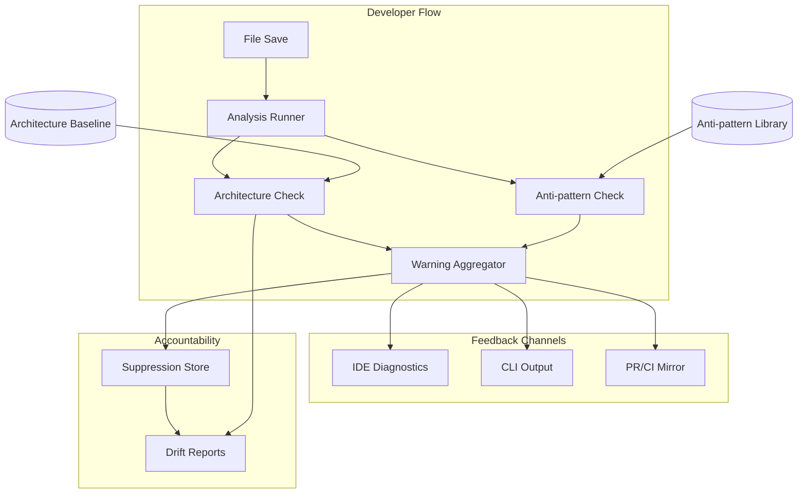

<!-- APS: See https://github.com/EddaCraft/anvil-plan-spec for format reference -->
<!-- This document is non-executable. -->

# Anvil v1 — Save-time Trust

## Overview

Anvil v1 makes AI-generated code safe to merge by catching architecture boundary
violations and AI escape-hatch anti-patterns at file-save time. Developers get
actionable warnings before code leaves the file, with human-owned exceptions for
intentional deviations.

**Why this matters:** AI coding tools are accelerating development, but they
don't understand your architecture. They produce code that compiles and passes
tests, yet drifts from intended patterns. By the time drift is noticed in
review, it's already merged or too expensive to fix. Anvil catches it at the
moment of creation — when fixing is cheap.

**Product thesis:** Anvil improves trust in AI-generated code so more of it
reaches production faster, while architecture drift slows or reverses over time.

**Primary beneficiary:** Individual developers — they get to use AI safely at
the pace leadership expects.

## Problem & Success Criteria

**Problem:** The most damaging recurring failure is second-wave feature work
drifting from intended patterns because engineers:

- don't know which patterns apply
- don't read ADRs or architecture diagrams
- don't recognise when their change crosses a boundary

The most reliable early signal: a **new dependency edge** where a function or
class reaches across architectural contexts.

**Success Criteria:**

- [ ] 50%+ of developers run Anvil on every save (adoption) — post-release
- [ ] Time-to-merge for AI-assisted PRs does not increase (throughput) —
      post-release
- [ ] New cross-boundary edges per sprint decreases by 30% within 8 weeks
      (drift) — post-release
- [x] Save-time feedback latency < 2 seconds cached, < 5 seconds cold (speed)
- [ ] < 10% of warnings are suppressed without resolution (signal quality) —
      post-release

**Implementation Progress (v1.0):**

Core Engine:

- [x] Core analysis engine (`anvil check <files>`)
- [x] Architecture boundary detection with baseline
- [x] Anti-pattern detection (7 patterns)
- [x] Suppression system with time-boxing
- [x] CI/CD integration (GitHub Action)
- [x] Git-aware file detection (`anvil check --changed`)
- [x] Source file watch mode (`anvil watch --source`)

Onboarding Experience:

- [x] TUI foundation (Ink components)
- [x] Visual `anvil init` wizard
- [x] `anvil status` quick health check
- [x] `anvil doctor` setup diagnostics
- [x] First-run welcome experience

Documentation:

- [x] Quick Start Guide update
- [x] Demo showing Anvil catching real issues
- [x] Error message review

## Release Plan

### v1.0 — Save-time Trust + Smooth Onboarding

**Philosophy:** A powerful engine is worthless if no one uses it. v1.0 must
deliver both the core value AND a friction-free first experience.

#### Core Engine (Complete ✅)

| Feature             | Description                                    | Status   |
| ------------------- | ---------------------------------------------- | -------- |
| Analysis Engine     | `anvil check <files>` with caching + parallel  | Complete |
| Architecture Safety | Baseline inference, new-edge detection         | Complete |
| Anti-patterns       | 7 high-confidence patterns                     | Complete |
| Suppressions        | Time-boxed with mandatory explanations         | Complete |
| Git Integration     | `--changed`, `--staged`, `--since <ref>`       | Complete |
| Watch Mode          | `anvil watch --source` for real-time feedback  | Complete |
| CI/CD               | GitHub Action with PR comments + status checks | Complete |

#### Onboarding Experience (Complete ✅)

| Feature           | Description                                     | Status   |
| ----------------- | ----------------------------------------------- | -------- |
| TUI Foundation    | Ink setup + base components (TUI-001)           | Complete |
| Init Wizard       | Visual `anvil init` with guided flow (TUI-002)  | Complete |
| Status Dashboard  | Quick health check: `anvil status` (TUI-003)    | Complete |
| Doctor Command    | Diagnose setup issues: `anvil doctor` (TUI-004) | Complete |
| First-run Welcome | Show value immediately on first run (TUI-005)   | Complete |

**Why onboarding is v1:** Without smooth onboarding, users won't adopt the tool
regardless of how good the engine is. First impressions matter.

#### Documentation & Polish (Complete ✅)

| Feature           | Description                     | Status   |
| ----------------- | ------------------------------- | -------- |
| Quick Start Guide | 5-minute path to first value    | Complete |
| User Guide        | Complete command reference      | Complete |
| Demo/Tutorial     | Show Anvil catching real issues | Complete |
| Error Messages    | Actionable, not cryptic         | Complete |

### v1.1 — Drift Visibility & Developer Trust

| Feature                | Description                                    | Status |
| ---------------------- | ---------------------------------------------- | ------ |
| Explain Command        | `anvil explain <id>` — deep-dive into warnings | Ready  |
| Drift Snapshots        | `anvil drift snapshot` — capture current state | Ready  |
| Drift Compare          | `anvil drift compare` — show changes over time | Ready  |
| Drift Reports          | `anvil drift report` — visualise trends        | Ready  |
| Trend Reports          | Visualise suppression and violation trends     | Draft  |
| OPA Architecture       | DC → OPA bridge, YAML-first architecture       | Draft  |
| Architecture Templates | Layered, Hexagonal, Clean, DDD presets         | Draft  |
| Remote Policy Bundles  | Centralised policy distribution                | Draft  |
| Monorepo Migration     | Restructure to apps/packages layered layout    | Ready  |

### v1.2 — Advanced Experience

| Feature           | Description                                            | Status   |
| ----------------- | ------------------------------------------------------ | -------- |
| VS Code Extension | Anti-pattern on save, arch gates, OPA display (IDE-\*) | Complete |
| TUI Operational   | Watch dashboard, gate explorer (TUI-009–012)           | Draft    |
| Template Library  | Pre-built architecture patterns (TUI-006)              | Draft    |
| Tutorial Mode     | Interactive learning experience (TUI-007)              | Draft    |

#### VS Code Extension Details (v1.2.0 → v1.3.0)

| Phase  | Features                                            | Tasks       | Status   |
| ------ | --------------------------------------------------- | ----------- | -------- |
| v1.2.0 | Embed core, anti-pattern on save, diagnostics, VSIX | IDE-001–003 | Complete |
| v1.2.1 | Arch gate display, OPA policies, click-to-navigate  | IDE-004–006 | Complete |
| v1.3.0 | Syntax highlighting, caching, Marketplace           | IDE-007–008 | Complete |

### v2.0 — AI Tool Integration

| Feature         | Description                                | Status  |
| --------------- | ------------------------------------------ | ------- |
| llms.txt Export | Export constraints for AI tool consumption | Ready   |
| Command Safety  | Validate AI tool commands (CMDSAF)         | Ready   |
| MCP Server      | Real-time validation during AI generation  | Planned |

### What's NOT in v1

To ship fast and focused, these are explicitly deferred:

- **VS Code extension** — CLI-first; IDE comes in v1.2
- **Drift reports** — Core value doesn't require trend analysis
- **Command safety** — Important but not blocking for initial adoption
- **Plan/APS execution** — Planless-first; APS is internal
- **Multi-language support** — TypeScript/JavaScript only for v1
- **Team dashboards** — Individual developer focus first
- **Auto-fix** — Warnings only; don't be too clever

## Constraints

- Must deliver value **without requiring plans/APS** as a prerequisite
  (planless-first)
- Must not hard-block by default — warnings, not errors
- Must run on Node.js 20+
- Must integrate with existing ESLint/Prettier tooling, not replace it
- Must acknowledge legacy drift without overwhelming developers with noise

## System Map

## Milestones

### M1: Core Analysis Engine ✅

- **Status:** Complete
- **Includes:** save-time-trust, architecture-safety
- **Delivered:** `anvil check <file>` returns warnings with explanations

### M2: Anti-pattern Detection ✅

- **Status:** Complete
- **Includes:** antipattern-library
- **Delivered:** ESLint-disable, `any`, `@ts-ignore` detected in new code

### M3: Developer Ergonomics ✅

- **Status:** Complete
- **Includes:** suppressions, drift-reporting
- **Delivered:** Developers can suppress with accountability; drift snapshots and reports

### M4: Integration Points (Partial)

- **Status:** CI complete; IDE draft
- **Includes:** ci-integration ✅, ide-integration (v1.2)
- **Delivered:** PRs show warning summaries via GitHub Action
- **Remaining:** VS Code extension (v1.2)

## Modules

| Module                                                                  | Scope   | Status      | Release | Dependencies                                              |
| ----------------------------------------------------------------------- | ------- | ----------- | ------- | --------------------------------------------------------- |
| [save-time-trust](./modules/save-time-trust.aps.md)                     | CORE    | Complete    | v1.0    | —                                                         |
| [architecture-safety](./modules/architecture-safety.aps.md)             | ARCH    | Complete    | v1.0    | save-time-trust                                           |
| [antipattern-library](./modules/antipattern-library.aps.md)             | ANTI    | Complete    | v1.0    | save-time-trust                                           |
| [suppressions](./modules/suppressions.aps.md)                           | SUPP    | Complete    | v1.0    | architecture-safety, antipattern-library                  |
| [ci-integration](./modules/ci-integration.aps.md)                       | CI      | Complete    | v1.0    | save-time-trust                                           |
| [tui](./modules/tui.aps.md)                                             | TUI     | Complete    | v1.0    | — (Phase 1: onboarding only)                              |
| [documentation-polish](./modules/documentation-polish.aps.md)           | DOCS    | Ready       | v1.0    | —                                                         |
| [explain-command](./modules/explain-command.aps.md)                     | EXPLAIN | Complete    | v1.1    | architecture-safety, antipattern-library                  |
| [drift-reporting](./modules/drift-reporting.aps.md)                     | DRIFT   | Complete    | v1.1    | architecture-safety, antipattern-library, suppressions    |
| [opa-architecture-integration](./modules/opa-architecture-integration.aps.md) | OPA | In Progress | v1.1    | architecture-safety, save-time-trust                      |
| [ide-integration](./modules/ide-integration.aps.md)                     | IDE     | Ready       | v1.2    | save-time-trust, architecture-safety, antipattern-library |
| [llms-txt-export](./modules/llms-txt-export.aps.md)                     | LLMS    | Ready       | v2.0    | architecture-safety, antipattern-library                  |
| [command-safety-validation](./modules/command-safety-validation.aps.md) | CMDSAF  | Ready       | v2.0    | —                                                         |
| [mcp-server](./modules/mcp-server.aps.md)                               | MCP     | Ready       | v2.0    | save-time-trust, architecture-safety                      |
| [aps-markdown-adapter](./modules/aps-markdown-adapter.aps.md)           | APSMD   | Draft       | v2.0    | —                                                         |
| [open-spec-adapter](./modules/open-spec-adapter.aps.md)                 | OPENSPEC| Draft       | v2.0    | —                                                         |
| [adapter-upstream-updates](./modules/adapter-upstream-updates.aps.md)   | ADAPTUP | Draft       | v1.2    | —                                                         |
| [kindling-integration](./modules/kindling-integration.aps.md)           | KINDLING| Draft       | v2.0    | save-time-trust, drift-reporting                          |
| [ember](./modules/ember.aps.md)                                         | EMBER   | Draft       | v2.0    | kindling-integration                                      |
| [edda](./modules/edda.aps.md)                                           | EDDA    | Draft       | v2.0    | ember                                                     |
| [edda-stack-integration](./modules/edda-stack-integration.aps.md)       | STACK   | Draft       | v2.0    | kindling-integration, ember, edda                         |
| [onboarding-feedback-resolution](./modules/onboarding-feedback-resolution.aps.md) | ONFBK | Ready | v1.1    | architecture-safety, tui                                  |
| [real-time-validation-simplified](./modules/real-time-validation-simplified.aps.md) | RTV | Draft | v2.0  | save-time-trust                                           |
| [real-time-validation-full](./modules/real-time-validation-full.aps.md) | RTV     | Draft       | —       | save-time-trust, ide-integration                          |
| [tui-enhancement](./modules/tui-enhancement.aps.md)                     | TUI     | Superseded  | —       | tui (see D-005: Ink over OpenTUI)                         |
| [test-quality](./modules/test-quality.aps.md)                           | TEST    | In Progress | —       | —                                                         |
| [monorepo-migration](./modules/monorepo-migration.aps.md)               | MONO    | Ready       | v1.1    | —                                                         |

### Task Status — v1.0 (Core Engine)

| Task     | Module          | Description                      | Status   |
| -------- | --------------- | -------------------------------- | -------- |
| CORE-001 | save-time-trust | Warning schema definition        | Complete |
| CORE-002 | save-time-trust | Check runner refactor            | Complete |
| CORE-003 | save-time-trust | CLI check command                | Complete |
| CORE-004 | save-time-trust | Git-aware changed file detection | Complete |
| CORE-005 | save-time-trust | Source file watch mode           | Complete |
| ARCH-001 | architecture    | Baseline inference               | Complete |
| ARCH-002 | architecture    | Edge detection                   | Complete |
| ARCH-003 | architecture    | Architecture check integration   | Complete |
| ARCH-004 | architecture    | CLI architecture service         | Complete |
| ANTI-001 | antipattern     | Pattern catalogue definition     | Complete |
| ANTI-002 | antipattern     | Scanner implementation           | Complete |
| ANTI-003 | antipattern     | Antipattern check integration    | Complete |
| ANTI-004 | antipattern     | Allowlist and opt-in support     | Complete |
| SUPP-001 | suppressions    | Suppression parser               | Complete |
| SUPP-002 | suppressions    | Suppression store                | Complete |
| SUPP-003 | suppressions    | Gate runner integration          | Complete |
| CI-001   | ci-integration  | GitHub Action composite          | Complete |
| CI-002   | ci-integration  | Changed files detection          | Complete |
| CI-003   | ci-integration  | PR comments and status checks    | Complete |
| CI-004   | ci-integration  | Documentation and configuration  | Complete |

### Task Status — v1.0 (Onboarding TUI)

| Task    | Module | Description                   | Status   | Priority |
| ------- | ------ | ----------------------------- | -------- | -------- |
| TUI-001 | tui    | Ink foundation and components | Complete | high     |
| TUI-002 | tui    | `anvil init` wizard           | Complete | high     |
| TUI-003 | tui    | `anvil status` dashboard      | Complete | high     |
| TUI-004 | tui    | `anvil doctor` diagnostics    | Complete | high     |
| TUI-005 | tui    | First-run welcome experience  | Complete | high     |
| TUI-008 | tui    | Testing infrastructure        | Complete | medium   |

### Task Status — v1.0 (Documentation)

| Task     | Module | Description            | Status   | Priority |
| -------- | ------ | ---------------------- | -------- | -------- |
| DOCS-001 | docs   | Quick Start Guide      | Complete | high     |
| DOCS-002 | docs   | User Guide command ref | Complete | high     |
| DOCS-003 | docs   | Demo material creation | Complete | high     |
| DOCS-004 | docs   | Error message audit    | Complete | medium   |
| DOCS-005 | docs   | Troubleshooting guide  | Complete | medium   |
| DOCS-006 | docs   | README refresh         | Complete | high     |

### Task Status — v1.1 (Explain Command)

| Task       | Module  | Description               | Status   | Priority |
| ---------- | ------- | ------------------------- | -------- | -------- |
| EXPLAIN-01 | explain | Warning ID system         | Complete | high     |
| EXPLAIN-02 | explain | Explanation templates     | Complete | high     |
| EXPLAIN-03 | explain | Architecture explanations | Complete | high     |
| EXPLAIN-04 | explain | Anti-pattern explanations | Complete | high     |
| EXPLAIN-05 | explain | ExplainService            | Complete | high     |
| EXPLAIN-06 | explain | CLI explain command       | Complete | high     |

### Task Status — v1.1 (Drift Reporting)

| Task     | Module | Description               | Status   | Priority |
| -------- | ------ | ------------------------- | -------- | -------- |
| DRIFT-01 | drift  | Snapshot schema & storage | Complete | high     |
| DRIFT-02 | drift  | Snapshot capture          | Complete | high     |
| DRIFT-03 | drift  | Snapshot comparison       | Complete | high     |
| DRIFT-04 | drift  | Report generator          | Complete | medium   |
| DRIFT-05 | drift  | CLI drift commands        | Complete | high     |

### Task Status — v1.1 (Onboarding Feedback Resolution)

| Task     | Module | Description                                 | Status  | Priority |
| -------- | ------ | ------------------------------------------- | ------- | -------- |
| ONFBK-01 | onfbk  | Fix --no-tui flag handling                  | Planned | high     |
| ONFBK-02 | onfbk  | Fix TUI wizard early exit                   | Planned | high     |
| ONFBK-03 | onfbk  | Improve layer detection for project variety | Planned | high     |
| ONFBK-04 | onfbk  | Improve entry points presentation           | Planned | medium   |
| ONFBK-05 | onfbk  | Add architecture explanation                | Planned | medium   |

### Task Status — v1.1 (OPA & Architecture Integration)

| Task    | Module | Description                         | Status      | Priority |
| ------- | ------ | ----------------------------------- | ----------- | -------- |
| OPA-001 | opa    | Architecture YAML schema (Zod)      | Complete    | high     |
| OPA-002 | opa    | YAML parser with template expansion | Complete    | high     |
| OPA-003 | opa    | DC config generator from YAML       | Complete    | high     |
| OPA-004 | opa    | `anvil architecture init` command   | Complete    | high     |
| OPA-005 | opa    | Architecture context extraction     | Complete    | high     |
| OPA-006 | opa    | OPA input schema enhancement        | Complete    | high     |
| OPA-007 | opa    | Gate runner integration             | Complete    | high     |
| OPA-008 | opa    | Rego generator from architecture    | Complete    | high     |
| OPA-009 | opa    | Generated policy marker             | Complete    | medium   |
| OPA-010 | opa    | Auto-regeneration on YAML change    | Complete    | medium   |
| OPA-011 | opa    | Layered architecture template       | Complete    | medium   |
| OPA-012 | opa    | Hexagonal architecture template     | Complete    | medium   |
| OPA-013 | opa    | Clean Architecture template         | Complete    | medium   |
| OPA-014 | opa    | DDD template with bounded contexts  | Complete    | medium   |
| OPA-015 | opa    | Template loader and validator       | Complete    | medium   |
| OPA-016 | opa    | TypeScript analyser foundation      | Planned     | low      |
| OPA-017 | opa    | Path alias resolver                 | Planned     | low      |
| OPA-018 | opa    | Analyser feature flag               | Planned     | low      |
| OPA-019 | opa    | Bundle download and caching         | Planned     | medium   |
| OPA-020 | opa    | Signature verification              | Planned     | medium   |
| OPA-021 | opa    | Basic auth and CLI commands         | Planned     | medium   |

### Task Status — v1.1 (Monorepo Migration)

| Task     | Module | Description                          | Status  | Priority |
| -------- | ------ | ------------------------------------ | ------- | -------- |
| MONO-001 | mono   | Nx generators for package scaffolding | Ready   | high     |
| MONO-002 | mono   | Import path codemod                  | Ready   | high     |
| MONO-003 | mono   | Shared tooling packages              | Ready   | medium   |
| MONO-004 | mono   | Extract contracts from core          | Ready   | high     |
| MONO-005 | mono   | Extract ports from core              | Ready   | high     |
| MONO-006 | mono   | Extract pure domain to core          | Ready   | high     |
| MONO-007 | mono   | Extract runtime package              | Ready   | high     |
| MONO-008 | mono   | Extract policy package               | Ready   | high     |
| MONO-009 | mono   | Extract config package               | Ready   | medium   |
| MONO-010 | mono   | Extract storage package              | Ready   | medium   |
| MONO-011 | mono   | Extract crypto package               | Ready   | medium   |
| MONO-012 | mono   | Split adapters per-integration       | Ready   | medium   |
| MONO-013 | mono   | Move CLI to apps/                    | Ready   | high     |
| MONO-014 | mono   | Reorganise E2E tests                 | Ready   | medium   |
| MONO-015 | mono   | Move scripts to tools/               | Ready   | low      |
| MONO-016 | mono   | Full test suite validation           | Ready   | high     |
| MONO-017 | mono   | Dependency graph validation          | Ready   | high     |
| MONO-018 | mono   | Documentation update                 | Ready   | medium   |

### Task Status — v1.2 (Advanced Experience)

#### IDE Integration (VS Code Extension)

| Task    | Module | Description                                     | Status   | Priority |
| ------- | ------ | ----------------------------------------------- | -------- | -------- |
| IDE-001 | ide    | Embed @anvil/core for fast-path operations      | Complete | high     |
| IDE-002 | ide    | Anti-pattern detection on save with diagnostics | Complete | high     |
| IDE-003 | ide    | Improve source location mapping from CLI output | Complete | medium   |
| IDE-004 | ide    | Architecture gate display in tree view          | Complete | high     |
| IDE-005 | ide    | OPA policy failure display with remediation     | Complete | high     |
| IDE-006 | ide    | Click-to-navigate for all violation types       | Complete | medium   |
| IDE-007 | ide    | APS and Rego syntax highlighting                | Complete | medium   |
| IDE-008 | ide    | Analysis caching and Marketplace preparation    | Complete | medium   |

#### TUI Operational (CLI)

| Task    | Module | Description                       | Status  | Priority |
| ------- | ------ | --------------------------------- | ------- | -------- |
| TUI-006 | tui    | Static template library           | Planned | medium   |
| TUI-007 | tui    | Interactive tutorial              | Planned | low      |
| TUI-009 | tui    | `anvil watch` real-time dashboard | Planned | medium   |
| TUI-010 | tui    | `anvil gate` interactive explorer | Planned | medium   |
| TUI-011 | tui    | Parallel progress visualisation   | Planned | low      |
| TUI-012 | tui    | Log panel with filtering          | Planned | low      |

### Task Status — v2.0 (AI Tool Integration)

| Task       | Module         | Description                       | Status  | Priority |
| ---------- | -------------- | --------------------------------- | ------- | -------- |
| LLMS-001   | llms-txt       | Constraint collector              | Planned | high     |
| LLMS-002   | llms-txt       | llms.txt formatter                | Planned | high     |
| LLMS-003   | llms-txt       | MCP resource formatter            | Planned | medium   |
| LLMS-004   | llms-txt       | Prompt fragment formatter         | Planned | medium   |
| LLMS-005   | llms-txt       | CLI export command                | Planned | high     |
| CMDSAF-001 | command-safety | Rule system and types             | Planned | high     |
| CMDSAF-002 | command-safety | Command parser with unwrapping    | Planned | high     |
| CMDSAF-003 | command-safety | Rule matcher with specificity     | Planned | high     |
| CMDSAF-004 | command-safety | Default git operation rules       | Planned | medium   |
| CMDSAF-005 | command-safety | Default filesystem rules          | Planned | medium   |
| CMDSAF-006 | command-safety | CommandSafetyCheck implementation | Planned | high     |
| CMDSAF-007 | command-safety | Configuration system              | Planned | medium   |
| CMDSAF-008 | command-safety | Message formatting                | Planned | low      |
| CMDSAF-009 | command-safety | CLI integration and documentation | Planned | high     |
| MCP-001    | mcp-server     | Package scaffold and basic server | Planned | high     |
| MCP-002    | mcp-server     | anvil_check tool implementation   | Planned | high     |
| MCP-003    | mcp-server     | anvil_gate and anvil_status tools | Planned | high     |
| MCP-004    | mcp-server     | Resources and prompts             | Planned | medium   |
| MCP-005    | mcp-server     | HTTP transport and config gen     | Planned | medium   |

### Task Status — v2.0 (Edda Stack — Memory System)

The Edda Stack provides a three-layer architecture for memory: Kindling (observation),
Ember (interpretation), and Edda (canonical memory).

#### Kindling Integration (Observation Layer)

| Task         | Module   | Description                         | Status | Priority |
| ------------ | -------- | ----------------------------------- | ------ | -------- |
| KINDLING-001 | kindling | Kindling service wrapper            | Draft  | high     |
| KINDLING-002 | kindling | Configuration schema and loading    | Draft  | high     |
| KINDLING-003 | kindling | Session observation hooks           | Draft  | high     |
| KINDLING-004 | kindling | Gate evaluation observations        | Draft  | high     |
| KINDLING-005 | kindling | Action execution observations       | Draft  | medium   |
| KINDLING-006 | kindling | Plan lifecycle observations         | Draft  | medium   |
| KINDLING-007 | kindling | Human input and constraint obs      | Draft  | medium   |
| KINDLING-008 | kindling | Error observations                  | Draft  | high     |
| KINDLING-009 | kindling | Query service with scope enforcement| Draft  | high     |
| KINDLING-010 | kindling | Query limits and throttling         | Draft  | high     |
| KINDLING-011 | kindling | Malicious AI test suite             | Draft  | high     |
| KINDLING-012 | kindling | Session query command (run show)    | Draft  | high     |
| KINDLING-013 | kindling | Plan, gate, action query commands   | Draft  | high     |
| KINDLING-014 | kindling | Status integration                  | Draft  | medium   |
| KINDLING-015 | kindling | Sensitive data validation           | Draft  | high     |
| KINDLING-016 | kindling | Retention and pruning               | Draft  | medium   |
| KINDLING-017 | kindling | Performance benchmarking            | Draft  | medium   |
| KINDLING-018 | kindling | Documentation and examples          | Draft  | medium   |
| KINDLING-019 | kindling | OpenAPI spec generation             | Draft  | medium   |

#### Ember (Interpretive Layer — Candidate Memory)

| Task      | Module | Description                       | Status | Priority |
| --------- | ------ | --------------------------------- | ------ | -------- |
| EMBER-001 | ember  | Candidate Memory Proposal schema  | Draft  | high     |
| EMBER-002 | ember  | Proposal type definitions         | Draft  | high     |
| EMBER-003 | ember  | Ember configuration schema        | Draft  | high     |
| EMBER-004 | ember  | ProposalStore implementation      | Draft  | high     |
| EMBER-005 | ember  | DecayService implementation       | Draft  | high     |
| EMBER-006 | ember  | AggregatorService foundation      | Draft  | medium   |
| EMBER-007 | ember  | Evaluation rules engine           | Draft  | medium   |
| EMBER-008 | ember  | Built-in evaluation rules         | Draft  | medium   |
| EMBER-009 | ember  | CandidateService (high-level API) | Draft  | high     |
| EMBER-010 | ember  | Kindling observation hooks        | Draft  | medium   |
| EMBER-011 | ember  | CLI ember commands                | Draft  | high     |
| EMBER-012 | ember  | Query API implementation          | Draft  | high     |
| EMBER-013 | ember  | Status integration                | Draft  | medium   |
| EMBER-014 | ember  | Documentation and examples        | Draft  | medium   |

#### Edda (Canonical Memory Layer)

| Task      | Module | Description                       | Status | Priority |
| --------- | ------ | --------------------------------- | ------ | -------- |
| EDDA-001  | edda   | Memory Object schema              | Draft  | high     |
| EDDA-002  | edda   | Memory type definitions           | Draft  | high     |
| EDDA-003  | edda   | Provenance schema                 | Draft  | high     |
| EDDA-004  | edda   | Evolution graph schema            | Draft  | high     |
| EDDA-005  | edda   | Edda configuration schema         | Draft  | high     |
| EDDA-006  | edda   | Git-backed MemoryStore            | Draft  | high     |
| EDDA-007  | edda   | YAML serialisation                | Draft  | high     |
| EDDA-008  | edda   | Version tracking                  | Draft  | medium   |
| EDDA-009  | edda   | PromotionService                  | Draft  | high     |
| EDDA-010  | edda   | ProvenanceService                 | Draft  | medium   |
| EDDA-011  | edda   | EvolutionService                  | Draft  | high     |
| EDDA-012  | edda   | MemoryService (high-level API)    | Draft  | high     |
| EDDA-013  | edda   | CLI list and show commands        | Draft  | high     |
| EDDA-014  | edda   | CLI promote command               | Draft  | high     |
| EDDA-015  | edda   | CLI retire and trace commands     | Draft  | high     |
| EDDA-016  | edda   | Human-in-the-loop enforcement     | Draft  | high     |
| EDDA-017  | edda   | Status integration                | Draft  | medium   |
| EDDA-018  | edda   | Schema migration tooling          | Draft  | medium   |
| EDDA-019  | edda   | Documentation                     | Draft  | medium   |

#### Edda Stack Integration

| Task      | Module | Description                       | Status | Priority |
| --------- | ------ | --------------------------------- | ------ | -------- |
| STACK-001 | stack  | Common identifier schemas         | Draft  | high     |
| STACK-002 | stack  | Timestamp and temporal schemas    | Draft  | high     |
| STACK-003 | stack  | Confidence scale definitions      | Draft  | high     |
| STACK-004 | stack  | Provenance link schema            | Draft  | high     |
| STACK-005 | stack  | Proposal → Memory type mapping    | Draft  | high     |
| STACK-006 | stack  | Observation → Proposal mapping    | Draft  | medium   |
| STACK-007 | stack  | Layer port definitions            | Draft  | high     |
| STACK-008 | stack  | Event bus for layer communication | Draft  | medium   |
| STACK-009 | stack  | Layer mock factories              | Draft  | high     |
| STACK-010 | stack  | Integration test fixtures         | Draft  | high     |
| STACK-011 | stack  | Provenance chain validator        | Draft  | high     |
| STACK-012 | stack  | Stack configuration schema        | Draft  | high     |
| STACK-013 | stack  | CLI stack status command          | Draft  | high     |
| STACK-014 | stack  | CLI stack validate command        | Draft  | high     |
| STACK-015 | stack  | Stack architecture documentation  | Draft  | medium   |
| STACK-016 | stack  | Migration guide                   | Draft  | medium   |

## Risks & Mitigations

| Risk                            | Impact | Likelihood | Mitigation                                               |
| ------------------------------- | ------ | ---------- | -------------------------------------------------------- |
| Warning noise kills adoption    | high   | medium     | High-signal patterns only; warn on NEW edges, not legacy |
| Analysis too slow (> 2s)        | high   | medium     | Incremental analysis; hash-based caching; warm daemon    |
| Developers bypass with `--skip` | medium | medium     | Track skip usage; surface in drift reports               |
| Legacy drift overwhelms users   | medium | high       | Baseline existing violations; focus warnings on new code |
| Over-claiming blast radius      | medium | medium     | Careful language; surface confidence levels              |

## Decisions

- **D-001:** Planless-first posture — deliver value without requiring APS plans
  ([ADR](./decisions/001-planless-first.md))
- **D-002:** Warnings over blocks — inform, don't prevent; let CI enforce if
  desired ([ADR](./decisions/002-warnings-over-blocks.md))
- **D-003:** New edges only — baseline existing architecture; warn only on new
  violations ([ADR](./decisions/003-new-edges-only.md))
- **D-004:** Suppression syntax — `@anvil-ignore <ID>: <reason>` with mandatory
  explanation ([ADR](./decisions/004-suppression-syntax.md))
- **D-005:** Ink over OpenTUI — Node.js compatibility over native performance
  ([ADR](./decisions/005-ink-over-opentui.md))
- **D-006:** Hybrid DC + OPA — DC for analysis, OPA for policies, bridge between
  ([ADR](./decisions/006-hybrid-dc-opa.md))

## Open Questions

### Decided

- [x] VS Code extension vs CLI-only for v1? → **CLI for v1.0**, VS Code in v1.2
- [x] Provenance storage? → **Inline-only** for v1.0 (no central DB)
- [x] Onboarding TUI in v1? → **Yes** — critical for adoption
- [x] Command Safety (CMDSAF) in v1? → **No** — deferred to v2.0

### Open

- [ ] Which entry points define "public API" for boundary detection?
- [ ] Should drift reports include team/author attribution? (Privacy concern)
- [ ] How to handle monorepos with multiple architecture baselines?
- [x] OpenTUI vs Ink for TUI implementation? → **Ink** — OpenTUI requires Bun
      runtime (bun-ffi-structs for Zig FFI); Anvil requires Node.js 20+
- [ ] Should first-run auto-run `anvil check` on sample files for demo?

## Considerations for Future

### Features We Might Be Missing

| Idea                         | Value  | Effort | Notes                                    |
| ---------------------------- | ------ | ------ | ---------------------------------------- |
| `anvil explain <warning-id>` | High   | Low    | ✅ Planned for v1.1 (EXPLAIN module)     |
| `anvil fix <warning-id>`     | High   | Medium | Auto-fix where safe (e.g., add suppress) |
| Config inheritance           | Medium | Medium | Org → repo → folder config cascade       |
| Baseline diff on PR          | High   | Medium | Show architecture changes in PR          |
| Warning severity config      | Medium | Low    | Override severity per-rule               |
| Quiet mode                   | Low    | Low    | `--quiet` flag for minimal output        |
| Metrics export               | Medium | Medium | Prometheus/StatsD for team dashboards    |

### Architecture Scanning Enhancements (Frequently Requested)

**Many of these are now planned in the OPA & Architecture Integration module
(v1.1).** See
[opa-architecture-integration](./modules/opa-architecture-integration.aps.md).

| Idea                           | Value | Status                                 |
| ------------------------------ | ----- | -------------------------------------- |
| Architecture pattern templates | High  | ✅ Planned (OPA-011–015)               |
| Visual dependency graph        | High  | Deferred to v1.2+                      |
| Layer violation detection      | High  | ✅ Planned (DC + OPA bridge)           |
| Circular dependency detection  | High  | ✅ Already have via dependency-cruiser |
| Public API surface detection   | Med   | Open                                   |
| Module coupling metrics        | Med   | Open                                   |
| Architecture fitness functions | Med   | ✅ Planned (Rego policies)             |
| Suggested refactorings         | Med   | Open                                   |

### Documentation Gaps

| Doc                   | Status  | Notes                               |
| --------------------- | ------- | ----------------------------------- |
| QUICK_START.md        | Stale   | ✅ Planned: DOCS-001                |
| USER_GUIDE.md         | Stale   | ✅ Planned: DOCS-002                |
| TROUBLESHOOTING.md    | Partial | ✅ Planned: DOCS-005                |
| Demo GIF              | Missing | ✅ Planned: DOCS-003                |
| Architecture patterns | Missing | Show hexagonal/clean/layered setups |
