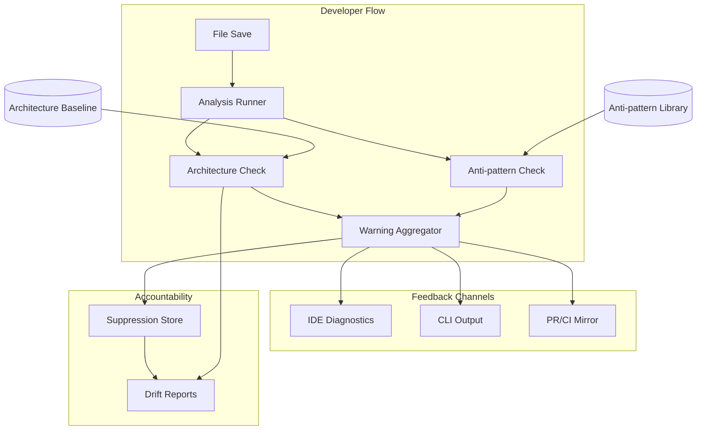

<!-- APS: See https://github.com/eddacraft/anvil-plan-spec for format reference -->
<!-- This document is non-executable. -->

# Anvil — Save-time Trust

> **Latest release tag: `v0.7.1-beta`** (shipped 2026-05-23) — Boring Week
> Patch 1 (Activation Diagnostic Honesty) on top of `v0.7.0-beta` (shipped
> 2026-05-21), the daemon-working product slate: MLP v1 18/18, the `anvil-run`
> intercept launcher (INTL 9/9), and the MLP2 integration surface. The earlier
> operational substrate window closed with `v0.6.2-beta` / `v0.6.3-beta`:
> OPMODEL 12/12 (archived 2026-05-11; main-first cutover), RELORCH 12/12
> (archived; deterministic release command surface), and CICD 12/12 (archived
> 2026-05-12; CI targeting + drift checks + workflow contract map). The next tag
> candidate is `v0.7.2-beta` (scope still being assembled). See
> [`RELEASE-PLAN.md`](../RELEASE-PLAN.md) for the cut detail and
> [`ROADMAP.md`](../ROADMAP.md) for thematic context across horizons.

## Contents

- [Release Plan](#release-plan)
- [Branch Recovery](#branch-recovery)
- [Hardening & Maintenance](#hardening--maintenance)
- [Continuous Improvement](#continuous-improvement)
- [Adoption and Sustained Use](#adoption-and-sustained-use)
- [Rust Engine](#rust-engine)
- [Auth & Access](#auth--access)
- [Dev Tooling Bridge](#dev-tooling-bridge)
- [Observability Foundation](#observability-foundation)
- [Tracing Foundation](#tracing-foundation)
- [Usage Analytics](#usage-analytics)
- [Infrastructure as Code](#infrastructure-as-code)
- [Web Dashboard](#web-dashboard)
- [Policy Governance](#policy-governance)
- [Engineering Platform](#engineering-platform)
- [Test Quality](#test-quality)
- [Language & Coverage](#language--coverage)
- [Config Intelligence](#config-intelligence)
- [Graph Substrate](#graph-substrate)
- [Rust MCP Launch Path](#rust-mcp-launch-path)
- [Intercept Loop](#intercept-loop)
- [Agent Infrastructure](#agent-infrastructure)

Anvil makes AI-generated code safe to merge by catching architecture boundary
violations and AI escape-hatch anti-patterns at file-save time. Developers get
actionable warnings before code leaves the file, with human-owned exceptions for
intentional deviations.

**Why this matters:** AI coding tools are accelerating development, but they
don't understand your architecture. They produce code that compiles and passes
tests, yet drifts from intended patterns. By the time drift is noticed in
review, it's already merged or too expensive to fix. Anvil catches it at the
moment of creation — when fixing is cheap.

**Product thesis:** Anvil improves trust in AI-generated code so more of it
reaches production faster, while architecture drift slows or reverses over time.

**Primary beneficiary:** Individual developers — they get to use AI safely at
the pace leadership expects.

## Problem & Success Criteria

**Problem:** The most damaging recurring failure is second-wave feature work
drifting from intended patterns because engineers:

- don't know which patterns apply
- don't read ADRs or architecture diagrams
- don't recognise when their change crosses a boundary

The most reliable early signal: a **new dependency edge** where a function or
class reaches across architectural contexts.

**Success Criteria:**

- [ ] 50%+ of developers run Anvil on every save (adoption) — post-release
- [ ] Time-to-merge for AI-assisted PRs does not increase (throughput) —
      post-release
- [ ] New cross-boundary edges per sprint decreases by 30% within 8 weeks
      (drift) — post-release
- [x] Save-time feedback latency < 2 seconds cached, < 5 seconds cold (speed)
- [ ] < 10% of warnings are suppressed without resolution (signal quality) —
      post-release

## Release Plan

Releases are themed by what they deliver, not sequenced by version number.
Individual packages still use semantic versioning for npm/cargo publishes.

### Shipped operational window — `v0.6.2-beta` / `v0.6.3-beta` patch

The OPMODEL-012 main-first cutover landed on 2026-05-11, RELORCH completed the
deterministic release command surface, and CICD closed the targeting/drift
readiness work on 2026-05-12. The operational release `v0.6.2-beta` is tagged;
the `v0.6.3-beta` patch (2026-05-15, release record at
[`plans/releases/v0.6.3-beta.md`](./releases/v0.6.3-beta.md)) rolled WATCHUX
8/8 and ADOPT-005 `anvil uninstall` on top. The daemon-working product slate
has since shipped as `v0.7.0-beta` (2026-05-21) plus the `v0.7.1-beta` patch
(2026-05-23); the current planning window is now the `v0.7.2-beta` candidate.

| Area | Status | Progress | Notes |
| ---- | ------ | -------- | ----- |
| Shipped baseline | Shipped | `v0.6.3-beta` tag (2026-05-15, hotfix on top of `v0.6.2-beta`) | Wow-start activation, daemon-backed validation, the executable release operating model, and the beta watch UX / uninstall hotfix are behind us; current work should not reopen operational substrate scope. v0.6.3-beta released WATCHUX-001..-004 + ADOPT-005 (record at [`plans/releases/v0.6.3-beta.md`](./releases/v0.6.3-beta.md)). |
| Main-first cutover | Complete | OPMODEL 12/12 — archived 2026-05-11 | Cutover SHA `b6f236e9`; `main` ruleset id 16217152 enforces 7 required checks + PR + non-FF + no-delete; `dev` retired as `dev-retired-2026-05-11` tag (deletion follow-up #1419). Module archived. |
| CI/CD release readiness | Shipped | OPMODEL-005 spec + CICD-009 implementation complete | `.github/workflows/release-readiness.yml` validates an exact `main` SHA with no publishing credentials; candidate metadata + retention live. CICD-012 added cutover-aware gates and self-defending fork-reject. |
| Release orchestration | Complete | RELORCH 12/12 | Completed command-surface slice after OPMODEL-012 unblocked main-targeted work: assess, preflight, prepare, promote, tag, monitor, verify, closeout, command harness, release-record yank/discard schema closure, and skill/runbook wire-up with legacy runner removal. Live CI readiness authority remains tracked under CICD. |
| CI targeting + drift | Complete | CICD 12/12 (closed 2026-05-12) | All twelve items shipped: cost reporting (-001), classifier (-002), local validation (-003), fast PR validation (-004), integration SHA split (-005), coverage cost controls (-006), security/dependency targeting (-007), platform-matrix targeting (-008), release-readiness reconciliation (-009), workflow contract map + authority audit (-010), APS/repo/release drift checks in CI with PR-metadata extension (-011), and cutover readiness (-012). Council follow-ups closed via PR #1442 (issue #1438). |
| Daemon-working product slate | Shipped | MLP 18/18 Complete (Done 2026-05-13/-14); MLP2 69/86 (In Progress — **MLP2-047 Merged 2026-05-25 via PR [#1941](https://github.com/eddacraft/anvil-001/pull/1941) — two Linux-gated subprocess smoke tests for `anvil hook pre-push` (no-policy + version-floor branches); proves exit-code/stderr/witness contract end-to-end. Done-count advances 68 → 69.** **MLP2-051g Merged 2026-05-25 via PR [#1909](https://github.com/eddacraft/anvil-001/pull/1909) (`03e6a73f`) — `anvil start --verify --why` + `anvil status --verify --why` print per-tier activation evidence to stderr, closing acceptance criterion #3 of GH [#1831](https://github.com/eddacraft/anvil-001/issues/1831). Copilot-review hardening shipped in the same merge: clap `requires = "verify"` on `StatusArgs::why` (no silent no-op), drop the nonexistent `anvil intercept recover` from copy, ensure all `anvil intercept start` hints include `--foreground`, dispatch `why_summary` on `protection_state()` instead of solely `daemon_attestation`. 10 pinned tests in `crates/anvil-cli/src/activation/render.rs::tests`. Done-count advances 67 → 68.** **MLP2-070 reconciled to `Released/Shipped via v0.7.0-beta` 2026-05-24 — daemon IPC handler re-derives the lineage anchor from authenticated peer credentials (`SO_PEERCRED` + `/proc/<peer_pid>/stat` on Linux; client-supplied `pid_starttime` forwarded as advisory on non-Linux). Closes DeepSec [#1674](https://github.com/eddacraft/anvil-001/issues/1674); shipped via PR [#1805](https://github.com/eddacraft/anvil-001/pull/1805) merged 2026-05-21 at `c8193511` (+ non-Linux follow-up at `fefb6e8c`). APS status was previously stuck at `In Progress` despite both commits being in `v0.7.0-beta` and `v0.7.1-beta` tags. Group P advances 0/2 → 1/2 (Phase 1 of MLP2-071 already Merged; Phase 2 still pending). Done-count advances 66 → 67.** **MLP2-074 Merged 2026-05-24 via PR #1895 (`5bb10f3a`) — daemon-side `session.report_process` IPC handler narrows the lineage anchor from the launcher to the spawned child; PR-review hardening added cross-session anchor-collision rejection + Linux server-side `pid_starttime` re-derivation mirroring MLP2-070's trust-boundary defence; Group R closes 1/1.** **MLP2-025 umbrella closed 2026-05-18: Phase 1 primitives merged via PR #1597 (2026-05-15); Phase 2 (-025b PR #1603) + Phase 3 (-025c PR #1608) shipped 2026-05-16. End-to-end spoof cross-check live in production; counter sweep +1 (58 → 59).** **MLP2-051 re-specced 2026-05-17 — split into umbrella + 051a..051e sub-tasks after audit showed only `anvil status` renders the typed claim today; doctor/MCP/TS-driver/GH-Action surfaces emit no claim yet, so the work is additive rather than migrative; net +5 task IDs.** **MLP2-068..-069 filed 2026-05-17 (MLP2-068 Merged; MLP2-069 Done 2026-05-22) as Group O — MLP2-016 audit follow-ons (Council-deferred kernel/ops items): `git cat-file --batch` for per-commit blob fetch perf + dedicated `EngineUnavailableReason::IoError` variant; neither gates `v0.7.0-beta`. Companion infra item filed as GitHub issue #1630 (ship `patterns/compiled/registry.json` with installed binary).** **MLP2-067 filed 2026-05-16 (Draft) as Group N — daemon-hosted graph cache with narrow evaluator RPC, the middle-ground bridge to GV2; does not gate v0.7.0-beta.** **Group K closed 4/4 via PR `d96ab458` (MLP2-053..-056 audit-chain workflow + Kindling emission + rule rescan + time-budget cap); Group L closed 4/4 via PR `7a39e5f9` (MLP2-059 per-worktree invalidation rate limit); Group M closed 6/6 on 2026-05-16 via PRs #1602 (MLP2-061..-063) + #1604 (MLP2-064..-066)**; wave 1A (PR #1522): MLP2-001 + MLP2-002; wave 1B: MLP2-023 (composite session key); MLP2-003 (composite-identity check primitive); MLP2-024 + MLP2-009 (per-worktree session cap + rate_window primitive); MLP2-029 (TS `AgentTag` mirror); MLP2-030 + MLP2-060 shipped 2026-05-14 together — TS mid-edit Kindling observation mirror (closes Group F 2/2) + YAML resource-bounds hardening (alias-reject + size-cap + depth-cap, closes Council #C-023b); wave 1C shipped 2026-05-14 on branch `feat/mlp2-wave-016-048-057-052` — MLP2-052 (additive-optional-fields forward-compat pin), MLP2-057 (bounded LRU rule_cache + SessionRegistry unregister hook, closes Council #C-007/-018/-024), MLP2-048 (`anvil status --json` emits nested ProtectionClaim, closes MLP-009 HARD-GATE render surface), MLP2-016 (typed `validate_at_l4` engine + on_warn-aware pre-push pipeline, closes Council #C-016A); wave 1D shipped 2026-05-14 via PR #1563 at `fc19b58b` — MLP2-058 (tracing + DaemonStatus observability on rule_cache + in_flight, closes Council #C-008/-009/-012/-013/-014/-015/-025), MLP2-012 (witness manifest event stream at `anvil/witness/manifest/chain.ndjson` for rollover consumers), MLP2-046 (dedicated `anvil l4-validate` CLI subcommand), MLP2-049 (per-state golden ProtectionClaim fixtures at `crates/anvil-cli/tests/fixtures/status_v1/`); wave 1E shipped 2026-05-14 via PR #1566 at `9ec726dd` — MLP2-020 (hook-side `required_anvil_version` floor check with split routing: `BelowFloor` → `ErrorClass::VersionFloor` "upgrade anvil", `InvalidFloor` → `ErrorClass::EmbeddedFailed`), MLP2-021 (`cutoff_commit` baseline-ancestry acceptance via `git rev-list --first-parent --max-count=100000` per ref + hex-shape validation on `Policy::cutoff_commit` + O(1) per-commit lookup via hoisted `HashMap<sha, index>`), MLP2-022 (`PRE_PUSH_BUDGET = 2s` wall-clock cap with `ErrorClass::TimedOut` distinct render + `tracing::warn!` partial-state event; `ValidationPending` suppressed when budget fires); wave 1F shipped 2026-05-14 via PR #1567 at `96ad5d2d` — MLP2-018 (daemon-side `evaluate_version_floor(policy_floor, witness_anvil_version)` returning typed `VersionFloorOutcome` server-side mirror of MLP2-020; uses `semver::Version` directly), MLP2-019 (`crates/anvil-l4/src/recognised_rules.rs` new module — `RecognisedRulesRegistry` HashMap O(1) lookup + `RuleSetMetadata` + `evaluate_rules_sha` routing through `OnNoWitness` vocabulary, closes the v1 L4 recognition surface), MLP2-031 (`pin_cutoff_commit(path, cutoff)` in `crates/anvil-l4/src/policy.rs` — atomic temp+rename writer with symlink refusal + hex-shape pre-flight + multi-format round-trip across yaml/yml/json/toml + non-map-baseline refusal, producer side of MLP2-021); +24 new unit pins (82 anvil-l4 tests total, was 67 baseline); Council quick reviewed (3 MAJOR fixed: NotAnObject ambiguity → BaselineNotAMap split, atomic_replace Windows comment, dead_code cleanup); +20 new unit pins across anvil-cli/anvil-hook/anvil-l4; integration follow-ups split out from MLP-018 catalogue + 4 Council-filed hardening tasks in Group L); INTL 9/9 Done (Merged via PR #1528 at `5d38e546`, awaiting `v0.7.0-beta` release evidence to advance to Released/Shipped → Complete); carry-forward gates 6/6 confirmed (Wave 0 closed 2026-05-13) | Shipped via `v0.7.0-beta` (2026-05-21) + `v0.7.1-beta` patch (2026-05-23); next candidate `v0.7.2-beta`. MLP v1 surface area shipped + INTL launcher ingress shipped. Integration debt tracked module-locally in MLP2 — each of the 60 sub-items (Groups A–K from the MLP-018 catalogue + Group L production hardening from Council session `council-e2fdfc0c`) is now a first-class APS task. |

### Shipped — _daemon-working slate_ (`v0.7.0-beta` + `v0.7.1-beta` patch)

OPMODEL, RELORCH, and CICD are closed. This slate **shipped** as `v0.7.0-beta`
(2026-05-21), with the `v0.7.1-beta` Boring Week patch (Activation Diagnostic
Honesty, 2026-05-23) on top. **Theme:** _Daemon working end-to-end_ —
`anvil start` lands a real testable protection claim, hooks fire
deterministically, the witness chain records every commit, baseline adoption
works, and `anvil-run` wraps agent processes. The active planning window is now
the **`v0.7.2-beta`** candidate (scope still being assembled).

Source of truth for current parallelisation and release dependencies:
[`RELEASE-PLAN.md`](../RELEASE-PLAN.md).

**MLP2 audit note (final sweep 2026-05-19):** the module stood at 60/76 as of
that sweep. Subsequent additions land in the N1b row below — see that row for
current counts (Group P added 2026-05-20 took the total to 78; Group Q added
2026-05-21 took it to 80).
MLP2-068 was reconciled to Merged after implementation commit `d54a5f86`,
advancing Group O to 1/2; MLP2-069 was promoted and completed on 2026-05-22
as a small observability-hygiene follow-up ahead of the next hotfix, advancing
MLP2 to 65/83 **(historical snapshot as of 2026-05-22; the current
total advanced to /86 when MLP2-051g/i/j were filed Draft later the
same day, and the done-count has since advanced past 65 — see the
N1b row + module-table row below for live counts)**. It does not
gate `v0.7.0-beta`. Earlier 2026-05-17/18 reconciliation closed MLP2-025 umbrella,
split MLP2-051 into umbrella + 051a..051e, filed Group O (MLP2-068..069), and
closed Group K, Group L, and Group M. MLP2-016 and MLP2-048 are re-closed after
the full MLP/MLP2 Council audit reopened them.
Earlier wave prose that says MLP2-016 / MLP2-048 closed hard
gates is historical PR evidence; the current release cut-line lives in the
MLP2 module and `RELEASE-PLAN.md`.

| Pick | Status | Progress | Notes |
| ---- | ------ | -------- | ----- |
| N1 — Multi-Layer Protection v1 (MLP) | Complete | 18/18 | Witness chain + hooks + L4 policy + baseline + multi-agent coord + rule distribution. Crates: `anvil-witness`, `anvil-config`, `anvil-rules`, `anvil-baseline`, `anvil-hook`, `anvil-l4`, `anvil-attribution`, `anvil-kernel-types::protection_claim`, plus `anvil-intercept::kindling_observation` module. **Hard gate: MLP-009 — Done 2026-05-13.** Promoted from Proposed during Wave 0 readiness review (2026-05-13). Wave 1 / Wave 2 / Wave 3 all shipped 2026-05-13. MLP-018 (v1-deferrals catalogue) closed 2026-05-14 — the 56 sub-items split out into the new MLP2 module ([`plans/modules/multilayer-protection-v2.aps.md`](./modules/multilayer-protection-v2.aps.md)) so each integration item is plannable in isolation. |
| N1b — Multi-Layer Protection v2 (MLP2) | In Progress | 69/86 | **MLP2-051g Merged 2026-05-25 via PR [#1909](https://github.com/eddacraft/anvil-001/pull/1909) at `03e6a73f` — `--verify --why` ships per-tier activation evidence to stderr, closes acceptance criterion #3 of GH [#1831](https://github.com/eddacraft/anvil-001/issues/1831). Copilot-review fixes in the same merge: clap-enforced `--verify` requirement on `StatusArgs::why`, drop nonexistent `anvil intercept recover`, ensure all `anvil intercept start` hints include `--foreground`, dispatch `why_summary` on `protection_state()` not solely `daemon_attestation`. Done-count advances 67 → 68.** **MLP2-070 reconciled to `Released/Shipped via v0.7.0-beta` 2026-05-24 — daemon IPC handler re-derives the lineage anchor from authenticated peer credentials, closing DeepSec [#1674](https://github.com/eddacraft/anvil-001/issues/1674); shipped via PR [#1805](https://github.com/eddacraft/anvil-001/pull/1805) at `c8193511` (+ non-Linux advisory follow-up `fefb6e8c`). APS status was stuck at `In Progress` even though both commits are in `v0.7.0-beta` + `v0.7.1-beta`. Group P advances 0/2 → 1/2. Done-count advances 66 → 67.** **MLP2-074 Merged 2026-05-24 via PR [#1895](https://github.com/eddacraft/anvil-001/pull/1895) (rebase-merge at `5bb10f3a`) — daemon-side `session.report_process` IPC handler narrows the registry's lineage anchor from the launcher's `(pid, pid_starttime)` to the spawned agent child's, closing v0.7.0-beta pre-tag release council action A2 (`council-a1e2648f`). PR-review hardening (`5bb10f3a`) adds cross-session anchor-collision rejection (typed `RegistryError::LineageAnchorCollision`) + Linux server-side `pid_starttime` re-derivation from `/proc/<child_pid>/stat` mirroring MLP2-070's `verify_lineage_claim` trust-boundary defence. Group R closes 1/1. Done-count advances 65 → 66.** **`v0.7.1-beta` released 2026-05-23T04:00:06Z — post-publish cleanup-agent sweep advanced MLP2-051f, MLP2-051h, and MLP2-069 to `Released/Shipped via v0.7.1-beta`. Tag SHA `c3e55d6068134dadbfebacb90d3fd215a412ac4f`; release record `plans/releases/v0.7.1-beta.md` advanced `candidate` → `published`; tracking issue [#1867](https://github.com/eddacraft/anvil-001/issues/1867). Done-count unchanged at 65.** **MLP2-069 Done 2026-05-22 — `EngineUnavailableReason::IoError` now distinguishes git/tempdir/materialisation I/O outages from missing tooling; Done-count advances 64 → 65.** **Group J extended 2026-05-22 — MLP2-051g, -051i, -051j filed `Draft` as MLP2-051f hardening follow-ups. MLP2-051g adds the `anvil start --verify --why` verbose tier-evidence flag (closes acceptance criterion #3 of GH [#1831](https://github.com/eddacraft/anvil-001/issues/1831)); MLP2-051i tightens the MCP `query_protection_claim` IPC timeout to match the 500 ms activation budget; MLP2-051j adds client-side peer-owner SID validation on Windows named-pipe connections, mirroring the Unix `SO_PEERCRED` UID check. Filed against the full Council review on the MLP2-051f/g/h + MLP2-075 work-set (2026-05-22); none of the three blocks `v0.7.0-beta`. Total advances 83 → 86; done-count unchanged at 64.** **MLP2-051h advanced `In Progress` → `Merged` 2026-05-22 via PR [#1837](https://github.com/eddacraft/anvil-001/pull/1837) rebase-merged at `4ec9c5a4` — `DaemonStatusV1::generated_at_unix` wire-add shipped with parity tests, live-stamp test, and sentinel-equality test pinning the `== 0` no-anchor contract that MLP2-051f (PR [#1840](https://github.com/eddacraft/anvil-001/pull/1840)) consumes. Subsequently shipped via `v0.7.1-beta` (published 2026-05-23T04:00:06Z) — see the lead paragraph above for the cleanup-agent sweep. Done-count advances 63 → 64.** **MLP2-051f Merged 2026-05-22 via PR [#1840](https://github.com/eddacraft/anvil-001/pull/1840) at `e1cc066a` — activation diagnostic now consumes the daemon `ProtectionClaim` snapshot through `promote_to_live_validation_when_daemon_attests`; `anvil start --verify` and `anvil status --verify` reach `protecting` when the intercept daemon attests the canonical worktree. Closes GH [#1831](https://github.com/eddacraft/anvil-001/issues/1831). Done-count advances 62 → 63.** **Earlier 2026-05-22: MLP2-051f filed under Group J (denominator advanced 82 → 83). Hard-gate precursors merged: MLP2-075 (Windows IPC parity, PR #1836) + MLP2-051h (`generated_at_unix` wire-add, `main` at `4ec9c5a4`). Implements `plans/specs/2026-05-21-activation-daemon-evidence-wireup.md` per council session `plan-f4668683` (4 COUNTER / 1 CONSENSUS).** **MLP2-051h filed 2026-05-22 — `DaemonStatusV1::generated_at_unix` wire-add precursor to the MLP2-051f activation diagnostic. Additive `u64` field with `#[serde(default)]`, parity test pins pre-MLP2-051h shapes deserialise to `0`. Filed ahead of MLP2-051f per the activation-daemon-evidence wire-up spec §"APS placement" so the field exists on the wire before the first consumer arrives; does not block `v0.7.0-beta`. Total advances 81 → 82.** **Group R (MLP2-074) added 2026-05-21 — v0.7.0-beta pre-tag release council action A2; daemon-side `session.report_process` IPC handler unimplemented (launcher absorbs gracefully, ships as Known Gap). Tracked at GH [#1827](https://github.com/eddacraft/anvil-001/issues/1827); does not block `v0.7.0-beta`.** **Group Q closed 2/2 on 2026-05-21 — MLP2-072 PR #1819 `18c899bb`; MLP2-073 PR #1821 `15a397bd`. Group Q (MLP2-072..-073) added 2026-05-21 — new-user journey audit follow-ups: MCP `anvil_validate_write` auth-gate shape (MLP2-072, GH #1796) + pre-write `summary.total` dedupe (MLP2-073, GH #1799). Filed from `plans/audits/2026-05-21-new-user-journey-audit.md`; neither blocks `v0.7.0-beta`. Total advanced 78 → 80 when Group Q was filed; closure on 2026-05-21 advanced done-count 60 → 62.** **MLP2-071 advanced `Blocked` → `Ready` on 2026-05-21 — cross-session-attribution design pass artefact landed at `plans/specs/2026-05-21-intd-015-cross-session-attribution-design-pass.md`; module entry now carries the implementation slice contract + validation matrix. Done-count unchanged (`Ready` is a planning status, not a done-count advance).** **Group P (MLP2-070..-071) added 2026-05-20 — v0.7.0-beta release-council follow-ups: lineage anchor daemon-derivation hardening (MLP2-070, In Progress, ship-with-doc verdict on #1674) + INTD-015 cross-session policy follow-up (MLP2-071, Ready after 2026-05-21 design pass, defer-with-issue verdict on #1722). Filed in MLP2 rather than `intercept-daemon.aps.md` because INTD is archived at 16/16 Complete; MLP2 is the active home for daemon integration debt. Neither blocks `v0.7.0-beta`; both have operator-facing release-note coverage in `docs/runbooks/v0.7.0-beta-security-note.md` §M1 and CHANGELOG "Known gaps".** **MLP2-051 re-specced 2026-05-17 — split into umbrella + 051a..051e sub-tasks after audit showed only `anvil status` renders the typed claim today; net +5 IDs, done unchanged.** **Group O (MLP2-068..-069) added 2026-05-17 — MLP2-016 audit follow-ons: `git cat-file --batch` perf + `EngineUnavailableReason::IoError` variant (MLP2-068 Merged; MLP2-069 Draft; companion infra item is GH issue #1630).** **Group N (MLP2-067) added 2026-05-16 — daemon-hosted graph cache + narrow evaluator RPC, GV2 groundwork (Draft).** Follow-up module collecting the 56 integration items from MLP-018's catalogue, 4 Council-filed production-hardening items (Group L), and 6 full-audit corrective items (Group M). **Group K (MLP2-053..-056) and Group L (MLP2-057..-060) both closed 4/4 after the post-merge reconciliation sweep on 2026-05-16 advanced MLP2-053..-056 and MLP2-059 from `In Progress` to `Merged`.** **MLP2-025 split into MLP2-025 + MLP2-025b + MLP2-025c during the daemon-control wiring; Group D and the Stats footer now count each sub-task separately (total 68 vs the original 66).** **Group M closed 6/6 on 2026-05-16 via PRs #1602 (MLP2-061..-063 rollover/L4/policy hardening) + #1604 (MLP2-064..-066 rule-cache + baseline drift + ADR-046 YAML deferral).** **Wave 1I shipped 2026-05-15 via PR #1589 at `2ba61ca1`:** MLP2-011 (DAG-aware `verify_chain_dag` walking the merge-join graph; legacy `verify_chain` becomes a `#[deprecated]` linear-only wrapper, four production call sites migrated to the DAG verifier), MLP2-013 (`anvil-baseline::save_with_genesis` emits `GENESIS-BASELINED` or `GENESIS-FRESH` as the chain's first witness line; schema change adds `cutoff_commit: Option<String>` to `WitnessLine`), MLP2-014 (pre-commit hook reads `.anvil.<ext>` via `anvil_config::discover`, computes `rules_sha` via `anvil_rules::rules_sha`, and threads the digest onto every witness line — empty rule-id list for now until the future rule-engine wiring lands), MLP2-015 (80-writer stress test promoted out of `#[ignore]` after 10/10 ~10ms flake budget). Council session `council-8c8842cf` quick-converged with 1 MAJOR + 2 NIT + 1 MINOR fixed pre-push (`save_with_genesis` migrated to `verify_chain_dag`, all-None merge contract pin test, `#[deprecated]` on the linear wrapper, io.rs idempotency-comment refresh). **Group B closed 5/5** (MLP2-012 already shipped via wave 1D). **Wave 1G shipped 2026-05-15 via PR #1576 at `33659b6c`:** MLP2-037 (`anvil hook bootstrap --witness-recent` walks `git rev-list --reverse @{u}..HEAD` and writes retroactive lines with `validation_at: "bootstrap-recovery"`), MLP2-038 (end-to-end union-merge proof: real `git init` + `git merge` integration test on the orchestrator's `.gitattributes` writer), MLP2-039 (`anvil start --format yaml|yml|json|toml` pre-writes `.anvil.<ext>` with the embedded `format` field matching the chosen extension; `activation::diagnostic::probe_config_status` now recognises `.anvil.<ext>` via MLP-011's `discover`), MLP2-040 (`gate.rs::read_anvilrc_checks` prefers `.anvil.<ext>` via `anvil_config::discover`, new `anvil migrate` command for the legacy `.anvilrc` → `.anvil.<ext>` bridge), MLP2-041 (typed `GateConfigView` / `InitConfigView` / `PolicyConfigView` foundation with `from_value(&serde_json::Value)` boundary-validated constructors; `#![allow(dead_code)]` until consumers adopt incrementally per spec). **Group H closed 5/5.** Council session `council-e8633cef` quick-converged with 2 MAJOR + 2 MINOR fixed pre-push (`default_anvil_config_value` format-derivation fix; `--reverse` added to `list_unwitnessed_range` so the recovery walk writes oldest-first; watch-skip copy now names both `.anvilrc` and `.anvil.<ext>` adoption paths). **Wave 1D shipped 2026-05-14 via PR #1563 at `fc19b58b`:** MLP2-058 (`tracing::` instrumentation + `DaemonStatus` surface for `rule_cache` + `in_flight` counter, closes Council #C-008/-009/-012/-013/-014/-015/-025), MLP2-012 (manifest event stream at `anvil/witness/manifest/chain.ndjson` for rollover events from `WitnessWriter::append`), MLP2-046 (dedicated `anvil l4-validate` CLI subcommand replacing `anvil hook pre-push` reuse), MLP2-049 (per-state golden JSON fixtures at `crates/anvil-cli/tests/fixtures/status_v1/`). Closes the gap between every v1 primitive and the full surfaces it targets. 12 groups: A–K cover the MLP-018 catalogue (daemon enforcement integration, witness-chain extensions, L4 policy execution, multi-session + fence isolation, cross-platform attribution, TS driver-client mirrors, baseline + identity wiring, hook + config completion, GH Action publishing, protection-claim render conformance, Kindling activation orchestrator). Group L (MLP2-057..-060, added 2026-05-14) covers production hardening on MLP2's own surface flagged during the PR #1522 Council review. Every task carries an explicit `Source:` line — Groups A–K cite their originating MLP task / footnote / PR; Group L cites Council session `council-e2fdfc0c` finding IDs. **Wave 1C shipped 2026-05-14 on branch `feat/mlp2-wave-016-048-057-052`:** MLP2-052 (additive-optional-fields forward-compat pin, 5 new unit + 3 new contract tests), MLP2-057 (bounded LRU rule_cache + unregister hook on SessionRegistry, +14 anvil-intercept tests; Group L Council #C-007/-018/-024 closed), MLP2-048 (`anvil status --json` emits nested `ProtectionClaim`, new `build_protection_claim` daemon-side helper, HARD-GATE rendering surface closed; schema file extended; +8 tests), MLP2-016 (typed `ValidationEngine` trait + `validate_at_l4` pipeline in `anvil-l4`, pre-push hook swaps inline `InternalError { TimedOut }` for trait dispatch with on_warn-aware verdict routing; +11 tests). Council #C-016A `on_warn` consultation fix folded into MLP2-016 in the same wave. |
| N2 — Intercept Launcher v1 (INTL) | Complete | 9/9 | `anvil-run` wrapped-launch ingress. Crate `crates/anvil-run/` shipped via PR #1528 (merged 2026-05-14 at `5d38e546`) with INTL-001..-009 covered by 49 unit + 3 shell-integration tests. Schema status moved **In Progress → Done → Released/Shipped → Complete**: all nine items shipped in `v0.7.0-beta` (2026-05-21), so the module is now **Complete** and archived to `plans/archive/modules/`. Two QoL follow-ups deferred to #1529 (foreground TTY passing + blocked-launch shell quoting). |
| N3 — Carry-forward gates | 6/6 confirmed | 6/6 | G1 ADR-036/-037/-038/-039 **Accepted** (2026-05-13), `DECISION-LOG.md` updated, `pnpm adr:check` green; G2 `anvil/project-id` schema reaffirmed (MLP-001 + ADR-036 §D-2); G3 noise-discipline **policy** confirmed (ADR-038), behavioural audit deferred to Wave 2; G4 AIGUARD envelope re-run via `cargo test -p eddacraft-anvil-kernel-types` (`diagnostic_schema_version_constant_matches_spec` pins `anvil.diagnostic.v1`); G5 INTR-004 promoted **Draft → Ready** (2026-05-13); G6 DRVR forward-compat: new `session.rs` co-existed with existing `protocol.rs` types under the full proto suite (28 passed). |
| N4 — Documentation lanes | Owned, scoped | 6/6 | **Closed 2026-05-18.** All six lanes live: air-gap (`docs/runbooks/anvil-air-gapped.md`), hooks-integration (`docs/runbooks/anvil-hook-coexistence.md`), witness-chain operator (`docs/runbooks/anvil-witness-chain.md`), adoption (`docs/runbooks/anvil-adoption.md`), `v0.6.x → v0.7.0-beta` migration (`docs/archive/runbooks/v0.6.x-to-v0.7.0-beta-migration.md`), and INTL / `anvil-run` manpage (`docs/runbooks/anvil-run.md`). Wave 0 (2026-05-13) confirmed ownership: all six lanes assigned to @aneki. |
| N5 — Adoption Trust Surface (ADTRUST) | Complete | 6/6 | All six tasks shipped 2026-05-14: -001 legibility (PR #1531), -005 `--json` schema pin (PR #1532), -006 first-run recipe (PR #1533), -002 banner primitive (PR #1534), -003 doctor states + runbook (PR #1536), -004 start idempotency pin (PR #1537). Cross-crate wire-ups for -002 (watch TUI + hook bridge) and -004 (anvil-hook + kernel embedded fallback) tracked under MLP2 group J. Module archived. |
| N6 — Adoption Friction Removal (ADOPT) | Complete | 6/6 | Remove first-week adoption friction. **Hook coexistence (-001 Done 2026-05-15**, runbook at `docs/runbooks/anvil-hook-coexistence.md`), **CI-enforced resource budget (-002 Done 2026-05-16)**, **AI tool auto-detect (-003 Merged 2026-05-18 via PR #1700** — primitive in PR #1543), **complete ignore policy (-004 Merged 2026-05-16 via PR #1658)**, **clean uninstall (-005) shipped 2026-05-14 via PR #1521**, **editor coexistence matrix (-006 Merged 2026-05-17 via PR #1682)**. All six items Released/Shipped (ADOPT-005 via `v0.6.3-beta`; -001/-002/-003/-004/-006 via `v0.7.0-beta` on 2026-05-21); module **Complete** and archived to `plans/archive/modules/`. Wave 3A of `RELEASE-PLAN.md`. |
| N7 — Distribution & Self-Update (DISTRIB) | In Progress | 4/5 | Harden the update/distribution loop so hotfix iteration actually reaches users. Signature verification + resolution-chain robustness (**-001 Merged via PR #1562**), **`anvil version --check` advisory surface (-002 Merged via PR #1569)**, **Homebrew formula automation (-003 Merged via PR #1652)**, release cadence + EOL policy doc (**-004 Done 2026-05-16**, `docs/policies/release-cadence.md`), `anvil migrate` (-005). Promoted **Proposed → Ready** 2026-05-14. ADR-044 §9 makes -001 and -002 load-bearing for the MCP-backend swap discovery gap. Lands in Wave 3A. |
| N8 — Usage Insights (INSIGHTS) | In Progress | 1/4 | Periodic value signal during the silent middle. `anvil insights` weekly summary (-001 Done 2026-05-17), suppression health view (-002), drift trend sparkline (-003), first-week adoption hint (-004). Local-only, no telemetry. Promoted **Proposed → Ready** 2026-05-14; INSIGHTS-001 picked up and completed 2026-05-17. Lands in Wave 4. |
| N9 — Boring Week validation gate | Post-tag graduation | — | Three or more internal users run `v0.7.0-beta` on real work for one calendar week under fresh-user config. Any disabled check, unresolved suppression, or hook bypass blocks graduation of the sit-on claim and triggers a patch/yank decision per `RELEASE-PLAN.md` Wave 5. Participants TBD by @aneki before tag. |

**Window risk:** MLP-002 (witness chain primitive) is the single point of
failure — every downstream lane reads/writes against it. Spike-first as a
standalone PR (flock + DAG verification + 80-parallel-hook test) before any
hook lane starts. Keep the recovery shape in the active release plan when MLP is
promoted back into the current release window.

### Last release — `v0.5.0-beta` (shipped 2026-05-01)

The slate below shipped as `v0.5.0-beta` on 2026-05-01. Tables are retained
for historical record; counts read "Complete / Locked" rather than "Complete
/ In Progress". For active release sequencing see
[`ROADMAP.md`](../ROADMAP.md) (strategic narrative) and the module status
table earlier in this file (work-state authority); the next-release menu
lives in [`RELEASE-PLAN.md`](../RELEASE-PLAN.md).

### A1 — RTAI Spike Slice (launch-blocker, ~24 items, shipped)

The A1 cut was a **virtual slice** cherry-picked across four modules
(INTD, INTR, RMCP, RTAI). Status was reconciled on 2026-04-30 after the
RMCP-008 Cursor / Claude Code GUI dry-run completed against
`target/release/anvil` and was recorded in the RTAI demo runbook validation
log (`plans/specs/2026-04-26-rtai-demo-runbook.md` §8). The shipped release
state and dependency order are mirrored in
[`RELEASE-PLAN.md`](../RELEASE-PLAN.md).

| Source module | A1 items | Complete | Committed | In Progress | Ready / unblocked | Blocked |
| ------------- | -------- | -------- | --------- | ----------- | ----------------- | ------- |
| INTD | -001, -002, -003, -005, -007, -013, -014 | -001, -002, -003, -005, -007, -013, -014 | — | — | — | — |
| INTR | -001 (trait), -002 (secret), -006 (registry), -008 (reasoning) | -001, -002, -006, -008 | — | — | — | — |
| RMCP | -001..-008 | -001..-008 | — | — | — | — |
| RTAI | -001 (spike), -002, -003, -006, -008 | -001, -002, -003, -006, -008 | — | — | — | — |
| **Total** | **24** | **24** | **0** | **0** | **0** | **0** |

**A1 — Shipped in `v0.5.0-beta`.** All 24 items shipped and validated. The
next slice for RMCP/RMCPF is captured here so it does not get lost between
release cuts. `v0.5.0-beta` was explicitly validated as
**embedded-fallback-backed, not daemon-backed**; the daemon wiring is the
headline post-release follow-up:

1. **Wire the daemon validation client:** RMCP-005's live daemon-backed
   `DaemonValidationClient` is committed in PR #1277. The client now calls the
   daemon `scan_buffer` RPC when available and keeps the embedded path as the
   correctness-equivalent fallback for genuinely unavailable daemon paths.

**Daemon-path note:** RMCP-005's `DaemonValidationClient` now has a live
JSON-RPC implementation committed in PR #1277. MCP `tools/call` uses the
daemon-backed pipeline when the owner-only IPC endpoint is available; the
embedded path remains the correctness-equivalent fallback when the daemon is not
running.

**A1 ambiguities resolved by ship:**

- INTR slice item: launch slice listed "INTR-006 config" — INTR-006 is the
  rule **Registry** and INTR-007 is rule **Configuration**. The registry
  was load-bearing for the daemon-backed path and shipped under -006;
  INTR-007 (Configuration) remains Draft for the next release window.
- The X5 ADR-030 sequencing question is effectively resolved: INTD work
  *did* ship inside the `-beta` cut. The tag-rename option for the next
  release (daemon-backed RTV) is still open but no longer blocks A1's
  status.

### A2-A4 — Shipped Source Modules

The remaining `v0.5.0-beta` slices were smaller than A1 but still spanned
multiple APS modules. This table names the exact module subsets that formed
each slice; full module state remains in the detailed module tables below.
Items listed under "Remaining state" did **not** ship in `v0.5.0-beta` and
remain candidates for the next-release slate.

| Slice | Source module | Locked items | Complete | Remaining state |
| ----- | ------------- | ------------ | -------- | --------------- |
| A2 | AIGUARD | AIGUARD-001..-004 | AIGUARD-001..-004 | — |
| A3 | GHOOK | GHOOK-001 | GHOOK-001 | — |
| A3 | ATTRIB | ATTRIB-001, ATTRIB-002, ATTRIB-003 | ATTRIB-001..-003 | ATTRIB-004..-011 remain outside this release cut |
| A3 | SCAN | SCAN-001, SCAN-002, SCAN-003 | SCAN-001..-003 | SCAN-004/-005 remain outside this release cut |
| A4 | LANGTS | LANGTS-001, LANGTS-003 | LANGTS-001, LANGTS-003 | LANGTS-002/-004/-005 remain outside the locked floor unless re-scoped |
| A4 | OPSUP | OPSUP-001 (check-ID registry slice) | OPSUP-001 | OPSUP-002..-007 remain outside this release cut |
| A4 | SURFENV | SURFENV-001..-006 | SURFENV-001..-006 | — |

### Edda Stack — Memory System

Kindling (observation), Ember (interpretation), Edda (canonical memory),
integration layer, and review backlog.

See [completed-index.aps.md](./completed-index.aps.md) for task tables.

### Branch Recovery

Reconcile divergent `main`/`dev` histories by porting release-critical fixes
from `main` onto `dev`, validating as one integrated branch, then cutting over.
See `docs/runbooks/branch-reconciliation.md` and the freeze notice in
`RECONCILIATION-IN-PROGRESS.md`.

| Module                                                                  | Scope  | Status   | Progress |
| ----------------------------------------------------------------------- | ------ | -------- | -------- |
| [branch-reconciliation](./archive/modules/branch-reconciliation.aps.md) | BRECON | Complete | 14/14    |

### Hardening & Maintenance

Codebase cleanup, .anvil file format, and BMAD v4 compatibility.

| Module                                                                          | Scope  | Status      | Progress                                                                                                                                                                                                                                                                                                                                                                                    |
| ------------------------------------------------------------------------------- | ------ | ----------- | ------------------------------------------------------------------------------------------------------------------------------------------------------------------------------------------------------------------------------------------------------------------------------------------------------------------------------------------------------------------------------------------- |
| [codebase-maintenance](./archive/modules/codebase-maintenance.aps.md)           | MAINT  | Complete    | 11/11 (1 deferred)                                                                                                                                                                                                                                                                                                                                                                          |
| [anvil-file-format](./archive/modules/anvil-file-format.aps.md)                 | ANVFMT | Complete    | 15/16 (1 reparented to RSCAN-006 under ADR-026)                                                                                                                                                                                                                                                                                                                                             |
| [anvil-rust-scanner](./archive/modules/anvil-rust-scanner.aps.md)               | RSCAN  | Complete    | 8/8 (RSCAN-008 landed — docs now describe the authoritative Rust scanner and the scanner-parity story per ADR-026)                                                                                                                                                                                                                                                                          |
| [nx-task-migration](./archive/modules/nx-task-migration.aps.md)                 | NXTASK | Complete    | 6/6                                                                                                                                                                                                                                                                                                                                                                                         |
| [anvil-scanner-parity-gaps](./archive/modules/anvil-scanner-parity-gaps.aps.md) | SPG    | Complete    | 6/6 (`flags:"i"` honoured, lookaround rules handled via post-filters, doctor surfaces compile failures, fixtures cover every rule, `antipattern_scan` bench + trust-boundary docs landed)                                                                                                                                                                                                   |
| [anvil-ts-scanner-retirement](./archive/modules/anvil-ts-scanner-retirement.aps.md) | TSRET  | **Complete** | 3/3 active (3 superseded) — TSRET-001/-002/-005 Complete; TSRET-003/-004 superseded by DRVR; TSRET-006 superseded by ADR-033. Terminal state on `chore/TSRET-005` (2026-04-29): TS scanner + suppression + drift + gate runner + constraint collector all archived to `archive/anvil-ts-scanner/`; minimal `Warning` type extracted to `core/src/warnings/types.ts`; Rust-side parity test deleted; root `test:scanner-parity` script removed.                                                                 |
| [scanner-adjacent-ts-retirement](./archive/modules/scanner-adjacent-ts-retirement.aps.md) | TSGAP  | Complete    | 9/9 (Remediation complete 2026-05-12: core exports cleaned; compiler moved to active `anvil-format`; drift/export/suppression ownership settled on Rust CLI/local readers; AP-* explanations explicitly retired until Rust explain lands; RMCPF now maps MCP resources to Rust-owned sources; final audit passed) |

| [bmad-v4-backward-compat](./modules/bmad-v4-backward-compat.aps.md)             | BMAD4  | Proposed    | 0/8                                                                                                                                                                                                                                                                                                                                                                                         |
| [scan-performance](./modules/scan-performance.aps.md)                           | SCAN   | In Progress | 3/5 (SCAN-001/-002/-003 landed as one slice — parallel-scan rollout, ReDoS line-length guard, first-run rayon pool cap; SCAN-004/-005 deferred per Council E "smallest viable cut")                                                                                                                                                                                                         |
| [nx-rust-plugin](./archive/modules/nx-rust-plugin.aps.md)                       | NXRUST | Complete    | 8/8 (plugin now consumed from npm as `@eddacraft/nxrust`; NXRUST-005/-006 superseded by `cargo metadata` inference — zero per-crate `project.json` needed)                                                                                                                                                                                                                                  |
| [rust-nx-migration](./archive/modules/rust-nx-migration.aps.md)                 | RUSTNX | Complete    | 9/9                                                                                                                                                                                                                                                                                                                                                                                         |
| [v050-release-followups](./modules/v050-release-followups.aps.md)               | V050F  | In Progress | 14/16 (16 hardening items deferred from `v0.5.0-beta` release work: 10 from the council rounds, 1 from the copilot PR #1081 review, 3 from the v0.4.0-beta tag run + post-tag deploy — scoop PAT scope, winget gh arg regression, missing migration runner — 1 from the copilot PR #1090 review tracking the svix>uuid override exception, and 1 private-release Latest promotion fix; 14 done; 2 outstanding — V050F-008 (bench baselines on CI hardware), V050F-015 (svix>uuid override removal). V050F-006 + V050F-011 closed via `fix/v050f-scanner-hotpath` (#1323); V050F-007 closed via `fix/v050f-rayon-init` (#1330).) |
| [v060-release-candidates](./modules/v060-release-candidates.aps.md)             | V060F  | In Progress | 4/25 (V060F-001 complete via RCLI2-009 admin command parity; V060F-025 complete — OPA runtime pin bumped to 1.16.1; V060F-020 complete 2026-05-12 — `TerminalGuard` + idempotent panic hook; V060F-021 complete 2026-05-12 — refreshed tutorial legacy paths; V060F-002..V060F-011 filed 2026-05-07 batch 1; V060F-012..V060F-019 filed 2026-05-07 batch 2; V060F-022..V060F-024 remain open from batch 3) |
| [release-orchestration](./archive/modules/release-orchestration.aps.md)                 | RELORCH | Complete | 12/12 (Completed 2026-05-11 after OPMODEL-012 unblocked main-targeted command work. RELORCH-001 design spec; RELORCH-002 reusable command harness and CI workflow; RELORCH-003 assess; RELORCH-004 preflight; RELORCH-005 prepare with tracking issue create/resume, idempotent release-time edits, preparation commit flow, and metadata comments; RELORCH-006 promote with PR create/resume, conflict/review/merge-state reporting, and readiness workflow request/resume; RELORCH-007 tag with guarded pre/post-push recovery semantics; RELORCH-008 monitor with workflow result surfacing; RELORCH-009 verify with structured release/publisher checks; RELORCH-010 closeout with verification gating and issue closeout semantics; RELORCH-011 skill/runbook wire-up and legacy runner deletion; RELORCH-012 release-record `discarded`/`yanked` lifecycle states and closed `policyDecisions` entries. Successor to archived RELMGMT; supersedes parts of `2026-04-20-relmgmt-agent-driven-release-design.md` while inheriting its no-persistent-manifest tradeoff as a hard constraint.) |

**Design doc (Forge & Temper — archived):**
[docs/archive/2026-02-24-forge-temper-review-pipeline.md](../docs/archive/2026-02-24-forge-temper-review-pipeline.md)

### Continuous Improvement

Continuous-improvement-backlog is the standing intake for concrete improvement
items identified anywhere in the project. It intentionally remains active while
the project is active; append executable `CIB-NNN` items as they are found.
Codebase-maintenance and code-review-backlog are retained for history.

| Module                                                                      | Scope | Status      | Progress           |
| --------------------------------------------------------------------------- | ----- | ----------- | ------------------ |
| [continuous-improvement-backlog](./modules/continuous-improvement-backlog.aps.md) | CIB   | In Progress | 19/25 (CIB-013 done 2026-05-24 — dev-workflow now requires compact continuous-improvement session notes; CIB-011 PR #1818 `acc4db6f`, CIB-012 PR #1813 `ce0bd32b`; CIB-014/-015/-016 added 2026-05-24 from the Drako borrow assessment — SARIF export, `anvil bom` triage, baseline-posture phrasing; CIB-017/-018/-019 added 2026-05-25 from the POLENG full council — eval tracing, facade `catch_unwind`, parity-gate OPA stderr; CIB-020 merged 2026-05-25 via PR #1961 — version-agnostic TUI shell watermark in snapshots, surfaced by PR #1959; CIB-021 merged 2026-05-26 via PR #1967 — `merge=union` for the append-only CI log; CIB-022 merged 2026-05-26 via PR #1969 — APS index counts now derived from work-item statuses + CI-enforced; CIB-008/009/010 reconciled 2026-05-26 — 2026-05-21 new-user-journey audit fixes (PRs #1817/#1814/#1816) had merged but were left Draft) |
| [clawpatch-pre-tag-v0.7.0-beta](./modules/clawpatch-pre-tag-v0.7.0-beta.aps.md) | CLAWP | In Progress | 12/64 (CLAWP-001 PR #1732, CLAWP-008 PR #1765, CLAWP-011 PR #1791, CLAWP-012 PR #1772, CLAWP-013 PR #1788, CLAWP-014 PR #1786, CLAWP-015 PR #1783, CLAWP-021 PR #1764, CLAWP-022 PR #1770, CLAWP-028 PR #1763, CLAWP-029 PR #1789, CLAWP-030 commit `9253d9f3` in PR #1732) |
| [codebase-maintenance](./archive/modules/codebase-maintenance.aps.md)       | MAINT | Complete    | 11/11 (1 deferred) |
| [code-review-backlog](./archive/modules/code-review-backlog.aps.md)         | CRB   | Complete    | 29/29              |

> ~~continuous-improvement~~ (CI) — retired 2026-04-18; was a meta-module
> without executable tasks. It remains archived. New concrete cross-project
> improvement intake now goes through
> [continuous-improvement-backlog](./modules/continuous-improvement-backlog.aps.md).

### Adoption and Sustained Use

The "release we sit on" cohort. These four modules cover what turns
`v0.7.0-beta` from "feature complete" into "ready for senior engineers to
use daily for a month without uninstalling." They were promoted from
proposal to live planning on 2026-05-14 alongside acceptance of
[`plans/specs/2026-05-14-release-plan-v0.7.0-sit-on.md`](./specs/2026-05-14-release-plan-v0.7.0-sit-on.md);
the live release sequencing is in
[`RELEASE-PLAN.md`](../RELEASE-PLAN.md) (Waves 3A / 3B / 5).

| Module                                                                  | Scope    | Status | Progress | Notes                                                                                                                                                                                              |
| ----------------------------------------------------------------------- | -------- | ------ | -------- | -------------------------------------------------------------------------------------------------------------------------------------------------------------------------------------------------- |
| [adoption-trust-surface](./archive/modules/adoption-trust-surface.aps.md) | ADTRUST  | Complete    | 6/6      | All six shipped 2026-05-14 (PRs #1531, #1532, #1533, #1534, #1536, #1537). Cross-crate wire-ups for -002 + -004 tracked under MLP2 group J. Archived.                                                                                                                                                  |
| [adoption-friction](./archive/modules/adoption-friction.aps.md)                 | ADOPT    | Complete | 6/6 | First-week friction removal. **ADOPT-005 `anvil uninstall` merged 2026-05-14 (PR #1521), Released/Shipped via [`v0.6.3-beta`](./releases/v0.6.3-beta.md) on 2026-05-15; ADOPT-001 hook coexistence Done 2026-05-15** (runbook at `docs/runbooks/anvil-hook-coexistence.md`); **resource budget (-002 Done 2026-05-16)**, **shared ignore policy (-004 Merged 2026-05-16 via PR #1658)**, **editor coexistence (-006 Merged 2026-05-17 via PR #1682)**, **AI auto-detect (-003 Merged 2026-05-18 via PR #1700** — primitive in PR #1543). All six items Released/Shipped (ADOPT-005 via `v0.6.3-beta`; the rest via `v0.7.0-beta` on 2026-05-21); module **Complete**; archived. Wave 3A. |
| [distribution-and-update](./modules/distribution-and-update.aps.md)     | DISTRIB  | In Progress | 5/5      | Harden `anvil update` + Homebrew + cadence policy so hotfix iteration reaches users. **DISTRIB-001 Merged via PR #1562** (minisign verification + ADR-045). **DISTRIB-002 Merged via PR #1569** (`anvil version --check` advisory surface + watch/status hint). **DISTRIB-003 Merged via PR #1652** (Homebrew formula auto-bump extracted into tested script + workflow + runbook + macOS smoke matrix). **DISTRIB-004 Done 2026-05-16** (`docs/policies/release-cadence.md`). Operator follow-up tracked in post-merge plans. ADR-044 §9 makes DISTRIB-001 / -002 load-bearing for the MCP-backend swap discovery gap. Wave 3A. |
| [usage-insights](./modules/usage-insights.aps.md)                       | INSIGHTS | In Progress | 2/4      | Local-only periodic value signal (`anvil insights`); INSIGHTS-001 Done 2026-05-17. No telemetry. Wave 4.                                                                                            |

### Rust Engine

Rust kernel for structural graph analysis (KERN), performance-critical check
ports (RENG). RATS (Ratatui TUI) and PORT (Ink-to-Ratatui port) are complete.
TUIDASH adds a Rust-native json-render spec interpreter for Ratatui dashboard
rendering; TDASH ships hand-written native Ratatui dashboards for state already
persisted under `.anvil/` (no spec interpreter, no AI), following the `anvil plan
dashboard` precedent. KERN is complete (3 daemon-mode items deferred post-H1),
RENG is complete, RCLI is complete.

| Module                                                                    | Scope   | Status      | Progress                                                                                                          | Dependencies                                                                                                                                                                                                                                                                       |
| ------------------------------------------------------------------------- | ------- | ----------- | ----------------------------------------------------------------------------------------------------------------- | ---------------------------------------------------------------------------------------------------------------------------------------------------------------------------------------------------------------------------------------------------------------------------------- |
| [rust-kernel](./archive/modules/rust-kernel.aps.md)                       | KERN    | Complete    | 22/25 (3 superseded by INTD per ADR-030 — KERN-050 → INTD-002, KERN-051 → INTD-002+INTD-013, KERN-052 → INTD-003) | —                                                                                                                                                                                                                                                                                  |
| [rust-core-engine](./archive/modules/rust-core-engine.aps.md)             | RENG    | Complete    | 6/6                                                                                                               | KERN Phase 1, KERN Phase 2                                                                                                                                                                                                                                                         |
| [ratatui-tui](./archive/modules/ratatui-tui.aps.md)                       | RATS    | Complete    | 7/7                                                                                                               | KERN Phase 3                                                                                                                                                                                                                                                                       |
| [ink-to-ratatui-port](./archive/modules/ink-to-ratatui-port.aps.md)       | PORT    | Complete    | 15/15                                                                                                             | RATS-001 (complete)                                                                                                                                                                                                                                                                |
| [rust-cli](./archive/modules/rust-cli.aps.md)                             | RCLI    | Complete    | 64/64                                                                                                             | KERN, RATS, PORT                                                                                                                                                                                                                                                                   |
| [kernel-benchmarking](./archive/modules/kernel-benchmarking.aps.md)       | BENCH   | Complete    | 16/16                                                                                                             | KERN Phases 1-2                                                                                                                                                                                                                                                                    |
| [tui-dashboard-render](./modules/tui-dashboard-render.aps.md)             | TUIDASH | Ready       | 0/12                                                                                                              | eddacraft-tui (engine, feature-gated) + anvil-tui (catalogue/surface) per ADR-054; spec contract `@eddacraft/render` (`packages/libs/render/`); extends TDASH `anvil dashboard`. DASHAI parallel, not blocking                                                                      |
| [native-tui-dashboards](./modules/native-tui-dashboards.aps.md)           | TDASH   | Done        | 4/4                                                                                                               | anvil-tui (`plan_dashboard` precedent), eddacraft-tui, RCLI; reads persisted `.anvil/` state. Parallel to TUIDASH (json-render); neither blocks the other. Gate-summary/watch-session deferred until their data persists.                                                          |
| [launch-flow-readiness](./archive/modules/launch-flow-readiness.aps.md)   | LAUNCH  | Complete    | 18/18                                                                                                             | RCLI, KERN; coordinates with TUIDASH, DRVR, RMCP, RTAI, INTD; supersedes RTVS in part; adds upgrade/version UX, tutorial polish, repo language profile + filter                                                                                                                    |
| [realtime-ai-validation](./modules/realtime-ai-validation.aps.md)         | RTAI    | In Progress | 6/9                                                                                                               | A1 launch slice complete: RTAI-001 (spike), -002 (PR #1186), -003 (PR #1189), -006 (PR #1190), -008 (PR #1188) merged 2026-04-29/30. A2 Wave 3: RTAI-004 (PR #1311) merged 2026-05-06. Remaining items (RTAI-005/-007/-009) are Wave 4 / ADR-033-deferred per the A2 brief.                                                              |
| [rust-cli-tier2](./modules/rust-cli-tier2.aps.md)                         | RCLI2   | In Progress | 5/9                                                                                                               | RCLI; RCLI2-001..-004 shipped per 2026-04-26 freshness audit (commits 1e44ef2d / c5679432 / a2297dca / 06d764d4); -005..-008 still Proposed (gated on OPAE); -009 complete (admin command parity — list/show/revoke/audit/send-migration/email-update)                           |
| [rust-cli-tier3](./modules/rust-cli-tier3.aps.md)                         | RCLI3   | In Progress | 5/20 (7 Ready)                                                                                                    | RCLI; RCLI3-001 merged 2026-05-17 (PR #1664, `anvil edda list` Rust port). RCLI3-002 completed 2026-05-26 (`anvil edda show <id>` over the existing YAML store). Readiness audit 2026-05-17 promoted RCLI3-005/-008/-012/-014/-015/-017/-018 to Ready. Earlier 2026-05-17: RCLI3-017b merged (PR #1657); RCLI3-016b reconciled (RMCP-007 79da411d) |
| [tui-polish](./archive/modules/tui-polish.aps.md)                         | POLISH  | Complete    | 8/8                                                                                                               | RCLI, RATS                                                                                                                                                                                                                                                                         |
| [restore-welcome-screen](./archive/modules/restore-welcome-screen.aps.md) | WELCOME | Complete    | 18/18                                                                                                             | RCLI, RATS                                                                                                                                                                                                                                                                         |
| [distribution-pipeline](./archive/modules/distribution-pipeline.aps.md)   | DIST    | Complete    | 8/10 (1 deferred, 1 optional-deferred)                                                                            | RCLI                                                                                                                                                                                                                                                                               |

The TypeScript CLI is archived — the Rust kernel adds structural graph analysis
as a new capability (KERN), existing checks port to Rust for speed (RENG), TUI
surfaces use Ratatui (RATS), and existing Ink surfaces are ported systematically
(PORT). See
[Architecture Evolution](../docs/architecture/anvil-architecture-evolution.md)
for the phased rollout plan.

### Auth & Access

Streamline beta access: device code + email OTP activation flows, JWT session
model with rotating refresh tokens, admin CLI approval, Resend audience
management. Docs auth gating adds GitHub OAuth as a third activation mechanism
and gates `/anvil` docs behind it via Vercel Edge.

| Module                                                                | Scope     | Status   | Progress | Dependencies |
| --------------------------------------------------------------------- | --------- | -------- | -------- | ------------ |
| [beta-auth-streamline](./archive/modules/beta-auth-streamline.aps.md) | BAUTH     | Complete | 20/20    | —            |
| [docs-auth-gating](./archive/modules/docs-auth-gating.aps.md)         | DOCSAUTH  | Complete | 7/7      | BAUTH, IAC   |
| [admin-cli](./archive/modules/admin-cli.aps.md)                       | ADMINCLI  | Complete | 13/13    | BAUTH        |
| [admin-cli-hardening](./archive/modules/admin-cli-hardening.aps.md)   | ADMINCLIH | Complete | 4/4      | ADMINCLI     |
| [email-broadcast](./modules/email-broadcast.aps.md)                   | EMAIL     | Ready       | 9/10     | ADMINCLIH    |

**Design specs:**

- `docs/archive/specs/2026-03-15-beta-auth-streamline-design.md` (archived 2026-05-23, DOCGOV-008)
- `plans/specs/2026-04-03-docs-auth-gating-design.md`
- `plans/specs/2026-04-16-admin-cli-design.md`

### Dev Tooling Bridge

Connect the LLM-powered council review flow to Anvil's deterministic attestation
format. Discovery-first: understand the interface before building.

| Module                                                                          | Scope | Status   | Progress | Dependencies |
| ------------------------------------------------------------------------------- | ----- | -------- | -------- | ------------ |
| [council-gate-bridge](./modules/council-gate-bridge.aps.md)                     | CGBDG | Blocked  | 0/6      | MLP-002      |
| [clawpatch-techniques-adoption](./modules/clawpatch-techniques-adoption.aps.md) | CPTA  | Proposed | 0/7      | CGBDG (sibling — overlap check via CPTA-001) |

### Observability Foundation

Domain ops: telemetry contracts, Neon health instrumentation, dashboard ops
data contract, alert thresholds, runbook pack. 5 tasks (post-launch
hardening). The cross-cutting tracing baseline originally scoped as OBS-006
moved to TRACE on 2026-04-30 per Planning Council session plan-b00c16c7;
see [ADR-035](./decisions/035-three-pipe-observability-rule.md) for the
three-pipe rule and [Tracing Foundation](#tracing-foundation) below.

| Module                                                                | Scope | Status | Progress | Dependencies                                                                                                                  |
| --------------------------------------------------------------------- | ----- | ------ | -------- | ----------------------------------------------------------------------------------------------------------------------------- |
| [observability-foundation](./modules/observability-foundation.aps.md) | OBS   | Draft  | 0/5      | kindling-integration, dashboard-ops-views; tracing scope migrated to TRACE on 2026-04-30 (OBS-006 superseded by TRACE-001)    |

### Tracing Foundation

Cross-cutting runtime tracing baseline across `anvil-intercept` (Rust
daemon), `anvil-cli` (Rust), `anvil-api` (TS), and the dashboard ops
surface. Second trial of the cross-cutting module convention promoted to
APS under [ADR-034](./decisions/034-cross-cutting-modules-as-aps-primitive.md).
Pre-launch scope is **TRACE-001 + TRACE-004**: subscriber init, W3C
`traceparent` propagation, namespace registry stub, INTD-014 fixture update,
call-path instrumentation for the daemon / CLI paths shipped so far, and a
local hardened file sink. TRACE-002 (TS mirror), TRACE-003 (redaction
hardening), kernel-surface breadth, and production sink choice remain
post-launch / EXPORT follow-up scope.

| Module                                                          | Scope  | Status | Progress | Dependencies                                                                                                                                                                                                                  |
| --------------------------------------------------------------- | ------ | ------ | -------- | ----------------------------------------------------------------------------------------------------------------------------------------------------------------------------------------------------------------------------- |
| [tracing-foundation](./modules/tracing-foundation.aps.md)       | TRACE  | In Progress | 2/4      | INTD-014 (Committed); coordinates with RTAI, INTD-013, INTD-015, dashboard-ops-views, USAGE; cites ADR-019, ADR-034, ADR-035; TRACE-001 Complete 2026-04-30 (anvil-observability crate, init_tracing in both binaries, traceparent envelope round-trip, INTD-014 conformance assertion); TRACE-004 Complete 2026-05-11 via PR #1435 — call-path instrumentation + `traceparent` correlation fields + local hardened file sink; OTLP/exporter-backed parent propagation and walkthrough deferred to EXPORT; TRACE-002 / TRACE-003 remain post-launch |
| [observability-export](./modules/observability-export.aps.md)   | EXPORT | Draft  | 0/1      | Blocks on TRACE-001/-002/-003; OQ1 (production sink choice — Tempo / Honeycomb / Grafana Cloud / self-hosted Jaeger / OTLP-to-Vercel-OTel) deferred until first paying customer or first production incident                  |

> **Precondition resolved 2026-04-30:** LAUNCH-003's open
> `Coordinates with: TUIDASH-009` callout was swept per ADR-034 rule 3.
> LAUNCH-003 shipped first; the conditional "Superseded by" branch did not
> fire. The named `WatchStats` contract is the inheritance TUIDASH-009 will
> consume when the dashboard surface lands. TRACE is now **In Progress** (TRACE-001 Complete 2026-04-30).

### Usage Analytics

Cross-cutting durable usage observations on Kindling — command invocations,
inline flag-context snapshots, dev-investment query views. Third trial of the
cross-cutting module convention promoted under
[ADR-034](./decisions/034-cross-cutting-modules-as-aps-primitive.md). Founder
request 2026-05-10 — answers "who is using what" durably so dev-investment
decisions are evidence-based. Per
[ADR-035](./decisions/035-three-pipe-observability-rule.md), usage facts are
governance-shaped (durable, queryable, source-of-truth) and live on Kindling,
not on the tracing pipe. USAGE-001 is the launch-blocker candidate (founder
lean 2026-05-10 → new `command.invoked` Kindling kind, with FLAGS
cross-clarification resolved by ADR-041); USAGE-002 (flag-context correlation)
and USAGE-003 (canned dev-investment query views) follow once invocations land.

| Module                                              | Scope | Status | Progress | Dependencies                                                                                                                                                                                                                |
| --------------------------------------------------- | ----- | ------ | -------- | --------------------------------------------------------------------------------------------------------------------------------------------------------------------------------------------------------------------------- |
| [usage-analytics](./modules/usage-analytics.aps.md) | USAGE | Draft  | 0/3      | Kindling, TRACE-001 (consumes `TraceContext`); coordinates with TRACE-004 (incoming `traceparent` binding), FLAGCAT-007 / ADR-041 (resolved: inline `flag_set`, manifest `key` join, ADR-019 unchanged), TRACE-003 (shared `SENSITIVE_FIELDS` deny-list), OBS-001 (post-launch). Privacy contract + OQ2 anonymisation (hash + per-deployment salt) confirmed 2026-05-11. |

### Infrastructure as Code

Pulumi-managed infrastructure: Vercel projects, Azure DNS, backend migration to
Azure Blob Storage + KeyVault. EDGE module (Azure Front Door multi-origin edge
layer) in flight per ADR-032.

| Module                                                                    | Scope | Status   | Progress | Dependencies                                                                                                                                       |
| ------------------------------------------------------------------------- | ----- | -------- | -------- | -------------------------------------------------------------------------------------------------------------------------------------------------- |
| [pulumi-iac](./archive/modules/pulumi-iac.aps.md)                         | IAC   | Complete | 20/20    | —                                                                                                                                                  |
| [database-consolidation](./archive/modules/database-consolidation.aps.md) | DBCON | Complete | 4/4      | IAC                                                                                                                                                |
| [edge](./modules/edge.aps.md)                                             | EDGE  | Ready    | 0/24     | IAC; coordinates with OBS (Log Analytics workspace), Vercel origins, and 8-week Azure-hosted origin commit. AFD Standard, Australia East. ADR-032. |

### Web Dashboard

Browser-based interface for exploring Anvil data. Built into `apps/website/`
(Next.js 16 + shadcn/ui + Recharts). Four execution waves; 39 tasks total.

| Module                                                                        | Scope    | Status | Progress | Wave | Dependencies                                                             |
| ----------------------------------------------------------------------------- | -------- | ------ | -------- | ---- | ------------------------------------------------------------------------ |
| [dashboard-foundation](./modules/dashboard-foundation.aps.md)                 | DASH     | Ready  | 1/9      | 1    | apps/website, contracts                                                  |
| [dashboard-core-views](./modules/dashboard-core-views.aps.md)                 | DASHCORE | Ready  | 0/9      | 2    | dashboard-foundation                                                     |
| [dashboard-architecture-views](./modules/dashboard-architecture-views.aps.md) | DASHARCH | Ready  | 0/8      | 2    | dashboard-foundation, architecture-safety, drift-reporting, suppressions |
| [dashboard-ops-views](./modules/dashboard-ops-views.aps.md)                   | DASHOPS  | Ready  | 0/7      | 3    | dashboard-foundation                                                     |
| [dashboard-ai-builder](./modules/dashboard-ai-builder.aps.md)                 | DASHAI   | Draft  | 0/6      | 4    | dashboard-foundation                                                     |

**Why Dashboard:** The CLI remains the primary developer interface; the
dashboard serves team leads, platform engineers, and compliance roles who need
persistent views, historical trends, and graphical visualisations that a
terminal cannot provide. See [brainstorm](./brainstorms/dashboard-web-ui.md) and
[json-render approach](./brainstorms/json-render-dashboard.md) for background.

### Policy Governance

Organisational policy governance: multi-level inheritance, lifecycle management,
compliance reporting, federation, and agent orchestration. Policy governance
tasks now reference Rust crates (anvil-kernel, anvil-policy, anvil-cli) as the
implementation targets.

| Module                                                                            | Scope   | Status   | Dependencies                                                                                                                                        |
| --------------------------------------------------------------------------------- | ------- | -------- | --------------------------------------------------------------------------------------------------------------------------------------------------- |
| [policy-engine](./modules/policy-engine.aps.md)                                   | POLENG  | In Progress | ADR-040 (Accepted 2026-05-13), crates/anvil-kernel, crates/anvil-policy — substrate for OPAE/ORGHIER/POLLC/COMPLY/POLFED/CPACKS; POLENG-001..009 Merged (skeleton PR #1485; engine substrate + `anvil policy eval` PR #1931, 2026-05-24; Go OPA parity gate PR #1942 PASS, 2026-05-25; engine hardening — determinism fence + resource bounds + findings-parse PR #1952, 2026-05-25), awaiting release evidence to advance to Complete |
| [opa-enhancements](./modules/opa-enhancements.aps.md)                             | OPAE    | Draft    | opa-architecture-integration, crates/anvil-kernel, crates/anvil-tui                                                                                 |
| [org-policy-hierarchy](./modules/org-policy-hierarchy.aps.md)                     | ORGHIER | Draft    | opa-architecture-integration, policy-pack-validation, opa-enhancements, crates/anvil-policy                                                         |
| [policy-lifecycle](./modules/policy-lifecycle.aps.md)                             | POLLC   | Draft    | opa-architecture-integration, policy-pack-validation, org-policy-hierarchy, crates/anvil-policy                                                     |
| [compliance-reporting](./modules/compliance-reporting.aps.md)                     | COMPLY  | Draft    | org-policy-hierarchy, policy-lifecycle, drift-reporting, suppressions, crates/anvil-policy                                                          |
| [policy-federation](./modules/policy-federation.aps.md)                           | POLFED  | Draft    | opa-enhancements, org-policy-hierarchy, policy-lifecycle, policy-pack-validation, crates/anvil-policy                                               |
| [policy-pack-validation](./modules/policy-pack-validation.aps.md)                 | POLVAL  | Draft    | opa-architecture-integration, crates/anvil-policy                                                                                                   |
| [architecture-config-validation](./modules/architecture-config-validation.aps.md) | ARCHCFG | Draft    | opa-architecture-integration, architecture-safety, crates/anvil-kernel                                                                              |
| [ai-guardrail-profile](./archive/modules/ai-guardrail-profile.aps.md)                     | AIGUARD | Complete | crates/anvil-cli, crates/anvil-kernel-types, crates/anvil-kernel, crates/anvil-architecture, crates/anvil-checks, crates/anvil-policy; diagnostic envelope shared with RTAI/INTD/DRVR/RMCP |
| [opa-agent-orchestration](./modules/opa-agent-orchestration.aps.md)               | OPAG    | Ready    | opa-architecture-integration, opa-enhancements, architecture-safety, mcp-server                                                                     |
| [eval-harness-integration](./modules/eval-harness-integration.aps.md)             | EVAL    | Ready    | opa-enhancements, opa-agent-orchestration, drift-reporting                                                                                          |
| [compliance-evidence-workspace](./modules/compliance-evidence-workspace.aps.md)   | CEWS    | Draft    | compliance-reporting, policy-lifecycle, eval-harness-integration                                                                                    |
| [contextual-policy-assertions](./modules/contextual-policy-assertions.aps.md)     | CPOL    | Ready    | opa-enhancements, opa-agent-orchestration                                                                                                           |
| [io-risk-controls](./modules/io-risk-controls.aps.md)                             | IORISK  | Ready    | opa-enhancements, opa-agent-orchestration                                                                                                           |
| [gateway-control-plane-patterns](./modules/gateway-control-plane-patterns.aps.md) | GATE    | Ready    | opa-agent-orchestration, mcp-server                                                                                                                 |
| [adversarial-testing-catalog](./modules/adversarial-testing-catalog.aps.md)       | ATC     | Ready    | eval-harness-integration, opa-agent-orchestration                                                                                                   |
| [prompt-attack-regression-packs](./modules/prompt-attack-regression-packs.aps.md) | PATT    | Ready    | adversarial-testing-catalog, eval-harness-integration                                                                                               |
| [trust-center-automation](./modules/trust-center-automation.aps.md)               | TRUST   | Ready    | compliance-evidence-workspace, compliance-reporting                                                                                                 |
| [agent-governance-patterns](./modules/agent-governance-patterns.aps.md)           | AGOV    | Draft    | opa-enhancements, ember                                                                                                                             |
| [skill-discovery-observability](./modules/skill-discovery-observability.aps.md)   | SKOBS   | Draft    | AGOV (observability foundation for capability governance; AGOV-007 schema alignment)                                                                |
| [compliance-policy-packs](./modules/compliance-policy-packs.aps.md)               | CPACKS  | Draft    | opa-enhancements, policy-pack-validation                                                                                                            |
| [policy-action-taxonomy](./modules/policy-action-taxonomy.aps.md)                 | ACTAX   | Proposed | ADR-040, IORISK, AGOV, POLENG, CPOL (schema coordination) — action taxonomy + YAML policy DSL compiling to Rego; risk-score fusion into existing intercept routing                 |
| [policy-capability-discovery](./modules/policy-capability-discovery.aps.md)       | POLCAP  | Proposed | ACTAX-001, AGOV-007, IORISK, POLENG-001, INTD, MLP/MLP2 witness chain, DRVR; ADRs 001/002/037/040; pending Planning Council + ADR-051 — agent-facing signed capability view (`anvil policy capabilities`); advisory for planning, load-bearing for audit via cap_id binding to witness rows |

**Why Policy:** Builds on the single-repo OPA infrastructure from 0.1.0.
Requires multi-repo awareness, hierarchy resolution, and fleet-level aggregation
that only make sense after the core policy engine is battle-tested.

### Engineering Platform

Cross-cutting concerns that span all packages and releases. Promoted to Ready
when specific work is identified.

| Module                                                                                                | Scope      | Est. Tasks | Dependencies                                                                                                                                                                                                                                                                                                                                                                                                                                                   |
| ----------------------------------------------------------------------------------------------------- | ---------- | ---------- | -------------------------------------------------------------------------------------------------------------------------------------------------------------------------------------------------------------------------------------------------------------------------------------------------------------------------------------------------------------------------------------------------------------------------------------------------------------- |
| [api-governance](./modules/api-governance.aps.md)                                                     | APGOV      | 7          | anvil-api (Hono), crates/anvil-cli — **Ready** (APGOV-001/-002/-003/-004/-005/-007 promoted Ready; APGOV-006 remains Draft pending health/dependency signal alignment)                                                                                                                                                                                                                                                                                         |
| [feature-flagging](./archive/modules/feature-flagging.aps.md)                                         | FLAGS      | 9/9        | BAUTH, DOCSAUTH, OPAG, observability-foundation — **Complete**                                                                                                                                                                                                                                                                                                                                                                                                 |
| [feature-flag-migration](./archive/modules/feature-flag-migration.aps.md)                             | FLAGM      | 6/6        | FLAGS (complete), BAUTH, DOCSAUTH, RCLI — **Complete**                                                                                                                                                                                                                                                                                                                                                                                                         |
| [feature-flag-catalogue](./modules/feature-flag-catalogue.aps.md)                                     | FLAGCAT    | 2/8        | FLAGS (complete), FLAGM (complete); FLAGCAT-007 Complete via accepted ADR-041 (inline `flag_set`, manifest `key` join, ADR-019 unchanged; urgent authorised decision-only exception while module remains Draft); FLAGCAT-001 Complete via [`2026-05-18-feature-flag-catalogue-design.md`](./specs/2026-05-18-feature-flag-catalogue-design.md) pinning manifest layout, TS loader surface, Rust `build.rs` codegen, naming map, consistency check, and migration ordering; FLAGCAT-002..-006 stay Draft pending implementation; FLAGCAT-008 added 2026-05-21 — revisit `cli.licence-gate` membership (GH #1795) — **Draft** |
| [check-language-and-onboarding](./archive/modules/check-language-and-onboarding.aps.md)               | CLAR       | 9/9        | discovery and alignment complete; `CLAR-006` -> `QLRUN-001`, `CLAR-007` -> `QLODX-001`, `CLAR-008` -> `QLODX-002` — **Complete**                                                                                                                                                                                                                                                                                                                               |
| [quality-language-runtime-alignment](./archive/modules/quality-language-runtime-alignment.aps.md)     | QLRUN      | 1/1        | CLAR (complete), rust-cli runtime/config surfaces — **Complete**                                                                                                                                                                                                                                                                                                                                                                                               |
| [quality-language-onboarding-and-docs](./archive/modules/quality-language-onboarding-and-docs.aps.md) | QLODX      | 2/2        | QLRUN, welcome/tutorial/docs surfaces — **Complete**                                                                                                                                                                                                                                                                                                                                                                                                           |
| [notification-framework](./archive/modules/notification-framework.aps.md)                             | NOTIFY     | 9/9        | CLAR, INTD, current CLI/TUI surfaces — **Complete** (doctor/audit alignment, shared TUI `NotificationSource`, telemetry contract, intercept integration spec)                                                                                                                                                                                                                                                                                                  |
| [command-safety-surfaces](./archive/modules/command-safety-surfaces.aps.md)                           | CMDSH      | 4/4        | CLAR, NOTIFY, INTD, anvil-checks command_safety — **Complete**                                                                                                                                                                                                                                                                                                                                                                                                 |
| [security](./modules/security.aps.md)                                                                 | SEC        | 1/8        | CI pipeline, cargo audit, pnpm audit — **In Progress** (SEC-007 token-revocation atomicity, GH #1672; SEC-008 named-pattern secret detection for AWS / GitHub / Slack tokens **Merged 2026-05-21 via PR #1815**, GH #1800)                                                                                                                                                                                                                                     |
| [testing-strategy](./modules/testing-strategy.aps.md)                                                 | TEST       | 6          | eslint-plugin-anvil, e2e, Rust test suites                                                                                                                                                                                                                                                                                                                                                                                                                     |
| [release-management](./archive/modules/release-management.aps.md)                                     | RELMGMT    | 15/15      | CI pipeline, all packages and crates, DIST — **Complete**                                                                                                                                                                                                                                                                                                                                                                                                      |
| [operating-model-migration](./archive/modules/operating-model-migration.aps.md) | OPMODEL    | 12/12 (archived 2026-05-11) | Cross-cutting migration to the target Plan / Build / Release operating model — **Complete**. OPMODEL-001..-011 landed sequentially (see archived module for per-item detail). OPMODEL-012 completed the main-first cutover on 2026-05-11: `main` is now the only permanent product branch; `dev` retired as a dated compatibility branch (tag `dev-retired-2026-05-11`; deletion follow-up issue #1419 for on/after 2026-07-10); cutover SHA `b6f236e90dbc03338f17767202acf93f1449f8d2`; `pr-base-guard.yml` retired in PR #1417 (`62d85777`); `main` ruleset id 16217152 enforces 7 required checks + PR + non-FF + deletion. Module archived per `plans/aps-rules.md`. |
| [ci-cd-validation](./archive/modules/ci-cd-validation.aps.md)                                         | CICD       | 12/12 (archived 2026-05-12) | Specialist CI/CD and validation operating model implementation — **Complete**. Coordinates with OPMODEL rather than replacing it; CICD-001 added CI cost/run-reason reporting via `pnpm ci:cost`; CICD-002 added the shared path/risk classifier via `pnpm ci:classify`; CICD-003 added local validation commands via `pnpm validate:*`; CICD-004 redesigned fast PR validation around classifier-selected checks without routine PR coverage or broad matrices; CICD-005 split integration-push validation from PR feedback — `ci.yml` `*-skip` fillers and PR-named Trivy gated to `pull_request`, a push-only `integration-readiness` job emits the readiness summary and fails on any non-`success`/`skipped` required job, and the contract is locked by `pnpm test:ci-integration`; CICD-006 moved TypeScript and Rust coverage off `dev`-push integration runs onto the nightly assurance workflow; CICD-007 targeted Semgrep/Trivy/TruffleHog/license-check/cargo-deny/acknowledgements at classifier-selected signals plus a weekly scheduled assurance sweep; CICD-008 narrowed platform matrices to release-gate events — `rust.yml` `cross-compile` no longer fires on push to `dev` (new gate: `workflow_dispatch` OR ((push `main`/`release/*` OR PR-to-`main`) AND `rust-changed`)), `ci.yml` `test-release-gate` (macOS + Windows Node) now requires `source-changed`, and `pnpm test:ci-matrix-targeting` locks every gate; CICD-009 reconciled — release-readiness workflow shipped via PR #1398 with exact-SHA validation, required readiness checks, candidate metadata artefact, and no publishing credentials; CICD-010 documented every workflow's contract in a single Workflow Contract Map plus an Authority Audit subsection (PR validation, Integration push, Assurance, Release candidate, Publish) and locked the map via `pnpm test:ci-workflow-contracts`; CICD-011 extended OPMODEL-010's drift check with PR-metadata findings (`pr-missing-aps-reference`, `pr-aps-reference-unknown`) and the `Unplanned-work:` opt-out, wired `${{ github.event.pull_request.{title,body} }}` into `ci.yml`'s `aps-drift` job, and locked the wiring via `pnpm test:ci-drift-integration`; CICD-012 added cutover-readiness — release-class gates use a head allowlist that survives the `dev` → `main` rename, `pr-base-guard.yml` is labelled migration-only, the PR template names both modes, and `scripts/ci/cutover-readiness.test.sh` locks the dual-mode invariants. |
| [documentation-sync](./modules/documentation-sync.aps.md)                                             | DOCSYNC    | 11/16      | Public docs-site sync (`docs/public/anvil/`) — **In Progress** (Rust-migration phase 9/10 done; 5 Drafts remain — DOCSYNC-005 API reference, -011 Dashboard, -012 Policy governance, -013 Multi-language, -016 VSCode/CI warning divergence troubleshooting; 2026-05-22 scope sharpening dropped DOCSYNC-014 as superseded by DOCGOV-001 and reassigned -015/-017/-018/-019/-020 to DOCGOV-006 as internal-docs freshness; those absorbed notes are closed by DOCGOV-006)                                                                                                                                                                                                                                           |
| [documentation-governance](./modules/documentation-governance.aps.md)                                 | DOCGOV     | 9/10       | APS-linked operational knowledge architecture and agent closeout governance — **In Progress** (DOCGOV-001 establishes the docs-workflow and closeout rules; DOCGOV-002 adds the documentation taxonomy and metadata convention; DOCGOV-003 aligns APS public docs, local rules, and the package schema/parser contract; DOCGOV-004 repairs ADR integrity — renames the duplicate ADR-026 to ADR-021, indexes all 42 ADR files in DECISION-LOG, and adds `pnpm adr:check` / `pnpm test:adr-integrity` to lock the invariants; DOCGOV-005 ships `pnpm docs:check`; DOCGOV-006 replaces the `asbuilt-paths` stub with a real governed as-built/runbook source-reference validator, adds runbook/as-built freshness templates, and closes absorbed DOCSYNC-015/-017/-018/-019/-020; DOCGOV-007 ships `pnpm docs:index` / `pnpm docs:index:check`, generated indexes under `docs/indexes/`, and the real `index-freshness` surface; DOCGOV-008 is **Complete** — release-runbook relocated to `docs/runbooks/` via Option A, 19 dead-doc archive moves landed, pitch-deck content relocated out-of-repo to `~/Projects/anvil-gtm-wip/`, entrypoints relinked through `docs/indexes/`, baseline `metadata` finding-keys shrank 179 → 140, and fresh closeout validation passed 2026-05-24 with `pnpm docs:check && pnpm docs:index:check && pnpm format:check && pnpm lint:check && pnpm test:docs-check`; closeout evidence at `plans/execution/DOCGOV-008.audit.md`. DOCGOV-009 is **Merged** as of 2026-05-25 via PR [#1927](https://github.com/eddacraft/anvil-001/pull/1927) at `02fc92f5`: the owner/freshness rubric is approved and the first high-authority live-doc metadata backfill batch has landed. Remaining item is reorganising the live doc set under the canonical taxonomy (DOCGOV-010)) |
| [aps-canonical-alignment](./archive/modules/aps-canonical-alignment.aps.md)                           | APSCAN     | 11/11 (archived 2026-05-25) | Migration from Anvil's original APS dialect to canonical `anvil-plan-spec` v0.3.0 while preserving Anvil-specific release metadata and lifecycle prose — **Complete**. Module archived 2026-05-25 after the APSCAN-005/-006/-007/-008/-009/-004/-010 closeout wave landed all 11 items Done. **APSCAN-010 Merged 2026-05-25 via PR [#1955](https://github.com/eddacraft/anvil-001/pull/1955) — first active-module migration wave: PATT / TRUST / CPOL migrated (Tasks → Work Items, Status fields added on 9 previously-missing work items, action plans renamed `.steps.md` → `.actions.md` via `git mv`). Module bumped 9/11 → 11/11 and marked Done.** **APSCAN-004 Merged 2026-05-25 via PR [#1954](https://github.com/eddacraft/anvil-001/pull/1954) — first ATC module migration as APSCAN-004 evidence.** **APSCAN-009 Merged 2026-05-25 via PR [#1953](https://github.com/eddacraft/anvil-001/pull/1953) — counter reconciliation: APSCAN module header + index row bumped 4/11 → 9/11 to reflect the APSCAN-005/-006/-007/-008/-009 closeout wave; the drift-check counter prefix-match for canonical completion stamps already landed via APSCAN-006.** **APSCAN-008 Merged 2026-05-25 via PR [#1947](https://github.com/eddacraft/anvil-001/pull/1947) — hybrid CLI adoption boundary recorded at `plans/specs/2026-05-25-aps-cli-adoption-boundary.md`: canonical `aps` CLI is the source of truth for portable APS semantics; `@eddacraft/anvil-aps` stays as the local compatibility + extension layer; `scripts/aps/*` stays as Anvil-only enforcement.** **APSCAN-007 Merged 2026-05-25 via PR [#1948](https://github.com/eddacraft/anvil-001/pull/1948) — added empty-but-shaped `plans/issues.md` (ISS-NNN/Q-NNN tracker) and ignored `.aps/` so canonical context packages stay regenerable.** **APSCAN-006 Merged 2026-05-25 via PR [#1946](https://github.com/eddacraft/anvil-001/pull/1946) — documented canonical work-item status vocabulary (Proposed/Ready/In Progress/Done/Blocked) as the portable contract and Anvil's `Merged`/`Released/Shipped`/`Complete` lifecycle extensions; fixed drift-check `Merged` / `Released/Shipped` release-record checks from strict equality to leading-token prefix match (unmasks ~30 pre-existing advisory `shipped-aps-without-release-record` warnings that the bug was hiding).** **APSCAN-005 Merged 2026-05-25 via PR [#1949](https://github.com/eddacraft/anvil-001/pull/1949) — documented canonical `.actions.md` execution-plan naming and rename-when-touched policy.** APSCAN-003 Merged 2026-05-25 via PR [#1939](https://github.com/eddacraft/anvil-001/pull/1939) at `0086d095`: APS parser and validator now accept canonical `## Work Items` sections and the temporary `Outcome:` field alias while preserving legacy `## Tasks` / `Expected Outcome:` support; validation passed with `pnpm -F @eddacraft/anvil-aps test` and `pnpm -F @eddacraft/anvil-aps typecheck`. APSCAN-001 Done: `pnpm aps:active-lint --list-files` now enumerates active APS lint scope while excluding `plans/archive/**` and legacy `.steps.md` execution plans. APSCAN-002 Merged 2026-05-24 via PR [#1918](https://github.com/eddacraft/anvil-001/pull/1918) at `64403295`: portable APS rules now live in `plans/aps-rules.md`, Anvil-specific workflow/release/documentation context lives in `plans/project-context.md`, and `AGENTS.md` links agents to both surfaces. APSCAN-011 Merged 2026-05-24 via PR [#1906](https://github.com/eddacraft/anvil-001/pull/1906) at `4c6e1e2a`: APS-only TUI work dashboard (`anvil plan dashboard`) with local snapshot parsing, read-only Ratatui surface, warnings, JSON/plain fallbacks, and a future GitHub/CI enrichment seam. All 11 APSCAN items shipped; further legacy-module migrations are touch-driven (per the APSCAN-004/-005 rename-when-touched policy). Numeric module filename prefixes remain allowed when dependency order benefits from them. |
| [schema-contracts](./modules/schema-contracts.aps.md)                                                 | SCHEMA     | 6          | anvil-core, anvil-kernel-types                                                                                                                                                                                                                                                                                                                                                                                                                                 |
| [git-config-hooks](./archive/modules/git-config-hooks.aps.md)                                         | GHOOK      | 6/6        | crates/anvil-cli, crates/anvil-tui, docs/public/anvil/, Git 2.54 hook API — **Complete** (GHOOK-001 baseline + rollout policy; GHOOK-002 `--config` install/uninstall landed; GHOOK-003 status/doctor/onboarding/tutorial detect config-mode entries; GHOOK-004 coexistence detection + duplicate-execution warnings; GHOOK-005 accepted **Option A — keep Husky** with dev runner on Git 2.51 as the decisive constraint; GHOOK-006 public docs sweep landed) |
| [eddacraft-tui-shared](./archive/modules/eddacraft-tui-shared.aps.md)                                 | TUIEXTRACT | 7/7        | eddacraft-tui, RATS (done) — **Complete**                                                                                                                                                                                                                                                                                                                                                                                                                      |
| [eddacraft-tui-canonical-source](./modules/eddacraft-tui-canonical-source.aps.md)                      | TUIMIRROR  | 0/8        | ADR-047 implementation plan — move `eddacraft-tui` canonical source back into Anvil, keep `eddacraft/eddacraft-tui` as a public read-only mirror, preserve crates.io as the external channel — **Proposed, superseded by TUIR** (do not start; planning continues under [tui-reintegration](./modules/tui-reintegration.aps.md))                                                                                                                                  |
| [tui-reintegration](./modules/tui-reintegration.aps.md)                                                | TUIR       | 7/8        | Supersedes TUIMIRROR. Brings `eddacraft-tui` canonical source back into `crates/eddacraft-tui/`, mirrors out to `eddacraft/eddacraft-tui:main` (read-only), publishes to crates.io from the Anvil canonical source. Pins crate location, mirror role, sync direction + automation, crates.io publish source, versioning/changelog ownership, CI gate split, internal-vs-external consumption contract, and backport/mirror conflict policy — **In Progress** (ADR-047 Accepted 2026-05-22; TUIR-001 baseline `Done`; TUIR-002 import `Merged` 2026-05-23; TUIR-003 consumer switch `Merged` 2026-05-23; TUIR-006 CI gate split `Merged` 2026-05-23 — `docs/policies/eddacraft-tui-mirror.md` documents Anvil-authoritative gates; TUIR-007 mirror public surfaces `Merged` 2026-05-23 — CONTRIBUTING.md / SECURITY.md / MIRROR-README.md carry mirror-aware language, `crates/eddacraft-tui/.github/workflows/pr-redirect.yml` auto-closes drive-by source PRs on the mirror, policy doc's Backport/Conflict section ratifies D-TUIR-009; TUIR-004 mirror workflow `Merged` 2026-05-24 via PR #1894 — `.github/workflows/mirror-eddacraft-tui.yml` force-pushes `crates/eddacraft-tui/` subtree to `eddacraft/eddacraft-tui:main` with banner-swap + empty-tree guard + sanitised dispatch-reason in step summary, [#1897](https://github.com/eddacraft/anvil-001/issues/1897) tracks the deferred hardening follow-ups; TUIR-005 publish workflow + release runbook `Merged` 2026-05-25 — `.github/workflows/publish-eddacraft-tui.yml` triggers on `eddacraft-tui-v*` tags, runs the D-TUIR-007 publish-side gate matrix, `cargo publish`es using `CRATES_IO_EDDACRAFT_TUI_TOKEN`, propagates the tag (append-only) via the `eddacraft-mirror-bot` GitHub App, then `gh release create` on anvil-001; both mirror auth paths (TUIR-004 + TUIR-005 tag push) now use the same org-owned App so the legacy `EDDACRAFT_TUI_MIRROR_PUSH_TOKEN` PAT can be retired; TUIR-008 execution-token stays `open` pending the operator-driven E2E cut of `eddacraft-tui-v0.2.3`) |
| [tui-next](./modules/tui-next.aps.md)                                                                  | TUIN       | 1/8        | Post-migration design work deliberately deferred out of TUIR scope (CLI/fallback timing, CLI independence, clap policy, terminal lifecycle ownership). Resolves argument-parser policy in core, mode-detection helper ownership, lifecycle feature-flag default, demo/`[[bin]]` shape, extension-surface stability markers, and a post-migration API stability checkpoint — **Proposed** (gated on TUIR-008 closure and drift-check green for 7 runs). **TUIN-001 docs-only `Merged` 2026-05-23** — [ADR-050](./decisions/050-eddacraft-tui-runner-and-cli-policy.md) locks the turn-key `runner` feature flag (opt-in, bundles lifecycle + minimal `lexopt` parser + `TerminalApp` trait + `launch_default(app)` entry point) so library-shaped consumers without their own CLI reach a usable CLI from 3 lines of `main.rs`. D-TUIN-001 reframed (runner is centrepiece, parser is subset); D-TUIN-003 amended (`runner` transitively enables `lifecycle`); TUIN-002 survey scope extended to capture per-consumer `launch_default` expectations. Implementation tasks (TUIN-003 onward) remain inert until TUIR-008 closes. |
| [attribution-pipeline-v3](./archive/modules/attribution-pipeline-v3.aps.md)                                   | ATTRIB     | 15/16 (archived 2026-05-26) | tools/starters/acknowledgements/ (kit + dispatcher + rust/node/go/python + bundled-binaries drivers), cargo-about, deny.toml — **Complete** (owner: joshuaboys; **Archived 2026-05-26** — all anvil-code items Released/Shipped via `v0.7.2-beta` (2026-05-25), ATTRIB-009 shipped cross-repo via little-termi#39, ATTRIB-005 deferred/rehomed to supply-chain-attestation; ATTRIB-009 little-termi port Merged 2026-05-25 via little-termi PR #39 (`634ff4c5`) — v3 kit vendored via `git subtree` from `eddacraft/acknowledgements-starter`, v1 hand-port retired, attribution block byte-identical (only the marker switched to named-block `rust` form), both repos' acknowledgements CI green; this was the last implementable item; all anvil-code work then shipped in `v0.7.2-beta` (2026-05-25), advancing the module to Complete (ATTRIB-005 rehomed to supply-chain-attestation); ATTRIB-004 bundled-binaries driver merged 2026-05-25 via PR #1934 — re-scoped from CycloneDX to a per-block markdown driver (pure bash/awk, no external tool) reading a hand-maintained bundled-binaries.toml; render 3/3 + preflight 4/4 green; ATTRIB-005 CycloneDX **deferred** 2026-05-25 to the proposed [supply-chain-attestation](./modules/supply-chain-attestation.aps.md) module — canonical-intermediate framing superseded by the multi-block dispatcher; real value (dependency mapping into the graph/witness layer, new-edges-only policy, SLSA/vuln) is gated on Anvil's graph infra; chosen licence scanners don't emit CycloneDX anyway; ATTRIB-014 Python ecosystem driver merged 2026-05-25 via PR #1932 — `drivers/python.sh` runs the consumer venv's own pip-licenses (`--allow-only` strict, `--format markdown --order name` render); pip-licenses self-excludes its tool chain so the block lists only consumer deps; expander emits semicolon-joined `licences.python-allow.txt` fragment + dormant populated root python-allow; also hardened go.sh/node.sh allow-line extraction against a set -e silent-abort; python-driver tests 5/5 + 3/3 + 2/2 green, drift test now 7 scenarios, kit workflow provisions Python 3.12 + pinned pip-licenses 5.5.5; ATTRIB-013 Go ecosystem driver merged 2026-05-25 via PR #1929 — `drivers/go.sh` (go-licenses report/check, project main-module `--ignore`, go.mod replace honoured natively), `templates/go-licenses.tmpl` (module+SPDX only, no network-resolved URL so `--check` stays deterministic), expander emits comma-joined `licences.go-allow.txt` fragment + dormant populated root go-allow; go-driver tests 5/5 + 3/3 + 2/2 green, drift test now 6 scenarios, kit workflow installs pinned go-licenses 1.6.0; ATTRIB-016 deterministic expander wrapping merged 2026-05-25 via PR #1925 — `fold -s -w 75` in `render_fragment` replaced by pure-bash code-point wrap (`cp_len`/`wrap_note`) so output is identical across coreutils implementations; `about.toml`/`deny.toml` reflowed once (wrapping-normalisation only, no licence content change); drift test scenario 5 pins the fold-free contract; all 7 kit self-tests + `expand-licences --check` + `generate-acknowledgements --check` green locally; ATTRIB-001/002/003 landed; ATTRIB-006 single-source licence allow-list merged 2026-05-14 via PR #1549 at `b68f33d6` — reconciled to Merged 2026-05-23 after verifying expander + fixture test + CI wiring still green on main; ATTRIB-007 strict license-field lint shipped 2026-05-14 via PR #1546 at `139606ec`; ATTRIB-008 multi-block dispatcher + driver-per-ecosystem architecture merged 2026-05-24 via PR #1888 at `a2001a9d` — reconciled to Merged 2026-05-24 after verifying dispatcher + `drivers/rust.sh` live, fixture tests 5/5 + 3/3 green, real-workspace `--check` exit 0, mirror workflow green on merge commit (run 26347531626); ATTRIB-012 Node ecosystem driver merged 2026-05-24 via PR #1903 at `6f9c1ab5` — reconciled to Merged 2026-05-25 after verifying `drivers/node.sh` + `licences.node-allow.txt` + expander Node fragment live, fixture tests 4/4 + 3/3 + 2/2 green, real-workspace `generate-acknowledgements --check` + `expand-licences --check` both exit 0, first production run of the new `acknowledgements-kit.yml` workflow green on merge commit (run 26363350501); ATTRIB-015 Anvil node-devtools attribution block merged 2026-05-24 via PR #1911 at `101ee6fd` — reconciled to Merged 2026-05-25 after verifying attribution.toml migrated flat-`[rust]`→`[[blocks]]` with a node-devtools entry, curated `tools/dev` manifest (282-package block, curated-minimal scope vs 2034 for root), four new permissive licences (BlueOak-1.0.0/0BSD/Python-2.0/CC-BY-3.0), acknowledgements-diff CI extended with `npm ci --ignore-scripts` + PATH, first production run of `acknowledgements-kit.yml` green on merge commit (run 26369276266); ATTRIB-010 release runbook + doc-checklist references merged 2026-05-14 via PR #1550 at `92d128ab` — reconciled to Merged 2026-05-23 after verifying both `--check` invocations land in `docs/guides/release-doc-checklist.md`; v1 entry points retired; ATTRIB-011 public mirror complete 2026-05-18 — `eddacraft/acknowledgements-starter` live, eddacraft-tui adopted via eddacraft/eddacraft-tui#33; multi-eco scope expansion landed 2026-05-22 — ATTRIB-008 sharpened to dispatcher+drivers, ATTRIB-012/013/014/015 added for Node/Go/Python drivers + Anvil's own Node devtools block; spec at `plans/specs/2026-05-22-acknowledgements-multi-block-and-multi-eco.md`)                                                                                                                              |
| [supply-chain-attestation](./modules/supply-chain-attestation.aps.md) | SCA | 0/3 | **Proposed** 2026-05-25 — home for the deferred ATTRIB-005 CycloneDX direction: SBOM generation (proper cyclonedx-* generators) + dependency mapping into the graph/witness layer + new-edges-only policy gating (L4) + SLSA/vuln. Gated on Anvil's graph layer ingesting a dependency graph; not Ready. Spawned from attribution-pipeline-v3 (ATTRIB-005 deferred here). |

### Test Quality

CI infrastructure repair, coverage uplift to ≥80% for targeted packages/crates,
integration boundary testing, and external service contract tests. Implements
the strategy defined in TEST (Engineering Platform). TFIX is the prerequisite;
TCOV/TINT/TEXT depend on it.

| Module                                                                      | Scope | Status      | Progress                                                                                   | Dependencies            |
| --------------------------------------------------------------------------- | ----- | ----------- | ------------------------------------------------------------------------------------------ | ----------------------- |
| [test-infrastructure-fix](./archive/modules/test-infrastructure-fix.aps.md) | TFIX  | Complete    | 11/11                                                                                      | —                       |
| [test-coverage-uplift](./modules/test-coverage-uplift.aps.md)               | TCOV  | In Progress | 14/25 (Phase 1+2 complete: 13/13; Phase 3: 1/8; Phase 4: 4 blocked — scope refresh needed) | TFIX                    |
| [test-integration-surface](./modules/test-integration-surface.aps.md)       | TINT  | Draft       | 0/15                                                                                       | TFIX, partial RCLI/KERN |
| [test-external-services](./modules/test-external-services.aps.md)           | TEXT  | Draft       | 0/14                                                                                       | TFIX                    |

### Language & Coverage

Coverage strategy is defined by the
[2026-04-08 Language and Coverage Design](./specs/2026-04-08-language-and-coverage-design.md)
(refreshed 2026-05-14). The flat "ten languages" placeholder list has been
replaced with **five parallel tracks**, ranked against demand × blast radius ×
strategic fit per spec §6. The original `lang-*.aps.md` placeholders for Dart,
Go, Java, Kotlin, .NET, C/C++, Swift, Zig have been **archived** now that their
content is folded into the new modules; `lang-rust.aps.md` and
`lang-python.aps.md` have been **rewritten in place** as Track 1 anchors.

This section is the canonical APS definition for the next Language & Coverage
target set. Treat the five tracks as a cross-cutting module family under
[ADR-034](./decisions/034-cross-cutting-modules-as-aps-primitive.md) and
[`plans/project-context.md#cross-cutting-modules`](./project-context.md#cross-cutting-modules)
(with the legacy forwarding anchor at
[`plans/aps-rules.md#cross-cutting-modules`](./aps-rules.md#cross-cutting-modules)):
each track module owns and counts its own work items, while cross-track
coordination uses prose callouts (`Coordinates with:`, `Blocks on:`,
`Supersedes:`, `Superseded by:`) that must be swept when tasks close. OPSUP owns
shared operational prerequisites for Track 3 surfaces and Track 4 packs; it does
not duplicate their rule-catalogue work.

**Next target set:** Phase 1 stays the first cut unless re-scored:
`LANGTS` anchor zero, `RSTLAN`, `SURFSQL`, `PACKPUL`, and `PACKLLM`, with the
needed OPSUP slices and FLAGCAT catalogue-bootstrap slice completed first or
cited as `Blocks on:` callouts in the owning tasks. Modules still marked
`Proposed` must be promoted to `Ready` with executable tasks before
implementation is authorised.

- **Phase 1 (MVP + Rust dogfood)**: TS audit + Rust → T3 + SQL migrations T2 +
  Pulumi pack + LLM Provider pack (warn-only). Spec §9 steps 1–5 after the
  2026-05-14 Rust reprioritisation.
- **Phase 2** (named deliverables complete): GH Actions T2, Drizzle pack, tail
  T1 wave, Python → T3, Python-substrate LLM Provider, Next.js, Hono, Tokio
  packs, Markdown M1. Spec §9 steps 6–14 after removing Rust from later-phase
  scope.
- **Phase 3 / open-ended**: remaining surfaces (Dockerfile, shell, `.env`),
  remaining packs (Django, FastAPI, Axum). Demand-pulled.
- **Cut entirely** (spec §13): Swift, Zig, Express, NestJS, Flask, Spring,
  Rails, tRPC, CloudFormation, Bicep, Ansible, Jenkins Groovy, Buildkite,
  CircleCI.

#### Track 1 — Anchors (TS, Rust, Python → T3)

Heavy, sequenced. TS audit produces the T3 acceptance checklist that Rust and
Python must hit. Spec §7, §8.1.

| Module                                          | Scope  | Status | Phase | Spec ref                                                                                                                                                   |
| ----------------------------------------------- | ------ | ------ | ----- | ---------------------------------------------------------------------------------------------------------------------------------------------------------- |
| [lang-ts-audit](./modules/lang-ts-audit.aps.md) | LANGTS | Ready  | 1     | §7.3, §8.1 — 3/6; promoted to Ready 2026-04-26 after anchor re-scoring gate (TS still anchor zero; Rust catching up — flagged for separate RSTLAN re-eval); LANGTS-006 dynamic-eval antipattern Merged 2026-05-21 via PR #1820 `bcb96175` (AP-008 + AP-009 in new `dynamic-execution` family; `Function.prototype.constructor` deferred pending AST-aware filter) |
| [lang-rust](./modules/lang-rust.aps.md)         | RSTLAN | Proposed | 1     | §8.1 — promoted into first-phase target set 2026-05-14; remains Proposed until LANGTS/kernel/ADR readiness gates close                                      |
| [lang-python](./modules/lang-python.aps.md)     | PYLAN  | Draft  | 2     | §8.1                                                                                                                                                       |

#### Track 2 — Tail T1 wave (single batched sprint)

Bring tail languages to T1 (parsed + symbol graph inclusion) in one sprint.
Replaces the six per-language placeholder modules (now archived).

| Module                                            | Scope    | Status | Phase | Languages                                                             |
| ------------------------------------------------- | -------- | ------ | ----- | --------------------------------------------------------------------- |
| [lang-tail-wave](./modules/lang-tail-wave.aps.md) | LANGTAIL | Draft  | 2     | Dart, Go, Java, Kotlin, .NET/C#, C/C++ (C/C++ at-risk per spec §12.3) |

**Archived placeholder modules** (content folded into `lang-tail-wave`):
[lang-dart](./archive/modules/lang-dart.aps.md),
[lang-go](./archive/modules/lang-go.aps.md),
[lang-java](./archive/modules/lang-java.aps.md),
[lang-kotlin](./archive/modules/lang-kotlin.aps.md),
[lang-dotnet](./archive/modules/lang-dotnet.aps.md),
[lang-c-cpp](./archive/modules/lang-c-cpp.aps.md).

**Cut entirely** (spec §13, no demand):
[lang-swift](./archive/modules/lang-swift.aps.md),
[lang-zig](./archive/modules/lang-zig.aps.md). Re-enter only with a demand
signal.

#### Track 3 — Governance surfaces (pattern catalogues)

Pattern-catalogue work, not parser work. Surfaces ranked by demand × blast
radius × strategic per spec §8.3.

| Module                                                            | Scope    | Surface             | Target tier | Status      | Phase |
| ----------------------------------------------------------------- | -------- | ------------------- | ----------- | ----------- | ----- |
| [surface-sql-migrations](./modules/surface-sql-migrations.aps.md) | SURFSQL  | SQL migrations      | T2          | Draft       | 1     |
| [surface-github-actions](./modules/surface-github-actions.aps.md) | SURFGHA  | GitHub Actions YAML | T2          | Draft       | 2     |
| [surface-dockerfile](./modules/surface-dockerfile.aps.md)         | SURFDOCK | Dockerfile          | T2          | Draft       | 3     |
| [surface-shell](./modules/surface-shell.aps.md)                   | SURFSH   | Shell scripts       | T1          | Draft       | 3     |
| [surface-env-files](./archive/modules/surface-env-files.aps.md)   | SURFENV  | `.env` files        | T1          | Complete    | 6     |

Mostly deferred: Terraform / HCL (T1, demand=1 indirect via Pulumi), k8s YAML /
Helm (T1, no demand) — promotion gated on direct user demand.

#### Track 4 — Semantic packs (substrate-gated)

Domain-specific packs layered on anchor languages. Each pack declares its
substrate language and minimum substrate tier per spec §8.4.

| Module                                                  | Scope   | Substrate       | Min substrate tier     | Status                                 | Phase               |
| ------------------------------------------------------- | ------- | --------------- | ---------------------- | -------------------------------------- | ------------------- |
| [pack-pulumi](./modules/pack-pulumi.aps.md)             | PACKPUL | TS              | T3                     | Draft                                  | 1                   |
| [pack-llm-provider](./modules/pack-llm-provider.aps.md) | PACKLLM | TS, then Python | T3 (TS) → T2+ (Python) | Draft (warn-only by default per C-010) | 1 (TS) + 2 (Python) |
| [pack-drizzle](./modules/pack-drizzle.aps.md)           | PACKDRZ | TS              | T3                     | Draft                                  | 2                   |
| [pack-nextjs](./modules/pack-nextjs.aps.md)             | PACKNXT | TS              | T3                     | Draft                                  | 2                   |
| [pack-hono](./modules/pack-hono.aps.md)                 | PACKHON | TS              | T3                     | Draft                                  | 2                   |
| [pack-tokio](./modules/pack-tokio.aps.md)               | PACKTOK | Rust            | T2+                    | Draft                                  | 2                   |

**Phase 3 / open-ended packs** (spec §17.3 final paragraph): Django, FastAPI,
Axum — module files created only when promoted from Phase 3 to active work.
Django/FastAPI gated on User C's framework choice resolving.

#### Track 5 — Markdown governance

Markdown is its own track because it fits none of the other axes. Initial target
M1 = APS wellformedness + cross-reference integrity (spec §8.5). M2 (stale claim
detection) and M3 (capability-aware) queue for later.

| Module                                                      | Scope | Tier target | Status | Phase |
| ----------------------------------------------------------- | ----- | ----------- | ------ | ----- |
| [markdown-governance](./modules/markdown-governance.aps.md) | MDGOV | M1          | Draft  | 2     |

Crate assignment per [ADR-028](./decisions/028-markdown-governance-crate.md):
standalone Rust crate `crates/anvil-markdown-governance/` using `pulldown-cmark`
— **not** the Rust kernel.

#### Cross-track infrastructure

One module owns the operational concerns every Track 3/4 module needs. Without
it, each new module would re-design the same plumbing.

| Module                                                            | Scope | Status | Notes                                                                                                                                                                                                                                                                                          |
| ----------------------------------------------------------------- | ----- | ------ | ---------------------------------------------------------------------------------------------------------------------------------------------------------------------------------------------------------------------------------------------------------------------------------------------- |
| [operational-supplement](./modules/operational-supplement.aps.md) | OPSUP | In Progress | 2/7 — OPSUP-001 check-ID registry slice complete; OPSUP-006 file-presence + wall-time framework complete; OPSUP-002 Ready; OPSUP-003..-005, OPSUP-007 Draft. Stable check-ID registry building on `check_catalog.rs`, drift schema versioning + `anvil drift migrate`, per-track feature flags, CI wall-time budget + file-presence guards, FP reporting channel. Council §16.5 #7. Delivered in slices — surfaces can move to Ready against partial OPSUP. |

#### Supporting decisions

| ADR                                                        | Decision                                                                                      | Status   | Gates                       |
| ---------------------------------------------------------- | --------------------------------------------------------------------------------------------- | -------- | --------------------------- |
| [ADR-027](./decisions/027-pack-architecture.md)            | Per-pack crate, symbol-graph access, compiled-in activation                                   | Accepted | All Track 4 packs           |
| [ADR-028](./decisions/028-markdown-governance-crate.md)    | Standalone Rust crate `crates/anvil-markdown-governance/` with `pulldown-cmark`               | Accepted | MDGOV                       |
| [ADR-029](./decisions/029-suppression-parser-authority.md) | Rust suppression parser is authoritative for new surfaces; no new comment styles in TS parser | Accepted | All Track 3 surfaces, MDGOV |

#### Supporting process

- [Anchor re-scoring process](../docs/guides/anchor-rescoring-process.md) — gate
  run before each Track 1 anchor module starts. Required by council §16.5 #8.
  Permanent owner not yet named (each invocation names a session owner).

#### Reconciliation status (spec §17.3)

| #   | Action                                                            | Status                            |
| --- | ----------------------------------------------------------------- | --------------------------------- |
| 1   | Archive `lang-swift.aps.md`, `lang-zig.aps.md` (cut)              | ✅ Done                           |
| 2   | Merge six tail languages into `lang-tail-wave.aps.md`             | ✅ Done (placeholders archived)   |
| 3   | Rewrite `lang-rust.aps.md` for T3 (incorporates §16.5 #3, #5, #8) | ✅ Done (RSTLAN module rewritten) |
| 4   | Rewrite `lang-python.aps.md` for T3                               | ✅ Done (PYLAN module rewritten)  |
| 5   | Create five surface modules (Phase 1 priority: SURFSQL)           | ✅ Done                           |
| 6   | Create six pack modules (Phase 1 priority: PACKPUL, PACKLLM)      | ✅ Done                           |
| 7   | Create `markdown-governance.aps.md`                               | ✅ Done                           |
| 8   | Replace Multi-Language section in `index.aps.md`                  | ✅ Done                           |

#### Outstanding council §16.5 items

| Item                                                                                                                                                | Status                                                                           |
| --------------------------------------------------------------------------------------------------------------------------------------------------- | -------------------------------------------------------------------------------- |
| §16.5 #3 — kernel prerequisite work (extractor refactor, grammar version in cache key, parser thread-safety, panic removal, grammar maturity audit) | Captured in LANGTS Ready Checklist; needs implementation                         |
| §16.5 #4 — pack architecture                                                                                                                        | ✅ ADR-027 (Accepted)                                                            |
| §16.5 #5 — Rust T3 architecture enforcement location                                                                                                | Captured in RSTLAN Ready Checklist; ADR not yet written                          |
| §16.5 #7 — operational supplement                                                                                                                   | ✅ OPSUP module created                                                          |
| §16.5 #8 — anchor re-scoring process gate                                                                                                           | ✅ Process guide created; permanent owner still open                             |
| §16.5 #9 — acceptance bar revision (FP rate < N% AND ≥1 external codebase)                                                                          | Captured in each module's Ready Checklist; canonical wording not yet centralised |
| §16.5 #10 — Markdown M1 acceptance softening                                                                                                        | Captured inline in MDGOV                                                         |
| §16.5 #11 — Markdown crate assignment                                                                                                               | ✅ ADR-028 (Accepted)                                                            |
| §16.5 #12 — parallelism-is-logical-dependency clarification                                                                                         | Inline in spec §9; track modules inherit                                         |
| Council C-025 — suppression parser authority                                                                                                        | ✅ ADR-029 (Accepted)                                                            |

### Config Intelligence

Extract dependency graphs and project structure from config files (package.json,
Cargo.toml, go.mod, tsconfig.json, etc.) without language- specific analysers.
Feeds the architecture edge detector with dependency graph data.

| Module                                                      | Scope  | Est. Tasks | Dependencies        |
| ----------------------------------------------------------- | ------ | ---------- | ------------------- |
| [config-intelligence](./modules/config-intelligence.aps.md) | CFGINT | 7          | architecture-safety |

### Graph Substrate

Persistent joined graph substrate for deterministic enforcement, provenance,
trust, control/session joins, and optional assistant context projection. Graph
v2 is Anvil-first; agent context delivery consumes projections over that same
trusted model.

| Module | Scope | Status | Progress | Dependencies |
| ------ | ----- | ------ | -------- | ------------ |
| [graph-v2-foundation](./modules/graph-v2-foundation.aps.md) | GV2 | Draft | 0/12 | KERN, ADR-015, ADR-030, ADR-031, EDDA |
| [graph-context-delivery](./modules/graph-context-delivery.aps.md) | GCTX | Draft | 0/13 | GV2 |

### Rust MCP Launch Path

Current-release Rust MCP launch shim plus next-release full parity port. The
current release ships only the narrow A1 path: `anvil mcp install` writes client
config, clients launch `anvil mcp serve --stdio`, and the Rust server validates
proposed writes before they land. Full TS MCP server parity is next-release work.

| Module | Scope | Status | Progress | Dependencies |
| ------ | ----- | ------ | -------- | ------------ |
| [rust-mcp-launch-shim](./archive/modules/rust-mcp-launch-shim.aps.md) | RMCP | Complete | 8/8 (A1 launch slice closed 2026-04-30 — RMCP-001..-008 shipped; RMCP-008 GUI dry-run recorded in `plans/specs/2026-04-26-rtai-demo-runbook.md` §8; follow-up gaps tracked as #1194/#1195/#1197) | RCLI3-016/-016b, RTAI, AIGUARD-002, anvil-checks; daemon preferred but embedded fallback allowed |
| [rust-mcp-full-port](./modules/rust-mcp-full-port.aps.md) | RMCPF | In Progress | 6/10 (RMCPF-001 inventory, RMCPF-002 architecture spec, RMCPF-003 Phase 1 readiness decisions, and RMCPF-010 check/gate/status MCP tool parity slice Complete; `anvil_check` ships as the daemon-RPC translator's correctness-equivalent embedded fallback and `anvil_gate` ships as MCP-driver-local composition with planless in-process and full subprocess modes. RMCPF-011 (fix/suppress/boundary tools) and RMCPF-012 (prompts retired) shipped via PR #1558 (merged 2026-05-14, commit `56d5fd89`); registry now exposes seven tools, `prompts` capability omitted, `prompts/list` returns -32601.) | RMCP, DRVR, `archive/anvil-mcp-server` (archived per ADR-033 — frozen reference) |

### Intercept Loop

Host-local enforcement daemon that detects policy violations from AI agent file
changes and interrupts the correct session via process-group control.
Shell-first, single-host initially, proving the core enforcement thesis. See
[design spec](./specs/anvil-driver-framework/) for the broader driver framework
vision.

**Implementation state (2026-04-30):** The A1 INTD slice is merged and green:
INTD-001 (daemon scaffold), INTD-002 (full cross-platform IPC), INTD-003
(session registry), INTD-005 (enforcement pipeline), INTD-007 (fence
persistence), INTD-013 (telemetry mirror), and INTD-014 (JSON-RPC conformance +
latency harness). The current release now pulls the completed A1 subset from
INTD and INTR to support RMCP/RTAI pre-write validation; the remaining
INTD/INTR/INTL/DRVR work is queued after the launch shim.

<!--
  INTD count history:
  - Pre-NOTIFY-009: index claimed 0/11, module already had 12 tasks (001–012) — off-by-one.
  - NOTIFY-009 added INTD-013 to mirror control decisions onto telemetry.
  - 2026-04-24 council review M1/M5/M9 filed INTD-014 (JSON-RPC 2.0
    conformance + latency benchmark), INTD-015 (daemon-enforced
    telemetry subscription scoping), INTD-016 (DoS protection budgets).
  - Net: module now has 16 tasks; index reconciled to 0/16.

  Note: this comment lives ABOVE the table because an HTML comment between
  table rows terminates the markdown table semantically; oxfmt then sees the
  post-comment rows as orphaned prose and rewraps them. Keeping the comment
  here ensures the four module rows below form one contiguous, valid table.
-->

| Module | Scope | Status | Progress | Dependencies |
| ------ | ----- | ------ | -------- | ------------ |
| [intercept-daemon](./archive/modules/intercept-daemon.aps.md) | INTD | Complete | 16/16 (A1 slice: INTD-001/-002/-003/-005/-007/-013/-014; A2 Wave 1: INTD-008/-012/-015 (PRs #1305/#1306); A2 Wave 2: INTD-004/-006/-009/-010/-016 (PR #1308); A2 Wave 3: INTD-011 (PR #1309)) | anvil-checks, anvil-kernel (watcher), INTR, INTL, NOTIFY |
| [intercept-launcher](./archive/modules/intercept-launcher.aps.md) | INTL | Complete | 9/9 | INTD; coordinates `AgentTag` proto with MLP-014; shipped via PR #1528 (merged 2026-05-14 at `5d38e546`) with `crates/anvil-run/` + 49 unit + 3 shell-integration tests green. All nine items Released/Shipped via `v0.7.0-beta` (2026-05-21); module **Complete**; archived |
| [intercept-rules](./modules/intercept-rules.aps.md) | INTR | In Progress | 5/8 (INTR-004 path-deny rule Complete 2026-05-13; INTR-003/-005/-007 remain Draft) | anvil-checks, GV2 later for hot-read rules only |
| [multilayer-protection](./archive/modules/multilayer-protection.aps.md) | MLP | Complete | 18/18 (Done 2026-05-13/-14: MLP-001..-018; MLP-018 closed 2026-05-14 via split into MLP2) | INTD, DRVR, RMCP/RMCPF, RTAI, anvil-checks, kindling-integration, anvil-cli activation/init/baseline; ADRs [036](./decisions/036-daemon-scope-discovery-and-boundaries.md) (rewritten), [037](./decisions/037-witness-chain-and-l4-policy.md), [038](./decisions/038-hook-surface-and-noise-discipline.md), [039](./decisions/039-baseline-policy-and-hard-pinned-classes.md) — all Accepted 2026-05-13. **MLP-009 hard release gate**; sits on top of INTD/DRVR. Sequenced as N1 in [next-release window](../RELEASE-PLAN.md#next-release-window-proposed--post-v060-beta-daemon-working-slate). Promoted from Proposed during Wave 0 (2026-05-13). Wave 1 complete: MLP-001 reconciled Done against v1-narrowed identity scope; MLP-011 + MLP-013 shipped via `crates/anvil-config/` (multi-format loader + canonical-JSON + hard-pinned-class rejection; 63 tests green); MLP-002 witness-chain spike shipped a new `crates/anvil-witness/` crate (25 tests green, plus an `--ignored` 80-writer stress); MLP-017 shipped the air-gapped guarantee scaffold (network-namespace harness, integration tests, runbook). Wave 2 complete: MLP-012 shipped a new `crates/anvil-rules/` library (`rules_sha` + `RequiredAnvilVersion` floor; 29 tests green incl. yaml/json/toml cross-format determinism, merged via PR #1489); MLP-007 shipped `crates/anvil-baseline/` (Baseline schema + move-resistant fingerprint + TOCTOU-hardened I/O + diff partition; 44 tests green); MLP-003 / MLP-005 / MLP-006 / MLP-008 shipped via `crates/anvil-hook/` + `crates/anvil-l4/`. Wave 3 complete 2026-05-13: MLP-004 pre-push hook (PR #1499), MLP-015 L5 audit-chain (PR #1500), MLP-014 anvil-attribution crate (PR #1502), MLP-016 mid-edit Kindling observation builder (PR #1503), MLP-010 anvil-workflow template + accessor (PR #1504), MLP-009 protection-claim closed-set vocabulary HARD GATE (PR #1505). MLP-018 (v1-deferrals catalogue) closed 2026-05-14 with the 56 sub-items split into the new MLP2 module ([`multilayer-protection-v2`](./modules/multilayer-protection-v2.aps.md)). This row is APS bookkeeping only (the Wave 1 / Wave 2 / Wave 3 PRs are the implementation surface; integration debt lives in MLP2). |
| [multilayer-protection-v2](./modules/multilayer-protection-v2.aps.md) | MLP2 | In Progress | 69/86 (**MLP2-051g Merged 2026-05-25 via PR [#1909](https://github.com/eddacraft/anvil-001/pull/1909) at `03e6a73f` — `anvil start --verify --why` + `anvil status --verify --why` print per-tier activation evidence to stderr; closes acceptance criterion #3 of GH [#1831](https://github.com/eddacraft/anvil-001/issues/1831). Copilot-review hardening in the same merge: clap `requires = "verify"` on `StatusArgs::why`, drop nonexistent `anvil intercept recover`, ensure `anvil intercept start` hints include `--foreground`, dispatch `why_summary` on `protection_state()`. Done-count 67 → 68.** **MLP2-070 reconciled to `Released/Shipped via v0.7.0-beta` on 2026-05-24 — daemon IPC handler re-derives the lineage anchor from authenticated peer credentials, closing DeepSec [#1674](https://github.com/eddacraft/anvil-001/issues/1674); shipped via PR [#1805](https://github.com/eddacraft/anvil-001/pull/1805) at `c8193511`. APS status was stuck at `In Progress` despite both commits being in `v0.7.0-beta` + `v0.7.1-beta`. Group P advances 0/2 → 1/2; done-count 66 → 67.** **Group R closed 1/1 on 2026-05-24 — MLP2-074 Merged via PR [#1895](https://github.com/eddacraft/anvil-001/pull/1895) at `5bb10f3a`; daemon-side `session.report_process` IPC handler now narrows the registry's lineage anchor from launcher to spawned child (closes v0.7.0-beta pre-tag release council action A2), with PR-review hardening adding cross-session anchor-collision rejection + Linux server-side `pid_starttime` re-derivation mirroring MLP2-070. Tracked at GH [#1827](https://github.com/eddacraft/anvil-001/issues/1827).** **Group R (MLP2-074) added 2026-05-21 — filed from `council-a1e2648f`; did not block `v0.7.0-beta` (launcher absorbs `Method not found` gracefully).** **Group Q closed 2/2 on 2026-05-21 — MLP2-072 PR #1819 `18c899bb` (MCP `gateUnavailable` decision + `correlation.gateState`); MLP2-073 PR #1821 `15a397bd` (pre-write summary dedupe keyed on `(id, location)`)**. **Group Q (MLP2-072..-073) added 2026-05-21** — new-user journey audit follow-ups: MCP `anvil_validate_write` auth-gate shape (MLP2-072, GH #1796) + pre-write `summary.total` dedupe (MLP2-073, GH #1799); filed from `plans/audits/2026-05-21-new-user-journey-audit.md`; neither blocks `v0.7.0-beta`. **MLP2-051 umbrella + MLP2-051a / -051c / -051e marked Merged 2026-05-17 via PRs #1655 / #1675 / #1679** — HARD-GATE close for §14 closed-set rendering now pinned on every shipping surface (CLI status, CLI doctor, MCP shim, TS driver-client); MLP2-051d remains `Blocked` on the Marketplace licensing/pricing gate and is carved out of the umbrella's closure condition per spec ("051d is required only if MLP2-042..045 ship"); Group J advances 4/10 → 8/10 (-050 still Draft, -051d still Blocked). **MLP2-025c marked Merged 2026-05-17 via PR #1608** at `1ea23349` — launcher migration that activates the MLP2-025/-025b spoof cross-check in production: `session_register_params` (`crates/anvil-run/src/ipc.rs`) emits nested `agent_tag` (the shape the daemon's MLP2-023+ parser has been waiting for — flat fields were silently dropped on every production session since MLP2-023 shipped) and nested `lineage` (the MLP2-025b anchor); `RegistrationRequest` gains `launcher_pid: u32` populated from `std::process::id()`; TS driver-client `AnvilScanBufferParams` gains optional `env_agent_tag?: string` + `AnvilScanBufferResult.spoof_block?`; `validateMidEdit` forwards `process.env.ANVIL_AGENT_TAG` (empty/undefined fold to "omit" — `Cross::Untagged`). After merge the daemon's spoof cross-check is live: `Cross::Match` admits, `Cross::Spoofed` blocks + fences with `degraded:spoofed-attribution`. Three new wire-shape pins in `ipc::tests` incl. spec §7 trust-model invariant + three driver-client env_agent_tag tests. Group D 3/6 → 5/6 (transparent reconciliation: MLP2-026 closure left footer untouched). **MLP2-026 marked Merged 2026-05-17 via PR #1624** at `5e3798da` — `degraded:fence-cascade` mode ships persisted `CascadeRecord` state in `FenceFile`, `RateWindow::new(4, 60s)` on `FenceStore`, status surface `cascaded`/`cascade_since` fields, registry-side `WorktreeCascaded` refusal under documented cascade-before-registry lock ordering, `IpcCommand::UnblockCascade { worktree, operator }` with daemon-derived `OperatorContext`, and `anvil intercept unblock --acknowledge-cascade <worktree>` CLI subcommand; implementation follows `plans/specs/2026-05-16-mlp2-026-fence-cascade-control-lane.md` §3–§9 verbatim. **MLP2-051b marked Merged 2026-05-17 via PR #1668** — MCP shim now emits a typed `protection_claim` on the `validate_write` response when the daemon is reachable; wire-additive `Option<ProtectionClaim>`, gated on `DaemonStatus::Available`, fetched via the new `query_daemon_status_at` helper. Unblocks MLP2-051c. MLP2-025b marked Merged 2026-05-17 via PR #1603. MLP2-051 re-specced 2026-05-17 on branch `chore/aps-mlp2-051-respec` — split into umbrella + 5 sub-tasks (051a..051e), net +5 IDs. Group O (MLP2-068..-069) added 2026-05-17 — MLP2-016 audit follow-ons (Council-deferred): `git cat-file --batch` per-commit blob fetch perf + `EngineUnavailableReason::IoError` variant (MLP2-068 Merged; MLP2-069 Done 2026-05-22). Companion infra item is GH issue #1630 (registry bundling for installed binary). Group N (MLP2-067) added 2026-05-16 — daemon-hosted graph cache + narrow evaluator RPC as GV2 groundwork (Draft). Post-merge sweep on 2026-05-16 advanced MLP2-053..-056 (Group K, PR `d96ab458`) + MLP2-059 (Group L, PR `7a39e5f9`) from `In Progress` to `Merged`; Groups K and L are now both 4/4 Complete. MLP2-048 re-closed 2026-05-16 on branch `feat/mlp2-048-status-daemon-snapshot` after the reopened HARD-GATE render surface was wired through the daemon snapshot. MLP2-025 split into MLP2-025 + MLP2-025b + MLP2-025c during the daemon-control wiring; Group D and the Stats footer count each sub-task separately. Original count 41/66; updated 2026-05-16. Created 2026-05-14 from MLP-018 split-out; 11 groups A–K covering 56 integration items + Group L (MLP2-057..-060) for Council-flagged production hardening — see module file for full list. 2026-05-14 dependency audit: MLP2-001 promoted from Phase 2 → Phase 1 by downgrading its `MLP2-023` listing from `Dependencies` to `Coordinates with` (no formal cycle — a spec contradiction with MLP2-001's own "Coordinates with" prose). 2026-05-14 wave 1A shipped via PR #1522 (Council-reviewed under session `council-e2fdfc0c`, 46/46 findings closed): **MLP2-001** (`crates/anvil-intercept/src/rule_cache.rs` + watcher invalidation, 18 `rule_cache::` unit tests + 2 `watcher::` integration tests green) and **MLP2-002** (`ScanBufferService` in-flight counter + pinned `rules_sha` round-trip with `Acquire`/`AcqRel` portable memory ordering, 5 new midedit tests green incl. the GateRule-barrier adversarial pin test). 242 intercept-lib tests pass. Group L filed 2026-05-14 from the same Council session: MLP2-057 (bounded cache + unregister hook, #C-007/-018/-024), MLP2-058 (tracing + DaemonStatus, #C-008/-009/-012/-013/-014/-015/-025), MLP2-059 (per-worktree invalidation rate limit, #C-023), MLP2-060 (YAML resource bounds, #C-023b). **MLP2-023** shipped 2026-05-14 — registry session key extended to `(WorktreeKey, Option<AgentTag>)` via additive `agent_tag` field on `SessionRecord` + `IpcCommand::RegisterSession` (wire-additive via `serde(default, skip_serializing_if)`), composite `by_composite` index, deterministic `attribute_path` tiebreak (untagged-first then earliest-started + lexicographic SessionId), per-tag `unregister`/`evict_stale`. 252 intercept-lib + 32 proto tests green (+10 registry MLP2-023 tests, +4 proto wire-compat tests). Unblocks MLP2-003 / MLP2-024 / MLP2-025 / MLP2-026. **MLP2-003** shipped 2026-05-14 — `ProjectIdentity` extended with optional `first_commit` + `origin_canonical` fields; `verify_against_worktree` cross-checks live git state (`git rev-list --max-parents=0 HEAD` + `git config --get remote.origin.url` canonicalised); typed `AttachStatus` (Clean / Fork / Mismatch / ProjectIdMissing) and the pinned `degraded:identity-mismatch` wire-signal constant; 42 identity tests green (was 21 baseline). Daemon-side wiring lands with MLP2-025 (registry-side spoof rejection); the new public API carries `#[allow(dead_code)]` until MLP2-025 picks up the call sites. **MLP2-024** shipped 2026-05-14 — `enforcement.session.per_worktree_max` (default 16) under a new `SessionConfigFile` proto block, stricter-wins merge with zero-clamp, `SessionRegistry` cap-check returning typed `RegistryError::SessionCapExceeded { worktree, cap, live }`; 9 new tests green. **MLP2-009** shipped 2026-05-14 — new `rate_window.rs` sliding-window primitive (`RateWindow::record` returns `RateDecision::Allow { pending_drops }` / `Throttle { drops }` so a consumer can emit one `degraded:observation-throttled` row per burst with the cumulative drop count); 10 tests green incl. concurrent-records, burst-of-1000, zero-capacity clamp. 271 intercept-lib tests pass (was 252 baseline; +19 across MLP2-024 + MLP2-009). **MLP2-029** shipped 2026-05-14 — TS `AgentTag` mirror in `packages/anvil-driver-client/src/session/` with hand-rolled `parseAgentTag` (per-field type guards, no Zod dep), `ANVIL_AGENT_TAG_ENV` / `ANVIL_TASK_ID_ENV` constants, and a byte-exact cross-language parity test against the Rust `agent_tag_round_trips_through_json` JSON fixture; 10 new tests green (153 driver-client tests total, was 143 baseline). Forward-compat preserved via silent unknown-key drop matching the Rust struct's lack of `#[serde(deny_unknown_fields)]`. **MLP2-030** shipped 2026-05-14 — TS mid-edit Kindling observation mirror in `packages/anvil-driver-client/src/kindling/` (`fromMidEditResponse` + `GateEvaluatedObservation`); 13 parity tests green including byte-exact JSON parity against a captured Rust `to_string` fixture, severity → enforcement mapping, volume-control contract (empty diagnostics → `null`), `rules_violated` omitted-when-empty wire shape; 166 driver-client tests total. **Closes Group F (2/2)**. **MLP2-060** shipped 2026-05-14 — YAML resource-bounds hardening in `anvil-config::parse` (option 1 — reject aliases outright via a quote/comment-aware byte scanner; 1 MiB pre-parse file-size cap; depth-32 post-parse cap as defence-in-depth); 10 new tests green incl. classic billion-laughs payload rejected at the gate, file-too-large rejected before `read_to_string`, 40-level JSON depth rejected, plus accept-cases for `&`/`*` inside quoted scalars + comments; 70 anvil-config tests total. **Closes Council #C-023b** (Group L 1/4). **Wave 1C shipped 2026-05-14 on branch `feat/mlp2-wave-016-048-057-052`** — four items in atomic per-task commits: **MLP2-052** (additive-optional-fields forward-compat pin on `ProtectionClaim` / `SurfaceClaim`, +5 unit tests in `anvil-kernel-types` + 3 contract tests in `anvil-cli`), **MLP2-057** (bounded LRU rule_cache with `DEFAULT_RULE_SET_CACHE_CAPACITY = 1024`, `evictions` counter + `tracing::warn!` on capacity pressure, new `SessionRegistry::with_unregister_hook(Arc<dyn Fn(&Path) + Send + Sync>)` callback firing AFTER lock release on `unregister` + per-session in `evict_stale`, +14 anvil-intercept tests; closes Council #C-007 / #C-018 / #C-024), **MLP2-048** (`anvil status --json` emits nested `ProtectionClaim` with new `anvil_intercept::status::build_protection_claim` daemon-side helper mapping `DaemonStatus` → claim with closed-set worktree-state + surface enumeration sorted by identifier; `schemas/anvil-status.v1.json` extended with the claim sub-shape; +8 tests across `anvil-intercept-lib` + `anvil-cli` status contract; **HARD-GATE render surface closed for MLP-009**), **MLP2-016** (new `crates/anvil-l4/src/validate.rs` with typed `ValidationEngine` trait + `validate_at_l4` pipeline returning `Allow` / `Block { diagnostics }` / `EngineUnavailable { reason }`; pre-push hook swaps the inline `InternalError { TimedOut }` fall-through for trait dispatch with on_warn-aware verdict routing — warn-only diagnostics on `OnWarn::Allow` admit, any `Severity::Block` or `OnWarn::Reject` refuses; default `NoOpValidationEngine` bound at the production call site preserves pre-MLP2-016 surface byte-for-byte until a real engine lands; +11 tests across `anvil-l4-lib` + `anvil-cli` hook). Council `code-reviewer` quick-pass found one MAJOR + one MINOR — the MAJOR (#C-016A: hook ignoring `on_warn` knob on block verdict) folded into MLP2-016 in the same wave with 3 new pin tests; the MINOR (dead `all_fenced` variable in `build_protection_claim`) dropped. 1284 anvil-cli + 41 anvil-l4 + 285 anvil-intercept-lib + 21 anvil-kernel-types tests green; `cargo clippy -- -D warnings` clean; cargo fmt + rustfmt --check clean. **Wave 1E shipped 2026-05-14 via PR #1566 at `9ec726dd`** — three pre-push hook closure items in one commit: **MLP2-020** (hook-side `required_anvil_version` floor check via `RequiredAnvilVersion::parse().satisfied_by(env!("CARGO_PKG_VERSION"))`, split routing — `BelowFloor` → new `ErrorClass::VersionFloor` "upgrade anvil" line, `InvalidFloor` → `ErrorClass::EmbeddedFailed` "validation errored" since the remediation is fixing the policy not the binary), **MLP2-021** (`cutoff_commit` baseline-ancestry acceptance via `git rev-list --first-parent --max-count=100000 <tip> --` per ref + hex-shape validation on `Policy::cutoff_commit` rejecting symbolic refs at the policy boundary with new `PolicyParseError::InvalidCutoffCommit` + O(1) per-commit lookup via hoisted `(cutoff_index, HashMap<sha, index>)`), **MLP2-022** (`PRE_PUSH_BUDGET = Duration::from_secs(2)` between-commit boundary check; on exceed emits distinct `ErrorClass::TimedOut` line + structured `tracing::warn!` with `kind="gate_evaluated"`, `gate_id="prePush"`, `partial=true`, `commits_processed`, `commits_skipped_for_cutoff` for future Kindling fan-out (INTD-004); `ValidationPending` suppressed when budget fires so operator sees one informative line). Council quick-pass found 4 MAJOR / MAJOR-equivalent findings — all folded into the same commit: double-emit guard, ancestry walk cap, policy hex-shape validation, O(1) per-commit cutoff lookup. 1370 anvil-cli + 124 anvil-hook + 44 anvil-l4 tests green; +20 new unit pins. **Wave 1F shipped 2026-05-14 via PR #1567 at `96ad5d2d`** — three server-side L4-lane primitives (paired with the MLP2-020/-021 hook-side wave 1E closure): **MLP2-018** (`evaluate_version_floor(policy_floor, witness_anvil_version) → VersionFloorOutcome::{Satisfied, WitnessVersionAbsent, BelowFloor { required, observed }, InvalidFloor { raw }, InvalidWitnessVersion { raw }}` in `crates/anvil-l4/src/decide.rs`; uses `semver::Version` directly so prerelease + build-metadata precedence matches `anvil_rules::RequiredAnvilVersion::parse` byte-for-byte; +9 boundary pins including build-metadata case per spec §10), **MLP2-019** (new `crates/anvil-l4/src/recognised_rules.rs` — `RecognisedRulesRegistry` HashMap O(1) lookup keyed on 64-char lowercase-hex digests + `RuleSetMetadata { rules_sha, anvil_version, opa_runtime_version, rule_ids, config_sha, recognised_at }` + `evaluate_rules_sha(registry, witness_rules_sha, on_no_witness) → RulesShaOutcome::{Absent, Recognised, AdmitUnrecognised, NeedsRevalidation, Block}`; refuses empty/short/long/uppercase/non-hex digests at insert; refuses conflicting metadata under same digest with idempotent identical re-insert; +15 unit pins), **MLP2-031** (`pin_cutoff_commit(path, cutoff) → Result<(), PolicyPinError>` in `crates/anvil-l4/src/policy.rs` — atomic temp-then-rename writer with hex-shape pre-flight, symlink refusal on path + temp sibling, multi-format round-trip across yaml/yml/json/toml, additive top-level field preservation, refusal on non-object root + non-map `baseline:` (new `PolicyPinError::BaselineNotAMap` so a hand-edited scalar under `baseline:` is never silently overwritten); +9 round-trip + refusal pins). All three primitives `#[allow(dead_code)]` until consumer wiring (MLP2-032 baseline orchestrator + daemon-side L4 validate engine integration). Council quick review: 3 MAJOR fixed (NotAnObject ambiguity → BaselineNotAMap split; atomic_replace Windows comment over-claimed coverage → rewritten; redundant `#[allow(dead_code)]` on private helpers cleaned up); 2 MINOR (build-metadata test added; OnNoWitness reuse documented as v1 axis); semver/tempfile workspace-dep hoisting MAJOR punted (codebase convention is bare per-crate strings across 13 crates; filed as separate hygiene follow-up). 82 anvil-l4 tests green (was 67 baseline; +15); full workspace `cargo test` green; `cargo clippy --workspace --all-targets -- -D warnings` clean; `cargo fmt --check` clean. Pre-existing main-branch CI breakages from commit `e28526f7` (oxfmt on `docs/runbooks/anvil-hook-coexistence.md` + broken ADR-038 link target) fixed in this branch's commits `be78e2c4` and `eff1246f` so the PR could merge. **Wave 1K shipped 2026-05-15 via PR #1584 at `0220b302`** — MLP2-036 Phase 1 (async continuation for >100k file baselines): `Baseline` schema gains `partial: bool` + `continuation: Option<String>` (both `serde(skip_serializing_if = ...)` so complete baselines serialise byte-identically to pre-MLP2-036); `Baseline::merge_partial_findings` dedupe-aware union helper; `validate()` refuses `(partial=true, continuation=None)` and the inverse; `scan_repo_for_findings_with_budget(repo_root, budget, resume_cursor)` returns `(Vec<Finding>, Option<String>)` with files sorted by repo-relative path + forward-slash normalisation + non-UTF8-path drop for cross-OS cursor stability; `--scan-budget <N>` CLI flag (default 50000, zero rejected at boundary); partial-on-disk auto-resumes on plain `anvil baseline`; `--new-identity` forces fresh accumulator (no prior-identity findings leak); `--refresh` complete → partial refuses without `--accept-suspicious` (whitewash vector); cutoff pin + suspicion detection both skipped while partial; +12 unit pins (6 store + 6 baseline) + 5 Council regression pins. **Group G Phase 1 surface complete 6/6.** Council quick on PR #1584 found 3 MAJOR + 3 MINOR + 1 NIT (all 3 MAJORs fixed pre-merge: --new-identity carry, zero-budget loop, complete→partial whitewash). Phase 2 deferred per spec ("performance: TBD; profile first"): time-based budget, 100k synthetic-file perf fixture, `anvil status --json` partial render, `Baseline::commit_partial`/`commit_complete` builder for safe partial commits. **Wave 1J shipped 2026-05-15 via PR #1582 at `c51e824e`** — MLP2-035 Phase 1 (adversarial-refresh detection): new `analyze_refresh(old, new, thresholds) -> RefreshSuspicion` heuristic in `crates/anvil-baseline/src/diff.rs` flags refreshes that drop ≥`removed_ratio_threshold` × `old_total` findings AND ≥`minimum_removed` absolute findings (defaults 0.75 + 10); `anvil baseline --refresh` runs the detector BEFORE save and refuses to overwrite `baseline.json` until the operator passes `--accept-suspicious` (explicit-acknowledgement spec AC); `--suspicion-ratio` + `--suspicion-min-removed` knobs override the library defaults; `DEGRADED_REASON = "degraded:baseline-suspicious"` constant exposed via `REFRESH_DEGRADED_REASON` re-export; +13 unit pins. Group G now 5/6 (only MLP2-036 + MLP2-034 Phase 2 remain). Council quick on PR #1582 found 2 MAJOR + 3 MINOR + 1 NIT (both MAJORs fixed pre-merge: doc/code mismatch on the `1.0` boundary + write-then-warn ordering replaced with analyse-before-save + `--accept-suspicious` ack flag). Phase 2 deferred: fence.rs degraded-mode wiring, git-driven code-churn correlation, policy-file `baseline.suspicion.*` config. **Wave 1I shipped 2026-05-15 via PR #1580 at `9c0537ea`** — MLP2-033 (`--new-identity` fork opt-out flag on `anvil start` + `anvil baseline` via new `mint_new_identity(root, version) -> ProjectIdentity` primitive in `activation/identity.rs`; mints fresh v7 UUID, records previous `project_uuid` as `forked_from`; baseline rewrite bypasses the "already exists" short-circuit so `metadata.project_uuid` cannot diverge from the freshly minted identity; start.rs pre-mints before orchestrator runs, mutually exclusive with `--verify`/`--json`; symlink refusal on file itself in addition to parent (asymmetric with `ensure_project_id` since overwrite would follow the link); +9 unit pins). Group G now 4/6 (MLP2-031 + -032 + -034 Phase 1 + -033). Council quick on PR #1580 found 4 MINOR + 2 NIT (no MAJOR/CRITICAL); folded in: race-window doc on `parent_uuid` capture, `tracing::warn!` on temp-file cleanup failure, symlink-asymmetry doc, cutoff-carry regression test. **Wave 1G shipped 2026-05-15 via PR #1576 at `33659b6c`** — Group H closed 5/5 in one bundle: MLP2-037 (`anvil hook bootstrap --witness-recent` walks `git rev-list --reverse @{u}..HEAD` writing retroactive lines with `validation_at: "bootstrap-recovery"`; parallel-autonomous-agent implementation cherry-picked + Council-fixed for oldest-first chain ordering), MLP2-038 (end-to-end union-merge integration test that drives a real `git init` + `git merge` against the orchestrator's `.gitattributes` writer; pins the `merge=union -text` contract with zero conflict markers), MLP2-039 (`anvil start --format yaml|yml|json|toml` pre-writes `.anvil.<ext>` BEFORE the orchestrator runs with the embedded `format` field matching the chosen extension; `activation::diagnostic::probe_config_status` now recognises `.anvil.<ext>` via MLP-011's `discover` so init no longer double-writes `.anvilrc`), MLP2-040 (`gate.rs::read_anvilrc_checks` prefers `.anvil.<ext>` via `anvil_config::discover` with `.anvilrc` fallback; new `anvil migrate` command bridges legacy projects), MLP2-041 (typed `GateConfigView` / `InitConfigView` / `PolicyConfigView` foundation with `from_value(&serde_json::Value)` boundary-validated constructors across anvil-cli + anvil-policy; `#![allow(dead_code)]` until consumers migrate incrementally per spec). 1412 anvil-cli + 125 anvil-hook + 75 anvil-policy tests green; `cargo clippy --workspace --all-targets -- -D warnings` and `cargo fmt --check` clean. Council session `council-e8633cef` quick-converged with 2 MAJOR + 2 MINOR fixed pre-push (`default_anvil_config_value` format-derivation; `--reverse` on the recovery walk; watch-skip copy updated to name both `.anvil.<ext>` and `.anvilrc` adoption paths). | All MLP v1 primitives; INTD enforcement pipeline; DRVR driver framework; RMCP/RMCPF MCP shim; RTAI mid-edit telemetry; LAUNCH activation orchestrator; kindling-integration. ADRs 036–039 already Accepted under MLP. |
| [ssh-remote-host-daemon](./modules/ssh-remote-host-daemon.aps.md) | SSHREMOTE | Proposed | 0/8 (created 2026-05-14 from ADR-043 / SSH remote-host daemon design; remote host owns daemon, hooks, launcher, and witnesses; local side is display/control only) | INTD, INTL, MLP, DRVR, RMCP/RMCPF; ADRs [036](./decisions/036-daemon-scope-discovery-and-boundaries.md), [037](./decisions/037-witness-chain-and-l4-policy.md), [038](./decisions/038-hook-surface-and-noise-discipline.md), [043](./decisions/043-ssh-remote-host-daemon.md). Not in the v0.7 MLP release gate until promoted. |
| [watch-ux-advisory-rules](./archive/modules/watch-ux-advisory-rules.aps.md) | WATCHUX | Complete | 8/8 (**WATCHUX-001..004 Released/Shipped via [`v0.6.3-beta`](./releases/v0.6.3-beta.md) on 2026-05-15**; WATCHUX-005..007 merged via PR #1524; WATCHUX-008 implemented on `feat/watchux-008-config-cache`) | anvil-cli audit/start/watch/status/config, anvil-kernel watch/watcher, anvil-tui watch surface, MLP config/baseline |
| [watch-output-contract](./modules/watch-output-contract.aps.md) | WOUT | Done | 6/6 (created 2026-05-14 from consumer-piping question; hardens `anvil --json watch` from best-effort JSON lines into a versioned NDJSON contract — `anvil.watch.event.v1`. WOUT-001..006 implemented 2026-05-14 with typed wire envelope, stdout/stderr discipline, integration harness, golden fixtures and consumer docs. PR #1554 merged; narratively **Merged** in lifecycle; advances to Released/Shipped on v0.7.0-beta release evidence) | anvil-cli watch JSON mode, anvil-kernel watch events, anvil-kernel-types, WATCHUX stdout/stderr fallback semantics |
| [surface-drivers](./archive/modules/surface-drivers.aps.md) | DRVR | Complete | 5/5 active (2 superseded, 1 deferred under ADR-033) — DRVR-007 Complete (PR #1304: auth.rs trust boundary v1); DRVR-006 Complete (PR #1304: option-(b) Distinguish recorded); DRVR-001 Complete (PR #1307: shared TS driver client); DRVR-002 Complete (PR #1310: editor-driver protocol design + capability negotiation); DRVR-008 Complete (PR #1310: capability negotiation + manifest method advertisement) | INTD-002/-003/-005/-013/-015, ADR-030, ADR-033 (IDE/MCP archived — DRVR-003 deferred until a new extension package is created on the daemon-driver path), RMCP/RMCPF sequencing, GV2 control/session graph later — supersedes TSRET-003/-004 (KERN-050/-051/-052 superseded-into-INTD per ADR-030); DRVR-004 superseded by RMCP/RMCPF; DRVR-003 deferred per ADR-033; DRVR-005 (architecture cross-links) remains Draft pending DRVR-003 un-pause |

**Architecture Decisions:**
[D-015: Intercept Loop Enforcement](./decisions/015-intercept-loop-enforcement.md),
[D-030: Surface Drivers Supersede napi Cutover](./decisions/030-surface-drivers-supersede-napi-cutover.md),
[D-033: Park IDE/MCP Surfaces; Retire TS Scanner Now](./decisions/033-park-ide-mcp-retire-ts-scanner.md)

### Agent Infrastructure

Thin, provider-agnostic agent runtime (weave, Apache-2.0) in standalone repo
(`eddacraft/weave-rs`) plus Anvil-specific harness (anvil-weave) with zero-copy
semantic graph access.

**Implementation state:** No `literate-core` or `anvil-agent` crates exist in
this repo. The upstream runtime lives at `~/Projects/src/weave-rs` (see memory:
reference_weave_rs). This module is a greenfield import plus harness build —
schedule after the intercept-loop thesis is proven.

| Module                          | Scope           | Status | Progress | Dependencies            |
| ------------------------------- | --------------- | ------ | -------- | ----------------------- |
| [weave](./modules/weave.aps.md) | WEAVE, AHARNESS | Draft  | 0/21     | KERN (anvil-weave only) |

**Architecture Decision:**
[D-024: Internal Agent Harness](./decisions/024-internal-agent-harness.md)

### Future

| Module | Scope | Description | Status |
| ------ | ----- | ----------- | ------ |
| [open-spec-adapter](./modules/open-spec-adapter.aps.md) | OPENSPEC | Parse open-spec format as planning source | Draft |
| ~~real-time-validation-simplified~~ | ~~RTVS~~ | Superseded 2026-04-24 by LAUNCH (watch polish) + RTAI (validation core, originally pointed at RTVF before RTVF itself was superseded); spec was written against retired Ink/TS stack — [archived](./archive/modules/real-time-validation-simplified.aps.md) | Superseded |
| ~~real-time-validation-full~~ | ~~RTVF~~ | Superseded 2026-04-24 by RTAI (in-flight validation against daemon + drivers), DRVR (per-surface integration), NOTIFY (notification channels); RTVF's "unified validation server" framing pre-dated ADR-030 — [archived](./archive/modules/real-time-validation-full.aps.md) | Superseded |
| [pocketflow-gateway](./modules/pocketflow-gateway.aps.md) | PFGW | Gateway integration with pocketflow | Draft |
| [early-access-migration](./modules/early-access-migration.aps.md) | EAMIG | Early access migration tooling | In Progress |
| [early-access-tests](./modules/early-access-tests.aps.md) | EATEST | Early access test infrastructure (6/38 complete) | In Progress |
| [intent-ledger-governance](./modules/intent-ledger-governance.aps.md) | ILGOV | Intent ledger governance model | Ready |
| [lineage-authorship-confidence](./modules/lineage-authorship-confidence.aps.md) | LAC | Lineage and authorship confidence tracking | Ready |
| [unified-config-format](./modules/unified-config-format.aps.md) | UCFG | Unified configuration format across surfaces | Proposed |

### What's NOT in Scope (Yet)

- **Plan/APS execution** — Planless-first; APS is internal
- **Auto-fix** — Warnings only; don't be too clever

## Constraints

- Must deliver value **without requiring plans/APS** as a prerequisite
  (planless-first)
- Must not hard-block by default — warnings, not errors
- Must run on Node.js 20+
- Must integrate with existing linting/formatting tooling, not replace it
- Must acknowledge legacy drift without overwhelming developers with noise

## System Map

## Milestones

All milestones complete. See [completed-index.aps.md](./completed-index.aps.md).

## Modules

Active module tables live in the [Release Plan](#release-plan) above.
Completed modules are archived in
[completed-index.aps.md](./completed-index.aps.md). Per-task detail for any
module lives in that module's own `.aps.md` file — this index does not duplicate
it.

### Superseded

> ~~tui-enhancement~~ (TUIENH) — see D-005: Ink over OpenTUI, then ADR-011:
> Ratatui replaces Ink.

> ~~interactive-tutorial~~ (TUTOR) — absorbed into
> [WELCOME](./archive/modules/restore-welcome-screen.aps.md) (18/18 complete).
> All 13 TUTOR items mapped to WELCOME phases. See
> [archived plan](./archive/modules/interactive-tutorial.aps.md).

> ~~continuous-improvement~~ (CI) — retired 2026-04-18; meta-module without
> executable tasks. All concrete intents roll into MAINT.

## Risks & Mitigations

| Risk                              | Impact     | Likelihood | Mitigation                                                                  |
| --------------------------------- | ---------- | ---------- | --------------------------------------------------------------------------- |
| Warning noise kills adoption      | high       | medium     | High-signal patterns only; warn on NEW edges, not legacy                    |
| Analysis too slow (> 2s)          | high       | medium     | Incremental analysis; hash-based caching; warm daemon                       |
| Developers bypass with `--skip`   | medium     | medium     | Track skip usage; surface in drift reports                                  |
| Legacy drift overwhelms users     | medium     | high       | Baseline existing violations; focus warnings on new code                    |
| Over-claiming blast radius        | medium     | medium     | Careful language; surface confidence levels                                 |
| ~~Forge loops slow down commits~~ | ~~high~~   | ~~medium~~ | ~~Archived — Forge/Temper replaced by Council~~                             |
| ~~Temper creates bad fixes~~      | ~~high~~   | ~~low~~    | ~~Archived — Temper removed~~                                               |
| ~~Deferred findings pile up~~     | ~~medium~~ | ~~medium~~ | ~~Archived — Forge/Temper replaced by Council~~                             |
| ~~Bot review wars in CI~~         | ~~medium~~ | ~~low~~    | ~~Archived — Temper removed~~                                               |
| PGID TOCTOU race in intercept     | high       | medium     | Verify PGID ownership before signalling; fence on failure (D-015 AD-7)      |
| Intercept v1 scope creep          | medium     | medium     | Strict out-of-scope list; binary allow/interrupt; no driver framework in v1 |
| Shell wrapper bypass              | medium     | medium     | Hook side-channel + fence-on-unknown fallback (D-015 AD-2)                  |
| Secret content via `notification.context` (TRACE R1) | medium | low | Risk **accepted pre-launch** (Planning Council session plan-b00c16c7); revisit when INTD-015 reaches Ready OR first secret-detection rule ships, whichever first; TRACE-003 is the tracing-pipe side of the mitigation |
| `anvil.<domain>.*` namespace fragmentation (TRACE R2) | medium | medium | Namespace registry doc (TRACE-001 stub at `docs/observability/namespace-registry.md`) + founder-reviewed PR-to-add gate; ADR-035 governs pipe allocation |
| Dashboard cannot join traces day one (TRACE R3) | low | high | Documented in Known Gaps section of namespace registry; closes when TRACE-002 lands the TS-side `traceparent` parser |

## Decisions

- **D-001:** Planless-first posture — deliver value without requiring APS plans
  ([ADR](./decisions/001-planless-first.md))
- **D-002:** Warnings over blocks — inform, don't prevent; let CI enforce if
  desired ([ADR](./decisions/002-warnings-over-blocks.md))
- **D-003:** New edges only — baseline existing architecture; warn only on new
  violations ([ADR](./decisions/003-new-edges-only.md))
- **D-004:** Suppression syntax — `@anvil-ignore <ID>: <reason>` with mandatory
  explanation ([ADR](./decisions/004-suppression-syntax.md))
- **D-005:** Ink over OpenTUI — Node.js compatibility over native performance
  ([ADR](./decisions/005-ink-over-opentui.md))
- **D-006:** Hybrid DC + OPA — DC for analysis, OPA for policies, bridge between
  ([ADR](./decisions/006-hybrid-dc-opa.md))
- **D-007:** Pulumi for IaC — open-source Pulumi with TypeScript over Terraform
  for consistency with the monorepo's TypeScript-first toolchain
  ([ADR](./decisions/007-pulumi-iac.md))
- **D-008:** Ink vs Ratatui Assessment — evaluated both for Anvil TUI; Ratatui
  adopted with ADR-011 ([ADR](./decisions/008-ink-vs-ratatui-assessment.md)) —
  **Superseded**
- **D-009:** Ink vs Ratatui Watch Mode Performance — benchmark analysis of Ink
  vs Ratatui for watch dashboard rendering
  ([ADR](./decisions/009-ink-vs-ratatui-watch-mode-performance.md)) —
  **Superseded**
- **D-010:** Pulumi TypeScript IaC — TypeScript-first Pulumi with Azure backend
  ([ADR](./decisions/010-pulumi-typescript-iac.md))
- **D-011:** OPA Agent Orchestration — orchestration layer for checkpointed
  policy evaluation, remediation guidance, and auditable exception workflows
  ([ADR](./decisions/011-opa-agent-orchestration.md))
- **D-011a:** Rust Core Engine — Rust for performance-critical subsystems
  (engine, watcher, storage, TUI) while TypeScript CLI stays; gated on Phase 0
  spike ([ADR](./decisions/011a-rust-core-engine.md)) — **Proposed**
- **D-012:** Eval Harness Adoption — adopt external eval framework behind Anvil
  adapter contracts for CI-native trust regression testing
  ([ADR](./decisions/012-eval-harness-adoption.md))
- **D-015:** Intercept Loop Enforcement — driver-based host-local enforcement
  daemon with process-group control, configurable enforcement policy, and fence
  persistence ([ADR](./decisions/015-intercept-loop-enforcement.md))
- **D-034:** Cross-cutting modules as APS primitive — promoted from LAUNCH's
  local convention block to a normative `## Cross-Cutting Modules` section in
  `aps-rules.md`; LAUNCH (first trial), TRACE (second trial), and USAGE
  (third trial, founder-requested 2026-05-10) cite by anchor; `Blocks on:`
  callout type carried as provisional until exercised through a real close
  ([ADR](./decisions/034-cross-cutting-modules-as-aps-primitive.md))
  — **Accepted**
- **D-035:** Three-pipe observability rule — Kindling = governance facts (write
  -once, source-of-truth); Notification envelope = user-visible state (live
  feed, source-of-truth for the dashboard); tracing/OTEL = ephemeral debugging
  context (never source-of-truth); `traceparent` is the cross-pipe correlation
  key ([ADR](./decisions/035-three-pipe-observability-rule.md)) — **Accepted**
- **D-036:** Daemon scope, discovery, OS-boundary policy — per-execution-scope
  daemons (multi-daemon by design), `info.json` runtime sidecar with two-phase
  ready, hardened `os_locality_token`, cross-Windows/WSL boundary detect-and-
  refuse, forks inherit project_uuid by default
  ([ADR](./decisions/036-daemon-scope-discovery-and-boundaries.md)) —
  **Accepted** (2026-05-13)
- **D-037:** Witness chain + L4 policy framework — per-commit hash-chained
  witness in `anvil/witnessed.ndjson` (in-tree, travels via git), active +
  archive + manifest with rollover, `flock`-protected chain integrity, per-
  branch L4 policy with `validate_at_l4` server-side fallback in
  `refs/notes/anvil-l4` ([ADR](./decisions/037-witness-chain-and-l4-policy.md))
  — **Accepted** (2026-05-13)
- **D-038:** Hook surface + noise discipline (the Serena rule) — silent on
  success, single terse line on failure, repeat-suppressed; self-contained
  binary; non-destructive integration with husky / lefthook / pcf / plain;
  panic catcher demotes crashes to exit-0 + log
  ([ADR](./decisions/038-hook-surface-and-noise-discipline.md)) — **Accepted** (2026-05-13)
- **D-039:** Baseline policy + hard-pinned rule classes — `anvil baseline`
  scans + grandfathers per-class; `secrets` and `command-safety` cannot be
  config-disabled; fingerprint-based legacy-finding tracking; baseline-
  suspicious detection
  ([ADR](./decisions/039-baseline-policy-and-hard-pinned-classes.md)) —
  **Accepted** (2026-05-13)
- **D-043:** SSH remote host daemon — SSH remote support runs Anvil on the
  remote host where the checkout and writes happen; local surfaces are display
  and control only, and local daemons must not claim protection for remote files
  ([ADR](./decisions/043-ssh-remote-host-daemon.md)) — **Proposed**

## Open Questions

### Decided

- [x] VS Code extension vs CLI-only initially? — **CLI-first**, VS Code added in
      0.1.0
- [x] Provenance storage? — **Inline-only** for 0.1.0 (no central DB)
- [x] Onboarding TUI in 0.1.0? — **Yes** — critical for adoption
- [x] Command Safety (CMDSAF) initially? — Shipped in 0.1.0
- [x] OpenTUI vs Ink for TUI implementation? — **Ink** — OpenTUI requires Bun
      runtime (bun-ffi-structs for Zig FFI); Anvil requires Node.js 20+
- [x] Should first-run auto-run `anvil check` on sample files for demo? —
      **Yes** — implemented in IFR-003 (post-init automatic analysis)

### Open

- [ ] Which entry points define "public API" for boundary detection?
- [ ] Should drift reports include team/author attribution? (Privacy concern)
- [ ] How to handle monorepos with multiple architecture baselines?
- [ ] **OQ1 (EXPORT):** Production tracing sink choice — Tempo / Honeycomb /
      Grafana Cloud / self-hosted Jaeger / OTLP-to-Vercel-OTel — to be decided
      when first paying customer or first production incident motivates it.
      EXPORT module stays Draft until then. (Planning Council session
      plan-b00c16c7, 2026-04-30)
