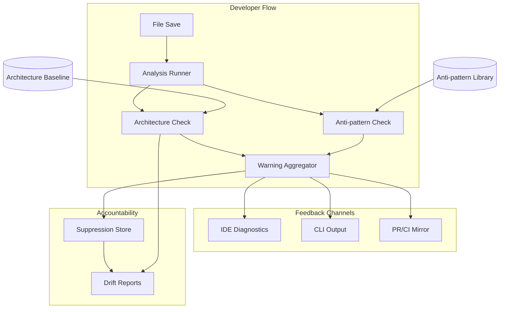

<!-- APS: See https://github.com/eddacraft/anvil-plan-spec for format reference -->
<!-- This document is non-executable. -->

# Anvil — Save-time Trust

> **🔒 Current release locked 2026-04-26; MCP path updated 2026-04-28:** A1
> (RTAI Spike + Rust MCP launch shim) + A2 (AIGUARD) + A3 (Release
> Engineering) + A4 (Language Credibility Floor). See
> [`RELEASE-PLAN.md`](../RELEASE-PLAN.md) for the full menu, prerequisites,
> and adversarial risks. See [`ROADMAP.md`](../ROADMAP.md) for thematic
> context across horizons.

## Overview

## Contents

- [Release Plan](#release-plan)
- [Branch Recovery](#branch-recovery-complete)
- [Hardening & Maintenance](#hardening--maintenance-in-progress)
- [Continuous Improvement](#continuous-improvement-complete)
- [Rust Engine](#rust-engine-in-progress)
- [Auth & Access](#auth--access-complete)
- [Dev Tooling Bridge](#dev-tooling-bridge-proposed)
- [Observability Foundation](#observability-foundation-draft)
- [Infrastructure as Code](#infrastructure-as-code-complete)
- [Web Dashboard](#web-dashboard-ready)
- [Policy Governance](#policy-governance-draftready)
- [Engineering Platform](#engineering-platform-draft)
- [Test Quality](#test-quality-readydraft)
- [Multi-Language Support](#multi-language-support-draft)
- [Config Intelligence](#config-intelligence-draft)
- [Graph Substrate](#graph-substrate-draft)
- [Rust MCP Launch Path](#rust-mcp-launch-path-in-progressdraft)
- [Intercept Loop](#intercept-loop-draft--no-code-yet)
- [Agent Infrastructure](#agent-infrastructure-draft--no-code-yet)

Anvil makes AI-generated code safe to merge by catching architecture boundary
violations and AI escape-hatch anti-patterns at file-save time. Developers get
actionable warnings before code leaves the file, with human-owned exceptions for
intentional deviations.

**Why this matters:** AI coding tools are accelerating development, but they
don't understand your architecture. They produce code that compiles and passes
tests, yet drifts from intended patterns. By the time drift is noticed in
review, it's already merged or too expensive to fix. Anvil catches it at the
moment of creation — when fixing is cheap.

**Product thesis:** Anvil improves trust in AI-generated code so more of it
reaches production faster, while architecture drift slows or reverses over time.

**Primary beneficiary:** Individual developers — they get to use AI safely at
the pace leadership expects.

## Problem & Success Criteria

**Problem:** The most damaging recurring failure is second-wave feature work
drifting from intended patterns because engineers:

- don't know which patterns apply
- don't read ADRs or architecture diagrams
- don't recognise when their change crosses a boundary

The most reliable early signal: a **new dependency edge** where a function or
class reaches across architectural contexts.

**Success Criteria:**

- [ ] 50%+ of developers run Anvil on every save (adoption) — post-release
- [ ] Time-to-merge for AI-assisted PRs does not increase (throughput) —
      post-release
- [ ] New cross-boundary edges per sprint decreases by 30% within 8 weeks
      (drift) — post-release
- [x] Save-time feedback latency < 2 seconds cached, < 5 seconds cold (speed)
- [ ] < 10% of warnings are suppressed without resolution (signal quality) —
      post-release

## Release Plan

Releases are themed by what they deliver, not sequenced by version number.
Individual packages still use semantic versioning for npm/cargo publishes.

### Edda Stack — Memory System (Done)

Kindling (observation), Ember (interpretation), Edda (canonical memory),
integration layer, and review backlog.

See [completed-index.aps.md](./completed-index.aps.md) for task tables.

### Branch Recovery (Complete)

Reconcile divergent `main`/`dev` histories by porting release-critical fixes
from `main` onto `dev`, validating as one integrated branch, then cutting over.
See `docs/runbooks/branch-reconciliation.md` and the freeze notice in
`RECONCILIATION-IN-PROGRESS.md`.

| Module                                                                  | Scope  | Status   | Progress |
| ----------------------------------------------------------------------- | ------ | -------- | -------- |
| [branch-reconciliation](./archive/modules/branch-reconciliation.aps.md) | BRECON | Complete | 14/14    |

### Hardening & Maintenance (In Progress)

Codebase cleanup, .anvil file format, and BMAD v4 compatibility.

| Module                                                                          | Scope  | Status      | Progress                                                                                                                                                                                                                                                                                                                                                                                    |
| ------------------------------------------------------------------------------- | ------ | ----------- | ------------------------------------------------------------------------------------------------------------------------------------------------------------------------------------------------------------------------------------------------------------------------------------------------------------------------------------------------------------------------------------------- |
| [codebase-maintenance](./archive/modules/codebase-maintenance.aps.md)           | MAINT  | Complete    | 11/11 (1 deferred)                                                                                                                                                                                                                                                                                                                                                                          |
| [anvil-file-format](./archive/modules/anvil-file-format.aps.md)                 | ANVFMT | Complete    | 15/16 (1 reparented to RSCAN-006 under ADR-026)                                                                                                                                                                                                                                                                                                                                             |
| [anvil-rust-scanner](./archive/modules/anvil-rust-scanner.aps.md)               | RSCAN  | Complete    | 8/8 (RSCAN-008 landed — docs now describe the authoritative Rust scanner and the scanner-parity story per ADR-026)                                                                                                                                                                                                                                                                          |
| [nx-task-migration](./archive/modules/nx-task-migration.aps.md)                 | NXTASK | Complete    | 6/6                                                                                                                                                                                                                                                                                                                                                                                         |
| [anvil-scanner-parity-gaps](./archive/modules/anvil-scanner-parity-gaps.aps.md) | SPG    | Complete    | 6/6 (`flags:"i"` honoured, lookaround rules handled via post-filters, doctor surfaces compile failures, fixtures cover every rule, `antipattern_scan` bench + trust-boundary docs landed)                                                                                                                                                                                                   |
| [anvil-ts-scanner-retirement](./modules/anvil-ts-scanner-retirement.aps.md)     | TSRET  | In Progress | 2/6 (TSRET-001 landed; TSRET-002 **Complete** 2026-04-23 under the ADR-030-reduced scope — napi stays private, CI matrix retained as canary; TSRET-003/-004 **superseded** by DRVR; TSRET-005 retained, blocks on DRVR; TSRET-006 added 2026-04-24 for transition-window engine-version diagnostics per council review M14)                                                                 |
| [bmad-v4-backward-compat](./modules/bmad-v4-backward-compat.aps.md)             | BMAD4  | Proposed    | 0/8                                                                                                                                                                                                                                                                                                                                                                                         |
| [scan-performance](./modules/scan-performance.aps.md)                           | SCAN   | In Progress | 3/5 (SCAN-001/-002/-003 landed as one slice — parallel-scan rollout, ReDoS line-length guard, first-run rayon pool cap; SCAN-004/-005 deferred per Council E "smallest viable cut")                                                                                                                                                                                                         |
| [nx-rust-plugin](./archive/modules/nx-rust-plugin.aps.md)                       | NXRUST | Complete    | 8/8 (6 delivered via upstream `eddacraft/nxrust` vendored into `tools/nx-rust/`; NXRUST-005/-006 superseded by `cargo metadata` inference — zero per-crate `project.json` needed)                                                                                                                                                                                                           |
| [rust-nx-migration](./archive/modules/rust-nx-migration.aps.md)                 | RUSTNX | Complete    | 9/9                                                                                                                                                                                                                                                                                                                                                                                         |
| [v041-release-followups](./modules/v041-release-followups.aps.md)               | V041F  | In Progress | 5/16 (16 hardening items: 10 from the council rounds, 1 from the copilot PR #1081 review, 3 from the v0.4.0-beta tag run + post-tag deploy — scoop PAT scope, winget gh arg regression, missing migration runner — 1 from the copilot PR #1090 review tracking the svix>uuid override exception, and 1 private-release Latest promotion fix; non-blocking for the H1 tag, slot into v0.4.1) |

**Design doc (Forge & Temper — archived):**
[docs/plans/2026-02-24-forge-temper-review-pipeline.md](../docs/plans/2026-02-24-forge-temper-review-pipeline.md)

### Continuous Improvement (Complete)

Codebase-maintenance drives ongoing refactoring, shared libraries, generators,
and DX improvements. Code-review-backlog (complete) is retained for history.

| Module                                                                | Scope | Status   | Progress           |
| --------------------------------------------------------------------- | ----- | -------- | ------------------ |
| [codebase-maintenance](./archive/modules/codebase-maintenance.aps.md) | MAINT | Complete | 11/11 (1 deferred) |
| [code-review-backlog](./archive/modules/code-review-backlog.aps.md)   | CRB   | Complete | 29/29              |

> ~~continuous-improvement~~ (CI) — retired 2026-04-18; was a meta-module
> without executable tasks. All concrete intents map onto MAINT. See
> [archived notice](./archive/modules/continuous-improvement.aps.md).

### Rust Engine (In Progress)

Rust kernel for structural graph analysis (KERN), performance-critical check
ports (RENG). RATS (Ratatui TUI) and PORT (Ink-to-Ratatui port) are complete.
TUIDASH adds a Rust-native json-render spec interpreter for Ratatui dashboard
rendering. KERN is complete (3 daemon-mode items deferred post-H1), RENG is
complete, RCLI is complete.

| Module                                                                    | Scope   | Status      | Progress                                                                                                          | Dependencies                                                                                                                                                                                                                                                                       |
| ------------------------------------------------------------------------- | ------- | ----------- | ----------------------------------------------------------------------------------------------------------------- | ---------------------------------------------------------------------------------------------------------------------------------------------------------------------------------------------------------------------------------------------------------------------------------- |
| [rust-kernel](./archive/modules/rust-kernel.aps.md)                       | KERN    | Complete    | 22/25 (3 superseded by INTD per ADR-030 — KERN-050 → INTD-002, KERN-051 → INTD-002+INTD-013, KERN-052 → INTD-003) | —                                                                                                                                                                                                                                                                                  |
| [rust-core-engine](./archive/modules/rust-core-engine.aps.md)             | RENG    | Complete    | 6/6                                                                                                               | KERN Phase 1, KERN Phase 2                                                                                                                                                                                                                                                         |
| [ratatui-tui](./archive/modules/ratatui-tui.aps.md)                       | RATS    | Complete    | 7/7                                                                                                               | KERN Phase 3                                                                                                                                                                                                                                                                       |
| [ink-to-ratatui-port](./archive/modules/ink-to-ratatui-port.aps.md)       | PORT    | Complete    | 15/15                                                                                                             | RATS-001 (complete)                                                                                                                                                                                                                                                                |
| [rust-cli](./archive/modules/rust-cli.aps.md)                             | RCLI    | Complete    | 64/64                                                                                                             | KERN, RATS, PORT                                                                                                                                                                                                                                                                   |
| [kernel-benchmarking](./archive/modules/kernel-benchmarking.aps.md)       | BENCH   | Complete    | 16/16                                                                                                             | KERN Phases 1-2                                                                                                                                                                                                                                                                    |
| [tui-dashboard-render](./modules/tui-dashboard-render.aps.md)             | TUIDASH | Draft       | 0/12                                                                                                              | RATS (complete), DASHAI (parallel; not blocking)                                                                                                                                                                                                                                   |
| [launch-flow-readiness](./modules/launch-flow-readiness.aps.md)           | LAUNCH  | In Progress | 5/7                                                                                                               | RCLI, KERN; coordinates with TUIDASH, DRVR; supersedes RTVS in part                                                                                                                                                                                                                |
| [realtime-ai-validation](./modules/realtime-ai-validation.aps.md)         | RTAI    | Ready       | 1/9                                                                                                               | Blocks on INTD-002/-003/-005/-013/-014, DRVR-001/-002; coordinates with DRVR-003/-004, LAUNCH, anvil-checks; supersedes RTVF — RTAI-001 phase-0 spike landed 2026-04-26 ([report](./specs/2026-04-26-rtai-001-spike-report.md)) promoted module Proposed → Ready per RTAI-001 gate |
| [rust-cli-tier2](./modules/rust-cli-tier2.aps.md)                         | RCLI2   | In Progress | 4/8                                                                                                               | RCLI; RCLI2-001..-004 shipped per 2026-04-26 freshness audit (commits 1e44ef2d / c5679432 / a2297dca / 06d764d4); -005..-008 still Proposed (gated on OPAE)                                                                                                                        |
| [rust-cli-tier3](./modules/rust-cli-tier3.aps.md)                         | RCLI3   | In Progress | 1/20                                                                                                              | RCLI                                                                                                                                                                                                                                                                               |
| [tui-polish](./archive/modules/tui-polish.aps.md)                         | POLISH  | Complete    | 8/8                                                                                                               | RCLI, RATS                                                                                                                                                                                                                                                                         |
| [restore-welcome-screen](./archive/modules/restore-welcome-screen.aps.md) | WELCOME | Complete    | 18/18                                                                                                             | RCLI, RATS                                                                                                                                                                                                                                                                         |
| [distribution-pipeline](./archive/modules/distribution-pipeline.aps.md)   | DIST    | Complete    | 8/10 (1 deferred, 1 optional-deferred)                                                                            | RCLI                                                                                                                                                                                                                                                                               |

The TypeScript CLI is archived — the Rust kernel adds structural graph analysis
as a new capability (KERN), existing checks port to Rust for speed (RENG), TUI
surfaces use Ratatui (RATS), and existing Ink surfaces are ported systematically
(PORT). See
[Architecture Evolution](../docs/architecture/anvil-architecture-evolution.md)
for the phased rollout plan.

### Auth & Access (Complete)

Streamline beta access: device code + email OTP activation flows, JWT session
model with rotating refresh tokens, admin CLI approval, Resend audience
management. Docs auth gating adds GitHub OAuth as a third activation mechanism
and gates `/anvil` docs behind it via Vercel Edge.

| Module                                                                | Scope     | Status   | Progress | Dependencies |
| --------------------------------------------------------------------- | --------- | -------- | -------- | ------------ |
| [beta-auth-streamline](./archive/modules/beta-auth-streamline.aps.md) | BAUTH     | Complete | 20/20    | —            |
| [docs-auth-gating](./archive/modules/docs-auth-gating.aps.md)         | DOCSAUTH  | Complete | 7/7      | BAUTH, IAC   |
| [admin-cli](./archive/modules/admin-cli.aps.md)                       | ADMINCLI  | Complete | 13/13    | BAUTH        |
| [admin-cli-hardening](./archive/modules/admin-cli-hardening.aps.md)   | ADMINCLIH | Complete | 4/4      | ADMINCLI     |

**Design specs:**

- `docs/specs/2026-03-15-beta-auth-streamline-design.md`
- `plans/specs/2026-04-03-docs-auth-gating-design.md`
- `plans/specs/2026-04-16-admin-cli-design.md`

### Dev Tooling Bridge (Proposed)

Connect the LLM-powered council review flow to Anvil's deterministic attestation
format. Discovery-first: understand the interface before building.

| Module                                                      | Scope | Status   | Progress | Dependencies |
| ----------------------------------------------------------- | ----- | -------- | -------- | ------------ |
| [council-gate-bridge](./modules/council-gate-bridge.aps.md) | CGBDG | Proposed | 0/6      | —            |

### Observability Foundation (Draft)

Unified observability: telemetry contracts, Neon health instrumentation,
dashboard ops data contract, alert thresholds, runbook pack. 5 tasks.

| Module                                                                | Scope | Status | Progress | Dependencies                              |
| --------------------------------------------------------------------- | ----- | ------ | -------- | ----------------------------------------- |
| [observability-foundation](./modules/observability-foundation.aps.md) | OBS   | Draft  | 0/5      | kindling-integration, dashboard-ops-views |

### Infrastructure as Code (In Progress)

Pulumi-managed infrastructure: Vercel projects, Azure DNS, backend migration to
Azure Blob Storage + KeyVault. EDGE module (Azure Front Door multi-origin edge
layer) in flight per ADR-032.

| Module                                                                    | Scope | Status   | Progress | Dependencies                                                                                                                                       |
| ------------------------------------------------------------------------- | ----- | -------- | -------- | -------------------------------------------------------------------------------------------------------------------------------------------------- |
| [pulumi-iac](./archive/modules/pulumi-iac.aps.md)                         | IAC   | Complete | 20/20    | —                                                                                                                                                  |
| [database-consolidation](./archive/modules/database-consolidation.aps.md) | DBCON | Complete | 4/4      | IAC                                                                                                                                                |
| [edge](./modules/edge.aps.md)                                             | EDGE  | Ready    | 0/24     | IAC; coordinates with OBS (Log Analytics workspace), Vercel origins, and 8-week Azure-hosted origin commit. AFD Standard, Australia East. ADR-032. |

### Web Dashboard (Ready)

Browser-based interface for exploring Anvil data. Built into `apps/website/`
(Next.js 16 + shadcn/ui + Recharts). Four execution waves; 39 tasks total.

| Module                                                                        | Scope    | Status | Progress | Wave | Dependencies                                                             |
| ----------------------------------------------------------------------------- | -------- | ------ | -------- | ---- | ------------------------------------------------------------------------ |
| [dashboard-foundation](./modules/dashboard-foundation.aps.md)                 | DASH     | Ready  | 1/9      | 1    | apps/website, contracts                                                  |
| [dashboard-core-views](./modules/dashboard-core-views.aps.md)                 | DASHCORE | Ready  | 0/9      | 2    | dashboard-foundation                                                     |
| [dashboard-architecture-views](./modules/dashboard-architecture-views.aps.md) | DASHARCH | Ready  | 0/8      | 2    | dashboard-foundation, architecture-safety, drift-reporting, suppressions |
| [dashboard-ops-views](./modules/dashboard-ops-views.aps.md)                   | DASHOPS  | Ready  | 0/7      | 3    | dashboard-foundation                                                     |
| [dashboard-ai-builder](./modules/dashboard-ai-builder.aps.md)                 | DASHAI   | Draft  | 0/6      | 4    | dashboard-foundation                                                     |

**Why Dashboard:** The CLI remains the primary developer interface; the
dashboard serves team leads, platform engineers, and compliance roles who need
persistent views, historical trends, and graphical visualisations that a
terminal cannot provide. See [brainstorm](./brainstorms/dashboard-web-ui.md) and
[json-render approach](./brainstorms/json-render-dashboard.md) for background.

### Policy Governance (Draft/Ready)

Organisational policy governance: multi-level inheritance, lifecycle management,
compliance reporting, federation, and agent orchestration. Policy governance
tasks now reference Rust crates (anvil-kernel, anvil-policy, anvil-cli) as the
implementation targets.

| Module                                                                            | Scope   | Status   | Dependencies                                                                                                                                        |
| --------------------------------------------------------------------------------- | ------- | -------- | --------------------------------------------------------------------------------------------------------------------------------------------------- |
| [opa-enhancements](./modules/opa-enhancements.aps.md)                             | OPAE    | Draft    | opa-architecture-integration, crates/anvil-kernel, crates/anvil-tui                                                                                 |
| [org-policy-hierarchy](./modules/org-policy-hierarchy.aps.md)                     | ORGHIER | Draft    | opa-architecture-integration, policy-pack-validation, opa-enhancements, crates/anvil-policy                                                         |
| [policy-lifecycle](./modules/policy-lifecycle.aps.md)                             | POLLC   | Draft    | opa-architecture-integration, policy-pack-validation, org-policy-hierarchy, crates/anvil-policy                                                     |
| [compliance-reporting](./modules/compliance-reporting.aps.md)                     | COMPLY  | Draft    | org-policy-hierarchy, policy-lifecycle, drift-reporting, suppressions, crates/anvil-policy                                                          |
| [policy-federation](./modules/policy-federation.aps.md)                           | POLFED  | Draft    | opa-enhancements, org-policy-hierarchy, policy-lifecycle, policy-pack-validation, crates/anvil-policy                                               |
| [policy-pack-validation](./modules/policy-pack-validation.aps.md)                 | POLVAL  | Draft    | opa-architecture-integration, crates/anvil-policy                                                                                                   |
| [architecture-config-validation](./modules/architecture-config-validation.aps.md) | ARCHCFG | Draft    | opa-architecture-integration, architecture-safety, crates/anvil-kernel                                                                              |
| [ai-guardrail-profile](./modules/ai-guardrail-profile.aps.md)                     | AIGUARD | Complete | crates/anvil-cli, crates/anvil-kernel-types, crates/anvil-kernel, crates/anvil-architecture, crates/anvil-checks, crates/anvil-policy; diagnostic envelope shared with RTAI/INTD/DRVR/RMCP |
| [opa-agent-orchestration](./modules/opa-agent-orchestration.aps.md)               | OPAG    | Ready    | opa-architecture-integration, opa-enhancements, architecture-safety, mcp-server                                                                     |
| [eval-harness-integration](./modules/eval-harness-integration.aps.md)             | EVAL    | Ready    | opa-enhancements, opa-agent-orchestration, drift-reporting                                                                                          |
| [compliance-evidence-workspace](./modules/compliance-evidence-workspace.aps.md)   | CEWS    | Draft    | compliance-reporting, policy-lifecycle, eval-harness-integration                                                                                    |
| [contextual-policy-assertions](./modules/contextual-policy-assertions.aps.md)     | CPOL    | Ready    | opa-enhancements, opa-agent-orchestration                                                                                                           |
| [io-risk-controls](./modules/io-risk-controls.aps.md)                             | IORISK  | Ready    | opa-enhancements, opa-agent-orchestration                                                                                                           |
| [gateway-control-plane-patterns](./modules/gateway-control-plane-patterns.aps.md) | GATE    | Ready    | opa-agent-orchestration, mcp-server                                                                                                                 |
| [adversarial-testing-catalog](./modules/adversarial-testing-catalog.aps.md)       | ATC     | Ready    | eval-harness-integration, opa-agent-orchestration                                                                                                   |
| [prompt-attack-regression-packs](./modules/prompt-attack-regression-packs.aps.md) | PATT    | Ready    | adversarial-testing-catalog, eval-harness-integration                                                                                               |
| [trust-center-automation](./modules/trust-center-automation.aps.md)               | TRUST   | Ready    | compliance-evidence-workspace, compliance-reporting                                                                                                 |
| [agent-governance-patterns](./modules/agent-governance-patterns.aps.md)           | AGOV    | Draft    | opa-enhancements, ember                                                                                                                             |
| [compliance-policy-packs](./modules/compliance-policy-packs.aps.md)               | CPACKS  | Draft    | opa-enhancements, policy-pack-validation                                                                                                            |

**Why Policy:** Builds on the single-repo OPA infrastructure from 0.1.0.
Requires multi-repo awareness, hierarchy resolution, and fleet-level aggregation
that only make sense after the core policy engine is battle-tested.

### Engineering Platform (Draft)

Cross-cutting concerns that span all packages and releases. Promoted to Ready
when specific work is identified.

| Module                                                                                                | Scope      | Est. Tasks | Dependencies                                                                                                                                                                                                                                                                                                                                                                                                                                                   |
| ----------------------------------------------------------------------------------------------------- | ---------- | ---------- | -------------------------------------------------------------------------------------------------------------------------------------------------------------------------------------------------------------------------------------------------------------------------------------------------------------------------------------------------------------------------------------------------------------------------------------------------------------- |
| [api-governance](./modules/api-governance.aps.md)                                                     | APGOV      | 7          | anvil-api (Hono), crates/anvil-cli                                                                                                                                                                                                                                                                                                                                                                                                                             |
| [feature-flagging](./archive/modules/feature-flagging.aps.md)                                         | FLAGS      | 9/9        | BAUTH, DOCSAUTH, OPAG, observability-foundation — **Complete**                                                                                                                                                                                                                                                                                                                                                                                                 |
| [feature-flag-migration](./archive/modules/feature-flag-migration.aps.md)                             | FLAGM      | 6/6        | FLAGS (complete), BAUTH, DOCSAUTH, RCLI — **Complete**                                                                                                                                                                                                                                                                                                                                                                                                         |
| [feature-flag-catalogue](./modules/feature-flag-catalogue.aps.md)                                     | FLAGCAT    | 0/6        | FLAGS (complete), FLAGM (complete) — **Draft**                                                                                                                                                                                                                                                                                                                                                                                                                 |
| [check-language-and-onboarding](./archive/modules/check-language-and-onboarding.aps.md)               | CLAR       | 9/9        | discovery and alignment complete; `CLAR-006` -> `QLRUN-001`, `CLAR-007` -> `QLODX-001`, `CLAR-008` -> `QLODX-002` — **Complete**                                                                                                                                                                                                                                                                                                                               |
| [quality-language-runtime-alignment](./archive/modules/quality-language-runtime-alignment.aps.md)     | QLRUN      | 1/1        | CLAR (complete), rust-cli runtime/config surfaces — **Complete**                                                                                                                                                                                                                                                                                                                                                                                               |
| [quality-language-onboarding-and-docs](./archive/modules/quality-language-onboarding-and-docs.aps.md) | QLODX      | 2/2        | QLRUN, welcome/tutorial/docs surfaces — **Complete**                                                                                                                                                                                                                                                                                                                                                                                                           |
| [notification-framework](./archive/modules/notification-framework.aps.md)                             | NOTIFY     | 9/9        | CLAR, INTD, current CLI/TUI surfaces — **Complete** (doctor/audit alignment, shared TUI `NotificationSource`, telemetry contract, intercept integration spec)                                                                                                                                                                                                                                                                                                  |
| [command-safety-surfaces](./archive/modules/command-safety-surfaces.aps.md)                           | CMDSH      | 4/4        | CLAR, NOTIFY, INTD, anvil-checks command_safety — **Complete**                                                                                                                                                                                                                                                                                                                                                                                                 |
| [security](./modules/security.aps.md)                                                                 | SEC        | 6          | CI pipeline, cargo audit, pnpm audit                                                                                                                                                                                                                                                                                                                                                                                                                           |
| [testing-strategy](./modules/testing-strategy.aps.md)                                                 | TEST       | 6          | eslint-plugin-anvil, e2e, Rust test suites                                                                                                                                                                                                                                                                                                                                                                                                                     |
| [release-management](./archive/modules/release-management.aps.md)                                     | RELMGMT    | 15/15      | CI pipeline, all packages and crates, DIST — **Complete**                                                                                                                                                                                                                                                                                                                                                                                                      |
| [documentation-sync](./modules/documentation-sync.aps.md)                                             | DOCSYNC    | 11/22      | docs-site, feature modules — **In Progress** (Rust-migration phase 9/10; Future now includes 0.3.2/0.3.3 + final release-scope refresh; 10 remaining Future/Scanner items Draft)                                                                                                                                                                                                                                                                               |
| [schema-contracts](./modules/schema-contracts.aps.md)                                                 | SCHEMA     | 6          | anvil-core, anvil-kernel-types                                                                                                                                                                                                                                                                                                                                                                                                                                 |
| [git-config-hooks](./archive/modules/git-config-hooks.aps.md)                                         | GHOOK      | 6/6        | crates/anvil-cli, crates/anvil-tui, docs/public/anvil/, Git 2.54 hook API — **Complete** (GHOOK-001 baseline + rollout policy; GHOOK-002 `--config` install/uninstall landed; GHOOK-003 status/doctor/onboarding/tutorial detect config-mode entries; GHOOK-004 coexistence detection + duplicate-execution warnings; GHOOK-005 accepted **Option A — keep Husky** with dev runner on Git 2.51 as the decisive constraint; GHOOK-006 public docs sweep landed) |
| [eddacraft-tui-shared](./archive/modules/eddacraft-tui-shared.aps.md)                                 | TUIEXTRACT | 7/7        | eddacraft-tui, RATS (done) — **Complete**                                                                                                                                                                                                                                                                                                                                                                                                                      |
| [attribution-pipeline-v3](./modules/attribution-pipeline-v3.aps.md)                                   | ATTRIB     | 3/11       | tools/starters/acknowledgements/ (kit + parameterised generator), cargo-about, deny.toml — **In Progress** (owner: joshuaboys; ATTRIB-001/002/003 landed; v1 entry points retired)                                                                                                                                                                                                                                                                             |

### Test Quality (Ready/Draft)

CI infrastructure repair, coverage uplift to ≥80% for targeted packages/crates,
integration boundary testing, and external service contract tests. Implements
the strategy defined in TEST (Engineering Platform). TFIX is the prerequisite;
TCOV/TINT/TEXT depend on it.

| Module                                                                      | Scope | Status      | Progress                                                                                   | Dependencies            |
| --------------------------------------------------------------------------- | ----- | ----------- | ------------------------------------------------------------------------------------------ | ----------------------- |
| [test-infrastructure-fix](./archive/modules/test-infrastructure-fix.aps.md) | TFIX  | Complete    | 11/11                                                                                      | —                       |
| [test-coverage-uplift](./modules/test-coverage-uplift.aps.md)               | TCOV  | In Progress | 14/25 (Phase 1+2 complete: 13/13; Phase 3: 1/8; Phase 4: 4 blocked — scope refresh needed) | TFIX                    |
| [test-integration-surface](./modules/test-integration-surface.aps.md)       | TINT  | Draft       | 0/15                                                                                       | TFIX, partial RCLI/KERN |
| [test-external-services](./modules/test-external-services.aps.md)           | TEXT  | Draft       | 0/14                                                                                       | TFIX                    |

### Language & Coverage (Draft)

Coverage strategy is defined by the
[2026-04-08 Language and Coverage Design](./specs/2026-04-08-language-and-coverage-design.md)
(refreshed 2026-04-19). The flat "ten languages" placeholder list has been
replaced with **five parallel tracks**, ranked against demand × blast radius ×
strategic fit per spec §6. The original `lang-*.aps.md` placeholders for Dart,
Go, Java, Kotlin, .NET, C/C++, Swift, Zig have been **archived** now that their
content is folded into the new modules; `lang-rust.aps.md` and
`lang-python.aps.md` have been **rewritten in place** as Track 1 anchors.

- **Phase 1 (MVP)**: TS audit + SQL migrations T2 + Pulumi pack + LLM Provider
  pack (warn-only). Spec §9 steps 1–4.
- **Phase 2** (named deliverables complete): Rust → T3, GH Actions T2, Drizzle
  pack, tail T1 wave, Python → T3, Python-substrate LLM Provider, Next.js, Hono,
  Tokio packs, Markdown M1. Spec §9 steps 5–14.
- **Phase 3 / open-ended**: remaining surfaces (Dockerfile, shell, `.env`),
  remaining packs (Django, FastAPI, Axum). Demand-pulled.
- **Cut entirely** (spec §13): Swift, Zig, Express, NestJS, Flask, Spring,
  Rails, tRPC, CloudFormation, Bicep, Ansible, Jenkins Groovy, Buildkite,
  CircleCI.

#### Track 1 — Anchors (TS, Rust, Python → T3)

Heavy, sequenced. TS audit produces the T3 acceptance checklist that Rust and
Python must hit. Spec §7, §8.1.

| Module                                          | Scope  | Status | Phase | Spec ref                                                                                                                                                   |
| ----------------------------------------------- | ------ | ------ | ----- | ---------------------------------------------------------------------------------------------------------------------------------------------------------- |
| [lang-ts-audit](./modules/lang-ts-audit.aps.md) | LANGTS | Ready  | 1     | §7.3, §8.1 — 2/5; promoted to Ready 2026-04-26 after anchor re-scoring gate (TS still anchor zero; Rust catching up — flagged for separate RSTLAN re-eval) |
| [lang-rust](./modules/lang-rust.aps.md)         | RSTLAN | Draft  | 2     | §8.1                                                                                                                                                       |
| [lang-python](./modules/lang-python.aps.md)     | PYLAN  | Draft  | 2     | §8.1                                                                                                                                                       |

#### Track 2 — Tail T1 wave (single batched sprint)

Bring tail languages to T1 (parsed + symbol graph inclusion) in one sprint.
Replaces the six per-language placeholder modules (now archived).

| Module                                            | Scope    | Status | Phase | Languages                                                             |
| ------------------------------------------------- | -------- | ------ | ----- | --------------------------------------------------------------------- |
| [lang-tail-wave](./modules/lang-tail-wave.aps.md) | LANGTAIL | Draft  | 2     | Dart, Go, Java, Kotlin, .NET/C#, C/C++ (C/C++ at-risk per spec §12.3) |

**Archived placeholder modules** (content folded into `lang-tail-wave`):
[lang-dart](./archive/modules/lang-dart.aps.md),
[lang-go](./archive/modules/lang-go.aps.md),
[lang-java](./archive/modules/lang-java.aps.md),
[lang-kotlin](./archive/modules/lang-kotlin.aps.md),
[lang-dotnet](./archive/modules/lang-dotnet.aps.md),
[lang-c-cpp](./archive/modules/lang-c-cpp.aps.md).

**Cut entirely** (spec §13, no demand):
[lang-swift](./archive/modules/lang-swift.aps.md),
[lang-zig](./archive/modules/lang-zig.aps.md). Re-enter only with a demand
signal.

#### Track 3 — Governance surfaces (pattern catalogues)

Pattern-catalogue work, not parser work. Surfaces ranked by demand × blast
radius × strategic per spec §8.3.

| Module                                                            | Scope    | Surface             | Target tier | Status      | Phase |
| ----------------------------------------------------------------- | -------- | ------------------- | ----------- | ----------- | ----- |
| [surface-sql-migrations](./modules/surface-sql-migrations.aps.md) | SURFSQL  | SQL migrations      | T2          | Draft       | 1     |
| [surface-github-actions](./modules/surface-github-actions.aps.md) | SURFGHA  | GitHub Actions YAML | T2          | Draft       | 2     |
| [surface-dockerfile](./modules/surface-dockerfile.aps.md)         | SURFDOCK | Dockerfile          | T2          | Draft       | 3     |
| [surface-shell](./modules/surface-shell.aps.md)                   | SURFSH   | Shell scripts       | T1          | Draft       | 3     |
| [surface-env-files](./modules/surface-env-files.aps.md)           | SURFENV  | `.env` files        | T1          | In Progress | 3     |

Mostly deferred: Terraform / HCL (T1, demand=1 indirect via Pulumi), k8s YAML /
Helm (T1, no demand) — promotion gated on direct user demand.

#### Track 4 — Semantic packs (substrate-gated)

Domain-specific packs layered on anchor languages. Each pack declares its
substrate language and minimum substrate tier per spec §8.4.

| Module                                                  | Scope   | Substrate       | Min substrate tier     | Status                                 | Phase               |
| ------------------------------------------------------- | ------- | --------------- | ---------------------- | -------------------------------------- | ------------------- |
| [pack-pulumi](./modules/pack-pulumi.aps.md)             | PACKPUL | TS              | T3                     | Draft                                  | 1                   |
| [pack-llm-provider](./modules/pack-llm-provider.aps.md) | PACKLLM | TS, then Python | T3 (TS) → T2+ (Python) | Draft (warn-only by default per C-010) | 1 (TS) + 2 (Python) |
| [pack-drizzle](./modules/pack-drizzle.aps.md)           | PACKDRZ | TS              | T3                     | Draft                                  | 2                   |
| [pack-nextjs](./modules/pack-nextjs.aps.md)             | PACKNXT | TS              | T3                     | Draft                                  | 2                   |
| [pack-hono](./modules/pack-hono.aps.md)                 | PACKHON | TS              | T3                     | Draft                                  | 2                   |
| [pack-tokio](./modules/pack-tokio.aps.md)               | PACKTOK | Rust            | T2+                    | Draft                                  | 2                   |

**Phase 3 / open-ended packs** (spec §17.3 final paragraph): Django, FastAPI,
Axum — module files created only when promoted from Phase 3 to active work.
Django/FastAPI gated on User C's framework choice resolving.

#### Track 5 — Markdown governance

Markdown is its own track because it fits none of the other axes. Initial target
M1 = APS wellformedness + cross-reference integrity (spec §8.5). M2 (stale claim
detection) and M3 (capability-aware) queue for later.

| Module                                                      | Scope | Tier target | Status | Phase |
| ----------------------------------------------------------- | ----- | ----------- | ------ | ----- |
| [markdown-governance](./modules/markdown-governance.aps.md) | MDGOV | M1          | Draft  | 2     |

Crate assignment per [ADR-028](./decisions/028-markdown-governance-crate.md):
standalone Rust crate `crates/anvil-markdown-governance/` using `pulldown-cmark`
— **not** the Rust kernel.

#### Cross-track infrastructure

One module owns the operational concerns every Track 3/4 module needs. Without
it, each new module would re-design the same plumbing.

| Module                                                            | Scope | Status | Notes                                                                                                                                                                                                                                                                                          |
| ----------------------------------------------------------------- | ----- | ------ | ---------------------------------------------------------------------------------------------------------------------------------------------------------------------------------------------------------------------------------------------------------------------------------------------- |
| [operational-supplement](./modules/operational-supplement.aps.md) | OPSUP | Draft  | Stable check-ID registry building on `check_catalog.rs`, drift schema versioning + `anvil drift migrate`, per-track feature flags, CI wall-time budget + file-presence guards, FP reporting channel. Council §16.5 #7. Delivered in slices — surfaces can move to Ready against partial OPSUP. |

#### Supporting decisions

| ADR                                                        | Decision                                                                                      | Status   | Gates                       |
| ---------------------------------------------------------- | --------------------------------------------------------------------------------------------- | -------- | --------------------------- |
| [ADR-027](./decisions/027-pack-architecture.md)            | Per-pack crate, symbol-graph access, compiled-in activation                                   | Proposed | All Track 4 packs           |
| [ADR-028](./decisions/028-markdown-governance-crate.md)    | Standalone Rust crate `crates/anvil-markdown-governance/` with `pulldown-cmark`               | Proposed | MDGOV                       |
| [ADR-029](./decisions/029-suppression-parser-authority.md) | Rust suppression parser is authoritative for new surfaces; no new comment styles in TS parser | Proposed | All Track 3 surfaces, MDGOV |

#### Supporting process

- [Anchor re-scoring process](../docs/guides/anchor-rescoring-process.md) — gate
  run before each Track 1 anchor module starts. Required by council §16.5 #8.
  Permanent owner not yet named (each invocation names a session owner).

#### Reconciliation status (spec §17.3)

| #   | Action                                                            | Status                            |
| --- | ----------------------------------------------------------------- | --------------------------------- |
| 1   | Archive `lang-swift.aps.md`, `lang-zig.aps.md` (cut)              | ✅ Done                           |
| 2   | Merge six tail languages into `lang-tail-wave.aps.md`             | ✅ Done (placeholders archived)   |
| 3   | Rewrite `lang-rust.aps.md` for T3 (incorporates §16.5 #3, #5, #8) | ✅ Done (RSTLAN module rewritten) |
| 4   | Rewrite `lang-python.aps.md` for T3                               | ✅ Done (PYLAN module rewritten)  |
| 5   | Create five surface modules (Phase 1 priority: SURFSQL)           | ✅ Done                           |
| 6   | Create six pack modules (Phase 1 priority: PACKPUL, PACKLLM)      | ✅ Done                           |
| 7   | Create `markdown-governance.aps.md`                               | ✅ Done                           |
| 8   | Replace Multi-Language section in `index.aps.md`                  | ✅ Done                           |

#### Outstanding council §16.5 items

| Item                                                                                                                                                | Status                                                                           |
| --------------------------------------------------------------------------------------------------------------------------------------------------- | -------------------------------------------------------------------------------- |
| §16.5 #3 — kernel prerequisite work (extractor refactor, grammar version in cache key, parser thread-safety, panic removal, grammar maturity audit) | Captured in LANGTS Ready Checklist; needs implementation                         |
| §16.5 #4 — pack architecture                                                                                                                        | ✅ ADR-027 (Proposed)                                                            |
| §16.5 #5 — Rust T3 architecture enforcement location                                                                                                | Captured in RSTLAN Ready Checklist; ADR not yet written                          |
| §16.5 #7 — operational supplement                                                                                                                   | ✅ OPSUP module created                                                          |
| §16.5 #8 — anchor re-scoring process gate                                                                                                           | ✅ Process guide created; permanent owner still open                             |
| §16.5 #9 — acceptance bar revision (FP rate < N% AND ≥1 external codebase)                                                                          | Captured in each module's Ready Checklist; canonical wording not yet centralised |
| §16.5 #10 — Markdown M1 acceptance softening                                                                                                        | Captured inline in MDGOV                                                         |
| §16.5 #11 — Markdown crate assignment                                                                                                               | ✅ ADR-028 (Proposed)                                                            |
| §16.5 #12 — parallelism-is-logical-dependency clarification                                                                                         | Inline in spec §9; track modules inherit                                         |
| Council C-025 — suppression parser authority                                                                                                        | ✅ ADR-029 (Proposed)                                                            |

### Config Intelligence (Draft)

Extract dependency graphs and project structure from config files (package.json,
Cargo.toml, go.mod, tsconfig.json, etc.) without language- specific analysers.
Feeds the architecture edge detector with dependency graph data.

| Module                                                      | Scope  | Est. Tasks | Dependencies        |
| ----------------------------------------------------------- | ------ | ---------- | ------------------- |
| [config-intelligence](./modules/config-intelligence.aps.md) | CFGINT | 7          | architecture-safety |

### Graph Substrate (Draft)

Persistent joined graph substrate for deterministic enforcement, provenance,
trust, control/session joins, and optional assistant context projection. Graph
v2 is Anvil-first; agent context delivery consumes projections over that same
trusted model.

| Module | Scope | Status | Progress | Dependencies |
| ------ | ----- | ------ | -------- | ------------ |
| [graph-v2-foundation](./modules/graph-v2-foundation.aps.md) | GV2 | Draft | 0/12 | KERN, ADR-015, ADR-030, ADR-031, EDDA |
| [graph-context-delivery](./modules/graph-context-delivery.aps.md) | GCTX | Draft | 0/13 | GV2 |

### Rust MCP Launch Path (In Progress/Draft)

Current-release Rust MCP launch shim plus next-release full parity port. The
current release ships only the narrow A1 path: `anvil mcp install` writes client
config, clients launch `anvil mcp serve --stdio`, and the Rust server validates
proposed writes before they land. Full TS MCP server parity is next-release work.

| Module | Scope | Status | Progress | Dependencies |
| ------ | ----- | ------ | -------- | ------------ |
| [rust-mcp-launch-shim](./modules/rust-mcp-launch-shim.aps.md) | RMCP | In Progress | 4/8 | RCLI3-016/-016b, RTAI, AIGUARD-002, anvil-checks; daemon preferred but embedded fallback allowed |
| [rust-mcp-full-port](./modules/rust-mcp-full-port.aps.md) | RMCPF | Draft | 0/9 | RMCP, DRVR, packages/mcp-server |

### Intercept Loop (Draft — no code yet)

Host-local enforcement daemon that detects policy violations from AI agent file
changes and interrupts the correct session via process-group control.
Shell-first, single-host initially, proving the core enforcement thesis. See
[design spec](./specs/anvil-driver-framework/) for the broader driver framework
vision.

**Implementation state:** No intercept crates exist in `crates/`. These modules
are still plans, but the current release pulls a narrow A1 subset from INTD and
INTR to support RMCP pre-write validation. Full wrapped-launch enforcement and
broader driver-framework work remain queued after the launch shim.

<!--
  INTD count history:
  - Pre-NOTIFY-009: index claimed 0/11, module already had 12 tasks (001–012) — off-by-one.
  - NOTIFY-009 added INTD-013 to mirror control decisions onto telemetry.
  - 2026-04-24 council review M1/M5/M9 filed INTD-014 (JSON-RPC 2.0
    conformance + latency benchmark), INTD-015 (daemon-enforced
    telemetry subscription scoping), INTD-016 (DoS protection budgets).
  - Net: module now has 16 tasks; index reconciled to 0/16.

  Note: this comment lives ABOVE the table because an HTML comment between
  table rows terminates the markdown table semantically; oxfmt then sees the
  post-comment rows as orphaned prose and rewraps them. Keeping the comment
  here ensures the four module rows below form one contiguous, valid table.
-->

| Module | Scope | Status | Progress | Dependencies |
| ------ | ----- | ------ | -------- | ------------ |
| [intercept-daemon](./modules/intercept-daemon.aps.md) | INTD | Draft | 0/16 | anvil-checks, anvil-kernel (watcher), INTR, INTL, NOTIFY |
| [intercept-launcher](./modules/intercept-launcher.aps.md) | INTL | Draft | 0/9 | INTD |
| [intercept-rules](./modules/intercept-rules.aps.md) | INTR | Draft | 0/8 | anvil-checks, GV2 later for hot-read rules only |
| [surface-drivers](./modules/surface-drivers.aps.md) | DRVR | Draft | 0/6 active (2 superseded/deferred) | INTD-002/-003/-005/-013/-015, ADR-030, RMCP/RMCPF sequencing, GV2 control/session graph later — supersedes TSRET-003/-004 (KERN-050/-051/-052 superseded-into-INTD per ADR-030); DRVR-004 superseded by RMCP/RMCPF; DRVR-006 deferred to RMCPF |

**Architecture Decisions:**
[D-015: Intercept Loop Enforcement](./decisions/015-intercept-loop-enforcement.md),
[D-030: Surface Drivers Supersede napi Cutover](./decisions/030-surface-drivers-supersede-napi-cutover.md)

### Agent Infrastructure (Draft — no code yet)

Thin, provider-agnostic agent runtime (weave, Apache-2.0) in standalone repo
(`eddacraft/weave-rs`) plus Anvil-specific harness (anvil-weave) with zero-copy
semantic graph access.

**Implementation state:** No `literate-core` or `anvil-agent` crates exist in
this repo. The upstream runtime lives at `~/Projects/src/weave-rs` (see memory:
reference_weave_rs). This module is a greenfield import plus harness build —
schedule after the intercept-loop thesis is proven.

| Module                          | Scope           | Status | Progress | Dependencies            |
| ------------------------------- | --------------- | ------ | -------- | ----------------------- |
| [weave](./modules/weave.aps.md) | WEAVE, AHARNESS | Draft  | 0/21     | KERN (anvil-weave only) |

**Architecture Decision:**
[D-024: Internal Agent Harness](./decisions/024-internal-agent-harness.md)

### Future

| Module | Scope | Description | Status |
| ------ | ----- | ----------- | ------ |
| [open-spec-adapter](./modules/open-spec-adapter.aps.md) | OPENSPEC | Parse open-spec format as planning source | Draft |
| ~~real-time-validation-simplified~~ | ~~RTVS~~ | Superseded 2026-04-24 by LAUNCH (watch polish) + RTAI (validation core, originally pointed at RTVF before RTVF itself was superseded); spec was written against retired Ink/TS stack — [archived](./archive/modules/real-time-validation-simplified.aps.md) | Superseded |
| ~~real-time-validation-full~~ | ~~RTVF~~ | Superseded 2026-04-24 by RTAI (in-flight validation against daemon + drivers), DRVR (per-surface integration), NOTIFY (notification channels); RTVF's "unified validation server" framing pre-dated ADR-030 — [archived](./archive/modules/real-time-validation-full.aps.md) | Superseded |
| [pocketflow-gateway](./modules/pocketflow-gateway.aps.md) | PFGW | Gateway integration with pocketflow | Draft |
| [early-access-migration](./modules/early-access-migration.aps.md) | EAMIG | Early access migration tooling | Ready |
| [early-access-tests](./modules/early-access-tests.aps.md) | EATEST | Early access test infrastructure | Ready |
| [intent-ledger-governance](./modules/intent-ledger-governance.aps.md) | ILGOV | Intent ledger governance model | Ready |
| [lineage-authorship-confidence](./modules/lineage-authorship-confidence.aps.md) | LAC | Lineage and authorship confidence tracking | Ready |
| [unified-config-format](./modules/unified-config-format.aps.md) | UCFG | Unified configuration format across surfaces | Proposed |

### What's NOT in Scope (Yet)

- **Plan/APS execution** — Planless-first; APS is internal
- **Auto-fix** — Warnings only; don't be too clever

## Constraints

- Must deliver value **without requiring plans/APS** as a prerequisite
  (planless-first)
- Must not hard-block by default — warnings, not errors
- Must run on Node.js 20+
- Must integrate with existing ESLint/Prettier tooling, not replace it
- Must acknowledge legacy drift without overwhelming developers with noise

## System Map

## Milestones

All milestones complete. See [completed-index.aps.md](./completed-index.aps.md).

## Modules

Module tables are in the Release Plan above. Completed modules are archived in
[completed-index.aps.md](./completed-index.aps.md).

Active module themes:

| Theme                   | Module File                                                                                                                                                                                                                                                                                                                                                                                                                                                                                                                                                                                                                                                                                                                                                                                                                                                                                                                                                                                                                                                                                                                                                                                                                                                                                                                                                                                  |
| ----------------------- | -------------------------------------------------------------------------------------------------------------------------------------------------------------------------------------------------------------------------------------------------------------------------------------------------------------------------------------------------------------------------------------------------------------------------------------------------------------------------------------------------------------------------------------------------------------------------------------------------------------------------------------------------------------------------------------------------------------------------------------------------------------------------------------------------------------------------------------------------------------------------------------------------------------------------------------------------------------------------------------------------------------------------------------------------------------------------------------------------------------------------------------------------------------------------------------------------------------------------------------------------------------------------------------------------------------------------------------------------------------------------------------------- |
| Branch Recovery         | [branch-reconciliation](./archive/modules/branch-reconciliation.aps.md)                                                                                                                                                                                                                                                                                                                                                                                                                                                                                                                                                                                                                                                                                                                                                                                                                                                                                                                                                                                                                                                                                                                                                                                                                                                                                                                      |
| Hardening & Maintenance | [codebase-maintenance](./archive/modules/codebase-maintenance.aps.md), [anvil-file-format](./archive/modules/anvil-file-format.aps.md), [nx-task-migration](./archive/modules/nx-task-migration.aps.md), [rust-nx-migration](./archive/modules/rust-nx-migration.aps.md), [bmad-v4-backward-compat](./modules/bmad-v4-backward-compat.aps.md)                                                                                                                                                                                                                                                                                                                                                                                                                                                                                                                                                                                                                                                                                                                                                                                                                                                                                                                                                                                                                                                |
| Continuous Improvement  | [codebase-maintenance](./archive/modules/codebase-maintenance.aps.md), [code-review-backlog](./archive/modules/code-review-backlog.aps.md) (continuous-improvement retired — see Superseded)                                                                                                                                                                                                                                                                                                                                                                                                                                                                                                                                                                                                                                                                                                                                                                                                                                                                                                                                                                                                                                                                                                                                                                                                 |
| Rust Engine             | [rust-kernel](./archive/modules/rust-kernel.aps.md), [rust-core-engine](./archive/modules/rust-core-engine.aps.md), [ratatui-tui](./archive/modules/ratatui-tui.aps.md), [ink-to-ratatui-port](./archive/modules/ink-to-ratatui-port.aps.md), [rust-cli](./archive/modules/rust-cli.aps.md), [kernel-benchmarking](./archive/modules/kernel-benchmarking.aps.md), [tui-dashboard-render](./modules/tui-dashboard-render.aps.md)                                                                                                                                                                                                                                                                                                                                                                                                                                                                                                                                                                                                                                                                                                                                                                                                                                                                                                                                                              |
| Beta Auth               | [beta-auth-streamline](./archive/modules/beta-auth-streamline.aps.md)                                                                                                                                                                                                                                                                                                                                                                                                                                                                                                                                                                                                                                                                                                                                                                                                                                                                                                                                                                                                                                                                                                                                                                                                                                                                                                                        |
| Observability           | [observability-foundation](./modules/observability-foundation.aps.md)                                                                                                                                                                                                                                                                                                                                                                                                                                                                                                                                                                                                                                                                                                                                                                                                                                                                                                                                                                                                                                                                                                                                                                                                                                                                                                                        |
| Infrastructure as Code  | [pulumi-iac](./archive/modules/pulumi-iac.aps.md), [database-consolidation](./archive/modules/database-consolidation.aps.md)                                                                                                                                                                                                                                                                                                                                                                                                                                                                                                                                                                                                                                                                                                                                                                                                                                                                                                                                                                                                                                                                                                                                                                                                                                                                 |
| Web Dashboard           | [dashboard-foundation](./modules/dashboard-foundation.aps.md), [dashboard-core-views](./modules/dashboard-core-views.aps.md), [dashboard-architecture-views](./modules/dashboard-architecture-views.aps.md), [dashboard-ops-views](./modules/dashboard-ops-views.aps.md), [dashboard-ai-builder](./modules/dashboard-ai-builder.aps.md)                                                                                                                                                                                                                                                                                                                                                                                                                                                                                                                                                                                                                                                                                                                                                                                                                                                                                                                                                                                                                                                      |
| Policy Governance       | [opa-enhancements](./modules/opa-enhancements.aps.md) + 16 more (see release plan)                                                                                                                                                                                                                                                                                                                                                                                                                                                                                                                                                                                                                                                                                                                                                                                                                                                                                                                                                                                                                                                                                                                                                                                                                                                                                                           |
| Engineering Platform    | [api-governance](./modules/api-governance.aps.md), [feature-flagging](./archive/modules/feature-flagging.aps.md), [feature-flag-migration](./archive/modules/feature-flag-migration.aps.md), [feature-flag-catalogue](./modules/feature-flag-catalogue.aps.md), [security](./modules/security.aps.md), [testing-strategy](./modules/testing-strategy.aps.md), [release-management](./archive/modules/release-management.aps.md), [documentation-sync](./modules/documentation-sync.aps.md), [schema-contracts](./modules/schema-contracts.aps.md), [eddacraft-tui-shared](./archive/modules/eddacraft-tui-shared.aps.md), [attribution-pipeline-v3](./modules/attribution-pipeline-v3.aps.md)                                                                                                                                                                                                                                                                                                                                                                                                                                                                                                                                                                                                                                                                                                |
| Intercept Loop          | [intercept-daemon](./modules/intercept-daemon.aps.md), [intercept-launcher](./modules/intercept-launcher.aps.md), [intercept-rules](./modules/intercept-rules.aps.md)                                                                                                                                                                                                                                                                                                                                                                                                                                                                                                                                                                                                                                                                                                                                                                                                                                                                                                                                                                                                                                                                                                                                                                                                                        |
| Agent Infrastructure    | [weave](./modules/weave.aps.md)                                                                                                                                                                                                                                                                                                                                                                                                                                                                                                                                                                                                                                                                                                                                                                                                                                                                                                                                                                                                                                                                                                                                                                                                                                                                                                                                                              |
| Language & Coverage     | 5-track design — see [Language & Coverage](#language--coverage-draft) and [spec](./specs/2026-04-08-language-and-coverage-design.md). Track 1: [lang-ts-audit](./modules/lang-ts-audit.aps.md), [lang-rust](./modules/lang-rust.aps.md), [lang-python](./modules/lang-python.aps.md). Track 2: [lang-tail-wave](./modules/lang-tail-wave.aps.md). Track 3: [surface-sql-migrations](./modules/surface-sql-migrations.aps.md), [surface-github-actions](./modules/surface-github-actions.aps.md), [surface-dockerfile](./modules/surface-dockerfile.aps.md), [surface-shell](./modules/surface-shell.aps.md), [surface-env-files](./modules/surface-env-files.aps.md). Track 4: [pack-pulumi](./modules/pack-pulumi.aps.md), [pack-llm-provider](./modules/pack-llm-provider.aps.md), [pack-drizzle](./modules/pack-drizzle.aps.md), [pack-nextjs](./modules/pack-nextjs.aps.md), [pack-hono](./modules/pack-hono.aps.md), [pack-tokio](./modules/pack-tokio.aps.md). Track 5: [markdown-governance](./modules/markdown-governance.aps.md). Cross-track: [operational-supplement](./modules/operational-supplement.aps.md). Decisions: [ADR-027](./decisions/027-pack-architecture.md), [ADR-028](./decisions/028-markdown-governance-crate.md), [ADR-029](./decisions/029-suppression-parser-authority.md). Process: [anchor-rescoring-process](../docs/guides/anchor-rescoring-process.md). |

### Superseded

> ~~tui-enhancement~~ (TUIENH) — see D-005: Ink over OpenTUI, then ADR-011:
> Ratatui replaces Ink.

> ~~interactive-tutorial~~ (TUTOR) — absorbed into
> [WELCOME](./archive/modules/restore-welcome-screen.aps.md) (18/18 complete).
> All 13 TUTOR items mapped to WELCOME phases. See
> [archived plan](./archive/modules/interactive-tutorial.aps.md).

> ~~continuous-improvement~~ (CI) — retired 2026-04-18; meta-module without
> executable tasks. All concrete intents roll into MAINT.

### Task Status — Web Dashboard

The web dashboard provides a browser-based interface for exploring Anvil data.
See [brainstorm](./brainstorms/dashboard-web-ui.md) and
[json-render approach](./brainstorms/json-render-dashboard.md) for background.

#### Dashboard Foundation

| Task     | Module | Description                             | Status   | Priority |
| -------- | ------ | --------------------------------------- | -------- | -------- |
| DASH-001 | dash   | Dashboard route group and layout shell  | Draft    | high     |
| DASH-002 | dash   | Extended theme tokens for dashboard     | Draft    | high     |
| DASH-003 | dash   | Shared dashboard component catalogue    | Draft    | high     |
| DASH-004 | dash   | Chart components (shadcn/ui + Recharts) | Draft    | high     |
| DASH-005 | dash   | API data layer (Next.js API routes)     | Draft    | high     |
| DASH-006 | dash   | Data fetching hooks (TanStack Query)    | Draft    | high     |
| DASH-007 | dash   | Command palette (global search)         | Draft    | medium   |
| DASH-008 | dash   | URL deep linking and filter persistence | Draft    | medium   |
| DASH-009 | dash   | Remove apps/anvil-ui/ placeholder       | Complete | low      |

#### Dashboard Core Views (Overview, Gates, Warnings)

| Task         | Module   | Description                          | Status | Priority |
| ------------ | -------- | ------------------------------------ | ------ | -------- |
| DASHCORE-001 | dashcore | Overview — metric cards row          | Draft  | high     |
| DASHCORE-002 | dashcore | Overview — trend charts              | Draft  | medium   |
| DASHCORE-003 | dashcore | Overview — activity feed             | Draft  | high     |
| DASHCORE-004 | dashcore | Gate history list                    | Draft  | high     |
| DASHCORE-005 | dashcore | Gate detail with check tree          | Draft  | medium   |
| DASHCORE-006 | dashcore | Warning list with grouping/filtering | Draft  | high     |
| DASHCORE-007 | dashcore | Warning detail panel                 | Draft  | medium   |
| DASHCORE-008 | dashcore | Warning breakdown visualisations     | Draft  | medium   |
| DASHCORE-009 | dashcore | Anti-pattern registry reference      | Draft  | high     |

#### Dashboard Architecture, Drift & Suppressions

| Task         | Module   | Description                           | Status | Priority |
| ------------ | -------- | ------------------------------------- | ------ | -------- |
| DASHARCH-001 | dasharch | Architecture overview & layer diagram | Draft  | high     |
| DASHARCH-002 | dasharch | Boundary violation explorer           | Draft  | high     |
| DASHARCH-003 | dasharch | Interactive dependency graph          | Draft  | medium   |
| DASHARCH-004 | dasharch | Drift timeline and snapshot list      | Draft  | high     |
| DASHARCH-005 | dasharch | Snapshot detail view                  | Draft  | medium   |
| DASHARCH-006 | dasharch | Snapshot comparison view              | Draft  | high     |
| DASHARCH-007 | dasharch | Suppression list with lifecycle views | Draft  | high     |
| DASHARCH-008 | dasharch | Suppression trend analysis            | Draft  | medium   |

#### Dashboard AI Builder

| Task       | Module | Description                        | Status | Priority |
| ---------- | ------ | ---------------------------------- | ------ | -------- |
| DASHAI-001 | dashai | json-render runtime integration    | Draft  | high     |
| DASHAI-002 | dashai | Component catalog registration     | Draft  | high     |
| DASHAI-003 | dashai | Prompt interface with live preview | Draft  | high     |
| DASHAI-004 | dashai | Dashboard template gallery         | Draft  | medium   |
| DASHAI-005 | dashai | Dashboard persistence              | Draft  | medium   |
| DASHAI-006 | dashai | Dashboard versioning & iteration   | Draft  | low      |

#### Dashboard Operations & Administration

| Task        | Module  | Description                | Status | Priority |
| ----------- | ------- | -------------------------- | ------ | -------- |
| DASHOPS-001 | dashops | Audit log viewer           | Draft  | high     |
| DASHOPS-002 | dashops | User activity breakdown    | Draft  | high     |
| DASHOPS-003 | dashops | AI tool tracking analysis  | Draft  | medium   |
| DASHOPS-004 | dashops | Plan list and detail views | Draft  | high     |
| DASHOPS-005 | dashops | Configuration viewer       | Draft  | high     |
| DASHOPS-006 | dashops | Diagnostics page           | Draft  | high     |
| DASHOPS-007 | dashops | Role-based view filtering  | Draft  | medium   |

### Task Status — Policy Governance

#### OPA Enhancements

<!-- REVIEW(post-rust): OPAE tasks now reference Rust paths. When OPAE moves to Ready,
     implement in Rust crates (anvil-kernel, anvil-policy, anvil-cli, anvil-tui).

     TypeScript → Rust path mapping:
       core/src/architecture/  → crates/anvil-kernel/src/policy/ or crates/anvil-architecture/src/
       core/src/gate/          → crates/anvil-policy/src/
       cli/src/commands/       → crates/anvil-cli/src/commands/
       cli/src/tui/            → crates/anvil-tui/src/surfaces/

     TUI items use Ratatui, not Ink/React. See ADR-011.

     Watch mode may be subsumed by KERN watch + RATS-002 (done). -->

| Task     | Module | Description                         | Status | Priority | Review                          |
| -------- | ------ | ----------------------------------- | ------ | -------- | ------------------------------- |
| OPAE-001 | opae   | Enhanced architecture YAML schema   | Draft  | high     | Rust: crates/anvil-kernel       |
| OPAE-002 | opae   | Module boundary definitions         | Draft  | high     | Rust: crates/anvil-architecture |
| OPAE-003 | opae   | File-level import rules             | Draft  | high     | Rust: crates/anvil-kernel       |
| OPAE-004 | opae   | Package import restrictions         | Draft  | high     | Rust: crates/anvil-kernel       |
| OPAE-005 | opae   | Interactive architecture wizard     | Draft  | medium   | Rust: Ratatui surface           |
| OPAE-006 | opae   | Policy library infrastructure       | Draft  | high     | Rust: crates/anvil-policy       |
| OPAE-007 | opae   | Security policy pack (8 policies)   | Draft  | high     | Rust: crates/anvil-policy       |
| OPAE-008 | opae   | Quality policy pack (6 policies)    | Draft  | high     | Rust: crates/anvil-policy       |
| OPAE-009 | opae   | Scope policy pack (4 policies)      | Draft  | high     | Rust: crates/anvil-policy       |
| OPAE-010 | opae   | Compliance policy pack (5 policies) | Draft  | medium   | Rust: crates/anvil-policy       |
| OPAE-011 | opae   | Policy browse command               | Draft  | high     | Rust: crates/anvil-cli          |
| OPAE-012 | opae   | Enhanced violation messages         | Draft  | high     | Rust: crates/anvil-policy       |
| OPAE-013 | opae   | Policy debugger foundation          | Draft  | medium   | Rust: crates/anvil-cli          |
| OPAE-014 | opae   | Interactive debugger TUI            | Draft  | medium   | Rust: Ratatui surface           |
| OPAE-015 | opae   | Policy watch mode                   | Draft  | medium   | May subsume by KERN watch       |
| OPAE-016 | opae   | Architecture watch mode             | Draft  | medium   | May subsume by KERN watch       |
| OPAE-017 | opae   | Watch mode performance optimisation | Draft  | medium   | KERN done (14x speedup)         |
| OPAE-018 | opae   | Historical PR analysis              | Draft  | medium   | Rust: crates/anvil-policy       |
| OPAE-019 | opae   | Impact visualisation                | Draft  | medium   | Rust: Ratatui surface           |
| OPAE-020 | opae   | Impact simulation                   | Draft  | medium   | Rust: crates/anvil-policy       |
| OPAE-021 | opae   | Policy description parser (NLP)     | Draft  | low      | Rust: crates/anvil-policy       |
| OPAE-022 | opae   | YAML generation from NLP            | Draft  | low      | Rust: crates/anvil-policy       |
| OPAE-023 | opae   | Policy creation wizard              | Draft  | low      | Rust: Ratatui surface           |
| OPAE-024 | opae   | Exception request system            | Draft  | high     | Rust: crates/anvil-policy       |
| OPAE-025 | opae   | Exception approval workflow         | Draft  | high     | Rust: crates/anvil-policy       |
| OPAE-026 | opae   | Audit trail                         | Draft  | high     | Rust: crates/anvil-policy       |
| OPAE-027 | opae   | Exception CLI commands              | Draft  | high     | Rust: crates/anvil-cli          |
| OPAE-028 | opae   | GitHub PR comments                  | Draft  | high     | Rust: crates/anvil-cli          |
| OPAE-029 | opae   | GitLab MR comments                  | Draft  | high     | Rust: crates/anvil-cli          |
| OPAE-030 | opae   | Inline annotations                  | Draft  | medium   | Rust: crates/anvil-policy       |
| OPAE-031 | opae   | Compliance metrics collection       | Draft  | high     | Rust: crates/anvil-policy       |
| OPAE-032 | opae   | Metrics dashboard TUI               | Draft  | medium   | Rust: Ratatui surface           |
| OPAE-033 | opae   | Team leaderboards                   | Draft  | medium   | Rust: Ratatui surface           |
| OPAE-034 | opae   | Organisation policy bundles         | Draft  | high     | Rust: crates/anvil-policy       |
| OPAE-035 | opae   | Bundle versioning                   | Draft  | high     | Rust: crates/anvil-policy       |
| OPAE-036 | opae   | Bundle inheritance                  | Draft  | medium   | Rust: crates/anvil-policy       |

#### OPA Agent Orchestration

| Task     | Module | Description                             | Status | Priority |
| -------- | ------ | --------------------------------------- | ------ | -------- |
| OPAG-001 | opag   | Orchestration contract                  | Draft  | high     |
| OPAG-002 | opag   | Checkpoint policy runner                | Draft  | high     |
| OPAG-003 | opag   | Remediation-first guidance model        | Draft  | high     |
| OPAG-004 | opag   | Exception workflow lifecycle            | Draft  | high     |
| OPAG-005 | opag   | Audit event stream                      | Draft  | high     |
| OPAG-006 | opag   | CLI/IDE/MCP/CI surface adapters         | Draft  | medium   |
| OPAG-007 | opag   | Rollout controls and latency guardrails | Draft  | medium   |

#### Eval Harness Integration

| Task     | Module | Description                  | Status | Priority |
| -------- | ------ | ---------------------------- | ------ | -------- |
| EVAL-001 | eval   | EvalHarnessPort contract     | Draft  | high     |
| EVAL-002 | eval   | Framework adapter            | Draft  | high     |
| EVAL-003 | eval   | CI regression command        | Draft  | high     |
| EVAL-004 | eval   | Canonical result persistence | Draft  | high     |
| EVAL-005 | eval   | Policy-linked remediation    | Draft  | high     |

#### Compliance Evidence Workspace

| Task     | Module | Description                    | Status | Priority |
| -------- | ------ | ------------------------------ | ------ | -------- |
| CEWS-001 | cews   | Control-evidence model         | Draft  | high     |
| CEWS-002 | cews   | Evidence ingestion and linking | Draft  | high     |
| CEWS-003 | cews   | Workspace views/contracts      | Draft  | medium   |
| CEWS-004 | cews   | Export packs                   | Draft  | medium   |

#### Contextual Policy Assertions

| Task     | Module | Description      | Status | Priority |
| -------- | ------ | ---------------- | ------ | -------- |
| CPOL-001 | cpol   | Assertion schema | Draft  | high     |
| CPOL-002 | cpol   | Context adapters | Draft  | high     |
| CPOL-003 | cpol   | Guidance outputs | Draft  | high     |

#### IO Risk Controls

| Task       | Module | Description               | Status | Priority |
| ---------- | ------ | ------------------------- | ------ | -------- |
| IORISK-001 | iorisk | IO risk taxonomy          | Draft  | high     |
| IORISK-002 | iorisk | Scanner pipeline          | Draft  | high     |
| IORISK-003 | iorisk | Policy output integration | Draft  | high     |

#### Gateway Control Plane Patterns

| Task     | Module | Description               | Status | Priority |
| -------- | ------ | ------------------------- | ------ | -------- |
| GATE-001 | gate   | Reference topologies      | Draft  | medium   |
| GATE-002 | gate   | Enforcement contract      | Draft  | high     |
| GATE-003 | gate   | Observability event model | Draft  | medium   |

#### Adversarial Testing Catalog

| Task    | Module | Description                 | Status | Priority |
| ------- | ------ | --------------------------- | ------ | -------- |
| ATC-001 | atc    | Adversarial probe taxonomy  | Draft  | high     |
| ATC-002 | atc    | Probe pack registry         | Draft  | high     |
| ATC-003 | atc    | Eval harness integration    | Draft  | high     |
| ATC-004 | atc    | Adversarial trend reporting | Draft  | medium   |

#### Prompt Attack Regression Packs

| Task     | Module | Description                     | Status | Priority |
| -------- | ------ | ------------------------------- | ------ | -------- |
| PATT-001 | patt   | Attack scenario schema          | Draft  | high     |
| PATT-002 | patt   | Attack pack runner              | Draft  | high     |
| PATT-003 | patt   | CI threshold policy integration | Draft  | high     |

#### Trust Center Automation

| Task      | Module | Description                   | Status | Priority |
| --------- | ------ | ----------------------------- | ------ | -------- |
| TRUST-001 | trust  | Trust artifact model          | Draft  | high     |
| TRUST-002 | trust  | Publishing pipeline           | Draft  | high     |
| TRUST-003 | trust  | Freshness and ownership rules | Draft  | medium   |

#### Organisational Policy Hierarchy

| Task        | Module  | Description                       | Status | Priority |
| ----------- | ------- | --------------------------------- | ------ | -------- |
| ORGHIER-001 | orghier | Hierarchy configuration schema    | Draft  | high     |
| ORGHIER-002 | orghier | Scope selector engine             | Draft  | high     |
| ORGHIER-003 | orghier | Policy hierarchy resolver         | Draft  | high     |
| ORGHIER-004 | orghier | Override permission enforcement   | Draft  | high     |
| ORGHIER-005 | orghier | Conflict diagnostics              | Draft  | medium   |
| ORGHIER-006 | orghier | CLI hierarchy commands            | Draft  | high     |
| ORGHIER-007 | orghier | Gate runner hierarchy integration | Draft  | medium   |

#### Policy Lifecycle Management

| Task      | Module | Description                       | Status | Priority |
| --------- | ------ | --------------------------------- | ------ | -------- |
| POLLC-001 | pollc  | Policy version schema             | Draft  | high     |
| POLLC-002 | pollc  | Lifecycle state machine           | Draft  | high     |
| POLLC-003 | pollc  | Canary rollout selector           | Draft  | medium   |
| POLLC-004 | pollc  | Grace period enforcer             | Draft  | high     |
| POLLC-005 | pollc  | Policy changelog generator        | Draft  | high     |
| POLLC-006 | pollc  | CLI lifecycle commands            | Draft  | high     |
| POLLC-007 | pollc  | Gate runner lifecycle integration | Draft  | medium   |

#### Compliance Reporting

| Task       | Module | Description                     | Status | Priority |
| ---------- | ------ | ------------------------------- | ------ | -------- |
| COMPLY-001 | comply | Compliance framework registry   | Draft  | high     |
| COMPLY-002 | comply | SOC 2 and ISO 27001 definitions | Draft  | medium   |
| COMPLY-003 | comply | Policy-to-control mapper        | Draft  | high     |
| COMPLY-004 | comply | Evidence collector              | Draft  | medium   |
| COMPLY-005 | comply | Compliance posture scoring      | Draft  | high     |
| COMPLY-006 | comply | Report generator                | Draft  | medium   |
| COMPLY-007 | comply | Historical posture tracking     | Draft  | high     |
| COMPLY-008 | comply | CLI compliance commands         | Draft  | high     |

#### Policy Federation

| Task       | Module | Description                    | Status | Priority |
| ---------- | ------ | ------------------------------ | ------ | -------- |
| POLFED-001 | polfed | Policy channel schema          | Draft  | high     |
| POLFED-002 | polfed | Central repository conventions | Draft  | high     |
| POLFED-003 | polfed | Policy publisher               | Draft  | high     |
| POLFED-004 | polfed | Publish approval gate          | Draft  | medium   |
| POLFED-005 | polfed | Policy subscriber              | Draft  | high     |
| POLFED-006 | polfed | Subscription version pinning   | Draft  | high     |
| POLFED-007 | polfed | Fleet compliance aggregator    | Draft  | medium   |
| POLFED-008 | polfed | CLI federation commands        | Draft  | high     |

### Task Status — Pulumi Infrastructure as Code

| Task    | Module | Description                                     | Status   | Priority |
| ------- | ------ | ----------------------------------------------- | -------- | -------- |
| IAC-001 | iac    | Scaffold Pulumi project in monorepo             | Complete | high     |
| IAC-002 | iac    | Configure Pulumi state backend                  | Complete | high     |
| IAC-003 | iac    | Manage website Vercel project config            | Complete | high     |
| IAC-004 | iac    | Manage docs-site Vercel project config          | Complete | high     |
| IAC-005 | iac    | Create VercelApp ComponentResource              | Complete | medium   |
| IAC-006 | iac    | Manage GitHub repository configuration          | Complete | high     |
| IAC-007 | iac    | Manage Azure DNS zones and records              | Complete | high     |
| IAC-008 | iac    | Add Pulumi CI/CD pipeline integration           | Complete | high     |
| IAC-009 | iac    | Write unit tests for infrastructure code        | Complete | medium   |
| IAC-010 | iac    | Import existing Vercel resources                | Complete | high     |
| IAC-011 | iac    | Document IaC setup and contributor guide        | Complete | medium   |
| IAC-012 | iac    | Document rollback procedures                    | Complete | medium   |
| IAC-013 | iac    | Bootstrap Azure storage + KeyVault (CLI script) | Complete | high     |
| IAC-014 | iac    | Migrate Pulumi backend to Azure Blob Storage    | Complete | high     |
| IAC-015 | iac    | Add Azure KeyVault SDK helper module            | Complete | high     |
| IAC-016 | iac    | Migrate secrets from Pulumi config to KeyVault  | Complete | high     |
| IAC-017 | iac    | Update tests for KeyVault mocking               | Complete | medium   |
| IAC-018 | iac    | Update CI workflow for self-managed backend     | Complete | high     |
| IAC-019 | iac    | Migrate state from Pulumi Cloud to Azure Blob   | Complete | high     |
| IAC-020 | iac    | Update infra README for new backend             | Complete | medium   |

### Task Status — Code Review Backlog

Architectural recommendations from the 2026-02-16 code review. Non-urgent
improvements tracked for future work.

| Task    | Module | Description                                         | Status   | Priority |
| ------- | ------ | --------------------------------------------------- | -------- | -------- |
| CRB-001 | crb    | Standardise stderr/stdout policy across CLI         | Complete | Medium   |
| CRB-002 | crb    | Consolidate hook scripts to single source           | Complete | Medium   |
| CRB-003 | crb    | Add Zod validation to runtime YAML parsers          | Complete | Medium   |
| CRB-004 | crb    | OPA binary manager safer PATH + shared logger       | Complete | Low      |
| CRB-005 | crb    | Dependency audit — surface errors deterministically | Complete | Medium   |
| CRB-006 | crb    | Monorepo-wide vitest config strategy                | Complete | Low      |
| CRB-007 | crb    | Move process.exit from library code to CLI layer    | Complete | High     |
| CRB-008 | crb    | Consistent workspace root containment for output    | Complete | High     |
| CRB-009 | crb    | OPA checksum table contains placeholder hashes      | Complete | High     |
| CRB-010 | crb    | APS task locking is not atomic (race condition)     | Complete | Medium   |
| CRB-011 | crb    | APS loader maxDepth parameter ignored               | Complete | Low      |
| CRB-012 | crb    | Config loader placeholder vs Complete status drift  | Complete | Low      |
| CRB-013 | crb    | MCP server tests not in vitest include globs        | Complete | Medium   |
| CRB-014 | crb    | Add tests for git command composition safety        | Complete | Medium   |
| CRB-015 | crb    | Add symlink escape tests to file-storage            | Complete | Medium   |
| CRB-016 | crb    | Add Windows separator tests to MCP path guards      | Complete | Low      |
| CRB-017 | crb    | Add tests for platform/core config loaders          | Complete | Low      |
| CRB-018 | crb    | Standardise works-from-repo-root workflow           | Complete | Medium   |
| CRB-019 | crb    | Consistent logging/output conventions               | Complete | Medium   |
| CRB-020 | crb    | Option parsing/validation inconsistency             | Complete | Low      |
| CRB-021 | crb    | Duplicated implementations and naming drift         | Complete | Low      |
| CRB-022 | crb    | Large command modules need decomposition            | Complete | Low      |
| CRB-023 | crb    | Silent fallbacks without visibility                 | Complete | Medium   |
| CRB-024 | crb    | Subprocess calls without timeouts in CI             | Complete | Medium   |
| CRB-025 | crb    | Docs and scripts drifting from reality              | Complete | Low      |
| CRB-026 | crb    | Fix spinner leak on TUI fallback path in audit      | Complete | Medium   |
| CRB-027 | crb    | Add workspace path containment to policy validate   | Complete | High     |
| CRB-028 | crb    | Annotate mcp-config symlink guard as fixed          | Complete | Low      |
| CRB-029 | crb    | Expand test coverage for untested CLI commands      | Complete | Medium   |

### Task Status — Hardening & Maintenance

Ongoing pattern extraction and shared utility consolidation. Discovery-driven —
new tasks are added as repeated patterns are found during other work.

| Task      | Module | Description                                          | Status   | Priority |
| --------- | ------ | ---------------------------------------------------- | -------- | -------- |
| MAINT-001 | maint  | CLI option coercion utility (from CRB-020 discovery) | Complete | High     |
| MAINT-002 | maint  | Error formatting consistency                         | Complete | Medium   |
| MAINT-003 | maint  | Workspace root resolution patterns                   | Complete | Low      |
| MAINT-004 | maint  | Git operation wrappers                               | Complete | Medium   |
| MAINT-005 | maint  | JSON output formatting                               | Complete | Low      |
| MAINT-006 | maint  | Nx generator for CLI commands                        | Complete | Low      |
| MAINT-007 | maint  | Nx generator for gate checks                         | Complete | Low      |
| MAINT-008 | maint  | Spinner/progress patterns                            | Complete | Low      |
| MAINT-009 | maint  | Edda list filters parity with release claims         | Complete | Medium   |
| MAINT-010 | maint  | Authenticated release smoke harness                  | Deferred | Medium   |
| MAINT-011 | maint  | Migrate to TypeScript 6.0                            | Complete | Medium   |

### Task Status — Hardening & Maintenance (Nx Task Migration)

Migrate root-level lint, typecheck, and test scripts from monolithic processes
to Nx-orchestrated per-project targets.

| Task       | Module | Description                                           | Status   | Priority |
| ---------- | ------ | ----------------------------------------------------- | -------- | -------- |
| NXTASK-001 | nxtask | Ensure nx sync is clean and TS references are current | Complete | high     |
| NXTASK-002 | nxtask | Wire eslint-plugin-anvil as Nx build dependency       | Complete | high     |
| NXTASK-003 | nxtask | Migrate root lint scripts to nx run-many              | Complete | high     |
| NXTASK-004 | nxtask | Migrate root typecheck script to nx run-many          | Complete | high     |
| NXTASK-005 | nxtask | Migrate root test script to nx run-many               | Complete | medium   |
| NXTASK-006 | nxtask | Update CI to use nx affected                          | Complete | high     |

### Task Status — Hardening & Maintenance (Rust Nx Migration)

Bring the Rust workspace up to parity with the TypeScript Nx setup: CI caching,
affected-only builds, and workspace hygiene. Mirrors NXTASK for Rust crates. See
[rust-nx-migration](./archive/modules/rust-nx-migration.aps.md) for full module.

| Task       | Module | Description                                         | Status   | Priority | Tier |
| ---------- | ------ | --------------------------------------------------- | -------- | -------- | ---- |
| RUSTNX-001 | rustnx | Add Swatinem/rust-cache to Rust CI jobs             | Complete | high     | 1    |
| RUSTNX-002 | rustnx | Adopt cargo-nextest for workspace test runs         | Complete | high     | 1    |
| RUSTNX-003 | rustnx | Parallelise Rust CI jobs behind shared cache        | Complete | medium   | 1    |
| RUSTNX-004 | rustnx | Bring Rust crates under Nx via `@eddacraft/nx-rust` | Complete | high     | 2    |
| RUSTNX-005 | rustnx | Workspace-level cache inputs for Rust               | Complete | high     | 2    |
| RUSTNX-006 | rustnx | Unify root scripts across TS and Rust               | Complete | medium   | 2    |
| RUSTNX-007 | rustnx | Switch Rust CI to nx affected                       | Complete | high     | 2    |
| RUSTNX-008 | rustnx | Adopt cargo-hakari workspace-hack                   | Complete | medium   | 3    |
| RUSTNX-009 | rustnx | Add cargo-deny CI gate                              | Complete | medium   | 3    |

### Task Status — Hardening & Maintenance (Forge & Temper) — ARCHIVED

<!-- Archived 2026-03-29: Temper workflow removed (temper.yml deleted), Forge hook
     replaced by Council review system. Infrastructure (forge-reviewer agent,
     /forge command) still exists but is not wired into hooks. Kept here for
     reference — may be revisited. -->

Forge & Temper tasks (archived — click to expand)

Pre-commit review (Forge) and post-push self-healing (Temper) pipeline. Design
doc:
[docs/plans/2026-02-24-forge-temper-review-pipeline.md](../docs/plans/2026-02-24-forge-temper-review-pipeline.md)

#### Forge Hook & Agent

| Task      | Module | Description                         | Status   | Priority |
| --------- | ------ | ----------------------------------- | -------- | -------- |
| FORGE-001 | forge  | Create forge.sh PreToolUse hook     | Complete | high     |
| FORGE-002 | forge  | Create forge-reviewer agent spec    | Complete | high     |
| FORGE-003 | forge  | Create Forge skill documentation    | Ready    | medium   |
| FORGE-004 | forge  | Implement Forge report logging      | Complete | medium   |
| FORGE-005 | forge  | Integration test for Forge pipeline | Ready    | high     |

#### Forge Negotiation Protocol

| Task     | Module | Description                              | Status      | Priority |
| -------- | ------ | ---------------------------------------- | ----------- | -------- |
| FNEG-001 | fneg   | Extend agent-bus schema with findings    | In Progress | high     |
| FNEG-002 | fneg   | Implement round cap enforcement          | Complete    | high     |
| FNEG-003 | fneg   | Implement scoped re-review for rounds 2+ | Complete    | medium   |
| FNEG-004 | fneg   | Implement severity-action matrix         | Complete    | high     |
| FNEG-005 | fneg   | Implement fix-and-restage flow           | Complete    | medium   |

#### Deferred Finding Filing

| Task      | Module | Description                            | Status | Priority |
| --------- | ------ | -------------------------------------- | ------ | -------- |
| DEFER-001 | defer  | Implement GitHub Issue filing          | Ready  | high     |
| DEFER-002 | defer  | Implement category-to-label mapping    | Ready  | medium   |
| DEFER-003 | defer  | Implement APS context detection/filing | Ready  | medium   |
| DEFER-004 | defer  | Implement issue deduplication          | Ready  | medium   |
| DEFER-005 | defer  | Implement batch filing and report      | Ready  | high     |

#### Temper Workflow

| Task       | Module | Description                         | Status   | Priority |
| ---------- | ------ | ----------------------------------- | -------- | -------- |
| TEMPER-001 | temper | Create temper.yml workflow scaffold | Complete | high     |
| TEMPER-002 | temper | Implement cycle 1 full review       | Complete | high     |
| TEMPER-003 | temper | Implement cycle 2 scoped re-review  | Complete | medium   |
| TEMPER-004 | temper | Implement cycle cap enforcement     | Complete | high     |
| TEMPER-005 | temper | Implement manual dispatch trigger   | Complete | medium   |
| TEMPER-006 | temper | Implement PR summary comments       | Complete | medium   |

#### Forge & Temper Configuration & Documentation

| Task      | Module | Description                             | Status      | Priority |
| --------- | ------ | --------------------------------------- | ----------- | -------- |
| FTCFG-001 | ftcfg  | Register Forge env vars and hook        | In Progress | high     |
| FTCFG-002 | ftcfg  | Document Temper GitHub repo variables   | Complete    | medium   |
| FTCFG-003 | ftcfg  | Update CLAUDE.md hook behavior table    | Complete    | high     |
| FTCFG-004 | ftcfg  | Update CLAUDE.md env var table          | Complete    | high     |
| FTCFG-005 | ftcfg  | Document pipeline overview in CLAUDE.md | Complete    | high     |
| FTCFG-006 | ftcfg  | Verify toggle combinations              | Ready       | medium   |

### Task Status — Language & Coverage (Draft)

All modules below are at status **Draft**. Tasks per module will be defined when
each module's Ready Checklist passes — most are gated on outstanding ADRs (TS T3
acceptance checklist, pack architecture, Rust T3 enforcement location, kernel
prerequisite work, operational supplement).

Authoritative source:
[2026-04-08 Language and Coverage Design](./specs/2026-04-08-language-and-coverage-design.md).

**Track 1 — Anchors** (TS audit + Rust → T3 + Python → T3)

| Scope ID | Module                                          | Status      | Phase | Notes                                                                                                                                                                                                                       |
| -------- | ----------------------------------------------- | ----------- | ----- | --------------------------------------------------------------------------------------------------------------------------------------------------------------------------------------------------------------------------- |
| LANGTS   | [lang-ts-audit](./modules/lang-ts-audit.aps.md) | Ready (2/5) | 1     | Anchor item zero — audit + T3 checklist landed 2026-04-26; promoted to Ready after anchor re-scoring gate ([report](./specs/2026-04-26-langts-audit-report.md), [checklist](./specs/2026-04-26-t3-acceptance-checklist.md)) |
| RSTLAN   | [lang-rust](./modules/lang-rust.aps.md)         | Draft       | 2     | Rewritten for T3 target; gated on LANGTS + Rust T3 enforcement ADR                                                                                                                                                          |
| PYLAN    | [lang-python](./modules/lang-python.aps.md)     | Draft       | 2     | Rewritten for T3 target; gated on LANGTS + RSTLAN                                                                                                                                                                           |

**Track 2 — Tail T1 wave** (single batched sprint)

| Scope ID | Module                                            | Status         | Phase | Notes                                                                     |
| -------- | ------------------------------------------------- | -------------- | ----- | ------------------------------------------------------------------------- |
| LANGTAIL | [lang-tail-wave](./modules/lang-tail-wave.aps.md) | Draft          | 2     | Merges Dart, Go, Java, Kotlin, .NET, C/C++ — C/C++ at-risk per spec §12.3 |
| —        | `lang-swift`, `lang-zig`                          | Cut (spec §13) | —     | Archived — no implementation planned                                      |

**Track 3 — Governance surfaces**

| Scope ID | Module                                                            | Target tier | Status      | Phase |
| -------- | ----------------------------------------------------------------- | ----------- | ----------- | ----- |
| SURFSQL  | [surface-sql-migrations](./modules/surface-sql-migrations.aps.md) | T2          | Draft       | 1     |
| SURFGHA  | [surface-github-actions](./modules/surface-github-actions.aps.md) | T2          | Draft       | 2     |
| SURFDOCK | [surface-dockerfile](./modules/surface-dockerfile.aps.md)         | T2          | Draft       | 3     |
| SURFSH   | [surface-shell](./modules/surface-shell.aps.md)                   | T1          | Draft       | 3     |
| SURFENV  | [surface-env-files](./modules/surface-env-files.aps.md)           | T1          | In Progress | 3     |

**Track 4 — Semantic packs**

| Scope ID | Module                                                  | Substrate     | Min substrate | Status                              | Phase |
| -------- | ------------------------------------------------------- | ------------- | ------------- | ----------------------------------- | ----- |
| PACKPUL  | [pack-pulumi](./modules/pack-pulumi.aps.md)             | TS            | T3            | Draft                               | 1     |
| PACKLLM  | [pack-llm-provider](./modules/pack-llm-provider.aps.md) | TS → Python   | T3 → T2+      | Draft (warn-only default)           | 1 + 2 |
| PACKDRZ  | [pack-drizzle](./modules/pack-drizzle.aps.md)           | TS            | T3            | Draft                               | 2     |
| PACKNXT  | [pack-nextjs](./modules/pack-nextjs.aps.md)             | TS            | T3            | Draft                               | 2     |
| PACKHON  | [pack-hono](./modules/pack-hono.aps.md)                 | TS            | T3            | Draft                               | 2     |
| PACKTOK  | [pack-tokio](./modules/pack-tokio.aps.md)               | Rust          | T2+           | Draft                               | 2     |
| —        | `pack-django`, `pack-fastapi`, `pack-axum`              | Python / Rust | T2+           | Phase 3 — file created on promotion | 3     |

**Track 5 — Markdown governance**

| Scope ID | Module                                                      | Target tier | Status | Phase |
| -------- | ----------------------------------------------------------- | ----------- | ------ | ----- |
| MDGOV    | [markdown-governance](./modules/markdown-governance.aps.md) | M1          | Draft  | 2     |

**Cross-track infrastructure**

| Scope ID | Module                                                            | Status | Notes                                                                                                                                                                                                   |
| -------- | ----------------------------------------------------------------- | ------ | ------------------------------------------------------------------------------------------------------------------------------------------------------------------------------------------------------- |
| OPSUP    | [operational-supplement](./modules/operational-supplement.aps.md) | Draft  | Owns stable check-ID registry building on `check_catalog.rs`, drift schema versioning, per-track flags, FP reporting. Delivered in slices — surfaces and packs may move to Ready against partial OPSUP. |

The previous Multi-Language Task Status table (PYLAN / RSTLAN / DNLAN with
HTMLCSS-001 prerequisites) is fully superseded. .NET/C# is folded into Track 2's
`lang-tail-wave` under the new ranking — zero confirmed demand and no pack
potential (spec §8.2).

## Risks & Mitigations

| Risk                              | Impact     | Likelihood | Mitigation                                                                  |
| --------------------------------- | ---------- | ---------- | --------------------------------------------------------------------------- |
| Warning noise kills adoption      | high       | medium     | High-signal patterns only; warn on NEW edges, not legacy                    |
| Analysis too slow (> 2s)          | high       | medium     | Incremental analysis; hash-based caching; warm daemon                       |
| Developers bypass with `--skip`   | medium     | medium     | Track skip usage; surface in drift reports                                  |
| Legacy drift overwhelms users     | medium     | high       | Baseline existing violations; focus warnings on new code                    |
| Over-claiming blast radius        | medium     | medium     | Careful language; surface confidence levels                                 |
| ~~Forge loops slow down commits~~ | ~~high~~   | ~~medium~~ | ~~Archived — Forge/Temper replaced by Council~~                             |
| ~~Temper creates bad fixes~~      | ~~high~~   | ~~low~~    | ~~Archived — Temper removed~~                                               |
| ~~Deferred findings pile up~~     | ~~medium~~ | ~~medium~~ | ~~Archived — Forge/Temper replaced by Council~~                             |
| ~~Bot review wars in CI~~         | ~~medium~~ | ~~low~~    | ~~Archived — Temper removed~~                                               |
| PGID TOCTOU race in intercept     | high       | medium     | Verify PGID ownership before signalling; fence on failure (D-015 AD-7)      |
| Intercept v1 scope creep          | medium     | medium     | Strict out-of-scope list; binary allow/interrupt; no driver framework in v1 |
| Shell wrapper bypass              | medium     | medium     | Hook side-channel + fence-on-unknown fallback (D-015 AD-2)                  |

## Decisions

- **D-001:** Planless-first posture — deliver value without requiring APS plans
  ([ADR](./decisions/001-planless-first.md))
- **D-002:** Warnings over blocks — inform, don't prevent; let CI enforce if
  desired ([ADR](./decisions/002-warnings-over-blocks.md))
- **D-003:** New edges only — baseline existing architecture; warn only on new
  violations ([ADR](./decisions/003-new-edges-only.md))
- **D-004:** Suppression syntax — `@anvil-ignore <ID>: <reason>` with mandatory
  explanation ([ADR](./decisions/004-suppression-syntax.md))
- **D-005:** Ink over OpenTUI — Node.js compatibility over native performance
  ([ADR](./decisions/005-ink-over-opentui.md))
- **D-006:** Hybrid DC + OPA — DC for analysis, OPA for policies, bridge between
  ([ADR](./decisions/006-hybrid-dc-opa.md))
- **D-007:** Pulumi for IaC — open-source Pulumi with TypeScript over Terraform
  for consistency with the monorepo's TypeScript-first toolchain
  ([ADR](./decisions/007-pulumi-iac.md))
- **D-008:** Ink vs Ratatui Assessment — evaluated both for Anvil TUI; Ratatui
  adopted with ADR-011 ([ADR](./decisions/008-ink-vs-ratatui-assessment.md)) —
  **Superseded**
- **D-009:** Ink vs Ratatui Watch Mode Performance — benchmark analysis of Ink
  vs Ratatui for watch dashboard rendering
  ([ADR](./decisions/009-ink-vs-ratatui-watch-mode-performance.md)) —
  **Superseded**
- **D-010:** Pulumi TypeScript IaC — TypeScript-first Pulumi with Azure backend
  ([ADR](./decisions/010-pulumi-typescript-iac.md))
- **D-011:** OPA Agent Orchestration — orchestration layer for checkpointed
  policy evaluation, remediation guidance, and auditable exception workflows
  ([ADR](./decisions/011-opa-agent-orchestration.md))
- **D-011a:** Rust Core Engine — Rust for performance-critical subsystems
  (engine, watcher, storage, TUI) while TypeScript CLI stays; gated on Phase 0
  spike ([ADR](./decisions/011a-rust-core-engine.md)) — **Proposed**
- **D-012:** Eval Harness Adoption — adopt external eval framework behind Anvil
  adapter contracts for CI-native trust regression testing
  ([ADR](./decisions/012-eval-harness-adoption.md))
- **D-015:** Intercept Loop Enforcement — driver-based host-local enforcement
  daemon with process-group control, configurable enforcement policy, and fence
  persistence ([ADR](./decisions/015-intercept-loop-enforcement.md))

## Open Questions

### Decided

- [x] VS Code extension vs CLI-only initially? — **CLI-first**, VS Code added in
      0.1.0
- [x] Provenance storage? — **Inline-only** for 0.1.0 (no central DB)
- [x] Onboarding TUI in 0.1.0? — **Yes** — critical for adoption
- [x] Command Safety (CMDSAF) initially? — Shipped in 0.1.0
- [x] OpenTUI vs Ink for TUI implementation? — **Ink** — OpenTUI requires Bun
      runtime (bun-ffi-structs for Zig FFI); Anvil requires Node.js 20+
- [x] Should first-run auto-run `anvil check` on sample files for demo? —
      **Yes** — implemented in IFR-003 (post-init automatic analysis)

### Open

- [ ] Which entry points define "public API" for boundary detection?
- [ ] Should drift reports include team/author attribution? (Privacy concern)
- [ ] How to handle monorepos with multiple architecture baselines?
