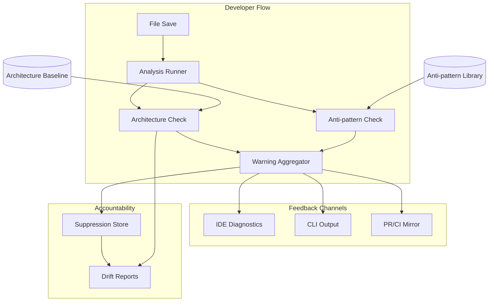

<!-- APS: See https://github.com/EddaCraft/anvil-plan-spec for format reference -->
<!-- This document is non-executable. -->

# Anvil — Save-time Trust

## Overview

Anvil makes AI-generated code safe to merge by catching architecture boundary
violations and AI escape-hatch anti-patterns at file-save time. Developers get
actionable warnings before code leaves the file, with human-owned exceptions for
intentional deviations.

**Why this matters:** AI coding tools are accelerating development, but they
don't understand your architecture. They produce code that compiles and passes
tests, yet drifts from intended patterns. By the time drift is noticed in
review, it's already merged or too expensive to fix. Anvil catches it at the
moment of creation — when fixing is cheap.

**Product thesis:** Anvil improves trust in AI-generated code so more of it
reaches production faster, while architecture drift slows or reverses over time.

**Primary beneficiary:** Individual developers — they get to use AI safely at
the pace leadership expects.

## Problem & Success Criteria

**Problem:** The most damaging recurring failure is second-wave feature work
drifting from intended patterns because engineers:

- don't know which patterns apply
- don't read ADRs or architecture diagrams
- don't recognise when their change crosses a boundary

The most reliable early signal: a **new dependency edge** where a function or
class reaches across architectural contexts.

**Success Criteria:**

- [ ] 50%+ of developers run Anvil on every save (adoption) — post-release
- [ ] Time-to-merge for AI-assisted PRs does not increase (throughput) —
      post-release
- [ ] New cross-boundary edges per sprint decreases by 30% within 8 weeks
      (drift) — post-release
- [x] Save-time feedback latency < 2 seconds cached, < 5 seconds cold (speed)
- [ ] < 10% of warnings are suppressed without resolution (signal quality) —
      post-release

## Release Plan

### 0.1.0 — Beta (Complete)

**Philosophy:** A powerful engine is worthless if no one uses it. The initial
release must deliver both the core value AND a friction-free first experience.

#### Core Engine

| Feature             | Description                                    | Status   |
| ------------------- | ---------------------------------------------- | -------- |
| Analysis Engine     | `anvil check <files>` with caching + parallel  | Complete |
| Architecture Safety | Baseline inference, new-edge detection          | Complete |
| Anti-patterns       | 7 high-confidence patterns                     | Complete |
| Suppressions        | Time-boxed with mandatory explanations          | Complete |
| Git Integration     | `--changed`, `--staged`, `--since <ref>`       | Complete |
| Watch Mode          | `anvil watch --source` for real-time feedback   | Complete |
| CI/CD               | GitHub Action with PR comments + status checks  | Complete |

#### Onboarding Experience

| Feature           | Description                                     | Status   |
| ----------------- | ----------------------------------------------- | -------- |
| TUI Foundation    | Ink setup + base components (TUI-001)           | Complete |
| Init Wizard       | Visual `anvil init` with guided flow (TUI-002)  | Complete |
| Status Dashboard  | Quick health check: `anvil status` (TUI-003)    | Complete |
| Doctor Command    | Diagnose setup issues: `anvil doctor` (TUI-004) | Complete |
| First-run Welcome | Show value immediately on first run (TUI-005)   | Complete |

#### Documentation & Polish

| Feature           | Description                     | Status   |
| ----------------- | ------------------------------- | -------- |
| Quick Start Guide | 5-minute path to first value    | Complete |
| User Guide        | Complete command reference       | Complete |
| Demo/Tutorial     | Show Anvil catching real issues  | Complete |
| Error Messages    | Actionable, not cryptic          | Complete |

#### Drift Visibility & Developer Trust

| Feature                | Description                                    | Status   |
| ---------------------- | ---------------------------------------------- | -------- |
| Explain Command        | `anvil explain <id>` — deep-dive into warnings | Complete |
| Drift Snapshots        | `anvil drift snapshot` — capture current state  | Complete |
| Drift Compare          | `anvil drift compare` — show changes over time  | Complete |
| Drift Reports          | `anvil drift report` — visualise trends         | Complete |
| OPA Architecture       | DC-OPA bridge, YAML-first architecture          | Complete |
| Architecture Templates | Layered, Hexagonal, Clean, DDD presets          | Complete |
| Remote Policy Bundles  | Centralised policy distribution                 | Complete |
| Monorepo Migration     | Restructure to apps/packages layered layout     | Complete |

#### AI Tool Integration

| Feature         | Description                                | Status   |
| --------------- | ------------------------------------------ | -------- |
| llms.txt Export | Export constraints for AI tool consumption | Complete |
| Command Safety  | Validate AI tool commands (CMDSAF)         | Complete |
| MCP Server      | Real-time validation during AI generation  | Complete |

#### HTML/CSS, Tutorial & First Run

| Feature                   | Description                                         | Status   |
| ------------------------- | --------------------------------------------------- | -------- |
| Configurable Extensions   | Make analysable file extensions configurable         | Complete |
| HTML Anti-patterns        | Inline styles, scripts, event handlers, deprecated  | Complete |
| CSS Anti-patterns         | `!important` abuse, CSS `@import` performance       | Complete |
| Tutorial Overhaul         | Scan-watch-fix flow, feature tutorials, docs        | Complete |
| Intelligent First Run     | Post-init analysis, smart defaults, quick wins      | Complete |

### 0.1.x — Current Work

| Feature                    | Description                                              | Status      | Progress |
| -------------------------- | -------------------------------------------------------- | ----------- | -------- |
| Forge Hook & Agent         | Pre-commit hook + reviewer agent with codex delegation   | Complete    | —        |
| Forge Negotiation          | Structured finding/response protocol, round cap          | Complete    | —        |
| Deferred Finding Filing    | Auto-file deferred findings as GH issues or APS items    | Complete    | —        |
| Temper Workflow             | GitHub Actions self-healing loop with 2-cycle cap        | Complete    | —        |
| Configuration & Docs       | Env vars, settings.json, CLAUDE.md, toggle matrix        | Complete    | —        |
| CLI Hardening              | Error handling, edge cases, robustness                   | Complete    | —        |
| Coaching Nudges            | Context-aware suggestions for pattern improvement        | Complete    | —        |
| Nx Task Migration          | Migrate root scripts to Nx-orchestrated per-project      | Complete    | 6/6      |
| CLI esbuild Bundling       | Self-contained npm package via esbuild                   | Complete    | 3/3      |
| MCP Server Hardening       | Production-readiness for MCP server                      | Complete    | —        |
| Security CI Pipeline       | Automated security scanning on every PR                  | Complete    | —        |
| Tutorial Path Continuation | Continue with another tutorial from completion screen     | Complete    | —        |
| Post-Beta Launch Uplift    | Address 57 findings from v0.1.2-beta post-release review | Complete    | 57/57    |
| Code Review Backlog        | 29 architectural recommendations from code review        | Complete    | 29/29    |
| Codebase Maintenance       | Pattern extraction, shared utilities, generators         | In Progress | 3/8      |
| Security Review Backlog    | Cross-package security findings from adversarial review  | Complete    | 8/8      |
| .anvil File Format         | Replace hardcoded anti-pattern catalogue with file-based | In Progress | Phase 1 patterns authored, compiler not started |
| BMAD v4 Backward Compat    | v4 folder/agent/workflow format backward compatibility   | Proposed    | 0/8      |

**Design doc (Forge & Temper):** [docs/plans/2026-02-24-forge-temper-review-pipeline.md](../docs/plans/2026-02-24-forge-temper-review-pipeline.md)

### 0.2.0 — Web Dashboard

| Feature              | Description                                         | Status |
| -------------------- | --------------------------------------------------- | ------ |
| Dashboard Foundation | App scaffold, routing, theme, components, API       | Ready  |
| Dashboard Core Views | Overview, gates history/detail, warnings            | Ready  |
| Dashboard Arch/Drift | Architecture graphs, drift comparison, suppressions | Ready  |
| Dashboard AI Builder | json-render prompt interface, templates, persistence | Ready  |
| Dashboard Operations | Audit trail, plans, config, diagnostics, roles      | Ready  |

**Why this is 0.2.0:** The web dashboard builds on top of all 0.1.0 domain logic
(gates, warnings, architecture, drift, suppressions, plans). It is a new
surface — a read-heavy browser interface — not a replacement for the CLI. The
CLI remains the primary developer interface; the dashboard serves team leads,
platform engineers, and compliance roles who need persistent views, historical
trends, and graphical visualisations that a terminal cannot provide.

### 0.3.0 — Organisational Policy Governance

| Feature              | Description                                              | Status |
| -------------------- | -------------------------------------------------------- | ------ |
| OPA Enhancements     | YAML-first rules, policy library, debugger, watch mode   | Draft  |
| Org Policy Hierarchy | Multi-level governance: org-team-project inheritance      | Draft  |
| Policy Lifecycle     | Versioning, canary rollout, deprecation, grace periods   | Draft  |
| Compliance Reporting | Framework mapping (SOC 2, ISO 27001), audit-ready reports | Draft |
| Policy Federation    | Central registry, channels, fleet sync, publish approvals | Draft |
| Policy Pack Validation | Validate Rego policy packs against conventions          | Draft  |
| Architecture Config  | Validate architecture YAML configs                       | Draft  |
| AI Guardrail Profile | AI-specific guardrail policy profiles                    | Draft  |

**Why this is 0.3.0:** Organisational policy governance builds on top of the
single-repo OPA infrastructure delivered in 0.1.0. It requires multi-repo
awareness, hierarchy resolution, and fleet-level aggregation that only make
sense after the core policy engine is battle-tested. Individual developers
benefit from 0.1.x; platform teams and compliance roles benefit from these
modules.

### 0.4.0 — Edda Stack (Memory System)

| Feature                | Description                                    | Status      |
| ---------------------- | ---------------------------------------------- | ----------- |
| Kindling Integration   | Observation layer — session and gate hooks      | Complete    |
| Ember                  | Interpretive layer — candidate memory proposals | Complete    |
| Edda                   | Canonical memory — git-backed, provenance-tracked | Complete  |
| Edda Stack Integration | Shared schemas, event bus, layer ports          | In Progress |
| Edda-Ember Review      | Non-critical improvements from consolidated review | In Progress |

### Future — Rust Kernel (KERN, In Progress)

| Phase | Description                                              | Status   | Progress |
| ----- | -------------------------------------------------------- | -------- | -------- |
| 0 — Spike | tree-sitter, notify-rs, petgraph, Cargo workspace, CI _(validated in external Rust workspace)_ | In Progress | 4/5 |
| 1 — Watcher + Parser | notify-rs, tree-sitter, symbol extraction, filters | Draft    | 0/4 |
| 2 — Semantic Graph | petgraph symbol/dependency graph, trust, incremental | Draft    | 0/4 |
| 3 — Policy Engine | Config loader, invariant framework, H1 invariants, events | Draft    | 0/4 |
| 4 — Integration | Embedded mode, watch mode, dual-run, benchmarks, cross-compilation | Draft    | 0/5 |
| 5 — Daemon (Deferred) | Unix socket, JSON-RPC, session management        | Draft    | 0/3      |

**Module:** [KERN — Rust Kernel](./modules/rust-kernel.aps.md)
**Spec:** [Rust Kernel Specification](../docs/architecture/rust-kernel-spec.md)
**Evolution:** [Architecture Evolution](../docs/architecture/anvil-architecture-evolution.md)

### Future — Rust Engine Ports (RENG, Proposed)

| Task | Description                                                   | Status   |
| ---- | ------------------------------------------------------------- | -------- |
| RENG-001 | Port secret scan to Rust (regex + entropy)               | Proposed |
| RENG-002 | Port anti-pattern detection (uses kernel ASTs)           | Proposed |
| RENG-003 | Port command safety check                                | Proposed |
| RENG-004 | Validate architecture check parity with kernel invariants | Proposed |
| RENG-005 | Benchmark all ported checks vs JS                        | Proposed |
| RENG-006 | Feature flag + dual-run for ported checks                | Proposed |

**Module:** [RENG — Rust Engine Ports](./modules/rust-core-engine.aps.md)
**Depends on:** KERN (uses kernel's tree-sitter/graph infrastructure)

### Future — Ratatui TUI (RATS, Proposed)

| Task | Description                                                   | Status   |
| ---- | ------------------------------------------------------------- | -------- |
| RATS-001 | eddacraft-tui shared crate (theme, keyboard, widgets)    | Done     |
| RATS-002 | Watch dashboard (live gate results, file status)         | Draft    |
| RATS-003 | Gate result viewer (interactive)                         | Draft    |
| RATS-004 | APS onboarding wizard                                    | Draft    |
| RATS-005 | Ink-to-Ratatui migration path                            | Draft    |
| RATS-006 | Terminal platform compatibility testing                   | Draft    |
| RATS-007 | `anvil watch` TUI integration entry point                | Draft    |

**Module:** [RATS — Ratatui TUI](./modules/ratatui-tui.aps.md)
**Depends on:** KERN (consumes kernel events)

### Future — Ink-to-Ratatui Port (PORT, Proposed)

| Task | Description                                                   | Status   |
| ---- | ------------------------------------------------------------- | -------- |
| PORT-001 | Port shared layout and display components                | Draft    |
| PORT-002 | Port composite panel components                          | Draft    |
| PORT-010 | Port welcome surface                                     | Draft    |
| PORT-011 | Port doctor surface                                      | Draft    |
| PORT-012 | Port status dashboard surface                            | Draft    |
| PORT-020 | Port init wizard surface                                 | Draft    |
| PORT-021 | Port audit results surface                               | Draft    |
| PORT-022 | Port template browser surface                            | Draft    |
| PORT-023 | Port gate explorer surface                               | Draft    |
| PORT-030 | Port watch dashboard surface                             | Draft    |
| PORT-040 | Port tutorial orchestrator and picker                    | Draft    |
| PORT-041 | Port policy tutorial path                                | Draft    |
| PORT-042 | Port architecture tutorial path                          | Draft    |
| PORT-043 | Port drift tutorial path                                 | Draft    |
| PORT-044 | Port CI tutorial path                                    | Draft    |

**Module:** [PORT — Ink-to-Ratatui Port](./modules/ink-to-ratatui-port.aps.md)
**Depends on:** RATS-001 (shared component library, complete)

**Why these are future:** Gated on KERN Phase 0 spike validation (now complete).
The TypeScript CLI stays — the Rust kernel adds structural graph analysis as a
new capability (KERN), existing checks port to Rust for speed (RENG), TUI
surfaces move to Ratatui (RATS), and existing Ink surfaces are ported
systematically (PORT). PORT can start immediately since RATS-001 is complete and
most Ink surfaces are purely presentational. RENG and RATS depend on KERN but
don't block it. See
[Architecture Evolution](../docs/architecture/anvil-architecture-evolution.md)
for the phased rollout plan. ADR-011 is
[superseded](./decisions/011-rust-core-engine.md).

### Post-1.0.0 — Multi-Language Support (Placeholders)

| Feature         | Description                                    | Status      |
| --------------- | ---------------------------------------------- | ----------- |
| Python Support  | `import`/`from` extraction, `# type: ignore`  | Placeholder |
| Rust Support    | `use`/`mod` extraction, `unsafe` detection     | Placeholder |
| .NET Support    | `using` extraction, `dynamic` type detection   | Placeholder |

**Why these three:** Python is the second most common AI-assisted language. Rust
and .NET represent compiled-language ecosystems with strong architecture
conventions. Each depends on the configurable extensions infrastructure from
0.1.0 (HTMLCSS-001). Language modules will be promoted to Ready as demand and
resources allow.

### Future

| Feature                         | Description                                    | Status      |
| ------------------------------- | ---------------------------------------------- | ----------- |
| Open-Spec Adapter               | Parse open-spec format as planning source      | Draft       |
| Real-Time Validation (Simple)   | AI output validation via enhanced watch mode   | Draft       |
| Real-Time Validation (Full)     | Unified validation server (LSP, HTTP, stdin)   | Draft       |

> **Note:** tui-enhancement (TUIENH) is **Superseded** — see D-005: Ink over
> OpenTUI.

### What's NOT in 0.1.0

To ship fast and focused, these are explicitly deferred:

- ~~**VS Code extension** — CLI-first; IDE later~~ Complete (shipped in 0.1.0)
- ~~**Drift reports** — Core value doesn't require trend analysis~~ Complete (shipped in 0.1.0)
- ~~**Command safety** — Important but not blocking for initial adoption~~ Complete (shipped in 0.1.0)
- **Plan/APS execution** — Planless-first; APS is internal
- ~~**Multi-language support** — TypeScript/JavaScript only initially~~ HTML/CSS
  shipped in 0.1.0; Python/Rust/.NET post-1.0.0
- **Team dashboards** — Individual developer focus first (0.2.0)
- **Auto-fix** — Warnings only; don't be too clever
- ~~**TUI Mermaid diagrams** — Nice-to-have~~ Complete (shipped in 0.1.0) —
  dependency arrows and violation overlays make architecture visualisation
  significantly more impressive in demos

## Constraints

- Must deliver value **without requiring plans/APS** as a prerequisite
  (planless-first)
- Must not hard-block by default — warnings, not errors
- Must run on Node.js 20+
- Must integrate with existing ESLint/Prettier tooling, not replace it
- Must acknowledge legacy drift without overwhelming developers with noise

## System Map

## Milestones

### M1: Core Analysis Engine

- **Status:** Complete
- **Includes:** save-time-trust, architecture-safety
- **Delivered:** `anvil check <file>` returns warnings with explanations

### M2: Anti-pattern Detection

- **Status:** Complete
- **Includes:** antipattern-library
- **Delivered:** ESLint-disable, `any`, `@ts-ignore` detected in new code

### M3: Developer Ergonomics

- **Status:** Complete
- **Includes:** suppressions, drift-reporting
- **Delivered:** Developers can suppress with accountability; drift snapshots and reports

### M4: Integration Points

- **Status:** Complete
- **Includes:** ci-integration, ide-integration
- **Delivered:** PRs show warning summaries via GitHub Action; VS Code extension v0.1.0

## Modules

### Completed (0.1.0)

Task-level detail for all completed work is archived in
[completed.aps.md](./modules/completed.aps.md).

| Module | Scope | Release |
| ------ | ----- | ------- |
| [save-time-trust](./archive/modules/save-time-trust.aps.md) | CORE | 0.1.0 |
| [architecture-safety](./archive/modules/architecture-safety.aps.md) | ARCH | 0.1.0 |
| [antipattern-library](./archive/modules/antipattern-library.aps.md) | ANTI | 0.1.0 |
| [suppressions](./archive/modules/suppressions.aps.md) | SUPP | 0.1.0 |
| [ci-integration](./archive/modules/ci-integration.aps.md) | CI | 0.1.0 |
| [tui](./archive/modules/tui.aps.md) | TUI | 0.1.0 |
| [documentation-polish](./archive/modules/documentation-polish.aps.md) | DOCS | 0.1.0 |
| [explain-command](./archive/modules/explain-command.aps.md) | EXPLAIN | 0.1.0 |
| [drift-reporting](./archive/modules/drift-reporting.aps.md) | DRIFT | 0.1.0 |
| [opa-architecture-integration](./archive/modules/opa-architecture-integration.aps.md) | OPA | 0.1.0 |
| [ide-integration](./archive/modules/ide-integration.aps.md) | IDE | 0.1.0 |
| [llms-txt-export](./archive/modules/llms-txt-export.aps.md) | LLMS | 0.1.0 |
| [command-safety-validation](./archive/modules/command-safety-validation.aps.md) | CMDSAF | 0.1.0 |
| [mcp-server](./archive/modules/mcp-server.aps.md) | MCP | 0.1.0 |
| [aps-markdown-adapter](./archive/modules/aps-markdown-adapter.aps.md) | APSMD | 0.1.0 |
| [adapter-upstream-updates](./archive/modules/adapter-upstream-updates.aps.md) | ADAPTUP | 0.1.0 |
| [onboarding-feedback-resolution](./archive/modules/onboarding-feedback-resolution.aps.md) | ONFBK | 0.1.0 |
| [html-css-support](./archive/modules/html-css-support.aps.md) | HTMLCSS | 0.1.0 |
| [intelligent-first-run](./archive/modules/intelligent-first-run.aps.md) | IFR | 0.1.0 |
| [tutorial-overhaul](./archive/modules/tutorial-overhaul.aps.md) | TUT | 0.1.0 |
| [tutorial-path-continuation](./archive/modules/tutorial-path-continuation.aps.md) | Tutorial | 0.1.x |
| [website-migration](./archive/modules/website-migration.aps.md) | WEB | 0.1.0 |
| [monorepo-migration](./archive/modules/monorepo-migration.aps.md) | MONO | 0.1.0 |
| [test-quality](./archive/modules/test-quality.aps.md) | TEST | — |
| [pulumi-iac](./modules/pulumi-iac.aps.md) | IAC | 0.1.0 |
| [beta-launch-checklist](./archive/modules/beta-launch-checklist.aps.md) | — | 0.1.2-beta |
| [beta-testing-improvements](./archive/modules/beta-testing-improvements.aps.md) | — | 0.1.2-beta |
| [post-beta-launch-uplift](./archive/modules/post-beta-launch-uplift.aps.md) | PBLU | 0.1.x |
| [migrate-unosend-to-resend](./archive/modules/migrate-unosend-to-resend.md) | — | 0.1.x |

### Current (0.1.x)

| Module | Scope | Status | Progress | Dependencies |
| ------ | ----- | ------ | -------- | ------------ |
| [cli-hardening](./modules/cli-hardening.aps.md) | CLIH | Complete | — | — |
| [coaching-nudges](./modules/coaching-nudges.aps.md) | NUDGE | Complete | — | antipattern-library |
| [mcp-server-hardening](./modules/mcp-server-hardening.aps.md) | MCPH | Complete | — | — |
| [nx-task-migration](./modules/nx-task-migration.aps.md) | NXTASK | Complete | 6/6 | — |
| [security-ci-pipeline](./modules/security-ci-pipeline.aps.md) | SEC | Complete | — | — |
| [cli-esbuild-bundling](./modules/cli-esbuild-bundling.aps.md) | BUNDLE | Complete | 3/3 | — |
| [01-forge-hook-agent](./modules/01-forge-hook-agent.aps.md) | FORGE | Complete | 5/5 | — |
| [02-forge-negotiation](./modules/02-forge-negotiation.aps.md) | FNEG | Complete | 5/5 | forge-hook-agent |
| [03-deferred-finding-filing](./modules/03-deferred-finding-filing.aps.md) | DEFER | Complete | 5/5 | forge-negotiation |
| [04-temper-workflow](./modules/04-temper-workflow.aps.md) | TEMPER | Complete | 6/6 | deferred-finding-filing |
| [05-forge-temper-config](./modules/05-forge-temper-config.aps.md) | FTCFG | Complete | 6/6 | forge-hook-agent, forge-negotiation, deferred-finding-filing, temper-workflow |
| [code-review-backlog](./modules/code-review-backlog.aps.md) | CRB | Complete | 29/29 | — |
| [codebase-maintenance](./modules/codebase-maintenance.aps.md) | MAINT | Complete | 8/8 | — |
| [anvil-file-format](./modules/anvil-file-format.aps.md) | ANVFMT | In Progress | patterns done, compiler pending | — |
| [bmad-v4-backward-compat](./modules/bmad-v4-backward-compat.aps.md) | BMAD4 | Proposed | 0/8 | — |

### Planned — 0.2.0 (Web Dashboard)

Built into `apps/website/` (Next.js 16 + shadcn/ui + Recharts). Four execution
waves; 39 tasks total.

| Module | Scope | Status | Progress | Wave | Dependencies |
| ------ | ----- | ------ | -------- | ---- | ------------ |
| [dashboard-foundation](./modules/dashboard-foundation.aps.md) | DASH | Ready | 0/9 | 1 | apps/website, contracts |
| [dashboard-core-views](./modules/dashboard-core-views.aps.md) | DASHCORE | Ready | 0/9 | 2 | dashboard-foundation |
| [dashboard-architecture-views](./modules/dashboard-architecture-views.aps.md) | DASHARCH | Ready | 0/8 | 2 | dashboard-foundation, architecture-safety, drift-reporting, suppressions |
| [dashboard-ops-views](./modules/dashboard-ops-views.aps.md) | DASHOPS | Ready | 0/7 | 3 | dashboard-foundation |
| [dashboard-ai-builder](./modules/dashboard-ai-builder.aps.md) | DASHAI | Draft | 0/6 | 4 | dashboard-foundation |

### Planned — 0.3.0 (Organisational Policy Governance)

| Module | Scope | Status | Dependencies |
| ------ | ----- | ------ | ------------ |
| [opa-enhancements](./modules/opa-enhancements.aps.md) | OPAE | Draft | opa-architecture-integration, architecture-safety, tui |
| [org-policy-hierarchy](./modules/org-policy-hierarchy.aps.md) | ORGHIER | Draft | opa-architecture-integration, policy-pack-validation, opa-enhancements |
| [policy-lifecycle](./modules/policy-lifecycle.aps.md) | POLLC | Draft | opa-architecture-integration, policy-pack-validation, org-policy-hierarchy |
| [compliance-reporting](./modules/compliance-reporting.aps.md) | COMPLY | Draft | org-policy-hierarchy, policy-lifecycle, drift-reporting, suppressions |
| [policy-federation](./modules/policy-federation.aps.md) | POLFED | Draft | opa-enhancements, org-policy-hierarchy, policy-lifecycle, policy-pack-validation |
| [policy-pack-validation](./modules/policy-pack-validation.aps.md) | POLVAL | Draft | opa-architecture-integration |
| [architecture-config-validation](./modules/architecture-config-validation.aps.md) | ARCHCFG | Draft | opa-architecture-integration, architecture-safety |
| [ai-guardrail-profile](./modules/ai-guardrail-profile.aps.md) | AIGUARD | Draft | architecture-safety, antipattern-library, opa-architecture-integration, policy-pack-validation, architecture-config-validation |
| [opa-agent-orchestration](./modules/opa-agent-orchestration.aps.md) | OPAG | Ready | opa-architecture-integration, opa-enhancements, architecture-safety, mcp-server |
| [eval-harness-integration](./modules/eval-harness-integration.aps.md) | EVAL | Ready | opa-enhancements, opa-agent-orchestration, drift-reporting |
| [compliance-evidence-workspace](./modules/compliance-evidence-workspace.aps.md) | CEWS | Ready | compliance-reporting, policy-lifecycle, eval-harness-integration |
| [contextual-policy-assertions](./modules/contextual-policy-assertions.aps.md) | CPOL | Ready | opa-enhancements, opa-agent-orchestration |
| [io-risk-controls](./modules/io-risk-controls.aps.md) | IORISK | Ready | opa-enhancements, opa-agent-orchestration |
| [gateway-control-plane-patterns](./modules/gateway-control-plane-patterns.aps.md) | GATE | Ready | opa-agent-orchestration, mcp-server |
| [adversarial-testing-catalog](./modules/adversarial-testing-catalog.aps.md) | ATC | Ready | eval-harness-integration, opa-agent-orchestration |
| [prompt-attack-regression-packs](./modules/prompt-attack-regression-packs.aps.md) | PATT | Ready | adversarial-testing-catalog, eval-harness-integration |
| [trust-center-automation](./modules/trust-center-automation.aps.md) | TRUST | Ready | compliance-evidence-workspace, compliance-reporting |

### Planned — 0.4.0 (Edda Stack — Memory System)

| Module | Scope | Status | Progress | Dependencies |
| ------ | ----- | ------ | -------- | ------------ |
| [kindling-integration](./archive/modules/kindling-integration.aps.md) | KINDLING | Complete | 19/19 | save-time-trust, drift-reporting |
| [ember](./modules/ember.aps.md) | EMBER | Complete | 14/14 | kindling-integration |
| [edda](./modules/edda.aps.md) | EDDA | Complete | 19/19 | ember |
| [edda-stack-integration](./modules/edda-stack-integration.aps.md) | STACK | In Progress | 17/19 | kindling-integration, ember, edda |
| [edda-ember-review](./modules/edda-ember-review.aps.md) | EERB | In Progress | 0/16 | ember, edda |

### Future (Post-1.0.0)

| Module | Scope | Status | Progress | Dependencies |
| ------ | ----- | ------ | -------- | ------------ |
| [rust-kernel](./modules/rust-kernel.aps.md) | KERN | In Progress | 4/25 | — |
| [rust-core-engine](./modules/rust-core-engine.aps.md) | RENG | Proposed | 0/6 | KERN Phase 1, KERN Phase 2 |
| [ratatui-tui](./modules/ratatui-tui.aps.md) | RATS | Proposed | 1/7 | KERN Phase 3 |
| [ink-to-ratatui-port](./modules/ink-to-ratatui-port.aps.md) | PORT | Proposed | 0/15 | RATS-001 (complete) |
| [lang-python](./modules/lang-python.aps.md) | PYLAN | Placeholder | — | html-css-support (HTMLCSS-001) |
| [lang-rust](./modules/lang-rust.aps.md) | RSTLAN | Placeholder | — | html-css-support (HTMLCSS-001) |
| [lang-dotnet](./modules/lang-dotnet.aps.md) | DNLAN | Placeholder | — | html-css-support (HTMLCSS-001) |
| [open-spec-adapter](./modules/open-spec-adapter.aps.md) | OPENSPEC | Draft | — | — |
| [real-time-validation-simplified](./modules/real-time-validation-simplified.aps.md) | RTVS | Draft | — | save-time-trust |
| [real-time-validation-full](./modules/real-time-validation-full.aps.md) | RTVF | Draft | — | save-time-trust, ide-integration |
| ~~[tui-enhancement](./modules/tui-enhancement.aps.md)~~ | TUIENH | Superseded | — | see D-005: Ink over OpenTUI |

### Task Status — 0.1.0 (Core Engine)

| Task     | Module          | Description                      | Status   |
| -------- | --------------- | -------------------------------- | -------- |
| CORE-001 | save-time-trust | Warning schema definition        | Complete |
| CORE-002 | save-time-trust | Check runner refactor            | Complete |
| CORE-003 | save-time-trust | CLI check command                | Complete |
| CORE-004 | save-time-trust | Git-aware changed file detection | Complete |
| CORE-005 | save-time-trust | Source file watch mode           | Complete |
| ARCH-001 | architecture    | Baseline inference               | Complete |
| ARCH-002 | architecture    | Edge detection                   | Complete |
| ARCH-003 | architecture    | Architecture check integration   | Complete |
| ARCH-004 | architecture    | CLI architecture service         | Complete |
| ANTI-001 | antipattern     | Pattern catalogue definition     | Complete |
| ANTI-002 | antipattern     | Scanner implementation           | Complete |
| ANTI-003 | antipattern     | Antipattern check integration    | Complete |
| ANTI-004 | antipattern     | Allowlist and opt-in support     | Complete |
| SUPP-001 | suppressions    | Suppression parser               | Complete |
| SUPP-002 | suppressions    | Suppression store                | Complete |
| SUPP-003 | suppressions    | Gate runner integration          | Complete |
| CI-001   | ci-integration  | GitHub Action composite          | Complete |
| CI-002   | ci-integration  | Changed files detection          | Complete |
| CI-003   | ci-integration  | PR comments and status checks    | Complete |
| CI-004   | ci-integration  | Documentation and configuration  | Complete |

### Task Status — 0.1.0 (Onboarding TUI)

| Task    | Module | Description                   | Status   | Priority |
| ------- | ------ | ----------------------------- | -------- | -------- |
| TUI-001 | tui    | Ink foundation and components | Complete | high     |
| TUI-002 | tui    | `anvil init` wizard           | Complete | high     |
| TUI-003 | tui    | `anvil status` dashboard      | Complete | high     |
| TUI-004 | tui    | `anvil doctor` diagnostics    | Complete | high     |
| TUI-005 | tui    | First-run welcome experience  | Complete | high     |
| TUI-008 | tui    | Testing infrastructure        | Complete | medium   |

### Task Status — 0.1.0 (Documentation)

| Task     | Module | Description            | Status   | Priority |
| -------- | ------ | ---------------------- | -------- | -------- |
| DOCS-001 | docs   | Quick Start Guide      | Complete | high     |
| DOCS-002 | docs   | User Guide command ref | Complete | high     |
| DOCS-003 | docs   | Demo material creation | Complete | high     |
| DOCS-004 | docs   | Error message audit    | Complete | medium   |
| DOCS-005 | docs   | Troubleshooting guide  | Complete | medium   |
| DOCS-006 | docs   | README refresh         | Complete | high     |

### Task Status — 0.1.0 (Explain Command)

| Task       | Module  | Description               | Status   | Priority |
| ---------- | ------- | ------------------------- | -------- | -------- |
| EXPLAIN-001 | explain | Warning ID system         | Complete | high     |
| EXPLAIN-002 | explain | Explanation templates     | Complete | high     |
| EXPLAIN-003 | explain | Architecture explanations | Complete | high     |
| EXPLAIN-004 | explain | Anti-pattern explanations | Complete | high     |
| EXPLAIN-005 | explain | ExplainService            | Complete | high     |
| EXPLAIN-006 | explain | CLI explain command       | Complete | high     |

### Task Status — 0.1.0 (Drift Reporting)

| Task     | Module | Description               | Status   | Priority |
| -------- | ------ | ------------------------- | -------- | -------- |
| DRIFT-001 | drift  | Snapshot schema & storage | Complete | high     |
| DRIFT-002 | drift  | Snapshot capture          | Complete | high     |
| DRIFT-003 | drift  | Snapshot comparison       | Complete | high     |
| DRIFT-004 | drift  | Report generator          | Complete | medium   |
| DRIFT-005 | drift  | CLI drift commands        | Complete | high     |

### Task Status — 0.1.0 (Onboarding Feedback Resolution)

| Task     | Module | Description                                 | Status   | Priority |
| -------- | ------ | ------------------------------------------- | -------- | -------- |
| ONFBK-001 | onfbk  | Fix --no-tui flag handling                  | Complete | high     |
| ONFBK-002 | onfbk  | Fix TUI wizard early exit                   | Complete | high     |
| ONFBK-003 | onfbk  | Improve layer detection for project variety | Complete | high     |
| ONFBK-004 | onfbk  | Improve entry points presentation           | Complete | medium   |
| ONFBK-005 | onfbk  | Add architecture explanation                | Complete | medium   |

### Task Status — 0.1.0 (OPA & Architecture Integration)

| Task    | Module | Description                         | Status      | Priority |
| ------- | ------ | ----------------------------------- | ----------- | -------- |
| OPA-001 | opa    | Architecture YAML schema (Zod)      | Complete    | high     |
| OPA-002 | opa    | YAML parser with template expansion | Complete    | high     |
| OPA-003 | opa    | DC config generator from YAML       | Complete    | high     |
| OPA-004 | opa    | `anvil architecture init` command   | Complete    | high     |
| OPA-005 | opa    | Architecture context extraction     | Complete    | high     |
| OPA-006 | opa    | OPA input schema enhancement        | Complete    | high     |
| OPA-007 | opa    | Gate runner integration             | Complete    | high     |
| OPA-008 | opa    | Rego generator from architecture    | Complete    | high     |
| OPA-009 | opa    | Generated policy marker             | Complete    | medium   |
| OPA-010 | opa    | Auto-regeneration on YAML change    | Complete    | medium   |
| OPA-011 | opa    | Layered architecture template       | Complete    | medium   |
| OPA-012 | opa    | Hexagonal architecture template     | Complete    | medium   |
| OPA-013 | opa    | Clean Architecture template         | Complete    | medium   |
| OPA-014 | opa    | DDD template with bounded contexts  | Complete    | medium   |
| OPA-015 | opa    | Template loader and validator       | Complete    | medium   |
| OPA-016 | opa    | TypeScript analyser foundation      | Deferred    | low      |
| OPA-017 | opa    | Path alias resolver                 | Deferred    | low      |
| OPA-018 | opa    | Analyser feature flag               | Deferred    | low      |
| OPA-019 | opa    | Bundle download and caching         | Complete    | medium   |
| OPA-020 | opa    | Signature verification              | Complete    | medium   |
| OPA-021 | opa    | Basic auth and CLI commands         | Complete    | medium   |

> **Note:** OPA-016 through OPA-018 were deferred when the OPA module was marked
> Complete at OPA-015. OPA-019 through OPA-021 (remote policy bundles) were
> subsequently implemented. The remaining tasks may be revisited in the OPA
> Enhancements module (OPAE) or a future release.

### Task Status — 0.1.0 (Monorepo Migration)

| Task     | Module | Description                          | Status   | Priority |
| -------- | ------ | ------------------------------------ | -------- | -------- |
| MONO-001 | mono   | Nx generators for package scaffolding | Complete | high     |
| MONO-002 | mono   | Import path codemod                  | Complete | high     |
| MONO-003 | mono   | Shared tooling packages              | Complete | medium   |
| MONO-004 | mono   | Extract contracts from core          | Complete | high     |
| MONO-005 | mono   | Extract ports from core              | Complete | high     |
| MONO-006 | mono   | Extract pure domain to core          | Complete | high     |
| MONO-007 | mono   | Extract runtime package              | Complete | high     |
| MONO-008 | mono   | Extract policy package               | Complete | high     |
| MONO-009 | mono   | Extract config package               | Complete | medium   |
| MONO-010 | mono   | Extract storage package              | Complete | medium   |
| MONO-011 | mono   | Extract crypto package               | Complete | medium   |
| MONO-012 | mono   | Split adapters per-integration       | Complete | medium   |
| MONO-013 | mono   | Move CLI to apps/                    | Complete | high     |
| MONO-014 | mono   | Reorganise E2E tests                 | Complete | medium   |
| MONO-015 | mono   | Move scripts to tools/               | Complete | low      |
| MONO-016 | mono   | Full test suite validation           | Complete | high     |
| MONO-017 | mono   | Dependency graph validation          | Complete | high     |
| MONO-018 | mono   | Documentation update                 | Complete | medium   |

### Task Status — 0.1.0 (APS Markdown Adapter)

| Task     | Module | Description                          | Status   | Priority |
| -------- | ------ | ------------------------------------ | -------- | -------- |
| APSMD-001 | apsmd  | APSMarkdownAdapter with detection    | Complete | high     |
| APSMD-002 | apsmd  | Confidence scoring system            | Complete | high     |
| APSMD-003 | apsmd  | Parse method implementation          | Complete | high     |
| APSMD-004 | apsmd  | Task-to-Change conversion            | Complete | high     |
| APSMD-005 | apsmd  | Registry integration                 | Complete | high     |
| APSMD-006 | apsmd  | CLI PlanLoader integration           | Complete | high     |

### Task Status — 0.1.0 (Advanced Experience)

#### IDE Integration (VS Code Extension)

| Task    | Module | Description                                     | Status   | Priority |
| ------- | ------ | ----------------------------------------------- | -------- | -------- |
| IDE-001 | ide    | Embed @eddacraft/anvil-core for fast-path operations      | Complete | high     |
| IDE-002 | ide    | Anti-pattern detection on save with diagnostics | Complete | high     |
| IDE-003 | ide    | Improve source location mapping from CLI output | Complete | medium   |
| IDE-004 | ide    | Architecture gate display in tree view          | Complete | high     |
| IDE-005 | ide    | OPA policy failure display with remediation     | Complete | high     |
| IDE-006 | ide    | Click-to-navigate for all violation types       | Complete | medium   |
| IDE-007 | ide    | APS and Rego syntax highlighting                | Complete | medium   |
| IDE-008 | ide    | Analysis caching and Marketplace preparation    | Complete | medium   |

#### TUI Operational (CLI)

| Task    | Module | Description                       | Status  | Priority |
| ------- | ------ | --------------------------------- | ------- | -------- |
| TUI-006 | tui    | Static template library           | Deferred | medium   |
| TUI-007 | tui    | Interactive tutorial              | Deferred | low      |
| TUI-009 | tui    | `anvil watch` real-time dashboard | Complete | medium   |
| TUI-010 | tui    | `anvil gate` interactive explorer | Deferred | medium   |
| TUI-011 | tui    | Parallel progress visualisation   | Deferred | low      |
| TUI-012 | tui    | Log panel with filtering          | Deferred | low      |
| TUI-013 | tui    | `<MermaidDiagram />` component + `layersToMermaid()` helper ([brainstorm](./brainstorms/mermaid-tui-diagrams.md)) | Complete | high |
| TUI-014 | tui    | Replace existing ASCII diagrams with mermaid rendering | Complete | high |
| TUI-015 | tui    | `anvil architecture visualise` command (ascii/svg/mermaid formats) | Complete | high |

### Task Status — 0.2.0 (Web Dashboard)

The web dashboard provides a browser-based interface for exploring Anvil data.
See [brainstorm](./brainstorms/dashboard-web-ui.md) and
[json-render approach](./brainstorms/json-render-dashboard.md) for background.

#### Dashboard Foundation

| Task     | Module | Description                             | Status | Priority |
| -------- | ------ | --------------------------------------- | ------ | -------- |
| DASH-001 | dash   | Dashboard route group and layout shell  | Draft  | high     |
| DASH-002 | dash   | Extended theme tokens for dashboard     | Draft  | high     |
| DASH-003 | dash   | Shared dashboard component catalogue    | Draft  | high     |
| DASH-004 | dash   | Chart components (shadcn/ui + Recharts) | Draft  | high     |
| DASH-005 | dash   | API data layer (Next.js API routes)     | Draft  | high     |
| DASH-006 | dash   | Data fetching hooks (TanStack Query)    | Draft  | high     |
| DASH-007 | dash   | Command palette (global search)         | Draft  | medium   |
| DASH-008 | dash   | URL deep linking and filter persistence | Draft  | medium   |
| DASH-009 | dash   | Remove apps/anvil-ui/ placeholder       | Draft  | low      |

#### Dashboard Core Views (Overview, Gates, Warnings)

| Task         | Module   | Description                          | Status | Priority |
| ------------ | -------- | ------------------------------------ | ------ | -------- |
| DASHCORE-001 | dashcore | Overview — metric cards row          | Draft  | high     |
| DASHCORE-002 | dashcore | Overview — trend charts              | Draft  | medium   |
| DASHCORE-003 | dashcore | Overview — activity feed             | Draft  | high     |
| DASHCORE-004 | dashcore | Gate history list                    | Draft  | high     |
| DASHCORE-005 | dashcore | Gate detail with check tree          | Draft  | medium   |
| DASHCORE-006 | dashcore | Warning list with grouping/filtering | Draft  | high     |
| DASHCORE-007 | dashcore | Warning detail panel                 | Draft  | medium   |
| DASHCORE-008 | dashcore | Warning breakdown visualisations     | Draft  | medium   |
| DASHCORE-009 | dashcore | Anti-pattern registry reference      | Draft  | high     |

#### Dashboard Architecture, Drift & Suppressions

| Task         | Module   | Description                          | Status | Priority |
| ------------ | -------- | ------------------------------------ | ------ | -------- |
| DASHARCH-001 | dasharch | Architecture overview & layer diagram| Draft  | high     |
| DASHARCH-002 | dasharch | Boundary violation explorer          | Draft  | high     |
| DASHARCH-003 | dasharch | Interactive dependency graph         | Draft  | medium   |
| DASHARCH-004 | dasharch | Drift timeline and snapshot list     | Draft  | high     |
| DASHARCH-005 | dasharch | Snapshot detail view                 | Draft  | medium   |
| DASHARCH-006 | dasharch | Snapshot comparison view             | Draft  | high     |
| DASHARCH-007 | dasharch | Suppression list with lifecycle views| Draft  | high     |
| DASHARCH-008 | dasharch | Suppression trend analysis           | Draft  | medium   |

#### Dashboard AI Builder

| Task       | Module | Description                          | Status | Priority |
| ---------- | ------ | ------------------------------------ | ------ | -------- |
| DASHAI-001 | dashai | json-render runtime integration      | Draft  | high     |
| DASHAI-002 | dashai | Component catalog registration       | Draft  | high     |
| DASHAI-003 | dashai | Prompt interface with live preview   | Draft  | high     |
| DASHAI-004 | dashai | Dashboard template gallery           | Draft  | medium   |
| DASHAI-005 | dashai | Dashboard persistence                | Draft  | medium   |
| DASHAI-006 | dashai | Dashboard versioning & iteration     | Draft  | low      |

#### Dashboard Operations & Administration

| Task        | Module  | Description                          | Status | Priority |
| ----------- | ------- | ------------------------------------ | ------ | -------- |
| DASHOPS-001 | dashops | Audit log viewer                     | Draft  | high     |
| DASHOPS-002 | dashops | User activity breakdown              | Draft  | high     |
| DASHOPS-003 | dashops | AI tool tracking analysis            | Draft  | medium   |
| DASHOPS-004 | dashops | Plan list and detail views           | Draft  | high     |
| DASHOPS-005 | dashops | Configuration viewer                 | Draft  | high     |
| DASHOPS-006 | dashops | Diagnostics page                     | Draft  | high     |
| DASHOPS-007 | dashops | Role-based view filtering            | Draft  | medium   |

### Task Status — 0.1.0 (HTML/CSS Support)

| Task        | Module  | Description                                 | Status   | Priority |
| ----------- | ------- | ------------------------------------------- | -------- | -------- |
| HTMLCSS-001 | htmlcss | Make analysable extensions configurable      | Complete | high     |
| HTMLCSS-002 | htmlcss | HTML anti-pattern detectors (AP-008–011)     | Complete | high     |
| HTMLCSS-003 | htmlcss | CSS anti-pattern detectors (AP-012–013)      | Complete | high     |
| HTMLCSS-004 | htmlcss | HTML/CSS edge detection                      | Complete | high     |
| HTMLCSS-005 | htmlcss | HTML suppression comment syntax              | Complete | high     |
| HTMLCSS-006 | htmlcss | VS Code extension HTML/CSS trigger           | Complete | medium   |
| HTMLCSS-007 | htmlcss | Documentation and tests                      | Complete | medium   |

### Task Status — 0.1.0 (Tutorial Overhaul)

| Task    | Module | Description                                          | Status   | Priority |
| ------- | ------ | ---------------------------------------------------- | -------- | -------- |
| TUT-001 | tut    | Rewrite tutorial step types for scan-watch-fix flow  | Complete | high     |
| TUT-002 | tut    | Create ScanStep TUI component                        | Complete | high     |
| TUT-003 | tut    | Create WatchStep TUI component                       | Complete | high     |
| TUT-004 | tut    | Create FixStep TUI component                         | Complete | high     |
| TUT-005 | tut    | Create NextStepsStep and wire up Tutorial.tsx         | Complete | high     |
| TUT-006 | tut    | Interactive policy creation tutorial                  | Complete | medium   |
| TUT-007 | tut    | Interactive architecture boundaries tutorial          | Complete | medium   |
| TUT-008 | tut    | Interactive drift tracking tutorial                   | Complete | medium   |
| TUT-009 | tut    | Interactive CI integration tutorial                   | Complete | high     |
| TUT-010 | tut    | Docs-site tutorials section                           | Complete | high     |
| TUT-011 | tut    | Rewrite quickstart.md and update navigation           | Complete | high     |
| TUT-012 | tut    | Tutorial --list flag and e2e test                     | Complete | high     |

### Task Status — 0.1.0 (Intelligent First Run)

| Task    | Module | Description                                   | Status   | Priority |
| ------- | ------ | --------------------------------------------- | -------- | -------- |
| IFR-001 | ifr    | Add project context detection service         | Complete | high     |
| IFR-002 | ifr    | Create smart defaults generator               | Complete | high     |
| IFR-003 | ifr    | Add post-init automatic analysis              | Complete | high     |
| IFR-004 | ifr    | Create quick wins identifier                  | Complete | high     |
| IFR-005 | ifr    | Create interactive results dashboard TUI      | Complete | high     |
| IFR-006 | ifr    | Add historical analysis feature               | Complete | medium   |
| IFR-007 | ifr    | Integrate all components in init flow         | Complete | high     |
| IFR-008 | ifr    | Update documentation                          | Complete | medium   |

### Task Status — 0.1.0 (Adapter Upstream Updates)

| Task        | Module  | Description                                 | Status   | Priority |
| ----------- | ------- | ------------------------------------------- | -------- | -------- |
| ADAPTUP-001 | adaptup | Update BMAD folder structure detection       | Complete | high     |
| ADAPTUP-002 | adaptup | Update BMAD config path handling             | Complete | high     |
| ADAPTUP-003 | adaptup | Update BMAD variable syntax                  | Complete | medium   |
| ADAPTUP-004 | adaptup | Add BMAD hasSidecar field support             | Complete | medium   |
| ADAPTUP-005 | adaptup | Update SpecKit command namespace detection   | Complete | high     |
| ADAPTUP-006 | adaptup | Add SpecKit AGENTS.md support                | Complete | medium   |
| ADAPTUP-007 | adaptup | Update adapter test fixtures                 | Complete | high     |
| ADAPTUP-008 | adaptup | Update adapter documentation                 | Complete | medium   |

### Task Status — 0.1.0 (AI Tool Integration)

| Task       | Module         | Description                       | Status  | Priority |
| ---------- | -------------- | --------------------------------- | ------- | -------- |
| LLMS-001   | llms-txt       | Constraint collector              | Complete | high     |
| LLMS-002   | llms-txt       | llms.txt formatter                | Complete | high     |
| LLMS-003   | llms-txt       | MCP resource formatter            | Complete | medium   |
| LLMS-004   | llms-txt       | Prompt fragment formatter         | Complete | medium   |
| LLMS-005   | llms-txt       | CLI export command                | Complete | high     |
| CMDSAF-001 | command-safety | Rule system and types             | Complete | high     |
| CMDSAF-002 | command-safety | Command parser with unwrapping    | Complete | high     |
| CMDSAF-003 | command-safety | Rule matcher with specificity     | Complete | high     |
| CMDSAF-004 | command-safety | Default git operation rules       | Complete | medium   |
| CMDSAF-005 | command-safety | Default filesystem rules          | Complete | medium   |
| CMDSAF-006 | command-safety | CommandSafetyCheck implementation | Complete | high     |
| CMDSAF-007 | command-safety | Configuration system              | Complete | medium   |
| CMDSAF-008 | command-safety | Message formatting                | Complete | low      |
| CMDSAF-009 | command-safety | CLI integration and documentation | Complete | high     |
| MCP-001    | mcp-server     | Package scaffold and basic server | Complete | high     |
| MCP-002    | mcp-server     | anvil_check tool implementation   | Complete | high     |
| MCP-003    | mcp-server     | anvil_gate and anvil_status tools | Complete | high     |
| MCP-004    | mcp-server     | anvil_fix and anvil_suppress tools| Complete | high     |
| MCP-005    | mcp-server     | anvil_query_boundary tool         | Complete | high     |
| MCP-006    | mcp-server     | Resources with subscriptions      | Complete | medium   |
| MCP-007    | mcp-server     | Prompt templates                  | Complete | medium   |
| MCP-008    | mcp-server     | Streamable HTTP transport         | Complete | medium   |
| MCP-009    | mcp-server     | Config generators and CLI         | Complete | high     |
| MCP-010    | mcp-server     | Error handling and JSON-RPC       | Complete | high     |

### Task Status — 0.4.0 (Edda Stack — Memory System)

The Edda Stack provides a three-layer architecture for memory: Kindling (observation),
Ember (interpretation), and Edda (canonical memory).

#### Kindling Integration (Observation Layer)

| Task         | Module   | Description                         | Status   | Priority |
| ------------ | -------- | ----------------------------------- | -------- | -------- |
| KINDLING-001 | kindling | Kindling service wrapper            | Complete | high     |
| KINDLING-002 | kindling | Configuration schema and loading    | Complete | high     |
| KINDLING-003 | kindling | Session observation hooks           | Complete | high     |
| KINDLING-004 | kindling | Gate evaluation observations        | Complete | high     |
| KINDLING-005 | kindling | Action execution observations       | Complete | medium   |
| KINDLING-006 | kindling | Plan lifecycle observations         | Complete | medium   |
| KINDLING-007 | kindling | Human input and constraint obs      | Complete | medium   |
| KINDLING-008 | kindling | Error observations                  | Complete | high     |
| KINDLING-009 | kindling | Query service with scope enforcement| Complete | high     |
| KINDLING-010 | kindling | Query limits and throttling         | Complete | high     |
| KINDLING-011 | kindling | Malicious AI test suite             | Complete | high     |
| KINDLING-012 | kindling | Session query command (run show)    | Complete | high     |
| KINDLING-013 | kindling | Plan, gate, action query commands   | Complete | high     |
| KINDLING-014 | kindling | Status integration                  | Complete | medium   |
| KINDLING-015 | kindling | Sensitive data validation           | Complete | high     |
| KINDLING-016 | kindling | Retention and pruning               | Complete | medium   |
| KINDLING-017 | kindling | Performance benchmarking            | Complete | medium   |
| KINDLING-018 | kindling | Documentation and examples          | Complete | medium   |
| KINDLING-019 | kindling | OpenAPI spec generation             | Complete | medium   |

#### Ember (Interpretive Layer — Candidate Memory)

| Task      | Module | Description                       | Status   | Priority |
| --------- | ------ | --------------------------------- | -------- | -------- |
| EMBER-001 | ember  | Candidate Memory Proposal schema  | Complete | high     |
| EMBER-002 | ember  | Proposal type definitions         | Complete | high     |
| EMBER-003 | ember  | Ember configuration schema        | Complete | high     |
| EMBER-004 | ember  | ProposalStore implementation      | Complete | high     |
| EMBER-005 | ember  | DecayService implementation       | Complete | high     |
| EMBER-006 | ember  | AggregatorService foundation      | Complete | medium   |
| EMBER-007 | ember  | Evaluation rules engine           | Complete | medium   |
| EMBER-008 | ember  | Built-in evaluation rules         | Complete | medium   |
| EMBER-009 | ember  | CandidateService (high-level API) | Complete | high     |
| EMBER-010 | ember  | Kindling observation hooks        | Complete | medium   |
| EMBER-011 | ember  | CLI ember commands                | Complete | high     |
| EMBER-012 | ember  | Query API implementation          | Complete | high     |
| EMBER-013 | ember  | Status integration                | Complete | medium   |
| EMBER-014 | ember  | Documentation and examples        | Complete | medium   |

#### Edda (Canonical Memory Layer)

| Task      | Module | Description                       | Status   | Priority |
| --------- | ------ | --------------------------------- | -------- | -------- |
| EDDA-001  | edda   | Memory Object schema              | Complete | high     |
| EDDA-002  | edda   | Memory type definitions           | Complete | high     |
| EDDA-003  | edda   | Provenance schema                 | Complete | high     |
| EDDA-004  | edda   | Evolution graph schema            | Complete | high     |
| EDDA-005  | edda   | Edda configuration schema         | Complete | high     |
| EDDA-006  | edda   | Git-backed MemoryStore            | Complete | high     |
| EDDA-007  | edda   | YAML serialisation                | Complete | high     |
| EDDA-008  | edda   | Version tracking                  | Complete | medium   |
| EDDA-009  | edda   | PromotionService                  | Complete | high     |
| EDDA-010  | edda   | ProvenanceService                 | Complete | medium   |
| EDDA-011  | edda   | EvolutionService                  | Complete | high     |
| EDDA-012  | edda   | MemoryService (high-level API)    | Complete | high     |
| EDDA-013  | edda   | CLI list and show commands        | Complete | high     |
| EDDA-014  | edda   | CLI promote command               | Complete | high     |
| EDDA-015  | edda   | CLI retire and trace commands     | Complete | high     |
| EDDA-016  | edda   | Human-in-the-loop enforcement     | Complete | high     |
| EDDA-017  | edda   | Status integration                | Complete | medium   |
| EDDA-018  | edda   | Schema migration tooling          | Complete | medium   |
| EDDA-019  | edda   | Documentation                     | Complete | medium   |

#### Edda Stack Integration

| Task      | Module | Description                       | Status   | Priority |
| --------- | ------ | --------------------------------- | -------- | -------- |
| STACK-001 | stack  | Common identifier schemas         | Complete | high     |
| STACK-002 | stack  | Timestamp and temporal schemas    | Complete | high     |
| STACK-003 | stack  | Confidence scale definitions      | Complete | high     |
| STACK-004 | stack  | Provenance link schema            | Complete | high     |
| STACK-005 | stack  | Proposal → Memory type mapping    | Complete | high     |
| STACK-006 | stack  | Observation → Proposal mapping    | Draft    | medium   |
| STACK-007 | stack  | Layer port definitions            | Complete | high     |
| STACK-008 | stack  | Event bus for layer communication | Complete | medium   |
| STACK-009 | stack  | Layer mock factories              | Complete | high     |
| STACK-010 | stack  | Integration test fixtures         | Complete | high     |
| STACK-011 | stack  | Provenance chain validator        | Complete | high     |
| STACK-012 | stack  | Stack configuration schema        | Complete | high     |
| STACK-013 | stack  | CLI stack status command          | Complete | high     |
| STACK-014 | stack  | CLI stack validate command        | Complete | high     |
| STACK-015 | stack  | Stack architecture documentation  | Complete    | medium   |
| STACK-016 | stack  | Migration guide                   | Complete    | medium   |
| STACK-017 | stack  | Path drift cleanup in APS plans   | Complete | medium   |
| STACK-018 | stack  | Retroactive evidence capture      | Draft       | medium   |
| STACK-019 | stack  | Missing deliverable audit         | Draft       | medium   |

#### Edda-Ember Review Backlog

Non-critical improvements from the 2026-03-05 consolidated code review of the
Edda + Ember feature branches. All 10 critical issues resolved; these track
remaining major and minor improvements.

| Task     | Module | Description                                        | Status | Priority |
| -------- | ------ | -------------------------------------------------- | ------ | -------- |
| EERB-001 | eerb   | Race condition in processSession candidate limit   | Draft  | Low      |
| EERB-002 | eerb   | EscalationRule assumes array order equals temporal  | Draft  | Medium   |
| EERB-003 | eerb   | Prune threshold duplicated with different values   | Draft  | Medium   |
| EERB-004 | eerb   | Fallback synthesises fake UUIDs for provenance     | Draft  | Medium   |
| EERB-005 | eerb   | Duplicated queryProposals call in ember list       | Draft  | Low      |
| EERB-006 | eerb   | Dismissed count missing from anvil status Ember    | Draft  | Low      |
| EERB-007 | eerb   | colourStatus/colourConfidence duplicated in ember  | Draft  | Low      |
| EERB-008 | eerb   | Hardcoded method: 'cli_command' in attribution     | Draft  | Low      |
| EERB-009 | eerb   | Double search filtering is redundant               | Draft  | Medium   |
| EERB-010 | eerb   | Hardcoded limit: 100 silently truncates methods    | Draft  | Low      |
| EERB-011 | eerb   | groupByKind uses O(n²) array spread in loop        | Draft  | Low      |
| EERB-012 | eerb   | getExpiringsSoon double-s typo                     | Draft  | Low      |
| EERB-013 | eerb   | SurpriseRule references unknown observation kinds   | Draft  | Low      |
| EERB-014 | eerb   | validateEvolutionGraph uses .parse() not .safeParse | Draft | Low      |
| EERB-015 | eerb   | serialisation.ts has manual MemoryIndexEntry type  | Draft  | Low      |
| EERB-016 | eerb   | migrateV0ToV1 status preservation path untested    | Draft  | Low      |

### Task Status — 0.3.0 (Organisational Policy Governance)

#### OPA Enhancements

| Task     | Module | Description                             | Status | Priority |
| -------- | ------ | --------------------------------------- | ------ | -------- |
| OPAE-001 | opae   | Enhanced architecture YAML schema       | Draft  | high     |
| OPAE-002 | opae   | Module boundary definitions             | Draft  | high     |
| OPAE-003 | opae   | File-level import rules                 | Draft  | high     |
| OPAE-004 | opae   | Package import restrictions             | Draft  | high     |
| OPAE-005 | opae   | Interactive architecture wizard         | Draft  | medium   |
| OPAE-006 | opae   | Policy library infrastructure           | Draft  | high     |
| OPAE-007 | opae   | Security policy pack (8 policies)       | Draft  | high     |
| OPAE-008 | opae   | Quality policy pack (6 policies)        | Draft  | high     |
| OPAE-009 | opae   | Scope policy pack (4 policies)          | Draft  | high     |
| OPAE-010 | opae   | Compliance policy pack (5 policies)     | Draft  | medium   |
| OPAE-011 | opae   | Policy browse command                   | Draft  | high     |
| OPAE-012 | opae   | Enhanced violation messages             | Draft  | high     |
| OPAE-013 | opae   | Policy debugger foundation              | Draft  | medium   |
| OPAE-014 | opae   | Interactive debugger TUI                | Draft  | medium   |
| OPAE-015 | opae   | Policy watch mode                       | Draft  | medium   |
| OPAE-016 | opae   | Architecture watch mode                 | Draft  | medium   |
| OPAE-017 | opae   | Watch mode performance optimisation     | Draft  | medium   |
| OPAE-018 | opae   | Historical PR analysis                  | Draft  | medium   |
| OPAE-019 | opae   | Impact visualisation                    | Draft  | medium   |
| OPAE-020 | opae   | Impact simulation                       | Draft  | medium   |
| OPAE-021 | opae   | Policy description parser (NLP)         | Draft  | low      |
| OPAE-022 | opae   | YAML generation from NLP                | Draft  | low      |
| OPAE-023 | opae   | Policy creation wizard                  | Draft  | low      |
| OPAE-024 | opae   | Exception request system                | Draft  | high     |
| OPAE-025 | opae   | Exception approval workflow             | Draft  | high     |
| OPAE-026 | opae   | Audit trail                             | Draft  | high     |
| OPAE-027 | opae   | Exception CLI commands                  | Draft  | high     |
| OPAE-028 | opae   | GitHub PR comments                      | Draft  | high     |
| OPAE-029 | opae   | GitLab MR comments                      | Draft  | high     |
| OPAE-030 | opae   | Inline annotations                      | Draft  | medium   |
| OPAE-031 | opae   | Compliance metrics collection           | Draft  | high     |
| OPAE-032 | opae   | Metrics dashboard TUI                   | Draft  | medium   |
| OPAE-033 | opae   | Team leaderboards                       | Draft  | medium   |
| OPAE-034 | opae   | Organisation policy bundles             | Draft  | high     |
| OPAE-035 | opae   | Bundle versioning                       | Draft  | high     |
| OPAE-036 | opae   | Bundle inheritance                      | Draft  | medium   |

#### OPA Agent Orchestration

| Task     | Module | Description                                | Status | Priority |
| -------- | ------ | ------------------------------------------ | ------ | -------- |
| OPAG-001 | opag   | Orchestration contract                     | Draft  | high     |
| OPAG-002 | opag   | Checkpoint policy runner                   | Draft  | high     |
| OPAG-003 | opag   | Remediation-first guidance model           | Draft  | high     |
| OPAG-004 | opag   | Exception workflow lifecycle               | Draft  | high     |
| OPAG-005 | opag   | Audit event stream                         | Draft  | high     |
| OPAG-006 | opag   | CLI/IDE/MCP/CI surface adapters           | Draft  | medium   |
| OPAG-007 | opag   | Rollout controls and latency guardrails    | Draft  | medium   |

#### Eval Harness Integration

| Task     | Module | Description                            | Status | Priority |
| -------- | ------ | -------------------------------------- | ------ | -------- |
| EVAL-001 | eval   | EvalHarnessPort contract               | Draft  | high     |
| EVAL-002 | eval   | Framework adapter                      | Draft  | high     |
| EVAL-003 | eval   | CI regression command                  | Draft  | high     |
| EVAL-004 | eval   | Canonical result persistence           | Draft  | high     |
| EVAL-005 | eval   | Policy-linked remediation              | Draft  | high     |

#### Compliance Evidence Workspace

| Task     | Module | Description                            | Status | Priority |
| -------- | ------ | -------------------------------------- | ------ | -------- |
| CEWS-001 | cews   | Control-evidence model                 | Draft  | high     |
| CEWS-002 | cews   | Evidence ingestion and linking         | Draft  | high     |
| CEWS-003 | cews   | Workspace views/contracts              | Draft  | medium   |
| CEWS-004 | cews   | Export packs                           | Draft  | medium   |

#### Contextual Policy Assertions

| Task     | Module | Description                            | Status | Priority |
| -------- | ------ | -------------------------------------- | ------ | -------- |
| CPOL-001 | cpol   | Assertion schema                       | Draft  | high     |
| CPOL-002 | cpol   | Context adapters                       | Draft  | high     |
| CPOL-003 | cpol   | Guidance outputs                       | Draft  | high     |

#### IO Risk Controls

| Task       | Module | Description                          | Status | Priority |
| ---------- | ------ | ------------------------------------ | ------ | -------- |
| IORISK-001 | iorisk | IO risk taxonomy                     | Draft  | high     |
| IORISK-002 | iorisk | Scanner pipeline                     | Draft  | high     |
| IORISK-003 | iorisk | Policy output integration            | Draft  | high     |

#### Gateway Control Plane Patterns

| Task     | Module | Description                            | Status | Priority |
| -------- | ------ | -------------------------------------- | ------ | -------- |
| GATE-001 | gate   | Reference topologies                   | Draft  | medium   |
| GATE-002 | gate   | Enforcement contract                   | Draft  | high     |
| GATE-003 | gate   | Observability event model              | Draft  | medium   |

#### Adversarial Testing Catalog

| Task    | Module | Description                      | Status | Priority |
| ------- | ------ | -------------------------------- | ------ | -------- |
| ATC-001 | atc    | Adversarial probe taxonomy       | Draft  | high     |
| ATC-002 | atc    | Probe pack registry              | Draft  | high     |
| ATC-003 | atc    | Eval harness integration         | Draft  | high     |
| ATC-004 | atc    | Adversarial trend reporting      | Draft  | medium   |

#### Prompt Attack Regression Packs

| Task     | Module | Description                     | Status | Priority |
| -------- | ------ | ------------------------------- | ------ | -------- |
| PATT-001 | patt   | Attack scenario schema          | Draft  | high     |
| PATT-002 | patt   | Attack pack runner              | Draft  | high     |
| PATT-003 | patt   | CI threshold policy integration | Draft  | high     |

#### Trust Center Automation

| Task      | Module | Description                    | Status | Priority |
| --------- | ------ | ------------------------------ | ------ | -------- |
| TRUST-001 | trust  | Trust artifact model           | Draft  | high     |
| TRUST-002 | trust  | Publishing pipeline            | Draft  | high     |
| TRUST-003 | trust  | Freshness and ownership rules  | Draft  | medium   |

#### Organisational Policy Hierarchy

| Task        | Module  | Description                            | Status | Priority |
| ----------- | ------- | -------------------------------------- | ------ | -------- |
| ORGHIER-001 | orghier | Hierarchy configuration schema         | Draft  | high     |
| ORGHIER-002 | orghier | Scope selector engine                  | Draft  | high     |
| ORGHIER-003 | orghier | Policy hierarchy resolver              | Draft  | high     |
| ORGHIER-004 | orghier | Override permission enforcement        | Draft  | high     |
| ORGHIER-005 | orghier | Conflict diagnostics                   | Draft  | medium   |
| ORGHIER-006 | orghier | CLI hierarchy commands                 | Draft  | high     |
| ORGHIER-007 | orghier | Gate runner hierarchy integration      | Draft  | medium   |

#### Policy Lifecycle Management

| Task      | Module | Description                            | Status | Priority |
| --------- | ------ | -------------------------------------- | ------ | -------- |
| POLLC-001 | pollc  | Policy version schema                  | Draft  | high     |
| POLLC-002 | pollc  | Lifecycle state machine                | Draft  | high     |
| POLLC-003 | pollc  | Canary rollout selector                | Draft  | medium   |
| POLLC-004 | pollc  | Grace period enforcer                  | Draft  | high     |
| POLLC-005 | pollc  | Policy changelog generator             | Draft  | high     |
| POLLC-006 | pollc  | CLI lifecycle commands                 | Draft  | high     |
| POLLC-007 | pollc  | Gate runner lifecycle integration      | Draft  | medium   |

#### Compliance Reporting

| Task       | Module | Description                            | Status | Priority |
| ---------- | ------ | -------------------------------------- | ------ | -------- |
| COMPLY-001 | comply | Compliance framework registry          | Draft  | high     |
| COMPLY-002 | comply | SOC 2 and ISO 27001 definitions        | Draft  | medium   |
| COMPLY-003 | comply | Policy-to-control mapper               | Draft  | high     |
| COMPLY-004 | comply | Evidence collector                     | Draft  | medium   |
| COMPLY-005 | comply | Compliance posture scoring             | Draft  | high     |
| COMPLY-006 | comply | Report generator                       | Draft  | medium   |
| COMPLY-007 | comply | Historical posture tracking            | Draft  | high     |
| COMPLY-008 | comply | CLI compliance commands                | Draft  | high     |

#### Policy Federation

| Task       | Module | Description                            | Status | Priority |
| ---------- | ------ | -------------------------------------- | ------ | -------- |
| POLFED-001 | polfed | Policy channel schema                  | Draft  | high     |
| POLFED-002 | polfed | Central repository conventions         | Draft  | high     |
| POLFED-003 | polfed | Policy publisher                       | Draft  | high     |
| POLFED-004 | polfed | Publish approval gate                  | Draft  | medium   |
| POLFED-005 | polfed | Policy subscriber                      | Draft  | high     |
| POLFED-006 | polfed | Subscription version pinning           | Draft  | high     |
| POLFED-007 | polfed | Fleet compliance aggregator            | Draft  | medium   |
| POLFED-008 | polfed | CLI federation commands                | Draft  | high     |

### Task Status — 0.1.0 (Pulumi Infrastructure as Code)

| Task    | Module | Description                              | Status   | Priority |
| ------- | ------ | ---------------------------------------- | -------- | -------- |
| IAC-001 | iac    | Scaffold Pulumi project in monorepo      | Complete | high     |
| IAC-002 | iac    | Configure Pulumi state backend           | Complete | high     |
| IAC-003 | iac    | Manage website Vercel project config     | Complete | high     |
| IAC-004 | iac    | Manage docs-site Vercel project config   | Complete | high     |
| IAC-005 | iac    | Create VercelApp ComponentResource       | Complete | medium   |
| IAC-006 | iac    | Manage GitHub repository configuration   | Deferred | high     |
| IAC-007 | iac    | Manage Azure DNS zones and records       | Complete | high     |
| IAC-008 | iac    | Add Pulumi CI/CD pipeline integration    | Complete | high     |
| IAC-009 | iac    | Write unit tests for infrastructure code | Complete | medium   |
| IAC-010 | iac    | Import existing Vercel resources         | Complete | high     |
| IAC-011 | iac    | Document IaC setup and contributor guide | Complete | medium   |
| IAC-012 | iac    | Document rollback procedures             | Complete | medium   |
| IAC-013 | iac    | Bootstrap Azure storage + KeyVault (CLI script) | Draft | high |
| IAC-014 | iac    | Migrate Pulumi backend to Azure Blob Storage | Draft | high |
| IAC-015 | iac    | Add Azure KeyVault SDK helper module     | Draft    | high     |
| IAC-016 | iac    | Migrate secrets from Pulumi config to KeyVault | Draft | high |
| IAC-017 | iac    | Update tests for KeyVault mocking        | Draft    | medium   |
| IAC-018 | iac    | Update CI workflow for self-managed backend | Draft | high   |
| IAC-019 | iac    | Migrate state from Pulumi Cloud to Azure Blob | Draft | high |
| IAC-020 | iac    | Update infra README for new backend      | Draft    | medium   |

### Task Status — 0.1.x (Code Review Backlog)

Architectural recommendations from the 2026-02-16 code review. Non-urgent
improvements tracked for future work.

| Task    | Module | Description                                         | Status   | Priority |
| ------- | ------ | --------------------------------------------------- | -------- | -------- |
| CRB-001 | crb    | Standardise stderr/stdout policy across CLI         | Complete | Medium   |
| CRB-002 | crb    | Consolidate hook scripts to single source           | Complete | Medium   |
| CRB-003 | crb    | Add Zod validation to runtime YAML parsers          | Complete | Medium   |
| CRB-004 | crb    | OPA binary manager safer PATH + shared logger       | Complete | Low      |
| CRB-005 | crb    | Dependency audit — surface errors deterministically | Complete | Medium   |
| CRB-006 | crb    | Monorepo-wide vitest config strategy                | Complete | Low      |
| CRB-007 | crb    | Move process.exit from library code to CLI layer    | Complete | High     |
| CRB-008 | crb    | Consistent workspace root containment for output    | Complete | High     |
| CRB-009 | crb    | OPA checksum table contains placeholder hashes      | Complete | High     |
| CRB-010 | crb    | APS task locking is not atomic (race condition)     | Complete | Medium   |
| CRB-011 | crb    | APS loader maxDepth parameter ignored               | Complete | Low      |
| CRB-012 | crb    | Config loader placeholder vs Complete status drift  | Complete | Low      |
| CRB-013 | crb    | MCP server tests not in vitest include globs        | Complete | Medium   |
| CRB-014 | crb    | Add tests for git command composition safety        | Complete | Medium   |
| CRB-015 | crb    | Add symlink escape tests to file-storage            | Complete | Medium   |
| CRB-016 | crb    | Add Windows separator tests to MCP path guards      | Complete | Low      |
| CRB-017 | crb    | Add tests for platform/core config loaders          | Complete | Low      |
| CRB-018 | crb    | Standardise works-from-repo-root workflow           | Complete | Medium   |
| CRB-019 | crb    | Consistent logging/output conventions               | Complete | Medium   |
| CRB-020 | crb    | Option parsing/validation inconsistency             | Complete | Low      |
| CRB-021 | crb    | Duplicated implementations and naming drift         | Complete | Low      |
| CRB-022 | crb    | Large command modules need decomposition            | Draft    | Low      |
| CRB-023 | crb    | Silent fallbacks without visibility                 | Complete | Medium   |
| CRB-024 | crb    | Subprocess calls without timeouts in CI             | Complete | Medium   |
| CRB-025 | crb    | Docs and scripts drifting from reality              | Complete | Low      |
| CRB-026 | crb    | Fix spinner leak on TUI fallback path in audit      | Complete | Medium   |
| CRB-027 | crb    | Add workspace path containment to policy validate   | Complete | High     |
| CRB-028 | crb    | Annotate mcp-config symlink guard as fixed          | Complete | Low      |
| CRB-029 | crb    | Expand test coverage for untested CLI commands      | Complete | Medium   |

### Task Status — 0.1.x (Codebase Maintenance)

Ongoing pattern extraction and shared utility consolidation. Discovery-driven —
new tasks are added as repeated patterns are found during other work.

| Task      | Module | Description                                         | Status | Priority |
| --------- | ------ | --------------------------------------------------- | ------ | -------- |
| MAINT-001 | maint  | CLI option coercion utility (from CRB-020 discovery) | Complete | High     |
| MAINT-002 | maint  | Error formatting consistency                        | Complete | Medium   |
| MAINT-003 | maint  | Workspace root resolution patterns                  | Complete | Low      |
| MAINT-004 | maint  | Git operation wrappers                              | Complete | Medium   |
| MAINT-005 | maint  | JSON output formatting                              | Complete | Low      |
| MAINT-006 | maint  | Nx generator for CLI commands                       | Complete | Low      |
| MAINT-007 | maint  | Nx generator for gate checks                        | Complete | Low      |
| MAINT-008 | maint  | Spinner/progress patterns                           | Complete | Low      |

### Task Status — 0.1.x (Nx Task Migration)

Migrate root-level lint, typecheck, and test scripts from monolithic processes to
Nx-orchestrated per-project targets.

| Task        | Module | Description                                           | Status | Priority |
| ----------- | ------ | ----------------------------------------------------- | ------ | -------- |
| NXTASK-001  | nxtask | Ensure nx sync is clean and TS references are current | Ready  | high     |
| NXTASK-002  | nxtask | Wire eslint-plugin-anvil as Nx build dependency       | Ready  | high     |
| NXTASK-003  | nxtask | Migrate root lint scripts to nx run-many              | Ready  | high     |
| NXTASK-004  | nxtask | Migrate root typecheck script to nx run-many          | Ready  | high     |
| NXTASK-005  | nxtask | Migrate root test script to nx run-many               | Ready  | medium   |
| NXTASK-006  | nxtask | Update CI to use nx affected                          | Ready  | high     |

### Task Status — 0.1.x (Forge & Temper: Autonomous Code Review Pipeline)

Pre-commit review (Forge) and post-push self-healing (Temper) pipeline.
Design doc: [docs/plans/2026-02-24-forge-temper-review-pipeline.md](../docs/plans/2026-02-24-forge-temper-review-pipeline.md)

#### Forge Hook & Agent

| Task      | Module | Description                          | Status   | Priority |
| --------- | ------ | ------------------------------------ | -------- | -------- |
| FORGE-001 | forge  | Create forge.sh PreToolUse hook      | Complete | high     |
| FORGE-002 | forge  | Create forge-reviewer agent spec     | Complete | high     |
| FORGE-003 | forge  | Create Forge skill documentation     | Ready    | medium   |
| FORGE-004 | forge  | Implement Forge report logging       | Complete | medium   |
| FORGE-005 | forge  | Integration test for Forge pipeline  | Ready    | high     |

#### Forge Negotiation Protocol

| Task     | Module | Description                              | Status      | Priority |
| -------- | ------ | ---------------------------------------- | ----------- | -------- |
| FNEG-001 | fneg   | Extend agent-bus schema with findings    | In Progress | high     |
| FNEG-002 | fneg   | Implement round cap enforcement          | Complete    | high     |
| FNEG-003 | fneg   | Implement scoped re-review for rounds 2+ | Complete    | medium   |
| FNEG-004 | fneg   | Implement severity-action matrix         | Complete    | high     |
| FNEG-005 | fneg   | Implement fix-and-restage flow           | Complete    | medium   |

#### Deferred Finding Filing

| Task      | Module | Description                            | Status | Priority |
| --------- | ------ | -------------------------------------- | ------ | -------- |
| DEFER-001 | defer  | Implement GitHub Issue filing          | Ready  | high     |
| DEFER-002 | defer  | Implement category-to-label mapping    | Ready  | medium   |
| DEFER-003 | defer  | Implement APS context detection/filing | Ready  | medium   |
| DEFER-004 | defer  | Implement issue deduplication          | Ready  | medium   |
| DEFER-005 | defer  | Implement batch filing and report      | Ready  | high     |

#### Temper Workflow

| Task       | Module | Description                            | Status   | Priority |
| ---------- | ------ | -------------------------------------- | -------- | -------- |
| TEMPER-001 | temper | Create temper.yml workflow scaffold    | Complete | high     |
| TEMPER-002 | temper | Implement cycle 1 full review          | Complete | high     |
| TEMPER-003 | temper | Implement cycle 2 scoped re-review     | Complete | medium   |
| TEMPER-004 | temper | Implement cycle cap enforcement        | Complete | high     |
| TEMPER-005 | temper | Implement manual dispatch trigger      | Complete | medium   |
| TEMPER-006 | temper | Implement PR summary comments          | Complete | medium   |

#### Forge & Temper Configuration & Documentation

| Task      | Module | Description                               | Status      | Priority |
| --------- | ------ | ----------------------------------------- | ----------- | -------- |
| FTCFG-001 | ftcfg  | Register Forge env vars and hook          | In Progress | high     |
| FTCFG-002 | ftcfg  | Document Temper GitHub repo variables     | Complete    | medium   |
| FTCFG-003 | ftcfg  | Update CLAUDE.md hook behavior table      | Complete    | high     |
| FTCFG-004 | ftcfg  | Update CLAUDE.md env var table            | Complete    | high     |
| FTCFG-005 | ftcfg  | Document pipeline overview in CLAUDE.md   | Complete    | high     |
| FTCFG-006 | ftcfg  | Verify toggle combinations                | Ready       | medium   |

### Task Status — Post-1.0.0 (Multi-Language Placeholders)

Tasks will be defined when each module moves from Placeholder to Ready status.

| Module  | Language | Estimated Tasks | Prerequisite       | Status      |
| ------- | -------- | --------------- | ------------------ | ----------- |
| PYLAN   | Python   | 6               | HTMLCSS-001        | Placeholder |
| RSTLAN  | Rust     | 5               | HTMLCSS-001        | Placeholder |
| DNLAN   | .NET/C#  | 5               | HTMLCSS-001        | Placeholder |

## Risks & Mitigations

| Risk                            | Impact | Likelihood | Mitigation                                               |
| ------------------------------- | ------ | ---------- | -------------------------------------------------------- |
| Warning noise kills adoption    | high   | medium     | High-signal patterns only; warn on NEW edges, not legacy |
| Analysis too slow (> 2s)        | high   | medium     | Incremental analysis; hash-based caching; warm daemon    |
| Developers bypass with `--skip` | medium | medium     | Track skip usage; surface in drift reports               |
| Legacy drift overwhelms users   | medium | high       | Baseline existing violations; focus warnings on new code |
| Over-claiming blast radius      | medium | medium     | Careful language; surface confidence levels              |
| Forge loops slow down commits   | high   | medium     | Hard 3-round cap; auto-defer nits; toggle to disable     |
| Temper creates bad fixes        | high   | low        | 2-cycle cap; scoped re-review; deferred to issues        |
| Deferred findings pile up       | medium | medium     | Deduplication; category labels; severity-based triage    |
| Bot review wars in CI           | medium | low        | No bot mentions; label gating; hard cycle cap            |

## Decisions

- **D-001:** Planless-first posture — deliver value without requiring APS plans
  ([ADR](./decisions/001-planless-first.md))
- **D-002:** Warnings over blocks — inform, don't prevent; let CI enforce if
  desired ([ADR](./decisions/002-warnings-over-blocks.md))
- **D-003:** New edges only — baseline existing architecture; warn only on new
  violations ([ADR](./decisions/003-new-edges-only.md))
- **D-004:** Suppression syntax — `@anvil-ignore <ID>: <reason>` with mandatory
  explanation ([ADR](./decisions/004-suppression-syntax.md))
- **D-005:** Ink over OpenTUI — Node.js compatibility over native performance
  ([ADR](./decisions/005-ink-over-opentui.md))
- **D-006:** Hybrid DC + OPA — DC for analysis, OPA for policies, bridge between
  ([ADR](./decisions/006-hybrid-dc-opa.md))
- **D-007:** Pulumi for IaC — open-source Pulumi with TypeScript over Terraform
  for consistency with the monorepo's TypeScript-first toolchain
  ([ADR](./decisions/007-pulumi-iac.md))
- **D-011:** Rust Core Engine — Rust for performance-critical subsystems (engine,
  watcher, storage, TUI) while TypeScript CLI stays; gated on Phase 0 spike
  ([ADR](./decisions/011-rust-core-engine.md)) — **Proposed**
- **D-012:** OPA Agent Orchestration — orchestration layer for checkpointed policy
  evaluation, remediation guidance, and auditable exception workflows
  ([ADR](./decisions/012-opa-agent-orchestration.md))
- **D-013:** Eval Harness Adoption — adopt external eval framework behind Anvil
  adapter contracts for CI-native trust regression testing
  ([ADR](./decisions/013-eval-harness-adoption.md))

## Open Questions

### Decided

- [x] VS Code extension vs CLI-only initially? — **CLI-first**, VS Code added in 0.1.0
- [x] Provenance storage? — **Inline-only** for 0.1.0 (no central DB)
- [x] Onboarding TUI in 0.1.0? — **Yes** — critical for adoption
- [x] Command Safety (CMDSAF) initially? — Shipped in 0.1.0
- [x] OpenTUI vs Ink for TUI implementation? — **Ink** — OpenTUI requires Bun
      runtime (bun-ffi-structs for Zig FFI); Anvil requires Node.js 20+
- [x] Should first-run auto-run `anvil check` on sample files for demo? — **Yes** —
      implemented in IFR-003 (post-init automatic analysis)

### Open

- [ ] Which entry points define "public API" for boundary detection?
- [ ] Should drift reports include team/author attribution? (Privacy concern)
- [ ] How to handle monorepos with multiple architecture baselines?
