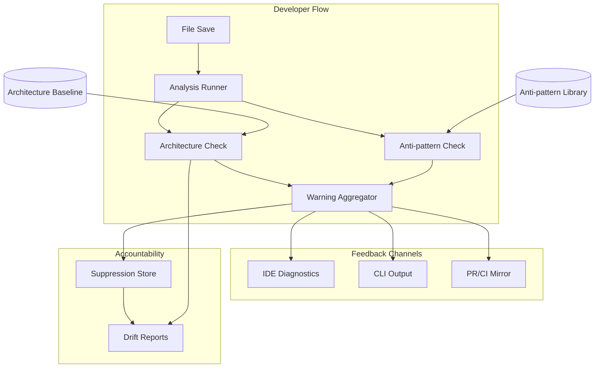

<!-- APS: See https://github.com/EddaCraft/anvil-plan-spec for format reference -->
<!-- This document is non-executable. -->

# Anvil — Save-time Trust

## Overview

Anvil makes AI-generated code safe to merge by catching architecture boundary
violations and AI escape-hatch anti-patterns at file-save time. Developers get
actionable warnings before code leaves the file, with human-owned exceptions for
intentional deviations.

**Why this matters:** AI coding tools are accelerating development, but they
don't understand your architecture. They produce code that compiles and passes
tests, yet drifts from intended patterns. By the time drift is noticed in
review, it's already merged or too expensive to fix. Anvil catches it at the
moment of creation — when fixing is cheap.

**Product thesis:** Anvil improves trust in AI-generated code so more of it
reaches production faster, while architecture drift slows or reverses over time.

**Primary beneficiary:** Individual developers — they get to use AI safely at
the pace leadership expects.

## Problem & Success Criteria

**Problem:** The most damaging recurring failure is second-wave feature work
drifting from intended patterns because engineers:

- don't know which patterns apply
- don't read ADRs or architecture diagrams
- don't recognise when their change crosses a boundary

The most reliable early signal: a **new dependency edge** where a function or
class reaches across architectural contexts.

**Success Criteria:**

- [ ] 50%+ of developers run Anvil on every save (adoption) — post-release
- [ ] Time-to-merge for AI-assisted PRs does not increase (throughput) —
      post-release
- [ ] New cross-boundary edges per sprint decreases by 30% within 8 weeks
      (drift) — post-release
- [x] Save-time feedback latency < 2 seconds cached, < 5 seconds cold (speed)
- [ ] < 10% of warnings are suppressed without resolution (signal quality) —
      post-release

## Release Plan

### 0.1.0 — Beta (Complete)

**Philosophy:** A powerful engine is worthless if no one uses it. The initial
release must deliver both the core value AND a friction-free first experience.

#### Core Engine

| Feature             | Description                                    | Status   |
| ------------------- | ---------------------------------------------- | -------- |
| Analysis Engine     | `anvil check <files>` with caching + parallel  | Complete |
| Architecture Safety | Baseline inference, new-edge detection          | Complete |
| Anti-patterns       | 7 high-confidence patterns                     | Complete |
| Suppressions        | Time-boxed with mandatory explanations          | Complete |
| Git Integration     | `--changed`, `--staged`, `--since <ref>`       | Complete |
| Watch Mode          | `anvil watch --source` for real-time feedback   | Complete |
| CI/CD               | GitHub Action with PR comments + status checks  | Complete |

#### Onboarding Experience

| Feature           | Description                                     | Status   |
| ----------------- | ----------------------------------------------- | -------- |
| TUI Foundation    | Ink setup + base components (TUI-001)           | Complete |
| Init Wizard       | Visual `anvil init` with guided flow (TUI-002)  | Complete |
| Status Dashboard  | Quick health check: `anvil status` (TUI-003)    | Complete |
| Doctor Command    | Diagnose setup issues: `anvil doctor` (TUI-004) | Complete |
| First-run Welcome | Show value immediately on first run (TUI-005)   | Complete |

#### Documentation & Polish

| Feature           | Description                     | Status   |
| ----------------- | ------------------------------- | -------- |
| Quick Start Guide | 5-minute path to first value    | Complete |
| User Guide        | Complete command reference       | Complete |
| Demo/Tutorial     | Show Anvil catching real issues  | Complete |
| Error Messages    | Actionable, not cryptic          | Complete |

#### Drift Visibility & Developer Trust

| Feature                | Description                                    | Status   |
| ---------------------- | ---------------------------------------------- | -------- |
| Explain Command        | `anvil explain <id>` — deep-dive into warnings | Complete |
| Drift Snapshots        | `anvil drift snapshot` — capture current state  | Complete |
| Drift Compare          | `anvil drift compare` — show changes over time  | Complete |
| Drift Reports          | `anvil drift report` — visualise trends         | Complete |
| OPA Architecture       | DC-OPA bridge, YAML-first architecture          | Complete |
| Architecture Templates | Layered, Hexagonal, Clean, DDD presets          | Complete |
| Remote Policy Bundles  | Centralised policy distribution                 | Complete |
| Monorepo Migration     | Restructure to apps/packages layered layout     | Complete |

#### AI Tool Integration

| Feature         | Description                                | Status   |
| --------------- | ------------------------------------------ | -------- |
| llms.txt Export | Export constraints for AI tool consumption | Complete |
| Command Safety  | Validate AI tool commands (CMDSAF)         | Complete |
| MCP Server      | Real-time validation during AI generation  | Complete |

#### HTML/CSS, Tutorial & First Run

| Feature                   | Description                                         | Status   |
| ------------------------- | --------------------------------------------------- | -------- |
| Configurable Extensions   | Make analysable file extensions configurable         | Complete |
| HTML Anti-patterns        | Inline styles, scripts, event handlers, deprecated  | Complete |
| CSS Anti-patterns         | `!important` abuse, CSS `@import` performance       | Complete |
| Tutorial Overhaul         | Scan-watch-fix flow, feature tutorials, docs        | Complete |
| Intelligent First Run     | Post-init analysis, smart defaults, quick wins      | Complete |

### 0.1.x — Current Work

| Feature                    | Description                                              | Status      | Progress |
| -------------------------- | -------------------------------------------------------- | ----------- | -------- |
| Forge Hook & Agent         | Pre-commit hook + reviewer agent with codex delegation   | Complete    | —        |
| Forge Negotiation          | Structured finding/response protocol, round cap          | Complete    | —        |
| Deferred Finding Filing    | Auto-file deferred findings as GH issues or APS items    | Complete    | —        |
| Temper Workflow             | GitHub Actions self-healing loop with 2-cycle cap        | Complete    | —        |
| Configuration & Docs       | Env vars, settings.json, CLAUDE.md, toggle matrix        | Complete    | —        |
| CLI Hardening              | Error handling, edge cases, robustness                   | Complete    | —        |
| Coaching Nudges            | Context-aware suggestions for pattern improvement        | Complete    | —        |
| Nx Task Migration          | Migrate root scripts to Nx-orchestrated per-project      | Complete    | 6/6      |
| CLI esbuild Bundling       | Self-contained npm package via esbuild                   | Complete    | 3/3      |
| MCP Server Hardening       | Production-readiness for MCP server                      | Complete    | —        |
| Security CI Pipeline       | Automated security scanning on every PR                  | Complete    | —        |
| Tutorial Path Continuation | Continue with another tutorial from completion screen     | Complete    | —        |
| Post-Beta Launch Uplift    | Address 57 findings from v0.1.2-beta post-release review | Ready       | 28/57    |
| Code Review Backlog        | 25 architectural recommendations from code review        | In Progress | 3/25     |
| .anvil File Format         | Replace hardcoded anti-pattern catalogue with file-based | In Progress | Phase 1 patterns authored, compiler not started |
| BMAD v4 Backward Compat    | v4 folder/agent/workflow format backward compatibility   | Proposed    | 0/8      |

**Design doc (Forge & Temper):** [docs/plans/2026-02-24-forge-temper-review-pipeline.md](../docs/plans/2026-02-24-forge-temper-review-pipeline.md)

### 0.2.0 — Web Dashboard

| Feature              | Description                                         | Status |
| -------------------- | --------------------------------------------------- | ------ |
| Dashboard Foundation | App scaffold, routing, theme, components, API       | Draft  |
| Dashboard Core Views | Overview, gates history/detail, warnings            | Draft  |
| Dashboard Arch/Drift | Architecture graphs, drift comparison, suppressions | Draft  |
| Dashboard AI Builder | json-render prompt interface, templates, persistence | Draft |
| Dashboard Operations | Audit trail, plans, config, diagnostics, roles      | Draft  |

**Why this is 0.2.0:** The web dashboard builds on top of all 0.1.0 domain logic
(gates, warnings, architecture, drift, suppressions, plans). It is a new
surface — a read-heavy browser interface — not a replacement for the CLI. The
CLI remains the primary developer interface; the dashboard serves team leads,
platform engineers, and compliance roles who need persistent views, historical
trends, and graphical visualisations that a terminal cannot provide.

### 0.3.0 — Organisational Policy Governance

| Feature              | Description                                              | Status |
| -------------------- | -------------------------------------------------------- | ------ |
| OPA Enhancements     | YAML-first rules, policy library, debugger, watch mode   | Draft  |
| Org Policy Hierarchy | Multi-level governance: org-team-project inheritance      | Draft  |
| Policy Lifecycle     | Versioning, canary rollout, deprecation, grace periods   | Draft  |
| Compliance Reporting | Framework mapping (SOC 2, ISO 27001), audit-ready reports | Draft |
| Policy Federation    | Central registry, channels, fleet sync, publish approvals | Draft |
| Policy Pack Validation | Validate Rego policy packs against conventions          | Draft  |
| Architecture Config  | Validate architecture YAML configs                       | Draft  |
| AI Guardrail Profile | AI-specific guardrail policy profiles                    | Draft  |

**Why this is 0.3.0:** Organisational policy governance builds on top of the
single-repo OPA infrastructure delivered in 0.1.0. It requires multi-repo
awareness, hierarchy resolution, and fleet-level aggregation that only make
sense after the core policy engine is battle-tested. Individual developers
benefit from 0.1.x; platform teams and compliance roles benefit from these
modules.

### 0.4.0 — Edda Stack (Memory System)

| Feature                | Description                                    | Status |
| ---------------------- | ---------------------------------------------- | ------ |
| Kindling Integration   | Observation layer — session and gate hooks      | In Progress |
| Ember                  | Interpretive layer — candidate memory proposals | Draft  |
| Edda                   | Canonical memory — git-backed, provenance-tracked | Draft |
| Edda Stack Integration | Shared schemas, event bus, layer ports          | Draft  |

### Future — Rust Core Engine (Proposed)

| Feature                  | Description                                              | Status   | Progress |
| ------------------------ | -------------------------------------------------------- | -------- | -------- |
| Spike (Validation)       | tree-sitter, N-API, rusqlite, Ratatui, notify-rs         | Proposed | 0/5      |
| Secret Scanner           | Port secret scan to Rust, N-API binding, benchmark       | Proposed | 0/4      |
| Architecture + Anti-Pattern | tree-sitter AST, dependency graph, pattern matching   | Proposed | 0/4      |
| Watcher                  | notify-rs, adaptive debounce, git2, parallel gate runner | Proposed | 0/4      |
| Kindling Storage         | rusqlite observation store, query API                    | Proposed | 0/2      |
| TUI                      | eddacraft-tui shared crate, watch dashboard, wizard      | Proposed | 0/3      |
| Lint Integration         | oxlint integration, pre-commit cache optimisation        | Proposed | 0/2      |

**Why this is future:** Gated on [ADR-011](./decisions/011-rust-core-engine.md)
acceptance and Phase 0 spike validation. The TypeScript CLI stays — Rust handles
performance-critical subsystems (policy engine, watcher, storage, TUI). Each
phase delivers independently behind a feature flag. 15-20 week estimated
timeline. If the spike fails targets, fall back to JS-only optimisations.

### Post-1.0.0 — Multi-Language Support (Placeholders)

| Feature         | Description                                    | Status      |
| --------------- | ---------------------------------------------- | ----------- |
| Python Support  | `import`/`from` extraction, `# type: ignore`  | Placeholder |
| Rust Support    | `use`/`mod` extraction, `unsafe` detection     | Placeholder |
| .NET Support    | `using` extraction, `dynamic` type detection   | Placeholder |

**Why these three:** Python is the second most common AI-assisted language. Rust
and .NET represent compiled-language ecosystems with strong architecture
conventions. Each depends on the configurable extensions infrastructure from
0.1.0 (HTMLCSS-001). Language modules will be promoted to Ready as demand and
resources allow.

### Future

| Feature                         | Description                                    | Status      |
| ------------------------------- | ---------------------------------------------- | ----------- |
| Open-Spec Adapter               | Parse open-spec format as planning source      | Draft       |
| Real-Time Validation (Simple)   | AI output validation via enhanced watch mode   | Draft       |
| Real-Time Validation (Full)     | Unified validation server (LSP, HTTP, stdin)   | Draft       |

> **Note:** tui-enhancement (TUIENH) is **Superseded** — see D-005: Ink over
> OpenTUI.

### What's NOT in 0.1.0

To ship fast and focused, these are explicitly deferred:

- ~~**VS Code extension** — CLI-first; IDE later~~ Complete (shipped in 0.1.0)
- ~~**Drift reports** — Core value doesn't require trend analysis~~ Complete (shipped in 0.1.0)
- ~~**Command safety** — Important but not blocking for initial adoption~~ Complete (shipped in 0.1.0)
- **Plan/APS execution** — Planless-first; APS is internal
- ~~**Multi-language support** — TypeScript/JavaScript only initially~~ HTML/CSS
  shipped in 0.1.0; Python/Rust/.NET post-1.0.0
- **Team dashboards** — Individual developer focus first (0.2.0)
- **Auto-fix** — Warnings only; don't be too clever
- ~~**TUI Mermaid diagrams** — Nice-to-have~~ Complete (shipped in 0.1.0) —
  dependency arrows and violation overlays make architecture visualisation
  significantly more impressive in demos

## Constraints

- Must deliver value **without requiring plans/APS** as a prerequisite
  (planless-first)
- Must not hard-block by default — warnings, not errors
- Must run on Node.js 20+
- Must integrate with existing ESLint/Prettier tooling, not replace it
- Must acknowledge legacy drift without overwhelming developers with noise

## System Map

## Milestones

### M1: Core Analysis Engine

- **Status:** Complete
- **Includes:** save-time-trust, architecture-safety
- **Delivered:** `anvil check <file>` returns warnings with explanations

### M2: Anti-pattern Detection

- **Status:** Complete
- **Includes:** antipattern-library
- **Delivered:** ESLint-disable, `any`, `@ts-ignore` detected in new code

### M3: Developer Ergonomics

- **Status:** Complete
- **Includes:** suppressions, drift-reporting
- **Delivered:** Developers can suppress with accountability; drift snapshots and reports

### M4: Integration Points

- **Status:** Complete
- **Includes:** ci-integration, ide-integration
- **Delivered:** PRs show warning summaries via GitHub Action; VS Code extension v0.1.0

## Modules

### Completed (0.1.0)

Task-level detail for all completed work is archived in
[completed.aps.md](./modules/completed.aps.md).

| Module | Scope | Release |
| ------ | ----- | ------- |
| [save-time-trust](./archive/modules/save-time-trust.aps.md) | CORE | 0.1.0 |
| [architecture-safety](./archive/modules/architecture-safety.aps.md) | ARCH | 0.1.0 |
| [antipattern-library](./archive/modules/antipattern-library.aps.md) | ANTI | 0.1.0 |
| [suppressions](./archive/modules/suppressions.aps.md) | SUPP | 0.1.0 |
| [ci-integration](./archive/modules/ci-integration.aps.md) | CI | 0.1.0 |
| [tui](./archive/modules/tui.aps.md) | TUI | 0.1.0 |
| [documentation-polish](./archive/modules/documentation-polish.aps.md) | DOCS | 0.1.0 |
| [explain-command](./archive/modules/explain-command.aps.md) | EXPLAIN | 0.1.0 |
| [drift-reporting](./archive/modules/drift-reporting.aps.md) | DRIFT | 0.1.0 |
| [opa-architecture-integration](./archive/modules/opa-architecture-integration.aps.md) | OPA | 0.1.0 |
| [ide-integration](./archive/modules/ide-integration.aps.md) | IDE | 0.1.0 |
| [llms-txt-export](./archive/modules/llms-txt-export.aps.md) | LLMS | 0.1.0 |
| [command-safety-validation](./archive/modules/command-safety-validation.aps.md) | CMDSAF | 0.1.0 |
| [mcp-server](./archive/modules/mcp-server.aps.md) | MCP | 0.1.0 |
| [aps-markdown-adapter](./archive/modules/aps-markdown-adapter.aps.md) | APSMD | 0.1.0 |
| [adapter-upstream-updates](./archive/modules/adapter-upstream-updates.aps.md) | ADAPTUP | 0.1.0 |
| [onboarding-feedback-resolution](./archive/modules/onboarding-feedback-resolution.aps.md) | ONFBK | 0.1.0 |
| [html-css-support](./archive/modules/html-css-support.aps.md) | HTMLCSS | 0.1.0 |
| [intelligent-first-run](./archive/modules/intelligent-first-run.aps.md) | IFR | 0.1.0 |
| [tutorial-overhaul](./archive/modules/tutorial-overhaul.aps.md) | TUT | 0.1.0 |
| [website-migration](./archive/modules/website-migration.aps.md) | WEB | 0.1.0 |
| [monorepo-migration](./archive/modules/monorepo-migration.aps.md) | MONO | 0.1.0 |
| [test-quality](./archive/modules/test-quality.aps.md) | TEST | — |
| [pulumi-iac](./modules/pulumi-iac.aps.md) | IAC | 0.1.0 |

### Current (0.1.x)

| Module | Scope | Status | Progress | Dependencies |
| ------ | ----- | ------ | -------- | ------------ |
| [cli-hardening](./modules/cli-hardening.aps.md) | CLIH | Complete | — | — |
| [coaching-nudges](./modules/coaching-nudges.aps.md) | NUDGE | Complete | — | antipattern-library |
| [mcp-server-hardening](./modules/mcp-server-hardening.aps.md) | MCPH | Complete | — | — |
| [tutorial-path-continuation](./modules/tutorial-path-continuation.aps.md) | Tutorial | Complete | — | tui |
| [nx-task-migration](./modules/nx-task-migration.aps.md) | NXTASK | Complete | 6/6 | — |
| [security-ci-pipeline](./modules/security-ci-pipeline.aps.md) | SEC | Complete | — | — |
| [cli-esbuild-bundling](./modules/cli-esbuild-bundling.aps.md) | BUNDLE | Complete | 3/3 | — |
| [01-forge-hook-agent](./modules/01-forge-hook-agent.aps.md) | FORGE | Complete | — | — |
| [02-forge-negotiation](./modules/02-forge-negotiation.aps.md) | FNEG | Complete | — | forge-hook-agent |
| [03-deferred-finding-filing](./modules/03-deferred-finding-filing.aps.md) | DEFER | Complete | — | forge-negotiation |
| [04-temper-workflow](./modules/04-temper-workflow.aps.md) | TEMPER | Complete | — | deferred-finding-filing |
| [05-forge-temper-config](./modules/05-forge-temper-config.aps.md) | FTCFG | Complete | — | forge-hook-agent, forge-negotiation, deferred-finding-filing, temper-workflow |
| [post-beta-launch-uplift](./modules/post-beta-launch-uplift.aps.md) | PBLU | Ready | 27/57 | — |
| [code-review-backlog](./modules/code-review-backlog.aps.md) | CRB | In Progress | 3/25 | — |
| [anvil-file-format](./modules/anvil-file-format.aps.md) | ANVFMT | In Progress | patterns done, compiler pending | — |
| [bmad-v4-backward-compat](./modules/bmad-v4-backward-compat.aps.md) | BMAD4 | Proposed | 0/8 | — |

### Planned — 0.2.0 (Web Dashboard)

| Module | Scope | Status | Dependencies |
| ------ | ----- | ------ | ------------ |
| [dashboard-foundation](./modules/dashboard-foundation.aps.md) | DASH | Draft | monorepo-migration, contracts |
| [dashboard-core-views](./modules/dashboard-core-views.aps.md) | DASHCORE | Draft | dashboard-foundation |
| [dashboard-architecture-views](./modules/dashboard-architecture-views.aps.md) | DASHARCH | Draft | dashboard-foundation, architecture-safety, drift-reporting, suppressions |
| [dashboard-ai-builder](./modules/dashboard-ai-builder.aps.md) | DASHAI | Draft | dashboard-foundation |
| [dashboard-ops-views](./modules/dashboard-ops-views.aps.md) | DASHOPS | Draft | dashboard-foundation |

### Planned — 0.3.0 (Organisational Policy Governance)

| Module | Scope | Status | Dependencies |
| ------ | ----- | ------ | ------------ |
| [opa-enhancements](./modules/opa-enhancements.aps.md) | OPAE | Draft | opa-architecture-integration, architecture-safety, tui |
| [org-policy-hierarchy](./modules/org-policy-hierarchy.aps.md) | ORGHIER | Draft | opa-architecture-integration, policy-pack-validation, opa-enhancements |
| [policy-lifecycle](./modules/policy-lifecycle.aps.md) | POLLC | Draft | opa-architecture-integration, policy-pack-validation, org-policy-hierarchy |
| [compliance-reporting](./modules/compliance-reporting.aps.md) | COMPLY | Draft | org-policy-hierarchy, policy-lifecycle, drift-reporting, suppressions |
| [policy-federation](./modules/policy-federation.aps.md) | POLFED | Draft | opa-enhancements, org-policy-hierarchy, policy-lifecycle, policy-pack-validation |
| [policy-pack-validation](./modules/policy-pack-validation.aps.md) | POLVAL | Draft | opa-architecture-integration |
| [architecture-config-validation](./modules/architecture-config-validation.aps.md) | ARCHCFG | Draft | opa-architecture-integration, architecture-safety |
| [ai-guardrail-profile](./modules/ai-guardrail-profile.aps.md) | AIGUARD | Draft | architecture-safety, antipattern-library, opa-architecture-integration, policy-pack-validation, architecture-config-validation |

### Planned — 0.4.0 (Edda Stack — Memory System)

| Module | Scope | Status | Dependencies |
| ------ | ----- | ------ | ------------ |
| [kindling-integration](./modules/kindling-integration.aps.md) | KINDLING | In Progress | save-time-trust, drift-reporting |
| [ember](./modules/ember.aps.md) | EMBER | Draft | kindling-integration |
| [edda](./modules/edda.aps.md) | EDDA | Draft | ember |
| [edda-stack-integration](./modules/edda-stack-integration.aps.md) | STACK | Draft | kindling-integration, ember, edda |

### Future (Post-1.0.0)

| Module | Scope | Status | Progress | Dependencies |
| ------ | ----- | ------ | -------- | ------------ |
| [rust-core-engine](./modules/rust-core-engine.aps.md) | RENG | Proposed | 0/24 | ADR-011 acceptance |
| [lang-python](./modules/lang-python.aps.md) | PYLAN | Placeholder | — | html-css-support (HTMLCSS-001) |
| [lang-rust](./modules/lang-rust.aps.md) | RSTLAN | Placeholder | — | html-css-support (HTMLCSS-001) |
| [lang-dotnet](./modules/lang-dotnet.aps.md) | DNLAN | Placeholder | — | html-css-support (HTMLCSS-001) |
| [open-spec-adapter](./modules/open-spec-adapter.aps.md) | OPENSPEC | Draft | — | — |
| [real-time-validation-simplified](./modules/real-time-validation-simplified.aps.md) | RTVS | Draft | — | save-time-trust |
| [real-time-validation-full](./modules/real-time-validation-full.aps.md) | RTVF | Draft | — | save-time-trust, ide-integration |
| ~~[tui-enhancement](./modules/tui-enhancement.aps.md)~~ | TUIENH | Superseded | — | see D-005: Ink over OpenTUI |

## Risks & Mitigations

| Risk                            | Impact | Likelihood | Mitigation                                               |
| ------------------------------- | ------ | ---------- | -------------------------------------------------------- |
| Warning noise kills adoption    | high   | medium     | High-signal patterns only; warn on NEW edges, not legacy |
| Analysis too slow (> 2s)        | high   | medium     | Incremental analysis; hash-based caching; warm daemon    |
| Developers bypass with `--skip` | medium | medium     | Track skip usage; surface in drift reports               |
| Legacy drift overwhelms users   | medium | high       | Baseline existing violations; focus warnings on new code |
| Over-claiming blast radius      | medium | medium     | Careful language; surface confidence levels              |
| Forge loops slow down commits   | high   | medium     | Hard 3-round cap; auto-defer nits; toggle to disable     |
| Temper creates bad fixes        | high   | low        | 2-cycle cap; scoped re-review; deferred to issues        |
| Deferred findings pile up       | medium | medium     | Deduplication; category labels; severity-based triage    |
| Bot review wars in CI           | medium | low        | No bot mentions; label gating; hard cycle cap            |

## Decisions

- **D-001:** Planless-first posture — deliver value without requiring APS plans
  ([ADR](./decisions/001-planless-first.md))
- **D-002:** Warnings over blocks — inform, don't prevent; let CI enforce if
  desired ([ADR](./decisions/002-warnings-over-blocks.md))
- **D-003:** New edges only — baseline existing architecture; warn only on new
  violations ([ADR](./decisions/003-new-edges-only.md))
- **D-004:** Suppression syntax — `@anvil-ignore <ID>: <reason>` with mandatory
  explanation ([ADR](./decisions/004-suppression-syntax.md))
- **D-005:** Ink over OpenTUI — Node.js compatibility over native performance
  ([ADR](./decisions/005-ink-over-opentui.md))
- **D-006:** Hybrid DC + OPA — DC for analysis, OPA for policies, bridge between
  ([ADR](./decisions/006-hybrid-dc-opa.md))
- **D-007:** Pulumi for IaC — open-source Pulumi with TypeScript over Terraform
  for consistency with the monorepo's TypeScript-first toolchain
  ([ADR](./decisions/007-pulumi-iac.md))
- **D-011:** Rust Core Engine — Rust for performance-critical subsystems (engine,
  watcher, storage, TUI) while TypeScript CLI stays; gated on Phase 0 spike
  ([ADR](./decisions/011-rust-core-engine.md)) — **Proposed**

## Open Questions

### Decided

- [x] VS Code extension vs CLI-only initially? — **CLI-first**, VS Code added in 0.1.0
- [x] Provenance storage? — **Inline-only** for 0.1.0 (no central DB)
- [x] Onboarding TUI in 0.1.0? — **Yes** — critical for adoption
- [x] Command Safety (CMDSAF) initially? — Shipped in 0.1.0
- [x] OpenTUI vs Ink for TUI implementation? — **Ink** — OpenTUI requires Bun
      runtime (bun-ffi-structs for Zig FFI); Anvil requires Node.js 20+
- [x] Should first-run auto-run `anvil check` on sample files for demo? — **Yes** —
      implemented in IFR-003 (post-init automatic analysis)

### Open

- [ ] Which entry points define "public API" for boundary detection?
- [ ] Should drift reports include team/author attribution? (Privacy concern)
- [ ] How to handle monorepos with multiple architecture baselines?
