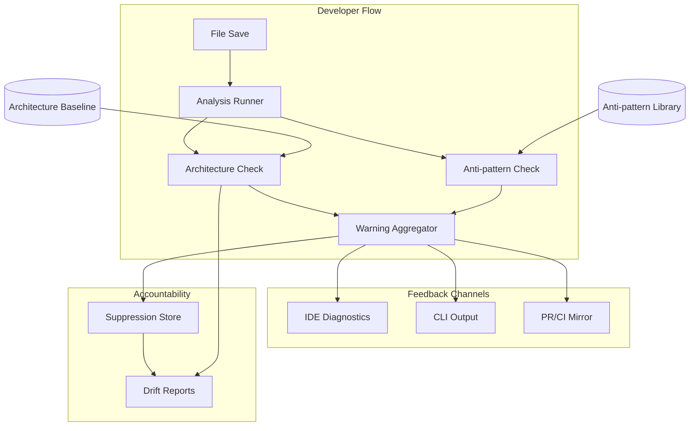

<!-- APS: See https://github.com/EddaCraft/anvil-plan-spec for format reference -->
<!-- This document is non-executable. -->

# Anvil v1 — Save-time Trust

## Overview

Anvil v1 makes AI-generated code safe to merge by catching architecture boundary
violations and AI escape-hatch anti-patterns at file-save time. Developers get
actionable warnings before code leaves the file, with human-owned exceptions for
intentional deviations.

**Why this matters:** AI coding tools are accelerating development, but they
don't understand your architecture. They produce code that compiles and passes
tests, yet drifts from intended patterns. By the time drift is noticed in
review, it's already merged or too expensive to fix. Anvil catches it at the
moment of creation — when fixing is cheap.

**Product thesis:** Anvil improves trust in AI-generated code so more of it
reaches production faster, while architecture drift slows or reverses over time.

**Primary beneficiary:** Individual developers — they get to use AI safely at
the pace leadership expects.

## Problem & Success Criteria

**Problem:** The most damaging recurring failure is second-wave feature work
drifting from intended patterns because engineers:

- don't know which patterns apply
- don't read ADRs or architecture diagrams
- don't recognise when their change crosses a boundary

The most reliable early signal: a **new dependency edge** where a function or
class reaches across architectural contexts.

**Success Criteria:**

- [ ] 50%+ of developers run Anvil on every save (adoption)
- [ ] Time-to-merge for AI-assisted PRs does not increase (throughput)
- [ ] New cross-boundary edges per sprint decreases by 30% within 8 weeks
      (drift)
- [ ] Save-time feedback latency < 2 seconds cached, < 5 seconds cold (speed)
- [ ] < 10% of warnings are suppressed without resolution (signal quality)

## Constraints

- Must deliver value **without requiring plans/APS** as a prerequisite
  (planless-first)
- Must not hard-block by default — warnings, not errors
- Must run on Node.js 20+
- Must integrate with existing ESLint/Prettier tooling, not replace it
- Must acknowledge legacy drift without overwhelming developers with noise

## System Map

## Milestones

### M1: Core Analysis Engine

- **Target:** Sprint 1–2
- **Includes:** save-time-trust, architecture-safety
- **Exit criteria:** `anvil check <file>` returns warnings with explanations

### M2: Anti-pattern Detection

- **Target:** Sprint 3
- **Includes:** antipattern-library
- **Exit criteria:** ESLint-disable, `any`, `@ts-ignore` detected in new code

### M3: Developer Ergonomics

- **Target:** Sprint 4
- **Includes:** suppressions, drift-reporting
- **Exit criteria:** Developers can suppress with accountability; leads see
  trends

### M4: Integration Points

- **Target:** Sprint 5+
- **Includes:** ide-integration, ci-integration, tui-enhancement
- **Exit criteria:** Warnings appear in VS Code; PRs show warning summaries; TUI
  wizard completes setup in < 60s

## Modules

| Module                                                      | Scope | Owner | Status | Priority | Dependencies                                           |
| ----------------------------------------------------------- | ----- | ----- | ------ | -------- | ------------------------------------------------------ |
| [save-time-trust](./modules/save-time-trust.aps.md)         | CORE  | —     | Draft  | high     | —                                                      |
| [architecture-safety](./modules/architecture-safety.aps.md) | ARCH  | —     | Draft  | high     | save-time-trust                                        |
| [antipattern-library](./modules/antipattern-library.aps.md) | ANTI  | —     | Draft  | high     | save-time-trust                                        |
| [suppressions](./modules/suppressions.aps.md)               | SUPP  | —     | Draft  | medium   | architecture-safety, antipattern-library               |
| [drift-reporting](./modules/drift-reporting.aps.md)         | DRIFT | —     | Draft  | medium   | architecture-safety, antipattern-library, suppressions |
| [tui-enhancement](./modules/tui-enhancement.aps.md)         | TUI   | —     | Draft  | high     | —                                                      |
| [ide-integration](./modules/ide-integration.aps.md)         | IDE   | —     | Draft  | medium   | save-time-trust                                        |
| [ci-integration](./modules/ci-integration.aps.md)           | CI    | —     | Draft  | low      | save-time-trust                                        |

## Risks & Mitigations

| Risk                            | Impact | Likelihood | Mitigation                                               |
| ------------------------------- | ------ | ---------- | -------------------------------------------------------- |
| Warning noise kills adoption    | high   | medium     | High-signal patterns only; warn on NEW edges, not legacy |
| Analysis too slow (> 2s)        | high   | medium     | Incremental analysis; hash-based caching; warm daemon    |
| Developers bypass with `--skip` | medium | medium     | Track skip usage; surface in drift reports               |
| Legacy drift overwhelms users   | medium | high       | Baseline existing violations; focus warnings on new code |
| Over-claiming blast radius      | medium | medium     | Careful language; surface confidence levels              |

## Decisions

- **D-001:** Planless-first posture — deliver value without requiring APS plans
  ([ADR](./decisions/001-planless-first.md))
- **D-002:** Warnings over blocks — inform, don't prevent; let CI enforce if
  desired ([ADR](./decisions/002-warnings-over-blocks.md))
- **D-003:** New edges only — baseline existing architecture; warn only on new
  violations ([ADR](./decisions/003-new-edges-only.md))
- **D-004:** Suppression syntax — `@anvil-ignore <ID>: <reason>` with mandatory
  explanation ([ADR](./decisions/004-suppression-syntax.md))

## Open Questions

- [ ] VS Code extension vs CLI-only for v1? (Leaning: CLI first, VS Code in M4)
- [ ] Which entry points define "public API" for boundary detection?
- [ ] Provenance storage: `.anvil/suppressions.json` vs inline-only?
- [ ] Should drift reports include team/author attribution? (Privacy concern)
- [ ] How to handle monorepos with multiple architecture baselines?
