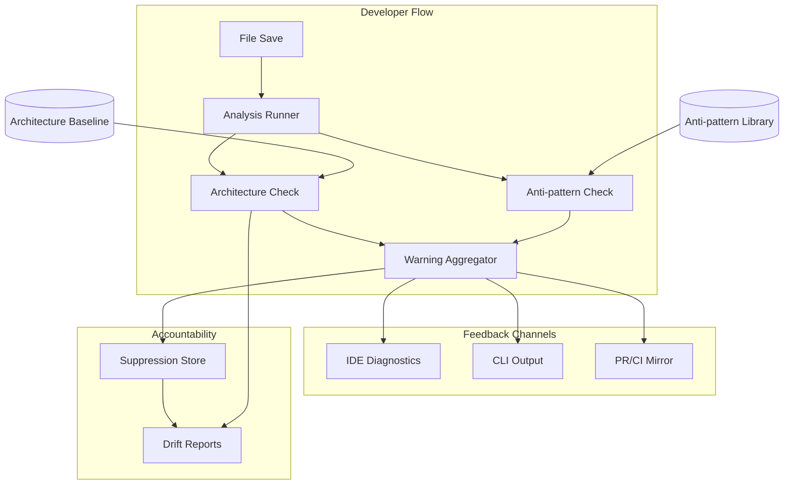

<!-- APS: See https://github.com/eddacraft/anvil-plan-spec for format reference -->
<!-- This document is non-executable. -->

# Anvil — Save-time Trust

> **Latest release tag: `v0.6.2-beta`.** The operational substrate window is
> shipped — OPMODEL 12/12 (archived 2026-05-11; main-first cutover done),
> RELORCH 12/12 (archived; deterministic release command surface), and CICD
> 12/12 (archived 2026-05-12; CI targeting + drift checks + workflow contract
> map). The next tag candidate is the daemon-working product slate
> `v0.7.0-beta` (MLP + INTL). See
> [`RELEASE-PLAN.md`](../RELEASE-PLAN.md) for the cut detail and
> [`ROADMAP.md`](../ROADMAP.md) for thematic context across horizons.

## Overview

## Contents

- [Release Plan](#release-plan)
- [Branch Recovery](#branch-recovery)
- [Hardening & Maintenance](#hardening--maintenance)
- [Continuous Improvement](#continuous-improvement)
- [Adoption and Sustained Use](#adoption-and-sustained-use)
- [Rust Engine](#rust-engine)
- [Auth & Access](#auth--access)
- [Dev Tooling Bridge](#dev-tooling-bridge)
- [Observability Foundation](#observability-foundation)
- [Tracing Foundation](#tracing-foundation)
- [Usage Analytics](#usage-analytics)
- [Infrastructure as Code](#infrastructure-as-code)
- [Web Dashboard](#web-dashboard)
- [Policy Governance](#policy-governance)
- [Engineering Platform](#engineering-platform)
- [Test Quality](#test-quality)
- [Language & Coverage](#language--coverage)
- [Config Intelligence](#config-intelligence)
- [Graph Substrate](#graph-substrate)
- [Rust MCP Launch Path](#rust-mcp-launch-path)
- [Intercept Loop](#intercept-loop)
- [Agent Infrastructure](#agent-infrastructure)

Anvil makes AI-generated code safe to merge by catching architecture boundary
violations and AI escape-hatch anti-patterns at file-save time. Developers get
actionable warnings before code leaves the file, with human-owned exceptions for
intentional deviations.

**Why this matters:** AI coding tools are accelerating development, but they
don't understand your architecture. They produce code that compiles and passes
tests, yet drifts from intended patterns. By the time drift is noticed in
review, it's already merged or too expensive to fix. Anvil catches it at the
moment of creation — when fixing is cheap.

**Product thesis:** Anvil improves trust in AI-generated code so more of it
reaches production faster, while architecture drift slows or reverses over time.

**Primary beneficiary:** Individual developers — they get to use AI safely at
the pace leadership expects.

## Problem & Success Criteria

**Problem:** The most damaging recurring failure is second-wave feature work
drifting from intended patterns because engineers:

- don't know which patterns apply
- don't read ADRs or architecture diagrams
- don't recognise when their change crosses a boundary

The most reliable early signal: a **new dependency edge** where a function or
class reaches across architectural contexts.

**Success Criteria:**

- [ ] 50%+ of developers run Anvil on every save (adoption) — post-release
- [ ] Time-to-merge for AI-assisted PRs does not increase (throughput) —
      post-release
- [ ] New cross-boundary edges per sprint decreases by 30% within 8 weeks
      (drift) — post-release
- [x] Save-time feedback latency < 2 seconds cached, < 5 seconds cold (speed)
- [ ] < 10% of warnings are suppressed without resolution (signal quality) —
      post-release

## Release Plan

Releases are themed by what they deliver, not sequenced by version number.
Individual packages still use semantic versioning for npm/cargo publishes.

### Shipped operational window — `v0.6.2-beta`

The OPMODEL-012 main-first cutover landed on 2026-05-11, RELORCH completed the
deterministic release command surface, and CICD closed the targeting/drift
readiness work on 2026-05-12. The operational release `v0.6.2-beta` is tagged;
the current planning window has moved to the daemon-working product slate.

| Area | Status | Progress | Notes |
| ---- | ------ | -------- | ----- |
| Shipped baseline | Shipped | `v0.6.2-beta` tag | Wow-start activation, daemon-backed validation, and the executable release operating model are behind us; current work should not reopen operational substrate scope. |
| Main-first cutover | Complete | OPMODEL 12/12 — archived 2026-05-11 | Cutover SHA `b6f236e9`; `main` ruleset id 16217152 enforces 7 required checks + PR + non-FF + no-delete; `dev` retired as `dev-retired-2026-05-11` tag (deletion follow-up #1419). Module archived. |
| CI/CD release readiness | Shipped | OPMODEL-005 spec + CICD-009 implementation complete | `.github/workflows/release-readiness.yml` validates an exact `main` SHA with no publishing credentials; candidate metadata + retention live. CICD-012 added cutover-aware gates and self-defending fork-reject. |
| Release orchestration | Complete | RELORCH 12/12 | Completed command-surface slice after OPMODEL-012 unblocked main-targeted work: assess, preflight, prepare, promote, tag, monitor, verify, closeout, command harness, release-record yank/discard schema closure, and skill/runbook wire-up with legacy runner removal. Live CI readiness authority remains tracked under CICD. |
| CI targeting + drift | Complete | CICD 12/12 (closed 2026-05-12) | All twelve items shipped: cost reporting (-001), classifier (-002), local validation (-003), fast PR validation (-004), integration SHA split (-005), coverage cost controls (-006), security/dependency targeting (-007), platform-matrix targeting (-008), release-readiness reconciliation (-009), workflow contract map + authority audit (-010), APS/repo/release drift checks in CI with PR-metadata extension (-011), and cutover readiness (-012). Council follow-ups closed via PR #1442 (issue #1438). |
| Daemon-working product slate | Current candidate | MLP 18/18 Complete (Done 2026-05-13/-14); MLP2 2/56 (In Progress — MLP2-001 + MLP2-002 shipped 2026-05-14 on `feat/MLP2`; integration follow-ups split out from MLP-018 catalogue); INTL 0/9 (Ready, ready-to-start-Wave-3); carry-forward gates 6/6 confirmed (Wave 0 closed 2026-05-13) | Next tag candidate `v0.7.0-beta`; MLP v1 surface area shipped. Integration debt tracked module-locally in MLP2 — each of the 56 sub-items (Groups A daemon enforcement, B witness-chain extensions, C L4 policy execution, D multi-session + fence isolation, E cross-platform attribution, F TS driver-client mirrors, G baseline + identity wiring, H hook + config completion, I GH Action publishing, J protection-claim render conformance, K Kindling activation orchestrator) is now a first-class APS task. |

### Next window (proposed) — _daemon-working slate_

OPMODEL, RELORCH, and CICD are closed. The next product planning window is now
the active release candidate. **Theme:** _Daemon working end-to-end_ —
`anvil start` lands a real testable protection claim, hooks fire
deterministically, the witness chain records every commit, baseline adoption
works, and `anvil-run` wraps agent processes. Target tag candidate:
**`v0.7.0-beta`**.

Source of truth for current parallelisation and release dependencies:
[`RELEASE-PLAN.md`](../RELEASE-PLAN.md).

| Pick | Status | Progress | Notes |
| ---- | ------ | -------- | ----- |
| N1 — Multi-Layer Protection v1 (MLP) | Complete | 18/18 | Witness chain + hooks + L4 policy + baseline + multi-agent coord + rule distribution. Crates: `anvil-witness`, `anvil-config`, `anvil-rules`, `anvil-baseline`, `anvil-hook`, `anvil-l4`, `anvil-attribution`, `anvil-kernel-types::protection_claim`, plus `anvil-intercept::kindling_observation` module. **Hard gate: MLP-009 — Done 2026-05-13.** Promoted from Proposed during Wave 0 readiness review (2026-05-13). Wave 1 / Wave 2 / Wave 3 all shipped 2026-05-13. MLP-018 (v1-deferrals catalogue) closed 2026-05-14 — the 56 sub-items split out into the new MLP2 module ([`plans/modules/multilayer-protection-v2.aps.md`](./modules/multilayer-protection-v2.aps.md)) so each integration item is plannable in isolation. |
| N1b — Multi-Layer Protection v2 (MLP2) | In Progress | 2/56 | Follow-up module collecting the 56 integration items from MLP-018's catalogue. Closes the gap between every v1 primitive and the full surfaces it targets. 11 groups (A–K) covering daemon enforcement integration, witness-chain extensions, L4 policy execution, multi-session + fence isolation, cross-platform attribution, TS driver-client mirrors, baseline + identity wiring, hook + config completion, GH Action publishing, protection-claim render conformance, and Kindling activation orchestrator. Every task carries an explicit `Source:` line linking back to its originating MLP task / footnote / PR. |
| N2 — Intercept Launcher v1 (INTL) | Ready (ready-to-start-Wave-3) | 0/9 | `anvil-run` wrapped-launch ingress. New crate: `anvil-run`. `AgentTag` stub landed in `crates/anvil-intercept-proto/src/session.rs` (3 tests green) with `ANVIL_AGENT_TAG_ENV` / `ANVIL_TASK_ID_ENV` constants for INTL-004 propagation. INTL-003 and INTL-004 promoted to task-Ready; the other seven tasks remain Draft pending their direct prerequisites. Module-level Ready means "ready to begin Wave 3" not "all tasks reviewed". Promoted from Draft during Wave 0 readiness review (2026-05-13). |
| N3 — Carry-forward gates | 6/6 confirmed | 6/6 | G1 ADR-036/-037/-038/-039 **Accepted** (2026-05-13), `DECISION-LOG.md` updated, `pnpm adr:check` green; G2 `anvil/project-id` schema reaffirmed (MLP-001 + ADR-036 §D-2); G3 noise-discipline **policy** confirmed (ADR-038), behavioural audit deferred to Wave 2; G4 AIGUARD envelope re-run via `cargo test -p eddacraft-anvil-kernel-types` (`diagnostic_schema_version_constant_matches_spec` pins `anvil.diagnostic.v1`); G5 INTR-004 promoted **Draft → Ready** (2026-05-13); G6 DRVR forward-compat: new `session.rs` co-existed with existing `protocol.rs` types under the full proto suite (28 passed). |
| N4 — Documentation lanes | Owned, scoped | 0/6 | Adoption / air-gap / witness-chain / hooks-integration runbooks; migration note; INTL manpage. Wave 0 (2026-05-13) confirmed ownership: all six lanes assigned to @aneki; targets land in Wave 4 of `RELEASE-PLAN.md`. |
| N5 — Adoption Trust Surface (ADTRUST) | Ready | 0/6 | Make the protection claim legible and verifiable during sustained daily use. `anvil status` legibility (-001), degraded-state surfacing (-002), `anvil doctor --fix` (-003), daemon-down auto-recovery (-004), `anvil status --json` schema pin (-005), first-run claim summary (-006). Promoted **Proposed → Ready** 2026-05-14 alongside acceptance of the v0.7.0 sit-on spec. Lands in Wave 3B of `RELEASE-PLAN.md`. Module ID disambiguated from `trust-center-automation` (already uses `TRUST`). |
| N6 — Adoption Friction Removal (ADOPT) | Ready | 1/6 | Remove first-week adoption friction. Hook coexistence (-001), CI-enforced resource budget (-002), AI tool auto-detect (-003), complete ignore policy (-004), **clean uninstall (-005) shipped 2026-05-14 via PR #1521**, editor coexistence matrix (-006). Promoted **Proposed → Ready** 2026-05-14. Lands in Wave 3A of `RELEASE-PLAN.md`. |
| N7 — Distribution & Self-Update (DISTRIB) | Ready | 0/5 | Harden the update/distribution loop so hotfix iteration actually reaches users. Signature verification + resolution-chain robustness (-001), `anvil version --check` advisory surface (-002), Homebrew formula automation (-003), release cadence + EOL policy doc (-004), `anvil migrate` (-005). Promoted **Proposed → Ready** 2026-05-14. ADR-044 §9 makes -001 and -002 load-bearing for the MCP-backend swap discovery gap. Lands in Wave 3A. |
| N8 — Usage Insights (INSIGHTS) | Ready | 0/4 | Periodic value signal during the silent middle. `anvil insights` weekly summary (-001), suppression health view (-002), drift trend sparkline (-003), first-week adoption hint (-004). Local-only, no telemetry. Promoted **Proposed → Ready** 2026-05-14. Lands in Wave 4. |
| N9 — Boring Week validation gate | Pre-tag | — | Three or more internal users run `v0.7.0-beta` candidate on real work for one calendar week under fresh-user config. Any disabled check, unresolved suppression, or hook bypass is a cut blocker. Participants TBD by @aneki before tag. Documented in `RELEASE-PLAN.md` Wave 5. |

**Window risk:** MLP-002 (witness chain primitive) is the single point of
failure — every downstream lane reads/writes against it. Spike-first as a
standalone PR (flock + DAG verification + 80-parallel-hook test) before any
hook lane starts. Keep the recovery shape in the active release plan when MLP is
promoted back into the current release window.

### Last release — `v0.5.0-beta` (shipped 2026-05-01)

The slate below shipped as `v0.5.0-beta` on 2026-05-01. Tables are retained
for historical record; counts read "Complete / Locked" rather than "Complete
/ In Progress". For active release sequencing see
[`ROADMAP.md`](../ROADMAP.md) (strategic narrative) and the module status
table earlier in this file (work-state authority); the next-release menu
lives in [`RELEASE-PLAN.md`](../RELEASE-PLAN.md).

### A1 — RTAI Spike Slice (launch-blocker, ~24 items, shipped)

The A1 cut was a **virtual slice** cherry-picked across four modules
(INTD, INTR, RMCP, RTAI). Status was reconciled on 2026-04-30 after the
RMCP-008 Cursor / Claude Code GUI dry-run completed against
`target/release/anvil` and was recorded in the RTAI demo runbook validation
log (`plans/specs/2026-04-26-rtai-demo-runbook.md` §8). The shipped release
state and dependency order are mirrored in
[`RELEASE-PLAN.md`](../RELEASE-PLAN.md).

| Source module | A1 items | Complete | Committed | In Progress | Ready / unblocked | Blocked |
| ------------- | -------- | -------- | --------- | ----------- | ----------------- | ------- |
| INTD | -001, -002, -003, -005, -007, -013, -014 | -001, -002, -003, -005, -007, -013, -014 | — | — | — | — |
| INTR | -001 (trait), -002 (secret), -006 (registry), -008 (reasoning) | -001, -002, -006, -008 | — | — | — | — |
| RMCP | -001..-008 | -001..-008 | — | — | — | — |
| RTAI | -001 (spike), -002, -003, -006, -008 | -001, -002, -003, -006, -008 | — | — | — | — |
| **Total** | **24** | **24** | **0** | **0** | **0** | **0** |

**A1 — Shipped in `v0.5.0-beta`.** All 24 items shipped and validated. The
next slice for RMCP/RMCPF is captured here so it does not get lost between
release cuts. `v0.5.0-beta` was explicitly validated as
**embedded-fallback-backed, not daemon-backed**; the daemon wiring is the
headline post-release follow-up:

1. **Wire the daemon validation client:** RMCP-005's live daemon-backed
   `DaemonValidationClient` is committed in PR #1277. The client now calls the
   daemon `scan_buffer` RPC when available and keeps the embedded path as the
   correctness-equivalent fallback for genuinely unavailable daemon paths.

**Daemon-path note:** RMCP-005's `DaemonValidationClient` now has a live
JSON-RPC implementation committed in PR #1277. MCP `tools/call` uses the
daemon-backed pipeline when the owner-only IPC endpoint is available; the
embedded path remains the correctness-equivalent fallback when the daemon is not
running.

**A1 ambiguities resolved by ship:**

- INTR slice item: launch slice listed "INTR-006 config" — INTR-006 is the
  rule **Registry** and INTR-007 is rule **Configuration**. The registry
  was load-bearing for the daemon-backed path and shipped under -006;
  INTR-007 (Configuration) remains Draft for the next release window.
- The X5 ADR-030 sequencing question is effectively resolved: INTD work
  *did* ship inside the `-beta` cut. The tag-rename option for the next
  release (daemon-backed RTV) is still open but no longer blocks A1's
  status.

### A2-A4 — Shipped Source Modules

The remaining `v0.5.0-beta` slices were smaller than A1 but still spanned
multiple APS modules. This table names the exact module subsets that formed
each slice; full module state remains in the detailed module tables below.
Items listed under "Remaining state" did **not** ship in `v0.5.0-beta` and
remain candidates for the next-release slate.

| Slice | Source module | Locked items | Complete | Remaining state |
| ----- | ------------- | ------------ | -------- | --------------- |
| A2 | AIGUARD | AIGUARD-001..-004 | AIGUARD-001..-004 | — |
| A3 | GHOOK | GHOOK-001 | GHOOK-001 | — |
| A3 | ATTRIB | ATTRIB-001, ATTRIB-002, ATTRIB-003 | ATTRIB-001..-003 | ATTRIB-004..-011 remain outside this release cut |
| A3 | SCAN | SCAN-001, SCAN-002, SCAN-003 | SCAN-001..-003 | SCAN-004/-005 remain outside this release cut |
| A4 | LANGTS | LANGTS-001, LANGTS-003 | LANGTS-001, LANGTS-003 | LANGTS-002/-004/-005 remain outside the locked floor unless re-scoped |
| A4 | OPSUP | OPSUP-001 (check-ID registry slice) | OPSUP-001 | OPSUP-002..-007 remain outside this release cut |
| A4 | SURFENV | SURFENV-001..-006 | SURFENV-001..-006 | — |

### Edda Stack — Memory System

Kindling (observation), Ember (interpretation), Edda (canonical memory),
integration layer, and review backlog.

See [completed-index.aps.md](./completed-index.aps.md) for task tables.

### Branch Recovery

Reconcile divergent `main`/`dev` histories by porting release-critical fixes
from `main` onto `dev`, validating as one integrated branch, then cutting over.
See `docs/runbooks/branch-reconciliation.md` and the freeze notice in
`RECONCILIATION-IN-PROGRESS.md`.

| Module                                                                  | Scope  | Status   | Progress |
| ----------------------------------------------------------------------- | ------ | -------- | -------- |
| [branch-reconciliation](./archive/modules/branch-reconciliation.aps.md) | BRECON | Complete | 14/14    |

### Hardening & Maintenance

Codebase cleanup, .anvil file format, and BMAD v4 compatibility.

| Module                                                                          | Scope  | Status      | Progress                                                                                                                                                                                                                                                                                                                                                                                    |
| ------------------------------------------------------------------------------- | ------ | ----------- | ------------------------------------------------------------------------------------------------------------------------------------------------------------------------------------------------------------------------------------------------------------------------------------------------------------------------------------------------------------------------------------------- |
| [codebase-maintenance](./archive/modules/codebase-maintenance.aps.md)           | MAINT  | Complete    | 11/11 (1 deferred)                                                                                                                                                                                                                                                                                                                                                                          |
| [anvil-file-format](./archive/modules/anvil-file-format.aps.md)                 | ANVFMT | Complete    | 15/16 (1 reparented to RSCAN-006 under ADR-026)                                                                                                                                                                                                                                                                                                                                             |
| [anvil-rust-scanner](./archive/modules/anvil-rust-scanner.aps.md)               | RSCAN  | Complete    | 8/8 (RSCAN-008 landed — docs now describe the authoritative Rust scanner and the scanner-parity story per ADR-026)                                                                                                                                                                                                                                                                          |
| [nx-task-migration](./archive/modules/nx-task-migration.aps.md)                 | NXTASK | Complete    | 6/6                                                                                                                                                                                                                                                                                                                                                                                         |
| [anvil-scanner-parity-gaps](./archive/modules/anvil-scanner-parity-gaps.aps.md) | SPG    | Complete    | 6/6 (`flags:"i"` honoured, lookaround rules handled via post-filters, doctor surfaces compile failures, fixtures cover every rule, `antipattern_scan` bench + trust-boundary docs landed)                                                                                                                                                                                                   |
| [anvil-ts-scanner-retirement](./archive/modules/anvil-ts-scanner-retirement.aps.md) | TSRET  | **Complete** | 3/3 active (3 superseded) — TSRET-001/-002/-005 Complete; TSRET-003/-004 superseded by DRVR; TSRET-006 superseded by ADR-033. Terminal state on `chore/TSRET-005` (2026-04-29): TS scanner + suppression + drift + gate runner + constraint collector all archived to `archive/anvil-ts-scanner/`; minimal `Warning` type extracted to `core/src/warnings/types.ts`; Rust-side parity test deleted; root `test:scanner-parity` script removed.                                                                 |
| [scanner-adjacent-ts-retirement](./modules/scanner-adjacent-ts-retirement.aps.md) | TSGAP  | Complete    | 9/9 (Remediation complete 2026-05-12: core exports cleaned; compiler moved to active `anvil-format`; drift/export/suppression ownership settled on Rust CLI/local readers; AP-* explanations explicitly retired until Rust explain lands; RMCPF now maps MCP resources to Rust-owned sources; final audit passed) |

| [bmad-v4-backward-compat](./modules/bmad-v4-backward-compat.aps.md)             | BMAD4  | Proposed    | 0/8                                                                                                                                                                                                                                                                                                                                                                                         |
| [scan-performance](./modules/scan-performance.aps.md)                           | SCAN   | In Progress | 3/5 (SCAN-001/-002/-003 landed as one slice — parallel-scan rollout, ReDoS line-length guard, first-run rayon pool cap; SCAN-004/-005 deferred per Council E "smallest viable cut")                                                                                                                                                                                                         |
| [nx-rust-plugin](./archive/modules/nx-rust-plugin.aps.md)                       | NXRUST | Complete    | 8/8 (plugin now consumed from npm as `@eddacraft/nxrust`; NXRUST-005/-006 superseded by `cargo metadata` inference — zero per-crate `project.json` needed)                                                                                                                                                                                                                                  |
| [rust-nx-migration](./archive/modules/rust-nx-migration.aps.md)                 | RUSTNX | Complete    | 9/9                                                                                                                                                                                                                                                                                                                                                                                         |
| [v050-release-followups](./modules/v050-release-followups.aps.md)               | V050F  | In Progress | 14/16 (16 hardening items deferred from `v0.5.0-beta` release work: 10 from the council rounds, 1 from the copilot PR #1081 review, 3 from the v0.4.0-beta tag run + post-tag deploy — scoop PAT scope, winget gh arg regression, missing migration runner — 1 from the copilot PR #1090 review tracking the svix>uuid override exception, and 1 private-release Latest promotion fix; 14 done; 2 outstanding — V050F-008 (bench baselines on CI hardware), V050F-015 (svix>uuid override removal). V050F-006 + V050F-011 closed via `fix/v050f-scanner-hotpath` (#1323); V050F-007 closed via `fix/v050f-rayon-init` (#1330).) |
| [v060-release-candidates](./modules/v060-release-candidates.aps.md)             | V060F  | In Progress | 4/25 (V060F-001 complete via RCLI2-009 admin command parity; V060F-025 complete — OPA runtime pin bumped to 1.16.1; V060F-020 complete 2026-05-12 — `TerminalGuard` + idempotent panic hook; V060F-021 complete 2026-05-12 — refreshed tutorial legacy paths; V060F-002..V060F-011 filed 2026-05-07 batch 1; V060F-012..V060F-019 filed 2026-05-07 batch 2; V060F-022..V060F-024 remain open from batch 3) |
| [release-orchestration](./archive/modules/release-orchestration.aps.md)                 | RELORCH | Complete | 12/12 (Completed 2026-05-11 after OPMODEL-012 unblocked main-targeted command work. RELORCH-001 design spec; RELORCH-002 reusable command harness and CI workflow; RELORCH-003 assess; RELORCH-004 preflight; RELORCH-005 prepare with tracking issue create/resume, idempotent release-time edits, preparation commit flow, and metadata comments; RELORCH-006 promote with PR create/resume, conflict/review/merge-state reporting, and readiness workflow request/resume; RELORCH-007 tag with guarded pre/post-push recovery semantics; RELORCH-008 monitor with workflow result surfacing; RELORCH-009 verify with structured release/publisher checks; RELORCH-010 closeout with verification gating and issue closeout semantics; RELORCH-011 skill/runbook wire-up and legacy runner deletion; RELORCH-012 release-record `discarded`/`yanked` lifecycle states and closed `policyDecisions` entries. Successor to archived RELMGMT; supersedes parts of `2026-04-20-relmgmt-agent-driven-release-design.md` while inheriting its no-persistent-manifest tradeoff as a hard constraint.) |

**Design doc (Forge & Temper — archived):**
[docs/archive/2026-02-24-forge-temper-review-pipeline.md](../docs/archive/2026-02-24-forge-temper-review-pipeline.md)

### Continuous Improvement

Continuous-improvement-backlog is the standing intake for concrete improvement
items identified anywhere in the project. It intentionally remains active while
the project is active; append executable `CIB-NNN` items as they are found.
Codebase-maintenance and code-review-backlog are retained for history.

| Module                                                                      | Scope | Status      | Progress           |
| --------------------------------------------------------------------------- | ----- | ----------- | ------------------ |
| [continuous-improvement-backlog](./modules/continuous-improvement-backlog.aps.md) | CIB   | In Progress | 2/3                |
| [codebase-maintenance](./archive/modules/codebase-maintenance.aps.md)       | MAINT | Complete    | 11/11 (1 deferred) |
| [code-review-backlog](./archive/modules/code-review-backlog.aps.md)         | CRB   | Complete    | 29/29              |

> ~~continuous-improvement~~ (CI) — retired 2026-04-18; was a meta-module
> without executable tasks. It remains archived. New concrete cross-project
> improvement intake now goes through
> [continuous-improvement-backlog](./modules/continuous-improvement-backlog.aps.md).

### Adoption and Sustained Use

The "release we sit on" cohort. These four modules cover what turns
`v0.7.0-beta` from "feature complete" into "ready for senior engineers to
use daily for a month without uninstalling." They were promoted from
proposal to live planning on 2026-05-14 alongside acceptance of
[`plans/specs/2026-05-14-release-plan-v0.7.0-sit-on.md`](./specs/2026-05-14-release-plan-v0.7.0-sit-on.md);
the live release sequencing is in
[`RELEASE-PLAN.md`](../RELEASE-PLAN.md) (Waves 3A / 3B / 5).

| Module                                                                  | Scope    | Status | Progress | Notes                                                                                                                                                                                              |
| ----------------------------------------------------------------------- | -------- | ------ | -------- | -------------------------------------------------------------------------------------------------------------------------------------------------------------------------------------------------- |
| [adoption-trust-surface](./modules/adoption-trust-surface.aps.md)       | ADTRUST  | Ready  | 0/6      | Make the protection claim legible and verifiable in sustained daily use. Wave 3B.                                                                                                                  |
| [adoption-friction](./modules/adoption-friction.aps.md)                 | ADOPT    | Ready  | 1/6      | First-week friction removal. **ADOPT-005 `anvil uninstall` shipped 2026-05-14 (PR #1521).** Hook coexistence (-001), resource budget (-002), AI auto-detect (-003), shared ignore (-004), editor coexistence (-006) remain. Wave 3A. |
| [distribution-and-update](./modules/distribution-and-update.aps.md)     | DISTRIB  | Ready  | 0/5      | Harden `anvil update` + Homebrew + cadence policy so hotfix iteration reaches users. ADR-044 §9 makes DISTRIB-001 / -002 load-bearing for the MCP-backend swap discovery gap. Wave 3A.             |
| [usage-insights](./modules/usage-insights.aps.md)                       | INSIGHTS | Ready  | 0/4      | Local-only periodic value signal (`anvil insights`). No telemetry. Wave 4.                                                                                                                         |

### Rust Engine

Rust kernel for structural graph analysis (KERN), performance-critical check
ports (RENG). RATS (Ratatui TUI) and PORT (Ink-to-Ratatui port) are complete.
TUIDASH adds a Rust-native json-render spec interpreter for Ratatui dashboard
rendering. KERN is complete (3 daemon-mode items deferred post-H1), RENG is
complete, RCLI is complete.

| Module                                                                    | Scope   | Status      | Progress                                                                                                          | Dependencies                                                                                                                                                                                                                                                                       |
| ------------------------------------------------------------------------- | ------- | ----------- | ----------------------------------------------------------------------------------------------------------------- | ---------------------------------------------------------------------------------------------------------------------------------------------------------------------------------------------------------------------------------------------------------------------------------- |
| [rust-kernel](./archive/modules/rust-kernel.aps.md)                       | KERN    | Complete    | 22/25 (3 superseded by INTD per ADR-030 — KERN-050 → INTD-002, KERN-051 → INTD-002+INTD-013, KERN-052 → INTD-003) | —                                                                                                                                                                                                                                                                                  |
| [rust-core-engine](./archive/modules/rust-core-engine.aps.md)             | RENG    | Complete    | 6/6                                                                                                               | KERN Phase 1, KERN Phase 2                                                                                                                                                                                                                                                         |
| [ratatui-tui](./archive/modules/ratatui-tui.aps.md)                       | RATS    | Complete    | 7/7                                                                                                               | KERN Phase 3                                                                                                                                                                                                                                                                       |
| [ink-to-ratatui-port](./archive/modules/ink-to-ratatui-port.aps.md)       | PORT    | Complete    | 15/15                                                                                                             | RATS-001 (complete)                                                                                                                                                                                                                                                                |
| [rust-cli](./archive/modules/rust-cli.aps.md)                             | RCLI    | Complete    | 64/64                                                                                                             | KERN, RATS, PORT                                                                                                                                                                                                                                                                   |
| [kernel-benchmarking](./archive/modules/kernel-benchmarking.aps.md)       | BENCH   | Complete    | 16/16                                                                                                             | KERN Phases 1-2                                                                                                                                                                                                                                                                    |
| [tui-dashboard-render](./modules/tui-dashboard-render.aps.md)             | TUIDASH | Draft       | 0/12                                                                                                              | RATS (complete), DASHAI (parallel; not blocking)                                                                                                                                                                                                                                   |
| [launch-flow-readiness](./archive/modules/launch-flow-readiness.aps.md)   | LAUNCH  | Complete    | 18/18                                                                                                             | RCLI, KERN; coordinates with TUIDASH, DRVR, RMCP, RTAI, INTD; supersedes RTVS in part; adds upgrade/version UX, tutorial polish, repo language profile + filter                                                                                                                    |
| [realtime-ai-validation](./modules/realtime-ai-validation.aps.md)         | RTAI    | In Progress | 6/9                                                                                                               | A1 launch slice complete: RTAI-001 (spike), -002 (PR #1186), -003 (PR #1189), -006 (PR #1190), -008 (PR #1188) merged 2026-04-29/30. A2 Wave 3: RTAI-004 (PR #1311) merged 2026-05-06. Remaining items (RTAI-005/-007/-009) are Wave 4 / ADR-033-deferred per the A2 brief.                                                              |
| [rust-cli-tier2](./modules/rust-cli-tier2.aps.md)                         | RCLI2   | In Progress | 5/9                                                                                                               | RCLI; RCLI2-001..-004 shipped per 2026-04-26 freshness audit (commits 1e44ef2d / c5679432 / a2297dca / 06d764d4); -005..-008 still Proposed (gated on OPAE); -009 complete (admin command parity — list/show/revoke/audit/send-migration/email-update)                           |
| [rust-cli-tier3](./modules/rust-cli-tier3.aps.md)                         | RCLI3   | In Progress | 1/20                                                                                                              | RCLI                                                                                                                                                                                                                                                                               |
| [tui-polish](./archive/modules/tui-polish.aps.md)                         | POLISH  | Complete    | 8/8                                                                                                               | RCLI, RATS                                                                                                                                                                                                                                                                         |
| [restore-welcome-screen](./archive/modules/restore-welcome-screen.aps.md) | WELCOME | Complete    | 18/18                                                                                                             | RCLI, RATS                                                                                                                                                                                                                                                                         |
| [distribution-pipeline](./archive/modules/distribution-pipeline.aps.md)   | DIST    | Complete    | 8/10 (1 deferred, 1 optional-deferred)                                                                            | RCLI                                                                                                                                                                                                                                                                               |

The TypeScript CLI is archived — the Rust kernel adds structural graph analysis
as a new capability (KERN), existing checks port to Rust for speed (RENG), TUI
surfaces use Ratatui (RATS), and existing Ink surfaces are ported systematically
(PORT). See
[Architecture Evolution](../docs/architecture/anvil-architecture-evolution.md)
for the phased rollout plan.

### Auth & Access

Streamline beta access: device code + email OTP activation flows, JWT session
model with rotating refresh tokens, admin CLI approval, Resend audience
management. Docs auth gating adds GitHub OAuth as a third activation mechanism
and gates `/anvil` docs behind it via Vercel Edge.

| Module                                                                | Scope     | Status   | Progress | Dependencies |
| --------------------------------------------------------------------- | --------- | -------- | -------- | ------------ |
| [beta-auth-streamline](./archive/modules/beta-auth-streamline.aps.md) | BAUTH     | Complete | 20/20    | —            |
| [docs-auth-gating](./archive/modules/docs-auth-gating.aps.md)         | DOCSAUTH  | Complete | 7/7      | BAUTH, IAC   |
| [admin-cli](./archive/modules/admin-cli.aps.md)                       | ADMINCLI  | Complete | 13/13    | BAUTH        |
| [admin-cli-hardening](./archive/modules/admin-cli-hardening.aps.md)   | ADMINCLIH | Complete | 4/4      | ADMINCLI     |

**Design specs:**

- `docs/specs/2026-03-15-beta-auth-streamline-design.md`
- `plans/specs/2026-04-03-docs-auth-gating-design.md`
- `plans/specs/2026-04-16-admin-cli-design.md`

### Dev Tooling Bridge

Connect the LLM-powered council review flow to Anvil's deterministic attestation
format. Discovery-first: understand the interface before building.

| Module                                                      | Scope | Status   | Progress | Dependencies |
| ----------------------------------------------------------- | ----- | -------- | -------- | ------------ |
| [council-gate-bridge](./modules/council-gate-bridge.aps.md) | CGBDG | Blocked  | 0/6      | MLP-002      |

### Observability Foundation

Domain ops: telemetry contracts, Neon health instrumentation, dashboard ops
data contract, alert thresholds, runbook pack. 5 tasks (post-launch
hardening). The cross-cutting tracing baseline originally scoped as OBS-006
moved to TRACE on 2026-04-30 per Planning Council session plan-b00c16c7;
see [ADR-035](./decisions/035-three-pipe-observability-rule.md) for the
three-pipe rule and [Tracing Foundation](#tracing-foundation) below.

| Module                                                                | Scope | Status | Progress | Dependencies                                                                                                                  |
| --------------------------------------------------------------------- | ----- | ------ | -------- | ----------------------------------------------------------------------------------------------------------------------------- |
| [observability-foundation](./modules/observability-foundation.aps.md) | OBS   | Draft  | 0/5      | kindling-integration, dashboard-ops-views; tracing scope migrated to TRACE on 2026-04-30 (OBS-006 superseded by TRACE-001)    |

### Tracing Foundation

Cross-cutting runtime tracing baseline across `anvil-intercept` (Rust
daemon), `anvil-cli` (Rust), `anvil-api` (TS), and the dashboard ops
surface. Second trial of the cross-cutting module convention promoted to
APS under [ADR-034](./decisions/034-cross-cutting-modules-as-aps-primitive.md).
Pre-launch scope is **TRACE-001 + TRACE-004**: subscriber init, W3C
`traceparent` propagation, namespace registry stub, INTD-014 fixture update,
call-path instrumentation for the daemon / CLI paths shipped so far, and a
local hardened file sink. TRACE-002 (TS mirror), TRACE-003 (redaction
hardening), kernel-surface breadth, and production sink choice remain
post-launch / EXPORT follow-up scope.

| Module                                                          | Scope  | Status | Progress | Dependencies                                                                                                                                                                                                                  |
| --------------------------------------------------------------- | ------ | ------ | -------- | ----------------------------------------------------------------------------------------------------------------------------------------------------------------------------------------------------------------------------- |
| [tracing-foundation](./modules/tracing-foundation.aps.md)       | TRACE  | In Progress | 2/4      | INTD-014 (Committed); coordinates with RTAI, INTD-013, INTD-015, dashboard-ops-views, USAGE; cites ADR-019, ADR-034, ADR-035; TRACE-001 Complete 2026-04-30 (anvil-observability crate, init_tracing in both binaries, traceparent envelope round-trip, INTD-014 conformance assertion); TRACE-004 Complete 2026-05-11 via PR #1435 — call-path instrumentation + `traceparent` correlation fields + local hardened file sink; OTLP/exporter-backed parent propagation and walkthrough deferred to EXPORT; TRACE-002 / TRACE-003 remain post-launch |
| [observability-export](./modules/observability-export.aps.md)   | EXPORT | Draft  | 0/1      | Blocks on TRACE-001/-002/-003; OQ1 (production sink choice — Tempo / Honeycomb / Grafana Cloud / self-hosted Jaeger / OTLP-to-Vercel-OTel) deferred until first paying customer or first production incident                  |

> **Precondition resolved 2026-04-30:** LAUNCH-003's open
> `Coordinates with: TUIDASH-009` callout was swept per ADR-034 rule 3.
> LAUNCH-003 shipped first; the conditional "Superseded by" branch did not
> fire. The named `WatchStats` contract is the inheritance TUIDASH-009 will
> consume when the dashboard surface lands. TRACE is now **In Progress** (TRACE-001 Complete 2026-04-30).

### Usage Analytics

Cross-cutting durable usage observations on Kindling — command invocations,
inline flag-context snapshots, dev-investment query views. Third trial of the
cross-cutting module convention promoted under
[ADR-034](./decisions/034-cross-cutting-modules-as-aps-primitive.md). Founder
request 2026-05-10 — answers "who is using what" durably so dev-investment
decisions are evidence-based. Per
[ADR-035](./decisions/035-three-pipe-observability-rule.md), usage facts are
governance-shaped (durable, queryable, source-of-truth) and live on Kindling,
not on the tracing pipe. USAGE-001 is the launch-blocker candidate (founder
lean 2026-05-10 → new `command.invoked` Kindling kind, with FLAGS
cross-clarification resolved by ADR-041); USAGE-002 (flag-context correlation)
and USAGE-003 (canned dev-investment query views) follow once invocations land.

| Module                                              | Scope | Status | Progress | Dependencies                                                                                                                                                                                                                |
| --------------------------------------------------- | ----- | ------ | -------- | --------------------------------------------------------------------------------------------------------------------------------------------------------------------------------------------------------------------------- |
| [usage-analytics](./modules/usage-analytics.aps.md) | USAGE | Draft  | 0/3      | Kindling, TRACE-001 (consumes `TraceContext`); coordinates with TRACE-004 (incoming `traceparent` binding), FLAGCAT-007 / ADR-041 (resolved: inline `flag_set`, manifest `key` join, ADR-019 unchanged), TRACE-003 (shared `SENSITIVE_FIELDS` deny-list), OBS-001 (post-launch). Privacy contract + OQ2 anonymisation (hash + per-deployment salt) confirmed 2026-05-11. |

### Infrastructure as Code

Pulumi-managed infrastructure: Vercel projects, Azure DNS, backend migration to
Azure Blob Storage + KeyVault. EDGE module (Azure Front Door multi-origin edge
layer) in flight per ADR-032.

| Module                                                                    | Scope | Status   | Progress | Dependencies                                                                                                                                       |
| ------------------------------------------------------------------------- | ----- | -------- | -------- | -------------------------------------------------------------------------------------------------------------------------------------------------- |
| [pulumi-iac](./archive/modules/pulumi-iac.aps.md)                         | IAC   | Complete | 20/20    | —                                                                                                                                                  |
| [database-consolidation](./archive/modules/database-consolidation.aps.md) | DBCON | Complete | 4/4      | IAC                                                                                                                                                |
| [edge](./modules/edge.aps.md)                                             | EDGE  | Ready    | 0/24     | IAC; coordinates with OBS (Log Analytics workspace), Vercel origins, and 8-week Azure-hosted origin commit. AFD Standard, Australia East. ADR-032. |

### Web Dashboard

Browser-based interface for exploring Anvil data. Built into `apps/website/`
(Next.js 16 + shadcn/ui + Recharts). Four execution waves; 39 tasks total.

| Module                                                                        | Scope    | Status | Progress | Wave | Dependencies                                                             |
| ----------------------------------------------------------------------------- | -------- | ------ | -------- | ---- | ------------------------------------------------------------------------ |
| [dashboard-foundation](./modules/dashboard-foundation.aps.md)                 | DASH     | Ready  | 1/9      | 1    | apps/website, contracts                                                  |
| [dashboard-core-views](./modules/dashboard-core-views.aps.md)                 | DASHCORE | Ready  | 0/9      | 2    | dashboard-foundation                                                     |
| [dashboard-architecture-views](./modules/dashboard-architecture-views.aps.md) | DASHARCH | Ready  | 0/8      | 2    | dashboard-foundation, architecture-safety, drift-reporting, suppressions |
| [dashboard-ops-views](./modules/dashboard-ops-views.aps.md)                   | DASHOPS  | Ready  | 0/7      | 3    | dashboard-foundation                                                     |
| [dashboard-ai-builder](./modules/dashboard-ai-builder.aps.md)                 | DASHAI   | Draft  | 0/6      | 4    | dashboard-foundation                                                     |

**Why Dashboard:** The CLI remains the primary developer interface; the
dashboard serves team leads, platform engineers, and compliance roles who need
persistent views, historical trends, and graphical visualisations that a
terminal cannot provide. See [brainstorm](./brainstorms/dashboard-web-ui.md) and
[json-render approach](./brainstorms/json-render-dashboard.md) for background.

### Policy Governance

Organisational policy governance: multi-level inheritance, lifecycle management,
compliance reporting, federation, and agent orchestration. Policy governance
tasks now reference Rust crates (anvil-kernel, anvil-policy, anvil-cli) as the
implementation targets.

| Module                                                                            | Scope   | Status   | Dependencies                                                                                                                                        |
| --------------------------------------------------------------------------------- | ------- | -------- | --------------------------------------------------------------------------------------------------------------------------------------------------- |
| [policy-engine](./modules/policy-engine.aps.md)                                   | POLENG  | In Progress | ADR-040 (Accepted 2026-05-13), crates/anvil-kernel, crates/anvil-policy — substrate for OPAE/ORGHIER/POLLC/COMPLY/POLFED/CPACKS; POLENG-001 engine facade skeleton In Progress (2026-05-12) |
| [opa-enhancements](./modules/opa-enhancements.aps.md)                             | OPAE    | Draft    | opa-architecture-integration, crates/anvil-kernel, crates/anvil-tui                                                                                 |
| [org-policy-hierarchy](./modules/org-policy-hierarchy.aps.md)                     | ORGHIER | Draft    | opa-architecture-integration, policy-pack-validation, opa-enhancements, crates/anvil-policy                                                         |
| [policy-lifecycle](./modules/policy-lifecycle.aps.md)                             | POLLC   | Draft    | opa-architecture-integration, policy-pack-validation, org-policy-hierarchy, crates/anvil-policy                                                     |
| [compliance-reporting](./modules/compliance-reporting.aps.md)                     | COMPLY  | Draft    | org-policy-hierarchy, policy-lifecycle, drift-reporting, suppressions, crates/anvil-policy                                                          |
| [policy-federation](./modules/policy-federation.aps.md)                           | POLFED  | Draft    | opa-enhancements, org-policy-hierarchy, policy-lifecycle, policy-pack-validation, crates/anvil-policy                                               |
| [policy-pack-validation](./modules/policy-pack-validation.aps.md)                 | POLVAL  | Draft    | opa-architecture-integration, crates/anvil-policy                                                                                                   |
| [architecture-config-validation](./modules/architecture-config-validation.aps.md) | ARCHCFG | Draft    | opa-architecture-integration, architecture-safety, crates/anvil-kernel                                                                              |
| [ai-guardrail-profile](./modules/ai-guardrail-profile.aps.md)                     | AIGUARD | Complete | crates/anvil-cli, crates/anvil-kernel-types, crates/anvil-kernel, crates/anvil-architecture, crates/anvil-checks, crates/anvil-policy; diagnostic envelope shared with RTAI/INTD/DRVR/RMCP |
| [opa-agent-orchestration](./modules/opa-agent-orchestration.aps.md)               | OPAG    | Ready    | opa-architecture-integration, opa-enhancements, architecture-safety, mcp-server                                                                     |
| [eval-harness-integration](./modules/eval-harness-integration.aps.md)             | EVAL    | Ready    | opa-enhancements, opa-agent-orchestration, drift-reporting                                                                                          |
| [compliance-evidence-workspace](./modules/compliance-evidence-workspace.aps.md)   | CEWS    | Draft    | compliance-reporting, policy-lifecycle, eval-harness-integration                                                                                    |
| [contextual-policy-assertions](./modules/contextual-policy-assertions.aps.md)     | CPOL    | Ready    | opa-enhancements, opa-agent-orchestration                                                                                                           |
| [io-risk-controls](./modules/io-risk-controls.aps.md)                             | IORISK  | Ready    | opa-enhancements, opa-agent-orchestration                                                                                                           |
| [gateway-control-plane-patterns](./modules/gateway-control-plane-patterns.aps.md) | GATE    | Ready    | opa-agent-orchestration, mcp-server                                                                                                                 |
| [adversarial-testing-catalog](./modules/adversarial-testing-catalog.aps.md)       | ATC     | Ready    | eval-harness-integration, opa-agent-orchestration                                                                                                   |
| [prompt-attack-regression-packs](./modules/prompt-attack-regression-packs.aps.md) | PATT    | Ready    | adversarial-testing-catalog, eval-harness-integration                                                                                               |
| [trust-center-automation](./modules/trust-center-automation.aps.md)               | TRUST   | Ready    | compliance-evidence-workspace, compliance-reporting                                                                                                 |
| [agent-governance-patterns](./modules/agent-governance-patterns.aps.md)           | AGOV    | Draft    | opa-enhancements, ember                                                                                                                             |
| [skill-discovery-observability](./modules/skill-discovery-observability.aps.md)   | SKOBS   | Draft    | AGOV (observability foundation for capability governance; AGOV-007 schema alignment)                                                                |
| [compliance-policy-packs](./modules/compliance-policy-packs.aps.md)               | CPACKS  | Draft    | opa-enhancements, policy-pack-validation                                                                                                            |

**Why Policy:** Builds on the single-repo OPA infrastructure from 0.1.0.
Requires multi-repo awareness, hierarchy resolution, and fleet-level aggregation
that only make sense after the core policy engine is battle-tested.

### Engineering Platform

Cross-cutting concerns that span all packages and releases. Promoted to Ready
when specific work is identified.

| Module                                                                                                | Scope      | Est. Tasks | Dependencies                                                                                                                                                                                                                                                                                                                                                                                                                                                   |
| ----------------------------------------------------------------------------------------------------- | ---------- | ---------- | -------------------------------------------------------------------------------------------------------------------------------------------------------------------------------------------------------------------------------------------------------------------------------------------------------------------------------------------------------------------------------------------------------------------------------------------------------------- |
| [api-governance](./modules/api-governance.aps.md)                                                     | APGOV      | 7          | anvil-api (Hono), crates/anvil-cli — **Ready** (APGOV-001/-002/-003/-004/-005/-007 promoted Ready; APGOV-006 remains Draft pending health/dependency signal alignment)                                                                                                                                                                                                                                                                                         |
| [feature-flagging](./archive/modules/feature-flagging.aps.md)                                         | FLAGS      | 9/9        | BAUTH, DOCSAUTH, OPAG, observability-foundation — **Complete**                                                                                                                                                                                                                                                                                                                                                                                                 |
| [feature-flag-migration](./archive/modules/feature-flag-migration.aps.md)                             | FLAGM      | 6/6        | FLAGS (complete), BAUTH, DOCSAUTH, RCLI — **Complete**                                                                                                                                                                                                                                                                                                                                                                                                         |
| [feature-flag-catalogue](./modules/feature-flag-catalogue.aps.md)                                     | FLAGCAT    | 1/7        | FLAGS (complete), FLAGM (complete); FLAGCAT-007 Complete via accepted ADR-041 (inline `flag_set`, manifest `key` join, ADR-019 unchanged; urgent authorised decision-only exception while module remains Draft); remaining catalogue implementation tasks stay Draft — **Draft**                                                                                                                                                                                                                                                                                       |
| [check-language-and-onboarding](./archive/modules/check-language-and-onboarding.aps.md)               | CLAR       | 9/9        | discovery and alignment complete; `CLAR-006` -> `QLRUN-001`, `CLAR-007` -> `QLODX-001`, `CLAR-008` -> `QLODX-002` — **Complete**                                                                                                                                                                                                                                                                                                                               |
| [quality-language-runtime-alignment](./archive/modules/quality-language-runtime-alignment.aps.md)     | QLRUN      | 1/1        | CLAR (complete), rust-cli runtime/config surfaces — **Complete**                                                                                                                                                                                                                                                                                                                                                                                               |
| [quality-language-onboarding-and-docs](./archive/modules/quality-language-onboarding-and-docs.aps.md) | QLODX      | 2/2        | QLRUN, welcome/tutorial/docs surfaces — **Complete**                                                                                                                                                                                                                                                                                                                                                                                                           |
| [notification-framework](./archive/modules/notification-framework.aps.md)                             | NOTIFY     | 9/9        | CLAR, INTD, current CLI/TUI surfaces — **Complete** (doctor/audit alignment, shared TUI `NotificationSource`, telemetry contract, intercept integration spec)                                                                                                                                                                                                                                                                                                  |
| [command-safety-surfaces](./archive/modules/command-safety-surfaces.aps.md)                           | CMDSH      | 4/4        | CLAR, NOTIFY, INTD, anvil-checks command_safety — **Complete**                                                                                                                                                                                                                                                                                                                                                                                                 |
| [security](./modules/security.aps.md)                                                                 | SEC        | 6          | CI pipeline, cargo audit, pnpm audit                                                                                                                                                                                                                                                                                                                                                                                                                           |
| [testing-strategy](./modules/testing-strategy.aps.md)                                                 | TEST       | 6          | eslint-plugin-anvil, e2e, Rust test suites                                                                                                                                                                                                                                                                                                                                                                                                                     |
| [release-management](./archive/modules/release-management.aps.md)                                     | RELMGMT    | 15/15      | CI pipeline, all packages and crates, DIST — **Complete**                                                                                                                                                                                                                                                                                                                                                                                                      |
| [operating-model-migration](./archive/modules/operating-model-migration.aps.md) | OPMODEL    | 12/12 (archived 2026-05-11) | Cross-cutting migration to the target Plan / Build / Release operating model — **Complete**. OPMODEL-001..-011 landed sequentially (see archived module for per-item detail). OPMODEL-012 completed the main-first cutover on 2026-05-11: `main` is now the only permanent product branch; `dev` retired as a dated compatibility branch (tag `dev-retired-2026-05-11`; deletion follow-up issue #1419 for on/after 2026-07-10); cutover SHA `b6f236e90dbc03338f17767202acf93f1449f8d2`; `pr-base-guard.yml` retired in PR #1417 (`62d85777`); `main` ruleset id 16217152 enforces 7 required checks + PR + non-FF + deletion. Module archived per `plans/aps-rules.md`. |
| [ci-cd-validation](./archive/modules/ci-cd-validation.aps.md)                                         | CICD       | 12/12 (archived 2026-05-12) | Specialist CI/CD and validation operating model implementation — **Complete**. Coordinates with OPMODEL rather than replacing it; CICD-001 added CI cost/run-reason reporting via `pnpm ci:cost`; CICD-002 added the shared path/risk classifier via `pnpm ci:classify`; CICD-003 added local validation commands via `pnpm validate:*`; CICD-004 redesigned fast PR validation around classifier-selected checks without routine PR coverage or broad matrices; CICD-005 split integration-push validation from PR feedback — `ci.yml` `*-skip` fillers and PR-named Trivy gated to `pull_request`, a push-only `integration-readiness` job emits the readiness summary and fails on any non-`success`/`skipped` required job, and the contract is locked by `pnpm test:ci-integration`; CICD-006 moved TypeScript and Rust coverage off `dev`-push integration runs onto the nightly assurance workflow; CICD-007 targeted Semgrep/Trivy/TruffleHog/license-check/cargo-deny/acknowledgements at classifier-selected signals plus a weekly scheduled assurance sweep; CICD-008 narrowed platform matrices to release-gate events — `rust.yml` `cross-compile` no longer fires on push to `dev` (new gate: `workflow_dispatch` OR ((push `main`/`release/*` OR PR-to-`main`) AND `rust-changed`)), `ci.yml` `test-release-gate` (macOS + Windows Node) now requires `source-changed`, and `pnpm test:ci-matrix-targeting` locks every gate; CICD-009 reconciled — release-readiness workflow shipped via PR #1398 with exact-SHA validation, required readiness checks, candidate metadata artefact, and no publishing credentials; CICD-010 documented every workflow's contract in a single Workflow Contract Map plus an Authority Audit subsection (PR validation, Integration push, Assurance, Release candidate, Publish) and locked the map via `pnpm test:ci-workflow-contracts`; CICD-011 extended OPMODEL-010's drift check with PR-metadata findings (`pr-missing-aps-reference`, `pr-aps-reference-unknown`) and the `Unplanned-work:` opt-out, wired `${{ github.event.pull_request.{title,body} }}` into `ci.yml`'s `aps-drift` job, and locked the wiring via `pnpm test:ci-drift-integration`; CICD-012 added cutover-readiness — release-class gates use a head allowlist that survives the `dev` → `main` rename, `pr-base-guard.yml` is labelled migration-only, the PR template names both modes, and `scripts/ci/cutover-readiness.test.sh` locks the dual-mode invariants. |
| [documentation-sync](./modules/documentation-sync.aps.md)                                             | DOCSYNC    | 11/22      | docs-site, feature modules — **In Progress** (Rust-migration phase 9/10; Future now includes 0.3.2/0.3.3 + final release-scope refresh; 10 remaining Future/Scanner items Draft)                                                                                                                                                                                                                                                                               |
| [documentation-governance](./modules/documentation-governance.aps.md)                                 | DOCGOV     | 5/8        | APS-linked operational knowledge architecture and agent closeout governance — **In Progress** (DOCGOV-001 establishes the docs-workflow and closeout rules; DOCGOV-002 adds the documentation taxonomy and metadata convention; DOCGOV-003 aligns APS public docs, local rules, and the package schema/parser contract; DOCGOV-004 repairs ADR integrity — renames the duplicate ADR-026 to ADR-021, indexes all 42 ADR files in DECISION-LOG, and adds `pnpm adr:check` / `pnpm test:adr-integrity` to lock the invariants; DOCGOV-005 ships `pnpm docs:check` — a seven-surface orchestrator (metadata/tags/links/aps/adr/index-freshness/asbuilt-paths) wired into the `Docs Lint` CI job with the ADR-003 baseline discipline, backed by the new `@eddacraft/anvil-docs-meta` parser package and a seeded tags catalogue, governed by [ADR-042](./decisions/042-closeout-enforcement-exit-codes.md); remaining items cover freshness templates, generated indexes, and stale-entrypoint migration)                                                                                                                    |
| [schema-contracts](./modules/schema-contracts.aps.md)                                                 | SCHEMA     | 6          | anvil-core, anvil-kernel-types                                                                                                                                                                                                                                                                                                                                                                                                                                 |
| [git-config-hooks](./archive/modules/git-config-hooks.aps.md)                                         | GHOOK      | 6/6        | crates/anvil-cli, crates/anvil-tui, docs/public/anvil/, Git 2.54 hook API — **Complete** (GHOOK-001 baseline + rollout policy; GHOOK-002 `--config` install/uninstall landed; GHOOK-003 status/doctor/onboarding/tutorial detect config-mode entries; GHOOK-004 coexistence detection + duplicate-execution warnings; GHOOK-005 accepted **Option A — keep Husky** with dev runner on Git 2.51 as the decisive constraint; GHOOK-006 public docs sweep landed) |
| [eddacraft-tui-shared](./archive/modules/eddacraft-tui-shared.aps.md)                                 | TUIEXTRACT | 7/7        | eddacraft-tui, RATS (done) — **Complete**                                                                                                                                                                                                                                                                                                                                                                                                                      |
| [attribution-pipeline-v3](./modules/attribution-pipeline-v3.aps.md)                                   | ATTRIB     | 3/11       | tools/starters/acknowledgements/ (kit + parameterised generator), cargo-about, deny.toml — **In Progress** (owner: joshuaboys; ATTRIB-001/002/003 landed; v1 entry points retired)                                                                                                                                                                                                                                                                             |

### Test Quality

CI infrastructure repair, coverage uplift to ≥80% for targeted packages/crates,
integration boundary testing, and external service contract tests. Implements
the strategy defined in TEST (Engineering Platform). TFIX is the prerequisite;
TCOV/TINT/TEXT depend on it.

| Module                                                                      | Scope | Status      | Progress                                                                                   | Dependencies            |
| --------------------------------------------------------------------------- | ----- | ----------- | ------------------------------------------------------------------------------------------ | ----------------------- |
| [test-infrastructure-fix](./archive/modules/test-infrastructure-fix.aps.md) | TFIX  | Complete    | 11/11                                                                                      | —                       |
| [test-coverage-uplift](./modules/test-coverage-uplift.aps.md)               | TCOV  | In Progress | 14/25 (Phase 1+2 complete: 13/13; Phase 3: 1/8; Phase 4: 4 blocked — scope refresh needed) | TFIX                    |
| [test-integration-surface](./modules/test-integration-surface.aps.md)       | TINT  | Draft       | 0/15                                                                                       | TFIX, partial RCLI/KERN |
| [test-external-services](./modules/test-external-services.aps.md)           | TEXT  | Draft       | 0/14                                                                                       | TFIX                    |

### Language & Coverage

Coverage strategy is defined by the
[2026-04-08 Language and Coverage Design](./specs/2026-04-08-language-and-coverage-design.md)
(refreshed 2026-05-14). The flat "ten languages" placeholder list has been
replaced with **five parallel tracks**, ranked against demand × blast radius ×
strategic fit per spec §6. The original `lang-*.aps.md` placeholders for Dart,
Go, Java, Kotlin, .NET, C/C++, Swift, Zig have been **archived** now that their
content is folded into the new modules; `lang-rust.aps.md` and
`lang-python.aps.md` have been **rewritten in place** as Track 1 anchors.

This section is the canonical APS definition for the next Language & Coverage
target set. Treat the five tracks as a cross-cutting module family under
[ADR-034](./decisions/034-cross-cutting-modules-as-aps-primitive.md) and
[`plans/aps-rules.md#cross-cutting-modules`](./aps-rules.md#cross-cutting-modules):
each track module owns and counts its own work items, while cross-track
coordination uses prose callouts (`Coordinates with:`, `Blocks on:`,
`Supersedes:`, `Superseded by:`) that must be swept when tasks close. OPSUP owns
shared operational prerequisites for Track 3 surfaces and Track 4 packs; it does
not duplicate their rule-catalogue work.

**Next target set:** Phase 1 stays the first cut unless re-scored:
`LANGTS` anchor zero, `RSTLAN`, `SURFSQL`, `PACKPUL`, and `PACKLLM`, with the
needed OPSUP slices and FLAGCAT catalogue-bootstrap slice completed first or
cited as `Blocks on:` callouts in the owning tasks. Modules still marked
`Proposed` must be promoted to `Ready` with executable tasks before
implementation is authorised.

- **Phase 1 (MVP + Rust dogfood)**: TS audit + Rust → T3 + SQL migrations T2 +
  Pulumi pack + LLM Provider pack (warn-only). Spec §9 steps 1–5 after the
  2026-05-14 Rust reprioritisation.
- **Phase 2** (named deliverables complete): GH Actions T2, Drizzle pack, tail
  T1 wave, Python → T3, Python-substrate LLM Provider, Next.js, Hono, Tokio
  packs, Markdown M1. Spec §9 steps 6–14 after removing Rust from later-phase
  scope.
- **Phase 3 / open-ended**: remaining surfaces (Dockerfile, shell, `.env`),
  remaining packs (Django, FastAPI, Axum). Demand-pulled.
- **Cut entirely** (spec §13): Swift, Zig, Express, NestJS, Flask, Spring,
  Rails, tRPC, CloudFormation, Bicep, Ansible, Jenkins Groovy, Buildkite,
  CircleCI.

#### Track 1 — Anchors (TS, Rust, Python → T3)

Heavy, sequenced. TS audit produces the T3 acceptance checklist that Rust and
Python must hit. Spec §7, §8.1.

| Module                                          | Scope  | Status | Phase | Spec ref                                                                                                                                                   |
| ----------------------------------------------- | ------ | ------ | ----- | ---------------------------------------------------------------------------------------------------------------------------------------------------------- |
| [lang-ts-audit](./modules/lang-ts-audit.aps.md) | LANGTS | Ready  | 1     | §7.3, §8.1 — 2/5; promoted to Ready 2026-04-26 after anchor re-scoring gate (TS still anchor zero; Rust catching up — flagged for separate RSTLAN re-eval) |
| [lang-rust](./modules/lang-rust.aps.md)         | RSTLAN | Proposed | 1     | §8.1 — promoted into first-phase target set 2026-05-14; remains Proposed until LANGTS/kernel/ADR readiness gates close                                      |
| [lang-python](./modules/lang-python.aps.md)     | PYLAN  | Draft  | 2     | §8.1                                                                                                                                                       |

#### Track 2 — Tail T1 wave (single batched sprint)

Bring tail languages to T1 (parsed + symbol graph inclusion) in one sprint.
Replaces the six per-language placeholder modules (now archived).

| Module                                            | Scope    | Status | Phase | Languages                                                             |
| ------------------------------------------------- | -------- | ------ | ----- | --------------------------------------------------------------------- |
| [lang-tail-wave](./modules/lang-tail-wave.aps.md) | LANGTAIL | Draft  | 2     | Dart, Go, Java, Kotlin, .NET/C#, C/C++ (C/C++ at-risk per spec §12.3) |

**Archived placeholder modules** (content folded into `lang-tail-wave`):
[lang-dart](./archive/modules/lang-dart.aps.md),
[lang-go](./archive/modules/lang-go.aps.md),
[lang-java](./archive/modules/lang-java.aps.md),
[lang-kotlin](./archive/modules/lang-kotlin.aps.md),
[lang-dotnet](./archive/modules/lang-dotnet.aps.md),
[lang-c-cpp](./archive/modules/lang-c-cpp.aps.md).

**Cut entirely** (spec §13, no demand):
[lang-swift](./archive/modules/lang-swift.aps.md),
[lang-zig](./archive/modules/lang-zig.aps.md). Re-enter only with a demand
signal.

#### Track 3 — Governance surfaces (pattern catalogues)

Pattern-catalogue work, not parser work. Surfaces ranked by demand × blast
radius × strategic per spec §8.3.

| Module                                                            | Scope    | Surface             | Target tier | Status      | Phase |
| ----------------------------------------------------------------- | -------- | ------------------- | ----------- | ----------- | ----- |
| [surface-sql-migrations](./modules/surface-sql-migrations.aps.md) | SURFSQL  | SQL migrations      | T2          | Draft       | 1     |
| [surface-github-actions](./modules/surface-github-actions.aps.md) | SURFGHA  | GitHub Actions YAML | T2          | Draft       | 2     |
| [surface-dockerfile](./modules/surface-dockerfile.aps.md)         | SURFDOCK | Dockerfile          | T2          | Draft       | 3     |
| [surface-shell](./modules/surface-shell.aps.md)                   | SURFSH   | Shell scripts       | T1          | Draft       | 3     |
| [surface-env-files](./archive/modules/surface-env-files.aps.md)   | SURFENV  | `.env` files        | T1          | Complete    | 6     |

Mostly deferred: Terraform / HCL (T1, demand=1 indirect via Pulumi), k8s YAML /
Helm (T1, no demand) — promotion gated on direct user demand.

#### Track 4 — Semantic packs (substrate-gated)

Domain-specific packs layered on anchor languages. Each pack declares its
substrate language and minimum substrate tier per spec §8.4.

| Module                                                  | Scope   | Substrate       | Min substrate tier     | Status                                 | Phase               |
| ------------------------------------------------------- | ------- | --------------- | ---------------------- | -------------------------------------- | ------------------- |
| [pack-pulumi](./modules/pack-pulumi.aps.md)             | PACKPUL | TS              | T3                     | Draft                                  | 1                   |
| [pack-llm-provider](./modules/pack-llm-provider.aps.md) | PACKLLM | TS, then Python | T3 (TS) → T2+ (Python) | Draft (warn-only by default per C-010) | 1 (TS) + 2 (Python) |
| [pack-drizzle](./modules/pack-drizzle.aps.md)           | PACKDRZ | TS              | T3                     | Draft                                  | 2                   |
| [pack-nextjs](./modules/pack-nextjs.aps.md)             | PACKNXT | TS              | T3                     | Draft                                  | 2                   |
| [pack-hono](./modules/pack-hono.aps.md)                 | PACKHON | TS              | T3                     | Draft                                  | 2                   |
| [pack-tokio](./modules/pack-tokio.aps.md)               | PACKTOK | Rust            | T2+                    | Draft                                  | 2                   |

**Phase 3 / open-ended packs** (spec §17.3 final paragraph): Django, FastAPI,
Axum — module files created only when promoted from Phase 3 to active work.
Django/FastAPI gated on User C's framework choice resolving.

#### Track 5 — Markdown governance

Markdown is its own track because it fits none of the other axes. Initial target
M1 = APS wellformedness + cross-reference integrity (spec §8.5). M2 (stale claim
detection) and M3 (capability-aware) queue for later.

| Module                                                      | Scope | Tier target | Status | Phase |
| ----------------------------------------------------------- | ----- | ----------- | ------ | ----- |
| [markdown-governance](./modules/markdown-governance.aps.md) | MDGOV | M1          | Draft  | 2     |

Crate assignment per [ADR-028](./decisions/028-markdown-governance-crate.md):
standalone Rust crate `crates/anvil-markdown-governance/` using `pulldown-cmark`
— **not** the Rust kernel.

#### Cross-track infrastructure

One module owns the operational concerns every Track 3/4 module needs. Without
it, each new module would re-design the same plumbing.

| Module                                                            | Scope | Status | Notes                                                                                                                                                                                                                                                                                          |
| ----------------------------------------------------------------- | ----- | ------ | ---------------------------------------------------------------------------------------------------------------------------------------------------------------------------------------------------------------------------------------------------------------------------------------------- |
| [operational-supplement](./modules/operational-supplement.aps.md) | OPSUP | In Progress | 1/7 — OPSUP-001 check-ID registry slice complete; OPSUP-002 Ready; OPSUP-003..-007 Draft. Stable check-ID registry building on `check_catalog.rs`, drift schema versioning + `anvil drift migrate`, per-track feature flags, CI wall-time budget + file-presence guards, FP reporting channel. Council §16.5 #7. Delivered in slices — surfaces can move to Ready against partial OPSUP. |

#### Supporting decisions

| ADR                                                        | Decision                                                                                      | Status   | Gates                       |
| ---------------------------------------------------------- | --------------------------------------------------------------------------------------------- | -------- | --------------------------- |
| [ADR-027](./decisions/027-pack-architecture.md)            | Per-pack crate, symbol-graph access, compiled-in activation                                   | Accepted | All Track 4 packs           |
| [ADR-028](./decisions/028-markdown-governance-crate.md)    | Standalone Rust crate `crates/anvil-markdown-governance/` with `pulldown-cmark`               | Accepted | MDGOV                       |
| [ADR-029](./decisions/029-suppression-parser-authority.md) | Rust suppression parser is authoritative for new surfaces; no new comment styles in TS parser | Accepted | All Track 3 surfaces, MDGOV |

#### Supporting process

- [Anchor re-scoring process](../docs/guides/anchor-rescoring-process.md) — gate
  run before each Track 1 anchor module starts. Required by council §16.5 #8.
  Permanent owner not yet named (each invocation names a session owner).

#### Reconciliation status (spec §17.3)

| #   | Action                                                            | Status                            |
| --- | ----------------------------------------------------------------- | --------------------------------- |
| 1   | Archive `lang-swift.aps.md`, `lang-zig.aps.md` (cut)              | ✅ Done                           |
| 2   | Merge six tail languages into `lang-tail-wave.aps.md`             | ✅ Done (placeholders archived)   |
| 3   | Rewrite `lang-rust.aps.md` for T3 (incorporates §16.5 #3, #5, #8) | ✅ Done (RSTLAN module rewritten) |
| 4   | Rewrite `lang-python.aps.md` for T3                               | ✅ Done (PYLAN module rewritten)  |
| 5   | Create five surface modules (Phase 1 priority: SURFSQL)           | ✅ Done                           |
| 6   | Create six pack modules (Phase 1 priority: PACKPUL, PACKLLM)      | ✅ Done                           |
| 7   | Create `markdown-governance.aps.md`                               | ✅ Done                           |
| 8   | Replace Multi-Language section in `index.aps.md`                  | ✅ Done                           |

#### Outstanding council §16.5 items

| Item                                                                                                                                                | Status                                                                           |
| --------------------------------------------------------------------------------------------------------------------------------------------------- | -------------------------------------------------------------------------------- |
| §16.5 #3 — kernel prerequisite work (extractor refactor, grammar version in cache key, parser thread-safety, panic removal, grammar maturity audit) | Captured in LANGTS Ready Checklist; needs implementation                         |
| §16.5 #4 — pack architecture                                                                                                                        | ✅ ADR-027 (Accepted)                                                            |
| §16.5 #5 — Rust T3 architecture enforcement location                                                                                                | Captured in RSTLAN Ready Checklist; ADR not yet written                          |
| §16.5 #7 — operational supplement                                                                                                                   | ✅ OPSUP module created                                                          |
| §16.5 #8 — anchor re-scoring process gate                                                                                                           | ✅ Process guide created; permanent owner still open                             |
| §16.5 #9 — acceptance bar revision (FP rate < N% AND ≥1 external codebase)                                                                          | Captured in each module's Ready Checklist; canonical wording not yet centralised |
| §16.5 #10 — Markdown M1 acceptance softening                                                                                                        | Captured inline in MDGOV                                                         |
| §16.5 #11 — Markdown crate assignment                                                                                                               | ✅ ADR-028 (Accepted)                                                            |
| §16.5 #12 — parallelism-is-logical-dependency clarification                                                                                         | Inline in spec §9; track modules inherit                                         |
| Council C-025 — suppression parser authority                                                                                                        | ✅ ADR-029 (Accepted)                                                            |

### Config Intelligence

Extract dependency graphs and project structure from config files (package.json,
Cargo.toml, go.mod, tsconfig.json, etc.) without language- specific analysers.
Feeds the architecture edge detector with dependency graph data.

| Module                                                      | Scope  | Est. Tasks | Dependencies        |
| ----------------------------------------------------------- | ------ | ---------- | ------------------- |
| [config-intelligence](./modules/config-intelligence.aps.md) | CFGINT | 7          | architecture-safety |

### Graph Substrate

Persistent joined graph substrate for deterministic enforcement, provenance,
trust, control/session joins, and optional assistant context projection. Graph
v2 is Anvil-first; agent context delivery consumes projections over that same
trusted model.

| Module | Scope | Status | Progress | Dependencies |
| ------ | ----- | ------ | -------- | ------------ |
| [graph-v2-foundation](./modules/graph-v2-foundation.aps.md) | GV2 | Draft | 0/12 | KERN, ADR-015, ADR-030, ADR-031, EDDA |
| [graph-context-delivery](./modules/graph-context-delivery.aps.md) | GCTX | Draft | 0/13 | GV2 |

### Rust MCP Launch Path

Current-release Rust MCP launch shim plus next-release full parity port. The
current release ships only the narrow A1 path: `anvil mcp install` writes client
config, clients launch `anvil mcp serve --stdio`, and the Rust server validates
proposed writes before they land. Full TS MCP server parity is next-release work.

| Module | Scope | Status | Progress | Dependencies |
| ------ | ----- | ------ | -------- | ------------ |
| [rust-mcp-launch-shim](./archive/modules/rust-mcp-launch-shim.aps.md) | RMCP | Complete | 8/8 (A1 launch slice closed 2026-04-30 — RMCP-001..-008 shipped; RMCP-008 GUI dry-run recorded in `plans/specs/2026-04-26-rtai-demo-runbook.md` §8; follow-up gaps tracked as #1194/#1195/#1197) | RCLI3-016/-016b, RTAI, AIGUARD-002, anvil-checks; daemon preferred but embedded fallback allowed |
| [rust-mcp-full-port](./modules/rust-mcp-full-port.aps.md) | RMCPF | In Progress | 3/10 (RMCPF-001 inventory, RMCPF-002 architecture spec, and RMCPF-003 Phase 1 readiness decisions Complete; RMCPF-010 registry + `anvil_status` slice In Progress) | RMCP, DRVR, `archive/anvil-mcp-server` (archived per ADR-033 — frozen reference) |

### Intercept Loop

Host-local enforcement daemon that detects policy violations from AI agent file
changes and interrupts the correct session via process-group control.
Shell-first, single-host initially, proving the core enforcement thesis. See
[design spec](./specs/anvil-driver-framework/) for the broader driver framework
vision.

**Implementation state (2026-04-30):** The A1 INTD slice is merged and green:
INTD-001 (daemon scaffold), INTD-002 (full cross-platform IPC), INTD-003
(session registry), INTD-005 (enforcement pipeline), INTD-007 (fence
persistence), INTD-013 (telemetry mirror), and INTD-014 (JSON-RPC conformance +
latency harness). The current release now pulls the completed A1 subset from
INTD and INTR to support RMCP/RTAI pre-write validation; the remaining
INTD/INTR/INTL/DRVR work is queued after the launch shim.

<!--
  INTD count history:
  - Pre-NOTIFY-009: index claimed 0/11, module already had 12 tasks (001–012) — off-by-one.
  - NOTIFY-009 added INTD-013 to mirror control decisions onto telemetry.
  - 2026-04-24 council review M1/M5/M9 filed INTD-014 (JSON-RPC 2.0
    conformance + latency benchmark), INTD-015 (daemon-enforced
    telemetry subscription scoping), INTD-016 (DoS protection budgets).
  - Net: module now has 16 tasks; index reconciled to 0/16.

  Note: this comment lives ABOVE the table because an HTML comment between
  table rows terminates the markdown table semantically; oxfmt then sees the
  post-comment rows as orphaned prose and rewraps them. Keeping the comment
  here ensures the four module rows below form one contiguous, valid table.
-->

| Module | Scope | Status | Progress | Dependencies |
| ------ | ----- | ------ | -------- | ------------ |
| [intercept-daemon](./modules/intercept-daemon.aps.md) | INTD | Complete | 16/16 (A1 slice: INTD-001/-002/-003/-005/-007/-013/-014; A2 Wave 1: INTD-008/-012/-015 (PRs #1305/#1306); A2 Wave 2: INTD-004/-006/-009/-010/-016 (PR #1308); A2 Wave 3: INTD-011 (PR #1309)) | anvil-checks, anvil-kernel (watcher), INTR, INTL, NOTIFY |
| [intercept-launcher](./modules/intercept-launcher.aps.md) | INTL | Ready | 0/9 | INTD; coordinates `AgentTag` proto with MLP-014 in next-release window; AgentTag / env-propagation contract recorded in INTL-003/-004 (2026-05-13) |
| [intercept-rules](./modules/intercept-rules.aps.md) | INTR | In Progress | 5/8 (INTR-004 path-deny rule Complete 2026-05-13; INTR-003/-005/-007 remain Draft) | anvil-checks, GV2 later for hot-read rules only |
| [multilayer-protection](./modules/multilayer-protection.aps.md) | MLP | Complete | 18/18 (Done 2026-05-13/-14: MLP-001..-018; MLP-018 closed 2026-05-14 via split into MLP2) | INTD, DRVR, RMCP/RMCPF, RTAI, anvil-checks, kindling-integration, anvil-cli activation/init/baseline; ADRs [036](./decisions/036-daemon-scope-discovery-and-boundaries.md) (rewritten), [037](./decisions/037-witness-chain-and-l4-policy.md), [038](./decisions/038-hook-surface-and-noise-discipline.md), [039](./decisions/039-baseline-policy-and-hard-pinned-classes.md) — all Accepted 2026-05-13. **MLP-009 hard release gate**; sits on top of INTD/DRVR. Sequenced as N1 in [next-release window](../RELEASE-PLAN.md#next-release-window-proposed--post-v060-beta-daemon-working-slate). Promoted from Proposed during Wave 0 (2026-05-13). Wave 1 complete: MLP-001 reconciled Done against v1-narrowed identity scope; MLP-011 + MLP-013 shipped via `crates/anvil-config/` (multi-format loader + canonical-JSON + hard-pinned-class rejection; 63 tests green); MLP-002 witness-chain spike shipped a new `crates/anvil-witness/` crate (25 tests green, plus an `--ignored` 80-writer stress); MLP-017 shipped the air-gapped guarantee scaffold (network-namespace harness, integration tests, runbook). Wave 2 complete: MLP-012 shipped a new `crates/anvil-rules/` library (`rules_sha` + `RequiredAnvilVersion` floor; 29 tests green incl. yaml/json/toml cross-format determinism, merged via PR #1489); MLP-007 shipped `crates/anvil-baseline/` (Baseline schema + move-resistant fingerprint + TOCTOU-hardened I/O + diff partition; 44 tests green); MLP-003 / MLP-005 / MLP-006 / MLP-008 shipped via `crates/anvil-hook/` + `crates/anvil-l4/`. Wave 3 complete 2026-05-13: MLP-004 pre-push hook (PR #1499), MLP-015 L5 audit-chain (PR #1500), MLP-014 anvil-attribution crate (PR #1502), MLP-016 mid-edit Kindling observation builder (PR #1503), MLP-010 anvil-workflow template + accessor (PR #1504), MLP-009 protection-claim closed-set vocabulary HARD GATE (PR #1505). MLP-018 (v1-deferrals catalogue) closed 2026-05-14 with the 56 sub-items split into the new MLP2 module ([`multilayer-protection-v2`](./modules/multilayer-protection-v2.aps.md)). This row is APS bookkeeping only (the Wave 1 / Wave 2 / Wave 3 PRs are the implementation surface; integration debt lives in MLP2). |
| [multilayer-protection-v2](./modules/multilayer-protection-v2.aps.md) | MLP2 | In Progress | 2/56 (created 2026-05-14 from MLP-018 split-out; 11 groups A–K covering 56 integration items — see module file for full list. 2026-05-14 dependency audit: MLP2-001 promoted from Phase 2 → Phase 1 by downgrading its `MLP2-023` listing from `Dependencies` to `Coordinates with` (no formal cycle — a spec contradiction with MLP2-001's own "Coordinates with" prose). 2026-05-14 wave 1A shipped (Council-reviewed under session `council-e2fdfc0c`, 46/46 findings closed): **MLP2-001** (`crates/anvil-intercept/src/rule_cache.rs` + watcher invalidation, 18 `rule_cache::` unit tests + 2 `watcher::` integration tests green) and **MLP2-002** (`ScanBufferService` in-flight counter + pinned `rules_sha` round-trip with `Acquire`/`AcqRel` portable memory ordering, 5 new midedit tests green incl. the GateRule-barrier adversarial pin test). 242 intercept-lib tests pass.) | All MLP v1 primitives; INTD enforcement pipeline; DRVR driver framework; RMCP/RMCPF MCP shim; RTAI mid-edit telemetry; LAUNCH activation orchestrator; kindling-integration. ADRs 036–039 already Accepted under MLP. |
| [ssh-remote-host-daemon](./modules/ssh-remote-host-daemon.aps.md) | SSHREMOTE | Proposed | 0/8 (created 2026-05-14 from ADR-043 / SSH remote-host daemon design; remote host owns daemon, hooks, launcher, and witnesses; local side is display/control only) | INTD, INTL, MLP, DRVR, RMCP/RMCPF; ADRs [036](./decisions/036-daemon-scope-discovery-and-boundaries.md), [037](./decisions/037-witness-chain-and-l4-policy.md), [038](./decisions/038-hook-surface-and-noise-discipline.md), [043](./decisions/043-ssh-remote-host-daemon.md). Not in the v0.7 MLP release gate until promoted. |
| [watch-ux-advisory-rules](./modules/watch-ux-advisory-rules.aps.md) | WATCHUX | In Progress | 3/8 (WATCHUX-005..007 merged via PR #1524; WATCHUX-001..004 hotfix underway on `fix/beta-user-bug`, WATCHUX-008 remains follow-up config/cache work) | anvil-cli audit/start/watch/status/config, anvil-kernel watch/watcher, anvil-tui watch surface, MLP config/baseline |
| [surface-drivers](./archive/modules/surface-drivers.aps.md) | DRVR | Complete | 5/5 active (2 superseded, 1 deferred under ADR-033) — DRVR-007 Complete (PR #1304: auth.rs trust boundary v1); DRVR-006 Complete (PR #1304: option-(b) Distinguish recorded); DRVR-001 Complete (PR #1307: shared TS driver client); DRVR-002 Complete (PR #1310: editor-driver protocol design + capability negotiation); DRVR-008 Complete (PR #1310: capability negotiation + manifest method advertisement) | INTD-002/-003/-005/-013/-015, ADR-030, ADR-033 (IDE/MCP archived — DRVR-003 deferred until a new extension package is created on the daemon-driver path), RMCP/RMCPF sequencing, GV2 control/session graph later — supersedes TSRET-003/-004 (KERN-050/-051/-052 superseded-into-INTD per ADR-030); DRVR-004 superseded by RMCP/RMCPF; DRVR-003 deferred per ADR-033; DRVR-005 (architecture cross-links) remains Draft pending DRVR-003 un-pause |

**Architecture Decisions:**
[D-015: Intercept Loop Enforcement](./decisions/015-intercept-loop-enforcement.md),
[D-030: Surface Drivers Supersede napi Cutover](./decisions/030-surface-drivers-supersede-napi-cutover.md),
[D-033: Park IDE/MCP Surfaces; Retire TS Scanner Now](./decisions/033-park-ide-mcp-retire-ts-scanner.md)

### Agent Infrastructure

Thin, provider-agnostic agent runtime (weave, Apache-2.0) in standalone repo
(`eddacraft/weave-rs`) plus Anvil-specific harness (anvil-weave) with zero-copy
semantic graph access.

**Implementation state:** No `literate-core` or `anvil-agent` crates exist in
this repo. The upstream runtime lives at `~/Projects/src/weave-rs` (see memory:
reference_weave_rs). This module is a greenfield import plus harness build —
schedule after the intercept-loop thesis is proven.

| Module                          | Scope           | Status | Progress | Dependencies            |
| ------------------------------- | --------------- | ------ | -------- | ----------------------- |
| [weave](./modules/weave.aps.md) | WEAVE, AHARNESS | Draft  | 0/21     | KERN (anvil-weave only) |

**Architecture Decision:**
[D-024: Internal Agent Harness](./decisions/024-internal-agent-harness.md)

### Future

| Module | Scope | Description | Status |
| ------ | ----- | ----------- | ------ |
| [open-spec-adapter](./modules/open-spec-adapter.aps.md) | OPENSPEC | Parse open-spec format as planning source | Draft |
| ~~real-time-validation-simplified~~ | ~~RTVS~~ | Superseded 2026-04-24 by LAUNCH (watch polish) + RTAI (validation core, originally pointed at RTVF before RTVF itself was superseded); spec was written against retired Ink/TS stack — [archived](./archive/modules/real-time-validation-simplified.aps.md) | Superseded |
| ~~real-time-validation-full~~ | ~~RTVF~~ | Superseded 2026-04-24 by RTAI (in-flight validation against daemon + drivers), DRVR (per-surface integration), NOTIFY (notification channels); RTVF's "unified validation server" framing pre-dated ADR-030 — [archived](./archive/modules/real-time-validation-full.aps.md) | Superseded |
| [pocketflow-gateway](./modules/pocketflow-gateway.aps.md) | PFGW | Gateway integration with pocketflow | Draft |
| [early-access-migration](./modules/early-access-migration.aps.md) | EAMIG | Early access migration tooling | Ready |
| [early-access-tests](./modules/early-access-tests.aps.md) | EATEST | Early access test infrastructure (6/38 complete) | In Progress |
| [intent-ledger-governance](./modules/intent-ledger-governance.aps.md) | ILGOV | Intent ledger governance model | Ready |
| [lineage-authorship-confidence](./modules/lineage-authorship-confidence.aps.md) | LAC | Lineage and authorship confidence tracking | Ready |
| [unified-config-format](./modules/unified-config-format.aps.md) | UCFG | Unified configuration format across surfaces | Proposed |

### What's NOT in Scope (Yet)

- **Plan/APS execution** — Planless-first; APS is internal
- **Auto-fix** — Warnings only; don't be too clever

## Constraints

- Must deliver value **without requiring plans/APS** as a prerequisite
  (planless-first)
- Must not hard-block by default — warnings, not errors
- Must run on Node.js 20+
- Must integrate with existing linting/formatting tooling, not replace it
- Must acknowledge legacy drift without overwhelming developers with noise

## System Map

## Milestones

All milestones complete. See [completed-index.aps.md](./completed-index.aps.md).

## Modules

Active module tables live in the [Release Plan](#release-plan) above.
Completed modules are archived in
[completed-index.aps.md](./completed-index.aps.md). Per-task detail for any
module lives in that module's own `.aps.md` file — this index does not duplicate
it.

### Superseded

> ~~tui-enhancement~~ (TUIENH) — see D-005: Ink over OpenTUI, then ADR-011:
> Ratatui replaces Ink.

> ~~interactive-tutorial~~ (TUTOR) — absorbed into
> [WELCOME](./archive/modules/restore-welcome-screen.aps.md) (18/18 complete).
> All 13 TUTOR items mapped to WELCOME phases. See
> [archived plan](./archive/modules/interactive-tutorial.aps.md).

> ~~continuous-improvement~~ (CI) — retired 2026-04-18; meta-module without
> executable tasks. All concrete intents roll into MAINT.

## Risks & Mitigations

| Risk                              | Impact     | Likelihood | Mitigation                                                                  |
| --------------------------------- | ---------- | ---------- | --------------------------------------------------------------------------- |
| Warning noise kills adoption      | high       | medium     | High-signal patterns only; warn on NEW edges, not legacy                    |
| Analysis too slow (> 2s)          | high       | medium     | Incremental analysis; hash-based caching; warm daemon                       |
| Developers bypass with `--skip`   | medium     | medium     | Track skip usage; surface in drift reports                                  |
| Legacy drift overwhelms users     | medium     | high       | Baseline existing violations; focus warnings on new code                    |
| Over-claiming blast radius        | medium     | medium     | Careful language; surface confidence levels                                 |
| ~~Forge loops slow down commits~~ | ~~high~~   | ~~medium~~ | ~~Archived — Forge/Temper replaced by Council~~                             |
| ~~Temper creates bad fixes~~      | ~~high~~   | ~~low~~    | ~~Archived — Temper removed~~                                               |
| ~~Deferred findings pile up~~     | ~~medium~~ | ~~medium~~ | ~~Archived — Forge/Temper replaced by Council~~                             |
| ~~Bot review wars in CI~~         | ~~medium~~ | ~~low~~    | ~~Archived — Temper removed~~                                               |
| PGID TOCTOU race in intercept     | high       | medium     | Verify PGID ownership before signalling; fence on failure (D-015 AD-7)      |
| Intercept v1 scope creep          | medium     | medium     | Strict out-of-scope list; binary allow/interrupt; no driver framework in v1 |
| Shell wrapper bypass              | medium     | medium     | Hook side-channel + fence-on-unknown fallback (D-015 AD-2)                  |
| Secret content via `notification.context` (TRACE R1) | medium | low | Risk **accepted pre-launch** (Planning Council session plan-b00c16c7); revisit when INTD-015 reaches Ready OR first secret-detection rule ships, whichever first; TRACE-003 is the tracing-pipe side of the mitigation |
| `anvil.<domain>.*` namespace fragmentation (TRACE R2) | medium | medium | Namespace registry doc (TRACE-001 stub at `docs/observability/namespace-registry.md`) + founder-reviewed PR-to-add gate; ADR-035 governs pipe allocation |
| Dashboard cannot join traces day one (TRACE R3) | low | high | Documented in Known Gaps section of namespace registry; closes when TRACE-002 lands the TS-side `traceparent` parser |

## Decisions

- **D-001:** Planless-first posture — deliver value without requiring APS plans
  ([ADR](./decisions/001-planless-first.md))
- **D-002:** Warnings over blocks — inform, don't prevent; let CI enforce if
  desired ([ADR](./decisions/002-warnings-over-blocks.md))
- **D-003:** New edges only — baseline existing architecture; warn only on new
  violations ([ADR](./decisions/003-new-edges-only.md))
- **D-004:** Suppression syntax — `@anvil-ignore <ID>: <reason>` with mandatory
  explanation ([ADR](./decisions/004-suppression-syntax.md))
- **D-005:** Ink over OpenTUI — Node.js compatibility over native performance
  ([ADR](./decisions/005-ink-over-opentui.md))
- **D-006:** Hybrid DC + OPA — DC for analysis, OPA for policies, bridge between
  ([ADR](./decisions/006-hybrid-dc-opa.md))
- **D-007:** Pulumi for IaC — open-source Pulumi with TypeScript over Terraform
  for consistency with the monorepo's TypeScript-first toolchain
  ([ADR](./decisions/007-pulumi-iac.md))
- **D-008:** Ink vs Ratatui Assessment — evaluated both for Anvil TUI; Ratatui
  adopted with ADR-011 ([ADR](./decisions/008-ink-vs-ratatui-assessment.md)) —
  **Superseded**
- **D-009:** Ink vs Ratatui Watch Mode Performance — benchmark analysis of Ink
  vs Ratatui for watch dashboard rendering
  ([ADR](./decisions/009-ink-vs-ratatui-watch-mode-performance.md)) —
  **Superseded**
- **D-010:** Pulumi TypeScript IaC — TypeScript-first Pulumi with Azure backend
  ([ADR](./decisions/010-pulumi-typescript-iac.md))
- **D-011:** OPA Agent Orchestration — orchestration layer for checkpointed
  policy evaluation, remediation guidance, and auditable exception workflows
  ([ADR](./decisions/011-opa-agent-orchestration.md))
- **D-011a:** Rust Core Engine — Rust for performance-critical subsystems
  (engine, watcher, storage, TUI) while TypeScript CLI stays; gated on Phase 0
  spike ([ADR](./decisions/011a-rust-core-engine.md)) — **Proposed**
- **D-012:** Eval Harness Adoption — adopt external eval framework behind Anvil
  adapter contracts for CI-native trust regression testing
  ([ADR](./decisions/012-eval-harness-adoption.md))
- **D-015:** Intercept Loop Enforcement — driver-based host-local enforcement
  daemon with process-group control, configurable enforcement policy, and fence
  persistence ([ADR](./decisions/015-intercept-loop-enforcement.md))
- **D-034:** Cross-cutting modules as APS primitive — promoted from LAUNCH's
  local convention block to a normative `## Cross-Cutting Modules` section in
  `aps-rules.md`; LAUNCH (first trial), TRACE (second trial), and USAGE
  (third trial, founder-requested 2026-05-10) cite by anchor; `Blocks on:`
  callout type carried as provisional until exercised through a real close
  ([ADR](./decisions/034-cross-cutting-modules-as-aps-primitive.md))
  — **Accepted**
- **D-035:** Three-pipe observability rule — Kindling = governance facts (write
  -once, source-of-truth); Notification envelope = user-visible state (live
  feed, source-of-truth for the dashboard); tracing/OTEL = ephemeral debugging
  context (never source-of-truth); `traceparent` is the cross-pipe correlation
  key ([ADR](./decisions/035-three-pipe-observability-rule.md)) — **Accepted**
- **D-036:** Daemon scope, discovery, OS-boundary policy — per-execution-scope
  daemons (multi-daemon by design), `info.json` runtime sidecar with two-phase
  ready, hardened `os_locality_token`, cross-Windows/WSL boundary detect-and-
  refuse, forks inherit project_uuid by default
  ([ADR](./decisions/036-daemon-scope-discovery-and-boundaries.md)) —
  **Accepted** (2026-05-13)
- **D-037:** Witness chain + L4 policy framework — per-commit hash-chained
  witness in `anvil/witnessed.ndjson` (in-tree, travels via git), active +
  archive + manifest with rollover, `flock`-protected chain integrity, per-
  branch L4 policy with `validate_at_l4` server-side fallback in
  `refs/notes/anvil-l4` ([ADR](./decisions/037-witness-chain-and-l4-policy.md))
  — **Accepted** (2026-05-13)
- **D-038:** Hook surface + noise discipline (the Serena rule) — silent on
  success, single terse line on failure, repeat-suppressed; self-contained
  binary; non-destructive integration with husky / lefthook / pcf / plain;
  panic catcher demotes crashes to exit-0 + log
  ([ADR](./decisions/038-hook-surface-and-noise-discipline.md)) — **Accepted** (2026-05-13)
- **D-039:** Baseline policy + hard-pinned rule classes — `anvil baseline`
  scans + grandfathers per-class; `secrets` and `command-safety` cannot be
  config-disabled; fingerprint-based legacy-finding tracking; baseline-
  suspicious detection
  ([ADR](./decisions/039-baseline-policy-and-hard-pinned-classes.md)) —
  **Accepted** (2026-05-13)
- **D-043:** SSH remote host daemon — SSH remote support runs Anvil on the
  remote host where the checkout and writes happen; local surfaces are display
  and control only, and local daemons must not claim protection for remote files
  ([ADR](./decisions/043-ssh-remote-host-daemon.md)) — **Proposed**

## Open Questions

### Decided

- [x] VS Code extension vs CLI-only initially? — **CLI-first**, VS Code added in
      0.1.0
- [x] Provenance storage? — **Inline-only** for 0.1.0 (no central DB)
- [x] Onboarding TUI in 0.1.0? — **Yes** — critical for adoption
- [x] Command Safety (CMDSAF) initially? — Shipped in 0.1.0
- [x] OpenTUI vs Ink for TUI implementation? — **Ink** — OpenTUI requires Bun
      runtime (bun-ffi-structs for Zig FFI); Anvil requires Node.js 20+
- [x] Should first-run auto-run `anvil check` on sample files for demo? —
      **Yes** — implemented in IFR-003 (post-init automatic analysis)

### Open

- [ ] Which entry points define "public API" for boundary detection?
- [ ] Should drift reports include team/author attribution? (Privacy concern)
- [ ] How to handle monorepos with multiple architecture baselines?
- [ ] **OQ1 (EXPORT):** Production tracing sink choice — Tempo / Honeycomb /
      Grafana Cloud / self-hosted Jaeger / OTLP-to-Vercel-OTel — to be decided
      when first paying customer or first production incident motivates it.
      EXPORT module stays Draft until then. (Planning Council session
      plan-b00c16c7, 2026-04-30)
