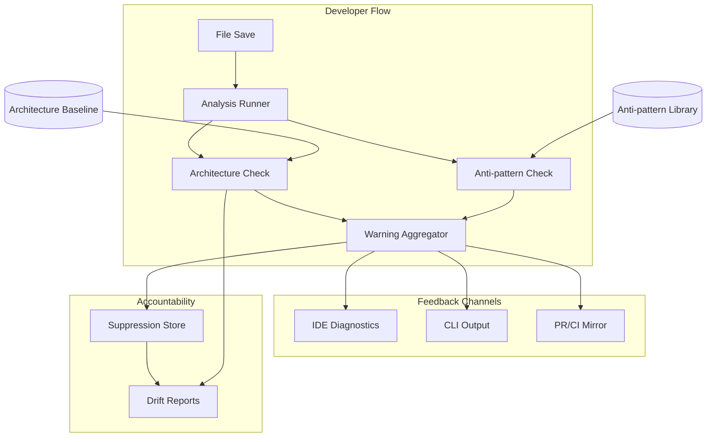

<!-- APS: See https://github.com/EddaCraft/anvil-plan-spec for format reference -->
<!-- This document is non-executable. -->

# Anvil — Save-time Trust

## Overview

Anvil makes AI-generated code safe to merge by catching architecture boundary
violations and AI escape-hatch anti-patterns at file-save time. Developers get
actionable warnings before code leaves the file, with human-owned exceptions for
intentional deviations.

**Why this matters:** AI coding tools are accelerating development, but they
don't understand your architecture. They produce code that compiles and passes
tests, yet drifts from intended patterns. By the time drift is noticed in
review, it's already merged or too expensive to fix. Anvil catches it at the
moment of creation — when fixing is cheap.

**Product thesis:** Anvil improves trust in AI-generated code so more of it
reaches production faster, while architecture drift slows or reverses over time.

**Primary beneficiary:** Individual developers — they get to use AI safely at
the pace leadership expects.

## Problem & Success Criteria

**Problem:** The most damaging recurring failure is second-wave feature work
drifting from intended patterns because engineers:

- don't know which patterns apply
- don't read ADRs or architecture diagrams
- don't recognise when their change crosses a boundary

The most reliable early signal: a **new dependency edge** where a function or
class reaches across architectural contexts.

**Success Criteria:**

- [ ] 50%+ of developers run Anvil on every save (adoption) — post-release
- [ ] Time-to-merge for AI-assisted PRs does not increase (throughput) —
      post-release
- [ ] New cross-boundary edges per sprint decreases by 30% within 8 weeks
      (drift) — post-release
- [x] Save-time feedback latency < 2 seconds cached, < 5 seconds cold (speed)
- [ ] < 10% of warnings are suppressed without resolution (signal quality) —
      post-release

**Implementation Progress (0.1.0):**

Core Engine:

- [x] Core analysis engine (`anvil check <files>`)
- [x] Architecture boundary detection with baseline
- [x] Anti-pattern detection (7 patterns)
- [x] Suppression system with time-boxing
- [x] CI/CD integration (GitHub Action)
- [x] Git-aware file detection (`anvil check --changed`)
- [x] Source file watch mode (`anvil watch --source`)

Onboarding Experience:

- [x] TUI foundation (Ink components)
- [x] Visual `anvil init` wizard
- [x] `anvil status` quick health check
- [x] `anvil doctor` setup diagnostics
- [x] First-run welcome experience

Documentation:

- [x] Quick Start Guide update
- [x] Demo showing Anvil catching real issues
- [x] Error message review

## Release Plan

### 0.1.0 — Beta

**Philosophy:** A powerful engine is worthless if no one uses it. The initial
release must deliver both the core value AND a friction-free first experience.

#### Core Engine (Complete ✅)

| Feature             | Description                                    | Status   |
| ------------------- | ---------------------------------------------- | -------- |
| Analysis Engine     | `anvil check <files>` with caching + parallel  | Complete |
| Architecture Safety | Baseline inference, new-edge detection         | Complete |
| Anti-patterns       | 7 high-confidence patterns                     | Complete |
| Suppressions        | Time-boxed with mandatory explanations         | Complete |
| Git Integration     | `--changed`, `--staged`, `--since <ref>`       | Complete |
| Watch Mode          | `anvil watch --source` for real-time feedback  | Complete |
| CI/CD               | GitHub Action with PR comments + status checks | Complete |

#### Onboarding Experience (Complete ✅)

| Feature           | Description                                     | Status   |
| ----------------- | ----------------------------------------------- | -------- |
| TUI Foundation    | Ink setup + base components (TUI-001)           | Complete |
| Init Wizard       | Visual `anvil init` with guided flow (TUI-002)  | Complete |
| Status Dashboard  | Quick health check: `anvil status` (TUI-003)    | Complete |
| Doctor Command    | Diagnose setup issues: `anvil doctor` (TUI-004) | Complete |
| First-run Welcome | Show value immediately on first run (TUI-005)   | Complete |

**Why onboarding ships in 0.1.0:** Without smooth onboarding, users won't adopt
the tool regardless of how good the engine is. First impressions matter.

#### Documentation & Polish (Complete ✅)

| Feature           | Description                     | Status   |
| ----------------- | ------------------------------- | -------- |
| Quick Start Guide | 5-minute path to first value    | Complete |
| User Guide        | Complete command reference      | Complete |
| Demo/Tutorial     | Show Anvil catching real issues | Complete |
| Error Messages    | Actionable, not cryptic         | Complete |

#### Drift Visibility & Developer Trust (Complete ✅)

| Feature                | Description                                    | Status   |
| ---------------------- | ---------------------------------------------- | -------- |
| Explain Command        | `anvil explain <id>` — deep-dive into warnings | Complete |
| Drift Snapshots        | `anvil drift snapshot` — capture current state | Complete |
| Drift Compare          | `anvil drift compare` — show changes over time | Complete |
| Drift Reports          | `anvil drift report` — visualise trends        | Complete |
| Trend Reports          | Visualise suppression and violation trends     | Complete |
| OPA Architecture       | DC → OPA bridge, YAML-first architecture       | Complete |
| Architecture Templates | Layered, Hexagonal, Clean, DDD presets         | Complete |
| Remote Policy Bundles  | Centralised policy distribution                | Complete |
| Monorepo Migration     | Restructure to apps/packages layered layout    | Complete |

#### Advanced Experience

| Feature               | Description                                            | Status   |
| --------------------- | ------------------------------------------------------ | -------- |
| VS Code Extension     | Anti-pattern on save, arch gates, OPA display (IDE-\*) | Complete |
| Adapter Upstream Sync | BMAD v6 + SpecKit agent-first updates (ADAPTUP)        | Complete |
| TUI Operational       | Watch dashboard, gate explorer (TUI-009–012)           | Partial  |
| Template Library      | Pre-built architecture patterns (TUI-006)              | Deferred |
| Tutorial Mode         | Interactive learning experience (TUI-007)              | Deferred |
| TUI Diagrams          | Mermaid-based ASCII diagrams via beautiful-mermaid (TUI-013–015) | Complete |

#### VS Code Extension Details

| Phase   | Features                                            | Tasks       | Status   |
| ------- | --------------------------------------------------- | ----------- | -------- |
| Phase 1 | Embed core, anti-pattern on save, diagnostics, VSIX | IDE-001–003 | Complete |
| Phase 2 | Arch gate display, OPA policies, click-to-navigate  | IDE-004–006 | Complete |
| Phase 3 | Syntax highlighting, caching, Marketplace           | IDE-007–008 | Complete |

#### HTML/CSS Support, Tutorial Overhaul & Intelligent First Run (Complete ✅)

| Feature                   | Description                                         | Status   |
| ------------------------- | --------------------------------------------------- | -------- |
| Configurable Extensions   | Make analysable file extensions configurable         | Complete |
| HTML Anti-patterns        | Inline styles, scripts, event handlers, deprecated  | Complete |
| CSS Anti-patterns         | `!important` abuse, CSS `@import` performance       | Complete |
| HTML/CSS Edge Detection   | `<script src>`, `<link href>`, `@import url()`      | Complete |
| HTML Suppression Syntax   | `<!-- @anvil-ignore ... -->` comment support         | Complete |
| VS Code HTML/CSS Trigger  | Analysis on HTML/CSS file saves                     | Complete |
| Tutorial Overhaul         | Scan-watch-fix flow, feature tutorials, docs        | Complete |
| Intelligent First Run     | Post-init analysis, smart defaults, quick wins      | Complete |

**Why HTML/CSS ships in 0.1.0:** HTML/CSS is the simplest non-JS language to
support — no module resolution, no type system, all regex-based. It establishes
the configurable extensions infrastructure (HTMLCSS-001) that all future language
modules depend on. The tutorial overhaul and intelligent first-run experience
complete the onboarding story by giving new users an immediate value
demonstration.

#### AI Tool Integration (Complete ✅)

| Feature         | Description                                | Status |
| --------------- | ------------------------------------------ | ------ |
| llms.txt Export | Export constraints for AI tool consumption | Complete |
| Command Safety  | Validate AI tool commands (CMDSAF)         | Complete |
| MCP Server      | Real-time validation during AI generation  | Complete |

### 0.2.0 — Web Dashboard

| Feature                  | Description                                         | Status |
| ------------------------ | --------------------------------------------------- | ------ |
| Dashboard Foundation     | App scaffold, routing, theme, components, API       | Draft  |
| Dashboard Core Views     | Overview, gates history/detail, warnings            | Draft  |
| Dashboard Arch/Drift     | Architecture graphs, drift comparison, suppressions | Draft  |
| Dashboard AI Builder     | json-render prompt interface, templates, persistence| Draft  |
| Dashboard Operations     | Audit trail, plans, config, diagnostics, roles      | Draft  |

**Why this is 0.2.0:** The web dashboard builds on top of all 0.1.0 domain logic
(gates, warnings, architecture, drift, suppressions, plans). It is a new
surface — a read-heavy browser interface — not a replacement for the CLI. The
CLI remains the primary developer interface; the dashboard serves team leads,
platform engineers, and compliance roles who need persistent views, historical
trends, and graphical visualisations that a terminal cannot provide.

### 0.3.0 — Organisational Policy Governance

| Feature                  | Description                                                  | Status |
| ------------------------ | ------------------------------------------------------------ | ------ |
| OPA Enhancements         | YAML-first rules, policy library, debugger, watch mode       | Draft  |
| Org Policy Hierarchy     | Multi-level governance: org → team → project inheritance     | Draft  |
| Policy Lifecycle         | Versioning, canary rollout, deprecation, grace periods       | Draft  |
| Compliance Reporting     | Framework mapping (SOC 2, ISO 27001), audit-ready reports    | Draft  |
| Policy Federation        | Central registry, channels, fleet sync, publish approvals    | Draft  |

**Why this is 0.3.0:** Organisational policy governance builds on top of the
single-repo OPA infrastructure delivered in 0.1.0. It requires multi-repo
awareness, hierarchy resolution, and fleet-level aggregation that only make
sense after the core policy engine is battle-tested. Individual developers
benefit from 0.1.x; platform teams and compliance roles benefit from these
modules.

### Post-1.0.0 — Multi-Language Support (Placeholders)

| Feature         | Description                                    | Status      |
| --------------- | ---------------------------------------------- | ----------- |
| Python Support  | `import`/`from` extraction, `# type: ignore`  | Placeholder |
| Rust Support    | `use`/`mod` extraction, `unsafe` detection     | Placeholder |
| .NET Support    | `using` extraction, `dynamic` type detection   | Placeholder |

**Why these three:** Python is the second most common AI-assisted language. Rust
and .NET represent compiled-language ecosystems with strong architecture
conventions. Each depends on the configurable extensions infrastructure from
0.1.0 (HTMLCSS-001). Language modules will be promoted to Ready as demand and
resources allow.

### What's NOT in 0.1.0

To ship fast and focused, these are explicitly deferred:

- ~~**VS Code extension** — CLI-first; IDE later~~ ✅ Complete (shipped in 0.1.0)
- ~~**Drift reports** — Core value doesn't require trend analysis~~ ✅ Complete (shipped in 0.1.0)
- ~~**Command safety** — Important but not blocking for initial adoption~~ ✅ Complete (shipped in 0.1.0)
- **Plan/APS execution** — Planless-first; APS is internal
- ~~**Multi-language support** — TypeScript/JavaScript only initially~~ HTML/CSS
  shipped in 0.1.0; Python/Rust/.NET post-1.0.0
- **Team dashboards** — Individual developer focus first (0.2.0)
- **Auto-fix** — Warnings only; don't be too clever
- ~~**TUI Mermaid diagrams** — Nice-to-have~~ ✅ Complete (shipped in 0.1.0) —
  dependency arrows and violation overlays make architecture visualisation
  significantly more impressive in demos

## Constraints

- Must deliver value **without requiring plans/APS** as a prerequisite
  (planless-first)
- Must not hard-block by default — warnings, not errors
- Must run on Node.js 20+
- Must integrate with existing ESLint/Prettier tooling, not replace it
- Must acknowledge legacy drift without overwhelming developers with noise

## System Map

## Milestones

### M1: Core Analysis Engine ✅

- **Status:** Complete
- **Includes:** save-time-trust, architecture-safety
- **Delivered:** `anvil check <file>` returns warnings with explanations

### M2: Anti-pattern Detection ✅

- **Status:** Complete
- **Includes:** antipattern-library
- **Delivered:** ESLint-disable, `any`, `@ts-ignore` detected in new code

### M3: Developer Ergonomics ✅

- **Status:** Complete
- **Includes:** suppressions, drift-reporting
- **Delivered:** Developers can suppress with accountability; drift snapshots and reports

### M4: Integration Points ✅

- **Status:** Complete
- **Includes:** ci-integration ✅, ide-integration ✅
- **Delivered:** PRs show warning summaries via GitHub Action; VS Code extension v0.1.0

## Modules

| Module                                                                  | Scope   | Status      | Release | Dependencies                                              |
| ----------------------------------------------------------------------- | ------- | ----------- | ------- | --------------------------------------------------------- |
| [save-time-trust](./archive/modules/save-time-trust.aps.md)             | CORE    | Complete    | 0.1.0   | —                                                         |
| [architecture-safety](./archive/modules/architecture-safety.aps.md)     | ARCH    | Complete    | 0.1.0   | save-time-trust                                           |
| [antipattern-library](./archive/modules/antipattern-library.aps.md)     | ANTI    | Complete    | 0.1.0   | save-time-trust                                           |
| [suppressions](./archive/modules/suppressions.aps.md)                   | SUPP    | Complete    | 0.1.0   | architecture-safety, antipattern-library                  |
| [ci-integration](./archive/modules/ci-integration.aps.md)               | CI      | Complete    | 0.1.0   | save-time-trust                                           |
| [tui](./archive/modules/tui.aps.md)                                     | TUI     | Complete    | 0.1.0   | — (Phase 1: onboarding only)                              |
| [documentation-polish](./archive/modules/documentation-polish.aps.md)   | DOCS    | Complete    | 0.1.0   | —                                                         |
| [explain-command](./archive/modules/explain-command.aps.md)             | EXPLAIN | Complete    | 0.1.0   | architecture-safety, antipattern-library                  |
| [drift-reporting](./archive/modules/drift-reporting.aps.md)             | DRIFT   | Complete    | 0.1.0   | architecture-safety, antipattern-library, suppressions    |
| [opa-architecture-integration](./archive/modules/opa-architecture-integration.aps.md) | OPA | Complete | 0.1.0 | architecture-safety, save-time-trust                      |
| [ide-integration](./archive/modules/ide-integration.aps.md)             | IDE     | Complete    | 0.1.0   | save-time-trust, architecture-safety, antipattern-library |
| [llms-txt-export](./archive/modules/llms-txt-export.aps.md)                     | LLMS    | Complete    | 0.1.0   | architecture-safety, antipattern-library                  |
| [command-safety-validation](./archive/modules/command-safety-validation.aps.md) | CMDSAF  | Complete    | 0.1.0   | —                                                         |
| [mcp-server](./archive/modules/mcp-server.aps.md)                               | MCP     | Complete    | 0.1.0   | save-time-trust, architecture-safety                      |
| [policy-pack-validation](./modules/policy-pack-validation.aps.md)       | POLVAL  | Draft       | 0.3.0   | opa-architecture-integration                              |
| [architecture-config-validation](./modules/architecture-config-validation.aps.md) | ARCHCFG | Draft | 0.3.0 | opa-architecture-integration, architecture-safety         |
| [ai-guardrail-profile](./modules/ai-guardrail-profile.aps.md)           | AIGUARD | Draft       | 0.3.0   | architecture-safety, antipattern-library, opa-architecture-integration, policy-pack-validation, architecture-config-validation |
| [aps-markdown-adapter](./archive/modules/aps-markdown-adapter.aps.md)   | APSMD   | Complete    | 0.1.0   | —                                                         |
| [open-spec-adapter](./modules/open-spec-adapter.aps.md)                 | OPENSPEC| Draft       | —       | —                                                         |
| [adapter-upstream-updates](./archive/modules/adapter-upstream-updates.aps.md) | ADAPTUP | Complete    | 0.1.0   | —                                                         |
| [kindling-integration](./modules/kindling-integration.aps.md)           | KINDLING| Draft       | 0.4.0   | save-time-trust, drift-reporting                          |
| [ember](./modules/ember.aps.md)                                         | EMBER   | Draft       | 0.4.0   | kindling-integration                                      |
| [edda](./modules/edda.aps.md)                                           | EDDA    | Draft       | 0.4.0   | ember                                                     |
| [edda-stack-integration](./modules/edda-stack-integration.aps.md)       | STACK   | Draft       | 0.4.0   | kindling-integration, ember, edda                         |
| [opa-enhancements](./modules/opa-enhancements.aps.md)                   | OPAE    | Draft       | 0.3.0   | opa-architecture-integration, architecture-safety, tui    |
| [org-policy-hierarchy](./modules/org-policy-hierarchy.aps.md)           | ORGHIER | Draft       | 0.3.0   | opa-architecture-integration, policy-pack-validation, opa-enhancements |
| [policy-lifecycle](./modules/policy-lifecycle.aps.md)                   | POLLC   | Draft       | 0.3.0   | opa-architecture-integration, policy-pack-validation, org-policy-hierarchy |
| [compliance-reporting](./modules/compliance-reporting.aps.md)           | COMPLY  | Draft       | 0.3.0   | org-policy-hierarchy, policy-lifecycle, drift-reporting, suppressions |
| [policy-federation](./modules/policy-federation.aps.md)                 | POLFED  | Draft       | 0.3.0   | opa-enhancements, org-policy-hierarchy, policy-lifecycle, policy-pack-validation |
| [onboarding-feedback-resolution](./archive/modules/onboarding-feedback-resolution.aps.md) | ONFBK | Complete | 0.1.0 | architecture-safety, tui                                  |
| [real-time-validation-simplified](./modules/real-time-validation-simplified.aps.md) | RTVS | Draft | —      | save-time-trust                                           |
| [real-time-validation-full](./modules/real-time-validation-full.aps.md) | RTVF    | Draft       | —       | save-time-trust, ide-integration                          |
| [tui-enhancement](./modules/tui-enhancement.aps.md)                     | TUIENH  | Superseded  | —       | tui (see D-005: Ink over OpenTUI)                         |
| [test-quality](./archive/modules/test-quality.aps.md)                   | TEST    | Complete    | —       | —                                                         |
| [monorepo-migration](./archive/modules/monorepo-migration.aps.md)       | MONO    | Complete    | 0.1.0   | —                                                         |
| [dashboard-foundation](./modules/dashboard-foundation.aps.md)           | DASH     | Draft       | 0.2.0   | monorepo-migration, contracts                             |
| [dashboard-core-views](./modules/dashboard-core-views.aps.md)           | DASHCORE | Draft       | 0.2.0   | dashboard-foundation                                      |
| [dashboard-architecture-views](./modules/dashboard-architecture-views.aps.md) | DASHARCH | Draft | 0.2.0  | dashboard-foundation, architecture-safety, drift-reporting, suppressions |
| [dashboard-ai-builder](./modules/dashboard-ai-builder.aps.md)           | DASHAI   | Draft       | 0.2.0   | dashboard-foundation                                      |
| [dashboard-ops-views](./modules/dashboard-ops-views.aps.md)             | DASHOPS  | Draft       | 0.2.0   | dashboard-foundation                                      |
| [pulumi-iac](./modules/pulumi-iac.aps.md)                               | IAC      | Complete    | 0.1.0   | —                                                         |
| [html-css-support](./archive/modules/html-css-support.aps.md)           | HTMLCSS  | Complete    | 0.1.0   | antipattern-library, architecture-safety, suppressions    |
| [lang-python](./modules/lang-python.aps.md)                             | PYLAN    | Placeholder | post-1.0 | html-css-support (HTMLCSS-001)                            |
| [lang-rust](./modules/lang-rust.aps.md)                                 | RSTLAN   | Placeholder | post-1.0 | html-css-support (HTMLCSS-001)                            |
| [lang-dotnet](./modules/lang-dotnet.aps.md)                             | DNLAN    | Placeholder | post-1.0 | html-css-support (HTMLCSS-001)                            |
| [intelligent-first-run](./archive/modules/intelligent-first-run.aps.md) | IFR      | Complete    | 0.1.0   | tui, architecture-safety                                  |
| [tutorial-overhaul](./archive/modules/tutorial-overhaul.aps.md)         | TUT      | Complete    | 0.1.0   | tui                                                       |
| [website-migration](./archive/modules/website-migration.aps.md)         | WEB      | Complete    | 0.1.0   | monorepo-migration                                        |
| [coaching-nudges](./modules/coaching-nudges.aps.md)                     | NUDGE    | In Progress | 0.1.x   | antipattern-library                                       |
| [cli-hardening](./modules/cli-hardening.aps.md)                         | CLIH     | In Progress | 0.1.x   | —                                                         |

### Task Status — 0.1.0 (Core Engine)

| Task     | Module          | Description                      | Status   |
| -------- | --------------- | -------------------------------- | -------- |
| CORE-001 | save-time-trust | Warning schema definition        | Complete |
| CORE-002 | save-time-trust | Check runner refactor            | Complete |
| CORE-003 | save-time-trust | CLI check command                | Complete |
| CORE-004 | save-time-trust | Git-aware changed file detection | Complete |
| CORE-005 | save-time-trust | Source file watch mode           | Complete |
| ARCH-001 | architecture    | Baseline inference               | Complete |
| ARCH-002 | architecture    | Edge detection                   | Complete |
| ARCH-003 | architecture    | Architecture check integration   | Complete |
| ARCH-004 | architecture    | CLI architecture service         | Complete |
| ANTI-001 | antipattern     | Pattern catalogue definition     | Complete |
| ANTI-002 | antipattern     | Scanner implementation           | Complete |
| ANTI-003 | antipattern     | Antipattern check integration    | Complete |
| ANTI-004 | antipattern     | Allowlist and opt-in support     | Complete |
| SUPP-001 | suppressions    | Suppression parser               | Complete |
| SUPP-002 | suppressions    | Suppression store                | Complete |
| SUPP-003 | suppressions    | Gate runner integration          | Complete |
| CI-001   | ci-integration  | GitHub Action composite          | Complete |
| CI-002   | ci-integration  | Changed files detection          | Complete |
| CI-003   | ci-integration  | PR comments and status checks    | Complete |
| CI-004   | ci-integration  | Documentation and configuration  | Complete |

### Task Status — 0.1.0 (Onboarding TUI)

| Task    | Module | Description                   | Status   | Priority |
| ------- | ------ | ----------------------------- | -------- | -------- |
| TUI-001 | tui    | Ink foundation and components | Complete | high     |
| TUI-002 | tui    | `anvil init` wizard           | Complete | high     |
| TUI-003 | tui    | `anvil status` dashboard      | Complete | high     |
| TUI-004 | tui    | `anvil doctor` diagnostics    | Complete | high     |
| TUI-005 | tui    | First-run welcome experience  | Complete | high     |
| TUI-008 | tui    | Testing infrastructure        | Complete | medium   |

### Task Status — 0.1.0 (Documentation)

| Task     | Module | Description            | Status   | Priority |
| -------- | ------ | ---------------------- | -------- | -------- |
| DOCS-001 | docs   | Quick Start Guide      | Complete | high     |
| DOCS-002 | docs   | User Guide command ref | Complete | high     |
| DOCS-003 | docs   | Demo material creation | Complete | high     |
| DOCS-004 | docs   | Error message audit    | Complete | medium   |
| DOCS-005 | docs   | Troubleshooting guide  | Complete | medium   |
| DOCS-006 | docs   | README refresh         | Complete | high     |

### Task Status — 0.1.0 (Explain Command)

| Task       | Module  | Description               | Status   | Priority |
| ---------- | ------- | ------------------------- | -------- | -------- |
| EXPLAIN-001 | explain | Warning ID system         | Complete | high     |
| EXPLAIN-002 | explain | Explanation templates     | Complete | high     |
| EXPLAIN-003 | explain | Architecture explanations | Complete | high     |
| EXPLAIN-004 | explain | Anti-pattern explanations | Complete | high     |
| EXPLAIN-005 | explain | ExplainService            | Complete | high     |
| EXPLAIN-006 | explain | CLI explain command       | Complete | high     |

### Task Status — 0.1.0 (Drift Reporting)

| Task     | Module | Description               | Status   | Priority |
| -------- | ------ | ------------------------- | -------- | -------- |
| DRIFT-001 | drift  | Snapshot schema & storage | Complete | high     |
| DRIFT-002 | drift  | Snapshot capture          | Complete | high     |
| DRIFT-003 | drift  | Snapshot comparison       | Complete | high     |
| DRIFT-004 | drift  | Report generator          | Complete | medium   |
| DRIFT-005 | drift  | CLI drift commands        | Complete | high     |

### Task Status — 0.1.0 (Onboarding Feedback Resolution)

| Task     | Module | Description                                 | Status   | Priority |
| -------- | ------ | ------------------------------------------- | -------- | -------- |
| ONFBK-001 | onfbk  | Fix --no-tui flag handling                  | Complete | high     |
| ONFBK-002 | onfbk  | Fix TUI wizard early exit                   | Complete | high     |
| ONFBK-003 | onfbk  | Improve layer detection for project variety | Complete | high     |
| ONFBK-004 | onfbk  | Improve entry points presentation           | Complete | medium   |
| ONFBK-005 | onfbk  | Add architecture explanation                | Complete | medium   |

### Task Status — 0.1.0 (OPA & Architecture Integration)

| Task    | Module | Description                         | Status      | Priority |
| ------- | ------ | ----------------------------------- | ----------- | -------- |
| OPA-001 | opa    | Architecture YAML schema (Zod)      | Complete    | high     |
| OPA-002 | opa    | YAML parser with template expansion | Complete    | high     |
| OPA-003 | opa    | DC config generator from YAML       | Complete    | high     |
| OPA-004 | opa    | `anvil architecture init` command   | Complete    | high     |
| OPA-005 | opa    | Architecture context extraction     | Complete    | high     |
| OPA-006 | opa    | OPA input schema enhancement        | Complete    | high     |
| OPA-007 | opa    | Gate runner integration             | Complete    | high     |
| OPA-008 | opa    | Rego generator from architecture    | Complete    | high     |
| OPA-009 | opa    | Generated policy marker             | Complete    | medium   |
| OPA-010 | opa    | Auto-regeneration on YAML change    | Complete    | medium   |
| OPA-011 | opa    | Layered architecture template       | Complete    | medium   |
| OPA-012 | opa    | Hexagonal architecture template     | Complete    | medium   |
| OPA-013 | opa    | Clean Architecture template         | Complete    | medium   |
| OPA-014 | opa    | DDD template with bounded contexts  | Complete    | medium   |
| OPA-015 | opa    | Template loader and validator       | Complete    | medium   |
| OPA-016 | opa    | TypeScript analyser foundation      | Deferred    | low      |
| OPA-017 | opa    | Path alias resolver                 | Deferred    | low      |
| OPA-018 | opa    | Analyser feature flag               | Deferred    | low      |
| OPA-019 | opa    | Bundle download and caching         | Complete    | medium   |
| OPA-020 | opa    | Signature verification              | Complete    | medium   |
| OPA-021 | opa    | Basic auth and CLI commands         | Complete    | medium   |

> **Note:** OPA-016 through OPA-018 were deferred when the OPA module was marked
> Complete at OPA-015. OPA-019 through OPA-021 (remote policy bundles) were
> subsequently implemented. The remaining tasks may be revisited in the OPA
> Enhancements module (OPAE) or a future release.

### Task Status — 0.1.0 (Monorepo Migration)

| Task     | Module | Description                          | Status   | Priority |
| -------- | ------ | ------------------------------------ | -------- | -------- |
| MONO-001 | mono   | Nx generators for package scaffolding | Complete | high     |
| MONO-002 | mono   | Import path codemod                  | Complete | high     |
| MONO-003 | mono   | Shared tooling packages              | Complete | medium   |
| MONO-004 | mono   | Extract contracts from core          | Complete | high     |
| MONO-005 | mono   | Extract ports from core              | Complete | high     |
| MONO-006 | mono   | Extract pure domain to core          | Complete | high     |
| MONO-007 | mono   | Extract runtime package              | Complete | high     |
| MONO-008 | mono   | Extract policy package               | Complete | high     |
| MONO-009 | mono   | Extract config package               | Complete | medium   |
| MONO-010 | mono   | Extract storage package              | Complete | medium   |
| MONO-011 | mono   | Extract crypto package               | Complete | medium   |
| MONO-012 | mono   | Split adapters per-integration       | Complete | medium   |
| MONO-013 | mono   | Move CLI to apps/                    | Complete | high     |
| MONO-014 | mono   | Reorganise E2E tests                 | Complete | medium   |
| MONO-015 | mono   | Move scripts to tools/               | Complete | low      |
| MONO-016 | mono   | Full test suite validation           | Complete | high     |
| MONO-017 | mono   | Dependency graph validation          | Complete | high     |
| MONO-018 | mono   | Documentation update                 | Complete | medium   |

### Task Status — 0.1.0 (APS Markdown Adapter)

| Task     | Module | Description                          | Status   | Priority |
| -------- | ------ | ------------------------------------ | -------- | -------- |
| APSMD-001 | apsmd  | APSMarkdownAdapter with detection    | Complete | high     |
| APSMD-002 | apsmd  | Confidence scoring system            | Complete | high     |
| APSMD-003 | apsmd  | Parse method implementation          | Complete | high     |
| APSMD-004 | apsmd  | Task-to-Change conversion            | Complete | high     |
| APSMD-005 | apsmd  | Registry integration                 | Complete | high     |
| APSMD-006 | apsmd  | CLI PlanLoader integration           | Complete | high     |

### Task Status — 0.1.0 (Advanced Experience)

#### IDE Integration (VS Code Extension)

| Task    | Module | Description                                     | Status   | Priority |
| ------- | ------ | ----------------------------------------------- | -------- | -------- |
| IDE-001 | ide    | Embed @eddacraft/anvil-core for fast-path operations      | Complete | high     |
| IDE-002 | ide    | Anti-pattern detection on save with diagnostics | Complete | high     |
| IDE-003 | ide    | Improve source location mapping from CLI output | Complete | medium   |
| IDE-004 | ide    | Architecture gate display in tree view          | Complete | high     |
| IDE-005 | ide    | OPA policy failure display with remediation     | Complete | high     |
| IDE-006 | ide    | Click-to-navigate for all violation types       | Complete | medium   |
| IDE-007 | ide    | APS and Rego syntax highlighting                | Complete | medium   |
| IDE-008 | ide    | Analysis caching and Marketplace preparation    | Complete | medium   |

#### TUI Operational (CLI)

| Task    | Module | Description                       | Status  | Priority |
| ------- | ------ | --------------------------------- | ------- | -------- |
| TUI-006 | tui    | Static template library           | Deferred | medium   |
| TUI-007 | tui    | Interactive tutorial              | Deferred | low      |
| TUI-009 | tui    | `anvil watch` real-time dashboard | Complete | medium   |
| TUI-010 | tui    | `anvil gate` interactive explorer | Deferred | medium   |
| TUI-011 | tui    | Parallel progress visualisation   | Deferred | low      |
| TUI-012 | tui    | Log panel with filtering          | Deferred | low      |
| TUI-013 | tui    | `<MermaidDiagram />` component + `layersToMermaid()` helper ([brainstorm](./brainstorms/mermaid-tui-diagrams.md)) | Complete | high |
| TUI-014 | tui    | Replace existing ASCII diagrams with mermaid rendering | Complete | high |
| TUI-015 | tui    | `anvil architecture visualise` command (ascii/svg/mermaid formats) | Complete | high |

### Task Status — 0.2.0 (Web Dashboard)

The web dashboard provides a browser-based interface for exploring Anvil data.
See [brainstorm](./brainstorms/dashboard-web-ui.md) and
[json-render approach](./brainstorms/json-render-dashboard.md) for background.

#### Dashboard Foundation

| Task     | Module | Description                             | Status | Priority |
| -------- | ------ | --------------------------------------- | ------ | -------- |
| DASH-001 | dash   | Application scaffold and build config   | Draft  | high     |
| DASH-002 | dash   | Routing and navigation shell            | Draft  | high     |
| DASH-003 | dash   | Theme system and design tokens          | Draft  | high     |
| DASH-004 | dash   | Shared component catalog                | Draft  | high     |
| DASH-005 | dash   | API data layer                          | Draft  | high     |
| DASH-006 | dash   | Data fetching hooks and cache mgmt      | Draft  | high     |
| DASH-007 | dash   | Global search infrastructure            | Draft  | medium   |
| DASH-008 | dash   | URL deep linking and filter persistence | Draft  | medium   |

#### Dashboard Core Views (Overview, Gates, Warnings)

| Task         | Module   | Description                          | Status | Priority |
| ------------ | -------- | ------------------------------------ | ------ | -------- |
| DASHCORE-001 | dashcore | Overview — metric cards row          | Draft  | high     |
| DASHCORE-002 | dashcore | Overview — trend charts              | Draft  | high     |
| DASHCORE-003 | dashcore | Overview — activity feed & actions   | Draft  | medium   |
| DASHCORE-004 | dashcore | Gate history list with filtering     | Draft  | high     |
| DASHCORE-005 | dashcore | Gate detail view with check tree     | Draft  | high     |
| DASHCORE-006 | dashcore | Gate trend analysis charts           | Draft  | medium   |
| DASHCORE-007 | dashcore | Warning list with grouping/filtering | Draft  | high     |
| DASHCORE-008 | dashcore | Warning detail panel with code ctx   | Draft  | high     |
| DASHCORE-009 | dashcore | Warning breakdown visualisations     | Draft  | medium   |
| DASHCORE-010 | dashcore | Anti-pattern registry reference      | Draft  | medium   |

#### Dashboard Architecture, Drift & Suppressions

| Task         | Module   | Description                          | Status | Priority |
| ------------ | -------- | ------------------------------------ | ------ | -------- |
| DASHARCH-001 | dasharch | Architecture overview & layer diagram| Draft  | high     |
| DASHARCH-002 | dasharch | Boundary violation explorer          | Draft  | high     |
| DASHARCH-003 | dasharch | Interactive dependency graph         | Draft  | medium   |
| DASHARCH-004 | dasharch | Drift timeline and snapshot list     | Draft  | high     |
| DASHARCH-005 | dasharch | Snapshot detail view                 | Draft  | medium   |
| DASHARCH-006 | dasharch | Snapshot comparison view             | Draft  | high     |
| DASHARCH-007 | dasharch | Suppression list with lifecycle views| Draft  | high     |
| DASHARCH-008 | dasharch | Suppression trend analysis           | Draft  | medium   |

#### Dashboard AI Builder

| Task       | Module | Description                          | Status | Priority |
| ---------- | ------ | ------------------------------------ | ------ | -------- |
| DASHAI-001 | dashai | json-render runtime integration      | Draft  | high     |
| DASHAI-002 | dashai | Component catalog registration       | Draft  | high     |
| DASHAI-003 | dashai | Prompt interface with live preview   | Draft  | high     |
| DASHAI-004 | dashai | Dashboard template gallery           | Draft  | medium   |
| DASHAI-005 | dashai | Dashboard persistence                | Draft  | medium   |
| DASHAI-006 | dashai | Dashboard versioning & iteration     | Draft  | low      |

#### Dashboard Operations & Administration

| Task        | Module  | Description                          | Status | Priority |
| ----------- | ------- | ------------------------------------ | ------ | -------- |
| DASHOPS-001 | dashops | Audit log viewer with filtering      | Draft  | high     |
| DASHOPS-002 | dashops | User activity breakdown              | Draft  | medium   |
| DASHOPS-003 | dashops | AI tool tracking analysis            | Draft  | medium   |
| DASHOPS-004 | dashops | Plan list and detail views           | Draft  | high     |
| DASHOPS-005 | dashops | Configuration viewer                 | Draft  | medium   |
| DASHOPS-006 | dashops | Diagnostics page                     | Draft  | medium   |
| DASHOPS-007 | dashops | Role-based view filtering            | Draft  | low      |
| DASHOPS-008 | dashops | Real-time update infrastructure      | Draft  | low      |

### Task Status — 0.1.0 (HTML/CSS Support)

| Task        | Module  | Description                                 | Status   | Priority |
| ----------- | ------- | ------------------------------------------- | -------- | -------- |
| HTMLCSS-001 | htmlcss | Make analysable extensions configurable      | Complete | high     |
| HTMLCSS-002 | htmlcss | HTML anti-pattern detectors (AP-008–011)     | Complete | high     |
| HTMLCSS-003 | htmlcss | CSS anti-pattern detectors (AP-012–013)      | Complete | high     |
| HTMLCSS-004 | htmlcss | HTML/CSS edge detection                      | Complete | high     |
| HTMLCSS-005 | htmlcss | HTML suppression comment syntax              | Complete | high     |
| HTMLCSS-006 | htmlcss | VS Code extension HTML/CSS trigger           | Complete | medium   |
| HTMLCSS-007 | htmlcss | Documentation and tests                      | Complete | medium   |

### Task Status — 0.1.0 (Tutorial Overhaul)

| Task    | Module | Description                                          | Status   | Priority |
| ------- | ------ | ---------------------------------------------------- | -------- | -------- |
| TUT-001 | tut    | Rewrite tutorial step types for scan-watch-fix flow  | Complete | high     |
| TUT-002 | tut    | Create ScanStep TUI component                        | Complete | high     |
| TUT-003 | tut    | Create WatchStep TUI component                       | Complete | high     |
| TUT-004 | tut    | Create FixStep TUI component                         | Complete | high     |
| TUT-005 | tut    | Create NextStepsStep and wire up Tutorial.tsx         | Complete | high     |
| TUT-006 | tut    | Interactive policy creation tutorial                  | Complete | medium   |
| TUT-007 | tut    | Interactive architecture boundaries tutorial          | Complete | medium   |
| TUT-008 | tut    | Interactive drift tracking tutorial                   | Complete | medium   |
| TUT-009 | tut    | Interactive CI integration tutorial                   | Complete | high     |
| TUT-010 | tut    | Docs-site tutorials section                           | Complete | high     |
| TUT-011 | tut    | Rewrite quickstart.md and update navigation           | Complete | high     |
| TUT-012 | tut    | Tutorial --list flag and e2e test                     | Complete | high     |

### Task Status — 0.1.0 (Intelligent First Run)

| Task    | Module | Description                                   | Status   | Priority |
| ------- | ------ | --------------------------------------------- | -------- | -------- |
| IFR-001 | ifr    | Add project context detection service         | Complete | high     |
| IFR-002 | ifr    | Create smart defaults generator               | Complete | high     |
| IFR-003 | ifr    | Add post-init automatic analysis              | Complete | high     |
| IFR-004 | ifr    | Create quick wins identifier                  | Complete | high     |
| IFR-005 | ifr    | Create interactive results dashboard TUI      | Complete | high     |
| IFR-006 | ifr    | Add historical analysis feature               | Complete | medium   |
| IFR-007 | ifr    | Integrate all components in init flow         | Complete | high     |
| IFR-008 | ifr    | Update documentation                          | Complete | medium   |

### Task Status — 0.1.0 (Adapter Upstream Updates)

| Task        | Module  | Description                                 | Status   | Priority |
| ----------- | ------- | ------------------------------------------- | -------- | -------- |
| ADAPTUP-001 | adaptup | Update BMAD folder structure detection       | Complete | high     |
| ADAPTUP-002 | adaptup | Update BMAD config path handling             | Complete | high     |
| ADAPTUP-003 | adaptup | Update BMAD variable syntax                  | Complete | medium   |
| ADAPTUP-004 | adaptup | Add BMAD hasSidecar field support             | Complete | medium   |
| ADAPTUP-005 | adaptup | Update SpecKit command namespace detection   | Complete | high     |
| ADAPTUP-006 | adaptup | Add SpecKit AGENTS.md support                | Complete | medium   |
| ADAPTUP-007 | adaptup | Update adapter test fixtures                 | Complete | high     |
| ADAPTUP-008 | adaptup | Update adapter documentation                 | Complete | medium   |

### Task Status — 0.1.0 (AI Tool Integration)

| Task       | Module         | Description                       | Status  | Priority |
| ---------- | -------------- | --------------------------------- | ------- | -------- |
| LLMS-001   | llms-txt       | Constraint collector              | Complete | high     |
| LLMS-002   | llms-txt       | llms.txt formatter                | Complete | high     |
| LLMS-003   | llms-txt       | MCP resource formatter            | Complete | medium   |
| LLMS-004   | llms-txt       | Prompt fragment formatter         | Complete | medium   |
| LLMS-005   | llms-txt       | CLI export command                | Complete | high     |
| CMDSAF-001 | command-safety | Rule system and types             | Complete | high     |
| CMDSAF-002 | command-safety | Command parser with unwrapping    | Complete | high     |
| CMDSAF-003 | command-safety | Rule matcher with specificity     | Complete | high     |
| CMDSAF-004 | command-safety | Default git operation rules       | Complete | medium   |
| CMDSAF-005 | command-safety | Default filesystem rules          | Complete | medium   |
| CMDSAF-006 | command-safety | CommandSafetyCheck implementation | Complete | high     |
| CMDSAF-007 | command-safety | Configuration system              | Complete | medium   |
| CMDSAF-008 | command-safety | Message formatting                | Complete | low      |
| CMDSAF-009 | command-safety | CLI integration and documentation | Complete | high     |
| MCP-001    | mcp-server     | Package scaffold and basic server | Complete | high     |
| MCP-002    | mcp-server     | anvil_check tool implementation   | Complete | high     |
| MCP-003    | mcp-server     | anvil_gate and anvil_status tools | Complete | high     |
| MCP-004    | mcp-server     | anvil_fix and anvil_suppress tools| Complete | high     |
| MCP-005    | mcp-server     | anvil_query_boundary tool         | Complete | high     |
| MCP-006    | mcp-server     | Resources with subscriptions      | Complete | medium   |
| MCP-007    | mcp-server     | Prompt templates                  | Complete | medium   |
| MCP-008    | mcp-server     | Streamable HTTP transport         | Complete | medium   |
| MCP-009    | mcp-server     | Config generators and CLI         | Complete | high     |
| MCP-010    | mcp-server     | Error handling and JSON-RPC       | Complete | high     |

### Task Status — 0.4.0 (Edda Stack — Memory System)

The Edda Stack provides a three-layer architecture for memory: Kindling (observation),
Ember (interpretation), and Edda (canonical memory).

#### Kindling Integration (Observation Layer)

| Task         | Module   | Description                         | Status | Priority |
| ------------ | -------- | ----------------------------------- | ------ | -------- |
| KINDLING-001 | kindling | Kindling service wrapper            | Draft  | high     |
| KINDLING-002 | kindling | Configuration schema and loading    | Draft  | high     |
| KINDLING-003 | kindling | Session observation hooks           | Draft  | high     |
| KINDLING-004 | kindling | Gate evaluation observations        | Draft  | high     |
| KINDLING-005 | kindling | Action execution observations       | Draft  | medium   |
| KINDLING-006 | kindling | Plan lifecycle observations         | Draft  | medium   |
| KINDLING-007 | kindling | Human input and constraint obs      | Draft  | medium   |
| KINDLING-008 | kindling | Error observations                  | Draft  | high     |
| KINDLING-009 | kindling | Query service with scope enforcement| Draft  | high     |
| KINDLING-010 | kindling | Query limits and throttling         | Draft  | high     |
| KINDLING-011 | kindling | Malicious AI test suite             | Draft  | high     |
| KINDLING-012 | kindling | Session query command (run show)    | Draft  | high     |
| KINDLING-013 | kindling | Plan, gate, action query commands   | Draft  | high     |
| KINDLING-014 | kindling | Status integration                  | Draft  | medium   |
| KINDLING-015 | kindling | Sensitive data validation           | Draft  | high     |
| KINDLING-016 | kindling | Retention and pruning               | Draft  | medium   |
| KINDLING-017 | kindling | Performance benchmarking            | Draft  | medium   |
| KINDLING-018 | kindling | Documentation and examples          | Draft  | medium   |
| KINDLING-019 | kindling | OpenAPI spec generation             | Draft  | medium   |

#### Ember (Interpretive Layer — Candidate Memory)

| Task      | Module | Description                       | Status | Priority |
| --------- | ------ | --------------------------------- | ------ | -------- |
| EMBER-001 | ember  | Candidate Memory Proposal schema  | Draft  | high     |
| EMBER-002 | ember  | Proposal type definitions         | Draft  | high     |
| EMBER-003 | ember  | Ember configuration schema        | Draft  | high     |
| EMBER-004 | ember  | ProposalStore implementation      | Draft  | high     |
| EMBER-005 | ember  | DecayService implementation       | Draft  | high     |
| EMBER-006 | ember  | AggregatorService foundation      | Draft  | medium   |
| EMBER-007 | ember  | Evaluation rules engine           | Draft  | medium   |
| EMBER-008 | ember  | Built-in evaluation rules         | Draft  | medium   |
| EMBER-009 | ember  | CandidateService (high-level API) | Draft  | high     |
| EMBER-010 | ember  | Kindling observation hooks        | Draft  | medium   |
| EMBER-011 | ember  | CLI ember commands                | Draft  | high     |
| EMBER-012 | ember  | Query API implementation          | Draft  | high     |
| EMBER-013 | ember  | Status integration                | Draft  | medium   |
| EMBER-014 | ember  | Documentation and examples        | Draft  | medium   |

#### Edda (Canonical Memory Layer)

| Task      | Module | Description                       | Status | Priority |
| --------- | ------ | --------------------------------- | ------ | -------- |
| EDDA-001  | edda   | Memory Object schema              | Draft  | high     |
| EDDA-002  | edda   | Memory type definitions           | Draft  | high     |
| EDDA-003  | edda   | Provenance schema                 | Draft  | high     |
| EDDA-004  | edda   | Evolution graph schema            | Draft  | high     |
| EDDA-005  | edda   | Edda configuration schema         | Draft  | high     |
| EDDA-006  | edda   | Git-backed MemoryStore            | Draft  | high     |
| EDDA-007  | edda   | YAML serialisation                | Draft  | high     |
| EDDA-008  | edda   | Version tracking                  | Draft  | medium   |
| EDDA-009  | edda   | PromotionService                  | Draft  | high     |
| EDDA-010  | edda   | ProvenanceService                 | Draft  | medium   |
| EDDA-011  | edda   | EvolutionService                  | Draft  | high     |
| EDDA-012  | edda   | MemoryService (high-level API)    | Draft  | high     |
| EDDA-013  | edda   | CLI list and show commands        | Draft  | high     |
| EDDA-014  | edda   | CLI promote command               | Draft  | high     |
| EDDA-015  | edda   | CLI retire and trace commands     | Draft  | high     |
| EDDA-016  | edda   | Human-in-the-loop enforcement     | Draft  | high     |
| EDDA-017  | edda   | Status integration                | Draft  | medium   |
| EDDA-018  | edda   | Schema migration tooling          | Draft  | medium   |
| EDDA-019  | edda   | Documentation                     | Draft  | medium   |

#### Edda Stack Integration

| Task      | Module | Description                       | Status | Priority |
| --------- | ------ | --------------------------------- | ------ | -------- |
| STACK-001 | stack  | Common identifier schemas         | Draft  | high     |
| STACK-002 | stack  | Timestamp and temporal schemas    | Draft  | high     |
| STACK-003 | stack  | Confidence scale definitions      | Draft  | high     |
| STACK-004 | stack  | Provenance link schema            | Draft  | high     |
| STACK-005 | stack  | Proposal → Memory type mapping    | Draft  | high     |
| STACK-006 | stack  | Observation → Proposal mapping    | Draft  | medium   |
| STACK-007 | stack  | Layer port definitions            | Draft  | high     |
| STACK-008 | stack  | Event bus for layer communication | Draft  | medium   |
| STACK-009 | stack  | Layer mock factories              | Draft  | high     |
| STACK-010 | stack  | Integration test fixtures         | Draft  | high     |
| STACK-011 | stack  | Provenance chain validator        | Draft  | high     |
| STACK-012 | stack  | Stack configuration schema        | Draft  | high     |
| STACK-013 | stack  | CLI stack status command          | Draft  | high     |
| STACK-014 | stack  | CLI stack validate command        | Draft  | high     |
| STACK-015 | stack  | Stack architecture documentation  | Draft  | medium   |
| STACK-016 | stack  | Migration guide                   | Draft  | medium   |

### Task Status — 0.3.0 (Organisational Policy Governance)

#### OPA Enhancements

| Task     | Module | Description                             | Status | Priority |
| -------- | ------ | --------------------------------------- | ------ | -------- |
| OPAE-001 | opae   | Enhanced architecture YAML schema       | Draft  | high     |
| OPAE-002 | opae   | Module boundary definitions             | Draft  | high     |
| OPAE-003 | opae   | File-level import rules                 | Draft  | high     |
| OPAE-004 | opae   | Package import restrictions             | Draft  | high     |
| OPAE-005 | opae   | Interactive architecture wizard         | Draft  | medium   |
| OPAE-006 | opae   | Policy library infrastructure           | Draft  | high     |
| OPAE-007 | opae   | Security policy pack (8 policies)       | Draft  | high     |
| OPAE-008 | opae   | Quality policy pack (6 policies)        | Draft  | high     |
| OPAE-009 | opae   | Scope policy pack (4 policies)          | Draft  | high     |
| OPAE-010 | opae   | Compliance policy pack (5 policies)     | Draft  | medium   |
| OPAE-011 | opae   | Policy browse command                   | Draft  | high     |
| OPAE-012 | opae   | Enhanced violation messages             | Draft  | high     |
| OPAE-013 | opae   | Policy debugger foundation              | Draft  | medium   |
| OPAE-014 | opae   | Interactive debugger TUI                | Draft  | medium   |
| OPAE-015 | opae   | Policy watch mode                       | Draft  | medium   |
| OPAE-016 | opae   | Architecture watch mode                 | Draft  | medium   |
| OPAE-017 | opae   | Watch mode performance optimisation     | Draft  | medium   |
| OPAE-018 | opae   | Historical PR analysis                  | Draft  | medium   |
| OPAE-019 | opae   | Impact visualisation                    | Draft  | medium   |
| OPAE-020 | opae   | Impact simulation                       | Draft  | medium   |
| OPAE-021 | opae   | Policy description parser (NLP)         | Draft  | low      |
| OPAE-022 | opae   | YAML generation from NLP                | Draft  | low      |
| OPAE-023 | opae   | Policy creation wizard                  | Draft  | low      |
| OPAE-024 | opae   | Exception request system                | Draft  | high     |
| OPAE-025 | opae   | Exception approval workflow             | Draft  | high     |
| OPAE-026 | opae   | Audit trail                             | Draft  | high     |
| OPAE-027 | opae   | Exception CLI commands                  | Draft  | high     |
| OPAE-028 | opae   | GitHub PR comments                      | Draft  | high     |
| OPAE-029 | opae   | GitLab MR comments                      | Draft  | high     |
| OPAE-030 | opae   | Inline annotations                      | Draft  | medium   |
| OPAE-031 | opae   | Compliance metrics collection           | Draft  | high     |
| OPAE-032 | opae   | Metrics dashboard TUI                   | Draft  | medium   |
| OPAE-033 | opae   | Team leaderboards                       | Draft  | medium   |
| OPAE-034 | opae   | Organisation policy bundles             | Draft  | high     |
| OPAE-035 | opae   | Bundle versioning                       | Draft  | high     |
| OPAE-036 | opae   | Bundle inheritance                      | Draft  | medium   |

#### Organisational Policy Hierarchy

| Task        | Module  | Description                            | Status | Priority |
| ----------- | ------- | -------------------------------------- | ------ | -------- |
| ORGHIER-001 | orghier | Hierarchy configuration schema         | Draft  | high     |
| ORGHIER-002 | orghier | Scope selector engine                  | Draft  | high     |
| ORGHIER-003 | orghier | Policy hierarchy resolver              | Draft  | high     |
| ORGHIER-004 | orghier | Override permission enforcement        | Draft  | high     |
| ORGHIER-005 | orghier | Conflict diagnostics                   | Draft  | medium   |
| ORGHIER-006 | orghier | CLI hierarchy commands                 | Draft  | high     |
| ORGHIER-007 | orghier | Gate runner hierarchy integration      | Draft  | medium   |

#### Policy Lifecycle Management

| Task      | Module | Description                            | Status | Priority |
| --------- | ------ | -------------------------------------- | ------ | -------- |
| POLLC-001 | pollc  | Policy version schema                  | Draft  | high     |
| POLLC-002 | pollc  | Lifecycle state machine                | Draft  | high     |
| POLLC-003 | pollc  | Canary rollout selector                | Draft  | medium   |
| POLLC-004 | pollc  | Grace period enforcer                  | Draft  | high     |
| POLLC-005 | pollc  | Policy changelog generator             | Draft  | high     |
| POLLC-006 | pollc  | CLI lifecycle commands                 | Draft  | high     |
| POLLC-007 | pollc  | Gate runner lifecycle integration      | Draft  | medium   |

#### Compliance Reporting

| Task       | Module | Description                            | Status | Priority |
| ---------- | ------ | -------------------------------------- | ------ | -------- |
| COMPLY-001 | comply | Compliance framework registry          | Draft  | high     |
| COMPLY-002 | comply | SOC 2 and ISO 27001 definitions        | Draft  | medium   |
| COMPLY-003 | comply | Policy-to-control mapper               | Draft  | high     |
| COMPLY-004 | comply | Evidence collector                     | Draft  | medium   |
| COMPLY-005 | comply | Compliance posture scoring             | Draft  | high     |
| COMPLY-006 | comply | Report generator                       | Draft  | medium   |
| COMPLY-007 | comply | Historical posture tracking            | Draft  | high     |
| COMPLY-008 | comply | CLI compliance commands                | Draft  | high     |

#### Policy Federation

| Task       | Module | Description                            | Status | Priority |
| ---------- | ------ | -------------------------------------- | ------ | -------- |
| POLFED-001 | polfed | Policy channel schema                  | Draft  | high     |
| POLFED-002 | polfed | Central repository conventions         | Draft  | high     |
| POLFED-003 | polfed | Policy publisher                       | Draft  | high     |
| POLFED-004 | polfed | Publish approval gate                  | Draft  | medium   |
| POLFED-005 | polfed | Policy subscriber                      | Draft  | high     |
| POLFED-006 | polfed | Subscription version pinning           | Draft  | high     |
| POLFED-007 | polfed | Fleet compliance aggregator            | Draft  | medium   |
| POLFED-008 | polfed | CLI federation commands                | Draft  | high     |

### Task Status — 0.1.0 (Pulumi Infrastructure as Code)

| Task    | Module | Description                              | Status   | Priority |
| ------- | ------ | ---------------------------------------- | -------- | -------- |
| IAC-001 | iac    | Scaffold Pulumi project in monorepo      | Complete | high     |
| IAC-002 | iac    | Configure Pulumi state backend           | Complete | high     |
| IAC-003 | iac    | Manage website Vercel project config     | Complete | high     |
| IAC-004 | iac    | Manage docs-site Vercel project config   | Complete | high     |
| IAC-005 | iac    | Create VercelApp ComponentResource       | Complete | medium   |
| IAC-006 | iac    | Manage GitHub repository configuration   | Deferred | high     |
| IAC-007 | iac    | Manage Azure DNS zones and records       | Complete | high     |
| IAC-008 | iac    | Add Pulumi CI/CD pipeline integration    | Complete | high     |
| IAC-009 | iac    | Write unit tests for infrastructure code | Complete | medium   |
| IAC-010 | iac    | Import existing Vercel resources         | Complete | high     |
| IAC-011 | iac    | Document IaC setup and contributor guide | Complete | medium   |
| IAC-012 | iac    | Document rollback procedures             | Complete | medium   |

### Task Status — Post-1.0.0 (Multi-Language Placeholders)

Tasks will be defined when each module moves from Placeholder to Ready status.

| Module  | Language | Estimated Tasks | Prerequisite       | Status      |
| ------- | -------- | --------------- | ------------------ | ----------- |
| PYLAN   | Python   | 6               | HTMLCSS-001        | Placeholder |
| RSTLAN  | Rust     | 5               | HTMLCSS-001        | Placeholder |
| DNLAN   | .NET/C#  | 5               | HTMLCSS-001        | Placeholder |

## Risks & Mitigations

| Risk                            | Impact | Likelihood | Mitigation                                               |
| ------------------------------- | ------ | ---------- | -------------------------------------------------------- |
| Warning noise kills adoption    | high   | medium     | High-signal patterns only; warn on NEW edges, not legacy |
| Analysis too slow (> 2s)        | high   | medium     | Incremental analysis; hash-based caching; warm daemon    |
| Developers bypass with `--skip` | medium | medium     | Track skip usage; surface in drift reports               |
| Legacy drift overwhelms users   | medium | high       | Baseline existing violations; focus warnings on new code |
| Over-claiming blast radius      | medium | medium     | Careful language; surface confidence levels              |

## Decisions

- **D-001:** Planless-first posture — deliver value without requiring APS plans
  ([ADR](./decisions/001-planless-first.md))
- **D-002:** Warnings over blocks — inform, don't prevent; let CI enforce if
  desired ([ADR](./decisions/002-warnings-over-blocks.md))
- **D-003:** New edges only — baseline existing architecture; warn only on new
  violations ([ADR](./decisions/003-new-edges-only.md))
- **D-004:** Suppression syntax — `@anvil-ignore <ID>: <reason>` with mandatory
  explanation ([ADR](./decisions/004-suppression-syntax.md))
- **D-005:** Ink over OpenTUI — Node.js compatibility over native performance
  ([ADR](./decisions/005-ink-over-opentui.md))
- **D-006:** Hybrid DC + OPA — DC for analysis, OPA for policies, bridge between
  ([ADR](./decisions/006-hybrid-dc-opa.md))
- **D-007:** Pulumi for IaC — open-source Pulumi with TypeScript over Terraform
  for consistency with the monorepo's TypeScript-first toolchain
  ([ADR](./decisions/007-pulumi-iac.md))

## Open Questions

### Decided

- [x] VS Code extension vs CLI-only initially? → **CLI-first**, VS Code added in 0.1.0
- [x] Provenance storage? → **Inline-only** for 0.1.0 (no central DB)
- [x] Onboarding TUI in 0.1.0? → **Yes** — critical for adoption
- [x] Command Safety (CMDSAF) initially? → Shipped in 0.1.0

### Open

- [ ] Which entry points define "public API" for boundary detection?
- [ ] Should drift reports include team/author attribution? (Privacy concern)
- [ ] How to handle monorepos with multiple architecture baselines?
- [x] OpenTUI vs Ink for TUI implementation? → **Ink** — OpenTUI requires Bun
      runtime (bun-ffi-structs for Zig FFI); Anvil requires Node.js 20+
- [x] Should first-run auto-run `anvil check` on sample files for demo? → **Yes** —
      implemented in IFR-003 (post-init automatic analysis)

## Considerations for Future

### Features We Might Be Missing

| Idea                         | Value  | Effort | Notes                                    |
| ---------------------------- | ------ | ------ | ---------------------------------------- |
| `anvil explain <warning-id>` | High   | Low    | ✅ Shipped in 0.1.0 (EXPLAIN module)     |
| `anvil fix <warning-id>`     | High   | Medium | Auto-fix where safe (e.g., add suppress) |
| Config inheritance           | Medium | Medium | Org → repo → folder config cascade       |
| Baseline diff on PR          | High   | Medium | Show architecture changes in PR          |
| Warning severity config      | Medium | Low    | Override severity per-rule               |
| Quiet mode                   | Low    | Low    | `--quiet` flag for minimal output        |
| Metrics export               | Medium | Medium | Prometheus/StatsD for team dashboards    |

### Architecture Scanning Enhancements (Frequently Requested)

**Many of these are now planned in the OPA & Architecture Integration module
(0.1.0).** See
[opa-architecture-integration](./archive/modules/opa-architecture-integration.aps.md).

| Idea                           | Value | Status                                 |
| ------------------------------ | ----- | -------------------------------------- |
| Architecture pattern templates | High  | ✅ Planned (OPA-011–015)               |
| Visual dependency graph        | High  | Complete (TUI-013–015 via beautiful-mermaid) |
| Layer violation detection      | High  | ✅ Planned (DC + OPA bridge)           |
| Circular dependency detection  | High  | ✅ Already have via dependency-cruiser |
| Public API surface detection   | Med   | Open                                   |
| Module coupling metrics        | Med   | Open                                   |
| Architecture fitness functions | Med   | ✅ Planned (Rego policies)             |
| Suggested refactorings         | Med   | Open                                   |

### Documentation Status

| Doc                   | Status   | Notes                                          |
| --------------------- | -------- | ---------------------------------------------- |
| Quick Start           | Complete | `apps/docs-site/docs/anvil/quickstart.md`      |
| User Guide            | Complete | `apps/docs-site/docs/anvil/` (multiple files)  |
| Troubleshooting       | Complete | `apps/docs-site/docs/anvil/operations/`        |
| README                | Complete | Root `README.md` with examples                 |
| Demo GIF              | Descoped | Code examples in README instead               |
| Architecture patterns | Complete | OPA templates (layered, hexagonal, clean, DDD) |
