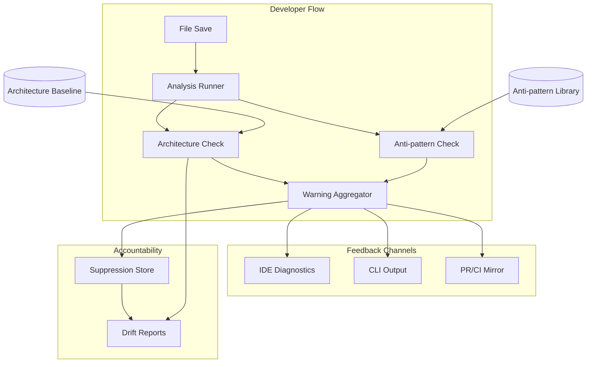

<!-- APS: See https://github.com/eddacraft/anvil-plan-spec for format reference -->
<!-- This document is non-executable. -->

# Anvil — Save-time Trust

> **Latest promoted release: `v0.8.1-beta`** (shipped 2026-06-11) — "Headless
> GitHub Login" patch (brokered GitHub Device Authorisation Grant login,
> GHCLIAUTH 11/11, ADR-066; record at
> [`plans/releases/v0.8.1-beta.md`](./releases/v0.8.1-beta.md)) cut one tag
> after **`v0.8.0-beta`** (2026-06-11, "The Save-Time Daemon" — daemon-served
> delta validation default-on (DSV-021), the GV2 A→A′ hot-read backing swap
> with the ADR-031 latency CI gate, Rust project analysis (RSTLAN), the live
> gate-summary dashboard (TUIDASH), portable review capsules (GITGOV,
> ADR-074), and the ungated `anvil welcome` path (ADR-080); record at
> [`plans/releases/v0.8.0-beta.md`](./releases/v0.8.0-beta.md)), which missed
> the final GHCLIAUTH merges by ~5 hours. Together they close the `v0.8.0`
> window scoped by
> [ADR-075](./decisions/075-v080-graph-product-scope.md) (Accepted via
> council). A later **`v0.8.2-beta`** tag (2026-06-22) exists but is **not**
> the latest promoted release: it is a Windows daemon-ensure hotfix cut for
> smoke testing (ACTMO's Windows daemon-ensure chain, [#2937](https://github.com/eddacraft/anvil-001/issues/2937)),
> deliberately not promoted as a headline window — so "latest" above
> intentionally points at the older tag. `v0.8.2-beta` is marked as a GitHub
> prerelease and was cut for Windows smoke testing, not as a promoted window. The
> next window is **`v0.9.0-beta`** ("The Assistant-Facing
> Graph", scoping in [`RELEASE-PLAN.md`](../RELEASE-PLAN.md)): ADR-075 defers
> the assistant graph product — GCTX + multi-graph registry — and persistence
> (ADR-061 Sub-phase B warm-start) to it. See
> [`RELEASE-PLAN.md`](../RELEASE-PLAN.md) for the cut detail and
> [`ROADMAP.md`](../ROADMAP.md) for thematic context.

## Contents

- [Next Best Items](#next-best-items)
- [Release Plan](#release-plan)
- [Graph Substrate](#graph-substrate)
- [Hardening & Maintenance](#hardening--maintenance)
- [Intercept Loop](#intercept-loop)
- [Continuous Improvement](#continuous-improvement)
- [Adoption and Sustained Use](#adoption-and-sustained-use)
- [Rust Engine](#rust-engine)
- [Auth & Access](#auth--access)
- [Tracing Foundation](#tracing-foundation)
- [Usage Analytics](#usage-analytics)
- [Infrastructure as Code](#infrastructure-as-code)
- [Web Dashboard](#web-dashboard)
- [Policy Governance](#policy-governance)
- [Engineering Platform](#engineering-platform)
- [Test Quality](#test-quality)
- [Language & Coverage](#language--coverage)
- [Rust MCP Launch Path](#rust-mcp-launch-path)
- [Future](#future)
- [Dormant: Not Yet Scheduled](#dormant-not-yet-scheduled)

Anvil makes AI-generated code safe to merge by catching architecture boundary
violations and AI escape-hatch anti-patterns at file-save time. Developers get
actionable warnings before code leaves the file, with human-owned exceptions for
intentional deviations.

**Why this matters:** AI coding tools are accelerating development, but they
don't understand your architecture. They produce code that compiles and passes
tests, yet drifts from intended patterns. By the time drift is noticed in
review, it's already merged or too expensive to fix. Anvil catches it at the
moment of creation — when fixing is cheap.

**Product thesis:** Anvil improves trust in AI-generated code so more of it
reaches production faster, while architecture drift slows or reverses over time.

**Primary beneficiary:** Individual developers — they get to use AI safely at
the pace leadership expects.

## Problem & Success Criteria

**Problem:** The most damaging recurring failure is second-wave feature work
drifting from intended patterns because engineers:

- don't know which patterns apply
- don't read ADRs or architecture diagrams
- don't recognise when their change crosses a boundary

The most reliable early signal: a **new dependency edge** where a function or
class reaches across architectural contexts.

**Success Criteria:**

- [ ] 50%+ of developers run Anvil on every save (adoption) — post-release
- [ ] Time-to-merge for AI-assisted PRs does not increase (throughput) —
      post-release
- [ ] New cross-boundary edges per sprint decreases by 30% within 8 weeks
      (drift) — post-release
- [x] Save-time feedback latency < 2 seconds cached, < 5 seconds cold (speed)
- [ ] < 10% of warnings are suppressed without resolution (signal quality) —
      post-release

## Next Best Items

**Next Best Item (NBI)** is the running, index-owned selector for the best work
to pick up or schedule next. It does not replace APS module truth: every row
must point at an APS module, work item, release-plan gate, or documented
operational follow-up. Keep the list short, ranked, and current when an item
starts, completes, blocks, or a release priority changes.

Selection rules:

- Prefer `Ready` and unblocked work that advances the current release claim,
  adoption, trust, signal quality, or recurring delivery friction.
- Include `Schedule` rows only when the work is not execution-ready but should be
  shaped next because it is likely to outrank ordinary ready work.
- Do not duplicate module tables here. Link the source of truth and state only
  the next action needed to move the item.
- If this list is stale, derive the next pick from the highest-value `Ready`
  item in the active module tables and refresh this section in the same change.

| Rank | NBI | Mode | Source | Why now | Next action |
| ---- | --- | ---- | ------ | ------- | ----------- |
| 1 | DSV-048 → DSV-047..051 — headless save-time driver (Sub-phase C) | Ready | [daemon-save-time-validation](./modules/daemon-save-time-validation.aps.md) | **v0.9.0-beta usefulness cut-line:** ACTMO registration UX is Merged; DSV-046 design Done ([ADR-101](./decisions/101-headless-save-time-driver.md)). Without DSV-047..051, `anvil start` still cannot run unattended save-time validation. Wave: DSV-048 (CLI driver entry) → DSV-047 (daemon supervisor) → DSV-049/050 (status + copy) → DSV-051 (E2E/runbook). | Start DSV-048 (`anvil watch --save-time-driver`) — defines the spawn contract DSV-047 consumes. |
| 2 | DASH-001..009 — dashboard foundation (Wave 1) | Ready | [dashboard-foundation](./modules/dashboard-foundation.aps.md) | Wave-1 foundation for the browser surface (team-lead / platform / compliance roles). Unblocks **DASHCORE**, **DASHARCH**, **DASHOPS** after the v0.9 usefulness gate. Built in `apps/website/` (Next.js 16 + shadcn/ui + Recharts); 1/9 done. | Continue from DASH-001 after DSV Sub-phase C lands or in parallel if staffed. |

NBI review note (2026-07-04, DSV-046 shaped): **DSV-046** promoted from Proposed →
**Done** (design) with [ADR-101](./decisions/101-headless-save-time-driver.md)
Accepted and **DSV-047..051** filed **Ready** (cut-line). This closes the
RELEASE-PLAN usefulness addendum design gate; `v0.9.0-beta` cut now depends on
implementing Sub-phase C (wave: DSV-048 → DSV-047 → DSV-049/050 → DSV-051).
**DSV** promoted to NBI rank 1; **DASH** demoted to rank 2. Bookkeeping-only.

NBI review note (2026-07-03, INSEC first wave delivered): **INSEC-001..006**
removed from the NBI table — the insecure-construction first wave is Merged
2026-07-01 via [#3028](https://github.com/eddacraft/anvil-001/pull/3028) (the
`insecure-construction` category variant + `weak-cryptography` /
`unsafe-rendering` regex families + SSTI fold into `dynamic-execution` + the
§16.5 #9 dogfood FP acceptance, tracked and closed via issue
[#3031](https://github.com/eddacraft/anvil-001/issues/3031)). The module is
**In Progress 6/8** with only the deferred AST tail — INSEC-007
(`injection-smell`) and INSEC-008 (insecure-RNG), both Proposed opt-in —
remaining, so it is no longer NBI-eligible. **DASH** promoted to rank 1. Rank
2 is open: derive the next pick from the highest-value Ready item in the
active module tables when DASH work starts.

NBI review note (2026-06-30, EVAL merged): **EVAL-001..005** removed from the
NBI table — the eval-harness-integration module is Done
([#3013](https://github.com/eddacraft/anvil-001/pull/3013)); **DASH** promoted
one rank. The module registry row records its Done status.

NBI review note (2026-06-26, ACTMO promotion): **ACTMO-002** promoted to rank 1
after v0.8.2-beta Windows smoke ([#2937](https://github.com/eddacraft/anvil-001/issues/2937))
showed `worktree_unenforced` blocks adoption despite CIB-072 daemon ensure.
APS module [`activation-mcp-optional`](./modules/activation-mcp-optional.aps.md)
is **Ready** (0/10); design [#2939](https://github.com/eddacraft/anvil-001/issues/2939);
ADR-092 Proposed. Prior post-snippet-line picks (**INSEC**, **EVAL**, **DASH**)
demoted one rank.

NBI review note (2026-06-26, ACTMO-001/-002 implementation): **ACTMO-001** and
**ACTMO-002** are Done on `feat/actmo` (ADR-092 Accepted; activation now
registers the current worktree with the intercept daemon before MCP install).
Promoted **ACTMO-003** to rank 1 so the next change teaches the activation state
machine to fall through honestly when the spine is live and MCP is absent or
restart-bound, without weakening the `protecting` attestation predicate.

NBI review note (2026-06-26, ACTMO-003 implementation): **ACTMO-003** is Done on
`feat/actmo` — daemon attestation now records an `Enforced` spine state and maps
covered repos to `state: watching` when MCP is absent or restart-bound, while
`Protecting` still requires `LiveValidation`. Promoted **ACTMO-004** to rank 1
for the explicit `--no-mcp` / `ANVIL_NO_MCP` opt-out.

NBI review note (2026-06-26, ACTMO-004 implementation): **ACTMO-004** is Done on
`feat/actmo` — `anvil start --no-mcp` and non-empty `ANVIL_NO_MCP` skip Cursor
and Claude Code MCP config writes, render an explicit skipped-install line, and
leave daemon-backed worktree registration active. Promoted **ACTMO-008** to rank
1 for the remaining Windows smoke blocker around headless daemon visibility and
`intercept stop` recovery.

NBI review note (2026-06-26, ACTMO-008 implementation): **ACTMO-008** is Done on
`feat/actmo` — `anvil intercept status` now names the daemon PID and stop
command, while `intercept stop` shares the PID-file planner across Unix and
Windows (Windows terminates the recorded daemon process and clears the PID
file). Promoted **ACTMO-005** to rank 1 to close the next spine gap: activation
must install hook coverage without relying on MCP.

NBI review note (2026-06-26, ACTMO-005 implementation): **ACTMO-005** is Done on
`feat/actmo` — activation now reuses the silent hooks installer to add
Anvil-managed `pre-commit` and `pre-push` hooks in Git repos, preserving
unmanaged hooks through the existing non-force skip policy. Promoted
**ACTMO-006** to rank 1 for the default save-time armed posture after start.

NBI review note (2026-06-26, ACTMO-006 implementation): **ACTMO-006** is Done on
`feat/actmo` — daemon-attested starts now report daemon-backed save-time as
armed, list the L2 daemon-backed layer in the first-run recipe, and point
operators to `anvil intercept status` instead of requiring a manual
`anvil watch`. Promoted **ACTMO-007** to rank 1 for the remaining Claude MCP
allow-list friction.

NBI review note (2026-06-26, ACTMO-007 implementation): **ACTMO-007** is Done on
`feat/actmo` — Claude Code MCP installs now merge `mcp__anvil__*` into
`.claude/settings.json` `permissions.allow`, preserving existing allow/deny
rules and repairing already-up-to-date MCP entries that predate the allow-list.
Promoted **ACTMO-009** to rank 1 for the docs/runbook closeout around the
corporate no-MCP path.

NBI review note (2026-06-26, ACTMO-009 implementation): **ACTMO-009** is Done on
`feat/actmo` — added the MCP-optional activation runbook for `--no-mcp` /
`ANVIL_NO_MCP`, linked it from the public wow-start guide and activation
as-built, and regenerated docs indexes. Promoted **ACTMO-010** to rank 1 for the
remaining E2E regression matrix.

NBI review note (2026-06-26, ACTMO-010 implementation): **ACTMO-010** is Done on
`feat/actmo-spine` — the E2E harness now covers default MCP install, `--no-mcp`
activation, and the terminating daemon-repair verify path with isolated
HOME/runtime state. ACTMO-001..010 are Done; the module is **In Progress** at
10/12 with **ACTMO-011/-012** (Matt beta UX) still Ready. With the spine
implemented, next-best work returns to **INSEC-001..006** unless ACTMO-011/-012
are prioritised.

NBI review note (2026-06-27, ACTMO-011 implementation): **ACTMO-011** is Done
([#2969](https://github.com/eddacraft/anvil-001/pull/2969)) — `anvil status` TUI
gained a `*`/`o` hook legend + honest Recent Runs empty-state, and `anvil
insights` daemon-uptime now reads "not yet measured" instead of a stub `0%`
(JSON wire value unchanged). A gap analysis found most of the original ACTMO-011
wishlist already shipped (ADTRUST-006/UJ-001/DLIFE-006/welcome routing); the
reconciliation is recorded in the work item. Module now **In Progress** at
11/12; **ACTMO-012** (editor-aware MCP / Cursor false-positive) is the last
item.

NBI review note (2026-06-27, ACTMO-012 implementation): **ACTMO-012** is Done
([#2970](https://github.com/eddacraft/anvil-001/pull/2970)) — `anvil start` now
only writes a *fresh* MCP config for editors actually detected on the host
(binary on PATH / pre-existing editor state), so it no longer creates
`~/.cursor/mcp.json` for an editor the user never used (Matt beta smoke); the
false "AI tools detected: cursor" line and Cursor `restart_handshake_verified`
self-test fall away at the root. Existing anvil entries are still managed (no
orphaning); `--all-mcp-clients` / `ANVIL_ALL_MCP_CLIENTS` opts back into wiring
both editors. Probe-display omission + handshake label re-wording deferred as a
documented scope boundary (see work item). **All 12 ACTMO work items are now
Done (12/12).** The module stays **In Progress** pending release evidence —
the post-merge Released/Shipped → **Complete** flip and archive are owned by the
release/cleanup step, not this implementation PR.

NBI review note (2026-06-29, ACTMO-013 design): **ACTMO-013** (subsequent
worktree registration UX) is Done as a **design** deliverable — a planning-council
hardened spec + ADR-094 (Accepted 2026-06-29). The council's keystone finding: the registry
is an in-memory 30s heartbeat lease, so durable membership must be a daemon-side
**persisted, TTL-exempt, reload-on-start** set (reaper + cap), not a CLI
heartbeat. ACTMO-013 splits into **ACTMO-014..017** (Ready, cut-line:
durable primitive → `workspace register` → outside-worktree `start` → status
surfacing), **ACTMO-018** (Ready, additive: bounded `register --all`), and
**ACTMO-019..021** (Proposed: persistent `register_on_start` key, guided
`install-hook`, scoped local app). Module **In Progress at 13/21**; the v0.9.0-beta
daemon-usefulness cut-line also needs a promoted+split **DSV-046**. *(Superseded
2026-07-04: DSV-046 promoted — ADR-101 Accepted, DSV-047..051 Ready — and counts
reconciled via `pnpm aps:index`; see the 2026-07-04 NBI note above.)*

NBI review note (2026-06-26, post-snippet-line refresh): the five previously
ranked rows are now all **Done/Merged** — the v0.9 snippet line
(GCTX-021/-022/-023) and its GV2-032 span/content-hash substrate all **Done
2026-06-24**, and KDS-002 **Merged via #2906** — so the table again pointed at no
pickup-able work. **GCTX-031** (re-export privilege visibility, the last internal
GCTX consumer) is **in flight in a sibling session** and closes GCTX → 13/14 on
merge; it is deliberately left off the ranking (do not double-start). With the
v0.9 "assistant-facing graph" headline delivered, refreshed to the
highest-value **Ready, unblocked** work derived from the active module tables:
**INSEC** first-wave insecure-construction security smells (advances the core
safe-to-merge thesis; ADR-087 Accepted), **EVAL** policy eval-harness (deps met
via CIB-078 + POLENG Complete; unblocks ATC/PATT), and **DASH** dashboard
foundation (Wave 1; gates DASHCORE/DASHARCH/DASHOPS). Other Ready lanes not
ranked here: IORISK, CPOL, ATC, PATT, APGOV (6/7), EDGE, DEVENV-008, DSITE-003.
**Blocked on upstream, surfaced not ranked:** the KDS-004/-005 →
DPO-003/004/005 chain (the protection-observability read surface + dashboards)
waits on the kindling list/aggregate read API (anvil-001#2910) + a spool
size/age cap (anvil-001#2916). These are derived picks pending operator steer.
Bookkeeping-only (single-purpose per dev-workflow rule 14).

NBI review note (2026-06-24, NBI refresh): the table had gone stale — all seven
ranked rows were **Merged** items awaiting release-tag cleanup (GCALL-001..003,
GCTX-010..013), so it pointed at no pickup-able work. Refreshed against
`origin/main` + work currently in flight: the **v0.9 snippet line** now leads —
GCTX-021 (In Progress) → GCTX-022/023 (Ready) — on the GV2-032 substrate (In
Progress; implementation + a Batch Council PASS already on `main`, status-flip
pending). KDS-001/003 Merged via #2897 promotes the **KDS-002 chain** (also the
DPO-003/004/005 unblock) to rank 5. The Merged GCALL/GCTX rows are dropped from
the ranking — their per-item PR provenance is preserved in the module files, and
the cleanup agent advances them Merged → Released/Shipped on the `v0.9.0-beta`
tag. Bookkeeping-only (single-purpose per dev-workflow rule 14).

NBI review note (2026-06-13, ninth pass): operator set the `v0.9.0-beta`
direction (assistant-facing graph + bug-fixing) and asked that everything
in-scope that can be marked Ready, be. Acted on it: **USAGE** scoped into the
window as additive work (USAGE-001 stays `Ready`, unblocked); and a readiness
pass promoted four GV2 substrate items — **GV2-013, GV2-014, GV2-026,
GV2-030** — from Draft to **Ready** (deps Merged, execution-ready detail, and
per [ADR-075](./decisions/075-v080-graph-product-scope.md) **not** behind the
GCTX entry gate, which covers only the assistant-facing egress surface).
Deliberately left Draft: GCTX-001..013 (gated on the unresolved GCTX-002 ADR +
the unmet context-egress privacy review), GV2-020/-023 (unmet deps; GV2-023 is
also MCP/weave-egress-adjacent), and USAGE-002/-003 (depend on USAGE-001
landing). RELEASE-PLAN phase plan + NBI reordered accordingly. Bug-fixing
rides the standing `v0.8.x` patch lane.

NBI review note (2026-06-15): per `/plan-status` + direct request, executed the
rank-1 readiness pass — GV2-031 promoted Ready in module + index (worktree
`feat/gv2-031` created). This is the last internal GV2 substrate item (re-export
privilege visibility for trust/certify; depends only on already-Merged GV2-029).
Started on ADR-075 entry gate: authored ADR-083 (GCTX-002 MCP delivery target
decision) as Proposed. Updated GCTX module, RELEASE-PLAN, DECISION-LOG, and
NBI rank 2 note. Rank 1 now actionable; rank 2 advances with the new ADR +
pending egress privacy review (PV-9). All plan edits are bookkeeping (single-purpose
per dev-workflow rule 14). Next validation + PR.

NBI review note (2026-06-15, entry-gate close): per direct operator request,
**landed both ADR-075 entry decisions** and the dependent readiness pass.
(1) [ADR-083](./decisions/083-gctx-mcp-delivery-target.md) flipped Proposed →
**Accepted** (Josh) + DECISION-LOG updated. (2) Ran the **context-egress privacy
review (PV-9)** — a four-reviewer council (security-analyst lead, adversarial,
operations, kernel; verdict
[2026-06-15-gctx-context-egress-privacy-review-verdict.md](./reviews/2026-06-15-gctx-context-egress-privacy-review-verdict.md),
APPROVE-WITH-CONDITIONS 4/4, no BLOCKs). The load-bearing finding: the default
egress surface is identity-only; source-text snippet egress is opt-in/default-off
through a single sealed-DTO redaction choke point (CE-1 + CE-5 are hard gates;
CE-1..CE-12 fold into GCTX-001). (3) Promoted to **Ready**: **GV2-020** (deps
GV2-010..014 all Merged), **GV2-023** (MCP/weave consumer contract), **GCTX-002**
(both its gate conditions met), and the **GCTX module** (Draft → Ready, 0/13 —
GCTX-001..013 stay Draft pending the GCTX-001 contract). The `flags/manifest.json`
`gctx.egress` entry (CE-9) is deferred to first GCTX implementation to avoid a
FLAGCAT orphan-flag drift failure. All edits are plan/decision bookkeeping
(single-purpose). Next validation + PR.

NBI review note (2026-06-15, GV2-031 merged): **GV2-031 Merged via PR #2627** —
the last internal GV2 substrate item lands re-export edge lifting so transitive
privilege (`export * from 'node:fs'`, directly or through a chain) is visible to
`annotate_trust`/`certify`. **GV2 is now 20/20** (module stays In Progress
pending the v0.9.0-beta release tag; cleanup agent advances Merged →
Released/Shipped → Complete on ship). NBI reordered: **GCTX-001 promoted to
rank 1** (the active GV2-consuming front now the substrate is complete); GV2-031
demoted to rank 2 as Merged. Reconciled the module Stats table, which lagged the
GV2-020/023 merges (Phase 2 3/4 → 4/4, Phase 3 7/8 → 8/8). Bookkeeping-only.

NBI review note (2026-06-16, full-scan executor): planning council
`plan-898d9222` resolved the [ADR-084](./decisions/084-gctx-graph-handle-access.md)
**C1 cold-start** gap — the daemon's graph cache is save-populated, so a fresh
MCP session stays cold until a save, and `anvil/request_full_scan` only sets
`Pending` with no executor loop. Synthesised:
[ADR-085](./decisions/085-daemon-full-scan-executor.md) (Accepted, full-scan
executor over the DSV-006 primitives, new `AssuranceState::Bounded` wire variant)
and a new **DSV-045 (full-scan executor, Ready)** that owns the loop on the DSV
track and **merges before** GCTX-010. GCTX-010's remaining work narrows to the
warm-up *triggers* (session-init + on-demand `request_full_scan` + `NotReady`
hint), now depending on DSV-045 + ADR-085. DSV total 19 → 20; DECISION-LOG +
DSV module updated. All edits are plan/decision bookkeeping.

NBI review note (2026-06-23, GCTX snippet line shaped): per direct operator
request, shaped the design that unblocks the **Phase-2 snippet items
(GCTX-021..023)** and wrote the APS edits. The load-bearing finding: the gates
were never the blocker — the [PV-9 review](./reviews/2026-06-15-gctx-context-egress-privacy-review-verdict.md)
already specifies the snippet conditions (CE-1/2/3/5/6/7/9/11/12) in full, and
the daemon-side sealed-DTO + `GctxProjector` spine is built — but the **resident
`SymbolNode` carries no source span and the graph records no per-file content
hash** (`graph.rs` defers span population to "a consumer", which is GCTX-021), so
a snippet projector has nothing to locate bytes with and nothing to
freshness-check against (CE-7). Filed **GV2-032 (Ready)** as that substrate
producer (span + content hash via `apply_delta`, ADR-031 budgeted; GV2 20 → 21),
keeping substrate GV2-owned per the framing rule (mirrors how GCALL was split
out). Reshaped GCTX-021..023 from their stale pre-ADR-084 text (wrong
`anvil-kernel/.../snippet.rs` files, `GV2-010`-only dep, zero CE gates) to
daemon-side `anvil-gctx-egress` items with the snippet CE gates folded in and
flipped **Draft → Ready**; the `gctx.egress` flag (CE-9) lands with GCTX-021. No
new privacy review needed — PV-9 already reviewed the snippet surface and
discharged the egress-privacy gate. All edits are plan/decision bookkeeping
(single-purpose per dev-workflow rule 14). Next validation + PR.

NBI review note (2026-06-13, eighth pass): the v0.8.0/v0.8.1 post-release
closeout is **complete**. The previous (seventh) pass reconciled statuses onto
the tag evidence; this pass ran the **archive cascade** — UJ, TUIDASH,
RSTLAN, GITGOV, GHCLIAUTH and INTR moved to `plans/archive/modules/` with
inbound links repointed and the docs/aps indexes regenerated (`docs:check`
8/8, `aps:index:check` ok). Their index rows are frozen here pointing at the
archive. Remaining operational follow-up: confirm the WinGet upstream
submission ([microsoft/winget-pkgs#386426](https://github.com/microsoft/winget-pkgs/pull/386426))
merged. The next window, **`v0.9.0-beta`**, is already declared in
`RELEASE-PLAN.md` (rank 1) and inherits the ADR-075 deferrals — still Draft,
needing an owner theme/scope confirmation before promotion. With no release
payload in flight, the Ready pool is live — USAGE-001 leads it (rank 2).

Earlier — NBI review note (2026-06-12, seventh pass): **`v0.8.0-beta` ("The
Save-Time Daemon") and `v0.8.1-beta` ("Headless GitHub Login") were both cut
and published 2026-06-11** — records at
[`plans/releases/v0.8.0-beta.md`](./releases/v0.8.0-beta.md) and
[`plans/releases/v0.8.1-beta.md`](./releases/v0.8.1-beta.md). That pass
reconciled APS state onto the tag evidence: Merged items in DSV (A/A-W/A′
arc), GV2 (A′ slice + earlier merged foundation items), UJ, RSTLAN, TUIDASH,
GITGOV, RLB (-002..-005/-008), EXCEPT-007 and INSIGHTS-004 advanced to
Released/Shipped via `v0.8.0-beta`; GHCLIAUTH (11/11) via `v0.8.1-beta`;
TUIDASH, RSTLAN and GITGOV module statuses advanced to Complete.

## Release Plan

Releases are themed by what they deliver, not sequenced by version number.
Individual packages still use semantic versioning for npm/cargo publishes.

**Shipped release windows** — `v0.5.0-beta` (2026-05-01) through
`v0.8.1-beta` (2026-06-11) are fully shipped. Windows through `v0.7.4-beta`
have their per-window tables and slice records in
[`completed-index.aps.md`](./completed-index.aps.md#release-plan); the
`v0.8.0-beta` / `v0.8.1-beta` records live under
[`plans/releases/`](./releases/). A later `v0.8.2-beta` hotfix tag
(2026-06-22, Windows daemon-ensure smoke, [#2937](https://github.com/eddacraft/anvil-001/issues/2937))
was cut for testing and is **not** a promoted headline window. The next
planning window is
**`v0.9.0-beta`** (scoping — the ADR-075 deferrals), declared in
[`RELEASE-PLAN.md`](../RELEASE-PLAN.md); see also the header above and the NBI
table.

**Active work below still leads with the just-shipped `v0.8.0` window's
module family** — Graph Substrate (GV2, now 18/20 with the A′ slice shipped, the
v0.9 contracts Merged — Phase 1 complete — and the GV2-026 depth lever + GV2-030
sealed-snapshot no-leak guard Merged), Hardening & Maintenance (DSV, Sub-phase B
Blocked), and Intercept Loop (MLP2 enforcement substrate) — then the rest of
the active modules, then the [Dormant](#dormant-not-yet-scheduled) band. The
v0.8.0/v0.8.1 tag-complete modules (UJ, TUIDASH, RSTLAN, GITGOV, GHCLIAUTH,
INTR) have been archived to `plans/archive/modules/`; their index rows below
are frozen pointing at the archive.

### Graph Substrate

Persistent joined graph substrate for deterministic enforcement, provenance,
trust, control/session joins, and optional assistant context projection. Graph
v2 is Anvil-first; agent context delivery consumes projections over that same
trusted model.

| Module | Scope | Status | Progress | Dependencies |
| ------ | ----- | ------ | -------- | ------------ |
| [graph-v2-foundation](./modules/graph-v2-foundation.aps.md) | GV2 | Done | 21/21 (20 items Merged-or-Released; **GV2-032 Done 2026-06-24** (`feat/gctx-021-snippet-extractor`) — the deferred GV2-010 span producer (`SymbolNode.span` + content hash via `apply_delta`, ADR-031 budgeted) that unblocks the GCTX snippet line; substrate stays GV2-owned. The 20 prior items await the v0.9.0-beta release tag → Released/Shipped → Done. A′ slice shipped in v0.8.0-beta; Phase 1 complete — GV2-013/014 contracts Merged 2026-06-13 via #2578/#2579; GV2-023 consumer query contract Merged 2026-06-15 via #2621 (four read classes, one mapped scenario each for INTD/DRVR/GCTX/WEAVE); **GV2-020 multi-graph registry + typed query traits Merged 2026-06-15 via #2622** (the impl behind the GV2-023 contract; control/provenance as trait stubs, ADR-064); GV2-026 reverse-impact depth lever Merged 2026-06-14 via #2594 and GV2-030 sealed-DTO no-leak guard Merged 2026-06-14 via #2595; **GV2-031 re-export edge lift for transitive privilege Merged 2026-06-15 via #2627** — the last internal GV2 item) | KERN, anvil-graph-cache, ADR-061/063/064/067/069, ADR-031, INTD, GCTX, EDDA |
| [graph-context-delivery](./modules/graph-context-delivery.aps.md) | GCTX | In Progress | 15/15 (Phase 0 — Delivery Contract — complete: **GCTX-001 projection contract Merged 2026-06-15 via #2628** (spec folds PV-9 CE-1..CE-12 onto the GV2-023 contract) and **GCTX-002 MCP delivery target Merged 2026-06-15 via #2619** (discharged by ADR-083 Accepted). Graph-handle access fixed by **ADR-084 Accepted via #2632** (daemon-RPC + daemon-side projection, two crates, option A same-process service). **GCTX-010 (`anvil_search_symbols`) Merged 2026-06-16 via #2657** — the CE-5 hard-gate pilot delivered the sealed egress DTO + `GctxProjector` + no-leak-test spine across #2637/#2645/#2648 plus the C1 cold-start warm-up triggers on top of DSV-045 (#2674). **GCTX-011 (`anvil_find_dependents`) Merged 2026-06-16 via #2685** — file-keyed/identity-only dependency traversal on the spine. **GCTX-012 (`anvil_impact_of_change`) Merged 2026-06-17 via #2693** — multi-source change-impact report (affected symbols + dependent files + heuristic known tests), no new substrate. **GCTX-013 (`anvil_affected_tests`) Merged 2026-06-17 via #2700** — test attribution (evidence edges) + coverage gaps over the same spine (reuses GCTX-012's `is_test_file` + the forward `dependencies_of` edges), no new substrate. **GCTX-014 (`anvil_find_callers`) Merged 2026-06-17 via #2715** — symbol-level caller traversal projecting the GCALL-003 `callers_of` read API (per-caller `heuristic` + report `partial`, CE-5 no-leak tests extended to the caller DTO), completing the Phase 1 tool surface (010..014). **GCTX-030 (`graph://` MCP resources) Merged 2026-06-18 via #2772** — the identity-only `graph://stats`/`symbols`/`edges` resource surface (CE-6 pagination, `bounded` edges flag, warm-on-NotReady, `resources` capability + `resources/list`/`read` dispatch; `symbols` reuses the `search_symbols` RPC), its edge enumeration determinism-hardened by a pre-PR Batch Council. **GCTX-020 Done 2026-06-20** — parser-free conservative token estimator in `anvil-graph-cache`; **GCTX-021..023 Done 2026-06-24** (`feat/gctx-021-snippet-extractor`) — snippet extractor + budget slicer + `anvil_symbol_context` MCP tool, PV-9 CE gates, `gctx.egress` flag, on the GCTX-010 `GctxProjector` spine with **GV2-032** span/hash substrate. GCTX-031 (token-reduction benchmark harness, deps GCTX-023) Merged 2026-06-26 via #2942 (`token_reduction` bench: real `ImpactOutcome` payload vs file-reading, golden-pinned; 89.2%/87.3% mean reduction); GCTX-032 (user guide) Merged 2026-06-26 via #2952 (`docs/guides/ai-context-delivery.md`). **GCTX-024 (frictionless consented snippet-egress opt-in) Merged 2026-06-29 via #2980** — `anvil gctx egress enable/disable/status` over a per-workspace gitignored consent record + the `resolve_snippet_egress` precedence resolver, identity-only default (CE-1) preserved — **all 15 items Merged**; Complete-eligible pending v0.9 release-tag evidence.) | GV2 |
| [symbol-call-graph](./modules/symbol-call-graph.aps.md) | GCALL | In Progress | 7/7 (filed 2026-06-17 to unblock GCTX-014 `anvil_find_callers`; **all 7 work items Merged** — advances to Complete on the release tag including the GCALL substrate. Producer-side call-graph substrate — call-site extraction into `FileSymbols` + lifting `EdgeType::Calls` into the resident `SymbolGraph` via `apply_delta` + a bounded caller read API — within the ADR-031 save-time budget, behind a caller-egress privacy review. Not a GCTX item: GCTX consumes this substrate, mirroring how it consumes GV2. **GCALL-001 Merged via #2705** as ADR-086 (Accepted, operator); **GCALL-002 Merged via #2707** (TS/JS extraction — `CallSite`/`CalleeRef`/`LocalSymbolRef` types + `calls` channel + extractor pass); **GCALL-003 Merged via #2708** (resident `EdgeType::Calls` edges + `callers_of` read API, + CALL-1 heuristic marker #2712); **GCALL-004 Merged via #2711** (Rust extraction); **GCALL-005 Merged via #2733** (Python extraction); **GCALL-006 Merged via #2735** (save-time call-lift latency gate, `call_lift` bench + resource-budget gate); **GCALL-007 Merged via #2710** (caller-egress privacy review verdict). The GCALL consumer **GCTX-014 `anvil_find_callers` Merged via #2715** over the GCALL-003 `callers_of` read API. **Post-merge milestone Council review + remediation Merged 2026-06-18 via #2745** — substrate hardening (cap + `calls_partial`, honest CALL-1 `partial`, nearest-first ordering, indexed `resolve_import`, cap-ceiling latency op); no count change, all 7 stay Merged.) | GV2, anvil-kernel-types (`EdgeType::Calls`), ADR-031, ADR-064, lang-python |

### Hardening & Maintenance

Codebase cleanup, .anvil file format, and BMAD v4 compatibility.

| Module                                                                          | Scope  | Status      | Progress                                                                                                                                                                                                                                                                                                                                                                                    |
| ------------------------------------------------------------------------------- | ------ | ----------- | ------------------------------------------------------------------------------------------------------------------------------------------------------------------------------------------------------------------------------------------------------------------------------------------------------------------------------------------------------------------------------------------- |
| [codebase-maintenance](./archive/modules/codebase-maintenance.aps.md)           | MAINT  | Complete    | 11/11 (1 deferred)                                                                                                                                                                                                                                                                                                                                                                          |
| [anvil-file-format](./archive/modules/anvil-file-format.aps.md)                 | ANVFMT | Complete    | 15/16 (1 reparented to RSCAN-006 under ADR-026)                                                                                                                                                                                                                                                                                                                                             |
| [anvil-rust-scanner](./archive/modules/anvil-rust-scanner.aps.md)               | RSCAN  | Complete    | 8/8 (RSCAN-008 landed — docs now describe the authoritative Rust scanner and the scanner-parity story per ADR-026)                                                                                                                                                                                                                                                                          |
| [nx-task-migration](./archive/modules/nx-task-migration.aps.md)                 | NXTASK | Complete    | 6/6                                                                                                                                                                                                                                                                                                                                                                                         |
| [anvil-scanner-parity-gaps](./archive/modules/anvil-scanner-parity-gaps.aps.md) | SPG    | Complete    | 6/6 (`flags:"i"` honoured, lookaround rules handled via post-filters, doctor surfaces compile failures, fixtures cover every rule, `antipattern_scan` bench + trust-boundary docs landed)                                                                                                                                                                                                   |
| [anvil-ts-scanner-retirement](./archive/modules/anvil-ts-scanner-retirement.aps.md) | TSRET  | **Complete** | 3/3 active (3 superseded) — TSRET-001/-002/-005 Complete; TSRET-003/-004 superseded by DRVR; TSRET-006 superseded by ADR-033. Terminal state on `chore/TSRET-005` (2026-04-29): TS scanner + suppression + drift + gate runner + constraint collector all archived, now living in sibling `eddacraft/anvil-archive` at `anvil-archive/anvil-ts-scanner/`; minimal `Warning` type extracted to `core/src/warnings/types.ts`; Rust-side parity test deleted; root `test:scanner-parity` script removed.                                                                 |
| [scanner-adjacent-ts-retirement](./archive/modules/scanner-adjacent-ts-retirement.aps.md) | TSGAP  | Complete    | 9/9 (Remediation complete 2026-05-12: core exports cleaned; compiler moved to active `anvil-format`; drift/export/suppression ownership settled on Rust CLI/local readers; AP-* explanations explicitly retired until Rust explain lands; RMCPF now maps MCP resources to Rust-owned sources; final audit passed) |
| [bmad-v4-backward-compat](./modules/bmad-v4-backward-compat.aps.md)             | BMAD4  | Proposed    | 0/8                                                                                                                                                                                                                                                                                                                                                                                         |
| [dev-environment-hardening](./modules/dev-environment-hardening.aps.md)         | DEVENV | In Progress | 6/8 (ADR-057 worktree/dev-env hardening; DEVENV-001..-006 Merged — debug line-tables, per-worktree CARGO_TARGET_DIR, target eviction, Node 24 standardise, wt.toml bootstrap; DEVENV-003 Blocked on upstream nxrust cache; -007 (wt/CI classifier parity) Merged 2026-06-10 via PR #2516; -008 (reproducible-base spike) Ready; per-item detail in the module file) |
| [scan-performance](./archive/modules/scan-performance.aps.md)                   | SCAN   | Complete    | 6/6 (SCAN-001/-002/-003 landed as one slice — parallel-scan rollout, ReDoS line-length guard, first-run rayon pool cap; SCAN-004 Merged 2026-05-27 via PR #2021 — welcome `files_skipped_by_ignore` provenance; SCAN-005 Merged 2026-05-28 via PR #2034 — `WalkParallel` benchmark spike (4.5–6.3× walk speedup, ~10–17% end-to-end); SCAN-006 Merged 2026-05-28 via PR #2041 — parallelised the uncapped Phase 1a discovery walk; module all-merged, Released/Shipped in v0.7.3-beta (tag 8bfd48c4d, 2026-05-31) — Complete)                                                                                                                                                                                                         |
| [resource-load-benchmarking](./modules/resource-load-benchmarking.aps.md)       | RLB    | In Progress | 7/8 (filed 2026-05-30 from the beta-tester high-CPU report, GH #2156. RLB-001 + RLB-007 Released/Shipped via v0.7.4-beta — PR #2184 at `72f2de98` confirmed in tag; the load-ramp harness + per-save `anvil check` scoped to the changed file (1 agent 6.55 → 0.08 cores). RLB-002/-003/-004/-005/-008 Released/Shipped via v0.8.0-beta (Merged 2026-06-02 via PR #2228) — process-tree sampler + per-process CPU/RSS budgets (watch churn, intercept daemon, MCP server) + concurrent aggregate + SLO docs/CI. RLB-006 (cross-platform) Proposed.)                                                                                                |
| [daemon-save-time-validation](./modules/daemon-save-time-validation.aps.md)     | DSV    | In Progress | 21/26 (Sub-phases A/A′/B + DSV-045: 20/20 Merged-or-Released, Released/Shipped via v0.8.0-beta where applicable; **Sub-phase C (headless driver): DSV-046 design Done 2026-07-04** — [ADR-101](./decisions/101-headless-save-time-driver.md) Accepted, spec [`specs/2026-07-04-headless-save-time-driver-design.md`](./specs/2026-07-04-headless-save-time-driver-design.md); **DSV-047..051 Ready** cut-line for `v0.9.0-beta` usefulness. DSV-030 warm-start Merged #2688; DSV-045 full-scan Merged #2674. Module Complete blocked on Sub-phase C + v0.9 tag.) |
| [daemon-lifecycle](./modules/daemon-lifecycle.aps.md)                           | DLIFE  | In Progress | 6/6 (DLIFE-001 Done — ADR-082 Accepted 2026-06-15 with the tiered startup mode. ADR-079 superseded. DLIFE-002 — idempotent `ensure_daemon` primitive (probe → same-user lock → re-probe → detached spawn → bound-wait, Unix-first) — Merged via #2644. DLIFE-003 — `anvil start` daemon lifecycle (interactive auto-start; CI/hook/piped + `--no-daemon`/`ANVIL_NO_DAEMON` fall back; honest `daemon:` line) — Merged via #2678. DLIFE-004 — `anvil watch` tiered lifecycle (interactive offer / deterministic headless fallback; `--no-daemon` soft opt-out, `ANVIL_WATCH_DAEMON=0` hard opt-out) — Merged via #2759. DLIFE-006 — terminating `--verify` diagnostic for the daemon-unreachable case (#2609) — Merged via #2639. DLIFE-005 — docs/help/runbook alignment to the start/watch/opt-out lifecycle (+ help-text drift tests) — Merged via #2765. All 6 items merged; module awaits a release tag before Complete.) |
| [nx-rust-plugin](./archive/modules/nx-rust-plugin.aps.md)                       | NXRUST | Complete    | 8/8 (plugin now consumed from npm as `@eddacraft/nxrust`; NXRUST-005/-006 superseded by `cargo metadata` inference — zero per-crate `project.json` needed)                                                                                                                                                                                                                                  |
| [rust-nx-migration](./archive/modules/rust-nx-migration.aps.md)                 | RUSTNX | Complete    | 9/9                                                                                                                                                                                                                                                                                                                                                                                         |
| [v050-release-followups](./modules/v050-release-followups.aps.md)               | V050F  | In Progress | 15/16 (16 hardening items deferred from `v0.5.0-beta` release work: 10 from the council rounds, 1 from the copilot PR #1081 review, 3 from the v0.4.0-beta tag run + post-tag deploy — scoop PAT scope, winget gh arg regression, missing migration runner — 1 from the copilot PR #1090 review tracking the svix>uuid override exception, and 1 private-release Latest promotion fix; 15 done; 1 outstanding — V050F-008 (bench baselines on CI hardware). V050F-015 (svix>uuid override removal) closed 2026-05-31 when `resend@6.12.4` dropped svix. V050F-006 + V050F-011 closed via `fix/v050f-scanner-hotpath` (#1323); V050F-007 closed via `fix/v050f-rayon-init` (#1330).) |
| [v060-release-candidates](./modules/v060-release-candidates.aps.md)             | V060F  | In Progress | 21/25 (triage 2026-06-19 closed 8 as resolved-elsewhere; **Wave 1** shipped V060F-008/009/014/023/024; **Wave 2 complete** — V060F-002 `anvil intercept stop`, V060F-004 macOS start-time, V060F-018 Ratatui default, V060F-019 admin-cli retirement. Remaining 4 = Wave 3 (006/007) + Wave 4 (015/016). Prior completes: V060F-001, V060F-025, V060F-020/021.) |
| [release-orchestration](./archive/modules/release-orchestration.aps.md)                 | RELORCH | Complete | 12/12 (Completed 2026-05-11 after OPMODEL-012 unblocked main-targeted command work. RELORCH-001 design spec; RELORCH-002 reusable command harness and CI workflow; RELORCH-003 assess; RELORCH-004 preflight; RELORCH-005 prepare with tracking issue create/resume, idempotent release-time edits, preparation commit flow, and metadata comments; RELORCH-006 promote with PR create/resume, conflict/review/merge-state reporting, and readiness workflow request/resume; RELORCH-007 tag with guarded pre/post-push recovery semantics; RELORCH-008 monitor with workflow result surfacing; RELORCH-009 verify with structured release/publisher checks; RELORCH-010 closeout with verification gating and issue closeout semantics; RELORCH-011 skill/runbook wire-up and legacy runner deletion; RELORCH-012 release-record `discarded`/`yanked` lifecycle states and closed `policyDecisions` entries. Successor to archived RELMGMT; supersedes parts of `2026-04-20-relmgmt-agent-driven-release-design.md` while inheriting its no-persistent-manifest tradeoff as a hard constraint.) |

**Design doc (Forge & Temper — archived):**
[docs/archive/2026-02-24-forge-temper-review-pipeline.md](../docs/archive/2026-02-24-forge-temper-review-pipeline.md)

### Intercept Loop

Host-local enforcement daemon that detects policy violations from AI agent file
changes and interrupts the correct session via process-group control.
Shell-first, single-host initially, proving the core enforcement thesis. See
[design spec](./specs/anvil-driver-framework/) for the broader driver framework
vision.

**Implementation state (2026-04-30):** The A1 INTD slice is merged and green:
INTD-001 (daemon scaffold), INTD-002 (full cross-platform IPC), INTD-003
(session registry), INTD-005 (enforcement pipeline), INTD-007 (fence
persistence), INTD-013 (telemetry mirror), and INTD-014 (JSON-RPC conformance +
latency harness). The current release now pulls the completed A1 subset from
INTD and INTR to support RMCP/RTAI pre-write validation; the remaining
INTD/INTR/INTL/DRVR work is queued after the launch shim.

<!--
  INTD count history:
  - Pre-NOTIFY-009: index claimed 0/11, module already had 12 tasks (001–012) — off-by-one.
  - NOTIFY-009 added INTD-013 to mirror control decisions onto telemetry.
  - 2026-04-24 council review M1/M5/M9 filed INTD-014 (JSON-RPC 2.0
    conformance + latency benchmark), INTD-015 (daemon-enforced
    telemetry subscription scoping), INTD-016 (DoS protection budgets).
  - Net: module now has 16 tasks; denominator reconciled to /16 (0 done
    at the time of this note; INTD has since completed 16/16, Complete).

  Note: this comment lives ABOVE the table because an HTML comment between
  table rows terminates the markdown table semantically; oxfmt then sees the
  post-comment rows as orphaned prose and rewraps them. Keeping the comment
  here ensures the four module rows below form one contiguous, valid table.
-->

| Module | Scope | Status | Progress | Dependencies |
| ------ | ----- | ------ | -------- | ------------ |
| [intercept-daemon](./archive/modules/intercept-daemon.aps.md) | INTD | Complete | 16/16 (A1 slice: INTD-001/-002/-003/-005/-007/-013/-014; A2 Wave 1: INTD-008/-012/-015 (PRs #1305/#1306); A2 Wave 2: INTD-004/-006/-009/-010/-016 (PR #1308); A2 Wave 3: INTD-011 (PR #1309)) | anvil-checks, anvil-kernel (watcher), INTR, INTL, NOTIFY |
| [intercept-launcher](./archive/modules/intercept-launcher.aps.md) | INTL | Complete | 9/9 | INTD; coordinates `AgentTag` proto with MLP-014; shipped via PR #1528 (merged 2026-05-14 at `5d38e546`) with `crates/anvil-run/` + 49 unit + 3 shell-integration tests green. All nine items Released/Shipped via `v0.7.0-beta` (2026-05-21); module **Complete**; archived |
| [intercept-rules](./archive/modules/intercept-rules.aps.md) | INTR | Complete | 8/8 (INTR-003 antipattern wrapper / INTR-005 regex-content / INTR-007 rule-config Done 2026-06-10 via `feat/INTR-003-005-007-rules`, closing the module; earlier: INTR-004 path-deny 2026-05-13, A1 slice INTR-001/-002/-006/-008; Released/Shipped via v0.8.0-beta (2026-06-11); archived 2026-06-13) | anvil-checks, GV2 later for hot-read rules only |
| [multilayer-protection](./archive/modules/multilayer-protection.aps.md) | MLP | Complete | 18/18 (Done 2026-05-13/-14: MLP-001..-018; MLP-018 closed 2026-05-14 via split into MLP2) | INTD / DRVR / RMCP / RTAI / LAUNCH + anvil-checks; ADRs 036–039 Accepted. MLP-009 was the v0.7.0-beta hard gate; MLP-018 split into MLP2. Per-item detail in the archived module. |
| [multilayer-protection-v2](./modules/multilayer-protection-v2.aps.md) | MLP2 | In Progress | 74/90 (daemon-integration debt from the MLP-018 catalogue, Groups A–R; per-item PR/wave history in the module file) | All MLP v1 primitives; INTD enforcement pipeline; DRVR driver framework; RMCP/RMCPF MCP shim; RTAI mid-edit telemetry; LAUNCH activation orchestrator; kindling-integration. ADRs 036–039 already Accepted under MLP. |
| [ssh-remote-host-daemon](./modules/ssh-remote-host-daemon.aps.md) | SSHREMOTE | Proposed | 0/8 (created 2026-05-14 from ADR-043 / SSH remote-host daemon design; remote host owns daemon, hooks, launcher, and witnesses; local side is display/control only) | INTD, INTL, MLP, DRVR, RMCP/RMCPF; ADRs [036](./decisions/036-daemon-scope-discovery-and-boundaries.md), [037](./decisions/037-witness-chain-and-l4-policy.md), [038](./decisions/038-hook-surface-and-noise-discipline.md), [043](./decisions/043-ssh-remote-host-daemon.md). Not in the v0.7 MLP release gate until promoted. |
| [watch-ux-advisory-rules](./archive/modules/watch-ux-advisory-rules.aps.md) | WATCHUX | Complete | 8/8 (**WATCHUX-001..004 Released/Shipped via [`v0.6.3-beta`](./releases/v0.6.3-beta.md) on 2026-05-15**; WATCHUX-005..007 merged via PR #1524; WATCHUX-008 implemented on `feat/watchux-008-config-cache`) | anvil-cli audit/start/watch/status/config, anvil-kernel watch/watcher, anvil-tui watch surface, MLP config/baseline |
| [watch-output-contract](./archive/modules/watch-output-contract.aps.md) | WOUT | Complete | 6/6 (created 2026-05-14 from consumer-piping question; hardens `anvil --json watch` from best-effort JSON lines into a versioned NDJSON contract — `anvil.watch.event.v1`. WOUT-001..006 implemented 2026-05-14 with typed wire envelope, stdout/stderr discipline, integration harness, golden fixtures and consumer docs. PR #1554 merged; Released/Shipped in v0.7.0-beta (2026-05-21) — Complete) | anvil-cli watch JSON mode, anvil-kernel watch events, anvil-kernel-types, WATCHUX stdout/stderr fallback semantics |
| [surface-drivers](./archive/modules/surface-drivers.aps.md) | DRVR | Complete | 5/5 active (2 superseded, 1 deferred under ADR-033) — DRVR-007 Complete (PR #1304: auth.rs trust boundary v1); DRVR-006 Complete (PR #1304: option-(b) Distinguish recorded); DRVR-001 Complete (PR #1307: shared TS driver client); DRVR-002 Complete (PR #1310: editor-driver protocol design + capability negotiation); DRVR-008 Complete (PR #1310: capability negotiation + manifest method advertisement) | INTD-002/-003/-005/-013/-015, ADR-030, ADR-033 (IDE/MCP archived — DRVR-003 deferred until a new extension package is created on the daemon-driver path), RMCP/RMCPF sequencing, GV2 control/session graph later — supersedes TSRET-003/-004 (KERN-050/-051/-052 superseded-into-INTD per ADR-030); DRVR-004 superseded by RMCP/RMCPF; DRVR-003 deferred per ADR-033; DRVR-005 (architecture cross-links) remains Draft pending DRVR-003 un-pause |

**Architecture Decisions:**
[D-015: Intercept Loop Enforcement](./decisions/015-intercept-loop-enforcement.md),
[D-030: Surface Drivers Supersede napi Cutover](./decisions/030-surface-drivers-supersede-napi-cutover.md),
[D-033: Park IDE/MCP Surfaces; Retire TS Scanner Now](./decisions/033-park-ide-mcp-retire-ts-scanner.md)

### Continuous Improvement

Continuous-improvement-backlog is the standing intake for concrete improvement
items identified anywhere in the project. It intentionally remains active while
the project is active; append executable `CIB-NNN` items as they are found.
Codebase-maintenance and code-review-backlog are retained for history.

| Module                                                                      | Scope | Status      | Progress           |
| --------------------------------------------------------------------------- | ----- | ----------- | ------------------ |
| [continuous-improvement-backlog](./modules/continuous-improvement-backlog.aps.md) | CIB   | In Progress | 145/181 (standing continuous-improvement intake; recent CIB-099..105 GCTX/Windows/insights follow-ups recorded; CIB-106..122 Deepsec triage clusters filed from run `20260629190245-caf2a4b60b2715fe` across Windows pipe rooting/auth, workflow secret hygiene, sandbox/tool execution, TS path containment, provenance redaction, runtime/APS races, Edda/Kindling atomicity, infra secret/resource gating, release installer pinning, and residual P2 disposition; CIB-123 language-profile registry reconciled/Merged 2026-06-30 via PR #3011; CIB-124..126 witness lock timeout, cross-process append linearisation, and chain-init marker follow-ups filed from MLP2-005 phase-1 council; CIB-127 (Ready) tracks wiring the LAUNCH-010 activation finding-baseline into `anvil check` / `audit`, filed from the 2026-07-01 welcome/start user-journey review; CIB-128..132 (Draft) filed 2026-07-02 from the clawpatch triage (`plans/reviews/2026-07-02-clawpatch-triage.md`) — anvil-intercept tracing-before-clap, anvil-rayon-init pool-cap test, Rust test-hardening batch, dogfood classifier path handling, admin-key SSL detection; CIB-162..179 filed 2026-07-04 from the anvil welcome/start user-journey pass (`plans/audits/2026-07-04-anvil-start-welcome-user-journey.md`) — activation output honesty and next-step arbitration, JSON log leak, workflow-picker consent, daemon stop verb, Windows recipe/PATHEXT gaps, welcome TUI navigation; per-item status in the module file) |
| [clawpatch-pre-tag-v0.7.0-beta](./archive/modules/clawpatch-pre-tag-v0.7.0-beta.aps.md) | CLAWP | Archived | 53/65 (archived 2026-06-03 via CIB-039 — 53 Merged / 11 Ship / 1 Deferred-tracked; CLAWP-001 PR #1732, CLAWP-008 PR #1765, CLAWP-011 PR #1791, CLAWP-012 PR #1772, CLAWP-013 PR #1788, CLAWP-014 PR #1786, CLAWP-015 PR #1783, CLAWP-021 PR #1764, CLAWP-022 PR #1770, CLAWP-028 PR #1763, CLAWP-029 PR #1789, CLAWP-030 commit `9253d9f3` in PR #1732, CLAWP-019 PR #2065, CLAWP-033 PR #2136, CLAWP-009 PR #2135, CLAWP-004 PR #2137, CLAWP-007 PR #2144, CLAWP-027 PR #2145, CLAWP-031 PR #2143, CLAWP-038 PR #2142, CLAWP-017 PR #2058, CLAWP-024 PR #2061, CLAWP-025 PR #2160, CLAWP-026 PR #2159, CLAWP-065 PR #2211; 2026-06-03 reconcile of fixes shipped untracked, verified vs `origin/main`: CLAWP-034 PR #1186, CLAWP-043 PR #1114, CLAWP-044 PR #1163, CLAWP-051 PR #1653; 2026-06-03 #1740 test-hardening batch (24 items) Merged via PRs #2261 / #2265 / #2267) |
| [aps-dashboard-starter](./modules/aps-dashboard-starter.aps.md)             | APSDASH | In Progress | 2/4 (APSDASH-001 Done — ADR-055 filed (OSS carve-out). APSDASH-002 Done — seed kit staged + verified (30/30 vs crates.io `eddacraft-tui`). ADR-055 Accepted 2026-06-18 (legal gate cleared); APSDASH-003 Ready — execute pre-publication scrub before lift. APSDASH-004 Proposed — downstream re-development in `anvil-plan-spec`.) |
| [code-review-backlog](./archive/modules/code-review-backlog.aps.md)         | CRB   | Complete    | 29/29              |

> ~~continuous-improvement~~ (CI) — retired 2026-04-18; was a meta-module
> without executable tasks. It remains archived. New concrete cross-project
> improvement intake now goes through
> [continuous-improvement-backlog](./modules/continuous-improvement-backlog.aps.md).

### Adoption and Sustained Use

The "release we sit on" cohort. These four modules cover what turns
`v0.7.0-beta` from "feature complete" into "ready for senior engineers to
use daily for a month without uninstalling." They were promoted from
proposal to live planning on 2026-05-14 alongside acceptance of
[`plans/specs/2026-05-14-release-plan-v0.7.0-sit-on.md`](./specs/2026-05-14-release-plan-v0.7.0-sit-on.md);
the live release sequencing is in
[`RELEASE-PLAN.md`](../RELEASE-PLAN.md) (Waves 3A / 3B / 5).

| Module                                                                  | Scope    | Status | Progress | Notes                                                                                                                                                                                              |
| ----------------------------------------------------------------------- | -------- | ------ | -------- | -------------------------------------------------------------------------------------------------------------------------------------------------------------------------------------------------- |
| [adoption-trust-surface](./archive/modules/adoption-trust-surface.aps.md) | ADTRUST  | Complete    | 6/6      | All six shipped 2026-05-14 (PRs #1531, #1532, #1533, #1534, #1536, #1537). Cross-crate wire-ups for -002 + -004 tracked under MLP2 group J. Archived.                                                                                                                                                  |
| [adoption-friction](./archive/modules/adoption-friction.aps.md)                 | ADOPT    | Complete | 6/6 | First-week friction removal. **ADOPT-005 `anvil uninstall` merged 2026-05-14 (PR #1521), Released/Shipped via [`v0.6.3-beta`](./releases/v0.6.3-beta.md) on 2026-05-15; ADOPT-001 hook coexistence Done 2026-05-15** (runbook at `docs/runbooks/anvil-hook-coexistence.md`); **resource budget (-002 Done 2026-05-16)**, **shared ignore policy (-004 Merged 2026-05-16 via PR #1658)**, **editor coexistence (-006 Merged 2026-05-17 via PR #1682)**, **AI auto-detect (-003 Merged 2026-05-18 via PR #1700** — primitive in PR #1543). All six items Released/Shipped (ADOPT-005 via `v0.6.3-beta`; the rest via `v0.7.0-beta` on 2026-05-21); module **Complete**; archived. Wave 3A. |
| [distribution-and-update](./archive/modules/distribution-and-update.aps.md)     | DISTRIB  | Complete | 6/6      | Harden `anvil update` + Homebrew + cadence policy so hotfix iteration reaches users. **DISTRIB-001 Merged via PR #1562** (minisign verification + ADR-045). **DISTRIB-002 Merged via PR #1569** (`anvil version --check` advisory surface + watch/status hint). **DISTRIB-003 Merged via PR #1652** (Homebrew formula auto-bump extracted into tested script + workflow + runbook + macOS smoke matrix). **DISTRIB-004 Done 2026-05-16** (`docs/policies/release-cadence.md`). **DISTRIB-005 Released/Shipped via v0.7.3-beta** (PR #1984 at `8ae65b10` confirmed in tag; `anvil migrate schema`). **DISTRIB-006 Released/Shipped via v0.7.4-beta** (PR #2185 at `c5ee305b` confirmed in tag) — `ANVIL_HOME` / `--anvil-home` install-root override for side-by-side candidate installs, ADR-060 gate Accepted 2026-05-31. Module advanced to **Complete** 2026-06-08 per the v0.7.4-beta release-record post-tag note. ADR-044 §9 makes DISTRIB-001 / -002 load-bearing for the MCP-backend swap discovery gap. Wave 3A. |
| [usage-insights](./modules/usage-insights.aps.md)                       | INSIGHTS | In Progress | 5/5      | Local-only periodic value signal (`anvil insights`); INSIGHTS-001 Done 2026-05-17; -002 (#1996) + -003 (#2111) Released/Shipped via v0.7.3-beta 2026-05-31; -004 Released/Shipped via v0.8.0-beta (Merged 2026-06-02 via PR #2226 — first-week nudge in `status` + watch, suppressed after an `anvil insights` run; merge recorded retroactively 2026-06-12); -005 Merged 2026-06-26 via PR #2957 (nudge on the `welcome` surface, reusing the -004 hint contract) — all 5 items Merged, module Complete-eligible pending release-tag evidence. No telemetry.                                            |
| [activation-mcp-optional](./modules/activation-mcp-optional.aps.md)     | ACTMO    | In Progress | 20/22    | MCP-optional `anvil start` golden path: daemon + worktree registration + hooks + save-time armed without requiring MCP. Created 2026-06-26 from v0.8.2-beta Windows smoke ([#2937](https://github.com/eddacraft/anvil-001/issues/2937)); design [#2939](https://github.com/eddacraft/anvil-001/issues/2939); ADR-092 Accepted. ACTMO-001/-010 Done on `feat/actmo-spine` (Council-reviewed; post-review fixes folded in). **ACTMO-011** Done ([#2969](https://github.com/eddacraft/anvil-001/pull/2969)): status legend + Recent Runs empty-state + honest insights uptime copy. **ACTMO-012** Done ([#2970](https://github.com/eddacraft/anvil-001/pull/2970)): editor-aware MCP install gating — no phantom `~/.cursor/mcp.json`. **ACTMO-013** Done 2026-06-29 (design): planning-council hardened registration-UX [spec](./specs/2026-06-29-worktree-registration-ux-design.md) + [ADR-094](./decisions/094-worktree-registration-ux.md) (Accepted 2026-06-29); keystone = durable registration is a daemon-side persisted, TTL-exempt, reload-on-start set. Splits into **ACTMO-014..017** (Ready, cut-line), **ACTMO-018** (Ready, additive), **ACTMO-019..021** (Proposed). v0.9.0-beta daemon-usefulness cut-line also needs a promoted+split DSV-046. Counts advisory (ADR-053). Wave 1: ACTMO-001/-002/-004/-008; Wave 2 UX: ACTMO-011/-012 with -003. |
| [user-journey](./archive/modules/user-journey.aps.md)                           | UJ       | Complete | 15/15 | Two beta golden paths — `anvil welcome` (discovery wow) and `anvil start` → watch/MCP (daily value) — made strong and self-guiding. Created 2026-06-10 from the v0.8.0-beta user-journey completeness review (operator-directed: beta posture permits explicit "run `anvil start` or `anvil welcome`" guidance; out-of-the-box usefulness ranks above tutorials). Eight items Merged + UJ-002 verified-no-change on 2026-06-10 (PRs #2500..#2507); UJ-007 resolved guidance-only (ADR-079); UJ-011 shaping approved → UJ-012..015 filed (tutorial execution set); UJ-004 (ungate `welcome`, ADR-080) Merged via #2509; UJ-012 (flagship save-caught tutorial) Merged via #2510; UJ-013 (Rust tutorial) Merged via #2511; UJ-014 (refresh + index rewrite) Merged via #2513; UJ-015 (retire ci/suppressions into guides) Merged via #2514 — all 15 items dispositioned; module Complete 2026-06-10; Released/Shipped via v0.8.0-beta (2026-06-11); archived 2026-06-13. Coordinates with CIB-047/-054/-055, INSIGHTS-005, DISTRIB-002, DSV-021/ADR-075. |

### Rust Engine

Rust kernel for structural graph analysis (KERN), performance-critical check
ports (RENG). RATS (Ratatui TUI) and PORT (Ink-to-Ratatui port) are complete.
TUIDASH adds a Rust-native json-render spec interpreter for Ratatui dashboard
rendering; TDASH ships hand-written native Ratatui dashboards for state already
persisted under `.anvil/` (no spec interpreter, no AI), following the `anvil plan
dashboard` precedent. KERN is complete (3 daemon-mode items deferred post-H1),
RENG is complete, RCLI is complete.

| Module                                                                    | Scope   | Status      | Progress                                                                                                          | Dependencies                                                                                                                                                                                                                                                                       |
| ------------------------------------------------------------------------- | ------- | ----------- | ----------------------------------------------------------------------------------------------------------------- | ---------------------------------------------------------------------------------------------------------------------------------------------------------------------------------------------------------------------------------------------------------------------------------- |
| [rust-kernel](./archive/modules/rust-kernel.aps.md)                       | KERN    | Complete    | 22/25 (3 superseded by INTD per ADR-030 — KERN-050 → INTD-002, KERN-051 → INTD-002+INTD-013, KERN-052 → INTD-003) | —                                                                                                                                                                                                                                                                                  |
| [rust-core-engine](./archive/modules/rust-core-engine.aps.md)             | RENG    | Complete    | 6/6                                                                                                               | KERN Phase 1, KERN Phase 2                                                                                                                                                                                                                                                         |
| [ratatui-tui](./archive/modules/ratatui-tui.aps.md)                       | RATS    | Complete    | 7/7                                                                                                               | KERN Phase 3                                                                                                                                                                                                                                                                       |
| [ink-to-ratatui-port](./archive/modules/ink-to-ratatui-port.aps.md)       | PORT    | Complete    | 15/15                                                                                                             | RATS-001 (complete)                                                                                                                                                                                                                                                                |
| [rust-cli](./archive/modules/rust-cli.aps.md)                             | RCLI    | Complete    | 64/64                                                                                                             | KERN, RATS, PORT                                                                                                                                                                                                                                                                   |
| [kernel-benchmarking](./archive/modules/kernel-benchmarking.aps.md)       | BENCH   | Complete    | 16/16                                                                                                             | KERN Phases 1-2                                                                                                                                                                                                                                                                    |
| [tui-dashboard-render](./archive/modules/tui-dashboard-render.aps.md)             | TUIDASH | Complete | 13/13 (TUIDASH-001/-002 Released/Shipped via v0.7.3-beta — PRs #2068/#2097 confirmed in tag; TUIDASH-003..-012 engine/components/charts/binding/surface+CLI/parity/responsive/previews Merged 2026-06-02 via PR #2229; TUIDASH-013 ship example gate-summary spec + gate-result persistence Merged 2026-06-02 via PR #2246 — GH #2237/#2242; -003..-013 Released/Shipped via v0.8.0-beta, 2026-06-11; archived 2026-06-13) | eddacraft-tui (engine, feature-gated) + anvil-tui (catalogue/surface) per ADR-054; spec contract `@eddacraft/render` (`packages/libs/render/`); extends TDASH `anvil dashboard`. DASHAI parallel, not blocking                                                                      |
| [native-tui-dashboards](./archive/modules/native-tui-dashboards.aps.md)   | TDASH   | Complete    | 4/4                                                                                                               | anvil-tui (`plan_dashboard` precedent), eddacraft-tui, RCLI; reads persisted `.anvil/` state. Parallel to TUIDASH (json-render); neither blocks the other. Gate-summary/watch-session deferred until their data persists.                                                          |
| [launch-flow-readiness](./archive/modules/launch-flow-readiness.aps.md)   | LAUNCH  | Complete    | 18/18                                                                                                             | RCLI, KERN; coordinates with TUIDASH, DRVR, RMCP, RTAI, INTD; supersedes RTVS in part; adds upgrade/version UX, tutorial polish, repo language profile + filter                                                                                                                    |
| [realtime-ai-validation](./modules/realtime-ai-validation.aps.md)         | RTAI    | In Progress | 8/9                                                                                                               | A1 launch slice complete: RTAI-001 (spike), -002 (PR #1186), -003 (PR #1189), -006 (PR #1190), -008 (PR #1188) merged 2026-04-29/30. A2 Wave 3: RTAI-004 (PR #1311) merged 2026-05-06. RTAI-007 (mid-edit telemetry mirror — `mirror.path = "midEdit"` discriminator) + RTAI-009 (architecture docs + RTVF supersession) **Merged 2026-06-02 via PR #2227**. Only RTAI-005 remains — reframed 2026-06-02 from a VS Code extension to a generic **LSP-server surface** (`anvil lsp`), still **parked under ADR-033**.                                                              |
| [rust-cli-tier2](./modules/rust-cli-tier2.aps.md)                         | RCLI2   | In Progress | 5/9                                                                                                               | RCLI; RCLI2-001..-004 shipped per 2026-04-26 freshness audit (commits 1e44ef2d / c5679432 / a2297dca / 06d764d4); -005..-008 still Proposed (gated on OPAE); -009 complete (admin command parity — list/show/revoke/audit/send-migration/email-update)                           |
| [rust-cli-tier3](./modules/rust-cli-tier3.aps.md)                         | RCLI3   | In Progress | 6/20 (6 Ready)                                                                                                    | RCLI; RCLI3-001 merged 2026-05-17 (PR #1664, `anvil edda list` Rust port). RCLI3-002 completed 2026-05-26 (`anvil edda show <id>` over the existing YAML store). Readiness audit 2026-05-17 promoted RCLI3-005/-008/-012/-014/-015/-017/-018 to Ready; RCLI3-005 (`anvil ember list`) Merged 2026-06-17 via PR #2713. Earlier 2026-05-17: RCLI3-017b merged (PR #1657); RCLI3-016b reconciled (RMCP-007 79da411d) |
| [tui-polish](./archive/modules/tui-polish.aps.md)                         | POLISH  | Complete    | 8/8                                                                                                               | RCLI, RATS                                                                                                                                                                                                                                                                         |
| [restore-welcome-screen](./archive/modules/restore-welcome-screen.aps.md) | WELCOME | Complete    | 18/18                                                                                                             | RCLI, RATS                                                                                                                                                                                                                                                                         |
| [distribution-pipeline](./archive/modules/distribution-pipeline.aps.md)   | DIST    | Complete    | 8/10 (1 deferred, 1 optional-deferred)                                                                            | RCLI                                                                                                                                                                                                                                                                               |

The TypeScript CLI is archived — the Rust kernel adds structural graph analysis
as a new capability (KERN), existing checks port to Rust for speed (RENG), TUI
surfaces use Ratatui (RATS), and existing Ink surfaces are ported systematically
(PORT). See
[Architecture Evolution](../docs/architecture/anvil-architecture-evolution.md)
for the phased rollout plan.

### Auth & Access

Streamline beta access: device code + email OTP activation flows, JWT session
model with rotating refresh tokens, admin CLI approval, Resend audience
management. Docs auth gating adds GitHub OAuth as a third activation mechanism
and gates `/anvil` docs behind it via Vercel Edge.

| Module                                                                | Scope     | Status   | Progress | Dependencies |
| --------------------------------------------------------------------- | --------- | -------- | -------- | ------------ |
| [beta-auth-streamline](./archive/modules/beta-auth-streamline.aps.md) | BAUTH     | Complete | 20/20    | —            |
| [docs-auth-gating](./archive/modules/docs-auth-gating.aps.md)         | DOCSAUTH  | Complete | 7/7      | BAUTH, IAC   |
| [admin-cli](./archive/modules/admin-cli.aps.md)                       | ADMINCLI  | Complete | 13/13    | BAUTH        |
| [admin-cli-hardening](./archive/modules/admin-cli-hardening.aps.md)   | ADMINCLIH | Complete | 4/4      | ADMINCLI     |
| [email-broadcast](./archive/modules/email-broadcast.aps.md)           | EMAIL     | Complete    | 10/10    | ADMINCLIH    |
| [github-cli-auth](./archive/modules/github-cli-auth.aps.md)                   | GHCLIAUTH | Complete | 11/11 (Released/Shipped via v0.8.1-beta, 2026-06-11; archived 2026-06-13) | BAUTH, DOCSAUTH |

**Design specs:**

- `docs/archive/specs/2026-03-15-beta-auth-streamline-design.md` (archived 2026-05-23, DOCGOV-008)
- `plans/specs/2026-04-03-docs-auth-gating-design.md`
- `plans/specs/2026-04-16-admin-cli-design.md`

### Tracing Foundation

Cross-cutting runtime tracing baseline across `anvil-intercept` (Rust
daemon), `anvil-cli` (Rust), `anvil-api` (TS), and the dashboard ops
surface. Second trial of the cross-cutting module convention promoted to
APS under [ADR-034](./decisions/034-cross-cutting-modules-as-aps-primitive.md).
Pre-launch scope is **TRACE-001 + TRACE-004**: subscriber init, W3C
`traceparent` propagation, namespace registry stub, INTD-014 fixture update,
call-path instrumentation for the daemon / CLI paths shipped so far, and a
local hardened file sink. TRACE-002 is partially implemented as of 2026-05-25
(TS mirror package + `anvil-api` ingress) and blocked on a concrete dashboard
live-feed consumer for the joined-view smoke test. TRACE-003 has a partial Rust tracing-formatter redaction slice; as of
2026-06-24 INTD-015 is Complete and ADR-059 has decided the production sink, so
its redaction-parity slice is actionable while sampled-exporter behaviour still
waits on EXPORT-001's deferred-by-timing exporter wiring. Kernel-surface breadth
remains post-launch / EXPORT follow-up scope.

| Module                                                          | Scope  | Status | Progress | Dependencies                                                                                                                                                                                                                  |
| --------------------------------------------------------------- | ------ | ------ | -------- | ----------------------------------------------------------------------------------------------------------------------------------------------------------------------------------------------------------------------------- |
| [tracing-foundation](./modules/tracing-foundation.aps.md)       | TRACE  | In Progress | 2/4      | INTD-014 (Committed); coordinates with RTAI, INTD-013, INTD-015, dashboard-ops-views, USAGE; cites ADR-019, ADR-034, ADR-035; TRACE-001 Complete 2026-04-30 (anvil-observability crate, init_tracing in both binaries, traceparent envelope round-trip, INTD-014 conformance assertion); TRACE-004 Complete 2026-05-11 via PR #1435 — call-path instrumentation + `traceparent` correlation fields + local hardened file sink; TRACE-002 partial 2026-05-25 (TS mirror package + `anvil-api` ingress) blocked on concrete dashboard live-feed consumer; TRACE-003 partial 2026-05-25 (Rust tracing-formatter redaction) — 2026-06-24 blocker update: INTD-015 is Complete (PR #1305) so the redaction-parity slice is unblocked, and the sink is decided (ADR-059); the only residual blocker is sampled-exporter behaviour, which waits on EXPORT-001's deferred-by-timing exporter wiring; OTLP/exporter-backed parent propagation and walkthrough deferred to EXPORT |
| [observability-export](./modules/observability-export.aps.md)   | EXPORT | Draft  | 0/1      | Blocks on TRACE-001/-002/-003; OQ1 (production sink choice — Tempo / Honeycomb / Grafana Cloud / self-hosted Jaeger / OTLP-to-Vercel-OTel) deferred until first paying customer or first production incident                  |

> **Precondition resolved 2026-04-30:** LAUNCH-003's open
> `Coordinates with: TUIDASH-009` callout was swept per ADR-034 rule 3.
> LAUNCH-003 shipped first; the conditional "Superseded by" branch did not
> fire. The named `WatchStats` contract is the inheritance TUIDASH-009 will
> consume when the dashboard surface lands. TRACE is now **In Progress** (TRACE-001 Complete 2026-04-30).

### Usage Analytics

Cross-cutting durable usage observations on Kindling — command invocations,
inline flag-context snapshots, dev-investment query views. Third trial of the
cross-cutting module convention promoted under
[ADR-034](./decisions/034-cross-cutting-modules-as-aps-primitive.md). Founder
request 2026-05-10 — answers "who is using what" durably so dev-investment
decisions are evidence-based. Per
[ADR-035](./decisions/035-three-pipe-observability-rule.md), usage facts are
governance-shaped (durable, queryable, source-of-truth) and live on Kindling,
not on the tracing pipe. USAGE-001 is the launch-blocker candidate (founder
lean 2026-05-10 → new `command.invoked` Kindling kind, with FLAGS
cross-clarification resolved by ADR-041); USAGE-002 (flag-context correlation)
and USAGE-003 (canned dev-investment query views) follow once invocations land.

| Module                                              | Scope | Status | Progress | Dependencies                                                                                                                                                                                                                |
| --------------------------------------------------- | ----- | ------ | -------- | --------------------------------------------------------------------------------------------------------------------------------------------------------------------------------------------------------------------------- |
| [usage-analytics](./modules/usage-analytics.aps.md) | USAGE | In Progress | 5/5 | Kindling, TRACE-001 (consumes `TraceContext`); coordinates with TRACE-004 (incoming `traceparent` binding), FLAGCAT-007 / ADR-041 (resolved: inline `flag_set`, manifest `key` join, ADR-019 unchanged), TRACE-003 (shared `SENSITIVE_FIELDS` deny-list), OBS-001 (post-launch). Privacy contract + OQ2 anonymisation (hash + per-deployment salt) confirmed 2026-05-11. USAGE-001 Merged 2026-06-13 via PR #2603 — CLI producer + `command.invoked` kind + privacy contract; OQ1 → new kind; JSON-RPC producer descoped to USAGE-004 (no principal/resolver on the daemon path). USAGE-002 Merged 2026-06-14 via PR #2607 — inline `flag_set` from auth/routing flag resolutions (licence-gate resolved in prod + dev; v1 = observe-only). USAGE-003 Merged 2026-06-14 via PR #2612 — `anvil kindling usage <view>` dev-investment query views (top/unused/flags/principals) + runbook; OQ3 → both CLI surface and docs. USAGE-005 Merged 2026-06-14 via PR #2614 — flag-driven licence-gate enforcement (`check_auth` branches on the resolved `cli.licence-gate` variant; `disabled` skips the local pre-check, `enabled` enforces; default `enabled` so production unchanged). USAGE-004 Merged 2026-06-18 via PR #2744 — JSON-RPC command-invocation producer; principal on the envelope (salted-hash, optional, parity with CLI; absent → anonymous, malformed → rejected), explicit user-initiated method allowlist (5 GCTX query methods + unblock-* verbs; internal scan/save/status excluded), CLI unblock row suppressed for the daemon to be source of truth. Follow-ups #2751 (async sink offload) / #2752 (live-listener test). |
| [kindling-daemon-sink](./modules/kindling-daemon-sink.aps.md) | KDS | In Progress | 5/5 | USAGE (the producers), `kindling-client` (crates.io caret `0.3`, `features = ["spool"]` — the upstream Rust-canonical Kindling daemon/client/spool, all one crate; **no** standalone `kindling-spool`), ADR-035 / D-035 (three-pipe rule — this is its write-side realisation), ADR-064 (daemon dep-boundary: the networking client stays in `anvil-cli`, never `anvil-intercept`). Makes the Kindling daemon (SQLite) authoritative for Anvil's observations and demotes the `usage.ndjson` workaround to a transient `SpooledClient` fallback. KDS-001 the `KindlingDaemonSink` over the spooled client · KDS-002 wire it primary + a sink-selection flag · KDS-003 daemon-vs-NDJSON parity (PORT-011 acceptance) · KDS-004 re-source `anvil kindling usage` views from the authoritative store · KDS-005 retire the bespoke `DaemonUsageSink`. KDS-001 + KDS-003 (the PORT-011 `command.invoked` proof) **Merged 2026-06-24 via #2897**; KDS-002 (`ANVIL_KINDLING_SINK` selection) **Merged 2026-06-24 via #2906**; KDS-004 (views read the daemon via `kindling-client` 0.3 `list_observations`, unioned with the sidecar) **Merged 2026-06-26 via #2945**; KDS-005 (delete `DaemonUsageSink`; **default sink flips `ndjson`→`daemon`** — owner-approved; spool now capped via 0.3 `SpoolConfig`; `ANVIL_KINDLING_SINK` = `daemon`(default)\|`off`) **Merged 2026-06-26 via #2949**. **All 5 KDS work items Merged** — module awaits a release tag for Complete + archival. |
| [daemon-protection-observability](./modules/daemon-protection-observability.aps.md) | DPO | In Progress | 2/6 | USAGE (producer convention + TRACE-003 redaction + privacy default), KDS (the authoritative store the read surface + dashboards consume), DSV (`validate_paths` save-time call site), intercept `fence.rs` (fence call site), ADR-035 / D-035 (governance facts → Kindling), ADR-031 (save-time emit must not regress the latency gate), ADR-064 (emission stays trait-only in `anvil-intercept`; sink impl in `anvil-cli`), [TUIDASH](./archive/modules/tui-dashboard-render.aps.md) / [TDASH](./archive/modules/native-tui-dashboards.aps.md) (ADR-054, the dashboard consumers). **DRAFT** via planning-workflow 2026-06-20 — producer-side coverage complementing KDS (the sink backend). Today only mid-edit emits `gate.evaluated`; the save-time `validate_paths` path and fence/cascade emit nothing. DPO-001 emit save-time verdicts as `gate.evaluated` · DPO-002 emit fence/cascade governance observations · DPO-003 read surface for `gate.evaluated` rows · DPO-004 TDASH watch-session/gate-summary dashboard · DPO-005 TUIDASH save-time component. Producer-first: DPO-001/-002 unblocked (emit through the existing sink trait); DPO-003/-004/-005 Blocked on KDS. Design-gated by planning council `plan-a50aa93d` (2026-06-20) → [ADR-088](./decisions/088-dpo-observation-kind-taxonomy.md) (kind taxonomy, **Accepted**: save-time=`gate.evaluated`+gate_id, fence=distinct `constraint_applied` kind). DPO-001/-002 **Merged 2026-06-20 via #2833** (producers activated to `usage.ndjson` until KDS-005); DPO-003/-004/-005 Blocked on KDS. |

### Infrastructure as Code

Pulumi-managed infrastructure: Vercel projects, Azure DNS, backend migration to
Azure Blob Storage + KeyVault. EDGE module (Azure Front Door multi-origin edge
layer) in flight per ADR-032.

| Module                                                                    | Scope | Status   | Progress | Dependencies                                                                                                                                       |
| ------------------------------------------------------------------------- | ----- | -------- | -------- | -------------------------------------------------------------------------------------------------------------------------------------------------- |
| [pulumi-iac](./archive/modules/pulumi-iac.aps.md)                         | IAC   | Complete | 20/20    | —                                                                                                                                                  |
| [database-consolidation](./archive/modules/database-consolidation.aps.md) | DBCON | Complete | 4/4      | IAC                                                                                                                                                |
| [edge](./modules/edge.aps.md)                                             | EDGE  | Ready    | 0/24     | IAC; coordinates with OBS (Log Analytics workspace), Vercel origins, and 8-week Azure-hosted origin commit. AFD Standard, Australia East. ADR-032. |

### Web Dashboard

Browser-based interface for exploring Anvil data. Built into `apps/website/`
(Next.js 16 + shadcn/ui + Recharts). Four execution waves; 39 tasks total.

| Module                                                                        | Scope    | Status | Progress | Wave | Dependencies                                                             |
| ----------------------------------------------------------------------------- | -------- | ------ | -------- | ---- | ------------------------------------------------------------------------ |
| [dashboard-foundation](./modules/dashboard-foundation.aps.md)                 | DASH     | Ready  | 1/9      | 1    | apps/website, contracts                                                  |
| [dashboard-core-views](./modules/dashboard-core-views.aps.md)                 | DASHCORE | Ready  | 0/9      | 2    | dashboard-foundation                                                     |
| [dashboard-architecture-views](./modules/dashboard-architecture-views.aps.md) | DASHARCH | Ready  | 0/8      | 2    | dashboard-foundation, architecture-safety, drift-reporting, suppressions |
| [dashboard-ops-views](./modules/dashboard-ops-views.aps.md)                   | DASHOPS  | Ready  | 0/7      | 3    | dashboard-foundation                                                     |
| [dashboard-ai-builder](./modules/dashboard-ai-builder.aps.md)                 | DASHAI   | Draft  | 0/6      | 4    | dashboard-foundation                                                     |

**Why Dashboard:** The CLI remains the primary developer interface; the
dashboard serves team leads, platform engineers, and compliance roles who need
persistent views, historical trends, and graphical visualisations that a
terminal cannot provide. See [brainstorm](./brainstorms/dashboard-web-ui.md) and
[json-render approach](./brainstorms/json-render-dashboard.md) for background.

### Policy Governance

Organisational policy governance: multi-level inheritance, lifecycle management,
compliance reporting, federation, and agent orchestration. Policy governance
tasks now reference Rust crates (anvil-kernel, anvil-policy, anvil-cli) as the
implementation targets.

Policy solution validation (2026-06-24): the shipping runtime direction is
**Rego authored, regorus evaluated**. ADR-040/POLENG make
`crates/anvil-policy-engine` the product policy runtime and
`anvil policy eval --json` is frozen at v1 for downstream adapters. The Go OPA
binary remains useful as a reference/compatibility test runner
(`opa test policies/fixtures`, `poleng-parity.yml`) and for the legacy
`.anvil/policies` gate path in `crates/anvil-policy`; it is not the substrate
new Policy Governance modules should build on. Modules still carrying historical
"OPA" names should treat that as the Rego/policy-as-code product area, not as
permission to add a second production OPA runtime.

Policy reset (2026-07-02): the live policy roadmap is now coordinated by
[`policy-value-enforcement-reset`](./modules/policy-value-enforcement-reset.aps.md)
(`POLRESET`, In Progress conductor). The reset combines the two policy-value lenses:
report-only policy regression and useful pack authoring first, then opt-in
save-time/pre-write enforcement that routes user-authored policy breaches to
`warn`, `fence`, or `interrupt`. OPAE has been narrowed from a stale broad OPA
wishlist to first-wave regorus-backed authoring/runtime UX; enterprise hierarchy,
lifecycle, compliance reporting, federation, and agent orchestration remain
post-first-slice expansion modules.

| Module                                                                            | Scope   | Status   | Dependencies                                                                                                                                        |
| --------------------------------------------------------------------------------- | ------- | -------- | --------------------------------------------------------------------------------------------------------------------------------------------------- |
| [policy-engine](./archive/modules/policy-engine.aps.md)                                   | POLENG  | Complete | ADR-040 (Accepted 2026-05-13), `crates/anvil-policy-engine` (regorus facade), `crates/anvil-policy`, `crates/anvil-kernel` — substrate for OPAE/ORGHIER/POLLC/COMPLY/POLFED/CPACKS; POLENG-001..009 Released/Shipped via v0.7.3-beta (skeleton PR #1485; engine substrate + `anvil policy eval` PR #1931, 2026-05-24; Go OPA parity gate PR #1942 PASS, 2026-05-25; engine hardening — determinism fence + resource bounds + findings-parse PR #1952, 2026-05-25 — shipped preview-gated; output v1 frozen later by CIB-078). Module advanced to **Complete** 2026-06-08 per the v0.7.4-beta release-record post-tag note |
| [policy-value-enforcement-reset](./modules/policy-value-enforcement-reset.aps.md) | POLRESET | In Progress | **Conductor reset** for real policy value + opt-in save-time/pre-write enforcement. Coordinates POLVAL, OPAE, CPOL, IORISK, EXCEPT, CPACKS, EVALCI, ATC/PATT, ACTAX, OPAG, and enterprise policy modules; first gate landed as ADR-098 (2026-07-04, council plan-18c47503) reconciling ADR 002, ADR 015, ADR 037, and ADR 040. |
| [opa-enhancements](./modules/opa-enhancements.aps.md)                             | OPAE    | In Progress | Reset 2026-07-02 to **Policy Authoring and Runtime UX**: regorus-backed user policy discovery/loading, local policy install UX, remediation-first guidance, save-time/pre-write input adapter, and `warn`/`fence`/`interrupt` routing contracts. Depends on POLRESET, POLVAL, CPOL, EXCEPT; no second production OPA runtime. |
| [org-policy-hierarchy](./modules/org-policy-hierarchy.aps.md)                     | ORGHIER | Draft    | POLENG/regorus, POLVAL, OPAE bundle primitives, `crates/anvil-policy`, `crates/anvil-kernel-types`                                                   |
| [policy-lifecycle](./modules/policy-lifecycle.aps.md)                             | POLLC   | Draft    | POLENG/regorus, POLVAL, ORGHIER, `crates/anvil-policy`, `crates/anvil-kernel-types`                                                                  |
| [compliance-reporting](./modules/compliance-reporting.aps.md)                     | COMPLY  | Draft    | ORGHIER, POLLC, POLVAL, EVAL output v1, EXCEPT, `crates/anvil-policy`; rewrite TS-era task paths before Ready                                        |
| [policy-federation](./modules/policy-federation.aps.md)                           | POLFED  | Draft    | POLENG/regorus, OPAE bundle primitives, ORGHIER, POLLC, POLVAL, `crates/anvil-policy`                                                                |
| [policy-pack-validation](./modules/policy-pack-validation.aps.md)                 | POLVAL  | In Progress | POLENG/regorus, `crates/anvil-policy-engine` (pack admission home per ADR-098 retarget)                                                                                  |
| [architecture-config-validation](./modules/architecture-config-validation.aps.md) | ARCHCFG | Draft    | `crates/anvil-architecture`, `crates/anvil-kernel`, `crates/anvil-cli`; policy gate preflight composes with POLENG but does not own policy runtime     |
| [ai-guardrail-profile](./archive/modules/ai-guardrail-profile.aps.md)                     | AIGUARD | Complete | crates/anvil-cli, crates/anvil-kernel-types, crates/anvil-kernel, crates/anvil-architecture, crates/anvil-checks, crates/anvil-policy; diagnostic envelope shared with RTAI/INTD/DRVR/RMCP |
| [opa-agent-orchestration](./modules/opa-agent-orchestration.aps.md)               | OPAG    | Proposed | OPAE Rust/regorus product contracts, POLENG output/input contracts, EXCEPT; MCP integration deferred                                                |
| [eval-harness-integration](./modules/eval-harness-integration.aps.md)             | EVAL    | Done     | EVAL-001..005 Merged 2026-06-30 via PR #3013; awaiting release tag for Released/Shipped                                                             |
| [compliance-evidence-workspace](./modules/compliance-evidence-workspace.aps.md)   | CEWS    | Draft    | compliance-reporting, policy-lifecycle, eval-harness-integration                                                                                    |
| [contextual-policy-assertions](./modules/contextual-policy-assertions.aps.md)     | CPOL    | In Progress | POLENG `PolicyInput` v1 + `crates/anvil-policy`; OPAG guidance is a downstream consumer                                                             |
| [io-risk-controls](./modules/io-risk-controls.aps.md)                             | IORISK  | In Progress | `crates/anvil-kernel-types`, `crates/anvil-policy`, POLENG result semantics                                                                         |
| [gateway-control-plane-patterns](./modules/gateway-control-plane-patterns.aps.md) | GATE    | Draft    | POLENG result semantics, INTD/DRVR contracts, future enterprise gateway consumer; module file is Draft                                              |
| [adversarial-testing-catalog](./modules/adversarial-testing-catalog.aps.md)       | ATC     | Ready    | eval-harness-integration; OPAG guidance is downstream once promoted                                                                                  |
| [prompt-attack-regression-packs](./modules/prompt-attack-regression-packs.aps.md) | PATT    | Ready    | adversarial-testing-catalog, eval-harness-integration                                                                                               |
| [eval-regression-ci-gate](./modules/eval-regression-ci-gate.aps.md)               | EVALCI  | In Progress | eval-harness-integration (EVAL, Done — items Merged via #3013); rust-tests.yml Test job; ATC-003 for suite depth (001-004 Merged via #3023; 005-008 Proposed)  |
| [trust-center-automation](./modules/trust-center-automation.aps.md)               | TRUST   | Blocked  | compliance-evidence-workspace (Draft), compliance-reporting (Draft, reset 2026-07-04 to post-first-slice) — see module status correction             |
| [agent-governance-patterns](./modules/agent-governance-patterns.aps.md)           | AGOV    | Draft    | POLENG/regorus, POLVAL, live Edda/Ember packages or their Rust successors; retarget TS-era paths before Ready                                       |
| [skill-discovery-observability](./modules/skill-discovery-observability.aps.md)   | SKOBS   | Draft    | AGOV (observability foundation for capability governance; AGOV-007 schema alignment)                                                                |
| [skill-packaging-distribution](./modules/skill-packaging-distribution.aps.md)     | SKPKG   | Blocked | **Parked 2026-07-02** — new work landing in the `eddacraft-skills` catalogue repo undercuts the design spec's "What already exists" grounding; resume by re-verifying that section fresh. SKPKG-001 design spec drafted but not sent for owner review (`plans/specs/2026-07-02-skill-packaging-distribution.md`); ADR-018 (product/IP architecture), SKOBS-002 (manifest alignment) |
| [compliance-policy-packs](./modules/compliance-policy-packs.aps.md)               | CPACKS  | Draft    | Reset 2026-07-02 to starter-pack-first: one high-signal engineering-control pack after POLRESET/POLVAL/OPAE, then report-only EVALCI. Broad OWASP/SOC2/ISO/GDPR/AI compliance packs wait for POLVAL, COMPLY evidence semantics, and AGOV signals where relevant. |
| [policy-action-taxonomy](./modules/policy-action-taxonomy.aps.md)                 | ACTAX   | Proposed | ADR-040, IORISK, AGOV, POLENG, CPOL (schema coordination) — action taxonomy + YAML policy DSL compiling to Rego; risk-score fusion into existing intercept routing                 |
| [policy-capability-discovery](./modules/policy-capability-discovery.aps.md)       | POLCAP  | Proposed | ACTAX-001, AGOV-007, IORISK, POLENG-001, INTD, MLP/MLP2 witness chain, DRVR; ADRs 001/002/037/040; pending Planning Council + ADR-092 — agent-facing signed capability view (`anvil policy capabilities`); advisory for planning, load-bearing for audit via cap_id binding to witness rows |
| [git-native-governance](./archive/modules/git-native-governance.aps.md)                   | GITGOV  | Complete | ADR-072/-073/-074 (Accepted 2026-06-08, full council); crates/anvil-witness (`WitnessLine`/`verify_chain_dag`), anvil-baseline, anvil-rules (`rules_sha`), anvil-policy (exceptions), anvil-cli SARIF (ADR-058) — Review Capsules wedge: file-first portable governance evidence, offline-verifiable. GITGOV-001/002 Done; capsule wedge (create/collect/verify/explain/prune) Released/Shipped via v0.8.0-beta (2026-06-11); archived 2026-06-13 |
| [git-native-exceptions](./modules/git-native-exceptions.aps.md)                   | EXCEPT  | In Progress | ADR-073 (Accepted 2026-06-08, full council), crates/anvil-policy — move exceptions from gitignored `.anvil/exceptions.json` to tracked `anvil/exceptions/` so they travel with the repo + are PR-reviewable; sibling of `@anvil-ignore` (ADR-004). EXCEPT-001/002/003 Done; EXCEPT-007 write-path hardening Released/Shipped via v0.8.0-beta (#2366); EXCEPT-005 Merged (#2413); EXCEPT-006 Merged (#3140); EXCEPT-004 CLI (#3153), EXCEPT-008 docs (#3156), EXCEPT-009 capsule (#3155) Merged 2026-07-04; EXCEPT-010 provenance (ADR-100, committed-authority) Merged (#3168); EXCEPT-011 capsule tip-alignment (ADR-100 follow-up) Proposed; module stays In Progress pending release evidence |

**Why Policy:** Builds on POLENG's Rust/regorus substrate and the remaining
legacy OPA compatibility surfaces. The next policy wave should consolidate
product evaluation on `anvil-policy-engine`, keep Rego as the portable authoring
language, and use Go OPA only for explicit reference/parity checks. Multi-repo
awareness, hierarchy resolution, and fleet-level aggregation only make sense
after that substrate and pack-validation layer are battle-tested.

### Engineering Platform

Cross-cutting concerns that span all packages and releases. Promoted to Ready
when specific work is identified.

| Module                                                                                                | Scope      | Est. Tasks | Dependencies                                                                                                                                                                                                                                                                                                                                                                                                                                                   |
| ----------------------------------------------------------------------------------------------------- | ---------- | ---------- | -------------------------------------------------------------------------------------------------------------------------------------------------------------------------------------------------------------------------------------------------------------------------------------------------------------------------------------------------------------------------------------------------------------------------------------------------------------- |
| [api-governance](./modules/api-governance.aps.md)                                                     | APGOV      | 7          | anvil-api (Hono), crates/anvil-cli — **Ready** (APGOV-001/-002/-003/-004/-005/-007 promoted Ready; APGOV-006 stays Draft — **needs design**: `/api/v1/health` already ships at `apps/anvil-api/src/index.ts:79` with a flat `{status,db,signingKey,verifyingKey}` shape; blocks on an owner call on (a) canonical response shape vs the original nested `checks:{}` draft and (b) the `/health` dependency-set vs OBS health-signal ownership)                                                                                                                                                                                                                                                                              |
| [feature-flagging](./archive/modules/feature-flagging.aps.md)                                         | FLAGS      | 9/9        | BAUTH, DOCSAUTH, OPAG, observability-foundation — **Complete**                                                                                                                                                                                                                                                                                                                                                                                                 |
| [feature-flag-migration](./archive/modules/feature-flag-migration.aps.md)                             | FLAGM      | 6/6        | FLAGS (complete), BAUTH, DOCSAUTH, RCLI — **Complete**                                                                                                                                                                                                                                                                                                                                                                                                         |
| [feature-flag-catalogue](./modules/feature-flag-catalogue.aps.md)                                     | FLAGCAT    | 8/9        | FLAGS (complete), FLAGM (complete); FLAGCAT-007 Complete via accepted ADR-041 (inline `flag_set`, manifest `key` join, ADR-019 unchanged; urgent authorised decision-only exception while module remains Draft); FLAGCAT-001 Complete via [`2026-05-18-feature-flag-catalogue-design.md`](./specs/2026-05-18-feature-flag-catalogue-design.md) pinning manifest layout, TS loader surface, Rust `build.rs` codegen, naming map, consistency check, and migration ordering; FLAGCAT-002..-006 promoted to Ready 2026-05-28 (release-freeze deferral spent — `v0.7.0-beta`..`v0.7.2-beta` shipped; FLAGCAT-004 Ready at `Confidence: low` with `build.rs`/sibling-crate fallback pinned in the design note); FLAGCAT-008 added 2026-05-21 — revisit `cli.licence-gate` membership (GH #1795), stays Draft pending planless-membership triage; FLAGCAT-002 In Progress 2026-06-01 (catalogue bootstrap + EnvironmentName rename + gating inventories) — **In Progress** |
| [check-language-and-onboarding](./archive/modules/check-language-and-onboarding.aps.md)               | CLAR       | 9/9        | discovery and alignment complete; `CLAR-006` -> `QLRUN-001`, `CLAR-007` -> `QLODX-001`, `CLAR-008` -> `QLODX-002` — **Complete**                                                                                                                                                                                                                                                                                                                               |
| [quality-language-runtime-alignment](./archive/modules/quality-language-runtime-alignment.aps.md)     | QLRUN      | 1/1        | CLAR (complete), rust-cli runtime/config surfaces — **Complete**                                                                                                                                                                                                                                                                                                                                                                                               |
| [quality-language-onboarding-and-docs](./archive/modules/quality-language-onboarding-and-docs.aps.md) | QLODX      | 2/2        | QLRUN, welcome/tutorial/docs surfaces — **Complete**                                                                                                                                                                                                                                                                                                                                                                                                           |
| [notification-framework](./archive/modules/notification-framework.aps.md)                             | NOTIFY     | 9/9        | CLAR, INTD, current CLI/TUI surfaces — **Complete** (doctor/audit alignment, shared TUI `NotificationSource`, telemetry contract, intercept integration spec)                                                                                                                                                                                                                                                                                                  |
| [command-safety-surfaces](./archive/modules/command-safety-surfaces.aps.md)                           | CMDSH      | 4/4        | CLAR, NOTIFY, INTD, anvil-checks command_safety — **Complete**                                                                                                                                                                                                                                                                                                                                                                                                 |
| [security](./modules/security.aps.md)                                                                 | SEC        | 2/9        | CI pipeline (`security.yml` Trivy/TruffleHog/Semgrep/license-check), cargo-deny advisories (`rust.yml`), dependabot — **In Progress** (SEC-007 token-revocation atomicity, GH #1672; SEC-008 named-pattern secret detection **Merged 2026-05-21 via PR #1815**, GH #1800; SEC-009 private docs entitlement gate, GH #1673, Done 2026-05-28; 2026-05-28 — SEC-001/-002/-003/-004 fleshed to Ready grounded in the as-built CI surface; SEC-005 security-headers stays **Proposed — needs APGOV↔SEC boundary call**; SEC-006 SBOM **deferred to SCA**, not duplicated) |
| [insecure-construction-catalogue](./modules/insecure-construction-catalogue.aps.md)                   | INSEC      | 6/8        | ADR-087 (accepted), ADR-071 (AST tier), `patterns/` registry + `anvil-checks` scanner — **In Progress** (INSEC-001..006 Merged 2026-07-01 via [#3028](https://github.com/eddacraft/anvil-001/pull/3028): `insecure-construction` category variant, first-wave `weak-cryptography` + `unsafe-rendering` families, SSTI into `dynamic-execution`, scope-guard note, FP-bar dogfood. INSEC-007 `injection-smell` (AST) + INSEC-008 insecure-RNG stay **Proposed — deferred opt-in** per ADR-087. Distinct from the SEC CI-pipeline module.) |
| [testing-strategy](./modules/testing-strategy.aps.md)                                                 | TEST       | 6          | eslint-plugin-anvil, e2e, Rust test suites                                                                                                                                                                                                                                                                                                                                                                                                                     |
| [release-management](./archive/modules/release-management.aps.md)                                     | RELMGMT    | 15/15      | CI pipeline, all packages and crates, DIST — **Complete**                                                                                                                                                                                                                                                                                                                                                                                                      |
| [operating-model-migration](./archive/modules/operating-model-migration.aps.md) | OPMODEL    | 12/12 (archived 2026-05-11) | Cross-cutting migration to the target Plan / Build / Release operating model — **Complete**. OPMODEL-001..-011 landed sequentially (see archived module for per-item detail). OPMODEL-012 completed the main-first cutover on 2026-05-11: `main` is now the only permanent product branch; `dev` retired as a dated compatibility branch (tag `dev-retired-2026-05-11`; deletion follow-up issue #1419 for on/after 2026-07-10); cutover SHA `b6f236e90dbc03338f17767202acf93f1449f8d2`; `pr-base-guard.yml` retired in PR #1417 (`62d85777`); `main` ruleset id 16217152 enforces 7 required checks + PR + non-FF + deletion. Module archived per `plans/aps-rules.md`. |
| [ci-cd-validation](./archive/modules/ci-cd-validation.aps.md)                                         | CICD       | 12/12 (archived 2026-05-12) | Specialist CI/CD + validation operating model (cost reporting, path/risk classifier, targeted gates, release-readiness reconciliation, drift checks, cutover readiness) — **Complete**, archived 2026-05-12. Per-item detail (CICD-001..-012) in the archived module. |
| [documentation-sync](./modules/documentation-sync.aps.md)                                             | DOCSYNC    | 15/20      | Public docs-site sync (`docs/public/anvil/`, `docs/public/kindling/`, `docs/public/aps/`) — **In Progress** (Rust-migration phase 9/10 done; DOCSYNC-023 Done — Kindling v0.2.0 refresh; DOCSYNC-024 Done — APS public docs aligned to anvil-plan-spec v0.4.0 with follow-up accuracy pass for native-vs-bash CLI surface, `--plans` support, and terminal status semantics; DOCSYNC-025 Done — Anvil public docs refreshed for current daemon lifecycle, MCP targets, watch NDJSON lifecycle wording, and safer daemon reset guidance; DOCSYNC-026 Done — tutorial command examples now include macOS/Linux and Windows PowerShell/native-shell variants; 5 Drafts remain — DOCSYNC-005 API reference, -011 Dashboard, -012 Policy governance, -013 Multi-language, -016 VSCode/CI warning divergence troubleshooting; 2026-05-22 scope sharpening dropped DOCSYNC-014 as superseded by DOCGOV-001 and reassigned -015/-017/-018/-019/-020 to DOCGOV-006 as internal-docs freshness; those absorbed notes are closed by DOCGOV-006)                                                                                                                         |
| [documentation-governance](./archive/modules/documentation-governance.aps.md)                                 | DOCGOV     | 12/12      | APS-linked docs governance + agent closeout (docs-workflow, taxonomy, ADR integrity, `docs:check` / `docs:index`, metadata backfill) — **Complete**. Per-item detail (DOCGOV-001..-012) in the archived module. |
| [public-docs-site-host](./modules/public-docs-site-host.aps.md)                                       | DSITE      | 2/3        | Shared Docusaurus host (`apps/docs-site`) for the Anvil/Kindling/APS/Edda Stack/`eddacraft-tui` doc sections — **In Progress**. Owns host wiring (`sidebars/`, `docusaurus.config.ts`, `vercel.json`, `AGENTS.md`) + sibling-section registration; complements DOCSYNC (Anvil content) and TUIN-013 (`eddacraft-tui` content). DSITE-001 host wiring Done; DSITE-002 Kindling section Merged 2026-06-20 via PR #2825 (Rust-canonical overhaul); DSITE-003 register APS/Edda Stack sibling sections Ready. Back-fills APS ownership so docs-site host changes are drift-tracked, not flagged. |
| [aps-canonical-alignment](./archive/modules/aps-canonical-alignment.aps.md)                           | APSCAN     | 11/11 (archived 2026-05-25) | Migration to canonical anvil-plan-spec v0.3.0 (Tasks → Work Items; Anvil lifecycle prose preserved) — **Complete**, archived 2026-05-25. Per-item detail (APSCAN-001..-011) in the archived module. |
| [schema-contracts](./modules/schema-contracts.aps.md)                                                 | SCHEMA     | 6          | anvil-core, anvil-kernel-types                                                                                                                                                                                                                                                                                                                                                                                                                                 |
| [git-config-hooks](./archive/modules/git-config-hooks.aps.md)                                         | GHOOK      | 6/6        | crates/anvil-cli, crates/anvil-tui, docs/public/anvil/, Git 2.54 hook API — **Complete** (GHOOK-001 baseline + rollout policy; GHOOK-002 `--config` install/uninstall landed; GHOOK-003 status/doctor/onboarding/tutorial detect config-mode entries; GHOOK-004 coexistence detection + duplicate-execution warnings; GHOOK-005 accepted **Option A — keep Husky** with dev runner on Git 2.51 as the decisive constraint; GHOOK-006 public docs sweep landed) |
| [eddacraft-tui-shared](./archive/modules/eddacraft-tui-shared.aps.md)                                 | TUIEXTRACT | 7/7        | eddacraft-tui, RATS (done) — **Complete**                                                                                                                                                                                                                                                                                                                                                                                                                      |
| [eddacraft-tui-canonical-source](./archive/modules/eddacraft-tui-canonical-source.aps.md)              | TUIMIRROR  | 0/8        | ADR-047 implementation plan — move `eddacraft-tui` canonical source back into Anvil, keep `eddacraft/eddacraft-tui` as a public read-only mirror, preserve crates.io as the external channel — **Superseded by TUIR; archived 2026-06-08 via TUIR-008** (0/8 — no work executed here; all implementation and history live under [tui-reintegration](./archive/modules/tui-reintegration.aps.md))                                                                          |
| [tui-reintegration](./archive/modules/tui-reintegration.aps.md)                                                | TUIR       | 10/10 (archived 2026-06-21) | **Complete**, archived 2026-06-21. Supersedes TUIMIRROR; canonical eddacraft-tui source in crates/eddacraft-tui/, read-only mirror to eddacraft/eddacraft-tui, crates.io publish from here via `eddacraft-tui-v*` tags (ADR-047). TUIR-001..-007/-009/-010 Merged; TUIR-008 Done by operator evidence — legacy mirror `CARGO_REGISTRY_TOKEN` revoked and private `eddacraft/eddacraft-skills` `[patch.crates-io]` consumer check passed. Full per-item history in the archived module; live release mechanics owned by `docs/runbooks/eddacraft-tui-release.md`. |
| [tui-next](./modules/tui-next.aps.md)                                                                  | TUIN       | 7/13       | Post-migration design deferred out of TUIR (parser policy, lifecycle ownership, runner-shell shape). TUIN-001/-011 docs Merged, TUIN-009 spike Done; TUIN-012 Done (operator override) — feature-gated `lifecycle` + `runner` fallback CLI shell. TUIN-003 Done 2026-06-21 — `eddacraft-tui::mode` typed-enum probes, `OutputMode` delegates (D-TUIN-002 Accepted). TUIN-004 Done 2026-06-22 — `tests/lifecycle_panic.rs` panic-restore subprocess test. TUIN-006 Done 2026-06-22 — `# Stability` rustdoc grades (D-TUIN-005) + warn-only baselined CI check + runbook breaking-change checklist. Per-item detail in the module file. |
| [attribution-pipeline-v3](./archive/modules/attribution-pipeline-v3.aps.md)                                   | ATTRIB     | 15/16 (archived 2026-05-26) | tools/starters/acknowledgements/ kit + cargo-about + deny.toml — **Complete**, archived 2026-05-26 (anvil-code items shipped via v0.7.2-beta; ATTRIB-009 cross-repo; ATTRIB-005 rehomed to supply-chain-attestation). Full per-item history in the archived module. |
| [supply-chain-attestation](./modules/supply-chain-attestation.aps.md) | SCA | 0/3 | **Proposed** 2026-05-25 — home for the deferred ATTRIB-005 CycloneDX direction: SBOM generation (proper cyclonedx-* generators) + dependency mapping into the graph/witness layer + new-edges-only policy gating (L4) + SLSA/vuln. Gated on Anvil's graph layer ingesting a dependency graph; not Ready. Spawned from attribution-pipeline-v3 (ATTRIB-005 deferred here). |
| [acknowledgements-starter-releases](./archive/modules/acknowledgements-starter-releases.aps.md) | ATTRIB | 1/1 | **Complete** — a deliberate semver-tag + GitHub-Release surface on the `eddacraft/acknowledgements-starter` mirror, layered on top of the unchanged rolling-`main` mirror (ATTRIB-011), so consumers get notified, read a changelog, and pin to an immutable version. Retains the ATTRIB lineage (ATTRIB-017) rather than re-opening archived attribution-pipeline-v3; modelled on the `eddacraft-tui` release flow. **ATTRIB-017 Merged 2026-06-08 via PR [#2418](https://github.com/eddacraft/anvil-001/pull/2418)** (release workflow + `check-version.sh` + kit self-test + runbook + consumer pinning docs; survived 3-lens Council + Copilot review). First cut **`v1.0.0`** shipped 2026-06-08 (release run 27128030923) — mirror tag + GitHub Release (latest) live, round-trip pin verified. Spec at [`plans/specs/2026-06-08-acknowledgements-starter-releases.md`](./specs/2026-06-08-acknowledgements-starter-releases.md); actions at [`plans/execution/ATTRIB-017.actions.md`](./execution/ATTRIB-017.actions.md). |
| [sarif-output](./archive/modules/sarif-output.aps.md) | SARIFOUT | 6/6 | **Complete** — additive `--format sarif` on `anvil check`/`gate`/`audit`, promoted from CIB-014 after the [2026-05-29 design pass](./specs/2026-05-29-sarif-output-design.md). The three decisions (flag surface, module home, shared model) were **ratified 2026-05-29** ([ADR-056](./decisions/056-format-flag-output-selector.md) + [ADR-058](./decisions/058-sarif-shared-emitter-no-finding-model.md), both Accepted). Flag surface landed **per-command on check/gate/audit, not global** — `--format` already collides with `export`/`validate`'s domain flags; `--json` stays the global alias. Pinned to the GitHub Code Scanning subset of SARIF 2.1.0 (results/rules/locations/suppressions). All six work items Merged (SARIFOUT-001 via PR #2099; -002 #2105; -003 #2107; -004 #2112; -005 #2115; -006 #2116); Released/Shipped in v0.7.3-beta (tag 8bfd48c4d, 2026-05-31) — Complete. |

### Test Quality

CI infrastructure repair, coverage uplift to ≥80% for targeted packages/crates,
integration boundary testing, and external service contract tests. Implements
the strategy defined in TEST (Engineering Platform). TFIX is the prerequisite;
TCOV/TINT/TEXT depend on it.

| Module                                                                      | Scope | Status      | Progress                                                                                   | Dependencies            |
| --------------------------------------------------------------------------- | ----- | ----------- | ------------------------------------------------------------------------------------------ | ----------------------- |
| [test-infrastructure-fix](./archive/modules/test-infrastructure-fix.aps.md) | TFIX  | Complete    | 11/11                                                                                      | —                       |
| [test-coverage-uplift](./modules/test-coverage-uplift.aps.md)               | TCOV  | In Progress | 25/26 (Phase 1–4: 25/25 done; **TCOV-026 In Progress** — align `pnpm bench`, `bench.yml`, and `benchmarks/history/` schema after GCALL/GV2-025 gate drift) | TFIX                    |
| [test-integration-surface](./modules/test-integration-surface.aps.md)       | TINT  | Proposed    | 0/15 (work items given Status fields 2026-05-28; Phases 1–2 TINT-001..-004 / -006..-011 individually **Ready** — grounded in the live `apps/e2e/` harness + `anvil-tui` insta snapshots; module stays Proposed because Phase 3 TINT-012..-015 needs re-scope vs the now-shipped intercept daemon; TINT-005 closed **Superseded** 2026-06-01 — ratified the shipped graceful-skip e2e CI design rather than adding a binary-build step) | TFIX, partial RCLI/KERN |
| [test-external-services](./modules/test-external-services.aps.md)           | TEXT  | Draft       | 0/14                                                                                       | TFIX                    |

### Language & Coverage

Coverage strategy is defined by the
[2026-04-08 Language and Coverage Design](./specs/2026-04-08-language-and-coverage-design.md)
(refreshed 2026-05-14). The flat "ten languages" placeholder list has been
replaced with **five parallel tracks**, ranked against demand × blast radius ×
strategic fit per spec §6. The original `lang-*.aps.md` placeholders for Dart,
Go, Java, Kotlin, .NET, C/C++, Swift, Zig have been **archived** now that their
content is folded into the new modules; `lang-rust.aps.md` and
`lang-python.aps.md` have been **rewritten in place** as Track 1 anchors.

This section is the canonical APS definition for the next Language & Coverage
target set. Treat the five tracks as a cross-cutting module family under
[ADR-034](./decisions/034-cross-cutting-modules-as-aps-primitive.md) and
[`plans/project-context.md#cross-cutting-modules`](./project-context.md#cross-cutting-modules)
(normative spec at
[`plans/aps-rules.md#module-types-vertical-and-conductor`](./aps-rules.md#module-types-vertical-and-conductor)):
each track module owns and counts its own work items, while cross-track
coordination uses prose callouts (`Coordinates with:`, `Blocks on:`,
`Supersedes:`, `Superseded by:`) that must be swept when tasks close. OPSUP owns
shared operational prerequisites for Track 3 surfaces and Track 4 packs; it does
not duplicate their rule-catalogue work.

**Next target set:** Phase 1 stays the first cut unless re-scored:
`LANGTS` (complete 6/6), `RSTLAN` (Complete 8/8, Released/Shipped via v0.8.0-beta), `SURFSQL`, `PACKPUL`, and `PACKLLM`, with the
needed OPSUP slices and FLAGCAT catalogue-bootstrap slice completed first or
cited as `Blocks on:` callouts in the owning tasks. Modules still marked
`Proposed` must be promoted to `Ready` with executable tasks before
implementation is authorised.

- **Phase 1 (MVP + Rust dogfood)**: TS audit + Rust → T3 + SQL migrations T2 +
  Pulumi pack + LLM Provider pack (warn-only). Spec §9 steps 1–5 after the
  2026-05-14 Rust reprioritisation.
- **Phase 2** (named deliverables complete): GH Actions T2, Drizzle pack, tail
  T1 wave, Python → T3, Python-substrate LLM Provider, Next.js, Hono, Tokio
  packs, Markdown M1. Spec §9 steps 6–14 after removing Rust from later-phase
  scope.
- **Phase 3 / open-ended**: remaining surfaces (Dockerfile, shell, `.env`),
  remaining packs (Django, FastAPI, Axum). Demand-pulled.
- **Cut entirely** (spec §13): Swift, Express, NestJS, Flask, Spring,
  Rails, tRPC, CloudFormation, Bicep, Ansible, Jenkins Groovy, Buildkite,
  CircleCI.

#### Track 1 — Anchors (TS, Rust, Python → T3)

Heavy, sequenced. TS audit produces the T3 acceptance checklist that Rust and
Python must hit. Spec §7, §8.1.

| Module                                          | Scope  | Status | Phase | Spec ref                                                                                                                                                   |
| ----------------------------------------------- | ------ | ------ | ----- | ---------------------------------------------------------------------------------------------------------------------------------------------------------- |
| [lang-ts-audit](./archive/modules/lang-ts-audit.aps.md) | LANGTS | Complete | 1     | §7.3, §8.1 — 6/6 (**Complete 2026-06-08** — LANGTS-002/-004/-005/-006 merge commits confirmed in the v0.7.3-beta tag, advanced to Released/Shipped; -001/-003 are Done audit/checklist artefacts); promoted to Ready 2026-04-26 after anchor re-scoring gate (TS still anchor zero; Rust catching up — flagged for separate RSTLAN re-eval); LANGTS-006 dynamic-eval antipattern Merged 2026-05-21 via PR #1820 `bcb96175` (AP-008 + AP-009 in new `dynamic-execution` family; `Function.prototype.constructor` deferred pending AST-aware filter); 2026-05-28 — two bounded OQs resolved inline (single module, no `lang-ts-prereq` split; K1 extractor-trait ADR deferred to RSTLAN per audit §8), so LANGTS-002/-004/-005 promoted from anticipated bullets to Ready work items; LANGTS-005 kernel-prereq refactor (K1–K4: extractor trait, grammar-versioned cache key, per-worker parser, non-panicking parse path) Merged 2026-05-29 via PR #2096 — unblocks the RSTLAN extractor wiring; LANGTS-002 TS extraction gaps (TS-G1 interface/type/enum + TS-G2 class-method symbols) Merged 2026-05-29 via PR #2106, advancing to 5/6; LANGTS-004 Zod-creep rules Merged 2026-05-30 via PR #2125 (AP-015 `z.any()`/`.passthrough()` on by default + AP-016 `z.unknown()` opt-in; renumbered off the retired AP-010..AP-013 range), advancing to 6/6 |
| [lang-rust](./archive/modules/lang-rust.aps.md)         | RSTLAN | Complete | 1     | §8.1 — RSTLAN-001/-002 (#2303) + -004 (#2319) + -005 (Rust boundary enforcement, #2321) Merged; RSTLAN-003 (AST antipattern catalogue — new gate-time `anvil-checks-ast` crate per ADR-071, `rust-reliability` RS-001..005), -007 (`architecture-validate` surface for Rust), and -008 (T3 dogfood: 571 files, 0 panics/parse-skips, 0% FP) Merged 2026-06-05 via PR #2329. Rust passes the T3 checklist + §16.5 #9 FP bar. RSTLAN-006 (`.rs` in default antipattern/drift scan set) Merged 2026-06-04 via PR #2324, reconciled 2026-06-07 — all 8 items Released/Shipped via v0.8.0-beta (2026-06-11), module Complete; archived 2026-06-13. `.clone()`-hot-loop + serde flatten/secret-field deferred to RSTLAN-003b. NBI re-eval complete 2026-06-03; ADR-065 (Rust-native) Accepted. Owner @aneki. (8/8) |
| [lang-python](./modules/lang-python.aps.md)     | PYLAN  | In Progress | 2     | §8.1 — promoted Draft → In Progress 2026-06-17 on operator direction ("build lang-python first") to unblock GCALL-005. **PYLAN-001/-002** (tree-sitter-python grammar + symbol/import extractor) Merged via #2716; **PYLAN-005** (entry-point detection) Merged via #2731. **PYLAN-006/-008** (import resolver + boundary/architecture-validate surface) Merged via #2732; **PYLAN-003/-004/-007** (`python-reliability` anti-pattern catalogue + `#`-suppression + `.py` drift default-on) Merged via #2734. **PYLAN-009** (T3 dogfood + FP bar) Merged via #2740 — external validation on httpx + rich (~270 `.py`, 0 panics), **0.0% FP < N = 1%** (N accepted by operator 2026-06-18); evidence `plans/reviews/2026-06-18-pylan-009-external-validation.md`. **All 9 items Merged** — Python at T3. Prerequisites LANGTS + RSTLAN both Complete; module stays In Progress until a release tag ships these items (Released/Shipped → Complete), per the APS lifecycle. Open governance housekeeping (non-blocking): name owner, §16.5 #8 re-scoring gate |

#### Track 2 — Tail T1 wave (single batched sprint)

Bring tail languages to T1 (parsed + symbol graph inclusion) in one sprint.
Replaces the six per-language placeholder modules (now archived).

| Module                                            | Scope    | Status | Phase | Languages                                                             |
| ------------------------------------------------- | -------- | ------ | ----- | --------------------------------------------------------------------- |
| [lang-tail-wave](./modules/lang-tail-wave.aps.md) | LANGTAIL | In Progress | 2     | Dart, Go, Java, Kotlin, .NET/C#, C/C++ — **all 6 wired at T1** in one wave (LANGTAIL-001 audit: every grammar binds tree-sitter 0.26; none cut). **LANGTAIL-001..008 Merged 2026-06-18 via PR #2757**: `Language` arms + 7 extractors (`parser/extract/{dart,go,java,kotlin,csharp,clike}.rs`) + fixtures + graph-inclusion acceptance; parseable gate now `Language::from_path`-driven (also closes the latent Rust/Python embedded-scan omission). Module stays In Progress until a release tag ships these items (Released/Shipped → Complete), per the APS lifecycle. |
| [lang-tail-wave-2](./modules/lang-tail-wave-2.aps.md) | LTW2 | In Progress | 2 | WebAssembly text (`.wat`/`.wast`) + Zig (`.zig`/`.zon`) at T1, batched per the LANGTAIL pattern. Owner-directed addition under [ADR-093](./decisions/093-tail-wave-2-wasm-text-and-zig-reentry.md) (**Accepted** 2026-06-29). Scope is **text only — binary `.wasm` is excluded**. **LTW2-001 audit Done**: both bind + parse tree-sitter 0.26 — wave membership is both. **Wiring merged: LTW2-003 (Zig) via #2996, LTW2-002 (WAT) via #3000** — both T1-parsed + graph-included on `main`. Zig ships from the published `tree-sitter-zig` 1.1.2 crate; **WAT is vendored** (`wasm-lsp/tree-sitter-wasm` `wat/parser.c`, **Apache-2.0 WITH LLVM-exception**, ABI 13, no scanner, dormant since 2022) — FFI isolated in the new `anvil-grammar-wat` crate so the kernel keeps `forbid(unsafe_code)`; Council-reviewed. LTW2-005 doc-copy fix Merged via #3006; LTW2-004 external-corpus smoke Merged via #3014 (~2,527 real OSS files, 0 panics). **All work items (LTW2-001..005) merged — In Progress only pending a release tag → Complete.** Zig **re-enters from the §13 cut list**. |

**Archived placeholder modules** (content folded into `lang-tail-wave`):
[lang-dart](./archive/modules/lang-dart.aps.md),
[lang-go](./archive/modules/lang-go.aps.md),
[lang-java](./archive/modules/lang-java.aps.md),
[lang-kotlin](./archive/modules/lang-kotlin.aps.md),
[lang-dotnet](./archive/modules/lang-dotnet.aps.md),
[lang-c-cpp](./archive/modules/lang-c-cpp.aps.md).

**Cut entirely** (spec §13, no demand):
[lang-swift](./archive/modules/lang-swift.aps.md). Re-enter only with a demand
signal.

**Re-entered from the cut list:**
[lang-zig](./archive/modules/lang-zig.aps.md) — owner-directed re-entry at T1
via [ADR-093](./decisions/093-tail-wave-2-wasm-text-and-zig-reentry.md),
folded into [lang-tail-wave-2](./modules/lang-tail-wave-2.aps.md) (LTW2)
alongside the new WebAssembly-text addition.

#### Track 3 — Governance surfaces (pattern catalogues)

Pattern-catalogue work, not parser work. Surfaces ranked by demand × blast
radius × strategic per spec §8.3.

| Module                                                            | Scope    | Surface             | Target tier | Status      | Phase |
| ----------------------------------------------------------------- | -------- | ------------------- | ----------- | ----------- | ----- |
| [surface-sql-migrations](./modules/surface-sql-migrations.aps.md) | SURFSQL  | SQL migrations      | T2          | In Progress | 1     |
| [surface-github-actions](./modules/surface-github-actions.aps.md) | SURFGHA  | GitHub Actions YAML | T2          | In Progress | 2     |
| [surface-dockerfile](./modules/surface-dockerfile.aps.md)         | SURFDOCK | Dockerfile          | T2          | In Progress | 3     |
| [surface-shell](./modules/surface-shell.aps.md)                   | SURFSH   | Shell scripts       | T1          | In Progress | 3     |
| [surface-env-files](./archive/modules/surface-env-files.aps.md)   | SURFENV  | `.env` files        | T1          | Complete    | 6     |

Mostly deferred: Terraform / HCL (T1, demand=1 indirect via Pulumi), k8s YAML /
Helm (T1, no demand) — promotion gated on direct user demand.

#### Track 4 — Semantic packs (substrate-gated)

Domain-specific packs layered on anchor languages. Each pack declares its
substrate language and minimum substrate tier per spec §8.4.

| Module                                                  | Scope   | Substrate       | Min substrate tier     | Status                                 | Phase               |
| ------------------------------------------------------- | ------- | --------------- | ---------------------- | -------------------------------------- | ------------------- |
| [pack-pulumi](./modules/pack-pulumi.aps.md)             | PACKPUL | TS              | T3                     | Draft                                  | 1                   |
| [pack-llm-provider](./modules/pack-llm-provider.aps.md) | PACKLLM | TS, then Python | T3 (TS) → T2+ (Python) | Draft (warn-only by default per C-010) | 1 (TS) + 2 (Python) |
| [pack-drizzle](./modules/pack-drizzle.aps.md)           | PACKDRZ | TS              | T3                     | Draft                                  | 2                   |
| [pack-nextjs](./modules/pack-nextjs.aps.md)             | PACKNXT | TS              | T3                     | Draft                                  | 2                   |
| [pack-hono](./modules/pack-hono.aps.md)                 | PACKHON | TS              | T3                     | Draft                                  | 2                   |
| [pack-tokio](./modules/pack-tokio.aps.md)               | PACKTOK | Rust            | T2+                    | Draft                                  | 2                   |

**Phase 3 / open-ended packs** (spec §17.3 final paragraph): Django, FastAPI,
Axum — module files created only when promoted from Phase 3 to active work.
Django/FastAPI gated on User C's framework choice resolving.

#### Track 5 — Markdown governance

Markdown is its own track because it fits none of the other axes. Initial target
M1 = APS wellformedness + cross-reference integrity (spec §8.5). M2 (stale claim
detection) and M3 (capability-aware) queue for later.

| Module                                                      | Scope | Tier target | Status | Phase |
| ----------------------------------------------------------- | ----- | ----------- | ------ | ----- |
| [markdown-governance](./modules/markdown-governance.aps.md) | MDGOV | M1          | Draft  | 2     |

Crate assignment per [ADR-028](./decisions/028-markdown-governance-crate.md):
standalone Rust crate `crates/anvil-markdown-governance/` using `pulldown-cmark`
— **not** the Rust kernel.

#### Cross-track infrastructure

One module owns the operational concerns every Track 3/4 module needs. Without
it, each new module would re-design the same plumbing.

| Module                                                            | Scope | Status | Notes                                                                                                                                                                                                                                                                                          |
| ----------------------------------------------------------------- | ----- | ------ | ---------------------------------------------------------------------------------------------------------------------------------------------------------------------------------------------------------------------------------------------------------------------------------------------- |
| [operational-supplement](./modules/operational-supplement.aps.md) | OPSUP | In Progress | 7/7 — all work items merged (release-tag closeout pending for Complete). OPSUP-001 check-ID registry slice complete; OPSUP-002 registry-backed skip/disable resolution Merged (PR #2824 — did-you-mean suggestions); OPSUP-003 drift baseline schema versioning Merged (PR #2694); OPSUP-004 `anvil drift migrate` Merged (PR #2826 — write-with-backup upgrade + on-load hint); OPSUP-005 per-track flag taxonomy Merged (PR #2755 — `track.surface`/`track.pack` umbrellas + opt-in-then-flip guard); OPSUP-006 file-presence + wall-time framework complete; OPSUP-007 `anvil report-fp` Merged (PR #2840 — local Kindling record, hashed path, no source by default; ADR-089, egress deferred). Stable check-ID registry building on `check_catalog.rs`, drift schema versioning + `anvil drift migrate`, per-track feature flags, CI wall-time budget + file-presence guards, FP reporting channel. Council §16.5 #7. Delivered in slices — surfaces can move to Ready against partial OPSUP. |

#### Supporting decisions

| ADR                                                        | Decision                                                                                      | Status   | Gates                       |
| ---------------------------------------------------------- | --------------------------------------------------------------------------------------------- | -------- | --------------------------- |
| [ADR-027](./decisions/027-pack-architecture.md)            | Per-pack crate, symbol-graph access, compiled-in activation                                   | Accepted | All Track 4 packs           |
| [ADR-028](./decisions/028-markdown-governance-crate.md)    | Standalone Rust crate `crates/anvil-markdown-governance/` with `pulldown-cmark`               | Accepted | MDGOV                       |
| [ADR-029](./decisions/029-suppression-parser-authority.md) | Rust suppression parser is authoritative for new surfaces; no new comment styles in TS parser | Accepted | All Track 3 surfaces, MDGOV |

#### Supporting process

- [Anchor re-scoring process](../docs/guides/anchor-rescoring-process.md) — gate
  run before each Track 1 anchor module starts. Required by council §16.5 #8.
  Permanent owner not yet named (each invocation names a session owner).

#### Reconciliation status (spec §17.3)

| #   | Action                                                            | Status                            |
| --- | ----------------------------------------------------------------- | --------------------------------- |
| 1   | Archive `lang-swift.aps.md`, `lang-zig.aps.md` (cut)              | ✅ Done                           |
| 2   | Merge six tail languages into `lang-tail-wave.aps.md`             | ✅ Done (placeholders archived)   |
| 3   | Rewrite `lang-rust.aps.md` for T3 (incorporates §16.5 #3, #5, #8) | ✅ Done (RSTLAN module rewritten) |
| 4   | Rewrite `lang-python.aps.md` for T3                               | ✅ Done (PYLAN module rewritten)  |
| 5   | Create five surface modules (Phase 1 priority: SURFSQL)           | ✅ Done                           |
| 6   | Create six pack modules (Phase 1 priority: PACKPUL, PACKLLM)      | ✅ Done                           |
| 7   | Create `markdown-governance.aps.md`                               | ✅ Done                           |
| 8   | Replace Multi-Language section in `index.aps.md`                  | ✅ Done                           |

#### Outstanding council §16.5 items

| Item                                                                                                                                                | Status                                                                           |
| --------------------------------------------------------------------------------------------------------------------------------------------------- | -------------------------------------------------------------------------------- |
| §16.5 #3 — kernel prerequisite work (extractor refactor, grammar version in cache key, parser thread-safety, panic removal, grammar maturity audit) | Captured in LANGTS Ready Checklist; needs implementation                         |
| §16.5 #4 — pack architecture                                                                                                                        | ✅ ADR-027 (Accepted)                                                            |
| §16.5 #5 — Rust T3 architecture enforcement location                                                                                                | ✅ ADR-065 Accepted 2026-06-03 (Rust-native in anvil-architecture + kernel edges); RSTLAN promoted Ready; captured in lang-rust.aps.md Ready Checklist and work items. |
| §16.5 #7 — operational supplement                                                                                                                   | ✅ OPSUP module created                                                          |
| §16.5 #8 — anchor re-scoring process gate                                                                                                           | ✅ Process guide created; permanent owner still open                             |
| §16.5 #9 — acceptance bar revision (FP rate < N% AND ≥1 external codebase)                                                                          | Captured in each module's Ready Checklist; canonical wording not yet centralised |
| §16.5 #10 — Markdown M1 acceptance softening                                                                                                        | Captured inline in MDGOV                                                         |
| §16.5 #11 — Markdown crate assignment                                                                                                               | ✅ ADR-028 (Accepted)                                                            |
| §16.5 #12 — parallelism-is-logical-dependency clarification                                                                                         | Inline in spec §9; track modules inherit                                         |
| Council C-025 — suppression parser authority                                                                                                        | ✅ ADR-029 (Accepted)                                                            |

### Rust MCP Launch Path

Current-release Rust MCP launch shim plus next-release full parity port. The
current release ships only the narrow A1 path: `anvil mcp install` writes client
config, clients launch `anvil mcp serve --stdio`, and the Rust server validates
proposed writes before they land. Full TS MCP server parity is next-release work.

| Module | Scope | Status | Progress | Dependencies |
| ------ | ----- | ------ | -------- | ------------ |
| [rust-mcp-launch-shim](./archive/modules/rust-mcp-launch-shim.aps.md) | RMCP | Complete | 8/8 (A1 launch slice closed 2026-04-30 — RMCP-001..-008 shipped; RMCP-008 GUI dry-run recorded in `plans/specs/2026-04-26-rtai-demo-runbook.md` §8; follow-up gaps tracked as #1194/#1195/#1197) | RCLI3-016/-016b, RTAI, AIGUARD-002, anvil-checks; daemon preferred but embedded fallback allowed |
| [rust-mcp-full-port](./modules/rust-mcp-full-port.aps.md) | RMCPF | In Progress | 7/10 (RMCPF-001 inventory, RMCPF-002 architecture spec, RMCPF-003 Phase 1 readiness decisions, and RMCPF-010 check/gate/status MCP tool parity slice Complete; `anvil_check` ships as the daemon-RPC translator's correctness-equivalent embedded fallback and `anvil_gate` ships as MCP-driver-local composition with planless in-process and full subprocess modes. RMCPF-011 (fix/suppress/boundary tools) and RMCPF-012 (prompts retired) shipped via PR #1558 (merged 2026-05-14, commit `56d5fd89`); registry now exposes seven tools, `prompts` capability omitted, `prompts/list` returns -32601. **RMCPF-020 (resources port) Merged 2026-06-19 via #2809** — seven `anvil://` resources (baseline/boundaries/patterns/suppressions/config/constraints/drift) advertised in `resources/list` beside the GCTX `graph://` trio, each over its canonical Rust reader; `anvil://file/{path}/warnings` retired into the `anvil_check` tool.) | RMCP, DRVR, `anvil-archive/anvil-mcp-server` (archived per ADR-033 — frozen reference in sibling repo) |

### Future

| Module | Scope | Description | Status |
| ------ | ----- | ----------- | ------ |
| [open-spec-adapter](./modules/open-spec-adapter.aps.md) | OPENSPEC | Parse open-spec format as planning source | Draft |
| ~~real-time-validation-simplified~~ | ~~RTVS~~ | Superseded 2026-04-24 by LAUNCH (watch polish) + RTAI (validation core, originally pointed at RTVF before RTVF itself was superseded); spec was written against retired Ink/TS stack — [archived](./archive/modules/real-time-validation-simplified.aps.md) | Superseded |
| ~~real-time-validation-full~~ | ~~RTVF~~ | Superseded 2026-04-24 by RTAI (in-flight validation against daemon + drivers), DRVR (per-surface integration), NOTIFY (notification channels); RTVF's "unified validation server" framing pre-dated ADR-030 — [archived](./archive/modules/real-time-validation-full.aps.md) | Superseded |
| [pocketflow-gateway](./modules/pocketflow-gateway.aps.md) | PFGW | Gateway integration with pocketflow | Draft |
| [early-access-migration](./modules/early-access-migration.aps.md) | EAMIG | Early access migration tooling | In Progress |
| [early-access-tests](./modules/early-access-tests.aps.md) | EATEST | Early access test infrastructure (6/38 complete) | In Progress |
| [intent-conformance](./modules/intent-conformance.aps.md) | CONF | Intent/claims conformance gating — "built what was planned and what it said" (tiered: commits/PR claims → session intent → plan adapters) | Proposed |
| [intent-ledger-governance](./modules/intent-ledger-governance.aps.md) | ILGOV | Intent ledger governance model | Draft |
| [lineage-authorship-confidence](./modules/lineage-authorship-confidence.aps.md) | LAC | Lineage and authorship confidence tracking | Ready |
| [unified-config-format](./modules/unified-config-format.aps.md) | UCFG | Unified configuration format across surfaces | Proposed |

### Dormant: Not Yet Scheduled

Module families with no active (`Ready` / `In Progress`) work — all `Draft`,
`Proposed`, or `Blocked` — plus completed/archived pointers kept for
navigation. Parked below the active sections so the index leads with current
work; promote a family back up when it gains scheduled, executable work.

### Dev Tooling Bridge

Connect the LLM-powered council review flow to Anvil's deterministic attestation
format. Discovery-first: understand the interface before building.

| Module                                                                          | Scope | Status   | Progress | Dependencies |
| ------------------------------------------------------------------------------- | ----- | -------- | -------- | ------------ |
| [council-gate-bridge](./modules/council-gate-bridge.aps.md)                     | CGBDG | Ready    | 0/6      | MLP-002 (met 2026-06-24 — MLP-002 Done + witness-schema follow-ups MLP2-011 Released/Shipped, MLP2-012 Merged); discovery CGBDG-001..006 Ready |
| [clawpatch-techniques-adoption](./modules/clawpatch-techniques-adoption.aps.md) | CPTA  | Proposed | 0/7      | CGBDG (sibling — overlap check via CPTA-001) |

### Observability Foundation

Domain ops: telemetry contracts, Neon health instrumentation, dashboard ops
data contract, alert thresholds, runbook pack. 5 tasks (post-launch
hardening). The cross-cutting tracing baseline originally scoped as OBS-006
moved to TRACE on 2026-04-30 per Planning Council session plan-b00c16c7;
see [ADR-035](./decisions/035-three-pipe-observability-rule.md) for the
three-pipe rule and [Tracing Foundation](#tracing-foundation) below.

| Module                                                                | Scope | Status | Progress | Dependencies                                                                                                                  |
| --------------------------------------------------------------------- | ----- | ------ | -------- | ----------------------------------------------------------------------------------------------------------------------------- |
| [observability-foundation](./modules/observability-foundation.aps.md) | OBS   | Proposed | 0/5    | DASHOPS (live-feed consumer), TRACE (namespace/redaction surface), `apps/anvil-api` (hosted health signals); archived kindling-integration re-sourced to live kernel/CLI emitters 2026-05-28. Post-launch domain-ops hardening; OBS-001..005 fleshed (Status/Files/Deps/Confidence) but module stays **Proposed** — not in a release wave, DASHOPS not started, OBS-003 live-feed premise conflicts with DASHOPS deferred-SSE scope. Tracing scope migrated to TRACE 2026-04-30 (OBS-006 → TRACE-001). |

### Config Intelligence

Extract dependency graphs and project structure from config files (package.json,
Cargo.toml, go.mod, tsconfig.json, etc.) without language-specific analysers.
Feeds the architecture edge detector with dependency graph data.

| Module                                                      | Scope  | Est. Tasks | Dependencies        |
| ----------------------------------------------------------- | ------ | ---------- | ------------------- |
| [config-intelligence](./modules/config-intelligence.aps.md) | CFGINT | 7          | architecture-safety |

### Agent Infrastructure

Thin, provider-agnostic agent runtime (weave, Apache-2.0) in standalone repo
(`eddacraft/weave-rs`) plus Anvil-specific harness (anvil-weave) with zero-copy
semantic graph access.

**Implementation state:** No `literate-core` or `anvil-agent` crates exist in
this repo. The upstream runtime lives at `~/Projects/src/weave-rs` (see memory:
reference_weave_rs). This module is a greenfield import plus harness build —
schedule after the intercept-loop thesis is proven.

| Module                          | Scope           | Status | Progress | Dependencies            |
| ------------------------------- | --------------- | ------ | -------- | ----------------------- |
| [weave](./modules/weave.aps.md) | WEAVE, AHARNESS | Draft  | 0/21     | KERN (anvil-weave only) |

**Architecture Decision:**
[D-024: Internal Agent Harness](./decisions/024-internal-agent-harness.md)

### Edda Stack — Memory System

Kindling (observation), Ember (interpretation), Edda (canonical memory),
integration layer, and review backlog.

See [completed-index.aps.md](./completed-index.aps.md) for task tables.

### Branch Recovery

Reconcile divergent `main`/`dev` histories by porting release-critical fixes
from `main` onto `dev`, validating as one integrated branch, then cutting over.
See `docs/runbooks/branch-reconciliation.md`.

| Module                                                                  | Scope  | Status   | Progress |
| ----------------------------------------------------------------------- | ------ | -------- | -------- |
| [branch-reconciliation](./archive/modules/branch-reconciliation.aps.md) | BRECON | Complete | 14/14    |

### What's NOT in Scope (Yet)

- **Plan/APS execution** — Planless-first; APS is internal
- **Auto-fix** — Warnings only; don't be too clever

## Constraints

- Must deliver value **without requiring plans/APS** as a prerequisite
  (planless-first)
- Must not hard-block by default — warnings, not errors
- Must run on Node.js 20+
- Must integrate with existing linting/formatting tooling, not replace it
- Must acknowledge legacy drift without overwhelming developers with noise

## System Map

## Milestones

All milestones complete. See [completed-index.aps.md](./completed-index.aps.md).

## Modules

Active module tables live in the [Release Plan](#release-plan) above.
Completed modules are archived in
[completed-index.aps.md](./completed-index.aps.md). Per-task detail for any
module lives in that module's own `.aps.md` file — this index does not duplicate
it.

### Superseded

> ~~tui-enhancement~~ (TUIENH) — see D-005: Ink over OpenTUI, then ADR-011:
> Ratatui replaces Ink.

> ~~interactive-tutorial~~ (TUTOR) — absorbed into
> [WELCOME](./archive/modules/restore-welcome-screen.aps.md) (18/18 complete).
> All 13 TUTOR items mapped to WELCOME phases. See
> [archived plan](./archive/modules/interactive-tutorial.aps.md).

> ~~continuous-improvement~~ (CI) — retired 2026-04-18; meta-module without
> executable tasks. All concrete intents roll into MAINT.

## Risks & Mitigations

| Risk                              | Impact     | Likelihood | Mitigation                                                                  |
| --------------------------------- | ---------- | ---------- | --------------------------------------------------------------------------- |
| Warning noise kills adoption      | high       | medium     | High-signal patterns only; warn on NEW edges, not legacy                    |
| Analysis too slow (> 2s)          | high       | medium     | Incremental analysis; hash-based caching; warm daemon                       |
| Developers bypass with `--skip`   | medium     | medium     | Track skip usage; surface in drift reports                                  |
| Legacy drift overwhelms users     | medium     | high       | Baseline existing violations; focus warnings on new code                    |
| Over-claiming blast radius        | medium     | medium     | Careful language; surface confidence levels                                 |
| ~~Forge loops slow down commits~~ | ~~high~~   | ~~medium~~ | ~~Archived — Forge/Temper replaced by Council~~                             |
| ~~Temper creates bad fixes~~      | ~~high~~   | ~~low~~    | ~~Archived — Temper removed~~                                               |
| ~~Deferred findings pile up~~     | ~~medium~~ | ~~medium~~ | ~~Archived — Forge/Temper replaced by Council~~                             |
| ~~Bot review wars in CI~~         | ~~medium~~ | ~~low~~    | ~~Archived — Temper removed~~                                               |
| PGID TOCTOU race in intercept     | high       | medium     | Verify PGID ownership before signalling; fence on failure (D-015 AD-7)      |
| Intercept v1 scope creep          | medium     | medium     | Strict out-of-scope list; binary allow/interrupt; no driver framework in v1 |
| Shell wrapper bypass              | medium     | medium     | Hook side-channel + fence-on-unknown fallback (D-015 AD-2)                  |
| Secret content via `notification.context` (TRACE R1) | medium | low | Risk **accepted pre-launch** (Planning Council session plan-b00c16c7); **revisit condition met** — INTD-015 is Complete and secret-detection has shipped, so TRACE-003 is now the tracing-pipe mitigation; only sampled-exporter behaviour remains deferred to EXPORT-001 |
| `anvil.<domain>.*` namespace fragmentation (TRACE R2) | medium | medium | Namespace registry doc (TRACE-001 stub at `docs/observability/namespace-registry.md`) + founder-reviewed PR-to-add gate; ADR-035 governs pipe allocation |
| Dashboard cannot join traces day one (TRACE R3) | low | high | Documented in Known Gaps section of namespace registry; closes when TRACE-002 lands the TS-side `traceparent` parser |

## Decisions

- **D-001:** Planless-first posture — deliver value without requiring APS plans
  ([ADR](./decisions/001-planless-first.md))
- **D-002:** Warnings over blocks — inform, don't prevent; let CI enforce if
  desired ([ADR](./decisions/002-warnings-over-blocks.md))
- **D-003:** New edges only — baseline existing architecture; warn only on new
  violations ([ADR](./decisions/003-new-edges-only.md))
- **D-004:** Suppression syntax — `@anvil-ignore <ID>: <reason>` with mandatory
  explanation ([ADR](./decisions/004-suppression-syntax.md))
- **D-005:** Ink over OpenTUI — Node.js compatibility over native performance
  ([ADR](./decisions/005-ink-over-opentui.md))
- **D-006:** Hybrid DC + OPA — DC for analysis, OPA for policies, bridge between
  ([ADR](./decisions/006-hybrid-dc-opa.md))
- **D-007:** Pulumi for IaC — open-source Pulumi with TypeScript over Terraform
  for consistency with the monorepo's TypeScript-first toolchain
  ([ADR](./decisions/007-pulumi-iac.md))
- **D-008:** Ink vs Ratatui Assessment — evaluated both for Anvil TUI; Ratatui
  adopted with ADR-011 ([ADR](./decisions/008-ink-vs-ratatui-assessment.md)) —
  **Superseded**
- **D-009:** Ink vs Ratatui Watch Mode Performance — benchmark analysis of Ink
  vs Ratatui for watch dashboard rendering
  ([ADR](./decisions/009-ink-vs-ratatui-watch-mode-performance.md)) —
  **Superseded**
- **D-010:** Pulumi TypeScript IaC — TypeScript-first Pulumi with Azure backend
  ([ADR](./decisions/010-pulumi-typescript-iac.md))
- **D-011:** OPA Agent Orchestration — orchestration layer for checkpointed
  policy evaluation, remediation guidance, and auditable exception workflows
  ([ADR](./decisions/022-opa-agent-orchestration.md))
- **D-011a:** Rust Core Engine — Rust for performance-critical subsystems
  (engine, watcher, storage, TUI) while TypeScript CLI stays; gated on Phase 0
  spike ([ADR](./decisions/011a-rust-core-engine.md)) — **Proposed**
- **D-012:** Eval Harness Adoption — adopt external eval framework behind Anvil
  adapter contracts for CI-native trust regression testing
  ([ADR](./decisions/013-eval-harness-adoption.md))
- **D-015:** Intercept Loop Enforcement — driver-based host-local enforcement
  daemon with process-group control, configurable enforcement policy, and fence
  persistence ([ADR](./decisions/015-intercept-loop-enforcement.md))
- **D-034:** Cross-cutting modules as APS primitive — promoted from LAUNCH's
  local convention block to a normative `## Cross-Cutting Modules` section in
  `aps-rules.md`; LAUNCH (first trial), TRACE (second trial), and USAGE
  (third trial, founder-requested 2026-05-10) cite by anchor; `Blocks on:`
  callout type carried as provisional until exercised through a real close
  ([ADR](./decisions/034-cross-cutting-modules-as-aps-primitive.md))
  — **Accepted**
- **D-035:** Three-pipe observability rule — Kindling = governance facts (write
  -once, source-of-truth); Notification envelope = user-visible state (live
  feed, source-of-truth for the dashboard); tracing/OTEL = ephemeral debugging
  context (never source-of-truth); `traceparent` is the cross-pipe correlation
  key ([ADR](./decisions/035-three-pipe-observability-rule.md)) — **Accepted**
- **D-036:** Daemon scope, discovery, OS-boundary policy — per-execution-scope
  daemons (multi-daemon by design), `info.json` runtime sidecar with two-phase
  ready, hardened `os_locality_token`, cross-Windows/WSL boundary detect-and-
  refuse, forks inherit project_uuid by default
  ([ADR](./decisions/036-daemon-scope-discovery-and-boundaries.md)) —
  **Accepted** (2026-05-13)
- **D-037:** Witness chain + L4 policy framework — per-commit hash-chained
  witness in `anvil/witnessed.ndjson` (in-tree, travels via git), active +
  archive + manifest with rollover, `flock`-protected chain integrity, per-
  branch L4 policy with `validate_at_l4` server-side fallback in
  `refs/notes/anvil-l4` ([ADR](./decisions/037-witness-chain-and-l4-policy.md))
  — **Accepted** (2026-05-13)
- **D-038:** Hook surface + noise discipline (the Serena rule) — silent on
  success, single terse line on failure, repeat-suppressed; self-contained
  binary; non-destructive integration with husky / lefthook / pcf / plain;
  panic catcher demotes crashes to exit-0 + log
  ([ADR](./decisions/038-hook-surface-and-noise-discipline.md)) — **Accepted** (2026-05-13)
- **D-039:** Baseline policy + hard-pinned rule classes — `anvil baseline`
  scans + grandfathers per-class; `secrets` and `command-safety` cannot be
  config-disabled; fingerprint-based legacy-finding tracking; baseline-
  suspicious detection
  ([ADR](./decisions/039-baseline-policy-and-hard-pinned-classes.md)) —
  **Accepted** (2026-05-13)
- **D-043:** SSH remote host daemon — SSH remote support runs Anvil on the
  remote host where the checkout and writes happen; local surfaces are display
  and control only, and local daemons must not claim protection for remote files
  ([ADR](./decisions/043-ssh-remote-host-daemon.md)) — **Proposed**

## Open Questions

### Decided

- [x] VS Code extension vs CLI-only initially? — **CLI-first**, VS Code added in
      0.1.0
- [x] Provenance storage? — **Inline-only** for 0.1.0 (no central DB)
- [x] Onboarding TUI in 0.1.0? — **Yes** — critical for adoption
- [x] Command Safety (CMDSAF) initially? — Shipped in 0.1.0
- [x] OpenTUI vs Ink for TUI implementation? — **Ink** — OpenTUI requires Bun
      runtime (bun-ffi-structs for Zig FFI); Anvil requires Node.js 20+
- [x] Should first-run auto-run `anvil check` on sample files for demo? —
      **Yes** — implemented in IFR-003 (post-init automatic analysis)

### Open

- [ ] Which entry points define "public API" for boundary detection?
- [ ] Should drift reports include team/author attribution? (Privacy concern)
- [ ] How to handle monorepos with multiple architecture baselines?
- [ ] **OQ1 (EXPORT):** Production tracing sink choice — Tempo / Honeycomb /
      Grafana Cloud / self-hosted Jaeger / OTLP-to-Vercel-OTel — to be decided
      when first paying customer or first production incident motivates it.
      EXPORT module stays Draft until then. (Planning Council session
      plan-b00c16c7, 2026-04-30)
