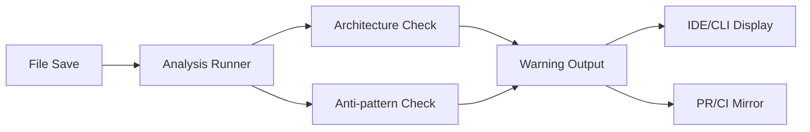

<!-- APS: See https://github.com/EddaCraft/anvil-plan-spec for format reference -->
<!-- This document is non-executable. -->

# Anvil v1 — Save-time Trust

## Overview

Ship a developer-first Anvil v1 that makes AI-generated code safe to merge by
catching **architecture boundary violations** and **AI escape-hatch
anti-patterns** at **file-save time**, with actionable guidance and human-owned
exceptions.

## Problem & Success Criteria

**Problem:** The most damaging recurring failure is second-wave feature work
drifting away from intended patterns because engineers don't know which patterns
apply, don't read ADRs/diagrams, and don't recognise when their change crosses a
boundary.

**Success Criteria:**

- [ ] AI-assisted code throughput increases without longer review cycles
- [ ] Developer confidence in AI-generated code increases
- [ ] New cross-boundary edges per week decreases
- [ ] Save-time feedback latency < 2 seconds (cached)

## Constraints

- Must deliver value without requiring plans/APS as a prerequisite
- Must not hard-block by default (warnings first)
- Must run on Node.js 20+
- Must work with existing ESLint/Prettier tooling

## System Map

## Milestones

### M1: On-save Analysis

- **Target:** Sprint 1-2
- **Includes:** save-time-trust, architecture-safety

### M2: Anti-pattern Detection

- **Target:** Sprint 3
- **Includes:** antipattern-library

### M3: Developer Ergonomics

- **Target:** Sprint 4
- **Includes:** suppressions, drift-reporting

## Modules

| Module                                                      | Scope | Owner | Status | Priority | Dependencies                             |
| ----------------------------------------------------------- | ----- | ----- | ------ | -------- | ---------------------------------------- |
| [save-time-trust](./modules/save-time-trust.aps.md)         | CORE  | —     | Draft  | high     | —                                        |
| [architecture-safety](./modules/architecture-safety.aps.md) | ARCH  | —     | Draft  | high     | save-time-trust                          |
| [antipattern-library](./modules/antipattern-library.aps.md) | ANTI  | —     | Draft  | high     | save-time-trust                          |
| [suppressions](./modules/suppressions.aps.md)               | SUPP  | —     | Draft  | medium   | architecture-safety, antipattern-library |
| [drift-reporting](./modules/drift-reporting.aps.md)         | DRIFT | —     | Draft  | medium   | architecture-safety                      |
| [ide-integration](./modules/ide-integration.aps.md)         | IDE   | —     | Draft  | medium   | save-time-trust                          |
| [ci-integration](./modules/ci-integration.aps.md)           | CI    | —     | Draft  | low      | save-time-trust                          |

## Risks & Mitigations

| Risk                   | Impact | Likelihood | Mitigation                                |
| ---------------------- | ------ | ---------- | ----------------------------------------- |
| Noise kills adoption   | high   | medium     | High-signal first; warn on new edges only |
| Performance too slow   | high   | medium     | Incremental analysis; caching             |
| Over-claiming impact   | medium | medium     | Careful phrasing; show low-confidence     |
| Legacy drift overwhelm | medium | high       | Acknowledge existing; focus on new        |

## Decisions

- **D-001:** Planless-first posture — deliver value without requiring APS plans
- **D-002:** Warnings over blocks — don't hard-block by default
- **D-003:** New edges only — ignore existing legacy drift, focus on new
  violations

## Open Questions

- [ ] First editor integration: VS Code vs CLI-only for v1?
- [ ] Which runtime entry points to support first?
- [ ] Provenance storage format for suppressions?
