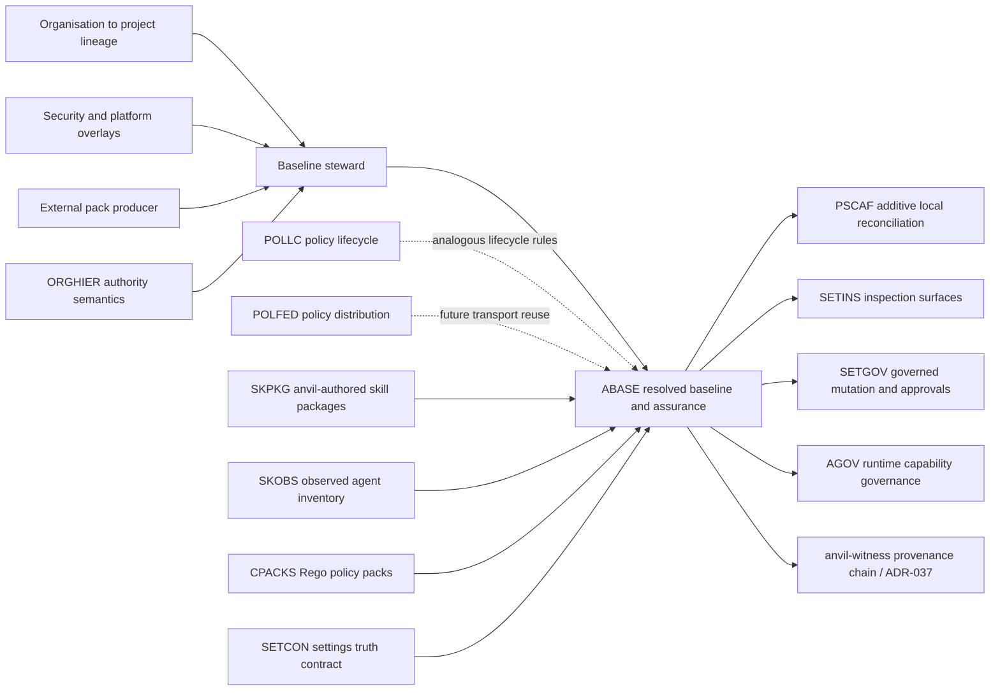

<!-- APS: See https://github.com/eddacraft/anvil-plan-spec for format reference -->
<!-- Executable only if tasks exist and status is Ready. -->

# Agent Baseline Assurance

| ID    | Owner       | Priority | Status |
| ----- | ----------- | -------- | ------ |
| ABASE | @joshuaboys | P1       | Draft  |

**Last reviewed:** 2026-09-16 — operator-approved product and authority design
recorded in the
[ABASE specification](../specs/2026-09-16-agent-baseline-assurance.md) and
[ADR-147](../decisions/147-agent-baseline-governance-composition.md) proposed.
The module remains Draft pending design-partner evidence, ADR acceptance, and
the schema/ownership readiness gates below.

> **Posture:** approved design with Draft delivery slices. This module is not
> executable and contains no authorised Ready work. Promote slices only after
> the design-partner, architecture, schema, and ownership gates in the Ready
> Checklist.

## Purpose

Let an organisation declare the approved agent baseline for a repository,
resolve that baseline from explicitly authorised layers, reconcile its
materialised artefacts without erasing local ownership, and prove which exact
versions were present when work was performed.

The product promise is **agent baseline assurance**: answer, deterministically,
whether a repository has the right agent instructions, skills, agents, hooks,
settings, and referenced policy packs for its governance context, whether they
are current, and what changed when they were reconciled.

## Origin And Demand Signal

An enterprise agentic-engineering lead described an internal system used to
distribute `AGENTS.md` content and skills across an organisation of roughly 900
engineers. Model releases make those assets obsolete quickly; the operational
problem is ensuring every team receives the approved update without destroying
team-owned additions. People shown the internal system reportedly recognise it
as a product, although few enterprises are yet as mature in agentic delivery.

This is evidence of a broad product problem, not evidence that this particular
organisation will buy: it already has an internal solution. The approved first
wedge is coexistence: anvil provides assurance around the existing producer and
distribution path rather than replacing it. Validation must still test that
wedge with the originating mature organisation and at least one less-mature
organisation; one partner must supply representative artefacts for the pilot.

## Product Boundary

anvil consumes and governs **materialised agent baseline packs**. It does not
author neutral skills or compile them into every harness-specific format.

An upstream producer — a customer platform, consultancy delivery system, or a
tool such as Delivery Shadow — may compile neutral source into Codex, Claude,
Cursor, Copilot, OpenCode, or other harness artefacts. anvil begins at the
signed/versioned materialisation boundary and owns:

- trusted source and immutable identity;
- context-specific selection and pinning;
- additive reconciliation into supported surfaces;
- drift, freshness, compatibility, and policy evaluation;
- update planning and governed mutation;
- receipts binding delivered artefacts to work performed under the recorded
  baseline.

This keeps harness translation replaceable and prevents anvil becoming a
general skill authoring system, package marketplace, or internal developer
platform.

## Domain Model

| Term | Meaning |
| ---- | ------- |
| **Installation** | One local anvil installation, which may serve many unrelated contexts. |
| **Principal** | The human or automation identity operating that installation. |
| **Governance context** | The explicit authority graph selected for a repository or worktree. It includes the relevant organisation/engagement and project, never an implicit singleton organisation. |
| **Authority** | An entity allowed to publish or require a layer. Source and authority are distinct: a consultancy may produce an artefact that a customer authority approves. |
| **Layer** | A namespaced contribution owned by one authority and scope, for example organisation, security, business area, pod, team, project, or permitted personal overlay. |
| **Agent baseline pack** | An immutable manifest plus already-materialised artefacts and references, identified by publisher, name, version, and digest. |
| **Projection** | A pack artefact targeted at a specific harness surface such as `AGENTS.md`, a skill directory, an agent definition, hook, or settings fragment. |
| **Resolved baseline** | The deterministic result of resolving all applicable layers and functional overlays for one governance context. |
| **Baseline steward** | The principal or team responsible for composition, slot ordering, publication, and governed conflict resolution. |
| **Receipt** | Evidence of context, authorities, selected pack digests, projections, reconciliation outcomes, exceptions, and observed state. |

There is no installation-wide “current organisation” and no unqualified
“latest”. A repository resolves an explicit governance context; mutable
channels such as `approved` resolve to immutable digests before use.

Roles are logical, not person-count requirements. One principal may be the
organisation authority, security/platform contributor, baseline steward, and
repository owner. The same versioned authority and evidence contract applies;
self-approval does not require fake multi-person ceremony.

## Authority And Composition Contract

- The structural lineage is organisation → business area → pod → team →
  project.
- Security, platform, and other cross-cutting authorities contribute
  independently scoped functional overlays.
- The customer or organisation authority is the trust root. External or
  subordinate authorities contribute through signed, scoped, revocable
  delegation.
- Delegation is add-only by default. Relaxation or replacement needs a
  separately granted capability naming its scope, authority, and expiry.
- A baseline steward operates composition and conflict resolution, but cannot
  silently weaken another authority's requirement.
- Each authority publishes signed immutable versions and may advance its own
  `approved` channel. The steward publishes one immutable resolved composite.
- The tracked descriptor cannot authenticate its own trust root. Its root must
  chain to a pre-established customer anchor, and root rotation is separately
  authorised and auditable.
- Channel movement is owner-authenticated and anti-rollback; the steward's
  composite authenticates its context, authority graph, slot schema,
  contributions, and authority resolutions.
- Applicability comes only from explicit selectors against the tracked
  governance context. Filesystem placement, login identity, and authentication
  order grant no authority.
- A versioned steward-owned slot schema determines document-section order;
  contributors target permitted named slots rather than numeric priorities.

## Layering And Ownership Contract

- Layer order and authority are explicit. Filesystem location, authentication
  order, and whichever account was used first never determine precedence.
- Each managed region and whole artefact is addressed by authority-qualified
  ownership identity, layer, component, and target surface. Publisher identity
  is separate provenance. Empty layers emit nothing unless the contract
  deliberately requires a discoverable placeholder.
- Shared documents use namespaced managed sections. Distinct whole managed
  artefacts coexist; a duplicate skill or agent identity conflicts unless its
  owner explicitly delegates replacement. Skill contents are never merged.
- Local content outside managed regions remains operator-owned. Managed regions
  use stable markers and compare-and-swap semantics rather than whole-file
  replacement.
- A lower authority cannot relax a higher authority's requirement unless the
  higher layer explicitly delegates that capability. Contradictions produce a
  visible conflict, not last-write-wins output.
- Personal or consultancy-wide defaults may add content only where the active
  customer/organisation context permits it. They cannot leak credentials,
  private packs, policy, or evidence across engagements.
- Repository and worktree context selection is inspectable and fail-closed when
  ambiguous. Context and trust-root digests namespace credentials, private
  caches, channel resolutions, policy, and evidence so concurrent and
  sequential contexts cannot carry state between them.
- Governed repository-specific additions are project-layer contributions.
  Ordinary unmanaged prose remains preserved but is not claimed as
  baseline-controlled.

The managed-block technique used by the acknowledgements starter is one valid
projection mechanism, especially for shared documents. It is not the domain
model: whole managed files, directories, settings entries, and references to
other versioned artefacts are also valid projections.

## Assurance Dimensions

anvil must distinguish orthogonal facts rather than collapse them into one
state enum:

| Dimension | Claims |
| --------- | ------ |
| **Selection** | Not required, required, or resolved to an authenticated immutable digest. |
| **Projection** | Missing, installed, stale, drifted, or current. |
| **Composition** | Compatible, incompatible, or conflicted. |
| **Runtime evidence** | Unknown, discoverable, or loaded, with evidence strength and time. |
| **Compliance disposition** | Satisfied, violating, or excepted by a verified grant. |
| **Approval freshness** | Current, cached, expired, revoked, or unknown. |

An exception changes compliance disposition without erasing factual stale or
drifted state. Rego policy may require pack identities, versions, digests, and
compatibility, but policy carries requirements — not the pack payload.
Presence never proves `Loaded`; obedience is outcome evidence outside the ABASE
state machine.

## In Scope

- Explicit multi-organisation and multi-engagement context resolution for one
  installation.
- Layered desired state across organisation, business area, pod, team, project,
  independently selected security/platform functional overlays, and explicitly
  permitted personal scopes.
- Publisher-qualified pack identity, immutable pins, mutable approved channels,
  compatibility metadata, signatures/digests, and provenance.
- Materialised projections for instructions, skills, agents, hooks, settings,
  and references to policy packs.
- Safe plan/apply/update/verify operations using additive per-projection
  reconciliation plus an ABASE transaction coordinator and recovery journal.
- Current, stale, missing, drifted, incompatible, conflicted, excepted, and
  unknown outcomes.
- Reviewable updates, optional automatic update pull requests,
  scoped/expiring exceptions, and receipts that bind the resolved baseline to
  later decision evidence.
- A producer contract that customer and consultancy tooling can implement
  without adopting one authoring system or visual convention.

## Out Of Scope

- Neutral skill authoring or harness-specific skill compilation.
- A public skill marketplace, arbitrary package manager, or generic template
  engine.
- Source-code scaffolding, cloud-resource provisioning, service catalogues, or
  CI/CD orchestration.
- Silent fleet-wide rewriting; fleet remediation remains reviewable and
  policy-governed.
- Claiming an agent obeyed instructions merely because files were present.
- Hosted identity, secret storage, or cross-customer trust brokerage.
- Replacing Delivery Shadow or customer-specific producers that create the
  materialised artefacts.

## Relationship Map

| Module/surface | Owns | Relationship to ABASE |
| -------------- | ---- | --------------------- |
| [Project Scaffolding](./project-scaffolding.aps.md) (PSCAF) | Typed local component catalogue and additive, race-safe reconciliation. | ABASE supplies context-resolved desired state; PSCAF is the mutation substrate. PSCAF does not own organisations, packs, channels, or fleet state. |
| [Organisational Policy Hierarchy](./org-policy-hierarchy.aps.md) (ORGHIER) | Authority, selectors, inheritance, conflicts, and override permissions for Rego policy. | Coordinate one authority model. ABASE generalises layering to agent artefacts; it must not invent incompatible precedence. The Aidan signal is candidate demand evidence, not automatic promotion. |
| [Policy Lifecycle](./policy-lifecycle.aps.md) (POLLC) | Draft/canary/active/deprecated/retired lifecycle for policy versions. | Reuse lifecycle vocabulary and rollout invariants where they generalise; do not pretend agent baseline packs are Rego policy packs. |
| [Policy Federation](./policy-federation.aps.md) (POLFED) | Pull-based publication and distribution of policy packs within one organisation. | Initial ABASE consumes local/materialised packs. Future remote distribution may reuse transport and approval patterns; multi-organisation context remains an ABASE prerequisite, not a POLFED assumption. |
| [Skill Packaging & Distribution](./skill-packaging-distribution.aps.md) (SKPKG) | anvil-authored, binary-bundled customer skills and the typed client registry/install safety. | Reuse target-client, managed-install, and manifest contracts. ABASE owns externally produced organisation/customer packs and must not absorb SKPKG's bundled-product catalogue or fork its skill manifest. |
| [Skill Discovery & Observability](./skill-discovery-observability.aps.md) (SKOBS) | Observed inventory, hashes, sources, changes, and suspicious-pattern signals. | SKOBS supplies observed state; ABASE supplies desired state and comparison. Their manifests must compose rather than compete, and cross-harness inventory must replace Claude-only assumptions before load-bearing use. |
| [Compliance Policy Packs](./compliance-policy-packs.aps.md) (CPACKS) | Rego policy content and its fixtures/install contract. | A baseline pack may require a CPACKS identity/digest by reference. ABASE never owns or embeds the policy's semantic content. |
| Settings truth and inspection (SETCON/SETINS) | Canonical configured/resolved/evidenced-active distinctions and their read surfaces. | ABASE must expose state through the canonical truth contract; SETINS renders that state and never recomputes it. |
| [Settings Governed Changes](./settings-governed-changes.aps.md) (SETGOV) | Proposals, approvals, activation verification, and audit for protection-affecting mutations. | ABASE update/apply should reuse this workflow when pack changes affect protection; it must not create a second approval mechanism. |
| [Git-native Exceptions](./git-native-exceptions.aps.md) (EXCEPT) | Scoped, expiring, auditable exceptions. | Missing/stale/drifted baseline requirements use EXCEPT rather than permanent hidden skips. |
| [Agent Governance Patterns](./agent-governance-patterns.aps.md) (AGOV) | Runtime capability, trust, destructive-pattern, and audit signals. | ABASE proves what agent material was supplied; AGOV governs what the agent may do. Distribution is not runtime enforcement. |
| [`anvil-witness`](../../crates/anvil-witness/) and [ADR-037](../decisions/037-witness-chain-and-l4-policy.md) | Canonical append-only, hash-chained provenance ledger and DAG verification. | ABASE receipts must extend the existing `WitnessLine`/witness-chain contract, or reference companion evidence from it, to bind governance context and immutable pack digests to later work without claiming behavioural obedience. ABASE must not create a parallel provenance store; AGOV-006 follows the same extension rule. |

## Candidate First Slice

The earliest product-learning checkpoint is read-only, using partner-owned
materialised artefacts:

1. Define and validate the governance-context, delegation, materialised-pack,
   and trust contracts.
2. Resolve structural layers and functional overlays for an explicit
   repository context to one immutable composite digest.
3. Inspect one namespaced managed document section and one managed skill
   directory while preserving unmanaged content.
4. Report orthogonal freshness, composition, runtime-evidence, compliance, and
   approval facts and emit a reviewable update plan without mutation.

The later integrated pilot adds transactional mutation, exceptions, receipts,
witness binding, and concurrent/sequential isolation across two distinct
governance contexts. It must reject substituted trust roots, replayed channel
statements, revoked delegations, symlink/path escape, and unprovable recovery.

Fleet dashboards, remote publication, automatic pull requests, and broad
harness coverage follow only after this local contract is boringly reliable.

## Work Items

These slices record the approved decomposition but are not executable while the
module is Draft. Before promotion, each slice requires exact implementation
homes, runnable validation commands, closed dependencies, and an APS truth
check.

### ABASE-001: Governance context and authority graph

- **Status:** Draft
- **Intent:** Define the tracked context descriptor, structural hierarchy,
  functional overlays, trust bootstrap/rotation, delegations, steward
  authority, selectors, and digest-namespaced context isolation.
- **Expected Outcome:** Deterministic fixtures resolve a one-person context and
  a multi-authority context; self-authenticating roots, ambiguous context,
  unauthorised relaxation, and concurrent/sequential cross-context state reuse
  fail closed.
- **Validation:** Draft intent: schema, root-rotation, and context-isolation
  fixtures; exact commands are required before Ready promotion.
- **Dependencies:** None.
- **Readiness gates:** ADR-147 accepted; design-partner context fixtures.

### ABASE-002: Shared component identity and signed pack contract

- **Status:** Draft
- **Intent:** Define the neutral component identity shared with SKPKG/SKOBS and
  the ABASE manifest, signature, digest, compatibility, selector, and producer
  conformance contract.
- **Expected Outcome:** Authority-qualified ownership remains distinct from
  publisher provenance. A producer fixture proves valid materialised document
  and skill projections; mutation, untrusted publisher, duplicate ownership,
  and incompatible target cases are deterministic.
- **Validation:** Draft intent: manifest conformance and tamper fixtures; exact
  commands are required before Ready promotion.
- **Dependencies:** ABASE-001; SKPKG/SKOBS ownership review.

### ABASE-003: Composite baseline resolver

- **Status:** Draft
- **Intent:** Resolve exact pins and `approved` channels across structural
  layers and functional overlays into one immutable composite with a
  steward-owned slot schema.
- **Expected Outcome:** The steward-authenticated composite binds context,
  authority graph, slot schema, contributions, and resolutions. Authenticated
  anti-rollback channels reject replay, unauthorised rollback, expiry, and
  revoked delegation while preserving valid-at-resolution evidence.
- **Validation:** Draft intent: deterministic resolver, contradiction,
  channel-continuity, and revocation fixtures; exact commands are required
  before Ready promotion.
- **Dependencies:** ABASE-001, ABASE-002; ORGHIER/POLLC semantics review.

### ABASE-004: Read-only assurance report

- **Status:** Draft
- **Intent:** Compare the resolved baseline with observed repository state.
- **Expected Outcome:** Machine and human projections report orthogonal
  selection, projection, composition, runtime-evidence,
  compliance-disposition, and approval-freshness facts without strengthening
  weak evidence or treating an exception as factual currency.
- **Validation:** Draft intent: dimension cross-product and evidence-strength
  fixtures; exact commands are required before Ready promotion.
- **Dependencies:** ABASE-003.
- **Readiness gates:** SKOBS observed-state contract; ADR-132 compliance.

### ABASE-005: Read-only design-partner checkpoint

- **Status:** Draft
- **Intent:** Test the core freshness outcome before mutation hardening with
  representative partner-owned materialised artefacts.
- **Expected Outcome:** One repository resolves organisation/team plus
  security/platform contributions, inspects an `AGENTS.md` or README section
  and a skill directory, and emits a useful reviewable update plan.
- **Validation:** Draft intent: recorded partner walkthrough and deterministic
  read-only fixture replay; exact commands are required before Ready promotion.
- **Dependencies:** ABASE-001..004.
- **Readiness gates:** Recorded design-partner artefacts and pilot commitment.

### ABASE-006: Transaction coordinator and recovery journal

- **Status:** Draft
- **Intent:** Coordinate a durable all-or-nothing operation above PSCAF's
  per-projection compare-and-swap adapters.
- **Expected Outcome:** Crash, adapter failure, and external-writer races either
  restore every verified prior projection or report an indeterminate partial
  state that blocks further mutation pending repair.
- **Validation:** Draft intent: crash-point, concurrent-writer, rollback, and
  recovery fixtures; exact commands are required before Ready promotion.
- **Dependencies:** ABASE-003, ABASE-004.
- **Readiness gates:** PSCAF adapter and lock-boundary review.

### ABASE-007: Managed document-section projection

- **Status:** Draft
- **Intent:** Adapt resolved namespaced sections to PSCAF's additive,
  race-safe reconciliation substrate and the ABASE transaction coordinator.
- **Expected Outcome:** Managed `AGENTS.md` and README sections render in slot
  order, preserve unmanaged prose, refuse local drift, remain workspace-bound,
  and reject symlinked targets/components without check-then-write races.
- **Validation:** Draft intent: golden projections, conflict, containment,
  symlink-race, and transaction-recovery fixtures; exact commands are required
  before Ready promotion.
- **Dependencies:** ABASE-003, ABASE-004, ABASE-006.
- **Readiness gates:** PSCAF managed-section adapter review.

### ABASE-008: Managed skill-directory projection

- **Status:** Draft
- **Intent:** Reconcile whole managed skill directories without merging files
  or overwriting unowned content.
- **Expected Outcome:** Distinct authority-qualified identities coexist;
  duplicate ownership, modified managed content, path/symlink escape, and
  unauthorised replacement produce reviewable conflicts.
- **Validation:** Draft intent: managed-directory ownership, conflict,
  containment, symlink-race, and recovery fixtures; exact commands are required
  before Ready promotion.
- **Dependencies:** ABASE-002..004, ABASE-006.
- **Readiness gates:** PSCAF and SKPKG adapter review.

### ABASE-009: Baseline exception mapping

- **Status:** Draft
- **Intent:** Map baseline deviations onto EXCEPT without creating a second
  exception authority or store.
- **Expected Outcome:** Only the requirement owner or a scoped, expiring
  delegated exception capability can approve a deviation; wrong-authority,
  uncommitted, revoked, expired, unreadable, and out-of-scope grants fail safe.
- **Validation:** Draft intent: exception authority and committed-tip fixtures;
  exact commands are required before Ready promotion.
- **Dependencies:** ABASE-004.
- **Readiness gates:** EXCEPT owner review.

### ABASE-010: Baseline receipt schema and verification

- **Status:** Draft
- **Intent:** Define the content-addressed companion receipt independently of
  witness-envelope integration.
- **Expected Outcome:** Receipts verifiably bind context, authority graph,
  composite and component digests, channel evidence, projection outcomes,
  reconciliation, exceptions, partiality, and unknowns without claiming
  authentication or obedience.
- **Validation:** Draft intent: schema, digest, tamper, and partiality fixtures;
  exact commands are required before Ready promotion.
- **Dependencies:** ABASE-004, ABASE-006, ABASE-009.

### ABASE-011: Witness binding of baseline receipts

- **Status:** Draft
- **Intent:** Reference a verified baseline-receipt digest and location from
  the canonical ADR-037 witness envelope.
- **Expected Outcome:** Later work is provenance-bound to its baseline receipt
  without a parallel ledger or semantic duplication in the witness envelope.
- **Validation:** Draft intent: witness schema-version, missing receipt,
  mismatched digest, and chain-verification fixtures; exact commands are
  required before Ready promotion.
- **Dependencies:** ABASE-010.
- **Readiness gates:** Witness owner and ADR-037 compatibility review.

### ABASE-012: Transactional pilot and context-isolation gate

- **Status:** Draft
- **Intent:** Exercise the integrated local contract with representative
  partner artefacts, two governance contexts, one document section, and one
  skill.
- **Expected Outcome:** Apply is all-or-nothing or visibly indeterminate; the
  same contract works for one and many principals; concurrent and sequential
  contexts cannot share private artefacts, credentials, channels, policy, or
  evidence; trust substitution, replay, revocation, and path escape fail safe.
- **Validation:** Draft intent: end-to-end partner pilot, context concurrency,
  trust/channel attacks, and forced-failure recovery; exact commands are
  required before Ready promotion.
- **Dependencies:** ABASE-001..011.
- **Readiness gates:** Recorded design-partner integrated-pilot commitment.

### ABASE-013: Automatic update pull-request projection

- **Status:** Draft
- **Intent:** After the local pilot, optionally publish the reviewable update
  plan as a pull request without changing the default read-only posture.
- **Expected Outcome:** Policy selects report-only or pull-request mode;
  generated changes remain bound to the authenticated composite and
  transactional reconciliation contract.
- **Validation:** Draft intent: Git-host integration and credential-boundary
  fixtures; exact commands are required before Ready promotion.
- **Dependencies:** ABASE-012.
- **Readiness gates:** Separate Git-host and credential boundary review.

## Ready Checklist

- [ ] Revalidate coexistence and baseline-steward ownership with the original
      enterprise contact.
- [ ] Interview at least one less-mature enterprise to test whether the need is
      present before bespoke internal machinery already exists.
- [ ] Accept
      [ADR-147](../decisions/147-agent-baseline-governance-composition.md) for
      governance context, authority composition, trust roots, and
      cross-context isolation.
- [x] Decide customer terminology: **approved agent baseline** externally;
      **pack** remains an internal implementation term.
- [ ] Define the materialised pack schema, signature/digest rules, compatibility
      contract, and producer conformance fixture.
- [ ] Reconcile the pack manifest with SKPKG/SKOBS so skill identity, source,
      version, capability, and observed-state fields compose without a second
      canonical schema.
- [ ] Reconcile ABASE layering with ORGHIER and lifecycle semantics with POLLC.
- [ ] Confirm PSCAF can accept externally resolved desired components without
      becoming a fleet or package manager.
- [x] Define orthogonal selection/projection/composition/runtime/compliance/
      approval-freshness dimensions and keep “obeyed” outside the ABASE state
      machine in the approved spec.
- [ ] Review the proposed ABASE receipt extension against ADR-037 and
      `crates/anvil-witness`, including how any companion evidence is
      content-addressed from the canonical witness chain.
- [x] Decompose the accepted first slice into independently verifiable Draft
      delivery slices.
- [ ] Add exact implementation homes and validation commands, then promote
      executable items explicitly.

## Open Questions

- Does the originating platform team confirm the structural hierarchy,
  functional overlays, baseline-steward role, and coexistence wedge?
- Does a less-mature organisation experience the same freshness problem before
  it has built bespoke distribution machinery?
- Which exact component fields can SKPKG, SKOBS, and ABASE share without moving
  desired-state ownership into the observed inventory?
- Which PSCAF primitive should own managed section and managed directory
  compare-and-swap semantics?
- Which direct runtime evidence, if any, can prove a harness loaded a
  projection without surveillance or false confidence?
- Which Git-host boundary and credentials are acceptable for the optional
  automatic update pull request after the local pilot passes?

## Approved Design Positions Pending ADR Acceptance

- **P-ABASE-001:** anvil governs materialised packs; upstream systems own
  neutral authoring and harness compilation.
- **P-ABASE-002:** one installation supports multiple explicit governance
  contexts; there is no implicit global organisation.
- **P-ABASE-003:** pack versions resolve to immutable digests and become
  provenance inputs.
- **P-ABASE-004:** managed document blocks are one projection mechanism, not
  the product boundary.
- **P-ABASE-005:** initial value is deterministic assurance and safe local
  reconciliation; fleet distribution is a later, separately gated layer.
- **P-ABASE-006:** organisation/business-area/pod/team/project is the structural
  lineage; security/platform contributors are functional overlays.
- **P-ABASE-007:** a governed baseline steward composes and resolves conflicts
  but cannot silently relax another authority's requirement.
- **P-ABASE-008:** stale repositories receive a reviewable update plan by
  default; automatic pull requests are optional; direct fleet rewriting is not
  the default.
- **P-ABASE-009:** the tracked context cannot authenticate its own trust root;
  channel movement and composites are authenticated and anti-rollback.
- **P-ABASE-010:** authority-qualified ownership is distinct from publisher
  provenance.
- **P-ABASE-011:** assurance facts are orthogonal; exceptions change compliance
  disposition without erasing stale or drifted observations.

## Designs

- [Agent baseline assurance](../specs/2026-09-16-agent-baseline-assurance.md)
  (Final, operator-approved 2026-09-16)
- [ADR-147: Agent baseline governance composition](../decisions/147-agent-baseline-governance-composition.md)
  (Proposed)
